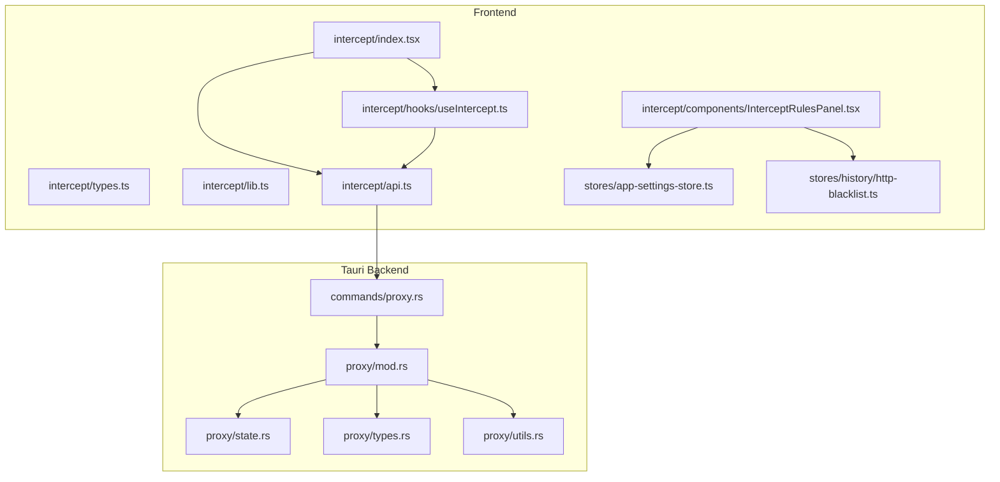
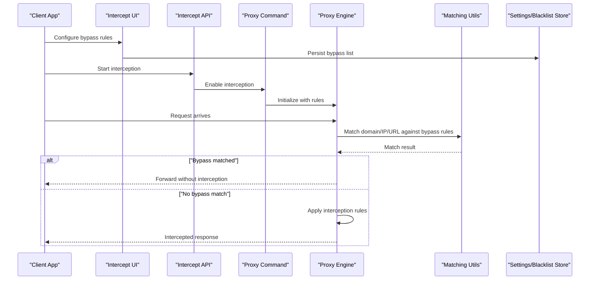
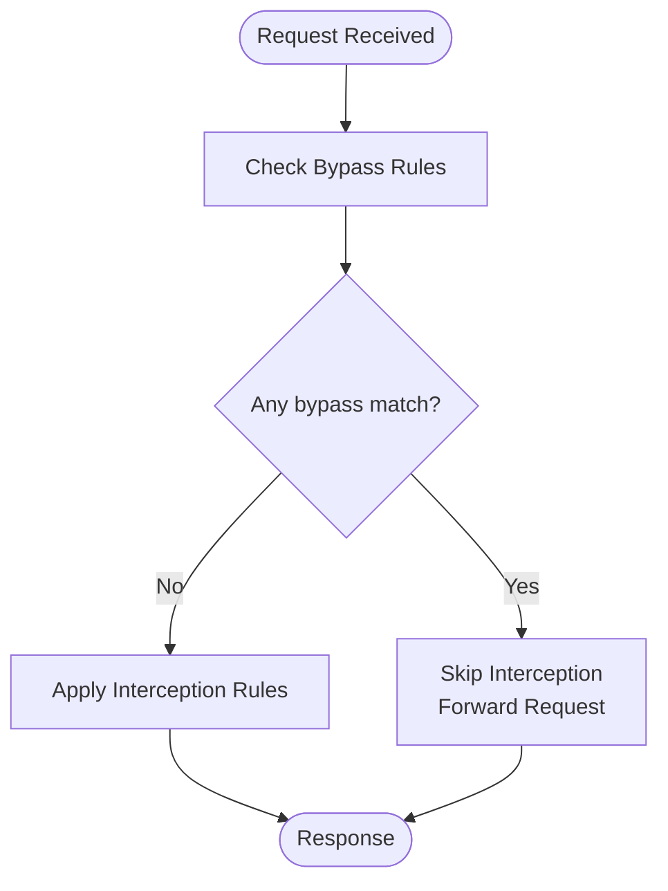
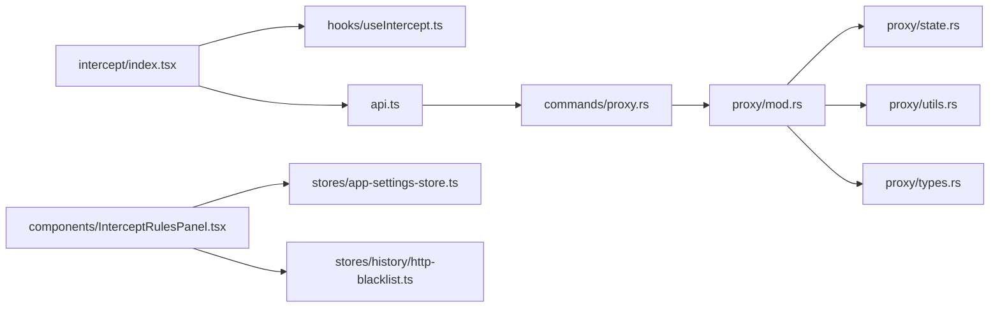

# Bypass & Exclusion Rules

<cite>
**Referenced Files in This Document**
- [proxy.ts](file://docs/website/proxy.ts)
- [intercept/index.tsx](file://src/pages/intercept/index.tsx)
- [intercept/types.ts](file://src/pages/intercept/types.ts)
- [intercept/lib.ts](file://src/pages/intercept/lib.ts)
- [intercept/api.ts](file://src/pages/intercept/api.ts)
- [intercept/hooks/useIntercept.ts](file://src/pages/intercept/hooks/useIntercept.ts)
- [intercept/components/InterceptRulesPanel.tsx](file://src/pages/intercept/components/InterceptRulesPanel.tsx)
- [stores/app-settings-store.ts](file://src/stores/app-settings-store.ts)
- [stores/history/http-blacklist.ts](file://src/stores/history/http-blacklist.ts)
- [src-tauri/src/proxy/mod.rs](file://src-tauri/src/proxy/mod.rs)
- [src-tauri/src/proxy/state.rs](file://src-tauri/src/proxy/state.rs)
- [src-tauri/src/proxy/types.rs](file://src-tauri/src/proxy/types.rs)
- [src-tauri/src/proxy/utils.rs](file://src-tauri/src/proxy/utils.rs)
- [src-tauri/src/commands/proxy.rs](file://src-tauri/src/commands/proxy.rs)
</cite>

## Table of Contents
1. [Introduction](#introduction)
2. [Project Structure](#project-structure)
3. [Core Components](#core-components)
4. [Architecture Overview](#architecture-overview)
5. [Detailed Component Analysis](#detailed-component-analysis)
6. [Dependency Analysis](#dependency-analysis)
7. [Performance Considerations](#performance-considerations)
8. [Troubleshooting Guide](#troubleshooting-guide)
9. [Conclusion](#conclusion)
10. [Appendices](#appendices)

## Introduction
This document explains how to configure bypass and exclusion rules in Apprecon’s interception system so that specific domains, IP addresses, or URL patterns are not intercepted. It covers rule precedence (how interception rules interact with bypass rules), common scenarios such as CDN traffic, analytics endpoints, and third-party APIs, and practical troubleshooting techniques to identify unintended interceptions.

## Project Structure
Apprecon implements interception and proxying across both the frontend UI and the Tauri backend:
- Frontend pages and hooks manage user-facing configuration for interception and display captured traffic.
- The Tauri proxy layer enforces interception logic and applies bypass rules at runtime.
- Configuration is persisted via app settings and history stores.

**Diagram sources**
- [intercept/index.tsx](file://src/pages/intercept/index.tsx)
- [intercept/types.ts](file://src/pages/intercept/types.ts)
- [intercept/lib.ts](file://src/pages/intercept/lib.ts)
- [intercept/api.ts](file://src/pages/intercept/api.ts)
- [intercept/hooks/useIntercept.ts](file://src/pages/intercept/hooks/useIntercept.ts)
- [intercept/components/InterceptRulesPanel.tsx](file://src/pages/intercept/components/InterceptRulesPanel.tsx)
- [stores/app-settings-store.ts](file://src/stores/app-settings-store.ts)
- [stores/history/http-blacklist.ts](file://src/stores/history/http-blacklist.ts)
- [src-tauri/src/proxy/mod.rs](file://src-tauri/src/proxy/mod.rs)
- [src-tauri/src/proxy/state.rs](file://src-tauri/src/proxy/state.rs)
- [src-tauri/src/proxy/types.rs](file://src-tauri/src/proxy/types.rs)
- [src-tauri/src/proxy/utils.rs](file://src-tauri/src/proxy/utils.rs)
- [src-tauri/src/commands/proxy.rs](file://src-tauri/src/commands/proxy.rs)

**Section sources**
- [proxy.ts](file://docs/website/proxy.ts)
- [intercept/index.tsx](file://src/pages/intercept/index.tsx)
- [intercept/types.ts](file://src/pages/intercept/types.ts)
- [intercept/lib.ts](file://src/pages/intercept/lib.ts)
- [intercept/api.ts](file://src/pages/intercept/api.ts)
- [intercept/hooks/useIntercept.ts](file://src/pages/intercept/hooks/useIntercept.ts)
- [intercept/components/InterceptRulesPanel.tsx](file://src/pages/intercept/components/InterceptRulesPanel.tsx)
- [stores/app-settings-store.ts](file://src/stores/app-settings-store.ts)
- [stores/history/http-blacklist.ts](file://src/stores/history/http-blacklist.ts)
- [src-tauri/src/proxy/mod.rs](file://src-tauri/src/proxy/mod.rs)
- [src-tauri/src/proxy/state.rs](file://src-tauri/src/proxy/state.rs)
- [src-tauri/src/proxy/types.rs](file://src-tauri/src/proxy/types.rs)
- [src-tauri/src/proxy/utils.rs](file://src-tauri/src/proxy/utils.rs)
- [src-tauri/src/commands/proxy.rs](file://src-tauri/src/commands/proxy.rs)

## Core Components
- Interception UI and state:
  - Intercept page and hooks provide controls to enable/disable interception and view captured requests.
  - Types define request metadata used by interception logic.
- Proxy enforcement:
  - Tauri proxy module coordinates interception decisions, including bypass checks.
  - State and types model active interception and bypass configurations.
  - Utilities implement matching logic for domains, IPs, and URL patterns.
- Settings and blacklist:
  - App settings store persists global options related to interception behavior.
  - HTTP blacklist store manages lists of excluded hosts/patterns.

Key responsibilities:
- Define and persist bypass rules (domains, IPs, URL patterns).
- Evaluate interception vs. bypass on each request.
- Provide UI to add/edit/remove bypass entries.

**Section sources**
- [intercept/index.tsx](file://src/pages/intercept/index.tsx)
- [intercept/types.ts](file://src/pages/intercept/types.ts)
- [intercept/lib.ts](file://src/pages/intercept/lib.ts)
- [intercept/api.ts](file://src/pages/intercept/api.ts)
- [intercept/hooks/useIntercept.ts](file://src/pages/intercept/hooks/useIntercept.ts)
- [intercept/components/InterceptRulesPanel.tsx](file://src/pages/intercept/components/InterceptRulesPanel.tsx)
- [stores/app-settings-store.ts](file://src/stores/app-settings-store.ts)
- [stores/history/http-blacklist.ts](file://src/stores/history/http-blacklist.ts)
- [src-tauri/src/proxy/mod.rs](file://src-tauri/src/proxy/mod.rs)
- [src-tauri/src/proxy/state.rs](file://src-tauri/src/proxy/state.rs)
- [src-tauri/src/proxy/types.rs](file://src-tauri/src/proxy/types.rs)
- [src-tauri/src/proxy/utils.rs](file://src-tauri/src/proxy/utils.rs)
- [src-tauri/src/commands/proxy.rs](file://src-tauri/src/commands/proxy.rs)

## Architecture Overview
The interception pipeline evaluates whether a request should be intercepted or bypassed based on configured rules. Bypass rules take precedence over interception rules to ensure critical services are not disrupted.

**Diagram sources**
- [intercept/index.tsx](file://src/pages/intercept/index.tsx)
- [intercept/api.ts](file://src/pages/intercept/api.ts)
- [src-tauri/src/commands/proxy.rs](file://src-tauri/src/commands/proxy.rs)
- [src-tauri/src/proxy/mod.rs](file://src-tauri/src/proxy/mod.rs)
- [src-tauri/src/proxy/utils.rs](file://src-tauri/src/proxy/utils.rs)
- [stores/app-settings-store.ts](file://src/stores/app-settings-store.ts)
- [stores/history/http-blacklist.ts](file://src/stores/history/http-blacklist.ts)

## Detailed Component Analysis

### Bypass Rule Evaluation Flow
Bypass rules are evaluated before interception rules. If any bypass condition matches, the request is forwarded directly without interception.

**Diagram sources**
- [src-tauri/src/proxy/mod.rs](file://src-tauri/src/proxy/mod.rs)
- [src-tauri/src/proxy/utils.rs](file://src-tauri/src/proxy/utils.rs)

**Section sources**
- [src-tauri/src/proxy/mod.rs](file://src-tauri/src/proxy/mod.rs)
- [src-tauri/src/proxy/utils.rs](file://src-tauri/src/proxy/utils.rs)

### Precedence Between Interception and Bypass Rules
- Bypass rules have higher precedence than interception rules.
- If a request matches any bypass rule, interception is skipped entirely.
- Only when no bypass rule matches does the engine apply interception rules.

Practical implications:
- Always define broad exclusions first (e.g., CDN domains).
- Use precise patterns for sensitive endpoints to avoid accidental interception.

**Section sources**
- [src-tauri/src/proxy/mod.rs](file://src-tauri/src/proxy/mod.rs)
- [src-tauri/src/proxy/types.rs](file://src-tauri/src/proxy/types.rs)

### Common Bypass Scenarios
- CDN traffic: Exclude known CDN hostnames or IP ranges to prevent unnecessary interception.
- Analytics endpoints: Exclude tracking domains to avoid skewing metrics or violating privacy policies.
- Third-party APIs: Exclude payment gateways, SMS providers, or external SDKs to maintain reliability.

Configuration tips:
- Prefer exact domain matches for critical services.
- Use URL path patterns for specific endpoints within otherwise intercepted domains.
- Maintain an allowlist-style approach for high-risk services.

**Section sources**
- [stores/history/http-blacklist.ts](file://src/stores/history/http-blacklist.ts)
- [intercept/components/InterceptRulesPanel.tsx](file://src/pages/intercept/components/InterceptRulesPanel.tsx)

### Troubleshooting Unintended Interceptions
Techniques:
- Inspect live traffic to confirm whether a request was intercepted or bypassed.
- Temporarily disable interception to isolate issues.
- Add targeted bypass rules for suspected false positives.
- Validate pattern specificity to avoid overly broad matches.

Diagnostic steps:
- Review captured requests for unexpected interception markers.
- Check settings and blacklist entries for recent changes.
- Use logging in the proxy engine to trace decision paths.

**Section sources**
- [intercept/index.tsx](file://src/pages/intercept/index.tsx)
- [stores/app-settings-store.ts](file://src/stores/app-settings-store.ts)
- [src-tauri/src/proxy/mod.rs](file://src-tauri/src/proxy/mod.rs)

## Dependency Analysis
The following diagram shows key dependencies between frontend components, stores, and backend modules involved in bypass and interception logic.

**Diagram sources**
- [intercept/index.tsx](file://src/pages/intercept/index.tsx)
- [intercept/hooks/useIntercept.ts](file://src/pages/intercept/hooks/useIntercept.ts)
- [intercept/api.ts](file://src/pages/intercept/api.ts)
- [intercept/components/InterceptRulesPanel.tsx](file://src/pages/intercept/components/InterceptRulesPanel.tsx)
- [stores/app-settings-store.ts](file://src/stores/app-settings-store.ts)
- [stores/history/http-blacklist.ts](file://src/stores/history/http-blacklist.ts)
- [src-tauri/src/commands/proxy.rs](file://src-tauri/src/commands/proxy.rs)
- [src-tauri/src/proxy/mod.rs](file://src-tauri/src/proxy/mod.rs)
- [src-tauri/src/proxy/state.rs](file://src-tauri/src/proxy/state.rs)
- [src-tauri/src/proxy/utils.rs](file://src-tauri/src/proxy/utils.rs)
- [src-tauri/src/proxy/types.rs](file://src-tauri/src/proxy/types.rs)

**Section sources**
- [intercept/index.tsx](file://src/pages/intercept/index.tsx)
- [intercept/hooks/useIntercept.ts](file://src/pages/intercept/hooks/useIntercept.ts)
- [intercept/api.ts](file://src/pages/intercept/api.ts)
- [intercept/components/InterceptRulesPanel.tsx](file://src/pages/intercept/components/InterceptRulesPanel.tsx)
- [stores/app-settings-store.ts](file://src/stores/app-settings-store.ts)
- [stores/history/http-blacklist.ts](file://src/stores/history/http-blacklist.ts)
- [src-tauri/src/commands/proxy.rs](file://src-tauri/src/commands/proxy.rs)
- [src-tauri/src/proxy/mod.rs](file://src-tauri/src/proxy/mod.rs)
- [src-tauri/src/proxy/state.rs](file://src-tauri/src/proxy/state.rs)
- [src-tauri/src/proxy/utils.rs](file://src-tauri/src/proxy/utils.rs)
- [src-tauri/src/proxy/types.rs](file://src-tauri/src/proxy/types.rs)

## Performance Considerations
- Keep bypass rules concise and specific to minimize matching overhead.
- Avoid overly broad patterns that could cause frequent re-evaluations.
- Batch updates to bypass lists where possible to reduce churn.
- Monitor memory usage if maintaining large rule sets.

[No sources needed since this section provides general guidance]

## Troubleshooting Guide
Common issues and resolutions:
- Requests unexpectedly intercepted:
  - Verify bypass rules do not conflict with interception patterns.
  - Temporarily disable interception to confirm baseline behavior.
- Analytics or CDN traffic still intercepted:
  - Add explicit domain or path-based bypass rules.
  - Ensure case-insensitive matching if required.
- Intermittent failures:
  - Check network conditions and upstream service availability.
  - Review logs for timeout or connection errors.

Debugging aids:
- Use live traffic inspection to validate interception status.
- Add temporary logging in the proxy engine to trace decision paths.
- Validate rule syntax and scope to prevent unintended matches.

**Section sources**
- [intercept/index.tsx](file://src/pages/intercept/index.tsx)
- [stores/app-settings-store.ts](file://src/stores/app-settings-store.ts)
- [src-tauri/src/proxy/mod.rs](file://src-tauri/src/proxy/mod.rs)

## Conclusion
Bypass and exclusion rules are essential for ensuring Apprecon’s interception system operates reliably without disrupting critical services. By understanding precedence, crafting precise rules, and employing effective troubleshooting techniques, users can maintain accurate traffic analysis while avoiding interference with CDNs, analytics, and third-party APIs.

[No sources needed since this section summarizes without analyzing specific files]

## Appendices
- Best practices:
  - Start with broad exclusions for well-known services.
  - Refine rules incrementally based on observed traffic.
  - Document custom rules for team collaboration.
- References:
  - Proxy configuration and state management in Tauri backend.
  - Frontend UI components for managing interception and bypass rules.

[No sources needed since this section provides general guidance]