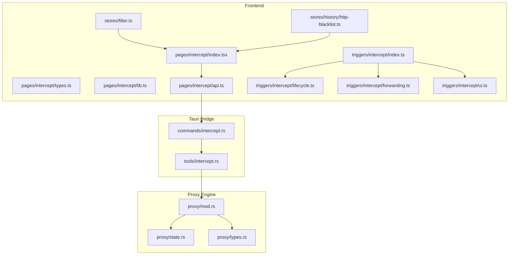
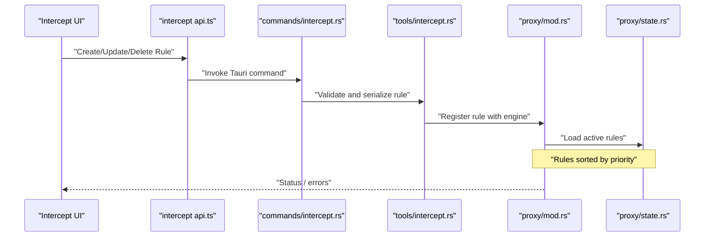
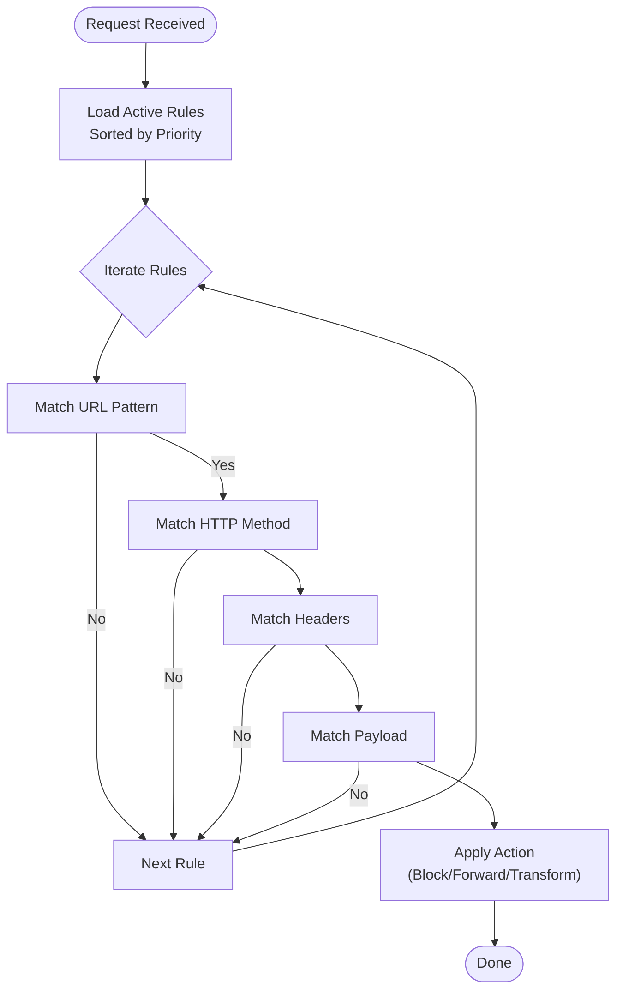
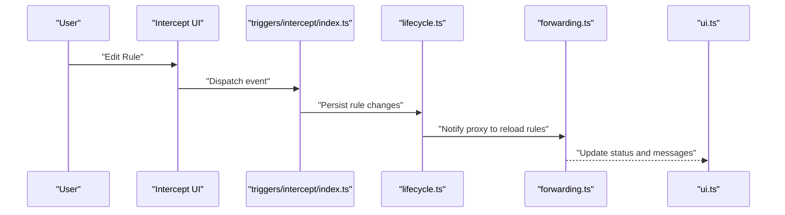
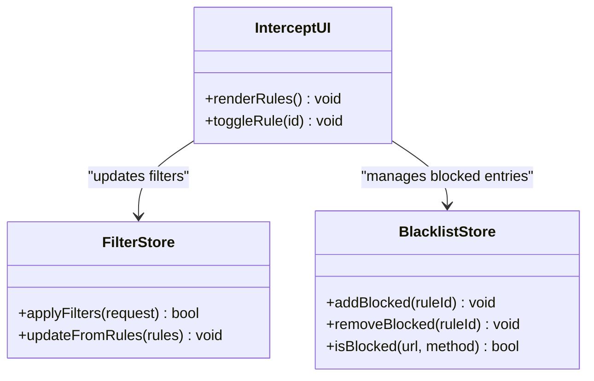
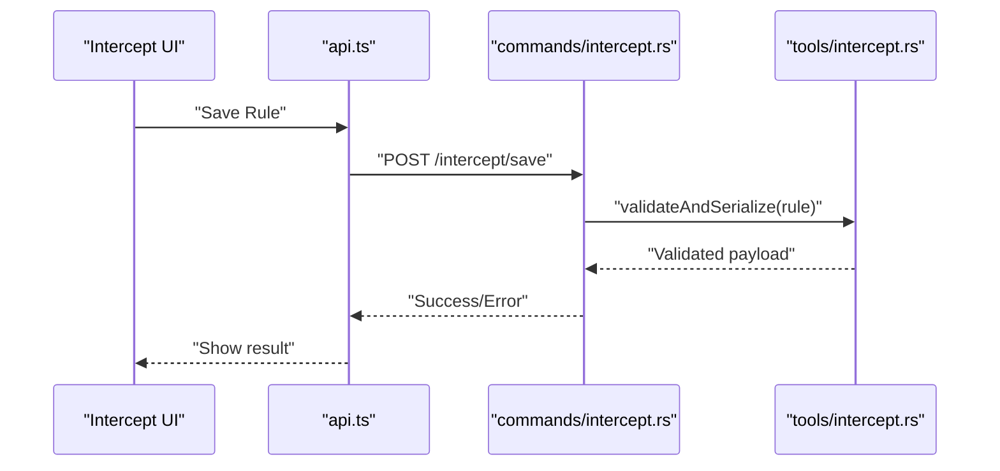
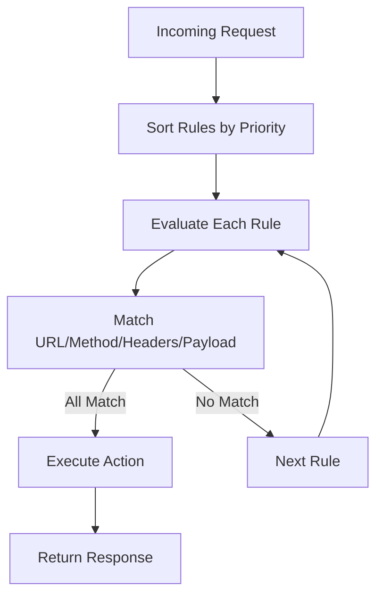
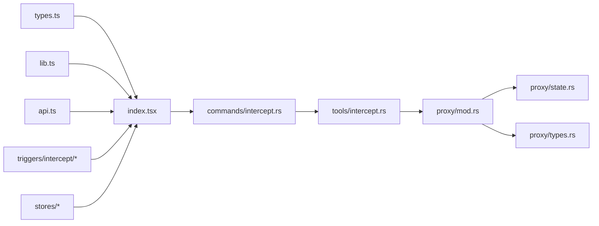

# Interception Rules & Configuration

<cite>
**Referenced Files in This Document**
- [intercept/index.tsx](file://src/pages/intercept/index.tsx)
- [intercept/types.ts](file://src/pages/intercept/types.ts)
- [intercept/lib.ts](file://src/pages/intercept/lib.ts)
- [intercept/api.ts](file://src/pages/intercept/api.ts)
- [triggers/intercept/index.ts](file://src/triggers/intercept/index.ts)
- [triggers/intercept/lifecycle.ts](file://src/triggers/intercept/lifecycle.ts)
- [triggers/intercept/forwarding.ts](file://src/triggers/intercept/forwarding.ts)
- [triggers/intercept/ui.ts](file://src/triggers/intercept/ui.ts)
- [stores/filter.ts](file://src/stores/filter.ts)
- [stores/history/http-blacklist.ts](file://src/stores/history/http-blacklist.ts)
- [src-tauri/src/proxy/mod.rs](file://src-tauri/src/proxy/mod.rs)
- [src-tauri/src/proxy/state.rs](file://src-tauri/src/proxy/state.rs)
- [src-tauri/src/proxy/types.rs](file://src-tauri/src/proxy/types.rs)
- [src-tauri/src/commands/intercept.rs](file://src-tauri/src/commands/intercept.rs)
- [src-tauri/src/tools/intercept.rs](file://src-tauri/src/tools/intercept.rs)
</cite>

## Table of Contents
1. Introduction
2. Project Structure
3. Core Components
4. Architecture Overview
5. Detailed Component Analysis
6. Dependency Analysis
7. Performance Considerations
8. Troubleshooting Guide
9. Conclusion

## Introduction
This document explains Apprecon’s interception rules engine: how to define and manage rules that intercept HTTP requests, match them against criteria (URL patterns, methods, headers, payloads), and apply actions such as blocking, forwarding, or transformation. It covers rule syntax, priority handling, conditional logic, validation, debugging techniques, and performance optimization strategies. The goal is to help both new and experienced users configure precise interception behavior for API endpoints, parameter filtering, and header manipulation.

## Project Structure
The interception feature spans the frontend UI, trigger system, state stores, and the Rust-based proxy layer. Key areas include:
- Frontend pages and types for creating and editing interception rules
- Trigger system wiring for lifecycle events and UI interactions
- Stores for filter and blacklist management
- Tauri commands bridging UI to the Rust proxy
- Rust proxy modules implementing matching and execution

**Diagram sources**
- [intercept/index.tsx](file://src/pages/intercept/index.tsx)
- [intercept/types.ts](file://src/pages/intercept/types.ts)
- [intercept/lib.ts](file://src/pages/intercept/lib.ts)
- [intercept/api.ts](file://src/pages/intercept/api.ts)
- [triggers/intercept/index.ts](file://src/triggers/intercept/index.ts)
- [triggers/intercept/lifecycle.ts](file://src/triggers/intercept/lifecycle.ts)
- [triggers/intercept/forwarding.ts](file://src/triggers/intercept/forwarding.ts)
- [triggers/intercept/ui.ts](file://src/triggers/intercept/ui.ts)
- [stores/filter.ts](file://src/stores/filter.ts)
- [stores/history/http-blacklist.ts](file://src/stores/history/http-blacklist.ts)
- [src-tauri/src/commands/intercept.rs](file://src-tauri/src/commands/intercept.rs)
- [src-tauri/src/tools/intercept.rs](file://src-tauri/src/tools/intercept.rs)
- [src-tauri/src/proxy/mod.rs](file://src-tauri/src/proxy/mod.rs)
- [src-tauri/src/proxy/state.rs](file://src-tauri/src/proxy/state.rs)
- [src-tauri/src/proxy/types.rs](file://src-tauri/src/proxy/types.rs)

**Section sources**
- [intercept/index.tsx](file://src/pages/intercept/index.tsx)
- [intercept/types.ts](file://src/pages/intercept/types.ts)
- [intercept/lib.ts](file://src/pages/intercept/lib.ts)
- [intercept/api.ts](file://src/pages/intercept/api.ts)
- [triggers/intercept/index.ts](file://src/triggers/intercept/index.ts)
- [triggers/intercept/lifecycle.ts](file://src/triggers/intercept/lifecycle.ts)
- [triggers/intercept/forwarding.ts](file://src/triggers/intercept/forwarding.ts)
- [triggers/intercept/ui.ts](file://src/triggers/intercept/ui.ts)
- [stores/filter.ts](file://src/stores/filter.ts)
- [stores/history/http-blacklist.ts](file://src/stores/history/http-blacklist.ts)
- [src-tauri/src/commands/intercept.rs](file://src-tauri/src/commands/intercept.rs)
- [src-tauri/src/tools/intercept.rs](file://src-tauri/src/tools/intercept.rs)
- [src-tauri/src/proxy/mod.rs](file://src-tauri/src/proxy/mod.rs)
- [src-tauri/src/proxy/state.rs](file://src-tauri/src/proxy/state.rs)
- [src-tauri/src/proxy/types.rs](file://src-tauri/src/proxy/types.rs)

## Core Components
- Rule model and schema: Defines fields for URL patterns, HTTP methods, headers, payload matching, conditions, and actions.
- UI editor: Provides forms and validation for building rules.
- Trigger system: Wires lifecycle hooks and UI actions to persist and apply rules.
- Proxy engine: Evaluates incoming requests against active rules and executes actions.

Key responsibilities:
- Rule definition and validation
- Priority and ordering
- Matching logic across URL, method, headers, and payload
- Action execution (block, forward, transform)
- State synchronization between UI and proxy

**Section sources**
- [intercept/types.ts](file://src/pages/intercept/types.ts)
- [intercept/lib.ts](file://src/pages/intercept/lib.ts)
- [triggers/intercept/lifecycle.ts](file://src/triggers/intercept/lifecycle.ts)
- [src-tauri/src/proxy/types.rs](file://src-tauri/src/proxy/types.rs)
- [src-tauri/src/proxy/state.rs](file://src-tauri/src/proxy/state.rs)

## Architecture Overview
The interception pipeline connects the UI to the Rust proxy via Tauri commands. Rules are defined in the UI, validated, persisted, and then loaded into the proxy engine where they are evaluated per request.

**Diagram sources**
- [intercept/api.ts](file://src/pages/intercept/api.ts)
- [src-tauri/src/commands/intercept.rs](file://src-tauri/src/commands/intercept.rs)
- [src-tauri/src/tools/intercept.rs](file://src-tauri/src/tools/intercept.rs)
- [src-tauri/src/proxy/mod.rs](file://src-tauri/src/proxy/mod.rs)
- [src-tauri/src/proxy/state.rs](file://src-tauri/src/proxy/state.rs)

## Detailed Component Analysis

### Rule Model and Syntax
- Fields typically include:
  - name: human-readable identifier
  - enabled: boolean toggle
  - priority: numeric precedence (lower number = higher priority)
  - url_pattern: string or regex targeting paths, domains, or full URLs
  - methods: array of HTTP methods to match
  - headers: key-value or regex matches for request headers
  - payload_match: JSON path or regex matching for body content
  - conditions: logical combinations (AND/OR) of field matches
  - action: block, forward, or transform (e.g., add/remove/modify headers, rewrite URL)
- Validation ensures required fields, correct pattern formats, and safe operations.

Examples of common scenarios:
- API endpoint targeting: Match exact path or domain + path using url_pattern and methods.
- Parameter filtering: Use payload_match to target specific JSON keys or query parameters.
- Header manipulation: Match on specific headers and apply transform actions to add, remove, or modify values.

**Section sources**
- [intercept/types.ts](file://src/pages/intercept/types.ts)
- [intercept/lib.ts](file://src/pages/intercept/lib.ts)

### Priority System and Conditional Logic
- Priority determines evaluation order; highest-priority rules execute first.
- Conditional logic supports combining multiple criteria:
  - AND: all conditions must match
  - OR: any condition can match
- Short-circuit behavior may stop evaluation after a blocking action depending on configuration.

**Diagram sources**
- [src-tauri/src/proxy/mod.rs](file://src-tauri/src/proxy/mod.rs)
- [src-tauri/src/proxy/state.rs](file://src-tauri/src/proxy/state.rs)

**Section sources**
- [src-tauri/src/proxy/state.rs](file://src-tauri/src/proxy/state.rs)

### Trigger System and Lifecycle
- Triggers connect UI actions and lifecycle events to rule management:
  - Creation, update, deletion
  - Enable/disable toggles
  - Bulk operations
- Forwarding triggers handle rule application during request processing.
- UI triggers provide feedback and error reporting.

**Diagram sources**
- [triggers/intercept/index.ts](file://src/triggers/intercept/index.ts)
- [triggers/intercept/lifecycle.ts](file://src/triggers/intercept/lifecycle.ts)
- [triggers/intercept/forwarding.ts](file://src/triggers/intercept/forwarding.ts)
- [triggers/intercept/ui.ts](file://src/triggers/intercept/ui.ts)

**Section sources**
- [triggers/intercept/index.ts](file://src/triggers/intercept/index.ts)
- [triggers/intercept/lifecycle.ts](file://src/triggers/intercept/lifecycle.ts)
- [triggers/intercept/forwarding.ts](file://src/triggers/intercept/forwarding.ts)
- [triggers/intercept/ui.ts](file://src/triggers/intercept/ui.ts)

### Store Integration: Filters and Blacklists
- Filter store manages dynamic filtering of captured traffic based on rules.
- Blacklist store integrates blocked rules to suppress unwanted requests from history.

**Diagram sources**
- [stores/filter.ts](file://src/stores/filter.ts)
- [stores/history/http-blacklist.ts](file://src/stores/history/http-blacklist.ts)
- [intercept/index.tsx](file://src/pages/intercept/index.tsx)

**Section sources**
- [stores/filter.ts](file://src/stores/filter.ts)
- [stores/history/http-blacklist.ts](file://src/stores/history/http-blacklist.ts)
- [intercept/index.tsx](file://src/pages/intercept/index.tsx)

### Tauri Commands and Tools
- Commands expose rule CRUD operations to the UI.
- Tools validate rule schemas, normalize patterns, and prepare data for the proxy.

**Diagram sources**
- [intercept/api.ts](file://src/pages/intercept/api.ts)
- [src-tauri/src/commands/intercept.rs](file://src-tauri/src/commands/intercept.rs)
- [src-tauri/src/tools/intercept.rs](file://src-tauri/src/tools/intercept.rs)

**Section sources**
- [intercept/api.ts](file://src/pages/intercept/api.ts)
- [src-tauri/src/commands/intercept.rs](file://src-tauri/src/commands/intercept.rs)
- [src-tauri/src/tools/intercept.rs](file://src-tauri/src/tools/intercept.rs)

### Proxy Engine Evaluation
- The proxy loads active rules, sorts by priority, and evaluates each request through matching stages.
- Actions can block, forward, or transform requests (headers, URL rewriting).

**Diagram sources**
- [src-tauri/src/proxy/mod.rs](file://src-tauri/src/proxy/mod.rs)
- [src-tauri/src/proxy/state.rs](file://src-tauri/src/proxy/state.rs)

**Section sources**
- [src-tauri/src/proxy/mod.rs](file://src-tauri/src/proxy/mod.rs)
- [src-tauri/src/proxy/state.rs](file://src-tauri/src/proxy/state.rs)

## Dependency Analysis
- Frontend depends on:
  - Types for rule schema
  - Lib utilities for validation and formatting
  - API module for Tauri command invocation
  - Trigger system for lifecycle and UI updates
  - Stores for filter/blacklist integration
- Tauri bridge depends on:
  - Commands for exposing operations
  - Tools for validation and serialization
- Proxy engine depends on:
  - State for active rules and sorting
  - Types for request/response structures

**Diagram sources**
- [intercept/types.ts](file://src/pages/intercept/types.ts)
- [intercept/lib.ts](file://src/pages/intercept/lib.ts)
- [intercept/index.tsx](file://src/pages/intercept/index.tsx)
- [intercept/api.ts](file://src/pages/intercept/api.ts)
- [triggers/intercept/index.ts](file://src/triggers/intercept/index.ts)
- [triggers/intercept/lifecycle.ts](file://src/triggers/intercept/lifecycle.ts)
- [triggers/intercept/forwarding.ts](file://src/triggers/intercept/forwarding.ts)
- [triggers/intercept/ui.ts](file://src/triggers/intercept/ui.ts)
- [stores/filter.ts](file://src/stores/filter.ts)
- [stores/history/http-blacklist.ts](file://src/stores/history/http-blacklist.ts)
- [src-tauri/src/commands/intercept.rs](file://src-tauri/src/commands/intercept.rs)
- [src-tauri/src/tools/intercept.rs](file://src-tauri/src/tools/intercept.rs)
- [src-tauri/src/proxy/mod.rs](file://src-tauri/src/proxy/mod.rs)
- [src-tauri/src/proxy/state.rs](file://src-tauri/src/proxy/state.rs)
- [src-tauri/src/proxy/types.rs](file://src-tauri/src/proxy/types.rs)

**Section sources**
- [intercept/types.ts](file://src/pages/intercept/types.ts)
- [intercept/lib.ts](file://src/pages/intercept/lib.ts)
- [intercept/index.tsx](file://src/pages/intercept/index.tsx)
- [intercept/api.ts](file://src/pages/intercept/api.ts)
- [triggers/intercept/index.ts](file://src/triggers/intercept/index.ts)
- [triggers/intercept/lifecycle.ts](file://src/triggers/intercept/lifecycle.ts)
- [triggers/intercept/forwarding.ts](file://src/triggers/intercept/forwarding.ts)
- [triggers/intercept/ui.ts](file://src/triggers/intercept/ui.ts)
- [stores/filter.ts](file://src/stores/filter.ts)
- [stores/history/http-blacklist.ts](file://src/stores/history/http-blacklist.ts)
- [src-tauri/src/commands/intercept.rs](file://src-tauri/src/commands/intercept.rs)
- [src-tauri/src/tools/intercept.rs](file://src-tauri/src/tools/intercept.rs)
- [src-tauri/src/proxy/mod.rs](file://src-tauri/src/proxy/mod.rs)
- [src-tauri/src/proxy/state.rs](file://src-tauri/src/proxy/state.rs)
- [src-tauri/src/proxy/types.rs](file://src-tauri/src/proxy/types.rs)

## Performance Considerations
- Keep rule sets minimal and focused to reduce evaluation overhead.
- Prefer exact URL patterns over broad regexes when possible.
- Use method scoping to limit matching scope early.
- Avoid heavy payload parsing unless necessary; use targeted JSON paths.
- Ensure priorities are set to short-circuit non-matching rules quickly.
- Batch rule updates to minimize reload cycles.
- Monitor memory usage of compiled patterns and cache results where appropriate.

[No sources needed since this section provides general guidance]

## Troubleshooting Guide
Common issues and resolutions:
- Rule not matching:
  - Verify url_pattern syntax and case sensitivity
  - Confirm methods list includes the request method
  - Check header names and values for exact or regex matches
  - Validate payload_match targets existing fields
- Priority conflicts:
  - Review rule ordering; ensure intended rule has higher priority
  - Test with simplified rules to isolate conflicts
- Validation errors:
  - Inspect rule schema compliance (required fields, valid formats)
  - Use UI error messages and logs to identify invalid inputs
- Debugging techniques:
  - Temporarily enable logging in the proxy to trace evaluations
  - Use UI status messages to confirm rule activation
  - Isolate problematic rules by disabling others

**Section sources**
- [intercept/lib.ts](file://src/pages/intercept/lib.ts)
- [triggers/intercept/ui.ts](file://src/triggers/intercept/ui.ts)
- [src-tauri/src/tools/intercept.rs](file://src-tauri/src/tools/intercept.rs)

## Conclusion
Apprecon’s interception rules engine provides a flexible, high-performance mechanism to control HTTP traffic through precise matching and actionable outcomes. By understanding rule syntax, priority, and conditional logic, users can implement robust interception strategies for API targeting, parameter filtering, and header manipulation. Proper validation, debugging practices, and performance tuning ensure reliable operation at scale.

[No sources needed since this section summarizes without analyzing specific files]