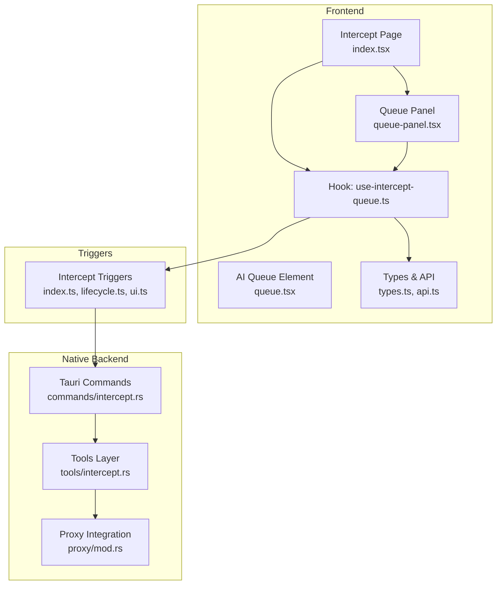
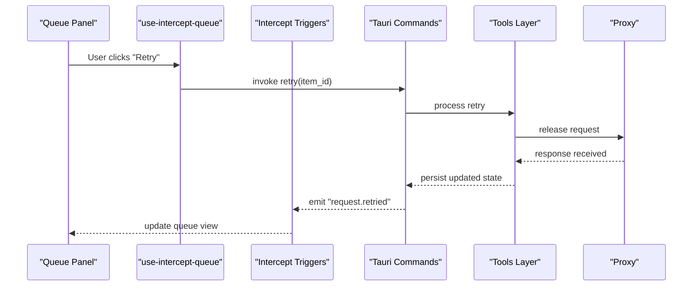
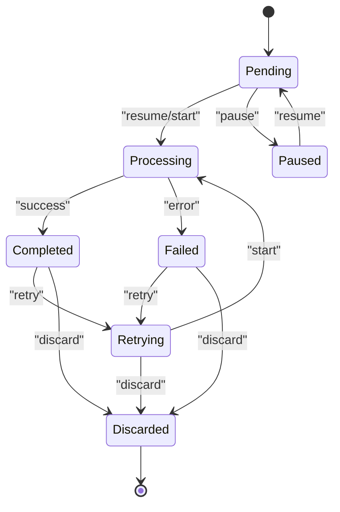
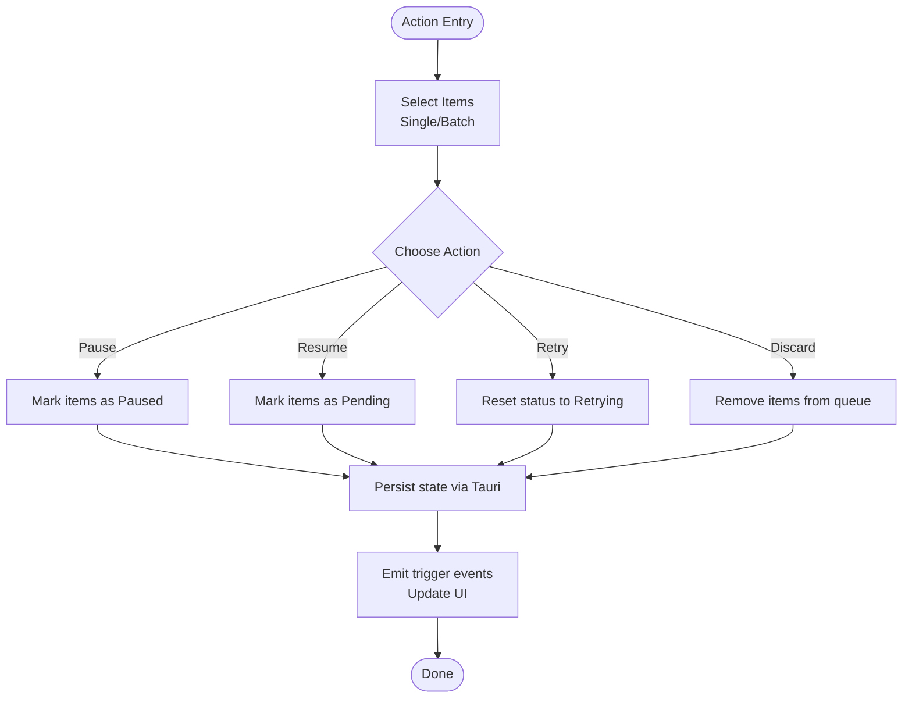
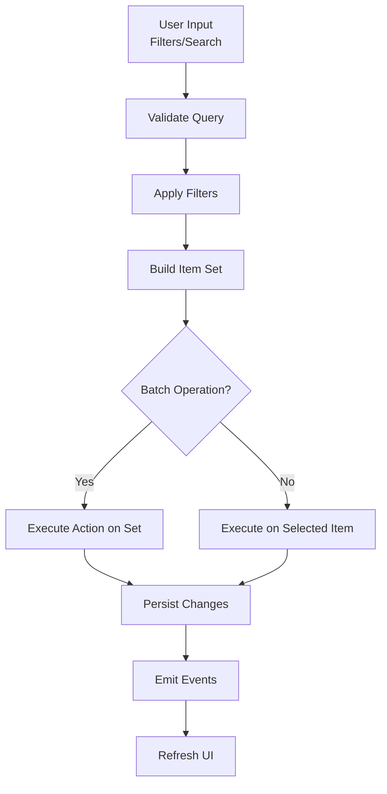
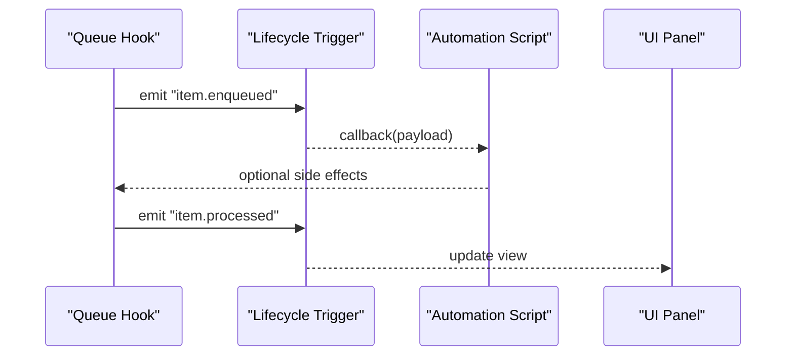
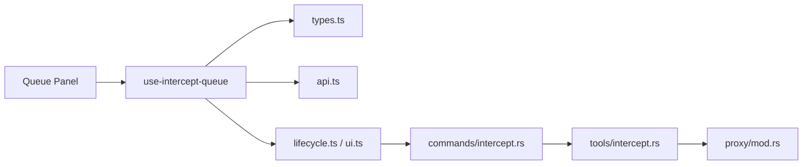

# Queue Management & Control

<cite>
**Referenced Files in This Document**
- [intercept/index.tsx](file://src/pages/intercept/index.tsx)
- [intercept/types.ts](file://src/pages/intercept/types.ts)
- [intercept/api.ts](file://src/pages/intercept/api.ts)
- [intercept/lib.ts](file://src/pages/intercept/lib.ts)
- [intercept/components/queue-panel.tsx](file://src/pages/intercept/components/queue-panel.tsx)
- [intercept/hooks/use-intercept-queue.ts](file://src/pages/intercept/hooks/use-intercept-queue.ts)
- [stores/app.ts](file://src/stores/app.ts)
- [triggers/intercept/index.ts](file://src/triggers/intercept/index.ts)
- [triggers/intercept/lifecycle.ts](file://src/triggers/intercept/lifecycle.ts)
- [triggers/intercept/ui.ts](file://src/triggers/intercept/ui.ts)
- [components/ai-elements/queue.tsx](file://src/components/ai-elements/queue.tsx)
- [src-tauri/src/commands/intercept.rs](file://src-tauri/src/commands/intercept.rs)
- [src-tauri/src/tools/intercept.rs](file://src-tauri/src/tools/intercept.rs)
- [src-tauri/src/proxy/mod.rs](file://src-tauri/src/proxy/mod.rs)
</cite>

## Table of Contents
1. [Introduction](#introduction)
2. [Project Structure](#project-structure)
3. [Core Components](#core-components)
4. [Architecture Overview](#architecture-overview)
5. [Detailed Component Analysis](#detailed-component-analysis)
6. [Dependency Analysis](#dependency-analysis)
7. [Performance Considerations](#performance-considerations)
8. [Troubleshooting Guide](#troubleshooting-guide)
9. [Conclusion](#conclusion)

## Introduction
This document explains the queue management system behind Apprecon’s interception feature. It covers how intercepted requests are enqueued, prioritized, and processed; manual control operations (pause, resume, retry, discard); batch operations; filtering and search; automation via queue events and hooks; and memory/performance considerations for large request volumes. The goal is to provide both a conceptual overview and code-level insights so that developers and power users can operate and extend the queue effectively.

## Project Structure
The queue spans UI components, state management, triggers, and backend commands:
- Frontend intercept page and components render the queue and expose controls.
- A dedicated hook manages queue state and actions.
- Triggers emit lifecycle events and UI updates.
- Tauri commands and tools implement persistence and proxy integration on the native side.

**Diagram sources**
- [intercept/index.tsx](file://src/pages/intercept/index.tsx)
- [intercept/components/queue-panel.tsx](file://src/pages/intercept/components/queue-panel.tsx)
- [components/ai-elements/queue.tsx](file://src/components/ai-elements/queue.tsx)
- [intercept/hooks/use-intercept-queue.ts](file://src/pages/intercept/hooks/use-intercept-queue.ts)
- [intercept/types.ts](file://src/pages/intercept/types.ts)
- [intercept/api.ts](file://src/pages/intercept/api.ts)
- [triggers/intercept/index.ts](file://src/triggers/intercept/index.ts)
- [triggers/intercept/lifecycle.ts](file://src/triggers/intercept/lifecycle.ts)
- [triggers/intercept/ui.ts](file://src/triggers/intercept/ui.ts)
- [src-tauri/src/commands/intercept.rs](file://src-tauri/src/commands/intercept.rs)
- [src-tauri/src/tools/intercept.rs](file://src-tauri/src/tools/intercept.rs)
- [src-tauri/src/proxy/mod.rs](file://src-tauri/src/proxy/mod.rs)

**Section sources**
- [intercept/index.tsx](file://src/pages/intercept/index.tsx)
- [intercept/components/queue-panel.tsx](file://src/pages/intercept/components/queue-panel.tsx)
- [components/ai-elements/queue.tsx](file://src/components/ai-elements/queue.tsx)
- [intercept/hooks/use-intercept-queue.ts](file://src/pages/intercept/hooks/use-intercept-queue.ts)
- [intercept/types.ts](file://src/pages/intercept/types.ts)
- [intercept/api.ts](file://src/pages/intercept/api.ts)
- [triggers/intercept/index.ts](file://src/triggers/intercept/index.ts)
- [triggers/intercept/lifecycle.ts](file://src/triggers/intercept/lifecycle.ts)
- [triggers/intercept/ui.ts](file://src/triggers/intercept/ui.ts)
- [src-tauri/src/commands/intercept.rs](file://src-tauri/src/commands/intercept.rs)
- [src-tauri/src/tools/intercept.rs](file://src-tauri/src/tools/intercept.rs)
- [src-tauri/src/proxy/mod.rs](file://src-tauri/src/proxy/mod.rs)

## Core Components
- Intercept page and queue panel: Render the queue list, filters, search, and action buttons. They dispatch user interactions to the queue hook.
- Queue hook: Encapsulates queue state, enqueue/dequeue logic, pause/resume, retry/discard, batch operations, and event subscriptions.
- Types and API: Define queue item schema, status transitions, and inter-process calls to Tauri commands.
- Triggers: Emit lifecycle events (enqueue, dequeue, pause, resume, retry, discard) and update UI state.
- Native layer: Persist queue items, integrate with the proxy to hold or forward requests, and execute background processing.

Key responsibilities:
- Enqueue new intercepted requests with priority metadata.
- Maintain queue order and paused state.
- Provide batch operations (select all, filter-based selection).
- Expose search and filter APIs for efficient retrieval.
- Emit events for automation and logging.

**Section sources**
- [intercept/components/queue-panel.tsx](file://src/pages/intercept/components/queue-panel.tsx)
- [intercept/hooks/use-intercept-queue.ts](file://src/pages/intercept/hooks/use-intercept-queue.ts)
- [intercept/types.ts](file://src/pages/intercept/types.ts)
- [intercept/api.ts](file://src/pages/intercept/api.ts)
- [triggers/intercept/lifecycle.ts](file://src/triggers/intercept/lifecycle.ts)
- [triggers/intercept/ui.ts](file://src/triggers/intercept/ui.ts)
- [src-tauri/src/commands/intercept.rs](file://src-tauri/src/commands/intercept.rs)
- [src-tauri/src/tools/intercept.rs](file://src-tauri/src/tools/intercept.rs)

## Architecture Overview
The queue operates across frontend and native layers with clear separation of concerns:
- UI triggers actions through the queue hook.
- The hook invokes Tauri commands for persistence and proxy control.
- The native layer persists items and coordinates with the proxy to hold or release requests.
- Lifecycle triggers broadcast events consumed by UI and automation pipelines.

**Diagram sources**
- [intercept/components/queue-panel.tsx](file://src/pages/intercept/components/queue-panel.tsx)
- [intercept/hooks/use-intercept-queue.ts](file://src/pages/intercept/hooks/use-intercept-queue.ts)
- [triggers/intercept/lifecycle.ts](file://src/triggers/intercept/lifecycle.ts)
- [src-tauri/src/commands/intercept.rs](file://src-tauri/src/commands/intercept.rs)
- [src-tauri/src/tools/intercept.rs](file://src-tauri/src/tools/intercept.rs)
- [src-tauri/src/proxy/mod.rs](file://src-tauri/src/proxy/mod.rs)

## Detailed Component Analysis

### Queue Data Model and Status Transitions
The queue item model includes identifiers, request metadata, status, and priority fields. Status transitions follow a defined lifecycle: pending -> processing -> completed/failed; paused items remain pending until resumed. Priority influences ordering when multiple items are queued.

**Diagram sources**
- [intercept/types.ts](file://src/pages/intercept/types.ts)
- [triggers/intercept/lifecycle.ts](file://src/triggers/intercept/lifecycle.ts)

**Section sources**
- [intercept/types.ts](file://src/pages/intercept/types.ts)
- [triggers/intercept/lifecycle.ts](file://src/triggers/intercept/lifecycle.ts)

### Manual Control Operations
Manual controls allow precise interaction with individual or selected queue items:
- Pause: Temporarily stops processing of selected items without losing state.
- Resume: Continues processing from the paused state.
- Retry: Re-attempts failed or retriable items, preserving original payload.
- Discard: Removes items from the queue permanently.

Batch operations support selecting all visible items or applying actions based on current filters. Search and filter capabilities enable targeted operations on subsets of the queue.

**Diagram sources**
- [intercept/components/queue-panel.tsx](file://src/pages/intercept/components/queue-panel.tsx)
- [intercept/hooks/use-intercept-queue.ts](file://src/pages/intercept/hooks/use-intercept-queue.ts)
- [triggers/intercept/lifecycle.ts](file://src/triggers/intercept/lifecycle.ts)
- [src-tauri/src/commands/intercept.rs](file://src-tauri/src/commands/intercept.rs)

**Section sources**
- [intercept/components/queue-panel.tsx](file://src/pages/intercept/components/queue-panel.tsx)
- [intercept/hooks/use-intercept-queue.ts](file://src/pages/intercept/hooks/use-intercept-queue.ts)
- [triggers/intercept/lifecycle.ts](file://src/triggers/intercept/lifecycle.ts)
- [src-tauri/src/commands/intercept.rs](file://src-tauri/src/commands/intercept.rs)

### Filtering, Search, and Batch Operations
Filtering options include method, URL patterns, status, and tags. Search supports full-text queries against headers, URLs, and payloads. Batch operations apply to filtered results or selections, enabling bulk pause/resume/retry/discard.

**Diagram sources**
- [intercept/hooks/use-intercept-queue.ts](file://src/pages/intercept/hooks/use-intercept-queue.ts)
- [intercept/api.ts](file://src/pages/intercept/api.ts)
- [triggers/intercept/ui.ts](file://src/triggers/intercept/ui.ts)

**Section sources**
- [intercept/hooks/use-intercept-queue.ts](file://src/pages/intercept/hooks/use-intercept-queue.ts)
- [intercept/api.ts](file://src/pages/intercept/api.ts)
- [triggers/intercept/ui.ts](file://src/triggers/intercept/ui.ts)

### Automation Using Queue Events and Hooks
Queue lifecycle events enable automation workflows:
- On enqueue: log, tag, or route items to specific collections.
- On pause/resume: trigger notifications or adjust concurrency.
- On retry/discard: audit changes or update dashboards.
- On completion/failure: trigger downstream tasks or alerts.

Hooks allow subscribing to these events and executing custom logic without modifying core queue behavior.

**Diagram sources**
- [triggers/intercept/lifecycle.ts](file://src/triggers/intercept/lifecycle.ts)
- [triggers/intercept/index.ts](file://src/triggers/intercept/index.ts)
- [intercept/hooks/use-intercept-queue.ts](file://src/pages/intercept/hooks/use-intercept-queue.ts)

**Section sources**
- [triggers/intercept/lifecycle.ts](file://src/triggers/intercept/lifecycle.ts)
- [triggers/intercept/index.ts](file://src/triggers/intercept/index.ts)
- [intercept/hooks/use-intercept-queue.ts](file://src/pages/intercept/hooks/use-intercept-queue.ts)

### Memory Management and Performance for Large Volumes
To handle high-throughput scenarios:
- Stream processing: Process items incrementally rather than loading all into memory.
- Lazy rendering: Render only visible rows in the queue list.
- Pagination: Load pages of items on demand.
- Debounced search: Avoid excessive re-renders during typing.
- Efficient filtering: Use indexed lookups and avoid full scans.
- Backpressure: Limit concurrent processing and pause queues under load.

These strategies reduce memory pressure and maintain responsiveness even with thousands of queued requests.

[No sources needed since this section provides general guidance]

## Dependency Analysis
The queue depends on several modules:
- UI components depend on the queue hook for state and actions.
- The hook depends on types and API definitions for contracts.
- Triggers bridge UI and native layers, emitting events and updating UI.
- Native commands and tools coordinate persistence and proxy interactions.

**Diagram sources**
- [intercept/components/queue-panel.tsx](file://src/pages/intercept/components/queue-panel.tsx)
- [intercept/hooks/use-intercept-queue.ts](file://src/pages/intercept/hooks/use-intercept-queue.ts)
- [intercept/types.ts](file://src/pages/intercept/types.ts)
- [intercept/api.ts](file://src/pages/intercept/api.ts)
- [triggers/intercept/lifecycle.ts](file://src/triggers/intercept/lifecycle.ts)
- [triggers/intercept/ui.ts](file://src/triggers/intercept/ui.ts)
- [src-tauri/src/commands/intercept.rs](file://src-tauri/src/commands/intercept.rs)
- [src-tauri/src/tools/intercept.rs](file://src-tauri/src/tools/intercept.rs)
- [src-tauri/src/proxy/mod.rs](file://src-tauri/src/proxy/mod.rs)

**Section sources**
- [intercept/components/queue-panel.tsx](file://src/pages/intercept/components/queue-panel.tsx)
- [intercept/hooks/use-intercept-queue.ts](file://src/pages/intercept/hooks/use-intercept-queue.ts)
- [intercept/types.ts](file://src/pages/intercept/types.ts)
- [intercept/api.ts](file://src/pages/intercept/api.ts)
- [triggers/intercept/lifecycle.ts](file://src/triggers/intercept/lifecycle.ts)
- [triggers/intercept/ui.ts](file://src/triggers/intercept/ui.ts)
- [src-tauri/src/commands/intercept.rs](file://src-tauri/src/commands/intercept.rs)
- [src-tauri/src/tools/intercept.rs](file://src-tauri/src/tools/intercept.rs)
- [src-tauri/src/proxy/mod.rs](file://src-tauri/src/proxy/mod.rs)

## Performance Considerations
- Prioritize lazy evaluation and pagination for large queues.
- Use efficient data structures for filtering and searching.
- Implement backpressure to prevent overwhelming the proxy or UI.
- Minimize re-renders by memoizing components and batching updates.
- Monitor memory usage and set limits for concurrent processing.

[No sources needed since this section provides general guidance]

## Troubleshooting Guide
Common issues and resolutions:
- Items stuck in paused state: Verify resume command execution and check trigger emissions.
- Retry failures: Inspect error logs and ensure payload integrity.
- Slow UI during search: Confirm debouncing and pagination settings.
- Memory spikes: Reduce concurrent processing and enable streaming.

Check trigger logs and Tauri command outputs to diagnose state inconsistencies.

**Section sources**
- [triggers/intercept/lifecycle.ts](file://src/triggers/intercept/lifecycle.ts)
- [src-tauri/src/commands/intercept.rs](file://src-tauri/src/commands/intercept.rs)

## Conclusion
Apprecon’s interception queue provides robust control over request processing with manual and automated capabilities. By leveraging filtering, search, batch operations, and lifecycle events, users can manage high-volume traffic efficiently while maintaining performance and responsiveness. Extending the queue via hooks enables powerful automation workflows tailored to specific needs.

[No sources needed since this section summarizes without analyzing specific files]