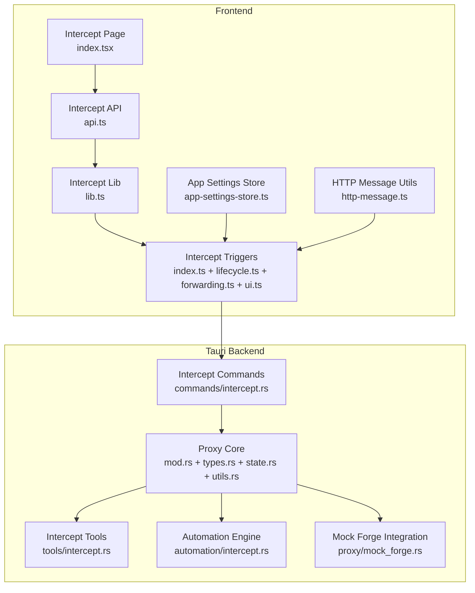
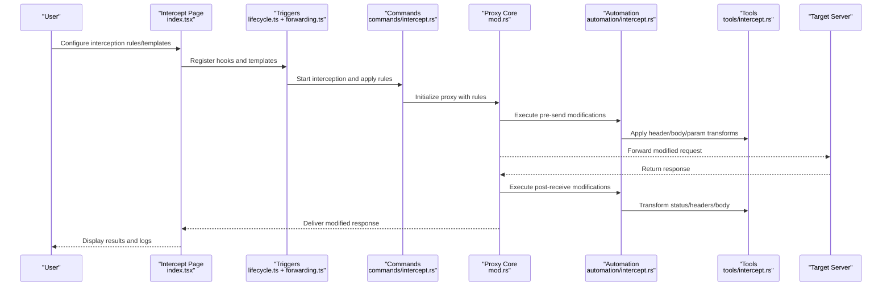
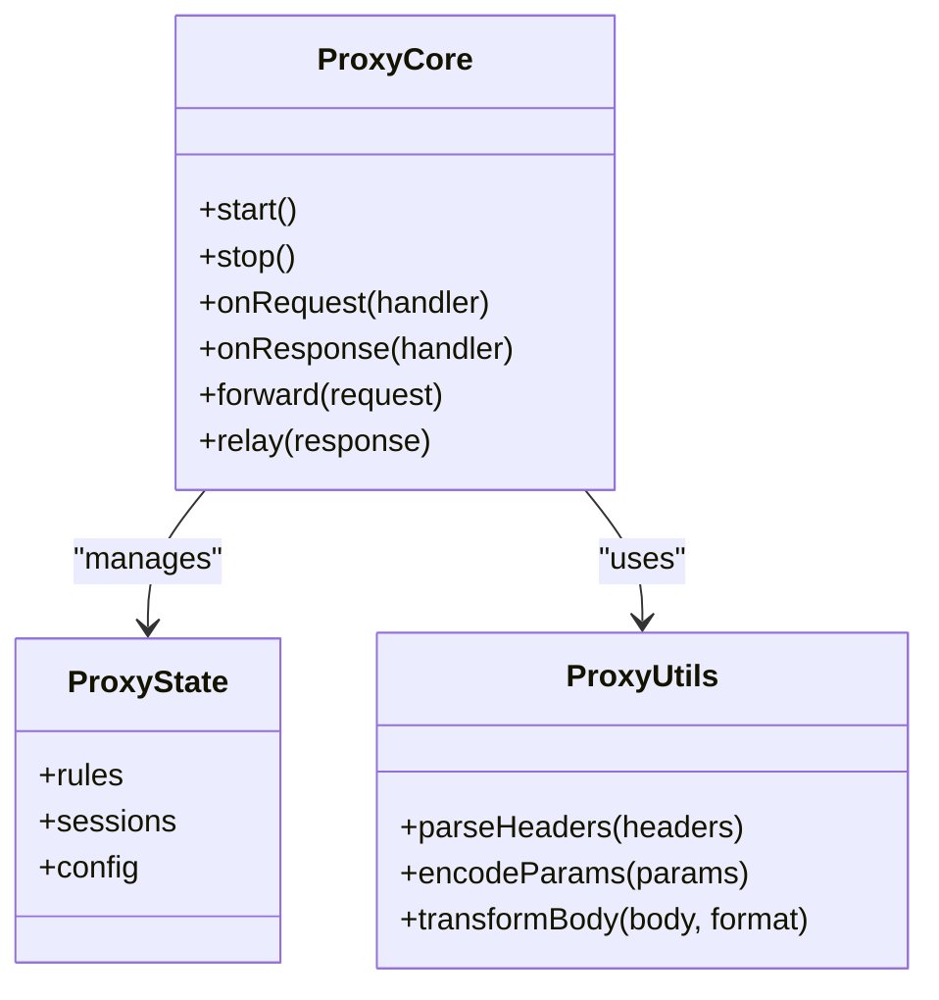
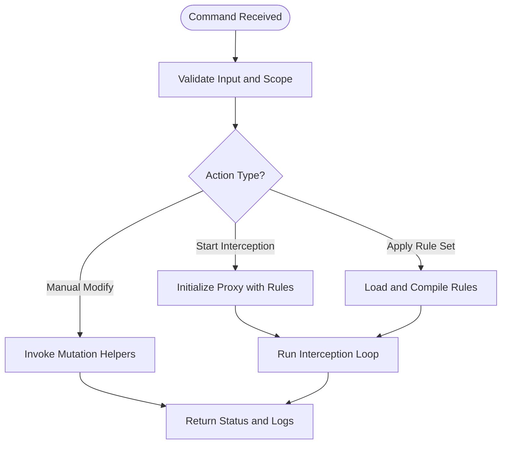
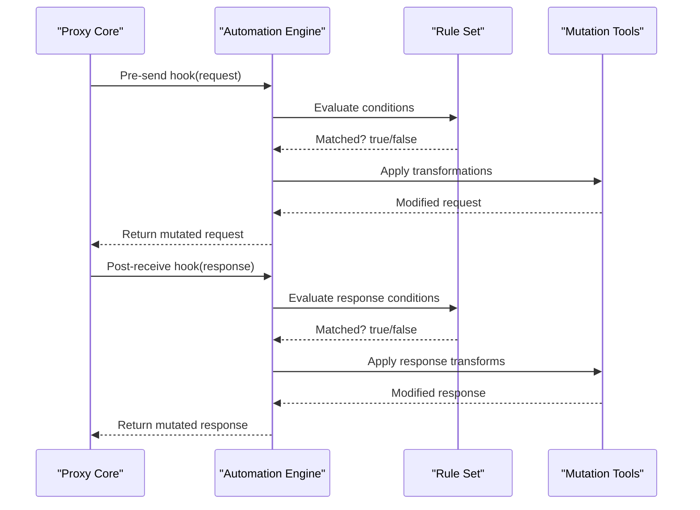
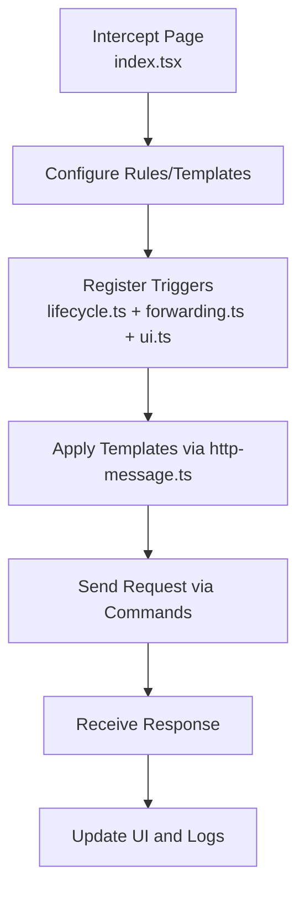
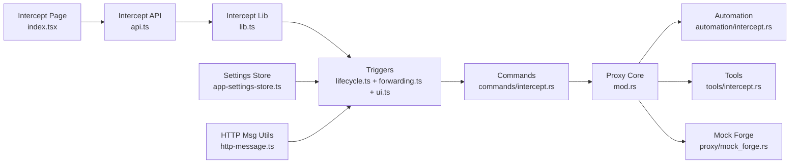

# Request & Response Modification

<cite>
**Referenced Files in This Document**
- [proxy/mod.rs](file://src-tauri/src/proxy/mod.rs)
- [proxy/types.rs](file://src-tauri/src/proxy/types.rs)
- [proxy/state.rs](file://src-tauri/src/proxy/state.rs)
- [proxy/utils.rs](file://src-tauri/src/proxy/utils.rs)
- [proxy/lifecycle.rs](file://src-tauri/src/proxy/lifecycle.rs)
- [proxy/mock_forge.rs](file://src-tauri/src/proxy/mock_forge.rs)
- [commands/intercept.rs](file://src-tauri/src/commands/intercept.rs)
- [tools/intercept.rs](file://src-tauri/src/tools/intercept.rs)
- [automation/intercept.rs](file://src-tauri/src/automation/intercept.rs)
- [pages/intercept/index.tsx](file://src/pages/intercept/index.tsx)
- [pages/intercept/api.ts](file://src/pages/intercept/api.ts)
- [pages/intercept/lib.ts](file://src/pages/intercept/lib.ts)
- [pages/intercept/types.ts](file://src/pages/intercept/types.ts)
- [triggers/intercept/index.ts](file://src/triggers/intercept/index.ts)
- [triggers/intercept/lifecycle.ts](file://src/triggers/intercept/lifecycle.ts)
- [triggers/intercept/forwarding.ts](file://src/triggers/intercept/forwarding.ts)
- [triggers/intercept/ui.ts](file://src/triggers/intercept/ui.ts)
- [stores/app-settings-store.ts](file://src/stores/app-settings-store.ts)
- [lib/http-message.ts](file://src/lib/http-message.ts)
</cite>

## Table of Contents
1. [Introduction](#introduction)
2. [Project Structure](#project-structure)
3. [Core Components](#core-components)
4. [Architecture Overview](#architecture-overview)
5. [Detailed Component Analysis](#detailed-component-analysis)
6. [Dependency Analysis](#dependency-analysis)
7. [Performance Considerations](#performance-considerations)
8. [Troubleshooting Guide](#troubleshooting-guide)
9. [Conclusion](#conclusion)
10. [Appendices](#appendices)

## Introduction
This document explains how Apprecon intercepts and modifies HTTP requests and responses, enabling security testing and automation workflows. It covers:
- Intercepting requests to modify headers, parameters, body content, and authentication tokens
- Manipulating responses by changing status codes, injecting headers, and transforming bodies
- Practical security testing examples (SQL injection, XSS, privilege escalation)
- Automated modification scripts and template-based transformations

The implementation spans a Rust-based proxy layer for low-level interception and a TypeScript frontend for configuration, scripting, and UI-driven modifications.

## Project Structure
Apprecon’s request/response modification is implemented across the following layers:
- Proxy core (Rust): Captures and forwards HTTP traffic with hooks for modification
- Commands and tools (Rust): Expose APIs to control interception and apply rules
- Automation engine (Rust): Executes rule-based or scripted modifications during interception
- Frontend pages and triggers (TypeScript): Provide UI, templates, and event-driven logic for customization

**Diagram sources**
- [pages/intercept/index.tsx](file://src/pages/intercept/index.tsx)
- [pages/intercept/api.ts](file://src/pages/intercept/api.ts)
- [pages/intercept/lib.ts](file://src/pages/intercept/lib.ts)
- [triggers/intercept/index.ts](file://src/triggers/intercept/index.ts)
- [triggers/intercept/lifecycle.ts](file://src/triggers/intercept/lifecycle.ts)
- [triggers/intercept/forwarding.ts](file://src/triggers/intercept/forwarding.ts)
- [triggers/intercept/ui.ts](file://src/triggers/intercept/ui.ts)
- [stores/app-settings-store.ts](file://src/stores/app-settings-store.ts)
- [lib/http-message.ts](file://src/lib/http-message.ts)
- [proxy/mod.rs](file://src-tauri/src/proxy/mod.rs)
- [proxy/types.rs](file://src-tauri/src/proxy/types.rs)
- [proxy/state.rs](file://src-tauri/src/proxy/state.rs)
- [proxy/utils.rs](file://src-tauri/src/proxy/utils.rs)
- [proxy/mock_forge.rs](file://src-tauri/src/proxy/mock_forge.rs)
- [commands/intercept.rs](file://src-tauri/src/commands/intercept.rs)
- [tools/intercept.rs](file://src-tauri/src/tools/intercept.rs)
- [automation/intercept.rs](file://src-tauri/src/automation/intercept.rs)

**Section sources**
- [proxy/mod.rs](file://src-tauri/src/proxy/mod.rs)
- [proxy/types.rs](file://src-tauri/src/proxy/types.rs)
- [proxy/state.rs](file://src-tauri/src/proxy/state.rs)
- [proxy/utils.rs](file://src-tauri/src/proxy/utils.rs)
- [proxy/mock_forge.rs](file://src-tauri/src/proxy/mock_forge.rs)
- [commands/intercept.rs](file://src-tauri/src/commands/intercept.rs)
- [tools/intercept.rs](file://src-tauri/src/tools/intercept.rs)
- [automation/intercept.rs](file://src-tauri/src/automation/intercept.rs)
- [pages/intercept/index.tsx](file://src/pages/intercept/index.tsx)
- [pages/intercept/api.ts](file://src/pages/intercept/api.ts)
- [pages/intercept/lib.ts](file://src/pages/intercept/lib.ts)
- [triggers/intercept/index.ts](file://src/triggers/intercept/index.ts)
- [triggers/intercept/lifecycle.ts](file://src/triggers/intercept/lifecycle.ts)
- [triggers/intercept/forwarding.ts](file://src/triggers/intercept/forwarding.ts)
- [triggers/intercept/ui.ts](file://src/triggers/intercept/ui.ts)
- [stores/app-settings-store.ts](file://src/stores/app-settings-store.ts)
- [lib/http-message.ts](file://src/lib/http-message.ts)

## Core Components
- Proxy Core (Rust): Handles network interception, request/response parsing, and forwarding. Provides extension points for modifying headers, parameters, bodies, and status codes.
- Commands (Rust): Expose Tauri commands to start/stop interception, configure rules, and invoke modifications programmatically.
- Tools (Rust): Utility functions for common operations like header manipulation, parameter encoding, and body transformation helpers.
- Automation Engine (Rust): Executes rule sets or scripts at defined interception points (before send, after receive).
- Mock Forge (Rust): Integrates mock server capabilities to simulate responses or alter payloads dynamically.
- Frontend Intercept Page (TypeScript): UI for configuring interception rules, viewing live traffic, and applying templates.
- Triggers (TypeScript): Event-driven hooks that run before/after requests/responses, allowing template-based transformations and automated scripts.
- Settings Store (TypeScript): Persists user preferences for interception behavior, default headers, and token handling.
- HTTP Message Utilities (TypeScript): Helpers for constructing and parsing HTTP messages consistently across the app.

**Section sources**
- [proxy/mod.rs](file://src-tauri/src/proxy/mod.rs)
- [commands/intercept.rs](file://src-tauri/src/commands/intercept.rs)
- [tools/intercept.rs](file://src-tauri/src/tools/intercept.rs)
- [automation/intercept.rs](file://src-tauri/src/automation/intercept.rs)
- [proxy/mock_forge.rs](file://src-tauri/src/proxy/mock_forge.rs)
- [pages/intercept/index.tsx](file://src/pages/intercept/index.tsx)
- [triggers/intercept/index.ts](file://src/triggers/intercept/index.ts)
- [stores/app-settings-store.ts](file://src/stores/app-settings-store.ts)
- [lib/http-message.ts](file://src/lib/http-message.ts)

## Architecture Overview
The interception pipeline integrates frontend configuration with backend execution:

**Diagram sources**
- [pages/intercept/index.tsx](file://src/pages/intercept/index.tsx)
- [triggers/intercept/lifecycle.ts](file://src/triggers/intercept/lifecycle.ts)
- [triggers/intercept/forwarding.ts](file://src/triggers/intercept/forwarding.ts)
- [commands/intercept.rs](file://src-tauri/src/commands/intercept.rs)
- [proxy/mod.rs](file://src-tauri/src/proxy/mod.rs)
- [automation/intercept.rs](file://src-tauri/src/automation/intercept.rs)
- [tools/intercept.rs](file://src-tauri/src/tools/intercept.rs)

## Detailed Component Analysis

### Proxy Core (Rust)
Responsibilities:
- Capture incoming HTTP requests and outgoing responses
- Parse and expose headers, query parameters, path, method, and body
- Provide hooks for pre-send and post-receive modifications
- Forward requests to target servers and relay responses back to clients

Key aspects:
- State management tracks active interception sessions and rule sets
- Utilities handle encoding/decoding and safe mutation of message parts
- Integration points allow automation and tool modules to mutate messages

**Diagram sources**
- [proxy/mod.rs](file://src-tauri/src/proxy/mod.rs)
- [proxy/state.rs](file://src-tauri/src/proxy/state.rs)
- [proxy/utils.rs](file://src-tauri/src/proxy/utils.rs)

**Section sources**
- [proxy/mod.rs](file://src-tauri/src/proxy/mod.rs)
- [proxy/state.rs](file://src-tauri/src/proxy/state.rs)
- [proxy/utils.rs](file://src-tauri/src/proxy/utils.rs)

### Commands and Tools (Rust)
Commands:
- Expose Tauri endpoints to start/stop interception, load rule sets, and trigger manual modifications
- Validate inputs and enforce scope constraints for safety

Tools:
- Provide helper functions for common mutations: adding/removing headers, updating auth tokens, encoding parameters, and transforming JSON/XML bodies

**Diagram sources**
- [commands/intercept.rs](file://src-tauri/src/commands/intercept.rs)
- [tools/intercept.rs](file://src-tauri/src/tools/intercept.rs)

**Section sources**
- [commands/intercept.rs](file://src-tauri/src/commands/intercept.rs)
- [tools/intercept.rs](file://src-tauri/src/tools/intercept.rs)

### Automation Engine (Rust)
Responsibilities:
- Execute rule sets or scripts at interception points
- Support conditional logic based on URL patterns, methods, headers, and body content
- Allow chaining multiple transformations safely

**Diagram sources**
- [automation/intercept.rs](file://src-tauri/src/automation/intercept.rs)
- [tools/intercept.rs](file://src-tauri/src/tools/intercept.rs)

**Section sources**
- [automation/intercept.rs](file://src-tauri/src/automation/intercept.rs)

### Mock Forge Integration (Rust)
Capabilities:
- Simulate server responses without contacting the real target
- Override specific endpoints or patterns with predefined payloads
- Inject dynamic values into responses based on request context

Use cases:
- Testing error paths and edge cases
- Validating client-side handling of malformed responses
- Isolating vulnerabilities without affecting production systems

**Section sources**
- [proxy/mock_forge.rs](file://src-tauri/src/proxy/mock_forge.rs)

### Frontend Intercept Page and Triggers (TypeScript)
Intercept Page:
- UI for creating/editing interception rules and templates
- Live view of captured requests/responses and applied modifications
- Controls for starting/stopping interception and exporting configurations

Triggers:
- Lifecycle hooks to run code before sending requests and after receiving responses
- Forwarding hooks to adjust routing or inject custom behaviors
- UI hooks to update interface elements based on interception events

**Diagram sources**
- [pages/intercept/index.tsx](file://src/pages/intercept/index.tsx)
- [pages/intercept/api.ts](file://src/pages/intercept/api.ts)
- [pages/intercept/lib.ts](file://src/pages/intercept/lib.ts)
- [triggers/intercept/lifecycle.ts](file://src/triggers/intercept/lifecycle.ts)
- [triggers/intercept/forwarding.ts](file://src/triggers/intercept/forwarding.ts)
- [triggers/intercept/ui.ts](file://src/triggers/intercept/ui.ts)
- [lib/http-message.ts](file://src/lib/http-message.ts)

**Section sources**
- [pages/intercept/index.tsx](file://src/pages/intercept/index.tsx)
- [pages/intercept/api.ts](file://src/pages/intercept/api.ts)
- [pages/intercept/lib.ts](file://src/pages/intercept/lib.ts)
- [triggers/intercept/index.ts](file://src/triggers/intercept/index.ts)
- [triggers/intercept/lifecycle.ts](file://src/triggers/intercept/lifecycle.ts)
- [triggers/intercept/forwarding.ts](file://src/triggers/intercept/forwarding.ts)
- [triggers/intercept/ui.ts](file://src/triggers/intercept/ui.ts)
- [lib/http-message.ts](file://src/lib/http-message.ts)

### Settings Store (TypeScript)
Purpose:
- Persist user preferences for interception behavior
- Manage default headers, token injection strategies, and template libraries
- Provide reactive updates to UI components when settings change

**Section sources**
- [stores/app-settings-store.ts](file://src/stores/app-settings-store.ts)

## Dependency Analysis
Interception depends on coordinated interactions between frontend triggers, backend commands, proxy core, automation engine, and tools. The diagram below highlights key dependencies:

**Diagram sources**
- [pages/intercept/index.tsx](file://src/pages/intercept/index.tsx)
- [pages/intercept/api.ts](file://src/pages/intercept/api.ts)
- [pages/intercept/lib.ts](file://src/pages/intercept/lib.ts)
- [triggers/intercept/lifecycle.ts](file://src/triggers/intercept/lifecycle.ts)
- [triggers/intercept/forwarding.ts](file://src/triggers/intercept/forwarding.ts)
- [triggers/intercept/ui.ts](file://src/triggers/intercept/ui.ts)
- [commands/intercept.rs](file://src-tauri/src/commands/intercept.rs)
- [proxy/mod.rs](file://src-tauri/src/proxy/mod.rs)
- [automation/intercept.rs](file://src-tauri/src/automation/intercept.rs)
- [tools/intercept.rs](file://src-tauri/src/tools/intercept.rs)
- [proxy/mock_forge.rs](file://src-tauri/src/proxy/mock_forge.rs)
- [stores/app-settings-store.ts](file://src/stores/app-settings-store.ts)
- [lib/http-message.ts](file://src/lib/http-message.ts)

**Section sources**
- [commands/intercept.rs](file://src-tauri/src/commands/intercept.rs)
- [proxy/mod.rs](file://src-tauri/src/proxy/mod.rs)
- [automation/intercept.rs](file://src-tauri/src/automation/intercept.rs)
- [tools/intercept.rs](file://src-tauri/src/tools/intercept.rs)
- [proxy/mock_forge.rs](file://src-tauri/src/proxy/mock_forge.rs)
- [pages/intercept/index.tsx](file://src/pages/intercept/index.tsx)
- [triggers/intercept/lifecycle.ts](file://src/triggers/intercept/lifecycle.ts)
- [triggers/intercept/forwarding.ts](file://src/triggers/intercept/forwarding.ts)
- [triggers/intercept/ui.ts](file://src/triggers/intercept/ui.ts)
- [stores/app-settings-store.ts](file://src/stores/app-settings-store.ts)
- [lib/http-message.ts](file://src/lib/http-message.ts)

## Performance Considerations
- Minimize payload size by applying selective transformations only to matching rules
- Use efficient parsers for JSON/XML to avoid blocking the interception loop
- Cache frequently used templates and compiled rules to reduce overhead
- Avoid synchronous heavy computations in hot paths; offload to background tasks where possible
- Monitor memory usage when handling large bodies or many concurrent requests

[No sources needed since this section provides general guidance]

## Troubleshooting Guide
Common issues and resolutions:
- Interception not starting: Verify command invocation and ensure proxy initialization succeeds
- Modifications not applied: Check rule conditions and template bindings; confirm triggers are registered
- Body parsing errors: Validate content type and encoding; use appropriate parser helpers
- Token injection failures: Confirm token source and expiration handling; check authorization header names
- Response overrides not visible: Ensure post-receive hooks are enabled and mock forge is configured correctly

**Section sources**
- [commands/intercept.rs](file://src-tauri/src/commands/intercept.rs)
- [proxy/mod.rs](file://src-tauri/src/proxy/mod.rs)
- [automation/intercept.rs](file://src-tauri/src/automation/intercept.rs)
- [proxy/mock_forge.rs](file://src-tauri/src/proxy/mock_forge.rs)

## Conclusion
Apprecon’s request and response modification system combines a robust Rust proxy with flexible TypeScript triggers and automation. Users can intercept and mutate HTTP traffic at multiple stages, enabling comprehensive security testing and workflow automation. By leveraging templates, scripts, and mock responses, teams can efficiently validate application resilience against common attack vectors while maintaining performance and reliability.

[No sources needed since this section summarizes without analyzing specific files]

## Appendices

### Security Testing Examples
- SQL Injection:
  - Modify query parameters or JSON fields to include typical payloads
  - Observe server responses for error indicators or data leakage
  - Use automation rules to iterate through payload variants systematically

- Cross-Site Scripting (XSS):
  - Inject script tags or event handlers into body content or headers
  - Validate if the application sanitizes outputs or executes injected code
  - Employ template-based transformations to test various encodings

- Privilege Escalation:
  - Alter role or permission fields in request bodies or headers
  - Attempt to access restricted endpoints with elevated credentials
  - Monitor for unintended access or misconfigured authorization checks

[No sources needed since this section provides conceptual guidance]

### Automated Modification Scripts and Templates
- Create reusable templates for common mutations (e.g., adding CSRF tokens, rotating session IDs)
- Chain multiple transformations using conditionals based on URL patterns or headers
- Export and share rule sets across team members for consistent testing practices

[No sources needed since this section provides conceptual guidance]