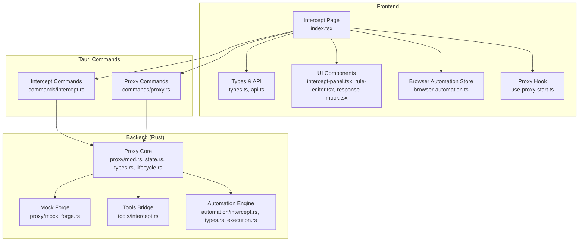
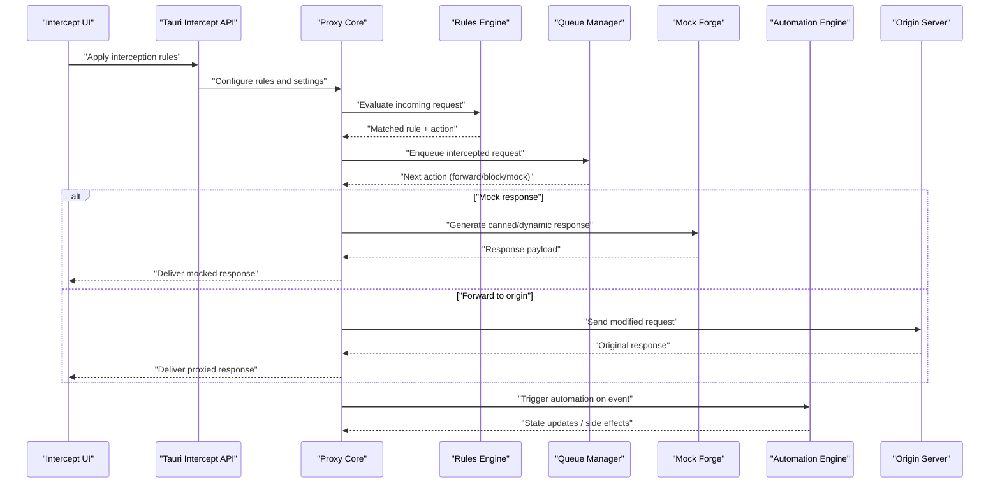
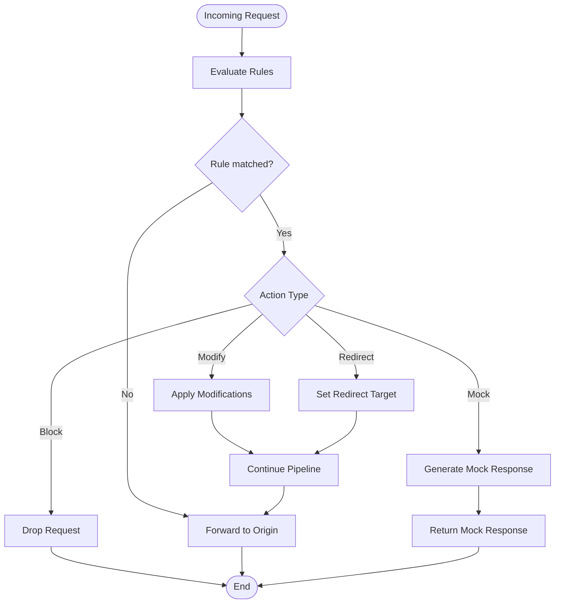
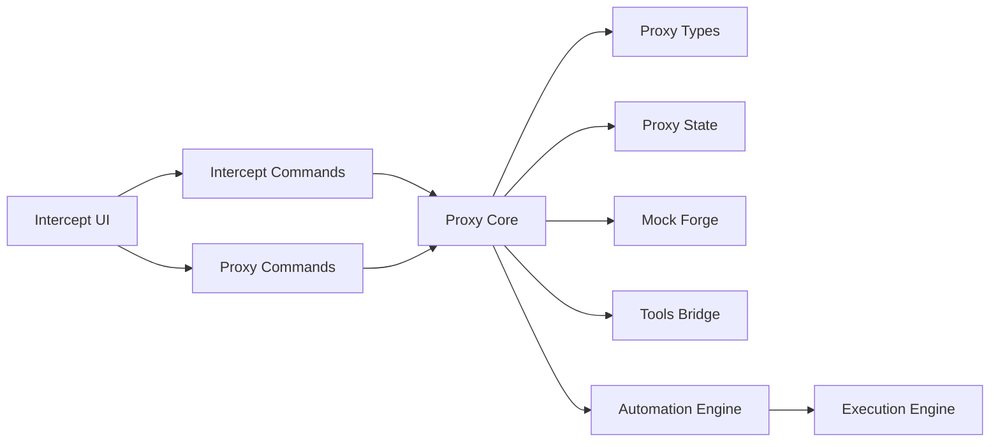

# Request Interception

<cite>
**Referenced Files in This Document**
- [src/pages/intercept/index.tsx](file://src/pages/intercept/index.tsx)
- [src/pages/intercept/types.ts](file://src/pages/intercept/types.ts)
- [src/pages/intercept/api.ts](file://src/pages/intercept/api.ts)
- [src/pages/intercept/lib.ts](file://src/pages/intercept/lib.ts)
- [src/stores/browser-automation.ts](file://src/stores/browser-automation.ts)
- [src/stores/app-settings-store.ts](file://src/stores/app-settings-store.ts)
- [src/hooks/use-proxy-start.ts](file://src/hooks/use-proxy-start.ts)
- [src-tauri/src/proxy/mod.rs](file://src-tauri/src/proxy/mod.rs)
- [src-tauri/src/proxy/state.rs](file://src-tauri/src/proxy/state.rs)
- [src-tauri/src/proxy/types.rs](file://src-tauri/src/proxy/types.rs)
- [src-tauri/src/proxy/lifecycle.rs](file://src-tauri/src/proxy/lifecycle.rs)
- [src-tauri/src/proxy/mock_forge.rs](file://src-tauri/src/proxy/mock_forge.rs)
- [src-tauri/src/commands/intercept.rs](file://src-tauri/src/commands/intercept.rs)
- [src-tauri/src/commands/proxy.rs](file://src-tauri/src/commands/proxy.rs)
- [src-tauri/src/tools/intercept.rs](file://src-tauri/src/tools/intercept.rs)
- [src-tauri/src/automation/intercept.rs](file://src-tauri/src/automation/intercept.rs)
- [src-tauri/src/automation/types.rs](file://src-tauri/src/automation/types.rs)
- [src-tauri/src/automation/execution.rs](file://src-tauri/src/automation/execution.rs)
- [src/components/intercept/components/intercept-panel.tsx](file://src/components/intercept/components/intercept-panel.tsx)
- [src/components/intercept/components/rule-editor.tsx](file://src/components/intercept/components/rule-editor.tsx)
- [src/components/intercept/components/response-mock.tsx](file://src/components/intercept/components/response-mock.tsx)
</cite>

## Table of Contents
1. [Introduction](#introduction)
2. [Project Structure](#project-structure)
3. [Core Components](#core-components)
4. [Architecture Overview](#architecture-overview)
5. [Detailed Component Analysis](#detailed-component-analysis)
6. [Dependency Analysis](#dependency-analysis)
7. [Performance Considerations](#performance-considerations)
8. [Troubleshooting Guide](#troubleshooting-guide)
9. [Conclusion](#conclusion)
10. [Appendices](#appendices)

## Introduction
This document explains Apprecon’s Request Interception feature, which allows you to intercept, modify, and control network requests in real-time during application execution. It covers the interception rules engine, request modification capabilities, response manipulation options, queue management for intercepted requests, conditional routing, automated responses, integration with browser automation and workflow tools, performance implications, and best practices. The goal is to help both security testers and developers use interception effectively and safely.

## Project Structure
Apprecon implements interception across a layered architecture:
- Frontend UI and state for configuring interception rules and managing queues
- Tauri commands bridging frontend to backend services
- Rust-based proxy and automation subsystems handling actual request interception and response manipulation
- Browser automation integration for injecting interception logic into web contexts

**Diagram sources**
- [src/pages/intercept/index.tsx](file://src/pages/intercept/index.tsx)
- [src/pages/intercept/types.ts](file://src/pages/intercept/types.ts)
- [src/pages/intercept/api.ts](file://src/pages/intercept/api.ts)
- [src/components/intercept/components/intercept-panel.tsx](file://src/components/intercept/components/intercept-panel.tsx)
- [src/components/intercept/components/rule-editor.tsx](file://src/components/intercept/components/rule-editor.tsx)
- [src/components/intercept/components/response-mock.tsx](file://src/components/intercept/components/response-mock.tsx)
- [src/stores/browser-automation.ts](file://src/stores/browser-automation.ts)
- [src/hooks/use-proxy-start.ts](file://src/hooks/use-proxy-start.ts)
- [src-tauri/src/commands/intercept.rs](file://src-tauri/src/commands/intercept.rs)
- [src-tauri/src/commands/proxy.rs](file://src-tauri/src/commands/proxy.rs)
- [src-tauri/src/proxy/mod.rs](file://src-tauri/src/proxy/mod.rs)
- [src-tauri/src/proxy/state.rs](file://src-tauri/src/proxy/state.rs)
- [src-tauri/src/proxy/types.rs](file://src-tauri/src/proxy/types.rs)
- [src-tauri/src/proxy/lifecycle.rs](file://src-tauri/src/proxy/lifecycle.rs)
- [src-tauri/src/proxy/mock_forge.rs](file://src-tauri/src/proxy/mock_forge.rs)
- [src-tauri/src/tools/intercept.rs](file://src-tauri/src/tools/intercept.rs)
- [src-tauri/src/automation/intercept.rs](file://src-tauri/src/automation/intercept.rs)
- [src-tauri/src/automation/types.rs](file://src-tauri/src/automation/types.rs)
- [src-tauri/src/automation/execution.rs](file://src-tauri/src/automation/execution.rs)

**Section sources**
- [src/pages/intercept/index.tsx](file://src/pages/intercept/index.tsx)
- [src/pages/intercept/types.ts](file://src/pages/intercept/types.ts)
- [src/pages/intercept/api.ts](file://src/pages/intercept/api.ts)
- [src/components/intercept/components/intercept-panel.tsx](file://src/components/intercept/components/intercept-panel.tsx)
- [src/components/intercept/components/rule-editor.tsx](file://src/components/intercept/components/rule-editor.tsx)
- [src/components/intercept/components/response-mock.tsx](file://src/components/intercept/components/response-mock.tsx)
- [src/stores/browser-automation.ts](file://src/stores/browser-automation.ts)
- [src/hooks/use-proxy-start.ts](file://src/hooks/use-proxy-start.ts)
- [src-tauri/src/commands/intercept.rs](file://src-tauri/src/commands/intercept.rs)
- [src-tauri/src/commands/proxy.rs](file://src-tauri/src/commands/proxy.rs)
- [src-tauri/src/proxy/mod.rs](file://src-tauri/src/proxy/mod.rs)
- [src-tauri/src/proxy/state.rs](file://src-tauri/src/proxy/state.rs)
- [src-tauri/src/proxy/types.rs](file://src-tauri/src/proxy/types.rs)
- [src-tauri/src/proxy/lifecycle.rs](file://src/tauri/src/proxy/lifecycle.rs)
- [src-tauri/src/proxy/mock_forge.rs](file://src-tauri/src/proxy/mock_forge.rs)
- [src-tauri/src/tools/intercept.rs](file://src-tauri/src/tools/intercept.rs)
- [src-tauri/src/automation/intercept.rs](file://src-tauri/src/automation/intercept.rs)
- [src-tauri/src/automation/types.rs](file://src-tauri/src/automation/types.rs)
- [src-tauri/src/automation/execution.rs](file://src-tauri/src/automation/execution.rs)

## Core Components
- Interception Rules Engine: Defines matching criteria (URL patterns, methods, headers, cookies, query parameters) and actions (modify, block, redirect, mock).
- Request Modification Capabilities: Edit headers, body, URL, method, and metadata before forwarding or responding.
- Response Manipulation Options: Transform status codes, headers, and bodies; inject content; short-circuit with canned responses.
- Queue Management: Hold, replay, forward, drop, or batch intercepted requests; supports filtering and prioritization.
- Conditional Routing: Route requests based on context (domain, path, headers), environment flags, or automation state.
- Automated Responses: Serve static or dynamic responses without hitting the origin server.

These components are implemented across the frontend UI, Tauri commands, and Rust backend modules.

**Section sources**
- [src/pages/intercept/types.ts](file://src/pages/intercept/types.ts)
- [src/pages/intercept/api.ts](file://src/pages/intercept/api.ts)
- [src-tauri/src/proxy/types.rs](file://src-tauri/src/proxy/types.rs)
- [src-tauri/src/automation/types.rs](file://src-tauri/src/automation/types.rs)

## Architecture Overview
The interception pipeline spans multiple layers:
- Frontend: Users configure rules, manage queues, and trigger automation via UI.
- Tauri Commands: Expose APIs to start/stop proxy, apply rules, and interact with automation.
- Proxy Core: Intercepts HTTP traffic, applies rules, manages queues, and coordinates with mock forge and automation.
- Automation Engine: Executes scripted workflows triggered by interception events.

**Diagram sources**
- [src/pages/intercept/index.tsx](file://src/pages/intercept/index.tsx)
- [src-tauri/src/commands/intercept.rs](file://src-tauri/src/commands/intercept.rs)
- [src-tauri/src/proxy/mod.rs](file://src-tauri/src/proxy/mod.rs)
- [src-tauri/src/proxy/state.rs](file://src-tauri/src/proxy/state.rs)
- [src-tauri/src/proxy/types.rs](file://src-tauri/src/proxy/types.rs)
- [src-tauri/src/proxy/mock_forge.rs](file://src-tauri/src/proxy/mock_forge.rs)
- [src-tauri/src/automation/intercept.rs](file://src-tauri/src/automation/intercept.rs)
- [src-tauri/src/automation/execution.rs](file://src-tauri/src/automation/execution.rs)

## Detailed Component Analysis

### Interception Rules Engine
The rules engine matches requests against defined criteria and selects an action. Matching can be based on:
- URL patterns (exact, prefix, regex)
- HTTP method
- Headers and cookies
- Query parameters and body fields
- Contextual flags (e.g., environment, session markers)

Actions include:
- Modify request (headers, body, URL, method)
- Block request
- Redirect to another endpoint
- Short-circuit with a mock response
- Trigger automation workflows

**Diagram sources**
- [src-tauri/src/proxy/types.rs](file://src-tauri/src/proxy/types.rs)
- [src-tauri/src/proxy/state.rs](file://src-tauri/src/proxy/state.rs)
- [src-tauri/src/automation/types.rs](file://src-tauri/src/automation/types.rs)

**Section sources**
- [src-tauri/src/proxy/types.rs](file://src-tauri/src/proxy/types.rs)
- [src-tauri/src/proxy/state.rs](file://src-tauri/src/proxy/state.rs)
- [src-tauri/src/automation/types.rs](file://src-tauri/src/automation/types.rs)

### Request Modification Capabilities
Modification points allow altering:
- Headers: Add, remove, overwrite
- Body: Parse and transform JSON, form data, raw payloads
- URL: Rewrite paths, query strings
- Method: Change GET/POST/etc. when safe and intended

Use cases:
- Parameter tampering for security testing
- Header injection to test authorization bypasses
- Normalizing payloads for downstream consumers

Best practices:
- Validate transformations to avoid breaking contracts
- Log changes for auditability
- Scope modifications narrowly using precise rules

**Section sources**
- [src/pages/intercept/types.ts](file://src/pages/intercept/types.ts)
- [src-tauri/src/proxy/types.rs](file://src-tauri/src/proxy/types.rs)

### Response Manipulation Options
Response manipulation enables:
- Status code overrides
- Header injection or removal
- Body transformation or replacement
- Short-circuiting with canned responses

Security testing scenarios:
- Response spoofing to simulate error conditions
- Injecting debug headers for tracing
- Returning cached or stubbed data for offline testing

Integration:
- Mock responses can be static or generated dynamically based on request context
- Automation can update mock templates at runtime

**Section sources**
- [src-tauri/src/proxy/mock_forge.rs](file://src-tauri/src/proxy/mock_forge.rs)
- [src-tauri/src/proxy/types.rs](file://src-tauri/src/proxy/types.rs)

### Queue Management System
The queue system handles intercepted requests with operations:
- Enqueue: Capture requests for later inspection
- Replay: Resend captured requests with modifications
- Forward/Drop: Decide whether to send to origin or discard
- Batch: Group related requests for bulk processing
- Filter/Prioritize: Focus on critical endpoints or high-risk payloads

Operational benefits:
- Controlled pacing to avoid overwhelming origins
- Audit trails for all intercepted traffic
- Safe experimentation without affecting live flows

**Section sources**
- [src-tauri/src/proxy/state.rs](file://src-tauri/src/proxy/state.rs)
- [src-tauri/src/tools/intercept.rs](file://src-tauri/src/tools/intercept.rs)

### Conditional Routing and Automated Responses
Conditional routing directs requests based on:
- Domain/path patterns
- Header values and cookies
- Environment variables and feature flags
- Automation state (e.g., running a specific workflow)

Automated responses:
- Serve pre-defined responses for known endpoints
- Generate contextual responses using templates or scripts
- Integrate with external services to fetch dynamic mocks

**Section sources**
- [src-tauri/src/automation/intercept.rs](file://src-tauri/src/automation/intercept.rs)
- [src-tauri/src/automation/execution.rs](file://src-tauri/src/automation/execution.rs)
- [src-tauri/src/proxy/mock_forge.rs](file://src-tauri/src/proxy/mock_forge.rs)

### Integration with Browser Automation and Workflow Tools
Interception integrates with browser automation to:
- Inject interception logic into web contexts
- Trigger workflows based on intercepted events
- Update automation state from interception outcomes

Workflow tool integration:
- Use interception events as triggers for multi-step processes
- Chain interception with other tools (Repeater, Inspector, Invoker)
- Persist results and artifacts for reporting

**Section sources**
- [src/stores/browser-automation.ts](file://src/stores/browser-automation.ts)
- [src-tauri/src/automation/intercept.rs](file://src-tauri/src/automation/intercept.rs)
- [src-tauri/src/automation/execution.rs](file://src-tauri/src/automation/execution.rs)

### Practical Security Testing Scenarios
Common scenarios enabled by interception:
- Parameter Tampering: Modify query parameters or body fields to test input validation and authorization checks
- Header Injection: Add or alter headers to probe authentication mechanisms and CORS policies
- Response Spoofing: Return altered responses to verify client-side error handling and security assumptions
- CSRF/XSS Probes: Inject payloads and observe behavior under controlled conditions

Guidelines:
- Scope tests precisely to avoid unintended side effects
- Record evidence and maintain logs for reproducibility
- Use isolated environments where possible

[No sources needed since this section provides general guidance]

## Dependency Analysis
Interception depends on coordinated interactions between frontend, commands, proxy core, mock forge, and automation.

**Diagram sources**
- [src/pages/intercept/index.tsx](file://src/pages/intercept/index.tsx)
- [src-tauri/src/commands/intercept.rs](file://src-tauri/src/commands/intercept.rs)
- [src-tauri/src/commands/proxy.rs](file://src-tauri/src/commands/proxy.rs)
- [src-tauri/src/proxy/mod.rs](file://src-tauri/src/proxy/mod.rs)
- [src-tauri/src/proxy/types.rs](file://src-tauri/src/proxy/types.rs)
- [src-tauri/src/proxy/state.rs](file://src-tauri/src/proxy/state.rs)
- [src-tauri/src/proxy/mock_forge.rs](file://src-tauri/src/proxy/mock_forge.rs)
- [src-tauri/src/tools/intercept.rs](file://src-tauri/src/tools/intercept.rs)
- [src-tauri/src/automation/intercept.rs](file://src-tauri/src/automation/intercept.rs)
- [src-tauri/src/automation/execution.rs](file://src-tauri/src/automation/execution.rs)

**Section sources**
- [src-tauri/src/proxy/mod.rs](file://src-tauri/src/proxy/mod.rs)
- [src-tauri/src/commands/intercept.rs](file://src-tauri/src/commands/intercept.rs)
- [src-tauri/src/commands/proxy.rs](file://src-tauri/src/commands/proxy.rs)
- [src-tauri/src/automation/execution.rs](file://src-tauri/src/automation/execution.rs)

## Performance Considerations
- Rule evaluation efficiency: Keep patterns simple and scoped; prefer exact/prefix matches over heavy regex where possible.
- Queue throughput: Tune queue sizes and backpressure to prevent memory growth under high traffic.
- Mock generation cost: Cache dynamic responses when appropriate; avoid expensive computations per request.
- Logging overhead: Limit verbose logging in production; enable selectively for debugging.
- Concurrency: Ensure thread-safe access to shared state; avoid blocking operations in hot paths.

Best practices:
- Profile interception rules and adjust thresholds
- Use targeted filters to reduce unnecessary processing
- Monitor memory and CPU usage during long sessions

[No sources needed since this section provides general guidance]

## Troubleshooting Guide
Common issues and resolutions:
- Proxy not starting: Verify configuration and permissions; check command outputs for errors.
- Rules not matching: Inspect pattern syntax and precedence; validate request attributes.
- Queues growing unbounded: Adjust limits and implement cleanup strategies.
- Automation not triggering: Confirm event bindings and state transitions.
- Mock responses incorrect: Review template variables and context inputs.

Debugging steps:
- Enable detailed logs for interception pipeline
- Isolate problematic rules and test independently
- Use inspector views to inspect request/response payloads

**Section sources**
- [src-tauri/src/proxy/lifecycle.rs](file://src-tauri/src/proxy/lifecycle.rs)
- [src-tauri/src/proxy/state.rs](file://src-tauri/src/proxy/state.rs)
- [src-tauri/src/automation/execution.rs](file://src-tauri/src/automation/execution.rs)

## Conclusion
Apprecon’s Request Interception feature provides a robust, flexible mechanism for intercepting, modifying, and controlling network traffic in real-time. With a powerful rules engine, comprehensive modification and response manipulation capabilities, efficient queue management, conditional routing, and deep integration with browser automation and workflow tools, it serves as a cornerstone for security testing and development workflows. By following best practices and leveraging the provided diagrams and guidance, users can build effective interception strategies that enhance testing coverage and reliability.

[No sources needed since this section summarizes without analyzing specific files]

## Appendices
- Quick Start Checklist:
  - Configure interception rules targeting relevant endpoints
  - Set up queue limits and monitoring
  - Define mock responses for key scenarios
  - Link automation triggers to interception events
  - Validate performance under load

- Example Scenarios:
  - Parameter tampering on login endpoints
  - Header injection to test token validation
  - Response spoofing to simulate service outages

[No sources needed since this section provides general guidance]