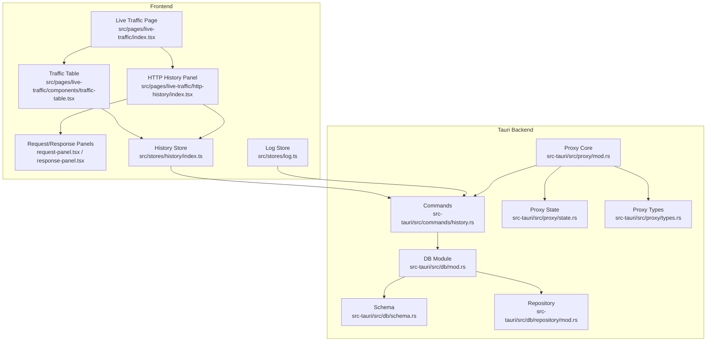
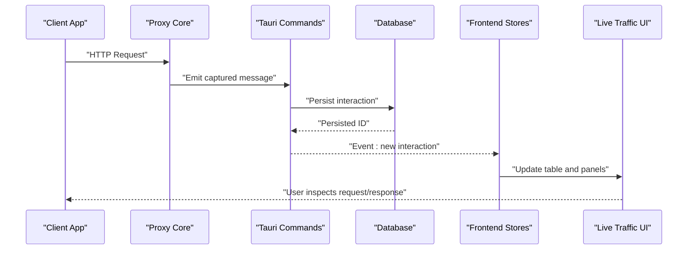
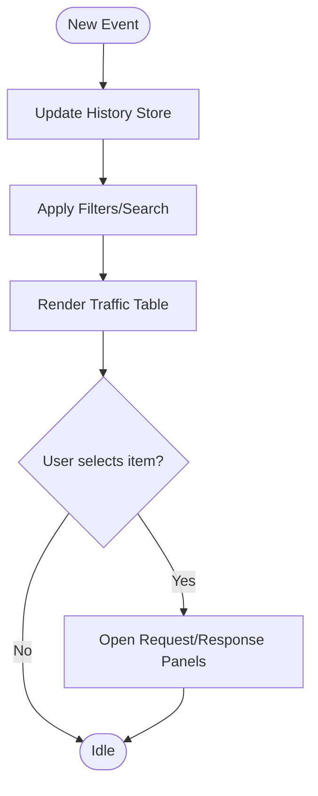
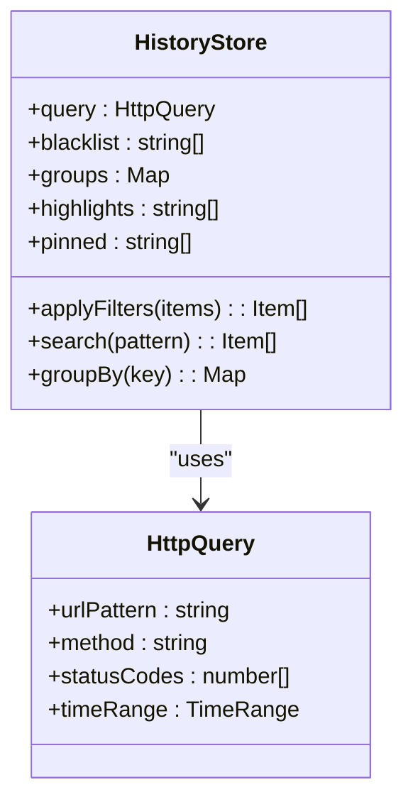
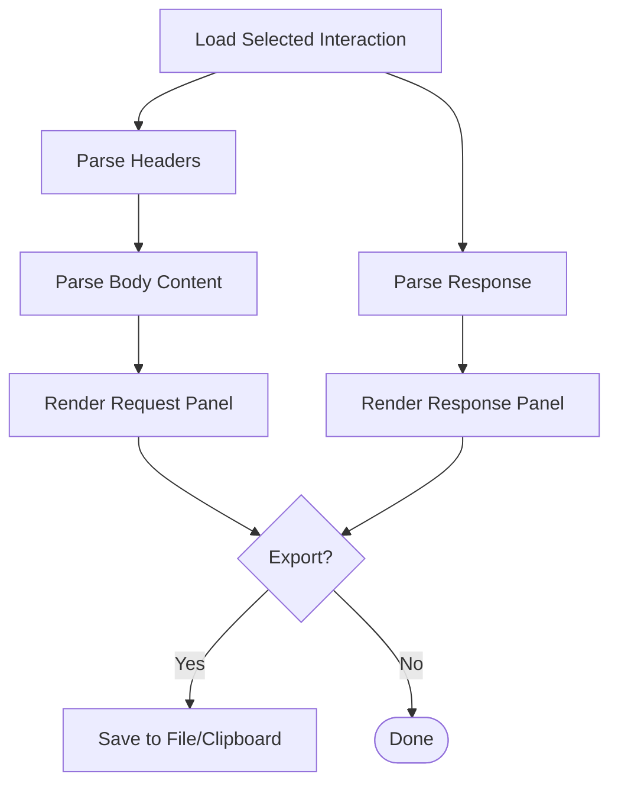
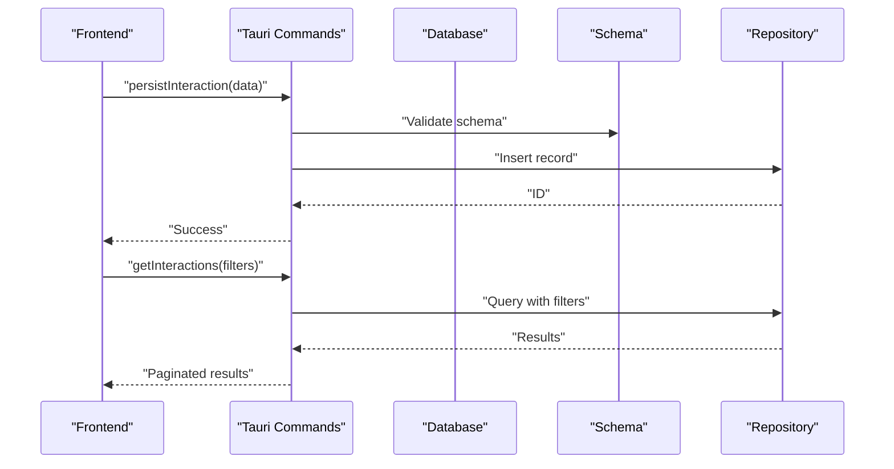
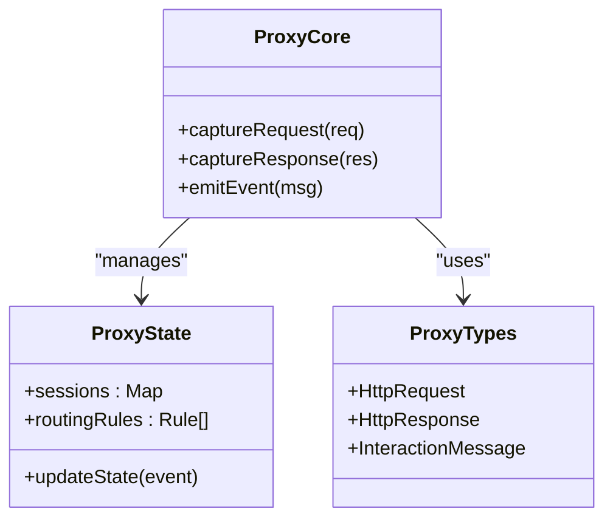
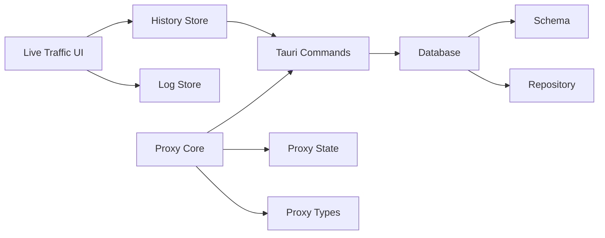

# Interaction Logging & Analysis

<cite>
**Referenced Files in This Document**
- [src/pages/live-traffic/index.tsx](file://src/pages/live-traffic/index.tsx)
- [src/pages/live-traffic/components/traffic-table.tsx](file://src/pages/live-traffic/components/traffic-table.tsx)
- [src/pages/live-traffic/http-history/index.tsx](file://src/pages/live-traffic/http-history/index.tsx)
- [src/pages/live-traffic/http-history/components/request-panel.tsx](file://src/pages/live-traffic/http-history/components/request-panel.tsx)
- [src/pages/live-traffic/http-history/components/response-panel.tsx](file://src/pages/live-traffic/http-history/components/response-panel.tsx)
- [src/stores/history/index.ts](file://src/stores/history/index.ts)
- [src/stores/history/http-query.ts](file://src/stores/history/http-query.ts)
- [src/stores/history/http-blacklist.ts](file://src/stores/history/http-blacklist.ts)
- [src/stores/history/http-groups.ts](file://src/stores/history/http-groups.ts)
- [src/stores/history/http-highlight.ts](file://src/stores/history/http-highlight.ts)
- [src/stores/history/http-pinned.ts](file://src/stores/history/http-pinned.ts)
- [src/stores/log.ts](file://src/stores/log.ts)
- [src/lib/http-message.ts](file://src/lib/http-message.ts)
- [src-tauri/src/proxy/mod.rs](file://src-tauri/src/proxy/mod.rs)
- [src-tauri/src/proxy/state.rs](file://src-tauri/src/proxy/state.rs)
- [src-tauri/src/proxy/types.rs](file://src-tauri/src/proxy/types.rs)
- [src-tauri/src/commands/history.rs](file://src-tauri/src/commands/history.rs)
- [src-tauri/src/db/mod.rs](file://src-tauri/src/db/mod.rs)
- [src-tauri/src/db/schema.rs](file://src-tauri/src/db/schema.rs)
- [src-tauri/src/db/repository/mod.rs](file://src-tauri/src/db/repository/mod.rs)
</cite>

## Table of Contents
1. [Introduction](#introduction)
2. [Project Structure](#project-structure)
3. [Core Components](#core-components)
4. [Architecture Overview](#architecture-overview)
5. [Detailed Component Analysis](#detailed-component-analysis)
6. [Dependency Analysis](#dependency-analysis)
7. [Performance Considerations](#performance-considerations)
8. [Troubleshooting Guide](#troubleshooting-guide)
9. [Conclusion](#conclusion)
10. [Appendices](#appendices)

## Introduction
This document explains Apprecon’s Interaction Logging and Analysis features with a focus on how the tool captures, stores, displays, and analyzes incoming requests to mock services. It covers request headers, body content, timestamps, response details, the interaction panel for browsing/filtering/searching, data export capabilities, log persistence, real-time monitoring, debugging scenarios, retention policies, performance considerations under high-volume traffic, and troubleshooting techniques for service communication problems.

## Project Structure
Apprecon implements interaction logging across both frontend (React/Tauri) and backend (Rust). The key areas are:
- Live Traffic UI: Real-time table and panels for inspecting HTTP interactions.
- History Store: In-memory state for filtering, grouping, pinning, highlighting, and querying logs.
- Tauri Commands and DB: Persistence layer for long-term storage and retrieval.
- Proxy Layer: Captures network traffic and forwards it into the application pipeline.

**Diagram sources**
- [src/pages/live-traffic/index.tsx](file://src/pages/live-traffic/index.tsx)
- [src/pages/live-traffic/components/traffic-table.tsx](file://src/pages/live-traffic/components/traffic-table.tsx)
- [src/pages/live-traffic/http-history/index.tsx](file://src/pages/live-traffic/http-history/index.tsx)
- [src/pages/live-traffic/http-history/components/request-panel.tsx](file://src/pages/live-traffic/http-history/components/request-panel.tsx)
- [src/pages/live-traffic/http-history/components/response-panel.tsx](file://src/pages/live-traffic/http-history/components/response-panel.tsx)
- [src/stores/history/index.ts](file://src/stores/history/index.ts)
- [src/stores/log.ts](file://src/stores/log.ts)
- [src-tauri/src/commands/history.rs](file://src-tauri/src/commands/history.rs)
- [src-tauri/src/proxy/mod.rs](file://src-tauri/src/proxy/mod.rs)
- [src-tauri/src/proxy/state.rs](file://src-tauri/src/proxy/state.rs)
- [src-tauri/src/proxy/types.rs](file://src-tauri/src/proxy/types.rs)
- [src-tauri/src/db/mod.rs](file://src-tauri/src/db/mod.rs)
- [src-tauri/src/db/schema.rs](file://src-tauri/src/db/schema.rs)
- [src-tauri/src/db/repository/mod.rs](file://src-tauri/src/db/repository/mod.rs)

**Section sources**
- [src/pages/live-traffic/index.tsx](file://src/pages/live-traffic/index.tsx)
- [src/stores/history/index.ts](file://src/stores/history/index.ts)
- [src-tauri/src/proxy/mod.rs](file://src-tauri/src/proxy/mod.rs)
- [src-tauri/src/commands/history.rs](file://src-tauri/src/commands/history.rs)
- [src-tauri/src/db/mod.rs](file://src-tauri/src/db/mod.rs)

## Core Components
- Live Traffic Page and Table: Displays captured interactions in real time, supports selection and navigation to detailed views.
- HTTP History Panel: Provides browsing, filtering, searching, grouping, pinning, and highlighting of logged interactions.
- Request/Response Panels: Render headers, body content, timestamps, status codes, and metadata for selected interactions.
- History Store: Centralized state for query filters, groups, pinned items, highlights, and pagination.
- Log Store: General-purpose logging utilities and event bus for UI updates.
- Tauri Commands: Bridge between frontend and backend for persistence and retrieval.
- Proxy Layer: Captures HTTP traffic, constructs typed messages, and emits events to the frontend.
- Database Layer: Persists interactions using schema-defined tables and repository methods.

**Section sources**
- [src/pages/live-traffic/components/traffic-table.tsx](file://src/pages/live-traffic/components/traffic-table.tsx)
- [src/pages/live-traffic/http-history/index.tsx](file://src/pages/live-traffic/http-history/index.tsx)
- [src/pages/live-traffic/http-history/components/request-panel.tsx](file://src/pages/live-traffic/http-history/components/request-panel.tsx)
- [src/pages/live-traffic/http-history/components/response-panel.tsx](file://src/pages/live-traffic/http-history/components/response-panel.tsx)
- [src/stores/history/index.ts](file://src/stores/history/index.ts)
- [src/stores/log.ts](file://src/stores/log.ts)
- [src-tauri/src/commands/history.rs](file://src-tauri/src/commands/history.rs)
- [src-tauri/src/proxy/mod.rs](file://src-tauri/src/proxy/mod.rs)
- [src-tauri/src/db/mod.rs](file://src-tauri/src/db/mod.rs)

## Architecture Overview
The system follows a clear separation of concerns:
- Capture: The proxy intercepts HTTP traffic and builds structured messages.
- Transport: Tauri commands relay messages to the frontend via an event channel or direct calls.
- Storage: Interactions are persisted through the database module and repository.
- Presentation: The live traffic page and history panel render logs with rich inspection capabilities.

**Diagram sources**
- [src-tauri/src/proxy/mod.rs](file://src-tauri/src/proxy/mod.rs)
- [src-tauri/src/commands/history.rs](file://src-tauri/src/commands/history.rs)
- [src-tauri/src/db/mod.rs](file://src-tauri/src/db/mod.rs)
- [src/stores/history/index.ts](file://src/stores/history/index.ts)
- [src/pages/live-traffic/index.tsx](file://src/pages/live-traffic/index.tsx)

## Detailed Component Analysis

### Live Traffic Page and Table
- Purpose: Real-time display of captured interactions; allows selection and drill-down into details.
- Key behaviors:
  - Subscribes to new interaction events from the store.
  - Renders rows with method, URL, status, and timestamp.
  - Supports sorting and quick actions (pin, highlight, group).
- Data flow:
  - Events arrive from Tauri commands via the history store.
  - Table re-renders efficiently based on store updates.

**Diagram sources**
- [src/pages/live-traffic/components/traffic-table.tsx](file://src/pages/live-traffic/components/traffic-table.tsx)
- [src/stores/history/index.ts](file://src/stores/history/index.ts)

**Section sources**
- [src/pages/live-traffic/components/traffic-table.tsx](file://src/pages/live-traffic/components/traffic-table.tsx)
- [src/stores/history/index.ts](file://src/stores/history/index.ts)

### HTTP History Panel
- Purpose: Browse, filter, search, group, pin, and highlight historical interactions.
- Features:
  - Query builder for URL patterns, methods, status codes, and time ranges.
  - Grouping by domain, path segments, or custom tags.
  - Pinning critical interactions for quick access.
  - Highlighting anomalies or specific patterns.
- Integration:
  - Uses history store slices for query, blacklist, groups, highlights, and pinned items.
  - Calls Tauri commands to fetch persisted records when needed.

**Diagram sources**
- [src/stores/history/index.ts](file://src/stores/history/index.ts)
- [src/stores/history/http-query.ts](file://src/stores/history/http-query.ts)
- [src/stores/history/http-blacklist.ts](file://src/stores/history/http-blacklist.ts)
- [src/stores/history/http-groups.ts](file://src/stores/history/http-groups.ts)
- [src/stores/history/http-highlight.ts](file://src/stores/history/http-highlight.ts)
- [src/stores/history/http-pinned.ts](file://src/stores/history/http-pinned.ts)

**Section sources**
- [src/pages/live-traffic/http-history/index.tsx](file://src/pages/live-traffic/http-history/index.tsx)
- [src/stores/history/index.ts](file://src/stores/history/index.ts)
- [src/stores/history/http-query.ts](file://src/stores/history/http-query.ts)
- [src/stores/history/http-blacklist.ts](file://src/stores/history/http-blacklist.ts)
- [src/stores/history/http-groups.ts](file://src/stores/history/http-groups.ts)
- [src/stores/history/http-highlight.ts](file://src/stores/history/http-highlight.ts)
- [src/stores/history/http-pinned.ts](file://src/stores/history/http-pinned.ts)

### Request and Response Panels
- Purpose: Inspect detailed request and response payloads.
- Capabilities:
  - Display headers, cookies, body content (JSON/text/binary), timestamps, and status codes.
  - Syntax highlighting and formatting for readability.
  - Copy/export options for individual fields or full payloads.
- Data model:
  - Uses HTTP message utilities to parse and present structured data.

**Diagram sources**
- [src/pages/live-traffic/http-history/components/request-panel.tsx](file://src/pages/live-traffic/http-history/components/request-panel.tsx)
- [src/pages/live-traffic/http-history/components/response-panel.tsx](file://src/pages/live-traffic/http-history/components/response-panel.tsx)
- [src/lib/http-message.ts](file://src/lib/http-message.ts)

**Section sources**
- [src/pages/live-traffic/http-history/components/request-panel.tsx](file://src/pages/live-traffic/http-history/components/request-panel.tsx)
- [src/pages/live-traffic/http-history/components/response-panel.tsx](file://src/pages/live-traffic/http-history/components/response-panel.tsx)
- [src/lib/http-message.ts](file://src/lib/http-message.ts)

### Tauri Commands and Database Layer
- Purpose: Provide persistent storage and retrieval of interactions; expose APIs to the frontend.
- Responsibilities:
  - Persist captured interactions to the database.
  - Query logs with filters and pagination.
  - Manage retention and cleanup operations.
- Schema and Repository:
  - Schema defines tables for interactions, headers, bodies, and metadata.
  - Repository encapsulates CRUD operations and complex queries.

**Diagram sources**
- [src-tauri/src/commands/history.rs](file://src-tauri/src/commands/history.rs)
- [src-tauri/src/db/mod.rs](file://src-tauri/src/db/mod.rs)
- [src-tauri/src/db/schema.rs](file://src-tauri/src/db/schema.rs)
- [src-tauri/src/db/repository/mod.rs](file://src-tauri/src/db/repository/mod.rs)

**Section sources**
- [src-tauri/src/commands/history.rs](file://src-tauri/src/commands/history.rs)
- [src-tauri/src/db/mod.rs](file://src-tauri/src/db/mod.rs)
- [src-tauri/src/db/schema.rs](file://src-tauri/src/db/schema.rs)
- [src-tauri/src/db/repository/mod.rs](file://src-tauri/src/db/repository/mod.rs)

### Proxy Layer
- Purpose: Intercept HTTP traffic, construct typed messages, and emit them to the application pipeline.
- Key aspects:
  - Captures request headers, body, timestamps, and response details.
  - Maintains state for active sessions and routing decisions.
  - Emits events consumed by Tauri commands and frontend stores.

**Diagram sources**
- [src-tauri/src/proxy/mod.rs](file://src-tauri/src/proxy/mod.rs)
- [src-tauri/src/proxy/state.rs](file://src-tauri/src/proxy/state.rs)
- [src-tauri/src/proxy/types.rs](file://src-tauri/src/proxy/types.rs)

**Section sources**
- [src-tauri/src/proxy/mod.rs](file://src-tauri/src/proxy/mod.rs)
- [src-tauri/src/proxy/state.rs](file://src-tauri/src/proxy/state.rs)
- [src-tauri/src/proxy/types.rs](file://src-tauri/src/proxy/types.rs)

## Dependency Analysis
- Frontend dependencies:
  - Live Traffic UI depends on History Store and Log Store for state management.
  - HTTP History Panel composes multiple store slices for filtering and organization.
- Backend dependencies:
  - Tauri Commands depend on Database Module, Schema, and Repository.
  - Proxy Core depends on Proxy State and Types to manage capture and emission.
- Coupling and cohesion:
  - Clear separation between capture (proxy), transport (commands), storage (db), and presentation (UI).
  - Minimal coupling via well-defined interfaces and typed messages.

**Diagram sources**
- [src/pages/live-traffic/index.tsx](file://src/pages/live-traffic/index.tsx)
- [src/stores/history/index.ts](file://src/stores/history/index.ts)
- [src/stores/log.ts](file://src/stores/log.ts)
- [src-tauri/src/commands/history.rs](file://src-tauri/src/commands/history.rs)
- [src-tauri/src/db/mod.rs](file://src-tauri/src/db/mod.rs)
- [src-tauri/src/db/schema.rs](file://src-tauri/src/db/schema.rs)
- [src-tauri/src/db/repository/mod.rs](file://src-tauri/src/db/repository/mod.rs)
- [src-tauri/src/proxy/mod.rs](file://src-tauri/src/proxy/mod.rs)
- [src-tauri/src/proxy/state.rs](file://src-tauri/src/proxy/state.rs)
- [src-tauri/src/proxy/types.rs](file://src-tauri/src/proxy/types.rs)

**Section sources**
- [src/stores/history/index.ts](file://src/stores/history/index.ts)
- [src/stores/log.ts](file://src/stores/log.ts)
- [src-tauri/src/commands/history.rs](file://src-tauri/src/commands/history.rs)
- [src-tauri/src/db/mod.rs](file://src-tauri/src/db/mod.rs)
- [src-tauri/src/proxy/mod.rs](file://src-tauri/src/proxy/mod.rs)

## Performance Considerations
- High-volume traffic:
  - Use efficient filtering and pagination in queries to avoid large result sets.
  - Debounce UI updates and batch store mutations to reduce re-renders.
  - Limit payload sizes in persistence; consider compressing large bodies.
- Retention policies:
  - Implement automated cleanup jobs to remove old or low-priority logs.
  - Support configurable retention windows and size-based pruning.
- Memory management:
  - Stream large responses instead of loading entirely into memory.
  - Unsubscribe from events when components unmount to prevent leaks.

[No sources needed since this section provides general guidance]

## Troubleshooting Guide
Common issues and resolutions:
- Missing interactions:
  - Verify proxy is capturing traffic and emitting events.
  - Check Tauri command permissions and database connectivity.
- Slow UI rendering:
  - Reduce payload sizes; enable lazy loading for large bodies.
  - Optimize filters and avoid heavy computations on every update.
- Incorrect parsing:
  - Validate content types and encoding; handle binary payloads safely.
  - Ensure schema matches expected message structures.
- Export failures:
  - Confirm file system permissions and available disk space.
  - Handle encoding errors gracefully and provide user feedback.

**Section sources**
- [src-tauri/src/proxy/mod.rs](file://src-tauri/src/proxy/mod.rs)
- [src-tauri/src/commands/history.rs](file://src-tauri/src/commands/history.rs)
- [src-tauri/src/db/mod.rs](file://src-tauri/src/db/mod.rs)
- [src/stores/history/index.ts](file://src/stores/history/index.ts)

## Conclusion
Apprecon’s Interaction Logging and Analysis features provide a robust, real-time view of HTTP traffic with powerful inspection, filtering, and persistence capabilities. By separating capture, transport, storage, and presentation layers, the system remains scalable and maintainable. Proper tuning of retention policies, performance optimizations, and proactive troubleshooting ensure reliable operation even under high-volume conditions.

[No sources needed since this section summarizes without analyzing specific files]

## Appendices
- Debugging Scenarios:
  - Trace request flows: Follow the sequence from proxy capture through commands to UI updates.
  - Analyze response patterns: Use filters and highlights to identify recurring statuses or payloads.
  - Identify integration issues: Compare expected vs actual headers and bodies; validate schemas.
- Data Export:
  - Export selected interactions to JSON or CSV for offline analysis.
  - Include headers, bodies, timestamps, and status codes in exports.
- Log Retention Policies:
  - Configure retention windows and size limits via settings.
  - Automate cleanup to maintain performance and storage efficiency.

[No sources needed since this section provides general guidance]