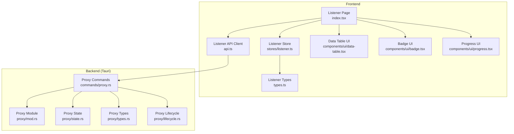
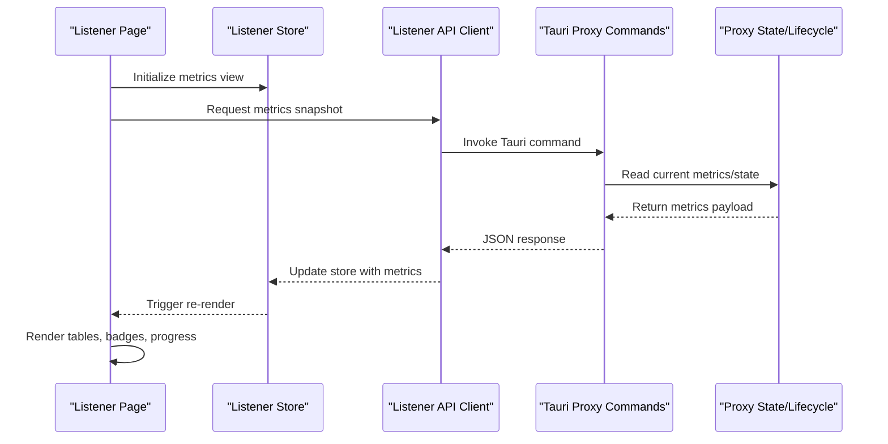
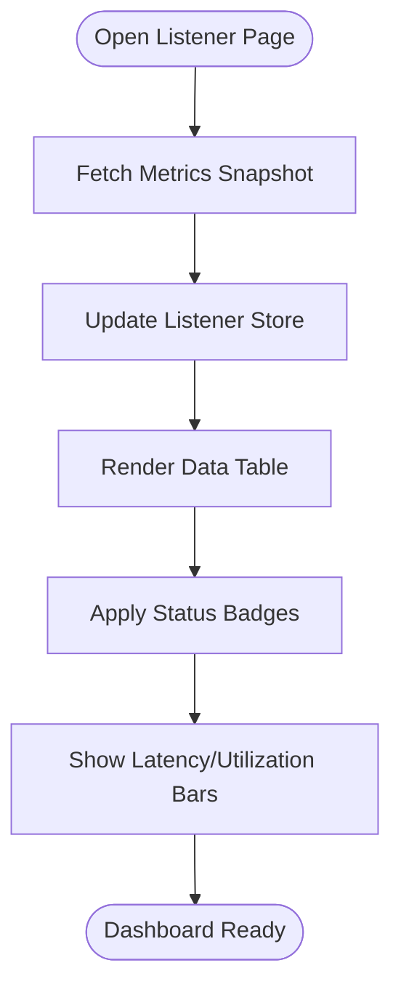
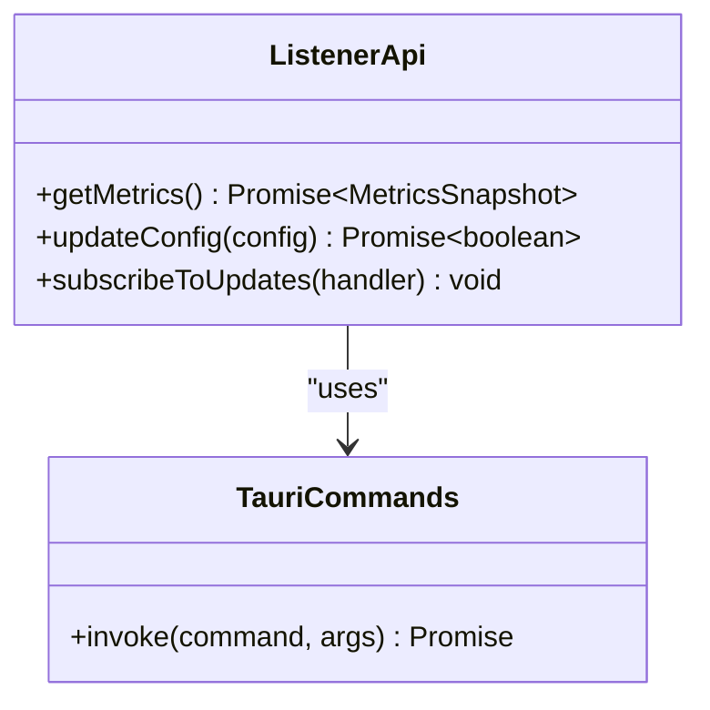
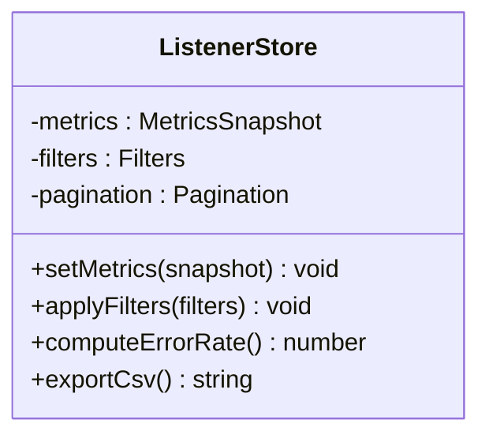
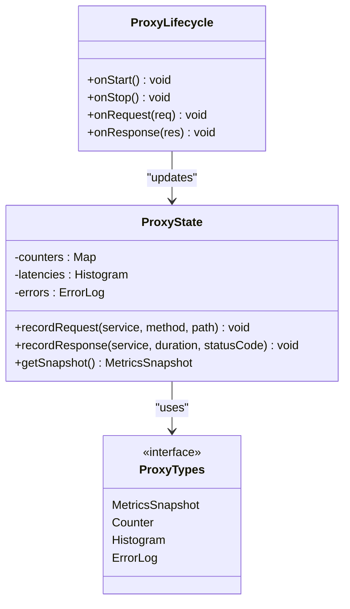
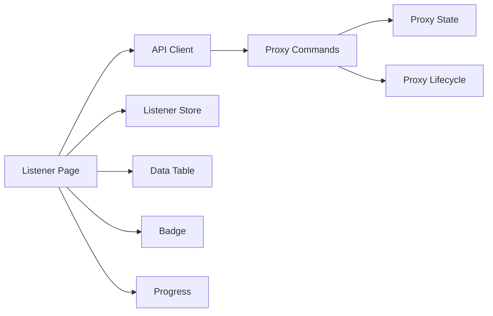

# Metrics & Monitoring

<cite>
**Referenced Files in This Document**
- [src/pages/listener/index.tsx](file://src/pages/listener/index.tsx)
- [src/pages/listener/api.ts](file://src/pages/listener/api.ts)
- [src/pages/listener/types.ts](file://src/pages/listener/types.ts)
- [src/pages/listener/constants.ts](file://src/pages/listener/constants.ts)
- [src/stores/listener.ts](file://src/stores/listener.ts)
- [src/components/ui/data-table.tsx](file://src/components/ui/data-table.tsx)
- [src/components/ui/badge.tsx](file://src/components/ui/badge.tsx)
- [src/components/ui/progress.tsx](file://src/components/ui/progress.tsx)
- [src-tauri/src/proxy/mod.rs](file://src-tauri/src/proxy/mod.rs)
- [src-tauri/src/proxy/state.rs](file://src-tauri/src/proxy/state.rs)
- [src-tauri/src/proxy/types.rs](file://src-tauri/src/proxy/types.rs)
- [src-tauri/src/proxy/lifecycle.rs](file://src-tauri/src/proxy/lifecycle.rs)
- [src-tauri/src/commands/proxy.rs](file://src-tauri/src/commands/proxy.rs)
</cite>

## Table of Contents
1. Introduction
2. Project Structure
3. Core Components
4. Architecture Overview
5. Detailed Component Analysis
6. Dependency Analysis
7. Performance Considerations
8. Troubleshooting Guide
9. Conclusion

## Introduction
This document explains Apprecon’s Service Listener Metrics and Monitoring capabilities. It covers how the tool tracks service performance metrics such as request counts, response times, error rates, and throughput statistics; how the metrics dashboard visualizes service health and trends; alerting mechanisms; custom metric definitions; and integration with external monitoring systems. It also includes practical monitoring scenarios (capacity planning, performance optimization, reliability assessment), aggregation strategies, data retention policies, and best practices for observability in microservice architectures.

## Project Structure
The listener metrics feature spans both the frontend (React/Tauri UI) and backend (Rust proxy). The frontend provides a dedicated Listener page with tables, badges, and progress indicators to visualize metrics. The backend proxy collects runtime state and exposes commands for the UI to query and display metrics.

**Diagram sources**
- [src/pages/listener/index.tsx](file://src/pages/listener/index.tsx)
- [src/pages/listener/api.ts](file://src/pages/listener/api.ts)
- [src/pages/listener/types.ts](file://src/pages/listener/types.ts)
- [src/stores/listener.ts](file://src/stores/listener.ts)
- [src/components/ui/data-table.tsx](file://src/components/ui/data-table.tsx)
- [src/components/ui/badge.tsx](file://src/components/ui/badge.tsx)
- [src/components/ui/progress.tsx](file://src/components/ui/progress.tsx)
- [src-tauri/src/proxy/mod.rs](file://src-tauri/src/proxy/mod.rs)
- [src-tauri/src/proxy/state.rs](file://src-tauri/src/proxy/state.rs)
- [src-tauri/src/proxy/types.rs](file://src-tauri/src/proxy/types.rs)
- [src-tauri/src/proxy/lifecycle.rs](file://src-tauri/src/proxy/lifecycle.rs)
- [src-tauri/src/commands/proxy.rs](file://src-tauri/src/commands/proxy.rs)

**Section sources**
- [src/pages/listener/index.tsx](file://src/pages/listener/index.tsx)
- [src/pages/listener/api.ts](file://src/pages/listener/api.ts)
- [src/pages/listener/types.ts](file://src/pages/listener/types.ts)
- [src/stores/listener.ts](file://src/stores/listener.ts)
- [src-tauri/src/proxy/mod.rs](file://src-tauri/src/proxy/mod.rs)
- [src-tauri/src/proxy/state.rs](file://src-tauri/src/proxy/state.rs)
- [src-tauri/src/proxy/types.rs](file://src-tauri/src/proxy/types.rs)
- [src-tauri/src/proxy/lifecycle.rs](file://src-tauri/src/proxy/lifecycle.rs)
- [src-tauri/src/commands/proxy.rs](file://src-tauri/src/commands/proxy.rs)

## Core Components
- Listener Page: Renders the metrics dashboard, including tables and status indicators for services under observation.
- Listener API Client: Encapsulates Tauri command calls to fetch metrics and configuration from the backend.
- Listener Store: Manages local state for metrics data, filters, and UI interactions.
- Proxy Backend: Collects runtime metrics (request counts, latencies, errors, throughput) and exposes them via Tauri commands.
- UI Primitives: Data table, badge, and progress components used to visualize metrics and statuses.

Key responsibilities:
- Data acquisition: Query backend for current metrics snapshots and historical aggregates where applicable.
- Visualization: Render tabular views, trend indicators, and status badges.
- Configuration: Allow enabling/disabling metrics collection and defining custom metrics.
- Alerting: Surface thresholds and conditions that trigger alerts or notifications.

**Section sources**
- [src/pages/listener/index.tsx](file://src/pages/listener/index.tsx)
- [src/pages/listener/api.ts](file://src/pages/listener/api.ts)
- [src/stores/listener.ts](file://src/stores/listener.ts)
- [src-tauri/src/proxy/mod.rs](file://src-tauri/src/proxy/mod.rs)
- [src-tauri/src/proxy/state.rs](file://src-tauri/src/proxy/state.rs)
- [src-tauri/src/proxy/types.rs](file://src-tauri/src/proxy/types.rs)
- [src-tauri/src/proxy/lifecycle.rs](file://src-tauri/src/proxy/lifecycle.rs)
- [src-tauri/src/commands/proxy.rs](file://src-tauri/src/commands/proxy.rs)

## Architecture Overview
The metrics pipeline integrates the frontend UI with the Rust-based proxy through Tauri commands. The proxy maintains internal state and types to track service metrics. The UI polls or subscribes to updates and renders dashboards using shared UI primitives.

**Diagram sources**
- [src/pages/listener/index.tsx](file://src/pages/listener/index.tsx)
- [src/pages/listener/api.ts](file://src/pages/listener/api.ts)
- [src/stores/listener.ts](file://src/stores/listener.ts)
- [src-tauri/src/commands/proxy.rs](file://src-tauri/src/commands/proxy.rs)
- [src-tauri/src/proxy/state.rs](file://src-tauri/src/proxy/state.rs)
- [src-tauri/src/proxy/lifecycle.rs](file://src-tauri/src/proxy/lifecycle.rs)

## Detailed Component Analysis

### Listener Page (Dashboard)
- Purpose: Provides a centralized view of service metrics, including request counts, response times, error rates, and throughput.
- Behavior: Fetches metrics via the API client, updates the store, and renders data using table and status components. Supports filtering and sorting for large datasets.
- Visual elements: Data table for rows of services/metrics, badges for status categories, and progress bars for latency or utilization indicators.

**Diagram sources**
- [src/pages/listener/index.tsx](file://src/pages/listener/index.tsx)
- [src/pages/listener/api.ts](file://src/pages/listener/api.ts)
- [src/stores/listener.ts](file://src/stores/listener.ts)
- [src/components/ui/data-table.tsx](file://src/components/ui/data-table.tsx)
- [src/components/ui/badge.tsx](file://src/components/ui/badge.tsx)
- [src/components/ui/progress.tsx](file://src/components/ui/progress.tsx)

**Section sources**
- [src/pages/listener/index.tsx](file://src/pages/listener/index.tsx)
- [src/components/ui/data-table.tsx](file://src/components/ui/data-table.tsx)
- [src/components/ui/badge.tsx](file://src/components/ui/badge.tsx)
- [src/components/ui/progress.tsx](file://src/components/ui/progress.tsx)

### Listener API Client
- Purpose: Encapsulates Tauri command invocations for metrics retrieval and configuration changes.
- Behavior: Serializes requests, handles responses, and maps backend payloads to frontend types. Includes retry logic and error handling for network or command failures.

**Diagram sources**
- [src/pages/listener/api.ts](file://src/pages/listener/api.ts)
- [src-tauri/src/commands/proxy.rs](file://src-tauri/src/commands/proxy.rs)

**Section sources**
- [src/pages/listener/api.ts](file://src/pages/listener/api.ts)
- [src-tauri/src/commands/proxy.rs](file://src-tauri/src/commands/proxy.rs)

### Listener Store
- Purpose: Centralized state management for metrics data, filters, pagination, and UI interactions.
- Behavior: Holds snapshots, computes derived values (e.g., error rate percentages), and exposes actions to update state reactively.

**Diagram sources**
- [src/stores/listener.ts](file://src/stores/listener.ts)
- [src/pages/listener/types.ts](file://src/pages/listener/types.ts)

**Section sources**
- [src/stores/listener.ts](file://src/stores/listener.ts)
- [src/pages/listener/types.ts](file://src/pages/listener/types.ts)

### Proxy Backend (Metrics Collection)
- Purpose: Captures runtime metrics for proxied services, including request counts, response times, error codes, and throughput.
- Behavior: Maintains state and lifecycle hooks to record events, aggregate counters, and expose metrics via Tauri commands.

**Diagram sources**
- [src-tauri/src/proxy/state.rs](file://src-tauri/src/proxy/state.rs)
- [src-tauri/src/proxy/lifecycle.rs](file://src-tauri/src/proxy/lifecycle.rs)
- [src-tauri/src/proxy/types.rs](file://src-tauri/src/proxy/types.rs)

**Section sources**
- [src-tauri/src/proxy/state.rs](file://src-tauri/src/proxy/state.rs)
- [src-tauri/src/proxy/lifecycle.rs](file://src-tauri/src/proxy/lifecycle.rs)
- [src-tauri/src/proxy/types.rs](file://src-tauri/src/proxy/types.rs)
- [src-tauri/src/proxy/mod.rs](file://src-tauri/src/proxy/mod.rs)

## Dependency Analysis
The Listener feature depends on shared UI components and the Tauri command layer. The backend relies on proxy modules for state and lifecycle management.

**Diagram sources**
- [src/pages/listener/index.tsx](file://src/pages/listener/index.tsx)
- [src/pages/listener/api.ts](file://src/pages/listener/api.ts)
- [src/stores/listener.ts](file://src/stores/listener.ts)
- [src-tauri/src/commands/proxy.rs](file://src-tauri/src/commands/proxy.rs)
- [src-tauri/src/proxy/state.rs](file://src-tauri/src/proxy/state.rs)
- [src-tauri/src/proxy/lifecycle.rs](file://src-tauri/src/proxy/lifecycle.rs)
- [src/components/ui/data-table.tsx](file://src/components/ui/data-table.tsx)
- [src/components/ui/badge.tsx](file://src/components/ui/badge.tsx)
- [src/components/ui/progress.tsx](file://src/components/ui/progress.tsx)

**Section sources**
- [src/pages/listener/index.tsx](file://src/pages/listener/index.tsx)
- [src/pages/listener/api.ts](file://src/pages/listener/api.ts)
- [src/stores/listener.ts](file://src/stores/listener.ts)
- [src-tauri/src/commands/proxy.rs](file://src-tauri/src/commands/proxy.rs)
- [src-tauri/src/proxy/state.rs](file://src-tauri/src/proxy/state.rs)
- [src-tauri/src/proxy/lifecycle.rs](file://src-tauri/src/proxy/lifecycle.rs)
- [src/components/ui/data-table.tsx](file://src/components/ui/data-table.tsx)
- [src/components/ui/badge.tsx](file://src/components/ui/badge.tsx)
- [src/components/ui/progress.tsx](file://src/components/ui/progress.tsx)

## Performance Considerations
- Sampling and Aggregation: Use histograms and sliding windows to compute p50/p95/p99 latencies without storing raw samples indefinitely.
- Backpressure: Debounce UI updates and batch metric queries to avoid overwhelming the UI thread or backend.
- Memory Management: Cap histogram buckets and error logs; periodically compact counters.
- I/O Efficiency: Prefer incremental updates over full snapshots when possible; use efficient serialization formats.
- Concurrency: Ensure thread-safe access to shared counters and histograms in the proxy state.

[No sources needed since this section provides general guidance]

## Troubleshooting Guide
Common issues and resolutions:
- Metrics not updating: Verify Tauri command invocation and ensure the proxy is running and healthy. Check network connectivity between UI and backend.
- High memory usage: Inspect unbounded histograms or error logs; apply retention policies and periodic compaction.
- Incorrect error rates: Validate status code classification and ensure all endpoints are instrumented consistently.
- Dashboard lag: Reduce polling frequency, enable virtualization for large tables, and minimize re-renders by memoizing derived values.

**Section sources**
- [src/pages/listener/api.ts](file://src/pages/listener/api.ts)
- [src/stores/listener.ts](file://src/stores/listener.ts)
- [src-tauri/src/commands/proxy.rs](file://src-tauri/src/commands/proxy.rs)
- [src-tauri/src/proxy/state.rs](file://src-tauri/src/proxy/state.rs)

## Conclusion
Apprecon’s Service Listener Metrics and Monitoring provide a cohesive frontend dashboard backed by a robust Rust proxy. Together, they capture essential performance indicators, visualize trends, and support operational tasks like capacity planning and reliability assessments. By applying recommended aggregation strategies, retention policies, and observability best practices, teams can maintain high visibility into service health and performance across microservice architectures.

[No sources needed since this section summarizes without analyzing specific files]

## Appendices

### Metrics Definitions and Examples
- Request Count: Total number of requests per service endpoint over a time window.
- Response Time: Distribution of latencies; report mean, median, and percentiles.
- Error Rate: Ratio of 4xx/5xx responses to total requests.
- Throughput: Requests per second aggregated across services or endpoints.

[No sources needed since this section provides general guidance]

### Alerting Mechanisms
- Threshold Alerts: Define limits for error rate, latency percentiles, and throughput drops.
- Anomaly Detection: Flag sudden spikes or dips compared to baseline patterns.
- Notification Channels: Integrate with email, Slack, or webhook endpoints for real-time alerts.

[No sources needed since this section provides general guidance]

### Custom Metric Definitions
- Add new counters for business KPIs (e.g., transactions per minute).
- Instrument custom histograms for domain-specific durations.
- Tag metrics with service, version, region, and operation for granular analysis.

[No sources needed since this section provides general guidance]

### Integration with External Monitoring Systems
- Exporters: Push metrics to Prometheus, OpenTelemetry, or cloud providers.
- Dashboards: Connect Grafana or similar tools to visualize exported metrics.
- Tracing: Correlate metrics with distributed traces for root cause analysis.

[No sources needed since this section provides general guidance]

### Monitoring Scenarios
- Capacity Planning: Analyze throughput trends and latency growth to forecast scaling needs.
- Performance Optimization: Identify slow endpoints and hot paths; validate improvements post-deployment.
- Reliability Assessment: Monitor error rates and SLO compliance; detect regressions early.

[No sources needed since this section provides general guidance]

### Data Retention Policies
- Short-term: Keep detailed samples for hours/days for debugging.
- Long-term: Aggregate to hourly/daily summaries for months/years.
- Cleanup: Implement automated rotation and deletion based on retention rules.

[No sources needed since this section provides general guidance]

### Best Practices for Observability in Microservices
- Standardize instrumentation across services.
- Use consistent naming conventions and tags.
- Combine metrics, logs, and traces for holistic insights.
- Automate alerting and runbooks for common incidents.

[No sources needed since this section provides general guidance]