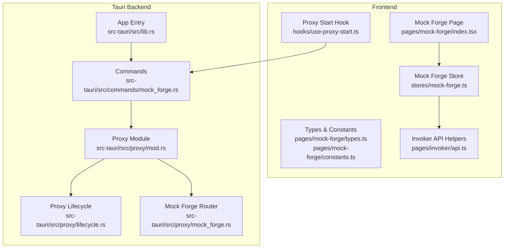
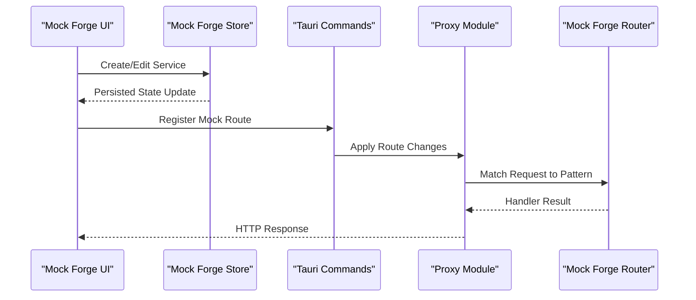
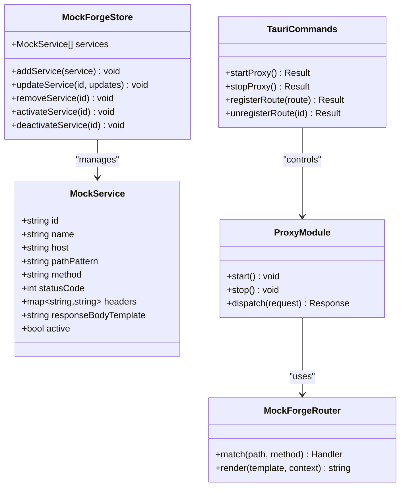
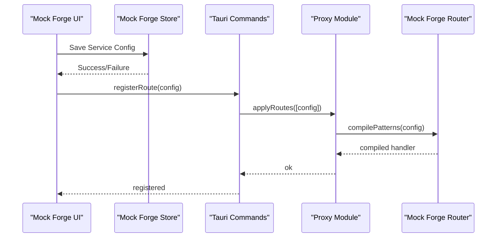
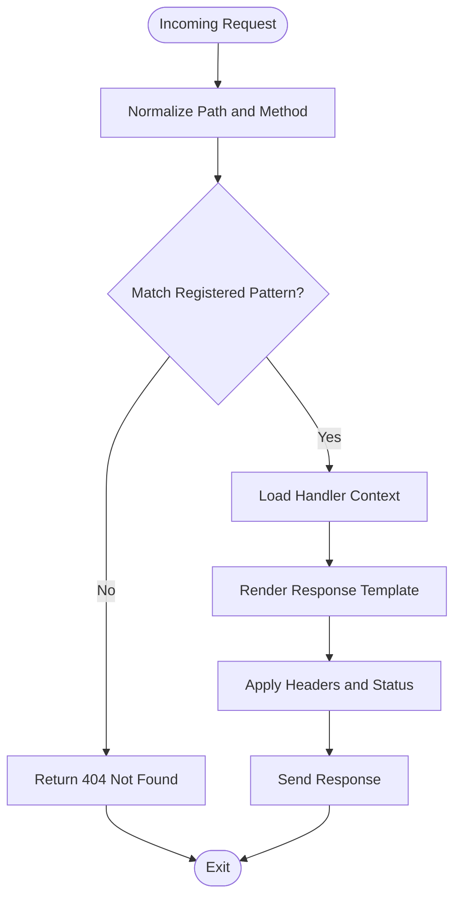
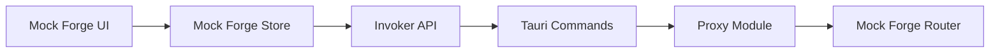

# Service Creation & Configuration

<cite>
**Referenced Files in This Document**
- [mock-forge.ts](file://src/stores/mock-forge.ts)
- [index.tsx](file://src/pages/mock-forge/index.tsx)
- [types.ts](file://src/pages/mock-forge/types.ts)
- [constants.ts](file://src/pages/mock-forge/constants.ts)
- [api.ts](file://src/pages/invoker/api.ts)
- [use-proxy-start.ts](file://src/hooks/use-proxy-start.ts)
- [proxy.ts](file://docs/website/proxy.ts)
- [mod.rs](file://src-tauri/src/proxy/mod.rs)
- [lifecycle.rs](file://src-tauri/src/proxy/lifecycle.rs)
- [mock_forge.rs](file://src-tauri/src/proxy/mock_forge.rs)
- [commands/mock_forge.rs](file://src-tauri/src/commands/mock_forge.rs)
- [lib.rs](file://src-tauri/src/lib.rs)
</cite>

## Table of Contents
1. [Introduction](#introduction)
2. [Project Structure](#project-structure)
3. [Core Components](#core-components)
4. [Architecture Overview](#architecture-overview)
5. [Detailed Component Analysis](#detailed-component-analysis)
6. [Dependency Analysis](#dependency-analysis)
7. [Performance Considerations](#performance-considerations)
8. [Troubleshooting Guide](#troubleshooting-guide)
9. [Conclusion](#conclusion)
10. [Appendices](#appendices)

## Introduction
This document explains Apprecon’s Service Creation and Configuration system, focusing on how users define mock services with custom endpoints, request/response handlers, and dynamic content generation. It covers the service configuration interface (endpoint patterns, HTTP methods, status codes, response body templating), host management for organizing multiple services and environments, lifecycle management (startup/shutdown), and integration with development workflows such as REST stubs, GraphQL endpoints, webhook handlers, and microservice simulations.

## Project Structure
The Service Creation and Configuration feature spans both the frontend UI and the Tauri backend:
- Frontend pages and stores manage user interactions, state, and API calls to create and edit mock services.
- The Tauri backend exposes commands to start/stop proxies and register mock routes, handling request interception and response generation.

**Diagram sources**
- [index.tsx](file://src/pages/mock-forge/index.tsx)
- [mock-forge.ts](file://src/stores/mock-forge.ts)
- [types.ts](file://src/pages/mock-forge/types.ts)
- [constants.ts](file://src/pages/mock-forge/constants.ts)
- [api.ts](file://src/pages/invoker/api.ts)
- [use-proxy-start.ts](file://src/hooks/use-proxy-start.ts)
- [lib.rs](file://src-tauri/src/lib.rs)
- [commands/mock_forge.rs](file://src-tauri/src/commands/mock_forge.rs)
- [mod.rs](file://src-tauri/src/proxy/mod.rs)
- [lifecycle.rs](file://src-tauri/src/proxy/lifecycle.rs)
- [mock_forge.rs](file://src-tauri/src/proxy/mock_forge.rs)

**Section sources**
- [index.tsx](file://src/pages/mock-forge/index.tsx)
- [mock-forge.ts](file://src/stores/mock-forge.ts)
- [types.ts](file://src/pages/mock-forge/types.ts)
- [constants.ts](file://src/pages/mock-forge/constants.ts)
- [api.ts](file://src/pages/invoker/api.ts)
- [use-proxy-start.ts](file://src/hooks/use-proxy-start.ts)
- [mod.rs](file://src-tauri/src/proxy/mod.rs)
- [lifecycle.rs](file://src-tauri/src/proxy/lifecycle.rs)
- [mock_forge.rs](file://src-tauri/src/proxy/mock_forge.rs)
- [commands/mock_forge.rs](file://src-tauri/src/commands/mock_forge.rs)
- [lib.rs](file://src-tauri/src/lib.rs)

## Core Components
- Mock Forge Store: Centralized state for mock services, including endpoint definitions, method matching, status codes, headers, and response bodies. It persists configurations and emits updates to the UI.
- Mock Forge Page: User interface for creating/editing services, defining endpoint patterns, selecting HTTP methods, setting status codes, and composing response templates.
- Invoker API Helpers: Utilities to call backend commands for proxy control and mock registration.
- Tauri Commands: Expose functions to start/stop the proxy and register/unregister mock routes.
- Proxy Module: Manages the underlying HTTP proxy lifecycle and route dispatching.
- Mock Forge Backend: Implements pattern matching and response generation for registered mock services.

Key responsibilities:
- Define endpoint patterns and HTTP methods.
- Configure status codes and response headers.
- Compose response bodies using templating or dynamic generation.
- Organize services by hosts/environments.
- Start/stop the proxy and apply changes without restarting the app.

**Section sources**
- [mock-forge.ts](file://src/stores/mock-forge.ts)
- [index.tsx](file://src/pages/mock-forge/index.tsx)
- [types.ts](file://src/pages/mock-forge/types.ts)
- [constants.ts](file://src/pages/mock-forge/constants.ts)
- [api.ts](file://src/pages/invoker/api.ts)
- [commands/mock_forge.rs](file://src-tauri/src/commands/mock_forge.rs)
- [mod.rs](file://src-tauri/src/proxy/mod.rs)
- [mock_forge.rs](file://src-tauri/src/proxy/mock_forge.rs)

## Architecture Overview
The system follows a layered architecture:
- UI Layer: Mock Forge page and store handle user input and state.
- Command Layer: Tauri commands bridge UI actions to backend logic.
- Proxy Layer: A lightweight HTTP proxy intercepts traffic and matches requests against registered mock routes.
- Routing Layer: Pattern-based routing maps incoming requests to mock handlers.
- Response Generation: Templated or dynamic responses are constructed and returned.

**Diagram sources**
- [index.tsx](file://src/pages/mock-forge/index.tsx)
- [mock-forge.ts](file://src/stores/mock-forge.ts)
- [commands/mock_forge.rs](file://src-tauri/src/commands/mock_forge.rs)
- [mod.rs](file://src-tauri/src/proxy/mod.rs)
- [mock_forge.rs](file://src-tauri/src/proxy/mock_forge.rs)

## Detailed Component Analysis

### Mock Forge Store
Responsibilities:
- Maintain list of mock services with fields like name, host, path pattern, method, status code, headers, and response template.
- Validate inputs and enforce constraints (e.g., valid HTTP methods, status code ranges).
- Emit events when services change to update UI components.
- Persist configurations across sessions.

Data model highlights:
- Endpoint pattern supports path segments and wildcards.
- Method selection restricts allowed HTTP verbs.
- Status code validation ensures correct ranges.
- Response body supports templating variables and environment substitution.

Complexity considerations:
- Pattern matching is O(n) over registered routes per request; consider indexing by host/path prefix for large sets.
- Template rendering should be cached per service where possible.

Error handling:
- Validation errors surfaced to UI with clear messages.
- Runtime errors during template rendering return safe fallback responses.

Optimization opportunities:
- Precompile patterns into efficient matchers.
- Cache rendered templates keyed by inputs.

**Section sources**
- [mock-forge.ts](file://src/stores/mock-forge.ts)
- [types.ts](file://src/pages/mock-forge/types.ts)
- [constants.ts](file://src/pages/mock-forge/constants.ts)

### Mock Forge Page
Responsibilities:
- Provide forms for creating/editing services.
- Display live preview of responses based on templates.
- Allow toggling service activation and managing hosts/environments.
- Integrate with Invoker API to send test requests.

User flows:
- Add new service -> configure endpoint/method/status/headers/body -> save -> activate.
- Edit existing service -> modify fields -> re-validate -> persist -> reload routes.

Validation and feedback:
- Inline validation for required fields and formats.
- Real-time error messages and success notifications.

Integration points:
- Calls backend commands via Invoker API helpers to register routes and control proxy.

**Section sources**
- [index.tsx](file://src/pages/mock-forge/index.tsx)
- [api.ts](file://src/pages/invoker/api.ts)

### Tauri Commands (Mock Forge)
Responsibilities:
- Expose functions to start/stop the proxy.
- Register/unregister mock routes dynamically.
- Validate inputs and return structured results.

Lifecycle hooks:
- On register: compile patterns, attach handlers.
- On unregister: remove handlers and free resources.

Error handling:
- Return detailed error codes for invalid patterns or conflicts.
- Ensure idempotent operations where applicable.

**Section sources**
- [commands/mock_forge.rs](file://src-tauri/src/commands/mock_forge.rs)

### Proxy Module and Lifecycle
Responsibilities:
- Manage proxy startup/shutdown.
- Dispatch intercepted requests to registered mock routes.
- Handle concurrency and resource cleanup.

Lifecycle flow:
- Start: initialize router, load persisted mocks, bind ports.
- Running: match requests, invoke handlers, stream responses.
- Stop: deregister routes, close connections, release resources.

Concurrency and safety:
- Thread-safe route registry.
- Graceful shutdown with pending request completion.

**Section sources**
- [mod.rs](file://src-tauri/src/proxy/mod.rs)
- [lifecycle.rs](file://src-tauri/src/proxy/lifecycle.rs)

### Mock Forge Backend Router
Responsibilities:
- Implement pattern matching for paths and methods.
- Generate responses from templates or dynamic data.
- Support header manipulation and status code overrides.

Pattern matching algorithm:
- Normalize incoming paths.
- Compare against compiled patterns.
- Extract parameters for templating.

Response generation:
- Render templates with context variables.
- Inject headers and set status codes.
- Fallback to default responses on errors.

**Section sources**
- [mock_forge.rs](file://src-tauri/src/proxy/mock_forge.rs)

### Class Diagram of Key Entities

**Diagram sources**
- [mock-forge.ts](file://src/stores/mock-forge.ts)
- [commands/mock_forge.rs](file://src-tauri/src/commands/mock_forge.rs)
- [mod.rs](file://src-tauri/src/proxy/mod.rs)
- [mock_forge.rs](file://src-tauri/src/proxy/mock_forge.rs)

### Sequence Diagram: Registering a New Mock Service

**Diagram sources**
- [index.tsx](file://src/pages/mock-forge/index.tsx)
- [mock-forge.ts](file://src/stores/mock-forge.ts)
- [commands/mock_forge.rs](file://src-tauri/src/commands/mock_forge.rs)
- [mod.rs](file://src-tauri/src/proxy/mod.rs)
- [mock_forge.rs](file://src-tauri/src/proxy/mock_forge.rs)

### Flowchart: Request Matching and Response Rendering

**Diagram sources**
- [mock_forge.rs](file://src-tauri/src/proxy/mock_forge.rs)

## Dependency Analysis
The system exhibits clear separation between UI, command layer, and backend modules:
- UI depends on store and API helpers.
- Commands depend on proxy module and router.
- Proxy module orchestrates lifecycle and routing.

**Diagram sources**
- [index.tsx](file://src/pages/mock-forge/index.tsx)
- [mock-forge.ts](file://src/stores/mock-forge.ts)
- [api.ts](file://src/pages/invoker/api.ts)
- [commands/mock_forge.rs](file://src-tauri/src/commands/mock_forge.rs)
- [mod.rs](file://src-tauri/src/proxy/mod.rs)
- [mock_forge.rs](file://src-tauri/src/proxy/mock_forge.rs)

**Section sources**
- [index.tsx](file://src/pages/mock-forge/index.tsx)
- [mock-forge.ts](file://src/stores/mock-forge.ts)
- [api.ts](file://src/pages/invoker/api.ts)
- [commands/mock_forge.rs](file://src-tauri/src/commands/mock_forge.rs)
- [mod.rs](file://src-tauri/src/proxy/mod.rs)
- [mock_forge.rs](file://src-tauri/src/proxy/mock_forge.rs)

## Performance Considerations
- Pattern matching: Compile patterns once and reuse matchers to reduce per-request overhead.
- Template rendering: Cache rendered outputs for static templates; parameterize dynamic parts efficiently.
- Concurrency: Use thread-safe registries and avoid blocking operations in hot paths.
- Memory usage: Limit size of response bodies and headers; implement streaming for large payloads.
- Startup time: Lazy-load heavy dependencies; preload only necessary routes.

[No sources needed since this section provides general guidance]

## Troubleshooting Guide
Common issues and resolutions:
- Invalid endpoint pattern: Ensure syntax matches supported format; check for reserved characters.
- Method mismatch: Verify that the configured HTTP method matches the request.
- Status code out of range: Adjust to valid HTTP status codes.
- Template rendering errors: Validate template variables and context; provide fallback values.
- Proxy not starting: Check port availability and permissions; review logs for binding errors.

Diagnostic steps:
- Inspect UI validation messages and store state.
- Review Tauri command return values and error codes.
- Enable debug logging in proxy module for request tracing.

**Section sources**
- [mock-forge.ts](file://src/stores/mock-forge.ts)
- [commands/mock_forge.rs](file://src-tauri/src/commands/mock_forge.rs)
- [mod.rs](file://src-tauri/src/proxy/mod.rs)

## Conclusion
Apprecon’s Service Creation and Configuration system enables developers to quickly define and manage mock services through an intuitive UI backed by a robust Tauri proxy. With support for endpoint patterns, HTTP methods, status codes, and templated responses, it facilitates rapid prototyping and testing across REST, GraphQL, webhooks, and microservices. Proper lifecycle management and integration points ensure seamless operation within development workflows.

[No sources needed since this section summarizes without analyzing specific files]

## Appendices

### Common Service Configuration Examples
- REST API Stub:
  - Host: example.com
  - Path: /api/v1/users/{id}
  - Method: GET
  - Status: 200
  - Body: JSON template with user fields
- GraphQL Endpoint:
  - Host: api.example.com
  - Path: /graphql
  - Method: POST
  - Status: 200
  - Body: GraphQL response shape with query/mutation results
- Webhook Handler:
  - Host: webhook.example.com
  - Path: /hooks/payment
  - Method: POST
  - Status: 202
  - Body: Acknowledgment payload
- Microservice Simulation:
  - Host: svc.internal
  - Path: /svc/orders/{orderId}/status
  - Method: GET
  - Status: 200
  - Body: Simulated order status with delays

[No sources needed since this section provides conceptual examples]