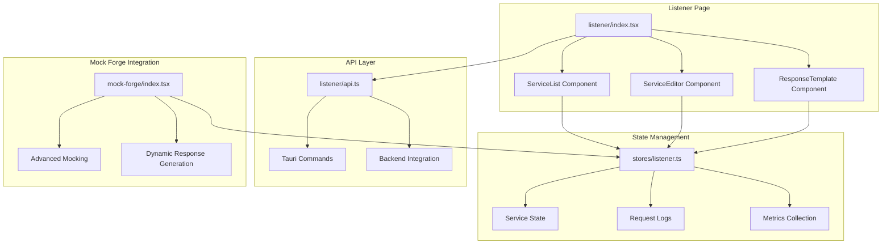
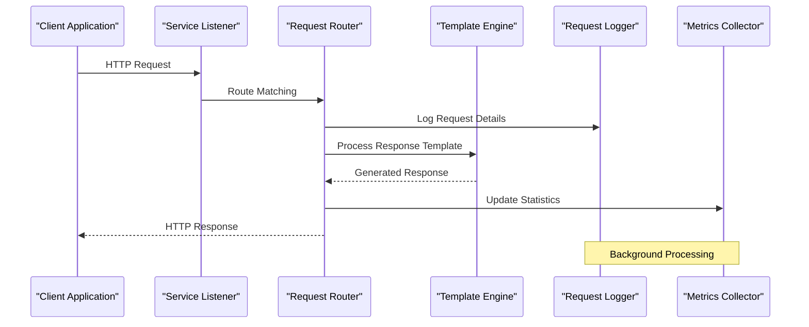
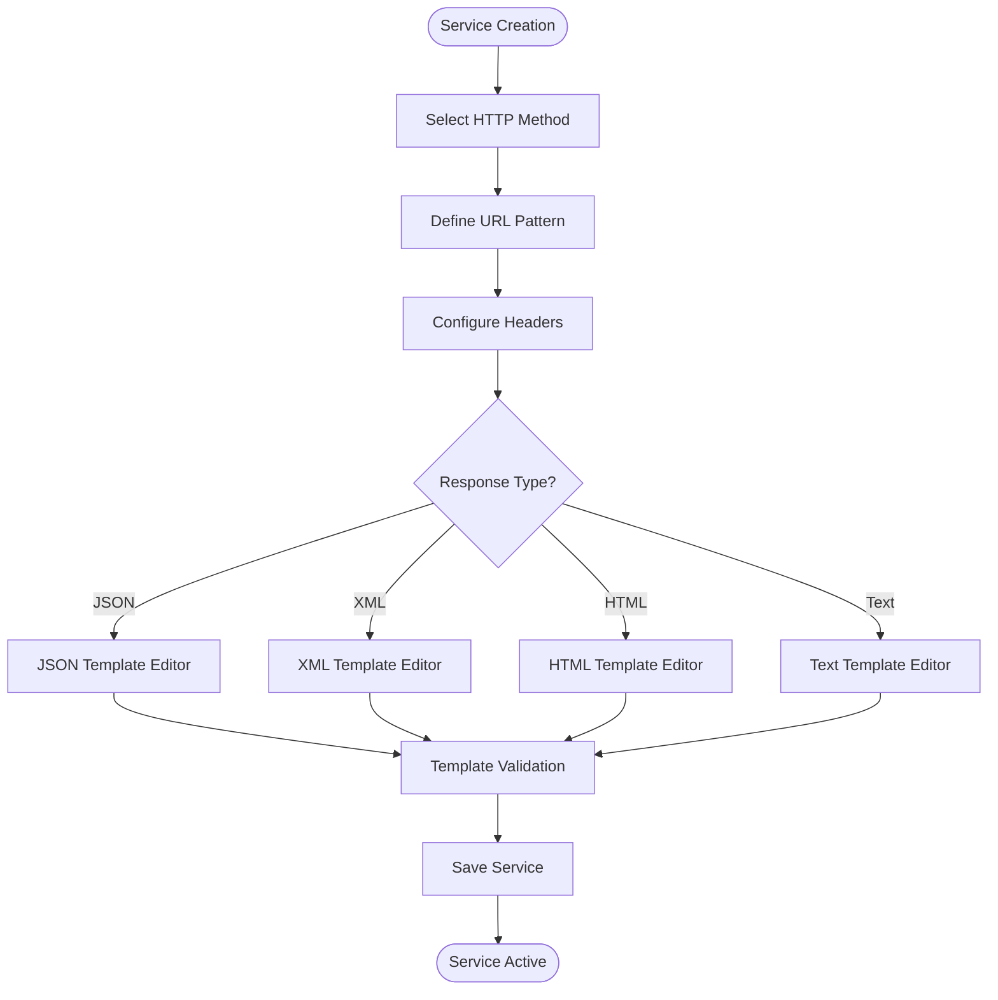
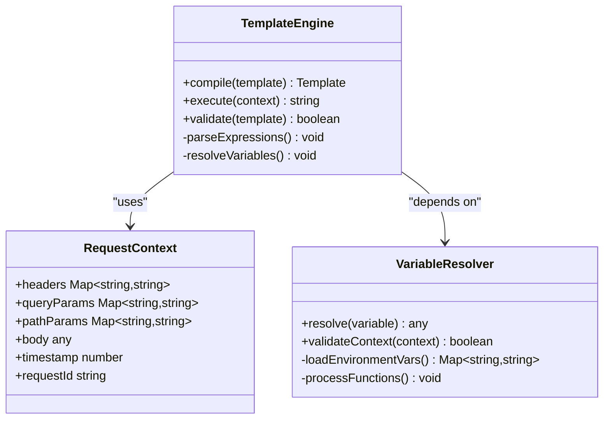
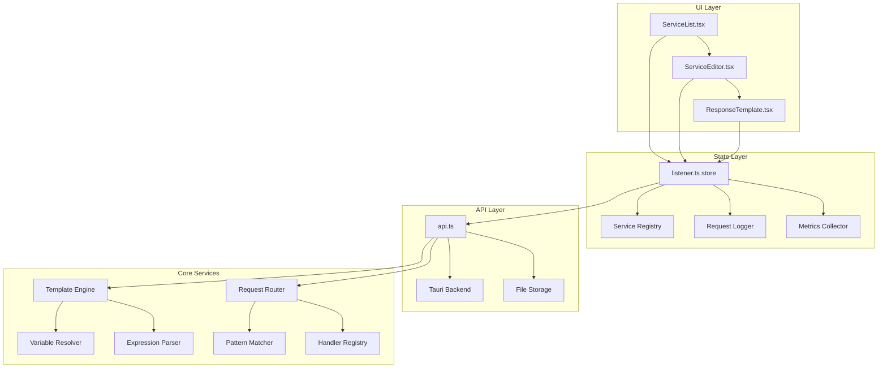

# Service Listener

<cite>
**Referenced Files in This Document**
- [listener/index.tsx](file://src/pages/listener/index.tsx)
- [listener/api.ts](file://src/pages/listener/api.ts)
- [listener/constants.ts](file://src/pages/listener/constants.ts)
- [listener/types.ts](file://src/pages/listener/types.ts)
- [listener/hooks/useListener.ts](file://src/pages/listener/hooks/useListener.ts)
- [listener/components/ServiceList.tsx](file://src/pages/listener/components/ServiceList.tsx)
- [listener/components/ServiceEditor.tsx](file://src/pages/listener/components/ServiceEditor.tsx)
- [listener/components/ResponseTemplate.tsx](file://src/pages/listener/components/ResponseTemplate.tsx)
- [stores/listener.ts](file://src/stores/listener.ts)
- [mock-forge/index.tsx](file://src/pages/mock-forge/index.tsx)
- [stores/mock-forge.ts](file://src/stores/mock-forge.ts)
</cite>

## Table of Contents
1. [Introduction](#introduction)
2. [Project Structure](#project-structure)
3. [Core Components](#core-components)
4. [Architecture Overview](#architecture-overview)
5. [Detailed Component Analysis](#detailed-component-analysis)
6. [Dependency Analysis](#dependency-analysis)
7. [Performance Considerations](#performance-considerations)
8. [Troubleshooting Guide](#troubleshooting-guide)
9. [Conclusion](#conclusion)
10. [Appendices](#appendices)

## Introduction

The Service Listener feature in Apprecon is a powerful tool that enables developers to create mock services that respond to incoming requests with customizable responses. This functionality eliminates the need for backend dependencies during development and testing phases, allowing teams to work independently and accelerate their development workflow.

The Service Listener provides a comprehensive interface for creating HTTP endpoints that can simulate API responses, handle webhook calls, and mimic microservice behavior. With its advanced response templating system and dynamic content generation capabilities, developers can create sophisticated mock services that closely resemble real backend behavior.

## Project Structure

The Service Listener feature is organized within a modular architecture that separates concerns between UI components, state management, and business logic:

**Diagram sources**
- [listener/index.tsx:1-50](file://src/pages/listener/index.tsx#L1-L50)
- [stores/listener.ts:1-100](file://src/stores/listener.ts#L1-L100)
- [listener/api.ts:1-50](file://src/pages/listener/api.ts#L1-L50)

**Section sources**
- [listener/index.tsx:1-100](file://src/pages/listener/index.tsx#L1-L100)
- [stores/listener.ts:1-200](file://src/stores/listener.ts#L1-L200)

## Core Components

The Service Listener feature consists of several key components that work together to provide a seamless mocking experience:

### Service Management Interface
The main listener page provides an intuitive interface for managing mock services. Users can create, edit, enable/disable, and delete services through a clean, responsive design. Each service maintains its own configuration including HTTP methods, URL patterns, response templates, and execution rules.

### Response Templating System
The templating engine supports dynamic content generation using variables, conditional logic, and data manipulation functions. Developers can create sophisticated responses that adapt to different request parameters while maintaining consistent formatting and structure.

### Request Logging and Metrics
Every incoming request is automatically logged with detailed information including timestamps, headers, body content, and processing time. The system also collects performance metrics and usage statistics to help developers optimize their mock services.

**Section sources**
- [listener/components/ServiceList.tsx:1-150](file://src/pages/listener/components/ServiceList.tsx#L1-L150)
- [listener/components/ServiceEditor.tsx:1-200](file://src/pages/listener/components/ServiceEditor.tsx#L1-L200)
- [listener/components/ResponseTemplate.tsx:1-100](file://src/pages/listener/components/ResponseTemplate.tsx#L1-L100)

## Architecture Overview

The Service Listener follows a layered architecture pattern that separates concerns and promotes maintainability:

**Diagram sources**
- [listener/api.ts:1-100](file://src/pages/listener/api.ts#L1-L100)
- [stores/listener.ts:1-150](file://src/stores/listener.ts#L1-L150)

The architecture ensures high performance through asynchronous processing, efficient template compilation, and optimized storage mechanisms. The system supports concurrent request handling and provides graceful degradation under load.

## Detailed Component Analysis

### Service Creation Interface

The service creation interface provides a comprehensive form for defining mock service behavior:

#### Service Configuration
- **HTTP Method Selection**: Support for GET, POST, PUT, DELETE, PATCH, and custom methods
- **URL Pattern Matching**: Flexible routing with parameter extraction and wildcard support
- **Header Configuration**: Custom request header validation and response header setting
- **Status Code Control**: Configurable HTTP status codes with conditional logic

#### Response Definition
- **Body Templates**: JSON, XML, HTML, and plain text response formats
- **Content-Type Handling**: Automatic content type detection and transformation
- **Encoding Support**: UTF-8, base64, and custom encoding schemes

**Diagram sources**
- [listener/components/ServiceEditor.tsx:1-200](file://src/pages/listener/components/ServiceEditor.tsx#L1-L200)

**Section sources**
- [listener/components/ServiceEditor.tsx:1-300](file://src/pages/listener/components/ServiceEditor.tsx#L1-L300)

### Response Templating System

The templating system enables dynamic response generation through a powerful expression language:

#### Template Variables
- **Request Context**: Access to request headers, query parameters, path parameters, and body content
- **Environment Variables**: Integration with application environment configuration
- **Global Variables**: Shared data across all services and requests
- **Function Calls**: Built-in utility functions for data manipulation and formatting

#### Conditional Logic
- **If/Else Statements**: Branch-based response generation
- **Loop Constructs**: Iteration over arrays and objects
- **Error Handling**: Graceful fallbacks and error responses

#### Data Transformation
- **Mathematical Operations**: Arithmetic calculations and statistical functions
- **String Manipulation**: Text processing, formatting, and validation
- **Date/Time Functions**: Timestamp generation and date manipulation
- **Cryptographic Functions**: Hash generation and encryption utilities

**Diagram sources**
- [listener/components/ResponseTemplate.tsx:1-150](file://src/pages/listener/components/ResponseTemplate.tsx#L1-L150)
- [stores/listener.ts:1-200](file://src/stores/listener.ts#L1-L200)

**Section sources**
- [listener/components/ResponseTemplate.tsx:1-200](file://src/pages/listener/components/ResponseTemplate.tsx#L1-L200)
- [stores/listener.ts:1-300](file://src/stores/listener.ts#L1-L300)

### Dynamic Content Generation

The dynamic content generation system creates realistic mock responses by combining static templates with runtime data:

#### Request-Based Responses
- **Parameter Extraction**: Parse and validate incoming request parameters
- **Conditional Logic**: Generate different responses based on input conditions
- **Data Simulation**: Create realistic test data with proper relationships
- **Error Simulation**: Simulate various error scenarios and edge cases

#### Time-Based Responses
- **Timestamp Generation**: Create realistic timestamps and dates
- **Sequence Numbers**: Generate incrementing IDs and sequence numbers
- **Random Data**: Produce randomized but valid test data
- **Caching Mechanism**: Cache generated responses for consistency

#### Integration Capabilities
- **External Data Sources**: Connect to databases, APIs, and file systems
- **State Management**: Maintain state across multiple requests
- **Event Processing**: Handle asynchronous events and callbacks
- **Webhook Support**: Process incoming webhook payloads

**Section sources**
- [stores/listener.ts:1-400](file://src/stores/listener.ts#L1-L400)
- [mock-forge/index.tsx:1-200](file://src/pages/mock-forge/index.tsx#L1-L200)

## Dependency Analysis

The Service Listener feature maintains clear dependency boundaries and follows separation of concerns principles:

**Diagram sources**
- [listener/components/ServiceList.tsx:1-100](file://src/pages/listener/components/ServiceList.tsx#L1-L100)
- [stores/listener.ts:1-200](file://src/stores/listener.ts#L1-L200)
- [listener/api.ts:1-100](file://src/pages/listener/api.ts#L1-L100)

Key dependency relationships:
- **UI Components** depend on the central store for state management
- **Store** coordinates between UI, API layer, and core services
- **API Layer** provides abstraction over Tauri backend operations
- **Core Services** are independent modules with well-defined interfaces

**Section sources**
- [stores/listener.ts:1-300](file://src/stores/listener.ts#L1-L300)
- [listener/api.ts:1-150](file://src/pages/listener/api.ts#L1-L150)

## Performance Considerations

The Service Listener is designed with performance optimization in mind:

### Template Compilation
Templates are compiled once and cached for subsequent executions, reducing parsing overhead. The compilation process includes syntax validation and optimization passes.

### Memory Management
Efficient memory allocation strategies prevent memory leaks and ensure stable operation during extended use. Large response bodies are streamed rather than loaded entirely into memory.

### Concurrent Request Handling
The system supports concurrent request processing with proper synchronization mechanisms to prevent race conditions and data corruption.

### Storage Optimization
Persistent storage uses efficient serialization formats and incremental updates to minimize disk I/O operations.

## Troubleshooting Guide

### Common Issues and Solutions

#### Template Rendering Errors
- **Syntax Validation**: Use the built-in template validator to catch syntax errors before saving
- **Debug Mode**: Enable debug logging to trace template execution and variable resolution
- **Fallback Responses**: Configure default responses for error scenarios

#### Performance Problems
- **Template Complexity**: Simplify complex templates and break them into smaller, reusable components
- **Memory Usage**: Monitor memory consumption and optimize large response generation
- **Concurrent Requests**: Adjust thread pool settings for high-throughput scenarios

#### Integration Issues
- **Port Conflicts**: Ensure the listener port is not already in use by another service
- **Network Configuration**: Verify firewall settings and network permissions
- **SSL/TLS Setup**: Properly configure certificates for HTTPS endpoints

### Debugging Techniques

#### Request Inspection
Use the request log viewer to examine incoming requests, including headers, body content, and timing information. Filter logs by service, method, or time range for focused debugging.

#### Template Testing
The template editor includes a preview mode that allows testing templates against sample requests without deploying changes.

#### Performance Profiling
Built-in profiling tools help identify bottlenecks in template execution and request processing.

**Section sources**
- [listener/components/ServiceEditor.tsx:1-200](file://src/pages/listener/components/ServiceEditor.tsx#L1-L200)
- [stores/listener.ts:1-200](file://src/stores/listener.ts#L1-L200)

## Conclusion

The Service Listener feature in Apprecon provides a comprehensive solution for creating mock services during development and testing. Its flexible templating system, dynamic content generation, and robust request handling capabilities make it an essential tool for modern software development workflows.

The modular architecture ensures maintainability and extensibility, while the performance optimizations guarantee reliable operation under various load conditions. Integration with Apprecon's broader ecosystem enables seamless collaboration and workflow automation.

By eliminating backend dependencies and providing realistic service simulations, the Service Listener accelerates development cycles, improves testing coverage, and enhances overall productivity for development teams working on service-oriented architectures.

## Appendices

### Common Mocking Scenarios

#### API Stubs
Create REST API endpoints that return predefined responses based on request parameters. Useful for frontend development when backend services are not yet available.

#### Webhook Handlers
Implement webhook endpoints that receive and process external service notifications. Test webhook integrations without triggering actual external services.

#### Microservice Simulations
Build mock microservices that interact with other services through well-defined APIs. Enable distributed system testing without full infrastructure deployment.

#### Database Abstractions
Simulate database operations with in-memory data stores. Test CRUD operations and complex queries without requiring actual database connections.

#### Authentication Services
Mock authentication endpoints that validate credentials and issue tokens. Test authorization flows without implementing actual security logic.

**Section sources**
- [mock-forge/index.tsx:1-300](file://src/pages/mock-forge/index.tsx#L1-L300)
- [stores/mock-forge.ts:1-200](file://src/stores/mock-forge.ts#L1-L200)