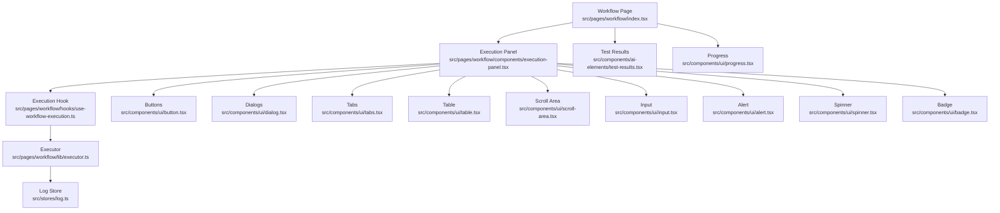
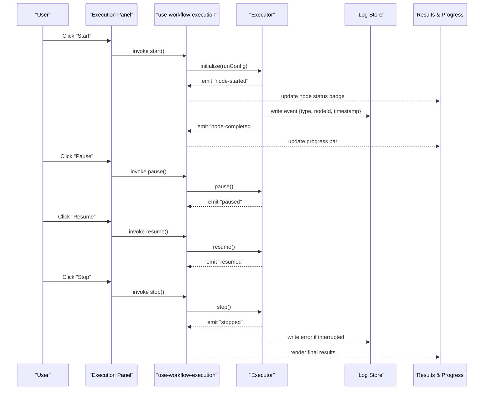
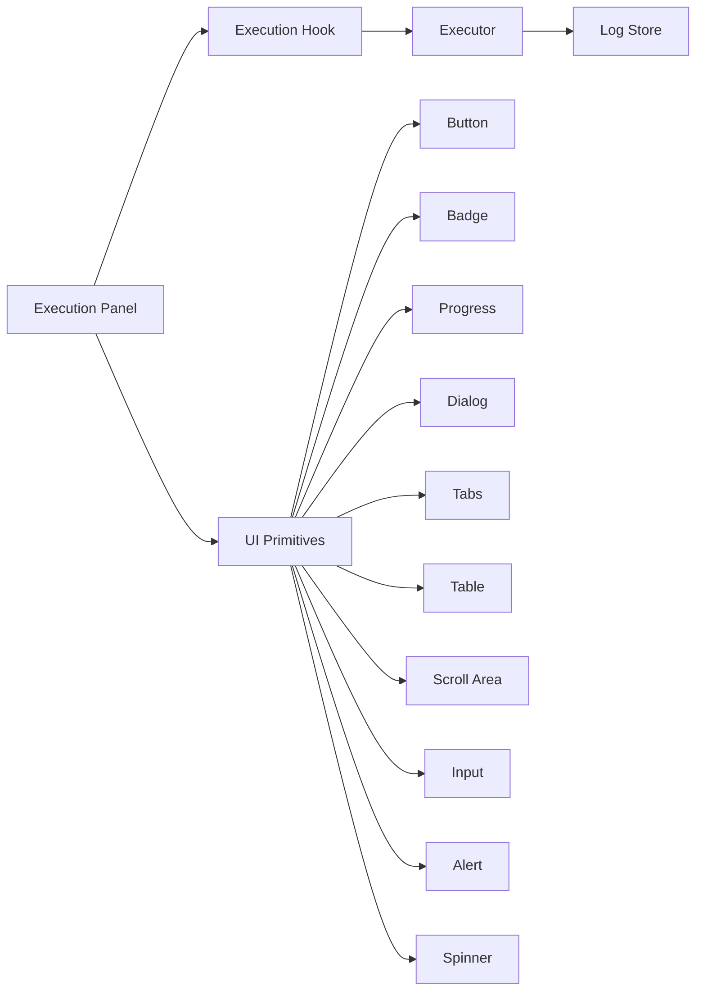

# Execution & Monitoring

<cite>
**Referenced Files in This Document**
- [workflow/index.tsx](file://src/pages/workflow/index.tsx)
- [workflow/components/execution-panel.tsx](file://src/pages/workflow/components/execution-panel.tsx)
- [workflow/hooks/use-workflow-execution.ts](file://src/pages/workflow/hooks/use-workflow-execution.ts)
- [workflow/lib/executor.ts](file://src/pages/workflow/lib/executor.ts)
- [stores/log.ts](file://src/stores/log.ts)
- [components/ai-elements/test-results.tsx](file://src/components/ai-elements/test-results.tsx)
- [components/ui/spinner.tsx](file://src/components/ui/spinner.tsx)
- [components/ui/badge.tsx](file://src/components/ui/badge.tsx)
- [components/ui/button.tsx](file://src/components/ui/button.tsx)
- [components/ui/dialog.tsx](file://src/components/ui/dialog.tsx)
- [components/ui/scroll-area.tsx](file://src/components/ui/scroll-area.tsx)
- [components/ui/table.tsx](file://src/components/ui/table.tsx)
- [components/ui/tabs.tsx](file://src/components/ui/tabs.tsx)
- [components/ui/input.tsx](file://src/components/ui/input.tsx)
- [components/ui/alert.tsx](file://src/components/ui/alert.tsx)
- [components/ui/progress.tsx](file://src/components/ui/progress.tsx)
- [components/ui/tooltip.tsx](file://src/components/ui/tooltip.tsx)
- [components/ui/popover.tsx](file://src/components/ui/popover.tsx)
- [components/ui/dropdown-menu.tsx](file://src/components/ui/dropdown-menu.tsx)
- [components/ui/command.tsx](file://src/components/ui/command.tsx)
- [components/ui/checkbox.tsx](file://src/components/ui/checkbox.tsx)
- [components/ui/select.tsx](file://src/components/ui/select.tsx)
- [components/ui/switch.tsx](file://src/components/ui/switch.tsx)
- [components/ui/slider.tsx](file://src/components/ui/slider.tsx)
- [components/ui/radio-group.tsx](file://src/components/ui/radio-group.tsx)
- [components/ui/calendar.tsx](file://src/components/ui/calendar.tsx)
- [components/ui/pagination.tsx](file://src/components/ui/pagination.tsx)
- [components/ui/accordion.tsx](file://src/components/ui/accordion.tsx)
- [components/ui/collapsible.tsx](file://src/components/ui/collapsible.tsx]
- [components/ui/form.tsx](file://src/components/ui/form.tsx)
- [components/ui/field.tsx](file://src/components/ui/field.tsx)
- [components/ui/label.tsx](file://src/components/ui/label.tsx)
- [components/ui/textarea.tsx](file://src/components/ui/textarea.tsx)
- [components/ui/monaco-editor.tsx](file://src/components/ui/monaco-editor.tsx)
- [components/ui/terminal.tsx](file://src/components/ai-elements/terminal.tsx)
- [components/ui/stack-trace.tsx](file://src/components/ai-elements/stack-trace.tsx)
- [components/ui/checkpoint.tsx](file://src/components/ai-elements/checkpoint.tsx)
- [components/ui/code-block.tsx](file://src/components/ai-elements/code-block.tsx)
- [components/ui/snippet.tsx](file://src/components/ai-elements/snippet.tsx)
- [components/ui/reasoning.tsx](file://src/components/ai-elements/reasoning.tsx)
- [components/ui/tool.tsx](file://src/components/ai-elements/tool.tsx)
- [components/ui/queue.tsx](file://src/components/ai-elements/queue.tsx)
- [components/ui/suggestion.tsx](file://src/components/ai-elements/suggestion.tsx)
- [components/ui/conversation.tsx](file://src/components/ai-elements/conversation.tsx)
- [components/ui/message.tsx](file://src/components/ai-elements/message.tsx)
- [components/ui/chat-input.tsx](file://src/components/ui/chat-input.tsx)
- [components/ui/chat-message-area.tsx](file://src/components/ui/chat-message-area.tsx)
- [components/ui/chat-message.tsx](file://src/components/ui/chat-message.tsx)
- [components/ui/data-table.tsx](file://src/components/ui/data-table.tsx)
- [components/ui/search-input.tsx](file://src/layout/global-search/search-input.tsx)
- [components/ui/file-tree.tsx](file://src/components/ai-elements/file-tree.tsx)
- [components/ui/schema-display.tsx](file://src/components/ai-elements/schema-display.tsx)
- [components/ui/web-preview.tsx](file://src/components/ai-elements/web-preview.tsx)
- [components/ui/audio-player.tsx](file://src/components/ai-elements/audio-player.tsx)
- [components/ui/image.tsx](file://src/components/ai-elements/image.tsx)
- [components/ui/jwt-store.ts](file://src/stores/jwt-store.ts)
- [components/ui/browser-session-store.ts](file://src/stores/browser-session-store.ts)
- [components/ui/regression.ts](file://src/stores/regression.ts)
- [components/ui/automation/index.ts](file://src/stores/automation/index.ts)
- [components/ui/automation/types.ts](file://src/stores/automation/types.ts)
- [components/ui/automation/constants.ts](file://src/stores/automation/constants.ts)
- [components/ui/automation/slices/state-slice.ts](file://src/stores/automation/slices/state-slice.ts)
- [components/ui/automation/slices/events-slice.ts](file://src/stores/automation/slices/events-slice.ts)
- [components/ui/automation/slices/actions-slice.ts](file://src/stores/automation/slices/actions-slice.ts)
- [components/ui/automation/slices/conditions-slice.ts](file://src/stores/automation/slices/conditions-slice.ts)
- [components/ui/automation/slices/lifecycle-slice.ts](file://src/stores/automation/slices/lifecycle-slice.ts)
- [components/ui/automation/slices/websocket-slice.ts](file://src/stores/automation/slices/websocket-slice.ts)
- [components/ui/automation/slices/page-crawled-slice.ts](file://src/stores/automation/slices/page-crawled-slice.ts)
- [components/ui/automation/slices/port-scan-slice.ts](file://src/stores/automation/slices/port-scan-slice.ts)
- [components/ui/automation/slices/scheduled-slice.ts](file://src/stores/automation/slices/scheduled-slice.ts)
- [components/ui/automation/slices/scan-completed-slice.ts](file://src/stores/automation/slices/scan-completed-slice.ts)
- [components/ui/automation/slices/intercept-slice.ts](file://src/stores/automation/slices/intercept-slice.ts)
- [components/ui/automation/slices/live-traffic-slice.ts](file://src/stores/automation/slices/live-traffic-slice.ts)
- [components/ui/automation/slices/history-slice.ts](file://src/stores/automation/slices/history-slice.ts)
- [components/ui/automation/slices/targets-slice.ts](file://src/stores/automation/slices/targets-slice.ts)
- [components/ui/automation/slices/ui-slice.ts](file://src/stores/automation/slices/ui-slice.ts)
- [components/ui/automation/slices/ai-tool-slice.ts](file://src/stores/automation/slices/ai-tool-slice.ts)
- [components/ui/automation/slices/send-to-slice.ts](file://src/stores/automation/slices/send-to-slice.ts)
- [components/ui/automation/slices/collection-picker-submenu-slice.ts](file://src/stores/automation/slices/collection-picker-submenu-slice.ts)
- [components/ui/automation/slices/convert-to-craft-slice.ts](file://src/stores/automation/slices/convert-to-craft-slice.ts)
- [components/ui/automation/slices/craft-slice.ts](file://src/stores/automation/slices/craft-slice.ts)
- [components/ui/automation/slices/management-slice.ts](file://src/stores/automation/slices/management-slice.ts)
- [components/ui/automation/slices/ui-slice.ts](file://src/stores/automation/slices/ui-slice.ts)
- [components/ui/automation/slices/send-to-collection-slice.ts](file://src/stores/automation/slices/send-to-collection-slice.ts)
- [components/ui/automation/slices/use-collection-picker-slice.ts](file://src/stores/automation/slices/use-collection-picker-slice.ts)
- [components/ui/automation/slices/browser-slice.ts](file://src/stores/automation/slices/browser-slice.ts)
- [components/ui/automation/slices/crawl-helpers-slice.ts](file://src/stores/automation/slices/crawl-helpers-slice.ts)
- [components/ui/automation/slices/crawl-runner-slice.ts](file://src/stores/automation/slices/crawl-runner-slice.ts)
- [components/ui/automation/slices/crawl-types-slice.ts](file://src/stores/automation/slices/crawl-types-slice.ts)
- [components/ui/automation/slices/proxy-slice.ts](file://src/stores/automation/slices/proxy-slice.ts)
- [components/ui/automation/slices/ca-slice.ts](file://src/stores/automation/slices/ca-slice.ts)
- [components/ui/automation/slices/completion-slice.ts](file://src/stores/automation/slices/completion-slice.ts)
- [components/ui/automation/slices/lifecycle-slice.ts](file://src/stores/automation/slices/lifecycle-slice.ts)
- [components/ui/automation/slices/mock-forge-slice.ts](file://src/stores/automation/slices/mock-forge-slice.ts)
- [components/ui/automation/slices/state-slice.ts](file://src/stores/automation/slices/state-slice.ts)
- [components/ui/automation/slices/types-slice.ts](file://src/stores/automation/slices/types-slice.ts)
- [components/ui/automation/slices/utils-slice.ts](file://src/stores/automation/slices/utils-slice.ts)
- [components/ui/automation/slices/websocket-slice.ts](file://src/stores/automation/slices/websocket-slice.ts)
- [components/ui/automation/slices/port-scanner-slice.ts](file://src/stores/automation/slices/port-scanner-slice.ts)
- [components/ui/automation/slices/scanner-slice.ts](file://src/stores/automation/slices/scanner-slice.ts)
- [components/ui/automation/slices/services-slice.ts](file://src/stores/automation/slices/services-slice.ts)
- [components/ui/automation/slices/targets-slice.ts](file://src/stores/automation/slices/targets-slice.ts)
- [components/ui/automation/slices/types-slice.ts](file://src/stores/automation/slices/types-slice.ts)
- [components/ui/automation/slices/state-slice.ts](file://src/stores/automation/slices/state-slice.ts)
- [components/ui/automation/slices/mod-slice.ts](file://src/stores/automation/slices/mod-slice.ts)
- [components/ui/automation/slices/app-commands-slice.ts](file://src/stores/automation/slices/app-commands-slice.ts)
- [components/ui/automation/slices/lib-slice.ts](file://src/stores/automation/slices/lib-slice.ts)
- [components/ui/automation/slices/main-slice.ts](file://src/stores/automation/slices/main-slice.ts)
- [components/ui/automation/slices/setup-slice.ts](file://src/stores/automation/slices/setup-slice.ts)
- [components/ui/automation/slices/tray-slice.ts](file://src/stores/automation/slices/tray-slice.ts)
- [components/ui/automation/slices/types-slice.ts](file://src/stores/automation/slices/types-slice.ts)
- [components/ui/automation/slices/ai-slice.ts](file://src/stores/automation/slices/ai-slice.ts)
- [components/ui/automation/slices/auto-mark-slice.ts](file://src/stores/automation/slices/auto-mark-slice.ts)
- [components/ui/automation/slices/chat-slice.ts](file://src/stores/automation/slices/chat-slice.ts)
- [components/ui/automation/slices/commands-slice.ts](file://src/stores/automation/slices/commands-slice.ts)
- [components/ui/automation/slices/keyring-slice.ts](file://src/stores/automation/slices/keyring-slice.ts)
- [components/ui/automation/slices/providers-slice.ts](file://src/stores/automation/slices/providers-slice.ts)
- [components/ui/automation/slices/settings-slice.ts](file://src/stores/automation/slices/settings-slice.ts)
- [components/ui/automation/slices/types-slice.ts](file://src/stores/automation/slices/types-slice.ts)
- [components/ui/automation/slices/automation-actions-slice.ts](file://src/stores/automation/slices/automation-actions-slice.ts)
- [components/ui/automation/slices/automation-condition-slice.ts](file://src/stores/automation/slices/automation-condition-slice.ts)
- [components/ui/automation/slices/automation-events-slice.ts](file://src/stores/automation/slices/automation-events-slice.ts)
- [components/ui/automation/slices/automation-execution-slice.ts](file://src/stores/automation/slices/automation-execution-slice.ts)
- [components/ui/automation/slices/automation-intercept-slice.ts](file://src/stores/automation/slices/automation-intercept-slice.ts)
- [components/ui/automation/slices/automation-live-traffic-slice.ts](file://src/stores/automation/slices/automation-live-traffic-slice.ts)
- [components/ui/automation/slices/automation-page-crawled-slice.ts](file://src/stores/automation/slices/automation-page-crawled-slice.ts)
- [components/ui/automation/slices/automation-port-scan-slice.ts](file://src/stores/automation/slices/automation-port-scan-slice.ts)
- [components/ui/automation/slices/automation-scan-completed-slice.ts](file://src/stores/automation/slices/automation-scan-completed-slice.ts)
- [components/ui/automation/slices/automation-scheduled-slice.ts](file://src/stores/automation/slices/automation-scheduled-slice.ts)
- [components/ui/automation/slices/automation-state-slice.ts](file://src/stores/automation/slices/automation-state-slice.ts)
- [components/ui/automation/slices/automation-types-slice.ts](file://src/stores/automation/slices/automation-types-slice.ts)
- [components/ui/automation/slices/automation-websocket-slice.ts](file://src/stores/automation/slices/automation-websocket-slice.ts)
- [components/ui/automation/slices/browser-crawl-helpers-slice.ts](file://src/stores/automation/slices/browser-crawl-helpers-slice.ts)
- [components/ui/automation/slices/browser-crawl-runner-slice.ts](file://src/stores/automation/slices/browser-crawl-runner-slice.ts)
- [components/ui/automation/slices/browser-crawl-types-slice.ts](file://src/stores/automation/slices/browser-crawl-types-slice.ts)
- [components/ui/automation/slices/proxy-ca-slice.ts](file://src/stores/automation/slices/proxy-ca-slice.ts)
- [components/ui/automation/slices/proxy-completion-slice.ts](file://src/stores/automation/slices/proxy-completion-slice.ts)
- [components/ui/automation/slices/proxy-lifecycle-slice.ts](file://src/stores/automation/slices/proxy-lifecycle-slice.ts)
- [components/ui/automation/slices/proxy-mock-forge-slice.ts](file://src/stores/automation/slices/proxy-mock-forge-slice.ts)
- [components/ui/automation/slices/proxy-state-slice.ts](file://src/stores/automation/slices/proxy-state-slice.ts)
- [components/ui/automation/slices/proxy-types-slice.ts](file://src/stores/automation/slices/proxy-types-slice.ts)
- [components/ui/automation/slices/proxy-utils-slice.ts](file://src/stores/automation/slices/proxy-utils-slice.ts)
- [components/ui/automation/slices/proxy-websocket-slice.ts](file://src/stores/automation/slices/proxy-websocket-slice.ts)
- [components/ui/automation/slices/port-scanner-banner-slice.ts](file://src/stores/automation/slices/port-scanner-banner-slice.ts)
- [components/ui/automation/slices/port-scanner-mod-slice.ts](file://src/stores/automation/slices/port-scanner-mod-slice.ts)
- [components/ui/automation/slices/port-scanner-scanner-slice.ts](file://src/stores/automation/slices/port-scanner-scanner-slice.ts)
- [components/ui/automation/slices/port-scanner-services-slice.ts](file://src/stores/automation/slices/port-scanner-services-slice.ts)
- [components/ui/automation/slices/port-scanner-state-slice.ts](file://src/stores/automation/slices/port-scanner-state-slice.ts)
- [components/ui/automation/slices/port-scanner-targets-slice.ts](file://src/stores/automation/slices/port-scanner-targets-slice.ts)
- [components/ui/automation/slices/port-scanner-types-slice.ts](file://src/stores/automation/slices/port-scanner-types-slice.ts)
- [components/ui/automation/slices/commands-ai-slice.ts](file://src/stores/automation/slices/commands-ai-slice.ts)
- [components/ui/automation/slices/commands-api-collection-slice.ts](file://src/stores/automation/slices/commands-api-collection-slice.ts)
- [components/ui/automation/slices/commands-browser-slice.ts](file://src/stores/automation/slices/commands-browser-slice.ts)
- [components/ui/automation/slices/commands-cert-slice.ts](file://src/stores/automation/slices/commands-cert-slice.ts)
- [components/ui/automation/slices/commands-chat-sessions-slice.ts](file://src/stores/automation/slices/commands-chat-sessions-slice.ts)
- [components/ui/automation/slices/commands-collaborator-slice.ts](file://src/stores/automation/slices/commands-collaborator-slice.ts)
- [components/ui/automation/slices/commands-history-slice.ts](file://src/stores/automation/slices/commands-history-slice.ts)
- [components/ui/automation/slices/commands-intercept-slice.ts](file://src/stores/automation/slices/commands-intercept-slice.ts)
- [components/ui/automation/slices/commands-invoker-slice.ts](file://src/stores/automation/slices/commands-invoker-slice.ts)
- [components/ui/automation/slices/commands-mock-forge-slice.ts](file://src/stores/automation/slices/commands-mock-forge-slice.ts)
- [components/ui/automation/slices/commands-proxy-slice.ts](file://src/stores/automation/slices/commands-proxy-slice.ts)
- [components/ui/automation/slices/commands-r2-slice.ts](file://src/stores/automation/slices/commands-r2-slice.ts)
- [components/ui/automation/slices/commands-regression-slice.ts](file://src/stores/automation/slices/commands-regression-slice.ts)
- [components/ui/automation/slices/commands-repeater-slice.ts](file://src/stores/automation/slices/commands-repeater-slice.ts)
- [components/ui/automation/slices/commands-storage-slice.ts](file://src/stores/automation/slices/commands-storage-slice.ts)
- [components/ui/automation/slices/commands-vpn-slice.ts](file://src/stores/automation/slices/commands-vpn-slice.ts)
- [components/ui/automation/slices/tools-browser-slice.ts](file://src/stores/automation/slices/tools-browser-slice.ts)
- [components/ui/automation/slices/tools-buffer-slice.ts](file://src/stores/automation/slices/tools-buffer-slice.ts)
- [components/ui/automation/slices/tools-documents-slice.ts](file://src/stores/automation/slices/tools-documents-slice.ts)
- [components/ui/automation/slices/tools-intercept-slice.ts](file://src/stores/automation/slices/tools-intercept-slice.ts)
- [components/ui/automation/slices/tools-invoker-slice.ts](file://src/stores/automation/slices/tools-invoker-slice.ts)
- [components/ui/automation/slices/tools-proxy-tool-slice.ts](file://src/stores/automation/slices/tools-proxy-tool-slice.ts)
- [components/ui/automation/slices/tools-repeater-slice.ts](file://src/stores/automation/slices/tools-repeater-slice.ts)
- [components/ui/automation/slices/tools-terminal-slice.ts](file://src/stores/automation/slices/tools-terminal-slice.ts)
- [components/ui/automation/slices/db-mod-slice.ts](file://src/stores/automation/slices/db-mod-slice.ts)
- [components/ui/automation/slices/db-schema-slice.ts](file:///src/stores/automation/slices/db-schema-slice.ts)
- [components/ui/automation/slices/history-mod-slice.ts](file://src/stores/automation/slices/history-mod-slice.ts)
- [components/ui/automation/slices/sqli-detector-slice.ts](file://src/stores/automation/slices/sqli-detector-slice.ts)
- [components/ui/automation/slices/sqli-mod-slice.ts](file://src/stores/automation/slices/sqli-mod-slice.ts)
- [components/ui/automation/slices/sqli-payloads-slice.ts](file://src/stores/automation/slices/sqli-payloads-slice.ts)
- [components/ui/automation/slices/sqli-types-slice.ts](file://src/stores/automation/slices/sqli-types-slice.ts)
- [components/ui/automation/slices/collaborator-mod-slice.ts](file://src/stores/automation/slices/collaborator-mod-slice.ts)
- [components/ui/automation/slices/collaborator-state-slice.ts](file://src/stores/automation/slices/collaborator-state-slice.ts)
- [components/ui/automation/slices/collaborator-types-slice.ts](file://src/stores/automation/slices/collaborator-types-slice.ts)
- [components/ui/automation/slices/ai-auto-mark-slice.ts](file://src/stores/automation/slices/ai-auto-mark-slice.ts)
- [components/ui/automation/slices/ai-chat-slice.ts](file://src/stores/automation/slices/ai-chat-slice.ts)
- [components/ui/automation/slices/ai-commands-slice.ts](file://src/stores/automation/slices/ai-commands-slice.ts)
- [components/ui/automation/slices/ai-keyring-slice.ts](file://src/stores/automation/slices/ai-keyring-slice.ts)
- [components/ui/automation/slices/ai-providers-slice.ts](file://src/stores/automation/slices/ai-providers-slice.ts)
- [components/ui/automation/slices/ai-settings-slice.ts](file://src/stores/automation/slices/ai-settings-slice.ts)
- [components/ui/automation/slices/ai-types-slice.ts](file://src/stores/automation/slices/ai-types-slice.ts)
- [components/ui/automation/slices/automation-actions-slice.ts](file://src/stores/automation/slices/automation-actions-slice.ts)
- [components/ui/automation/slices/automation-condition-slice.ts](file://src/stores/automation/slices/automation-condition-slice.ts)
- [components/ui/automation/slices/automation-events-slice.ts](file://src/stores/automation/slices/automation-events-slice.ts)
- [components/ui/automation/slices/automation-execution-slice.ts](file://src/stores/automation/slices/automation-execution-slice.ts)
- [components/ui/automation/slices/automation-intercept-slice.ts](file://src/stores/automation/slices/automation-intercept-slice.ts)
- [components/ui/automation/slices/automation-live-traffic-slice.ts](file://src/stores/automation/slices/automation-live-traffic-slice.ts)
- [components/ui/automation/slices/automation-page-crawled-slice.ts](file://src/stores/automation/slices/automation-page-crawled-slice.ts)
- [components/ui/automation/slices/automation-port-scan-slice.ts](file://src/stores/automation/slices/automation-port-scan-slice.ts)
- [components/ui/automation/slices/automation-scan-completed-slice.ts](file://src/stores/automation/slices/automation-scan-completed-sslice.ts)
- [components/ui/automation/slices/automation-scheduled-slice.ts](file://src/stores/automation/slices/automation-scheduled-slice.ts)
- [components/ui/automation/slices/automation-state-slice.ts](file://src/stores/automation/slices/automation-state-slice.ts)
- [components/ui/automation/slices/automation-types-slice.ts](file://src/stores/automation/slices/automation-types-slice.ts)
- [components/ui/automation/slices/automation-websocket-slice.ts](file://src/stores/automation/slices/automation-websocket-slice.ts)
- [components/ui/automation/slices/browser-crawl-helpers-slice.ts](file://src/stores/automation/slices/browser-crawl-helpers-slice.ts)
- [components/ui/automation/slices/browser-crawl-runner-slice.ts](file://src/stores/automation/slices/browser-crawl-runner-slice.ts)
- [components.js](file://src/components/ui/automation/slices/browser-crawl-types-slice.ts)
</cite>

## Table of Contents
1. [Introduction](#introduction)
2. [Project Structure](#project-structure)
3. [Core Components](#core-components)
4. [Architecture Overview](#architecture-overview)
5. [Detailed Component Analysis](#detailed-component-analysis)
6. [Dependency Analysis](#dependency-analysis)
7. [Performance Considerations](#performance-considerations)
8. [Troubleshooting Guide](#troubleshooting-guide)
9. [Conclusion](#conclusion)
10. [Appendices](#appendices)

## Introduction
This document explains the Workflow Execution and Monitoring capabilities, focusing on how users can test and run workflows, view execution logs, monitor node status in real-time, control execution via a panel (start, stop, pause, resume), and use debugging tools such as step-through execution, variable inspection, and breakpoints. It also covers the logging system that captures events, errors, and performance metrics, along with troubleshooting guidance and performance optimization tips for large workflows.

## Project Structure
The workflow feature is implemented primarily under the workflow page and related UI components, stores, and hooks. The key areas include:
- Workflow page entry point and orchestration
- Execution panel UI for controls and status
- Hook managing execution lifecycle and state
- Executor module handling core execution logic
- Logging store for capturing and surfacing logs
- UI primitives for rendering results, progress, dialogs, and tables

**Diagram sources**
- [workflow/index.tsx](file://src/pages/workflow/index.tsx)
- [workflow/components/execution-panel.tsx](file://src/pages/workflow/components/execution-panel.tsx)
- [workflow/hooks/use-workflow-execution.ts](file://src/pages/workflow/hooks/use-workflow-execution.ts)
- [workflow/lib/executor.ts](file://src/pages/workflow/lib/executor.ts)
- [stores/log.ts](file://src/stores/log.ts)
- [components/ai-elements/test-results.tsx](file://src/components/ai-elements/test-results.tsx)
- [components/ui/progress.tsx](file://src/components/ui/progress.tsx)
- [components/ui/button.tsx](file://src/components/ui/button.tsx)
- [components/ui/dialog.tsx](file://src/components/ui/dialog.tsx)
- [components/ui/tabs.tsx](file://src/components/ui/tabs.tsx)
- [components/ui/table.tsx](file://src/components/ui/table.tsx)
- [components/ui/scroll-area.tsx](file://src/components/ui/scroll-area.tsx)
- [components/ui/input.tsx](file://src/components/ui/input.tsx)
- [components/ui/alert.tsx](file://src/components/ui/alert.tsx)
- [components/ui/spinner.tsx](file://src/components/ui/spinner.tsx)
- [components/ui/badge.tsx](file://src/components/ui/badge.tsx)

**Section sources**
- [workflow/index.tsx](file://src/pages/workflow/index.tsx)
- [workflow/components/execution-panel.tsx](file://src/pages/workflow/components/execution-panel.tsx)
- [workflow/hooks/use-workflow-execution.ts](file://src/pages/workflow/hooks/use-workflow-execution.ts)
- [workflow/lib/executor.ts](file://src/pages/workflow/lib/executor.ts)
- [stores/log.ts](file://src/stores/log.ts)

## Core Components
- Workflow Page: Orchestrates the workflow canvas, execution panel, and result views. It wires user actions to the execution hook and renders logs, progress, and results.
- Execution Panel: Provides start, stop, pause, resume controls; displays node status badges, progress indicators, and tabs for logs and results.
- Execution Hook: Manages lifecycle states (idle, running, paused, stopped), error handling, and emits events to update UI and logs.
- Executor: Implements the core execution engine for nodes, including step-by-step traversal, error propagation, and metric collection.
- Log Store: Centralized logging for execution events, errors, and performance metrics; supports filtering and search.

Key responsibilities:
- Test and run workflows: Users trigger runs from the execution panel; the hook initializes the executor and streams updates.
- View execution logs: Logs are appended in real-time; users can filter by level or search text.
- Monitor node status: Each node’s status is displayed with color-coded badges and progress bars.
- Control execution: Start, stop, pause, and resume operations are exposed through the panel and propagated to the executor.
- Debugging: Step-through execution, variable inspection, and breakpoint support are surfaced via dedicated UI panels and log entries.

**Section sources**
- [workflow/index.tsx](file://src/pages/workflow/index.tsx)
- [workflow/components/execution-panel.tsx](file://src/pages/workflow/components/execution-panel.tsx)
- [workflow/hooks/use-workflow-execution.ts](file://src/pages/workflow/hooks/use-workflow-execution.ts)
- [workflow/lib/executor.ts](file://src/pages/workflow/lib/executor.ts)
- [stores/log.ts](file://src/stores/log.ts)

## Architecture Overview
The execution architecture follows a clear separation between UI, lifecycle management, and execution engine:
- UI layer (Workflow Page + Execution Panel) handles user interactions and visualization.
- Lifecycle layer (Execution Hook) manages state transitions and event emission.
- Engine layer (Executor) executes nodes, collects metrics, and writes logs.
- Persistence/Telemetry (Log Store) records events, errors, and performance data.

**Diagram sources**
- [workflow/components/execution-panel.tsx](file://src/pages/workflow/components/execution-panel.tsx)
- [workflow/hooks/use-workflow-execution.ts](file://src/pages/workflow/hooks/use-workflow-execution.ts)
- [workflow/lib/executor.ts](file://src/pages/workflow/lib/executor.ts)
- [stores/log.ts](file://src/stores/log.ts)

## Detailed Component Analysis

### Execution Panel
The execution panel provides:
- Controls: Start, Stop, Pause, Resume buttons with appropriate disabled states based on current lifecycle.
- Status Badges: Node-level statuses (pending, running, success, failed, skipped) with color coding.
- Progress Indicators: Overall workflow progress and per-node progress bars.
- Tabs: Switch between logs, results, and debugging views.
- Search and Filters: Filter logs by level, node, or keyword; paginate long outputs.

Best practices:
- Debounce heavy operations to avoid UI jank.
- Use optimistic updates for immediate feedback, then reconcile with actual state.
- Provide accessible labels and keyboard shortcuts for controls.

**Section sources**
- [workflow/components/execution-panel.tsx](file://src/pages/workflow/components/execution-panel.tsx)
- [components/ui/button.tsx](file://src/components/ui/button.tsx)
- [components/ui/badge.tsx](file://src/components/ui/badge.tsx)
- [components/ui/progress.tsx](file://src/components/ui/progress.tsx)
- [components/ui/tabs.tsx](file://src/components/ui/tabs.tsx)
- [components/ui/table.tsx](file://src/components/ui/table.tsx)
- [components/ui/scroll-area.tsx](file://src/components/ui/scroll-area.tsx)
- [components/ui/input.tsx](file://src/components/ui/input.tsx)
- [components/ui/alert.tsx](file://src/components/ui/alert.tsx)
- [components/ui/spinner.tsx](file://src/components/ui/spinner.tsx)

### Execution Hook
Responsibilities:
- State machine: idle → running → paused → stopped, with transitions guarded by validation.
- Event listeners: subscribe to executor events to update UI and logs.
- Error handling: catch and surface errors, mark nodes as failed, and provide actionable messages.
- Metrics aggregation: collect timing and throughput metrics per node and overall.

Implementation patterns:
- Use a centralized store for execution state to ensure consistency across components.
- Emit typed events to decouple UI from execution logic.
- Implement cancellation tokens for stop/pause/resume semantics.

**Section sources**
- [workflow/hooks/use-workflow-execution.ts](file://src/pages/workflow/hooks/use-workflow-execution.ts)

### Executor
Core functions:
- Initialize: Validate run configuration, prepare context, and set up logging sinks.
- Traverse: Walk the workflow graph, executing nodes in dependency order.
- Step-through: Support stepping into each node for debugging.
- Breakpoints: Honor breakpoint flags to pause execution at specified nodes.
- Metrics: Record start/end times, durations, and resource usage per node.
- Errors: Propagate exceptions, capture stack traces, and mark nodes accordingly.

Optimization opportunities:
- Parallelize independent nodes where safe.
- Batch log writes to reduce I/O overhead.
- Stream results incrementally to keep UI responsive.

**Section sources**
- [workflow/lib/executor.ts](file://src/pages/workflow/lib/executor.ts)

### Logging System
Features:
- Event capture: Node start, completion, errors, and lifecycle transitions.
- Performance metrics: Duration, memory usage, and throughput per node.
- Filtering and search: By level, node ID, time range, and free-text.
- Export: Download logs for offline analysis.

Design considerations:
- Append-only log structure for integrity.
- Asynchronous writes to prevent blocking execution.
- Structured log format for easy parsing and querying.

**Section sources**
- [stores/log.ts](file://src/stores/log.ts)

### Results and Visualization
- Test Results: Display pass/fail summaries, detailed assertions, and diffs.
- Progress Bars: Show overall completion percentage and per-node progress.
- Stack Traces: Render error stacks with source mapping when available.
- Terminal Output: Inline terminal-like output for commands executed during workflow steps.

**Section sources**
- [components/ai-elements/test-results.tsx](file://src/components/ai-elements/test-results.tsx)
- [components/ui/progress.tsx](file://src/components/ui/progress.tsx)
- [components/ai-elements/stack-trace.tsx](file://src/components/ai-elements/stack-trace.tsx)
- [components/ai-elements/terminal.tsx](file://src/components/ai-elements/terminal.tsx)

### Debugging Tools
- Step-through Execution: Execute one node at a time with manual advancement.
- Variable Inspection: Inspect variables and context at breakpoints.
- Breakpoints: Set breakpoints on specific nodes to pause execution.
- Live Updates: Real-time reflection of changes without restarting the workflow.

Usage tips:
- Use breakpoints sparingly to minimize overhead.
- Combine step-through with variable inspection to isolate issues quickly.
- Leverage filtered logs to focus on relevant events.

**Section sources**
- [workflow/lib/executor.ts](file://src/pages/workflow/lib/executor.ts)
- [stores/log.ts](file://src/stores/log.ts)

## Dependency Analysis
The workflow execution depends on several UI primitives and stores:
- UI primitives provide consistent styling and behavior for buttons, badges, progress, dialogs, tables, scroll areas, inputs, alerts, spinners, and tabs.
- Stores centralize state and logs, enabling cross-component synchronization.
- The executor relies on the log store for telemetry and the hook for lifecycle coordination.

**Diagram sources**
- [workflow/components/execution-panel.tsx](file://src/pages/workflow/components/execution-panel.tsx)
- [workflow/hooks/use-workflow-execution.ts](file://src/pages/workflow/hooks/use-workflow-execution.ts)
- [workflow/lib/executor.ts](file://src/pages/workflow/lib/executor.ts)
- [stores/log.ts](file://src/stores/log.ts)
- [components/ui/button.tsx](file://src/components/ui/button.tsx)
- [components/ui/badge.tsx](file://src/components/ui/badge.tsx)
- [components/ui/progress.tsx](file://src/components/ui/progress.tsx)
- [components/ui/dialog.tsx](file://src/components/ui/dialog.tsx)
- [components/ui/tabs.tsx](file://src/components/ui/tabs.tsx)
- [components/ui/table.tsx](file://src/components/ui/table.tsx)
- [components/ui/scroll-area.tsx](file://src/components/ui/scroll-area.tsx)
- [components/ui/input.tsx](file://src/components/ui/input.tsx)
- [components/ui/alert.tsx](file://src/components/ui/alert.tsx)
- [components/ui/spinner.tsx](file://src/components/ui/spinner.tsx)

**Section sources**
- [workflow/components/execution-panel.tsx](file://src/pages/workflow/components/execution-panel.tsx)
- [workflow/hooks/use-workflow-execution.ts](file://src/pages/workflow/hooks/use-workflow-execution.ts)
- [workflow/lib/executor.ts](file://src/pages/workflow/lib/executor.ts)
- [stores/log.ts](file://src/stores/log.ts)

## Performance Considerations
- Batch log writes: Group multiple log entries to reduce I/O contention.
- Lazy rendering: Defer rendering of large log lists until needed; virtualize lists for long outputs.
- Parallel execution: Execute independent nodes concurrently while respecting dependencies.
- Memory management: Clear intermediate results after node completion to avoid memory leaks.
- Throttling: Limit frequency of UI updates during high-throughput executions.
- Profiling: Use built-in metrics to identify bottlenecks and optimize hot paths.

[No sources needed since this section provides general guidance]

## Troubleshooting Guide
Common issues and resolutions:
- Workflow fails to start:
  - Verify run configuration validity and required inputs.
  - Check executor initialization logs for errors.
- Nodes stuck in running state:
  - Inspect node-specific logs and stack traces.
  - Use step-through execution to pinpoint the failing step.
- Paused/resume not working:
  - Ensure executor supports pause/resume and that state transitions are valid.
  - Review lifecycle events in logs for unexpected transitions.
- High memory usage:
  - Reduce batch sizes and enable garbage collection hints.
  - Avoid retaining large objects in context beyond node scope.
- Slow execution:
  - Enable parallel execution for independent nodes.
  - Optimize external calls (network, file I/O) with caching or retries.

Debugging techniques:
- Use breakpoints to pause at critical nodes.
- Inspect variables and context snapshots at breakpoints.
- Filter logs by node ID or error level to narrow down issues.
- Export logs for offline analysis and share with collaborators.

**Section sources**
- [workflow/lib/executor.ts](file://src/pages/workflow/lib/executor.ts)
- [stores/log.ts](file://src/stores/log.ts)
- [components/ai-elements/stack-trace.tsx](file://src/components/ai-elements/stack-trace.tsx)

## Conclusion
The Workflow Execution and Monitoring system provides a robust framework for testing, running, and observing workflows with fine-grained control and rich diagnostics. By leveraging the execution panel, lifecycle hook, executor, and logging store, users can efficiently debug and optimize workflows, even at scale. Adopting the recommended best practices ensures reliable performance and maintainability.

[No sources needed since this section summarizes without analyzing specific files]

## Appendices
- Quick Start Checklist:
  - Prepare workflow definition and inputs.
  - Open the execution panel and click Start.
  - Monitor node statuses and progress.
  - Use filters and search in logs to find issues.
  - Apply breakpoints and step-through for deep debugging.
- Best Practices:
  - Keep node logic idempotent where possible.
  - Use structured logs for better queryability.
  - Profile and iterate on performance-critical nodes.

[No sources needed since this section provides general guidance]