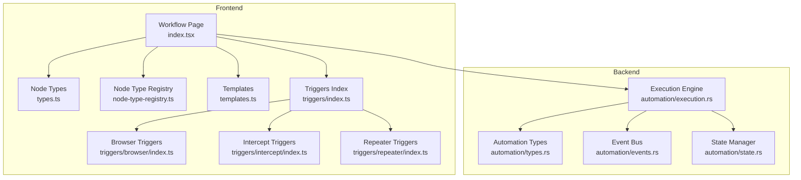
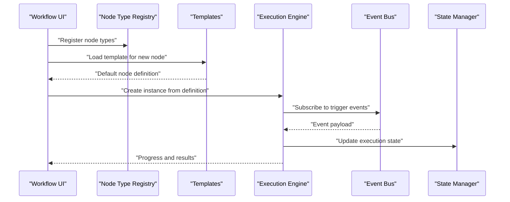
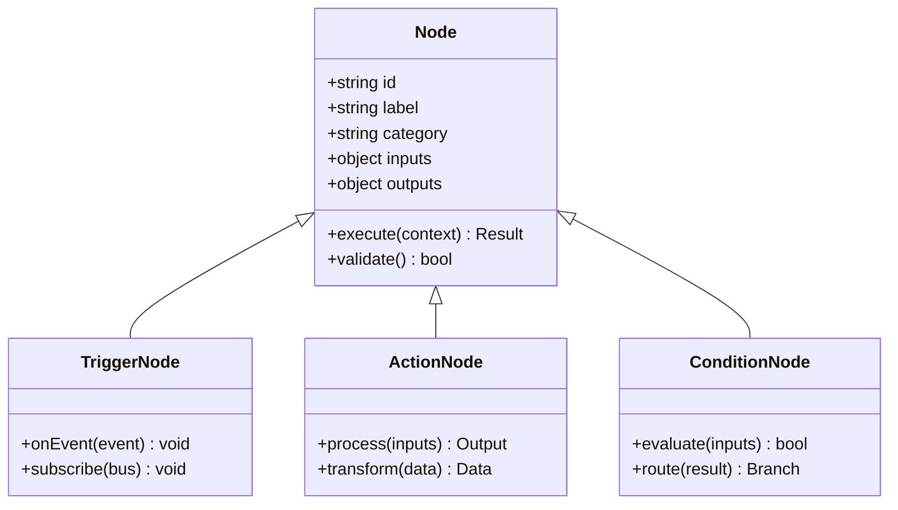
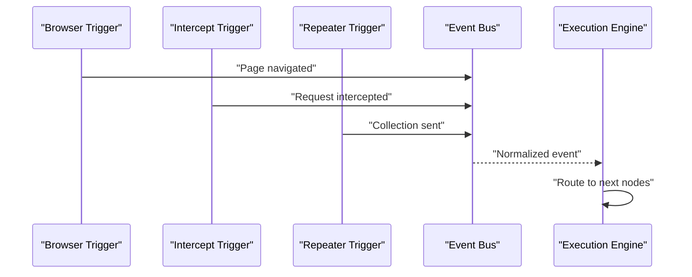
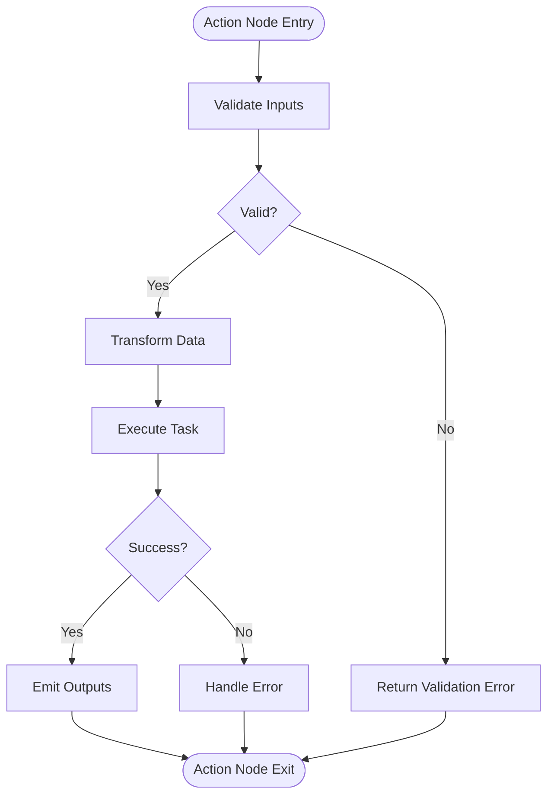
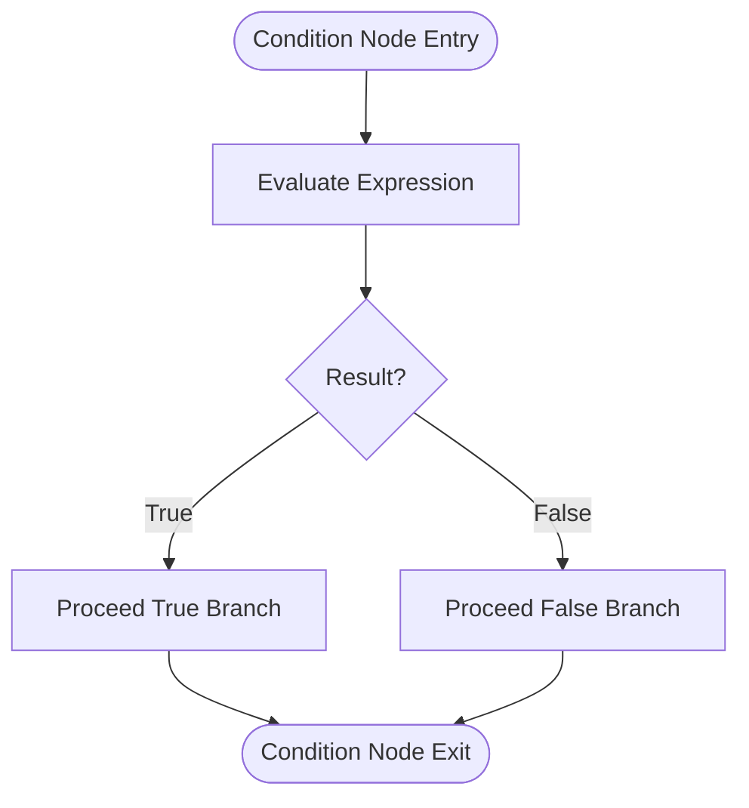
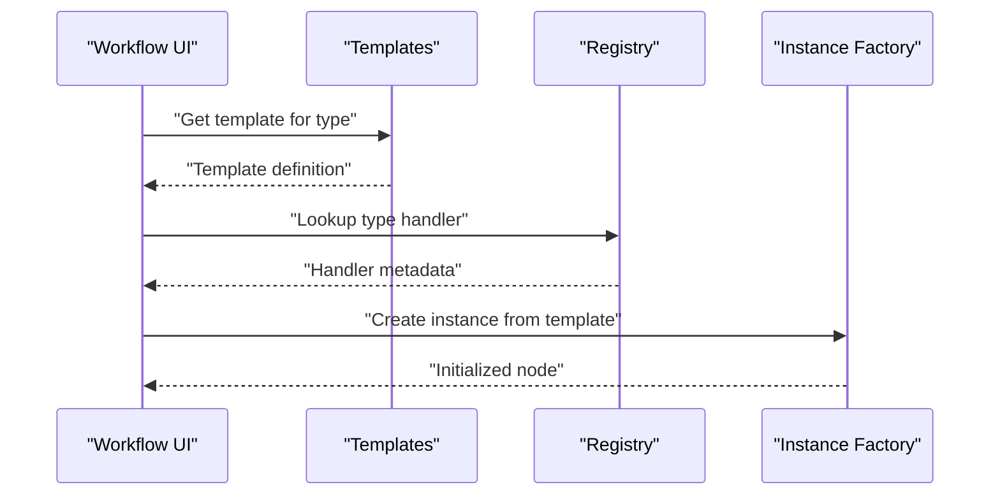
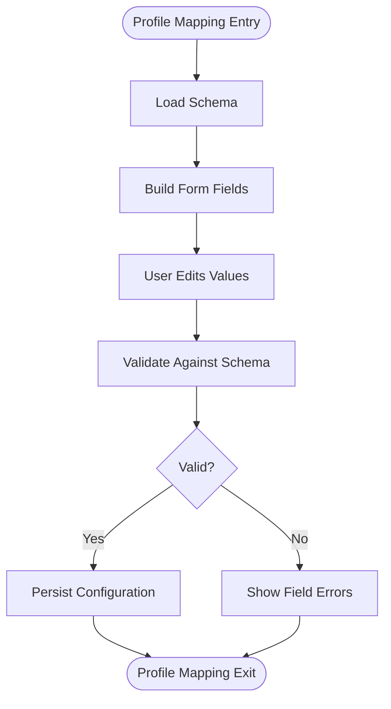
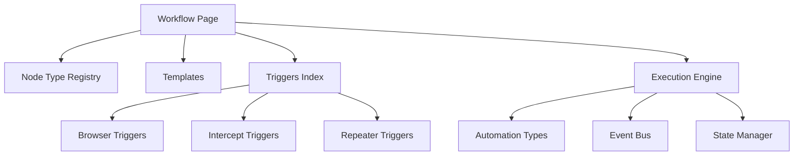

# Node System & Types

<cite>
**Referenced Files in This Document**
- [workflow/index.tsx](file://src/pages/workflow/index.tsx)
- [workflow/types.ts](file://src/pages/workflow/types.ts)
- [workflow/node-type-registry.ts](file://src/pages/workflow/node-type-registry.ts)
- [workflow/templates.ts](file://src/pages/workflow/templates.ts)
- [automation/types.rs](file://src-tauri/src/automation/types.rs)
- [automation/execution.rs](file://src-tauri/src/automation/execution.rs)
- [automation/events.rs](file://src-tauri/src/automation/events.rs)
- [automation/state.rs](file://src-tauri/src/automation/state.rs)
- [triggers/index.ts](file://src/triggers/index.ts)
- [triggers/browser/index.ts](file://src/triggers/browser/index.ts)
- [triggers/intercept/index.ts](file://src/triggers/intercept/index.ts)
- [triggers/repeater/index.ts](file://src/triggers/repeater/index.ts)
</cite>

## Table of Contents
1. [Introduction](#introduction)
2. [Project Structure](#project-structure)
3. [Core Components](#core-components)
4. [Architecture Overview](#architecture-overview)
5. [Detailed Component Analysis](#detailed-component-analysis)
6. [Dependency Analysis](#dependency-analysis)
7. [Performance Considerations](#performance-considerations)
8. [Troubleshooting Guide](#troubleshooting-guide)
9. [Conclusion](#conclusion)

## Introduction
This document explains the Node System architecture used by Apprecon’s workflow automation. It covers the three primary node types—Trigger nodes (event-driven), Action nodes (processing tasks), and Condition nodes (decision logic)—along with the node interface contract, property definitions, execution methods, factory pattern for instantiation, profile mapping for configuration schemas, validation, input/output handling, data transformation, built-in examples, and guidelines for implementing custom node types.

## Project Structure
The Node System spans both the frontend (TypeScript) and backend (Rust Tauri). The frontend defines node types, registry, templates, and UI integration. The backend defines runtime types, execution flow, event bus, and state management.

**Diagram sources**
- [workflow/index.tsx](file://src/pages/workflow/index.tsx)
- [workflow/types.ts](file://src/pages/workflow/types.ts)
- [workflow/node-type-registry.ts](file://src/pages/workflow/node-type-registry.ts)
- [workflow/templates.ts](file://src/pages/workflow/templates.ts)
- [triggers/index.ts](file://src/triggers/index.ts)
- [triggers/browser/index.ts](file://src/triggers/browser/index.ts)
- [triggers/intercept/index.ts](file://src/triggers/intercept/index.ts)
- [triggers/repeater/index.ts](file://src/triggers/repeater/index.ts)
- [automation/types.rs](file://src-tauri/src/automation/types.rs)
- [automation/execution.rs](file://src-tauri/src/automation/execution.rs)
- [automation/events.rs](file://src-tauri/src/automation/events.rs)
- [automation/state.rs](file://src-tauri/src/automation/state.rs)

**Section sources**
- [workflow/index.tsx](file://src/pages/workflow/index.tsx)
- [workflow/types.ts](file://src/pages/workflow/types.ts)
- [workflow/node-type-registry.ts](file://src/pages/workflow/node-type-registry.ts)
- [workflow/templates.ts](file://src/pages/workflow/templates.ts)
- [triggers/index.ts](file://src/triggers/index.ts)
- [automation/types.rs](file://src-tauri/src/automation/types.rs)
- [automation/execution.rs](file://src-tauri/src/automation/execution.rs)
- [automation/events.rs](file://src-tauri/src/automation/events.rs)
- [automation/state.rs](file://src-tauri/src/automation/state.rs)

## Core Components
- Node Interface Contract: Defines common properties and methods shared across all node types, including identifiers, labels, categories, inputs, outputs, and execution behavior.
- Trigger Nodes: Event-driven nodes that initiate workflows based on external events (e.g., browser actions, HTTP intercepts, repeater commands).
- Action Nodes: Processing nodes that perform transformations, API calls, or other side effects using provided inputs to produce outputs.
- Condition Nodes: Decision nodes that evaluate boolean expressions and route execution along different branches based on results.
- Profile Mapping: A schema-driven system that maps user-configurable properties to typed fields, enabling dynamic forms and validation.
- Factory Pattern: Centralized creation of node instances from serialized definitions, ensuring consistent initialization and default values.
- Validation: Schema-based checks for node properties and connections, preventing invalid configurations at design time and runtime.
- Input/Output Handling: Strongly typed ports for passing data between nodes, supporting transformation pipelines.

**Section sources**
- [workflow/types.ts](file://src/pages/workflow/types.ts)
- [workflow/node-type-registry.ts](file://src/pages/workflow/node-type-registry.ts)
- [workflow/templates.ts](file://src/pages/workflow/templates.ts)
- [automation/types.rs](file://src-tauri/src/automation/types.rs)
- [automation/execution.rs](file://src-tauri/src/automation/execution.rs)
- [automation/events.rs](file://src-tauri/src/automation/events.rs)
- [automation/state.rs](file://src-tauri/src/automation/state.rs)

## Architecture Overview
The Node System integrates a frontend registry and templates with a backend execution engine. Triggers emit events into an event bus; the execution engine consumes these events, evaluates conditions, and invokes actions. State is persisted and synchronized across components.

**Diagram sources**
- [workflow/node-type-registry.ts](file://src/pages/workflow/node-type-registry.ts)
- [workflow/templates.ts](file://src/pages/workflow/templates.ts)
- [automation/execution.rs](file://src-tauri/src/automation/execution.rs)
- [automation/events.rs](file://src-tauri/src/automation/events.rs)
- [automation/state.rs](file://src-tauri/src/automation/state.rs)

## Detailed Component Analysis

### Node Interface Contract
- Common properties include unique identifiers, display labels, category tags, versioning, and metadata.
- Execution methods define how nodes run, handle errors, and report progress.
- Input and output ports are strongly typed and validated against schemas.

**Diagram sources**
- [workflow/types.ts](file://src/pages/workflow/types.ts)
- [automation/types.rs](file://src-tauri/src/automation/types.rs)

**Section sources**
- [workflow/types.ts](file://src/pages/workflow/types.ts)
- [automation/types.rs](file://src-tauri/src/automation/types.rs)

### Trigger Nodes (Event-Driven)
- Examples include browser events, intercept lifecycle hooks, and repeater triggers.
- They subscribe to internal buses and emit standardized payloads to the execution engine.

**Diagram sources**
- [triggers/browser/index.ts](file://src/triggers/browser/index.ts)
- [triggers/intercept/index.ts](file://src/triggers/intercept/index.ts)
- [triggers/repeater/index.ts](file://src/triggers/repeater/index.ts)
- [automation/events.rs](file://src-tauri/src/automation/events.rs)
- [automation/execution.rs](file://src-tauri/src/automation/execution.rs)

**Section sources**
- [triggers/index.ts](file://src/triggers/index.ts)
- [triggers/browser/index.ts](file://src/triggers/browser/index.ts)
- [triggers/intercept/index.ts](file://src/triggers/intercept/index.ts)
- [triggers/repeater/index.ts](file://src/triggers/repeater/index.ts)
- [automation/events.rs](file://src-tauri/src/automation/events.rs)

### Action Nodes (Processing Tasks)
- Perform data transformations, API invocations, file operations, and integrations.
- Accept typed inputs, validate them, and produce structured outputs consumed by downstream nodes.

**Diagram sources**
- [automation/execution.rs](file://src-tauri/src/automation/execution.rs)
- [automation/types.rs](file://src-tauri/src/automation/types.rs)

**Section sources**
- [automation/execution.rs](file://src-tauri/src/automation/execution.rs)
- [automation/types.rs](file://src-tauri/src/automation/types.rs)

### Condition Nodes (Decision Logic)
- Evaluate boolean expressions over inputs and route execution to true/false branches.
- Support complex expressions and safe evaluation contexts.

**Diagram sources**
- [automation/types.rs](file://src-tauri/src/automation/types.rs)
- [automation/execution.rs](file://src-tauri/src/automation/execution.rs)

**Section sources**
- [automation/types.rs](file://src-tauri/src/automation/types.rs)
- [automation/execution.rs](file://src-tauri/src/automation/execution.rs)

### Node Factory Pattern
- Centralized creation of node instances from serialized definitions ensures consistent defaults and type safety.
- Supports cloning, version migration, and environment-specific overrides.

**Diagram sources**
- [workflow/templates.ts](file://src/pages/workflow/templates.ts)
- [workflow/node-type-registry.ts](file://src/pages/workflow/node-type-registry.ts)

**Section sources**
- [workflow/templates.ts](file://src/pages/workflow/templates.ts)
- [workflow/node-type-registry.ts](file://src/pages/workflow/node-type-registry.ts)

### Profile Mapping System
- Maps configuration schemas to UI forms and runtime validators.
- Enables dynamic property editing, required field enforcement, and type coercion.

**Diagram sources**
- [workflow/templates.ts](file://src/pages/workflow/templates.ts)
- [workflow/types.ts](file://src/pages/workflow/types.ts)

**Section sources**
- [workflow/templates.ts](file://src/pages/workflow/templates.ts)
- [workflow/types.ts](file://src/pages/workflow/types.ts)

### Built-in Node Examples
- Trigger examples:
  - Browser navigation and page events.
  - Intercept lifecycle hooks for request/response interception.
  - Repeater collection send triggers.
- Action examples:
  - Data transformation utilities.
  - HTTP requests and response parsing.
  - File I/O and storage operations.
- Condition examples:
  - Boolean expression evaluators.
  - Status code checks and payload validations.

**Section sources**
- [triggers/browser/index.ts](file://src/triggers/browser/index.ts)
- [triggers/intercept/index.ts](file://src/triggers/intercept/index.ts)
- [triggers/repeater/index.ts](file://src/triggers/repeater/index.ts)
- [automation/types.rs](file://src-tauri/src/automation/types.rs)

### Guidelines for Implementing Custom Node Types
- Define a node type with clear inputs, outputs, and execution semantics.
- Provide a template with default values and a schema for profile mapping.
- Register the node type in the registry with metadata and handlers.
- Implement robust validation and error handling in both frontend and backend.
- Ensure strong typing for inputs/outputs to support reliable data pipelines.
- Test edge cases, especially condition branching and asynchronous execution.

**Section sources**
- [workflow/node-type-registry.ts](file://src/pages/workflow/node-type-registry.ts)
- [workflow/templates.ts](file://src/pages/workflow/templates.ts)
- [workflow/types.ts](file://src/pages/workflow/types.ts)
- [automation/types.rs](file://src-tauri/src/automation/types.rs)
- [automation/execution.rs](file://src-tauri/src/automation/execution.rs)

## Dependency Analysis
The Node System exhibits clear separation between UI orchestration, type registration, and backend execution. Triggers decouple event sources from processing logic, while the execution engine centralizes control flow.

**Diagram sources**
- [workflow/index.tsx](file://src/pages/workflow/index.tsx)
- [workflow/node-type-registry.ts](file://src/pages/workflow/node-type-registry.ts)
- [workflow/templates.ts](file://src/pages/workflow/templates.ts)
- [triggers/index.ts](file://src/triggers/index.ts)
- [triggers/browser/index.ts](file://src/triggers/browser/index.ts)
- [triggers/intercept/index.ts](file://src/triggers/intercept/index.ts)
- [triggers/repeater/index.ts](file://src/triggers/repeater/index.ts)
- [automation/execution.rs](file://src-tauri/src/automation/execution.rs)
- [automation/types.rs](file://src-tauri/src/automation/types.rs)
- [automation/events.rs](file://src-tauri/src/automation/events.rs)
- [automation/state.rs](file://src-tauri/src/automation/state.rs)

**Section sources**
- [workflow/index.tsx](file://src/pages/workflow/index.tsx)
- [workflow/node-type-registry.ts](file://src/pages/workflow/node-type-registry.ts)
- [workflow/templates.ts](file://src/pages/workflow/templates.ts)
- [triggers/index.ts](file://src/triggers/index.ts)
- [automation/execution.rs](file://src-tauri/src/automation/execution.rs)
- [automation/types.rs](file://src-tauri/src/automation/types.rs)
- [automation/events.rs](file://src-tauri/src/automation/events.rs)
- [automation/state.rs](file://src-tauri/src/automation/state.rs)

## Performance Considerations
- Prefer lazy loading of node templates and heavy dependencies to reduce startup time.
- Use streaming where possible for large payloads between nodes.
- Cache frequently evaluated conditions and reusable transformations.
- Minimize synchronous blocking operations in action nodes; offload to background tasks when feasible.
- Batch event emissions to avoid overwhelming the event bus under high throughput.

[No sources needed since this section provides general guidance]

## Troubleshooting Guide
- Validation failures: Check schema definitions and ensure all required fields are present and correctly typed.
- Execution errors: Inspect logs from the execution engine and verify input/output contracts between connected nodes.
- Event routing issues: Confirm trigger subscriptions and event normalization steps.
- State inconsistencies: Review state manager updates and ensure atomic transitions during node execution.

**Section sources**
- [automation/execution.rs](file://src-tauri/src/automation/execution.rs)
- [automation/state.rs](file://src-tauri/src/automation/state.rs)
- [automation/events.rs](file://src-tauri/src/automation/events.rs)

## Conclusion
Apprecon’s Node System provides a robust, extensible foundation for workflow automation through clearly defined node types, a factory-based instantiation model, schema-driven configuration, and a centralized execution engine. By adhering to the interface contract and leveraging built-in triggers, actions, and conditions, developers can compose powerful automation flows while maintaining reliability and performance.

[No sources needed since this section summarizes without analyzing specific files]