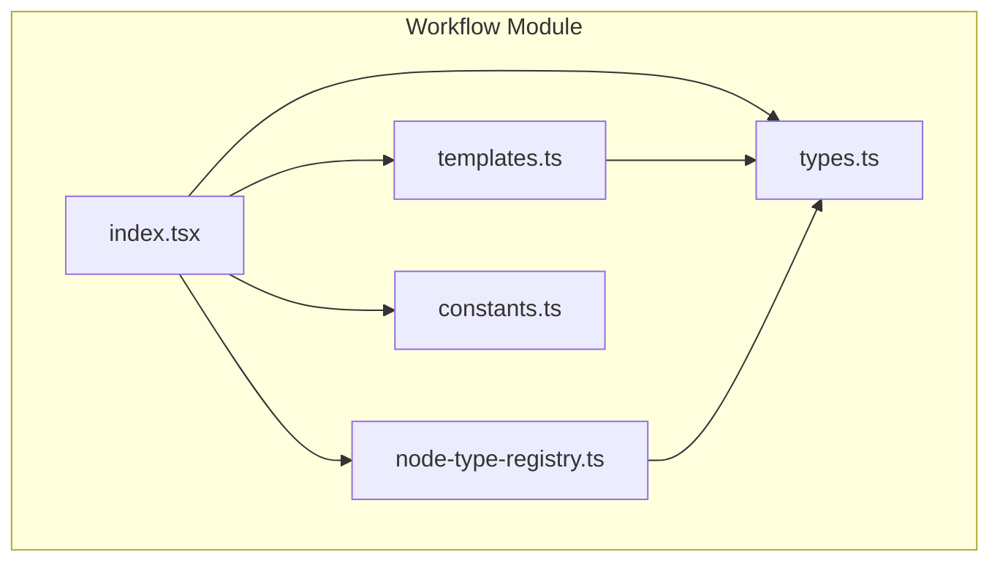
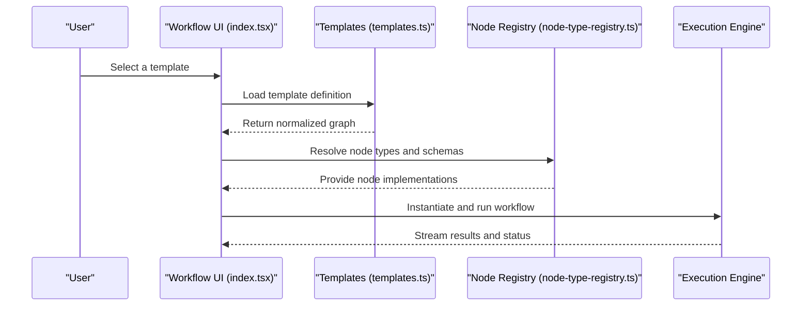
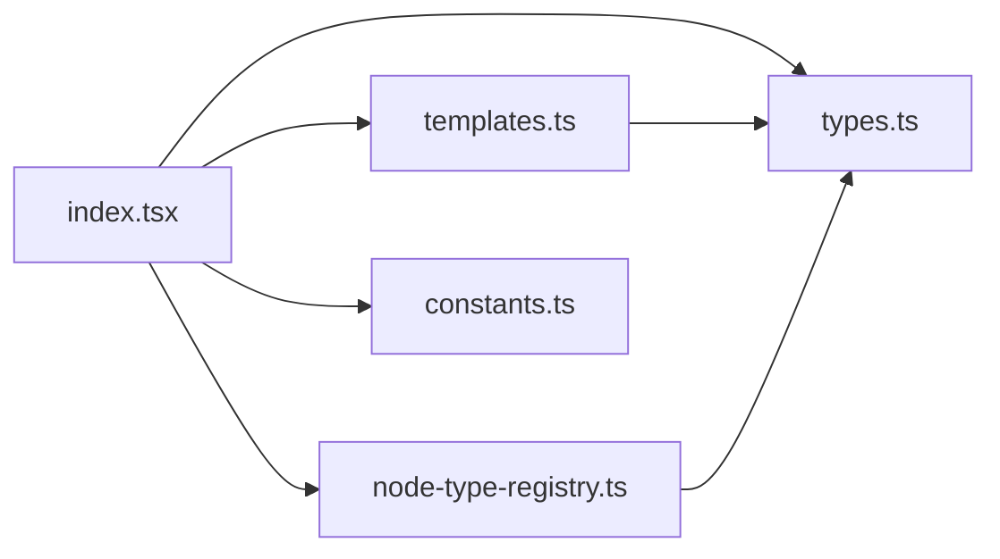

# Templates & Presets

<cite>
**Referenced Files in This Document**
- [templates.ts](file://src/pages/workflow/templates.ts)
- [index.tsx](file://src/pages/workflow/index.tsx)
- [types.ts](file://src/pages/workflow/types.ts)
- [node-type-registry.ts](file://src/pages/workflow/node-type-registry.ts)
- [constants.ts](file://src/pages/workflow/constants.ts)
</cite>

## Table of Contents
1. [Introduction](#introduction)
2. [Project Structure](#project-structure)
3. [Core Components](#core-components)
4. [Architecture Overview](#architecture-overview)
5. [Detailed Component Analysis](#detailed-component-analysis)
6. [Dependency Analysis](#dependency-analysis)
7. [Performance Considerations](#performance-considerations)
8. [Troubleshooting Guide](#troubleshooting-guide)
9. [Conclusion](#conclusion)
10. [Appendices](#appendices)

## Introduction
This document explains the Workflow Templates and Presets system, focusing on how users can leverage pre-built workflow templates for common automation scenarios such as security scanning, API testing, and data processing. It covers template structure, customization options, import/export capabilities, built-in templates, modification strategies, sharing mechanisms, best practices for reusable components, and examples of popular automation patterns. The goal is to make it easy for both new and experienced users to create, adapt, and share workflows efficiently.

## Project Structure
The workflow feature resides under src/pages/workflow with supporting modules for types, constants, node registry, and templates. Key files include:
- templates.ts: Defines built-in templates and presets
- index.tsx: Entry point for the workflow UI and orchestration
- types.ts: Core type definitions for nodes, edges, and workflow metadata
- node-type-registry.ts: Registry that maps node types to their implementations and schemas
- constants.ts: Shared constants used across the workflow module

**Diagram sources**
- [templates.ts](file://src/pages/workflow/templates.ts)
- [index.tsx](file://src/pages/workflow/index.tsx)
- [types.ts](file://src/pages/workflow/types.ts)
- [node-type-registry.ts](file://src/pages/workflow/node-type-registry.ts)
- [constants.ts](file://src/pages/workflow/constants.ts)

**Section sources**
- [templates.ts](file://src/pages/workflow/templates.ts)
- [index.tsx](file://src/pages/workflow/index.tsx)
- [types.ts](file://src/pages/workflow/types.ts)
- [node-type-registry.ts](file://src/pages/workflow/node-type-registry.ts)
- [constants.ts](file://src/pages/workflow/constants.ts)

## Core Components
- Template Catalog: A curated set of built-in templates designed for common automation tasks (e.g., security scanning, API testing, data processing). These are defined centrally and exposed to the UI for selection and instantiation.
- Node Type Registry: A mapping from node type identifiers to their runtime implementations, validation schemas, and default configurations. This enables dynamic rendering and execution of workflow nodes.
- Types and Schemas: Strongly-typed definitions for workflow graphs, nodes, edges, and metadata. They ensure consistency when creating, editing, importing, and exporting templates.
- Constants: Shared configuration values and defaults used by templates and the workflow engine.

Key responsibilities:
- Provide a consistent interface for selecting and instantiating templates
- Validate and normalize template structures before execution
- Support extensibility through the node type registry
- Maintain versioning and compatibility via typed schemas

**Section sources**
- [templates.ts](file://src/pages/workflow/templates.ts)
- [node-type-registry.ts](file://src/pages/workflow/node-type-registry.ts)
- [types.ts](file://src/pages/workflow/types.ts)
- [constants.ts](file://src/pages/workflow/constants.ts)

## Architecture Overview
The workflow templates system follows a modular architecture:
- Templates define graph structures using typed nodes and edges
- The node type registry resolves node implementations at runtime
- The workflow UI orchestrates template selection, instantiation, and execution
- Import/export utilities serialize and deserialize workflow graphs while preserving metadata

**Diagram sources**
- [index.tsx](file://src/pages/workflow/index.tsx)
- [templates.ts](file://src/pages/workflow/templates.ts)
- [node-type-registry.ts](file://src/pages/workflow/node-type-registry.ts)

## Detailed Component Analysis

### Template Catalog and Built-in Templates
- Purpose: Provide ready-to-use workflow graphs for common scenarios
- Categories: Security scanning, API testing, data processing, and more
- Structure: Each template defines nodes, edges, and metadata (name, description, tags, version)
- Customization: Users can clone templates and modify parameters, inputs, outputs, and conditions

Best practices:
- Keep templates focused on a single objective
- Use environment variables for sensitive or configurable values
- Include clear descriptions and tags for discoverability

**Section sources**
- [templates.ts](file://src/pages/workflow/templates.ts)
- [types.ts](file://src/pages/workflow/types.ts)

### Node Type Registry
- Purpose: Map node type identifiers to implementations, validation schemas, and default configs
- Extensibility: New node types can be registered dynamically without changing core logic
- Validation: Ensures node inputs/outputs conform to expected schemas before execution

Usage patterns:
- Register built-in nodes during initialization
- Override or extend existing node behaviors via composition
- Provide fallbacks for missing or deprecated node types

**Section sources**
- [node-type-registry.ts](file://src/pages/workflow/node-type-registry.ts)
- [types.ts](file://src/pages/workflow/types.ts)

### Types and Schemas
- Purpose: Define the shape of workflows, nodes, edges, and metadata
- Benefits: Compile-time checks, better IDE support, and robust import/export handling
- Evolution: Versioned schemas allow backward-compatible updates

Common fields:
- id, type, label, position for nodes
- source, target, handleIds for edges
- name, description, tags, version for templates

**Section sources**
- [types.ts](file://src/pages/workflow/types.ts)

### Constants and Defaults
- Purpose: Centralize shared configuration values and defaults
- Examples: Default timeouts, retry policies, logging levels, and UI labels

Impact:
- Reduces duplication and inconsistencies
- Simplifies tuning and maintenance

**Section sources**
- [constants.ts](file://src/pages/workflow/constants.ts)

### Workflow UI Orchestration
- Purpose: Provide the user interface for selecting, editing, and running templates
- Features: Drag-and-drop editing, parameter binding, live preview, and execution controls
- Integration: Connects templates, registry, and execution engine seamlessly

**Section sources**
- [index.tsx](file://src/pages/workflow/index.tsx)

## Dependency Analysis
The workflow module has clear boundaries and dependencies:
- index.tsx depends on templates.ts, types.ts, node-type-registry.ts, and constants.ts
- templates.ts relies on types.ts for schema compliance
- node-type-registry.ts uses types.ts for validation and registration contracts
- constants.ts is consumed across the module for shared defaults

**Diagram sources**
- [index.tsx](file://src/pages/workflow/index.tsx)
- [templates.ts](file://src/pages/workflow/templates.ts)
- [types.ts](file://src/pages/workflow/types.ts)
- [node-type-registry.ts](file://src/pages/workflow/node-type-registry.ts)
- [constants.ts](file://src/pages/workflow/constants.ts)

**Section sources**
- [index.tsx](file://src/pages/workflow/index.tsx)
- [templates.ts](file://src/pages/workflow/templates.ts)
- [types.ts](file://src/pages/workflow/types.ts)
- [node-type-registry.ts](file://src/pages/workflow/node-type-registry.ts)
- [constants.ts](file://src/pages/workflow/constants.ts)

## Performance Considerations
- Lazy loading: Defer heavy node registrations until needed
- Caching: Cache resolved node schemas and template instances
- Streaming: Stream execution results to avoid blocking the UI
- Validation: Perform lightweight validation upfront and defer deep checks to runtime

[No sources needed since this section provides general guidance]

## Troubleshooting Guide
Common issues and resolutions:
- Missing node type: Ensure the node is registered in the registry and matches the expected schema
- Invalid template structure: Validate against the typed schema; check required fields and edge connections
- Execution failures: Inspect node logs and error messages; verify environment variables and permissions
- Import/export errors: Confirm version compatibility and schema evolution rules

**Section sources**
- [node-type-registry.ts](file://src/pages/workflow/node-type-registry.ts)
- [types.ts](file://src/pages/workflow/types.ts)

## Conclusion
The Workflow Templates and Presets system provides a powerful, extensible foundation for building automation workflows. By leveraging built-in templates, customizing them for specific needs, and following best practices for sharing and reuse, teams can accelerate development and maintain consistency across projects. The modular architecture ensures scalability and ease of maintenance, while strong typing and validation reduce errors and improve reliability.

[No sources needed since this section summarizes without analyzing specific files]

## Appendices

### Built-in Template Categories and Examples
- Security Scanning: Predefined nodes for vulnerability detection, payload generation, and result aggregation
- API Testing: Endpoints, authentication, assertions, and reporting nodes
- Data Processing: Ingestion, transformation, filtering, and export nodes

Tips:
- Start with a built-in template and adjust parameters
- Use environment variables for secrets and targets
- Tag templates for team discovery and reuse

**Section sources**
- [templates.ts](file://src/pages/workflow/templates.ts)
- [types.ts](file://src/pages/workflow/types.ts)

### Customization Options
- Parameters: Bind inputs to environment variables or user prompts
- Conditions: Add branching logic based on node outputs
- Retries and Timeouts: Configure resilience settings per node
- Logging: Enable detailed logs for debugging and auditing

**Section sources**
- [types.ts](file://src/pages/workflow/types.ts)
- [constants.ts](file://src/pages/workflow/constants.ts)

### Import/Export Capabilities
- Export: Serialize workflows to a portable format including metadata and versions
- Import: Load external templates with validation and compatibility checks
- Sharing: Distribute templates via repositories or internal catalogs

**Section sources**
- [types.ts](file://src/pages/workflow/types.ts)

### Sharing Mechanism and Best Practices
- Versioning: Include version numbers and migration notes
- Documentation: Provide descriptions, usage examples, and prerequisites
- Community Contributions: Follow naming conventions and tagging standards

**Section sources**
- [templates.ts](file://src/pages/workflow/templates.ts)
- [types.ts](file://src/pages/workflow/types.ts)