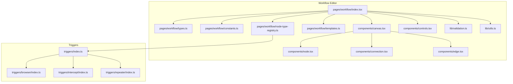
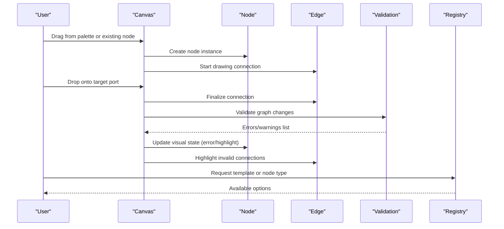
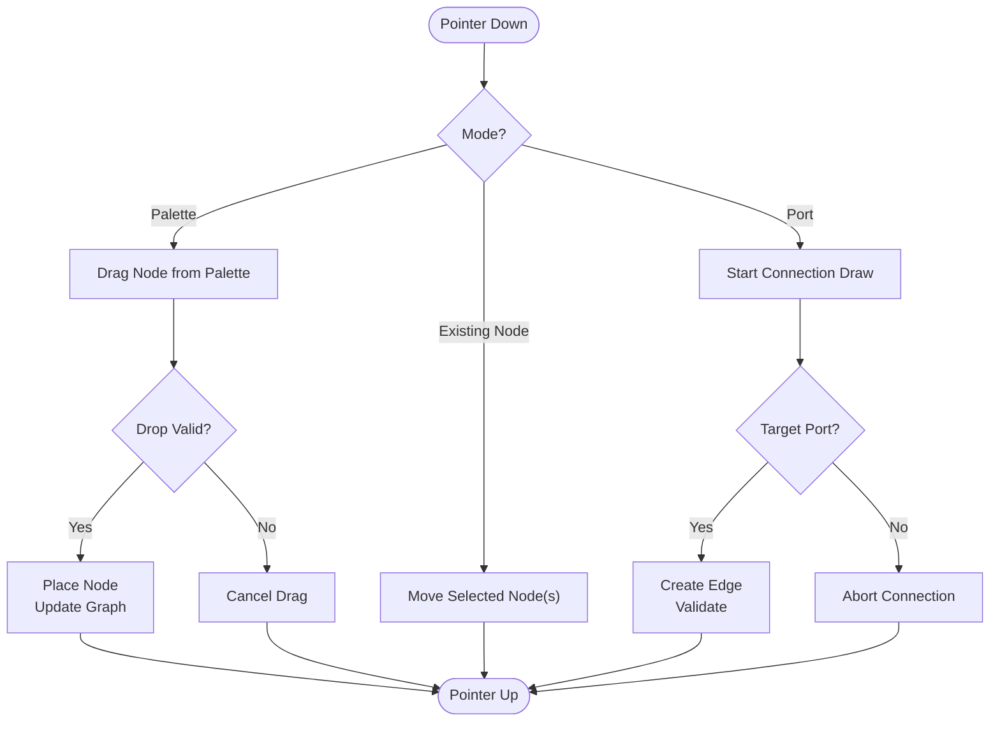
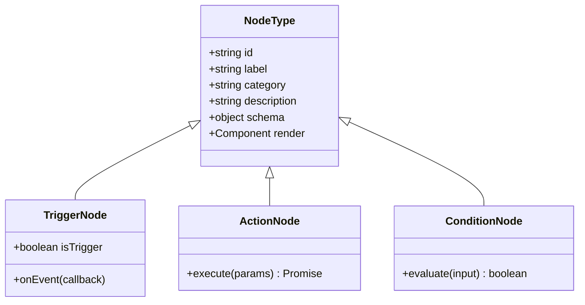
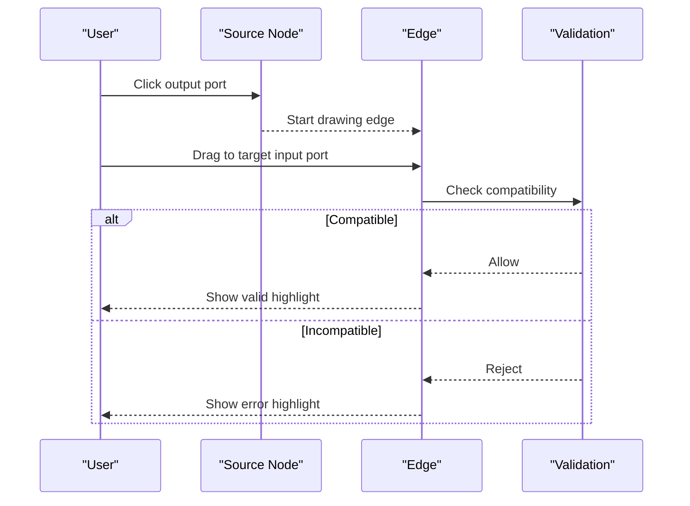
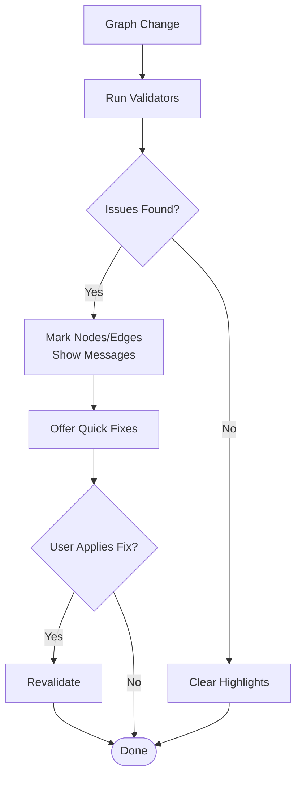
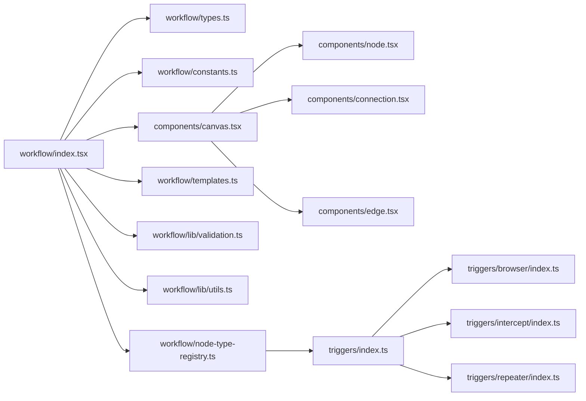

# Visual Workflow Editor

<cite>
**Referenced Files in This Document**
- [workflow/index.tsx](file://src/pages/workflow/index.tsx)
- [workflow/types.ts](file://src/pages/workflow/types.ts)
- [workflow/constants.ts](file://src/pages/workflow/constants.ts)
- [workflow/node-type-registry.ts](file://src/pages/workflow/node-type-registry.ts)
- [workflow/templates.ts](file://src/pages/workflow/templates.ts)
- [workflow/components/canvas.tsx](file://src/pages/workflow/components/canvas.tsx)
- [workflow/components/controls.tsx](file://src/pages/workflow/components/controls.tsx)
- [workflow/components/node.tsx](file://src/pages/workflow/components/node.tsx)
- [workflow/components/connection.tsx](file://src/pages/workflow/components/connection.tsx)
- [workflow/components/edge.tsx](file://src/pages/workflow/components/edge.tsx)
- [workflow/lib/validation.ts](file://src/pages/workflow/lib/validation.ts)
- [workflow/lib/utils.ts](file://src/pages/workflow/lib/utils.ts)
- [triggers/index.ts](file://src/triggers/index.ts)
- [triggers/browser/index.ts](file://src/triggers/browser/index.ts)
- [triggers/intercept/index.ts](file://src/triggers/intercept/index.ts)
- [triggers/repeater/index.ts](file://src/triggers/repeater/index.ts)
</cite>

## Table of Contents
1. [Introduction](#introduction)
2. [Project Structure](#project-structure)
3. [Core Components](#core-components)
4. [Architecture Overview](#architecture-overview)
5. [Detailed Component Analysis](#detailed-component-analysis)
6. [Dependency Analysis](#dependency-analysis)
7. [Performance Considerations](#performance-considerations)
8. [Troubleshooting Guide](#troubleshooting-guide)
9. [Conclusion](#conclusion)
10. [Appendices](#appendices)

## Introduction
This document explains Apprecon’s Visual Workflow Editor, a node-based canvas interface for creating automation sequences through drag-and-drop interactions. It covers the canvas operations (node placement, connection creation, zoom/pan), the node palette system with triggers, actions, and conditions, workflow validation and error highlighting, real-time feedback mechanisms, common workflow patterns, and best practices for organizing complex automations.

## Project Structure
The Visual Workflow Editor is implemented under src/pages/workflow with supporting trigger definitions under src/triggers. The editor separates concerns into:
- UI components for the canvas, nodes, connections, and controls
- Types and constants defining node schemas and behavior
- A registry for node types and templates for quick-start workflows
- Validation utilities and helpers for graph operations

**Diagram sources**
- [workflow/index.tsx](file://src/pages/workflow/index.tsx)
- [workflow/types.ts](file://src/pages/workflow/types.ts)
- [workflow/constants.ts](file://src/pages/workflow/constants.ts)
- [workflow/node-type-registry.ts](file://src/pages/workflow/node-type-registry.ts)
- [workflow/templates.ts](file://src/pages/workflow/templates.ts)
- [workflow/components/canvas.tsx](file://src/pages/workflow/components/canvas.tsx)
- [workflow/components/controls.tsx](file://src/pages/workflow/components/controls.tsx)
- [workflow/components/node.tsx](file://src/pages/workflow/components/node.tsx)
- [workflow/components/connection.tsx](file://src/pages/workflow/components/connection.tsx)
- [workflow/components/edge.tsx](file://src/pages/workflow/components/edge.tsx)
- [workflow/lib/validation.ts](file://src/pages/workflow/lib/validation.ts)
- [workflow/lib/utils.ts](file://src/pages/workflow/lib/utils.ts)
- [triggers/index.ts](file://src/triggers/index.ts)
- [triggers/browser/index.ts](file://src/triggers/browser/index.ts)
- [triggers/intercept/index.ts](file://src/triggers/intercept/index.ts)
- [triggers/repeater/index.ts](file://src/triggers/repeater/index.ts)

**Section sources**
- [workflow/index.tsx](file://src/pages/workflow/index.tsx)
- [workflow/types.ts](file://src/pages/workflow/types.ts)
- [workflow/constants.ts](file://src/pages/workflow/constants.ts)
- [workflow/node-type-registry.ts](file://src/pages/workflow/node-type-registry.ts)
- [workflow/templates.ts](file://src/pages/workflow/templates.ts)
- [workflow/components/canvas.tsx](file://src/pages/workflow/components/canvas.tsx)
- [workflow/components/controls.tsx](file://src/pages/workflow/components/controls.tsx)
- [workflow/components/node.tsx](file://src/pages/workflow/components/node.tsx)
- [workflow/components/connection.tsx](file://src/pages/workflow/components/connection.tsx)
- [workflow/components/edge.tsx](file://src/pages/workflow/components/edge.tsx)
- [workflow/lib/validation.ts](file://src/pages/workflow/lib/validation.ts)
- [workflow/lib/utils.ts](file://src/pages/workflow/lib/utils.ts)
- [triggers/index.ts](file://src/triggers/index.ts)
- [triggers/browser/index.ts](file://src/triggers/browser/index.ts)
- [triggers/intercept/index.ts](file://src/triggers/intercept/index.ts)
- [triggers/repeater/index.ts](file://src/triggers/repeater/index.ts)

## Core Components
- Canvas: Renders the infinite pan/zoom surface, handles pointer events for dragging nodes and drawing connections, and manages selection and multi-select behaviors.
- Node: Represents a single workflow step with input/output ports, visual state (selected, error, running), and inline configuration panels.
- Connection/Edge: Visualizes directed links between compatible ports, supports routing, hover states, and deletion.
- Controls: Provides toolbar actions such as zoom in/out, fit-to-screen, grid toggle, undo/redo, and export/import.
- Registry and Templates: Centralized catalog of available node types and starter graphs to accelerate workflow creation.
- Validation: Real-time checks for connectivity, required inputs, cycles, and schema compliance; surfaces errors on nodes and edges.

Key responsibilities:
- Maintain a consistent data model for nodes and edges
- Provide immediate visual feedback for user actions
- Enforce constraints and display actionable error messages
- Support keyboard shortcuts and accessibility features

**Section sources**
- [workflow/components/canvas.tsx](file://src/pages/workflow/components/canvas.tsx)
- [workflow/components/node.tsx](file://src/pages/workflow/components/node.tsx)
- [workflow/components/connection.tsx](file://src/pages/workflow/components/connection.tsx)
- [workflow/components/edge.tsx](file://src/pages/workflow/components/edge.tsx)
- [workflow/components/controls.tsx](file://src/pages/workflow/components/controls.tsx)
- [workflow/node-type-registry.ts](file://src/pages/workflow/node-type-registry.ts)
- [workflow/templates.ts](file://src/pages/workflow/templates.ts)
- [workflow/lib/validation.ts](file://src/pages/workflow/lib/validation.ts)

## Architecture Overview
The editor follows a component-driven architecture with a central state model for the graph. User interactions on the canvas update the graph model, which triggers re-renders of nodes and edges. Validation runs incrementally to provide real-time feedback. Triggers are registered centrally and exposed via the palette.

**Diagram sources**
- [workflow/components/canvas.tsx](file://src/pages/workflow/components/canvas.tsx)
- [workflow/components/node.tsx](file://src/pages/workflow/components/node.tsx)
- [workflow/components/connection.tsx](file://src/pages/workflow/components/connection.tsx)
- [workflow/components/edge.tsx](file://src/pages/workflow/components/edge.tsx)
- [workflow/lib/validation.ts](file://src/pages/workflow/lib/validation.ts)
- [workflow/node-type-registry.ts](file://src/pages/workflow/node-type-registry.ts)

## Detailed Component Analysis

### Canvas Operations
- Node placement: Drag-and-drop from palette or duplication; snap-to-grid optional; collision avoidance and grouping support.
- Connection creation: Port-to-port linking with automatic routing; constraint checking before finalizing.
- Zoom/Pan: Mouse wheel zoom, trackpad gestures, and toolbar controls; viewport bounds management.
- Selection and editing: Multi-select, move, delete, copy/paste; context menus for quick actions.
- Keyboard shortcuts: Undo/redo, select all, delete, zoom reset, focus search.

**Diagram sources**
- [workflow/components/canvas.tsx](file://src/pages/workflow/components/canvas.tsx)
- [workflow/components/node.tsx](file://src/pages/workflow/components/node.tsx)
- [workflow/components/connection.tsx](file://src/pages/workflow/components/connection.tsx)
- [workflow/components/edge.tsx](file://src/pages/workflow/components/edge.tsx)

**Section sources**
- [workflow/components/canvas.tsx](file://src/pages/workflow/components/canvas.tsx)
- [workflow/components/node.tsx](file://src/pages/workflow/components/node.tsx)
- [workflow/components/connection.tsx](file://src/pages/workflow/components/connection.tsx)
- [workflow/components/edge.tsx](file://src/pages/workflow/components/edge.tsx)

### Node Palette System
- Categories: Triggers, Actions, Conditions. Each category groups related nodes for quick discovery.
- Visual representation: Distinct icons, color accents, and labels; tooltips with descriptions and usage hints.
- Registration: Central registry maps node IDs to metadata, schemas, and rendering components.
- Templates: Predefined graphs for common patterns (e.g., HTTP capture → transform → send).

**Diagram sources**
- [workflow/node-type-registry.ts](file://src/pages/workflow/node-type-registry.ts)
- [workflow/types.ts](file://src/pages/workflow/types.ts)

**Section sources**
- [workflow/node-type-registry.ts](file://src/pages/workflow/node-type-registry.ts)
- [workflow/types.ts](file://src/pages/workflow/types.ts)
- [workflow/constants.ts](file://src/pages/workflow/constants.ts)
- [workflow/templates.ts](file://src/pages/workflow/templates.ts)
- [triggers/index.ts](file://src/triggers/index.ts)
- [triggers/browser/index.ts](file://src/triggers/browser/index.ts)
- [triggers/intercept/index.ts](file://src/triggers/intercept/index.ts)
- [triggers/repeater/index.ts](file://src/triggers/repeater/index.ts)

### Connections and Edges
- Ports: Input and output ports per node; typed compatibility enforced by schemas.
- Routing: Smooth curves with control points; dynamic updates when nodes move.
- Interaction: Hover highlights, click to select, backspace/delete to remove; right-click menu for advanced options.
- Validation: Prevents invalid connections (type mismatch, missing targets); shows inline warnings.

**Diagram sources**
- [workflow/components/connection.tsx](file://src/pages/workflow/components/connection.tsx)
- [workflow/components/edge.tsx](file://src/pages/workflow/components/edge.tsx)
- [workflow/lib/validation.ts](file://src/pages/workflow/lib/validation.ts)

**Section sources**
- [workflow/components/connection.tsx](file://src/pages/workflow/components/connection.tsx)
- [workflow/components/edge.tsx](file://src/pages/workflow/components/edge.tsx)
- [workflow/lib/validation.ts](file://src/pages/workflow/lib/validation.ts)

### Workflow Validation and Error Highlighting
- Checks: Required fields, type compatibility, cycle detection, unreachable nodes, duplicate IDs.
- Feedback: Inline badges on nodes/edges, status bar messages, and a dedicated errors panel.
- Recovery: Quick fixes suggested (e.g., auto-connect recommended targets, fix schema defaults).
- Real-time: Debounced validation during typing; incremental updates after each change.

**Diagram sources**
- [workflow/lib/validation.ts](file://src/pages/workflow/lib/validation.ts)
- [workflow/components/node.tsx](file://src/pages/workflow/components/node.tsx)
- [workflow/components/edge.tsx](file://src/pages/workflow/components/edge.tsx)

**Section sources**
- [workflow/lib/validation.ts](file://src/pages/workflow/lib/validation.ts)
- [workflow/components/node.tsx](file://src/pages/workflow/components/node.tsx)
- [workflow/components/edge.tsx](file://src/pages/workflow/components/edge.tsx)

### Common Workflow Patterns and Best Practices
- Capture and Transform: Use an intercept trigger to capture requests, chain action nodes to modify payloads, then forward to destination.
- Conditional Branching: Insert condition nodes to route flows based on response codes or content.
- Retry and Fallback: Add retry loops and fallback branches to handle transient failures gracefully.
- Modularization: Group related steps into reusable subgraphs; use templates to standardize patterns.
- Naming and Layout: Use descriptive labels, align nodes logically, and keep branching paths readable.

[No sources needed since this section provides general guidance]

## Dependency Analysis
The editor’s dependencies are organized around a clear separation of UI, logic, and domain-specific triggers.

**Diagram sources**
- [workflow/index.tsx](file://src/pages/workflow/index.tsx)
- [workflow/types.ts](file://src/pages/workflow/types.ts)
- [workflow/constants.ts](file://src/pages/workflow/constants.ts)
- [workflow/node-type-registry.ts](file://src/pages/workflow/node-type-registry.ts)
- [workflow/templates.ts](file://src/pages/workflow/templates.ts)
- [workflow/lib/validation.ts](file://src/pages/workflow/lib/validation.ts)
- [workflow/lib/utils.ts](file://src/pages/workflow/lib/utils.ts)
- [workflow/components/canvas.tsx](file://src/pages/workflow/components/canvas.tsx)
- [workflow/components/node.tsx](file://src/pages/workflow/components/node.tsx)
- [workflow/components/connection.tsx](file://src/pages/workflow/components/connection.tsx)
- [workflow/components/edge.tsx](file://src/pages/workflow/components/edge.tsx)
- [triggers/index.ts](file://src/triggers/index.ts)
- [triggers/browser/index.ts](file://src/triggers/browser/index.ts)
- [triggers/intercept/index.ts](file://src/triggers/intercept/index.ts)
- [triggers/repeater/index.ts](file://src/triggers/repeater/index.ts)

**Section sources**
- [workflow/index.tsx](file://src/pages/workflow/index.tsx)
- [workflow/types.ts](file://src/pages/workflow/types.ts)
- [workflow/constants.ts](file://src/pages/workflow/constants.ts)
- [workflow/node-type-registry.ts](file://src/pages/workflow/node-type-registry.ts)
- [workflow/templates.ts](file://src/pages/workflow/templates.ts)
- [workflow/lib/validation.ts](file://src/pages/workflow/lib/validation.ts)
- [workflow/lib/utils.ts](file://src/pages/workflow/lib/utils.ts)
- [workflow/components/canvas.tsx](file://src/pages/workflow/components/canvas.tsx)
- [workflow/components/node.tsx](file://src/pages/workflow/components/node.tsx)
- [workflow/components/connection.tsx](file://src/pages/workflow/components/connection.tsx)
- [workflow/components/edge.tsx](file://src/pages/workflow/components/edge.tsx)
- [triggers/index.ts](file://src/triggers/index.ts)
- [triggers/browser/index.ts](file://src/triggers/browser/index.ts)
- [triggers/intercept/index.ts](file://src/triggers/intercept/index.ts)
- [triggers/repeater/index.ts](file://src/triggers/repeater/index.ts)

## Performance Considerations
- Virtualization: Render only visible nodes and edges within the viewport to reduce DOM overhead.
- Debouncing: Throttle validation and heavy computations during rapid edits.
- Memoization: Cache computed layouts and connection routes; avoid unnecessary re-renders.
- Batched Updates: Coalesce multiple graph mutations into a single transaction.
- Efficient Data Structures: Use adjacency lists for edges and indexed lookups for nodes.

[No sources needed since this section provides general guidance]

## Troubleshooting Guide
- Nodes not connecting: Ensure port types match and both endpoints exist; check validation messages for incompatibility.
- Unexpected errors: Inspect node configuration schemas; verify required fields and default values.
- Slow performance: Reduce node count, enable grid snapping to minimize layout recalculations, and disable non-essential animations.
- Lost connections: Confirm that node IDs remain stable across updates; avoid recreating nodes unnecessarily.
- Undo/redo issues: Verify that history snapshots include full graph state and that operations are atomic.

**Section sources**
- [workflow/lib/validation.ts](file://src/pages/workflow/lib/validation.ts)
- [workflow/components/node.tsx](file://src/pages/workflow/components/node.tsx)
- [workflow/components/edge.tsx](file://src/pages/workflow/components/edge.tsx)

## Conclusion
Apprecon’s Visual Workflow Editor provides a powerful, intuitive environment for building automation sequences through a node-based canvas. With robust interaction patterns, comprehensive validation, and a flexible trigger system, it enables users to design, validate, and iterate on complex workflows efficiently. Following the recommended patterns and best practices will help maintain clarity and reliability in large-scale automations.

[No sources needed since this section summarizes without analyzing specific files]

## Appendices
- Glossary: Trigger, Action, Condition, Node, Edge, Port, Canvas, Palette, Template.
- Keyboard Shortcuts: Standard shortcuts for navigation, editing, and validation toggles.
- Export Formats: Supported serialization formats for sharing and version control.

[No sources needed since this section provides general guidance]