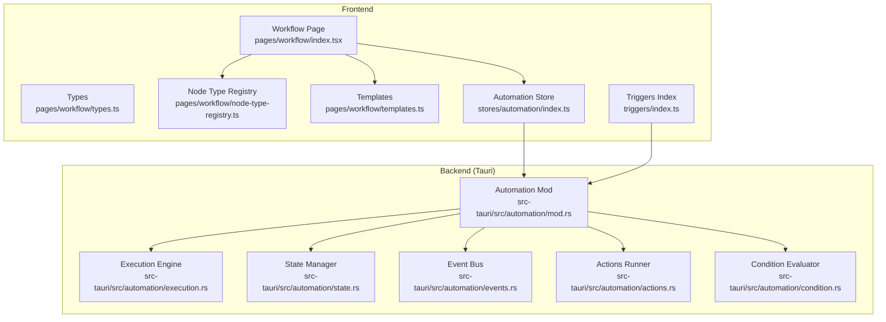
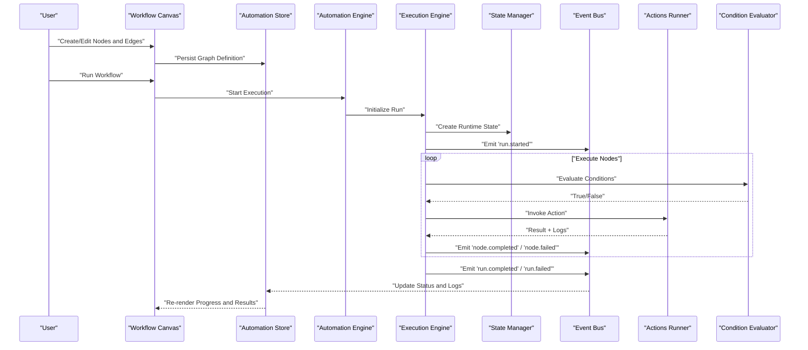
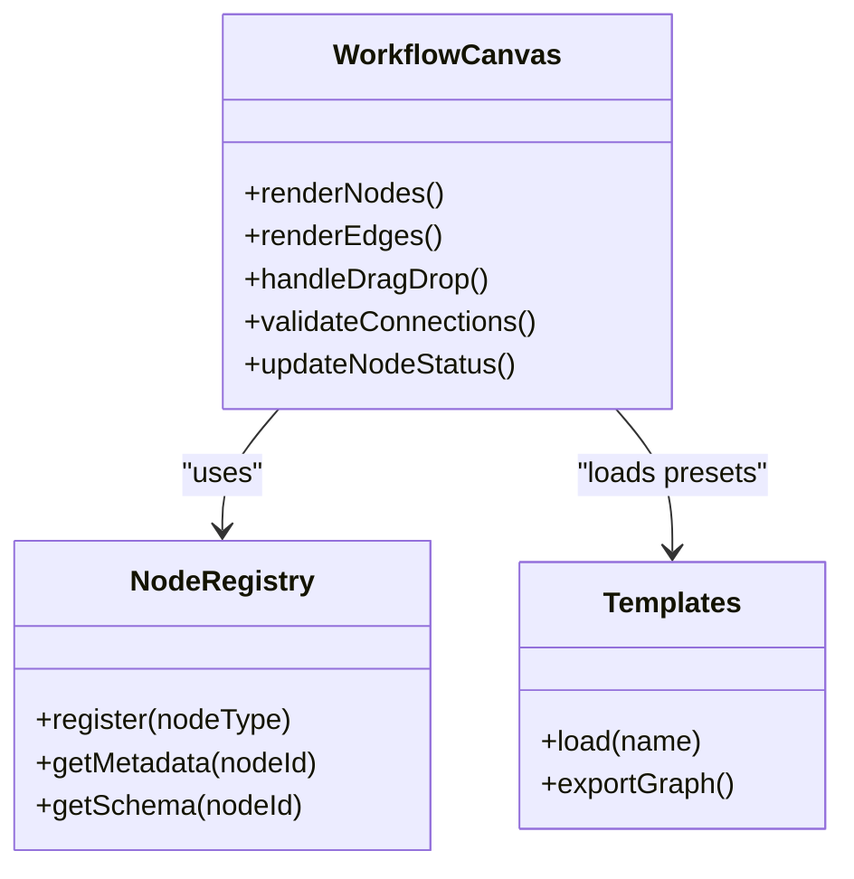
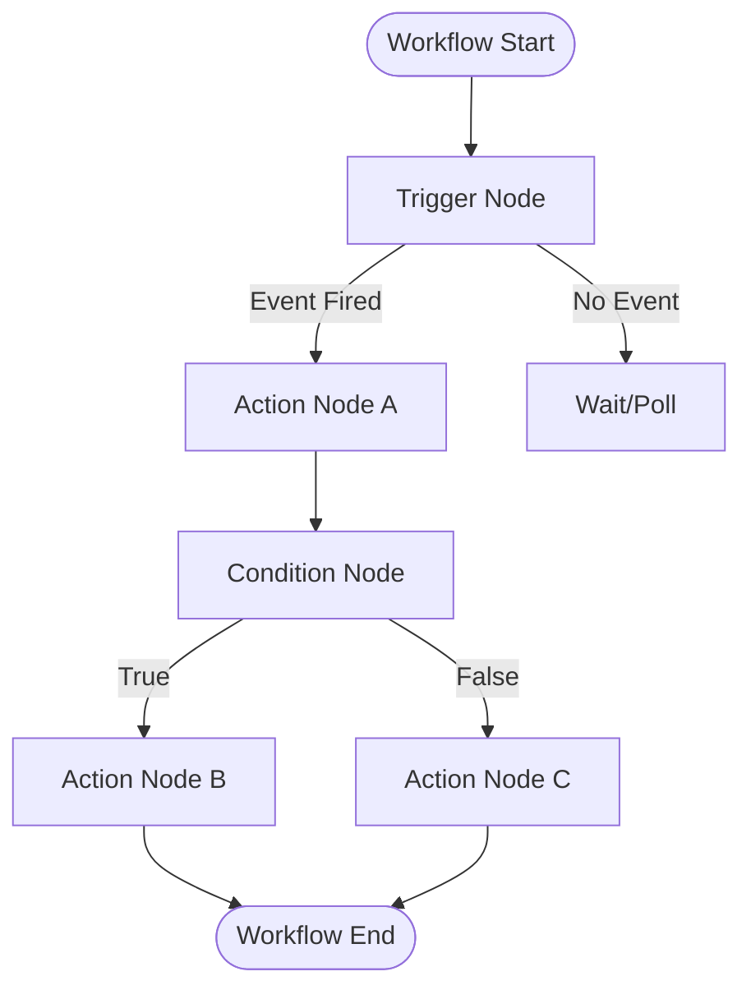
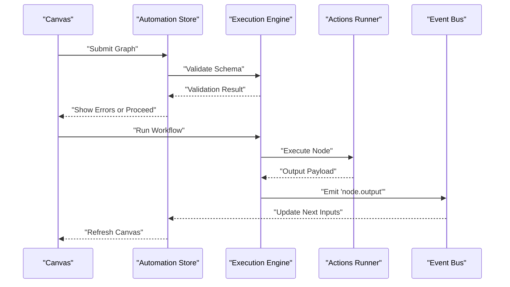
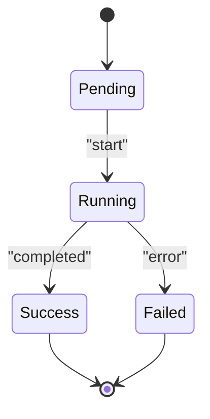
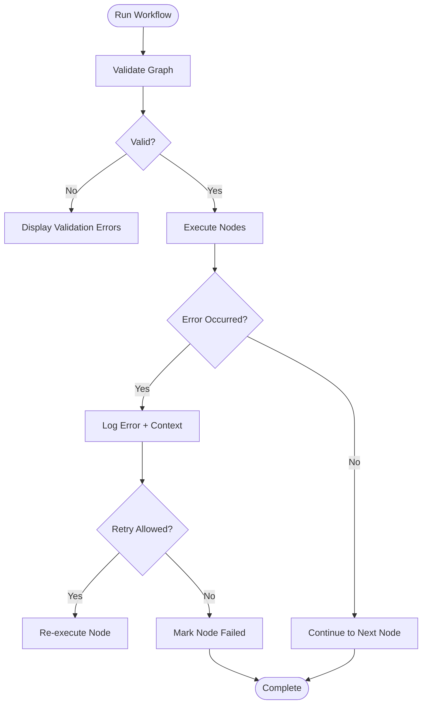
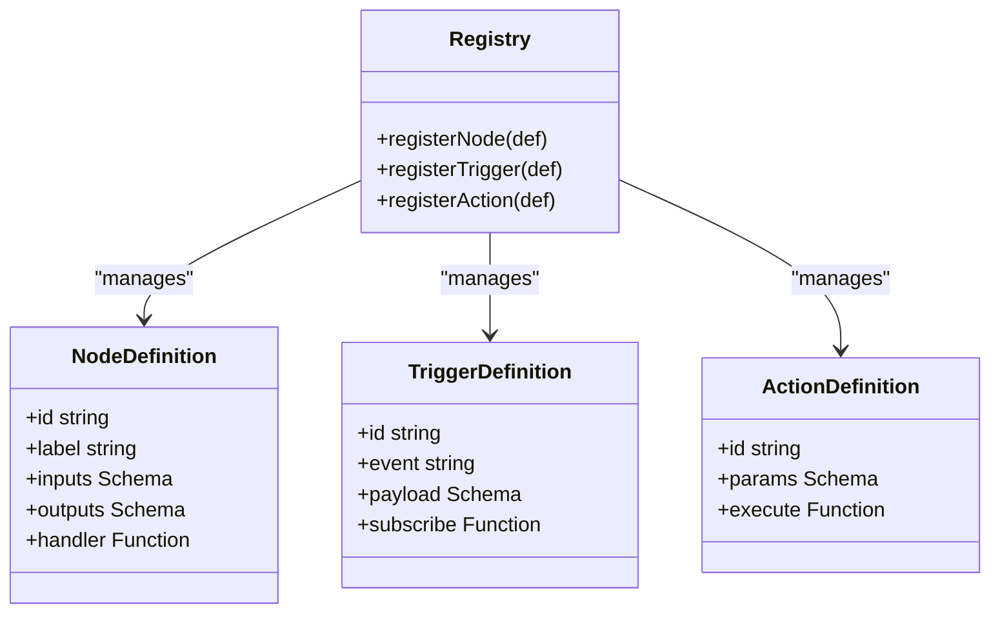
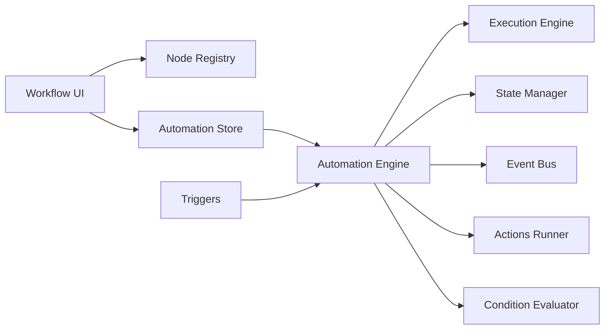

# Workflow Automation & Orchestration

<cite>
**Referenced Files in This Document**
- [workflow/index.tsx](file://src/pages/workflow/index.tsx)
- [workflow/types.ts](file://src/pages/workflow/types.ts)
- [workflow/node-type-registry.ts](file://src/pages/workflow/node-type-registry.ts)
- [workflow/templates.ts](file://src/pages/workflow/templates.ts)
- [automation/mod.rs](file://src-tauri/src/automation/mod.rs)
- [automation/execution.rs](file://src-tauri/src/automation/execution.rs)
- [automation/state.rs](file://src-tauri/src/automation/state.rs)
- [automation/events.rs](file://src-tauri/src/automation/events.rs)
- [automation/actions.rs](file://src-tauri/src/automation/actions.rs)
- [automation/condition.rs](file://src-tauri/src/automation/condition.rs)
- [triggers/index.ts](file://src/triggers/index.ts)
- [stores/automation/index.ts](file://src/stores/automation/index.ts)
- [stores/automation/types.ts](file://src/stores/automation/types.ts)
</cite>

## Table of Contents
1. [Introduction](#introduction)
2. [Project Structure](#project-structure)
3. [Core Components](#core-components)
4. [Architecture Overview](#architecture-overview)
5. [Detailed Component Analysis](#detailed-component-analysis)
6. [Dependency Analysis](#dependency-analysis)
7. [Performance Considerations](#performance-considerations)
8. [Troubleshooting Guide](#troubleshooting-guide)
9. [Conclusion](#conclusion)
10. [Appendices](#appendices)

## Introduction
This document explains Apprecon’s Workflow Automation and Orchestration feature, focusing on how users build visual workflows that combine multiple Apprecon tools and external services through a node-based interface. It covers the workflow runtime, node types (triggers, actions, conditions), data flow between components, the visual canvas editor, execution monitoring, error handling, common automation patterns, and extensibility for custom nodes and third-party integrations.

## Project Structure
The workflow feature spans both the frontend (React UI and state management) and the backend (Tauri Rust engine). Key areas include:
- Frontend workflow page and components for the visual canvas editor
- Node type registry and templates for built-in nodes
- Triggers subsystem for event-driven orchestration
- Stores for workflow state synchronization
- Backend automation engine for execution, state, events, actions, and condition evaluation

**Diagram sources**
- [workflow/index.tsx](file://src/pages/workflow/index.tsx)
- [workflow/types.ts](file://src/pages/workflow/types.ts)
- [workflow/node-type-registry.ts](file://src/pages/workflow/node-type-registry.ts)
- [workflow/templates.ts](file://src/pages/workflow/templates.ts)
- [triggers/index.ts](file://src/triggers/index.ts)
- [stores/automation/index.ts](file://src/stores/automation/index.ts)
- [automation/mod.rs](file://src-tauri/src/automation/mod.rs)
- [automation/execution.rs](file://src-tauri/src/automation/execution.rs)
- [automation/state.rs](file://src-tauri/src/automation/state.rs)
- [automation/events.rs](file://src-tauri/src/automation/events.rs)
- [automation/actions.rs](file://src-tauri/src/automation/actions.rs)
- [automation/condition.rs](file://src-tauri/src/automation/condition.rs)

**Section sources**
- [workflow/index.tsx](file://src/pages/workflow/index.tsx)
- [workflow/types.ts](file://src/pages/workflow/types.ts)
- [workflow/node-type-registry.ts](file://src/pages/workflow/node-type-registry.ts)
- [workflow/templates.ts](file://src/pages/workflow/templates.ts)
- [triggers/index.ts](file://src/triggers/index.ts)
- [stores/automation/index.ts](file://src/stores/automation/index.ts)
- [automation/mod.rs](file://src-tauri/src/automation/mod.rs)
- [automation/execution.rs](file://src-tauri/src/automation/execution.rs)
- [automation/state.rs](file://src-tauri/src/automation/state.rs)
- [automation/events.rs](file://src-tauri/src/automation/events.rs)
- [automation/actions.rs](file://src-tauri/src/automation/actions.rs)
- [automation/condition.rs](file://src-tauri/src/automation/condition.rs)

## Core Components
- Visual Canvas Editor: A node-based editor where users drag-and-drop triggers, actions, and conditions to compose workflows. The editor renders nodes and edges, supports pan/zoom, and persists graph structure.
- Node Type Registry: Central registry that maps node IDs to metadata, input schemas, output schemas, and execution handlers.
- Templates: Predefined workflow blueprints (e.g., security scanning pipeline, API testing sequence, data processing workflow) to accelerate creation.
- Triggers Subsystem: Event-driven entry points that start workflows based on system or application events (e.g., HTTP capture, browser crawl completion, scheduled time).
- Automation Store: Frontend state store that synchronizes workflow definitions, execution status, logs, and results with the backend.
- Backend Automation Engine: Orchestrates execution, manages state, evaluates conditions, runs actions, and publishes lifecycle events.

**Section sources**
- [workflow/node-type-registry.ts](file://src/pages/workflow/node-type-registry.ts)
- [workflow/templates.ts](file://src/pages/workflow/templates.ts)
- [triggers/index.ts](file://src/triggers/index.ts)
- [stores/automation/index.ts](file://src/stores/automation/index.ts)
- [automation/mod.rs](file://src-tauri/src/automation/mod.rs)

## Architecture Overview
The workflow system follows an event-driven architecture with clear separation between UI and runtime:
- The UI composes graphs using nodes and edges and sends them to the backend via Tauri commands.
- The backend executes workflows asynchronously, emitting events for progress and errors.
- The frontend listens to events to update the canvas, logs, and status indicators.

**Diagram sources**
- [workflow/index.tsx](file://src/pages/workflow/index.tsx)
- [stores/automation/index.ts](file://src/stores/automation/index.ts)
- [automation/mod.rs](file://src-tauri/src/automation/mod.rs)
- [automation/execution.rs](file://src-tauri/src/automation/execution.rs)
- [automation/state.rs](file://src-tauri/src/automation/state.rs)
- [automation/events.rs](file://src-tauri/src/automation/events.rs)
- [automation/actions.rs](file://src-tauri/src/automation/actions.rs)
- [automation/condition.rs](file://src-tauri/src/automation/condition.rs)

## Detailed Component Analysis

### Visual Canvas Editor
- Provides a drag-and-drop interface for arranging triggers, actions, and conditions.
- Supports connecting nodes via edges, validating connections against schemas, and rendering live execution states.
- Integrates with the node type registry to render appropriate editors per node type.

**Diagram sources**
- [workflow/index.tsx](file://src/pages/workflow/index.tsx)
- [workflow/node-type-registry.ts](file://src/pages/workflow/node-type-registry.ts)
- [workflow/templates.ts](file://src/pages/workflow/templates.ts)

**Section sources**
- [workflow/index.tsx](file://src/pages/workflow/index.tsx)
- [workflow/node-type-registry.ts](file://src/pages/workflow/node-type-registry.ts)
- [workflow/templates.ts](file://src/pages/workflow/templates.ts)

### Node Types: Triggers, Actions, Conditions
- Triggers: Start workflows based on events such as HTTP captures, browser crawls, or scheduled timers.
- Actions: Execute operations like sending requests, invoking tools, transforming data, or calling external APIs.
- Conditions: Evaluate boolean expressions to branch execution paths.

**Diagram sources**
- [triggers/index.ts](file://src/triggers/index.ts)
- [automation/actions.rs](file://src-tauri/src/automation/actions.rs)
- [automation/condition.rs](file://src-tauri/src/automation/condition.rs)

**Section sources**
- [triggers/index.ts](file://src/triggers/index.ts)
- [automation/actions.rs](file://src-tauri/src/automation/actions.rs)
- [automation/condition.rs](file://src-tauri/src/automation/condition.rs)

### Data Flow Between Components
- Inputs are validated against node schemas before execution.
- Outputs from one node become inputs to downstream nodes via edges.
- Variables and environment values can be injected into nodes at runtime.
- Errors propagate up the chain and are logged with context.

**Diagram sources**
- [stores/automation/index.ts](file://src/stores/automation/index.ts)
- [automation/execution.rs](file://src-tauri/src/automation/execution.rs)
- [automation/actions.rs](file://src-tauri/src/automation/actions.rs)
- [automation/events.rs](file://src-tauri/src/automation/events.rs)

**Section sources**
- [stores/automation/index.ts](file://src/stores/automation/index.ts)
- [automation/execution.rs](file://src-tauri/src/automation/execution.rs)
- [automation/actions.rs](file://src-tauri/src/automation/actions.rs)
- [automation/events.rs](file://src/tauri/src/automation/events.rs)

### Workflow Execution Monitoring
- Real-time status updates for each node (pending, running, success, failed).
- Log streams per node and per run, including error stack traces and contextual payloads.
- Ability to pause/resume or stop runs depending on configuration.

**Diagram sources**
- [automation/state.rs](file://src-tauri/src/automation/state.rs)
- [automation/events.rs](file://src-tauri/src/automation/events.rs)

**Section sources**
- [automation/state.rs](file://src-tauri/src/automation/state.rs)
- [automation/events.rs](file://src-tauri/src/automation/events.rs)

### Error Handling Mechanisms
- Validation errors at graph level (missing nodes, invalid connections).
- Runtime errors during action execution with detailed logs.
- Conditional failures handled by branching logic and fallback actions.
- Retry policies and timeouts configurable per action.

**Diagram sources**
- [automation/execution.rs](file://src-tauri/src/automation/execution.rs)
- [automation/actions.rs](file://src-tauri/src/automation/actions.rs)
- [automation/condition.rs](file://src-tauri/src/automation/condition.rs)

**Section sources**
- [automation/execution.rs](file://src-tauri/src/automation/execution.rs)
- [automation/actions.rs](file://src-tauri/src/automation/actions.rs)
- [automation/condition.rs](file://src-tauri/src/automation/condition.rs)

### Extensibility Model for Custom Nodes and Third-Party Services
- Node Type Registration: Define new node types with input/output schemas and execution handlers.
- Trigger Plugins: Register custom triggers to start workflows on domain-specific events.
- Action Plugins: Implement custom actions to call external APIs or integrate third-party services.
- Template Sharing: Export/import workflow templates for team reuse.

**Diagram sources**
- [workflow/node-type-registry.ts](file://src/pages/workflow/node-type-registry.ts)
- [triggers/index.ts](file://src/triggers/index.ts)
- [automation/actions.rs](file://src-tauri/src/automation/actions.rs)

**Section sources**
- [workflow/node-type-registry.ts](file://src/pages/workflow/node-type-registry.ts)
- [triggers/index.ts](file://src/triggers/index.ts)
- [automation/actions.rs](file://src-tauri/src/automation/actions.rs)

### Common Automation Patterns
- Security Scanning Pipeline: Trigger on target discovery, run vulnerability scanners, evaluate findings, and generate reports.
- API Testing Sequence: Compose request chains with dynamic parameters, assertions, and conditional branching based on responses.
- Data Processing Workflow: Ingest data, transform fields, validate schemas, and persist results or trigger notifications.

[No sources needed since this section provides conceptual examples]

## Dependency Analysis
The workflow feature depends on tightly integrated modules:
- Frontend depends on the node registry and templates for UI behavior.
- Backend orchestrates execution, state, events, actions, and conditions.
- Triggers feed events into the automation engine.

**Diagram sources**
- [workflow/index.tsx](file://src/pages/workflow/index.tsx)
- [workflow/node-type-registry.ts](file://src/pages/workflow/node-type-registry.ts)
- [stores/automation/index.ts](file://src/stores/automation/index.ts)
- [automation/mod.rs](file://src-tauri/src/automation/mod.rs)
- [automation/execution.rs](file://src-tauri/src/automation/execution.rs)
- [automation/state.rs](file://src-tauri/src/automation/state.rs)
- [automation/events.rs](file://src-tauri/src/automation/events.rs)
- [automation/actions.rs](file://src-tauri/src/automation/actions.rs)
- [automation/condition.rs](file://src-tauri/src/automation/condition.rs)
- [triggers/index.ts](file://src/triggers/index.ts)

**Section sources**
- [workflow/index.tsx](file://src/pages/workflow/index.tsx)
- [workflow/node-type-registry.ts](file://src/pages/workflow/node-type-registry.ts)
- [stores/automation/index.ts](file://src/stores/automation/index.ts)
- [automation/mod.rs](file://src-tauri/src/automation/mod.rs)
- [automation/execution.rs](file://src-tauri/src/automation/execution.rs)
- [automation/state.rs](file://src-tauri/src/automation/state.rs)
- [automation/events.rs](file://src-tauri/src/automation/events.rs)
- [automation/actions.rs](file://src-tauri/src/automation/actions.rs)
- [automation/condition.rs](file://src-tauri/src/automation/condition.rs)
- [triggers/index.ts](file://src/triggers/index.ts)

## Performance Considerations
- Batch updates: Minimize UI re-renders by grouping state changes.
- Lazy loading: Load heavy node editors only when needed.
- Asynchronous execution: Offload long-running actions to background tasks.
- Caching: Cache schema validations and template expansions.
- Resource limits: Enforce timeouts and concurrency limits per workflow run.

[No sources needed since this section provides general guidance]

## Troubleshooting Guide
- Validation Errors: Check node schemas, required inputs, and edge connections.
- Runtime Errors: Inspect logs emitted by the event bus and action runner; verify credentials and endpoints.
- Conditional Branching: Ensure condition expressions evaluate correctly and handle edge cases.
- Stalled Runs: Verify triggers are firing and no deadlocks exist in node dependencies.

**Section sources**
- [automation/events.rs](file://src-tauri/src/automation/events.rs)
- [automation/actions.rs](file://src-tauri/src/automation/actions.rs)
- [automation/condition.rs](file://src-tauri/src/automation/condition.rs)

## Conclusion
Apprecon’s Workflow Automation and Orchestration feature enables users to visually compose complex, event-driven workflows combining internal tools and external services. The system balances a flexible UI with a robust backend engine, providing strong extensibility, clear data flows, and comprehensive monitoring and error handling. Teams can rapidly prototype automation patterns and scale them reliably.

## Appendices
- Best Practices: Keep nodes small and focused; prefer reusable actions; document input/output schemas; use templates for common patterns.
- Extending Nodes: Follow the registration pattern for nodes, triggers, and actions; ensure schema validation is strict; provide meaningful error messages.

[No sources needed since this section provides general guidance]