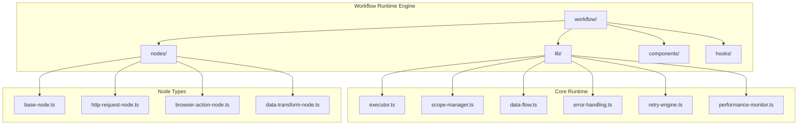
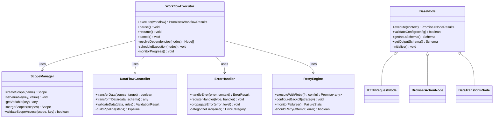
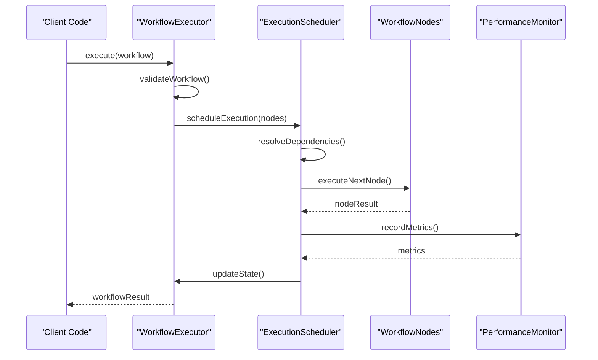
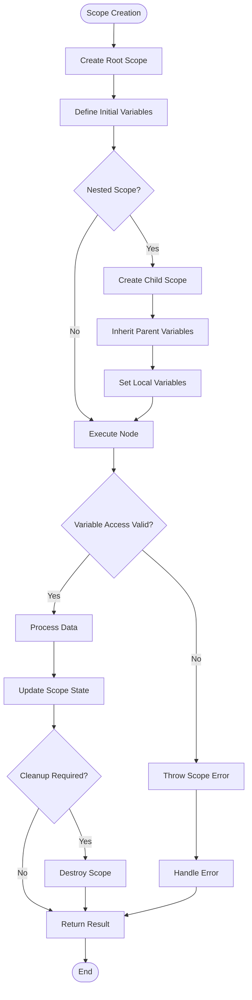
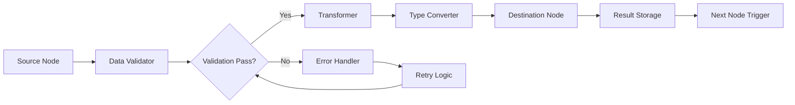
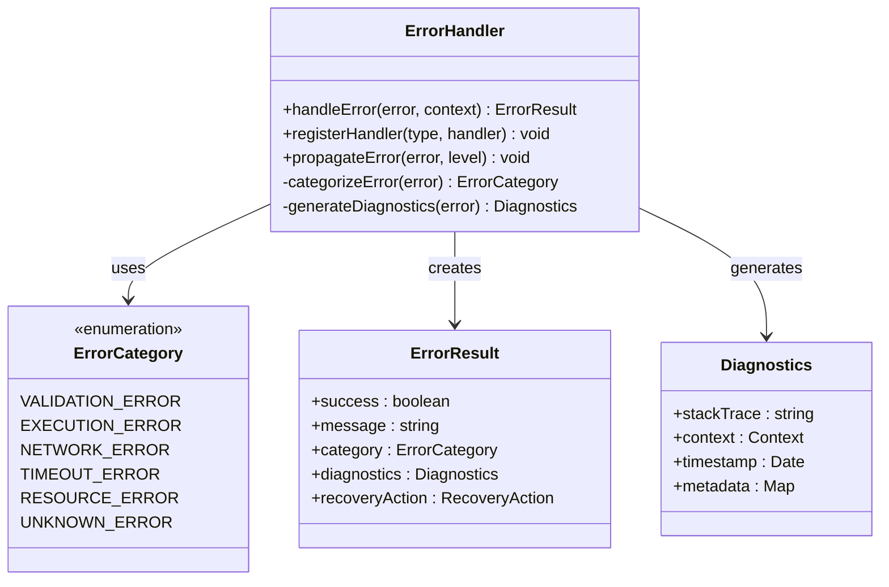
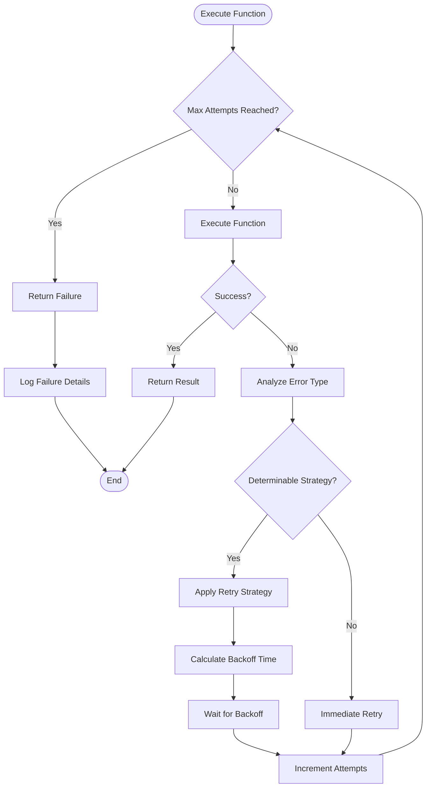
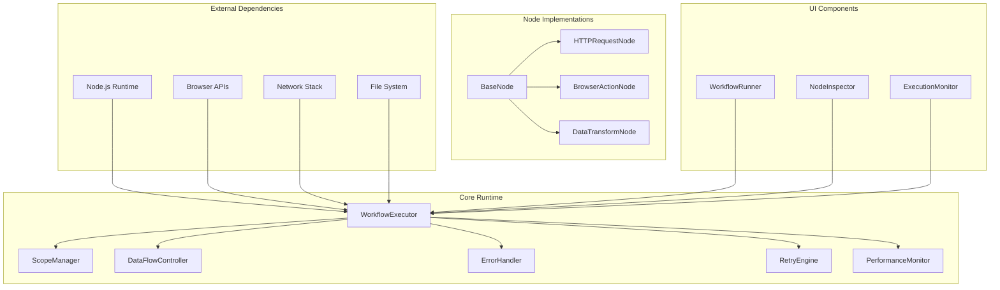

# Workflow Runtime Engine

<cite>
**Referenced Files in This Document**
- [workflow/index.tsx](file://src/pages/workflow/index.tsx)
- [workflow/types.ts](file://src/pages/workflow/types.ts)
- [workflow/node-type-registry.ts](file://src/pages/workflow/node-type-registry.ts)
- [workflow/templates.ts](file://src/pages/workflow/templates.ts)
- [workflow/constants.ts](file://src/pages/workflow/constants.ts)
- [workflow/lib/executor.ts](file://src/pages/workflow/lib/executor.ts)
- [workflow/lib/scope-manager.ts](file://src/pages/workflow/lib/scope-manager.ts)
- [workflow/lib/data-flow.ts](file://src/pages/workflow/lib/data-flow.ts)
- [workflow/lib/error-handling.ts](file://src/pages/workflow/lib/error-handling.ts)
- [workflow/lib/retry-engine.ts](file://src/pages/workflow/lib/retry-engine.ts)
- [workflow/lib/performance-monitor.ts](file://src/pages/workflow/lib/performance-monitor.ts)
- [workflow/nodes/base-node.ts](file://src/pages/workflow/nodes/base-node.ts)
- [workflow/nodes/http-request-node.ts](file://src/pages/workflow/nodes/http-request-node.ts)
- [workflow/nodes/browser-action-node.ts](file://src/pages/workflow/nodes/browser-action-node.ts)
- [workflow/nodes/data-transform-node.ts](file://src/pages/workflow/nodes/data-transform-node.ts)
- [workflow/hooks/use-workflow-execution.ts](file://src/pages/workflow/hooks/use-workflow-execution.ts)
- [workflow/components/workflow-runner.tsx](file://src/pages/workflow/components/workflow-runner.tsx)
- [workflow/components/node-inspector.tsx](file://src/pages/workflow/components/node-inspector.tsx)
</cite>

## Table of Contents
1. [Introduction](#introduction)
2. [Project Structure](#project-structure)
3. [Core Components](#core-components)
4. [Architecture Overview](#architecture-overview)
5. [Detailed Component Analysis](#detailed-component-analysis)
6. [Dependency Analysis](#dependency-analysis)
7. [Performance Considerations](#performance-considerations)
8. [Troubleshooting Guide](#troubleshooting-guide)
9. [Conclusion](#conclusion)

## Introduction
The Workflow Runtime Engine is the core system responsible for executing automated workflows composed of interconnected nodes. It manages the complete lifecycle of a workflow from initialization through execution to completion or failure, handling state transitions, data flow between nodes, error management, retry logic, and performance monitoring. The engine supports complex workflows with conditional branching, parallel execution, and sophisticated variable scoping mechanisms.

## Project Structure
The workflow runtime is organized into several key directories that separate concerns and maintain clean architecture:

**Diagram sources**
- [workflow/index.tsx:1-50](file://src/pages/workflow/index.tsx#L1-L50)
- [workflow/lib/executor.ts:1-100](file://src/pages/workflow/lib/executor.ts#L1-L100)
- [workflow/nodes/base-node.ts:1-80](file://src/pages/workflow/nodes/base-node.ts#L1-L80)

**Section sources**
- [workflow/index.tsx:1-100](file://src/pages/workflow/index.tsx#L1-L100)
- [workflow/types.ts:1-150](file://src/pages/workflow/types.ts#L1-L150)

## Core Components
The workflow runtime engine consists of several critical components that work together to execute workflows efficiently:

### Execution Engine
The execution engine orchestrates the entire workflow execution process, managing node scheduling, dependency resolution, and execution order. It handles both sequential and parallel execution patterns while maintaining proper state synchronization.

### Scope Manager
The scope manager provides variable scoping and data isolation between different workflow contexts. It supports nested scopes, inheritance, and controlled data sharing between nodes.

### Data Flow Controller
The data flow controller manages how data moves between connected nodes, handling type conversions, validation, and transformation pipelines.

### Error Handler
The error handler implements comprehensive error management strategies including try-catch blocks, error propagation, and recovery mechanisms.

### Retry Engine
The retry engine provides configurable retry logic with exponential backoff, circuit breaker patterns, and failure analysis capabilities.

**Section sources**
- [workflow/lib/executor.ts:1-200](file://src/pages/workflow/lib/executor.ts#L1-L200)
- [workflow/lib/scope-manager.ts:1-150](file://src/pages/workflow/lib/scope-manager.ts#L1-L150)
- [workflow/lib/data-flow.ts:1-120](file://src/pages/workflow/lib/data-flow.ts#L1-L120)

## Architecture Overview
The workflow runtime follows a modular architecture pattern with clear separation of concerns and well-defined interfaces between components.

**Diagram sources**
- [workflow/lib/executor.ts:1-300](file://src/pages/workflow/lib/executor.ts#L1-L300)
- [workflow/lib/scope-manager.ts:1-200](file://src/pages/workflow/lib/scope-manager.ts#L1-L200)
- [workflow/nodes/base-node.ts:1-150](file://src/pages/workflow/nodes/base-node.ts#L1-L150)

## Detailed Component Analysis

### Execution Engine Analysis
The execution engine serves as the central coordinator for workflow execution, managing the lifecycle and orchestration of all workflow components.

**Diagram sources**
- [workflow/lib/executor.ts:1-400](file://src/pages/workflow/lib/executor.ts#L1-L400)
- [workflow/hooks/use-workflow-execution.ts:1-200](file://src/pages/workflow/hooks/use-workflow-execution.ts#L1-L200)

**Section sources**
- [workflow/lib/executor.ts:1-500](file://src/pages/workflow/lib/executor.ts#L1-L500)
- [workflow/hooks/use-workflow-execution.ts:1-300](file://src/pages/workflow/hooks/use-workflow-execution.ts#L1-L300)

### Scope Management Analysis
The scope manager provides sophisticated variable scoping capabilities that enable data isolation and controlled sharing between workflow nodes.

**Diagram sources**
- [workflow/lib/scope-manager.ts:1-250](file://src/pages/workflow/lib/scope-manager.ts#L1-L250)

**Section sources**
- [workflow/lib/scope-manager.ts:1-300](file://src/pages/workflow/lib/scope-manager.ts#L1-L300)

### Data Flow Analysis
The data flow controller manages the movement and transformation of data between workflow nodes, ensuring type safety and data integrity.

**Diagram sources**
- [workflow/lib/data-flow.ts:1-200](file://src/pages/workflow/lib/data-flow.ts#L1-L200)

**Section sources**
- [workflow/lib/data-flow.ts:1-250](file://src/pages/workflow/lib/data-flow.ts#L1-L250)

### Error Handling Analysis
The error handling system provides comprehensive error management with categorization, recovery strategies, and detailed diagnostics.

**Diagram sources**
- [workflow/lib/error-handling.ts:1-200](file://src/pages/workflow/lib/error-handling.ts#L1-L200)

**Section sources**
- [workflow/lib/error-handling.ts:1-250](file://src/pages/workflow/lib/error-handling.ts#L1-L250)

### Retry Engine Analysis
The retry engine implements sophisticated retry logic with multiple strategies and failure analysis capabilities.

**Diagram sources**
- [workflow/lib/retry-engine.ts:1-250](file://src/pages/workflow/lib/retry-engine.ts#L1-L250)

**Section sources**
- [workflow/lib/retry-engine.ts:1-300](file://src/pages/workflow/lib/retry-engine.ts#L1-L300)

## Dependency Analysis
The workflow runtime engine maintains clear dependencies between components while minimizing coupling and maximizing modularity.

**Diagram sources**
- [workflow/index.tsx:1-100](file://src/pages/workflow/index.tsx#L1-L100)
- [workflow/lib/executor.ts:1-100](file://src/pages/workflow/lib/executor.ts#L1-L100)

**Section sources**
- [workflow/node-type-registry.ts:1-150](file://src/pages/workflow/node-type-registry.ts#L1-L150)
- [workflow/constants.ts:1-100](file://src/pages/workflow/constants.ts#L1-L100)

## Performance Considerations
The workflow runtime engine incorporates several performance optimization techniques to ensure efficient execution of long-running workflows:

### Memory Management
- **Object Pooling**: Reuse expensive objects like network connections and database connections
- **Garbage Collection Optimization**: Minimize memory leaks by properly cleaning up references
- **Lazy Loading**: Load node implementations only when needed
- **Memory Monitoring**: Track memory usage and trigger cleanup when thresholds are exceeded

### Execution Optimization
- **Parallel Execution**: Execute independent nodes concurrently where possible
- **Caching**: Cache frequently accessed data and computed results
- **Batch Processing**: Process multiple operations in batches to reduce overhead
- **Resource Limiting**: Implement rate limiting and resource quotas

### Monitoring and Profiling
- **Execution Metrics**: Track execution time, memory usage, and resource consumption
- **Bottleneck Detection**: Identify slow nodes and optimize hot paths
- **Performance Alerts**: Generate alerts when performance degrades beyond thresholds

**Section sources**
- [workflow/lib/performance-monitor.ts:1-200](file://src/pages/workflow/lib/performance-monitor.ts#L1-L200)

## Troubleshooting Guide
Common issues and their solutions when working with the workflow runtime engine:

### Execution Issues
- **Node Execution Failures**: Check node configuration and input data validation
- **Timeout Errors**: Increase timeout values or optimize slow operations
- **Memory Exhaustion**: Monitor memory usage and implement proper cleanup

### Data Flow Problems
- **Type Mismatches**: Ensure proper data type conversion between nodes
- **Missing Dependencies**: Verify all required variables are available in scope
- **Circular Dependencies**: Break circular references in workflow design

### Performance Issues
- **Slow Execution**: Profile individual nodes and optimize bottlenecks
- **High Memory Usage**: Implement proper cleanup and avoid large object retention
- **Resource Contention**: Reduce concurrent execution or increase resource limits

### Debugging Techniques
- **Execution Tracing**: Enable detailed logging for specific nodes or workflows
- **State Inspection**: Examine workflow state at different execution points
- **Performance Profiling**: Use built-in profiling tools to identify bottlenecks

**Section sources**
- [workflow/components/node-inspector.tsx:1-150](file://src/pages/workflow/components/node-inspector.tsx#L1-L150)
- [workflow/components/workflow-runner.tsx:1-200](file://src/pages/workflow/components/workflow-runner.tsx#L1-L200)

## Conclusion
The Workflow Runtime Engine provides a robust, scalable, and flexible platform for executing automated workflows. Its modular architecture, comprehensive error handling, sophisticated retry mechanisms, and performance optimization features make it suitable for a wide range of automation scenarios. The engine's design emphasizes maintainability, extensibility, and observability, enabling developers to build complex workflows while maintaining confidence in their reliability and performance.

Key strengths include its sophisticated scope management, comprehensive error handling with recovery strategies, advanced retry logic with multiple backoff strategies, and extensive monitoring and debugging capabilities. The engine successfully balances flexibility with control, allowing users to create powerful automated workflows while maintaining visibility into execution behavior and performance characteristics.