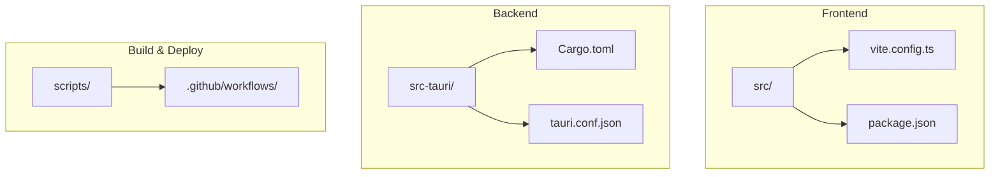
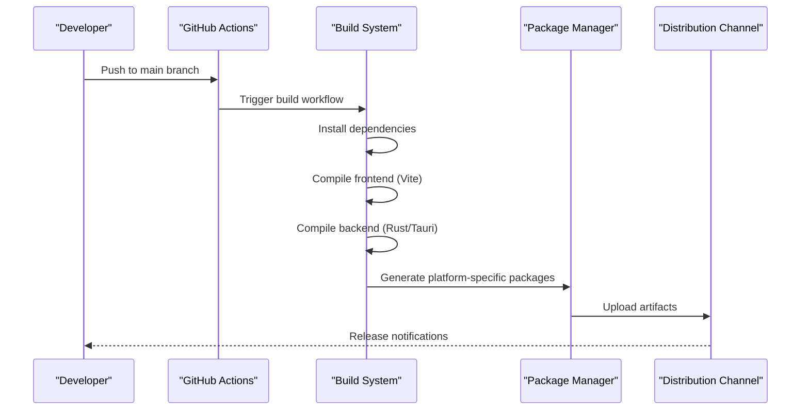
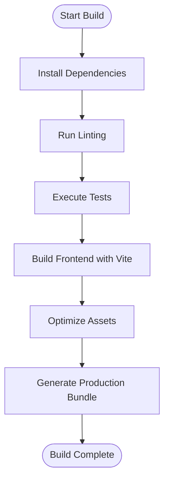
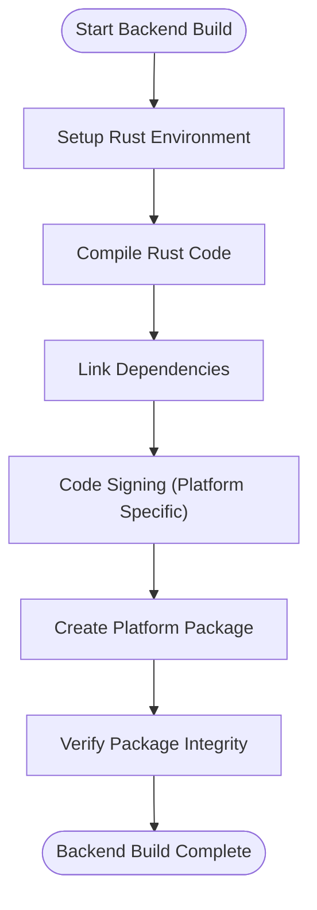
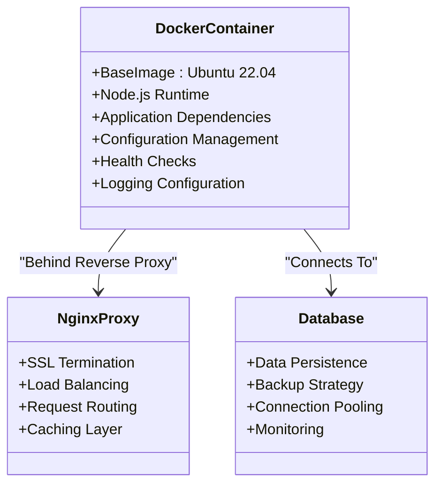
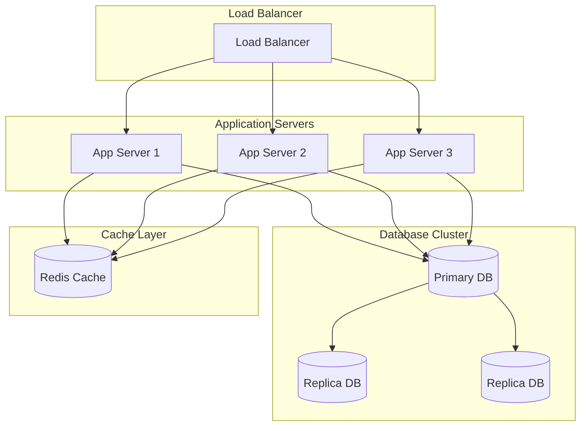

# Deployment & Distribution

<cite>
**Referenced Files in This Document**
- [package.json](file://package.json)
- [scripts/build.sh](file://scripts/build.sh)
- [scripts/deploy.sh](file://scripts/deploy.sh)
- [scripts/install.sh](file://scripts/install.sh)
- [.github/workflows/build.yml](file://.github/workflows/build.yml)
- [src-tauri/tauri.conf.json](file://src-tauri/tauri.conf.json)
- [src-tauri/Cargo.toml](file://src-tauri/Cargo.toml)
- [vite.config.ts](file://vite.config.ts)
- [scripts/setup-linux-deps.sh](file://scripts/setup-linux-deps.sh)
- [scripts/bump-version.sh](file://scripts/bump-version.sh)
</cite>

## Table of Contents
1. [Introduction](#introduction)
2. [Project Structure](#project-structure)
3. [Core Components](#core-components)
4. [Architecture Overview](#architecture-overview)
5. [Detailed Component Analysis](#detailed-component-analysis)
6. [Dependency Analysis](#dependency-analysis)
7. [Performance Considerations](#performance-considerations)
8. [Troubleshooting Guide](#troubleshooting-guide)
9. [Conclusion](#conclusion)
10. [Appendices](#appendices)

## Introduction
This document provides a comprehensive guide to deploying and distributing Apprecon across Windows, macOS, and Linux environments. It covers build processes, packaging options, distribution channels, enterprise deployment strategies, containerization with Docker, CI/CD integration, automated builds, signing procedures, update mechanisms, server-side deployment, load balancing, monitoring setup, security hardening, compliance requirements, maintenance procedures, troubleshooting, and performance optimization techniques.

## Project Structure
Apprecon is a Tauri-based desktop application with a React frontend built using Vite. The project includes:
- Frontend code in `src/` directory with React components and pages
- Backend Rust code in `src-tauri/` directory for native functionality
- Build and deployment scripts in `scripts/` directory
- GitHub Actions workflows in `.github/workflows/` for CI/CD
- Configuration files for both frontend and backend



**Diagram sources**
- [vite.config.ts](file://vite.config.ts)
- [package.json](file://package.json)
- [src-tauri/Cargo.toml](file://src-tauri/Cargo.toml)
- [src-tauri/tauri.conf.json](file://src-tauri/tauri.conf.json)

**Section sources**
- [package.json](file://package.json)
- [src-tauri/tauri.conf.json](file://src-tauri/tauri.conf.json)

## Core Components
The deployment system consists of several key components:

### Build System
- **Vite**: Frontend build tool configured for production optimizations
- **Tauri**: Desktop application framework combining web technologies with Rust
- **Rust/Cargo**: Backend compilation and dependency management

### Platform-Specific Packaging
- **Windows**: NSIS installer generation
- **macOS**: DMG package creation with code signing
- **Linux**: AppImage, DEB, and RPM package generation

### CI/CD Integration
- **GitHub Actions**: Automated build and release pipeline
- **Artifact Management**: Versioned binary distribution

**Section sources**
- [scripts/build.sh](file://scripts/build.sh)
- [.github/workflows/build.yml](file://.github/workflows/build.yml)

## Architecture Overview
The deployment architecture follows a multi-stage process from source code to distributed binaries:



**Diagram sources**
- [.github/workflows/build.yml](file://.github/workflows/build.yml)
- [scripts/build.sh](file://scripts/build.sh)

## Detailed Component Analysis

### Build Process Analysis
The build process involves multiple stages optimized for each target platform:

#### Frontend Build Pipeline


**Diagram sources**
- [vite.config.ts](file://vite.config.ts)
- [package.json](file://package.json)

#### Backend Build Pipeline


**Diagram sources**
- [src-tauri/Cargo.toml](file://src-tauri/Cargo.toml)
- [src-tauri/tauri.conf.json](file://src-tauri/tauri.conf.json)

### Platform-Specific Deployment

#### Windows Deployment
- **Installer Type**: NSIS installer with custom installation wizard
- **Signing**: Authenticode code signing required
- **Distribution**: Microsoft Store, direct download, or enterprise deployment via Group Policy

#### macOS Deployment
- **Package Type**: DMG with notarization
- **Signing**: Apple Developer ID signing and notarization
- **Distribution**: Mac App Store, direct download, or MDM solutions

#### Linux Deployment
- **Package Types**: AppImage, DEB, RPM
- **Dependencies**: Automatic dependency resolution
- **Distribution**: Package managers, direct download, or enterprise repositories

### Containerization Strategy
Apprecon can be containerized for server-side deployment scenarios:



**Diagram sources**
- [src-tauri/tauri.conf.json](file://src-tauri/tauri.conf.json)

### Enterprise Deployment Strategies

#### Multi-Tenant Architecture
- **Isolation**: Separate instances per tenant
- **Resource Allocation**: CPU and memory limits
- **Data Segregation**: Database schemas or separate databases

#### High Availability Setup


**Diagram sources**
- [src-tauri/tauri.conf.json](file://src-tauri/tauri.conf.json)

### Security Hardening
- **Code Signing**: All binaries must be signed with valid certificates
- **Transport Security**: HTTPS-only communication
- **Access Control**: Role-based permissions and API rate limiting
- **Data Encryption**: At-rest encryption for sensitive data
- **Audit Logging**: Comprehensive audit trails for compliance

### Monitoring and Observability
- **Application Metrics**: Performance counters and health endpoints
- **Log Aggregation**: Centralized logging with structured format
- **Alerting**: Threshold-based alerts for critical issues
- **Tracing**: Distributed tracing for request flow analysis

**Section sources**
- [scripts/deploy.sh](file://scripts/deploy.sh)
- [scripts/install.sh](file://scripts/install.sh)
- [src-tauri/tauri.conf.json](file://src-tauri/tauri.conf.json)

## Dependency Analysis
The deployment system has several critical dependencies that must be managed:

```mermaid
graph TD
subgraph "Build Dependencies"
NODE[Node.js >= 18.x]
RUST[Rust Toolchain]
TAURI[Tauri CLI]
PNPM[pnpm Package Manager]
end
subgraph "Runtime Dependencies"
OS[System Libraries]
WEBKIT[WebKitGTK (Linux)]
CHROME[Chrome/Firefox (Optional)]
DATABASE[SQLite/PostgreSQL]
end
subgraph "Security Dependencies"
CERT[Code Signing Certificates]
NOTARY[Apple Notarization]
SOPS[SOPS for Secrets]
end
NODE --> PNPM
RUST --> TAURI
TAURI --> OS
OS --> WEBKIT
OS --> CHROME
```

**Diagram sources**
- [src-tauri/Cargo.toml](file://src-tauri/Cargo.toml)
- [package.json](file://package.json)

**Section sources**
- [src-tauri/Cargo.toml](file://src-tauri/Cargo.toml)
- [package.json](file://package.json)

## Performance Considerations

### Build Optimization
- **Parallel Compilation**: Enable parallel builds for faster compilation times
- **Incremental Builds**: Leverage caching for faster rebuilds
- **Asset Optimization**: Minify and compress static assets
- **Bundle Splitting**: Code splitting for improved load times

### Runtime Performance
- **Memory Management**: Configure appropriate memory limits
- **Database Optimization**: Connection pooling and query optimization
- **Caching Strategy**: Implement appropriate caching layers
- **Resource Scaling**: Horizontal scaling for high-load scenarios

### Network Optimization
- **CDN Integration**: Serve static assets from CDN
- **Compression**: Enable gzip/brotli compression
- **Connection Pooling**: Reuse database connections
- **Load Balancing**: Distribute traffic across multiple instances

## Troubleshooting Guide

### Common Build Issues
- **Missing Dependencies**: Ensure all system dependencies are installed
- **Permission Errors**: Check file permissions and user privileges
- **Network Timeouts**: Configure proxy settings for corporate environments
- **Disk Space**: Monitor disk usage during large builds

### Runtime Issues
- **Certificate Problems**: Verify code signing certificates are valid
- **Port Conflicts**: Check for conflicting services on required ports
- **Memory Issues**: Monitor memory usage and adjust limits
- **Database Connectivity**: Verify connection strings and network access

### Performance Issues
- **Slow Startup**: Analyze startup time and optimize initialization
- **High Memory Usage**: Profile memory usage and identify leaks
- **CPU Spikes**: Monitor CPU usage and optimize hot paths
- **Network Latency**: Investigate network bottlenecks and optimize requests

**Section sources**
- [scripts/setup-linux-deps.sh](file://scripts/setup-linux-deps.sh)
- [scripts/bump-version.sh](file://scripts/bump-version.sh)

## Conclusion
Deploying Apprecon requires careful consideration of platform-specific requirements, security considerations, and scalability needs. The modular architecture supports various deployment scenarios from single-user installations to enterprise-scale deployments. By following the guidelines in this document, organizations can successfully deploy Apprecon while maintaining security, performance, and reliability standards.

## Appendices

### A. Quick Start Commands
```bash
# Install dependencies
pnpm install

# Build for development
pnpm dev

# Build for production
pnpm build

# Create platform-specific packages
pnpm tauri build
```

### B. Environment Variables
- `TAURI_PRIVATE_KEY`: Private key for code signing
- `APPLE_CERTIFICATE`: Apple certificate for macOS signing
- `DATABASE_URL`: Database connection string
- `LOG_LEVEL`: Logging verbosity level

### C. Health Check Endpoints
- `/health`: Basic health check
- `/ready`: Readiness probe
- `/metrics`: Prometheus metrics endpoint

### D. Compliance Checklist
- [ ] Code signing certificates validated
- [ ] Security scan completed
- [ ] Penetration testing performed
- [ ] Audit logging enabled
- [ ] Data encryption verified
- [ ] Backup procedures tested
- [ ] Disaster recovery plan documented