# Desktop Environment

<cite>
**Referenced Files in This Document**
- [index.tsx](file://src/layout/desktop-workspace/index.tsx)
- [desktop-window.tsx](file://src/layout/desktop-workspace/desktop-window.tsx)
- [components/index.tsx](file://src/layout/desktop-workspace/components/index.tsx)
- [hooks/use-desktop-layout.ts](file://src/layout/desktop-workspace/hooks/use-desktop-layout.ts)
- [hooks/use-drag-drop.ts](file://src/layout/desktop-workspace/hooks/use-drag-drop.ts)
- [constants.ts](file://src/layout/desktop-workspace/constants.ts)
- [page-lazy-imports.ts](file://src/layout/desktop-workspace/page-lazy-imports.ts)
- [clipboard-watcher.tsx](file://src/components/clipboard-watcher.tsx)
- [proxy-button.tsx](file://src/layout/proxy-button.tsx)
- [footer/index.tsx](file://src/layout/footer/index.tsx)
- [footer/proxy-status.tsx](file://src/layout/footer/proxy-status.tsx)
- [taskbar/index.tsx](file://src/layout/taskbar/index.tsx)
- [app-launcher.tsx](file://src/layout/taskbar/app-launcher.tsx)
- [global-search/index.tsx](file://src/layout/global-search/index.tsx)
- [stores/clipboard.ts](file://src/stores/clipboard.ts)
- [stores/collections.ts](file://src/stores/collections.ts)
- [stores/scratchpad.ts](file://src/stores/scratchpad.ts)
- [stores/vpn-store.ts](file://src/stores/vpn-store.ts)
- [commands/proxy.rs](file://src-tauri/src/commands/proxy.rs)
- [commands/vpn.rs](file://src-tauri/src/commands/vpn.rs)
- [tray.rs](file://src-tauri/src/tray.rs)
- [App.tsx](file://src/App.tsx)
- [main.tsx](file://src/main.tsx)
</cite>

## Table of Contents
1. [Introduction](#introduction)
2. [Project Structure](#project-structure)
3. [Core Components](#core-components)
4. [Architecture Overview](#architecture-overview)
5. [Detailed Component Analysis](#detailed-component-analysis)
6. [Dependency Analysis](#dependency-analysis)
7. [Performance Considerations](#performance-considerations)
8. [Troubleshooting Guide](#troubleshooting-guide)
9. [Conclusion](#conclusion)

## Introduction
This document explains Apprecon’s desktop environment: the layout, widget system, and customization options that let you organize your workspace for different workflows. It covers widgets such as proxy control, clipboard management, collections access, scratchpad integration, and VPN connectivity. It also documents window management, drag-and-drop behavior, keyboard shortcuts, performance tips, and troubleshooting steps.

## Project Structure
The desktop environment is implemented as a Tauri-based application with a React frontend. The desktop workspace is composed of:
- A root desktop container that hosts draggable, resizable windows (widgets).
- A taskbar for launching apps and quick actions.
- A global search overlay to navigate between features and widgets.
- Footer elements for status indicators like proxy state.
- Stores for shared state across widgets (clipboard, collections, scratchpad, VPN).
- Tauri commands for native operations (proxy, VPN, tray).

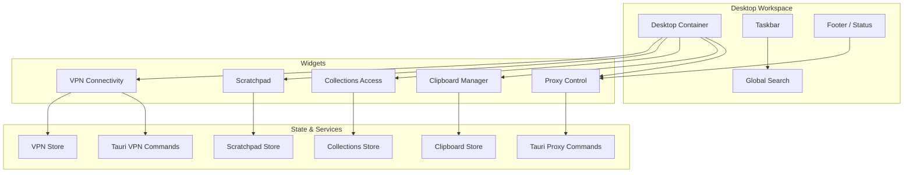

**Diagram sources**
- [index.tsx](file://src/layout/desktop-workspace/index.tsx)
- [desktop-window.tsx](file://src/layout/desktop-workspace/desktop-window.tsx)
- [taskbar/index.tsx](file://src/layout/taskbar/index.tsx)
- [global-search/index.tsx](file://src/layout/global-search/index.tsx)
- [footer/index.tsx](file://src/layout/footer/index.tsx)
- [stores/clipboard.ts](file://src/stores/clipboard.ts)
- [stores/collections.ts](file://src/stores/collections.ts)
- [stores/scratchpad.ts](file://src/stores/scratchpad.ts)
- [stores/vpn-store.ts](file://src/stores/vpn-store.ts)
- [commands/proxy.rs](file://src-tauri/src/commands/proxy.rs)
- [commands/vpn.rs](file://src-tauri/src/commands/vpn.rs)

**Section sources**
- [index.tsx](file://src/layout/desktop-workspace/index.tsx)
- [desktop-window.tsx](file://src/layout/desktop-workspace/desktop-window.tsx)
- [taskbar/index.tsx](file://src/layout/taskbar/index.tsx)
- [global-search/index.tsx](file://src/layout/global-search/index.tsx)
- [footer/index.tsx](file://src/layout/footer/index.tsx)

## Core Components
- Desktop Container: Hosts all widgets, manages layout persistence, and coordinates window lifecycle.
- Window System: Each widget is a draggable, resizable window with minimize/maximize/close controls.
- Taskbar: Launches applications and provides quick access to frequently used tools.
- Global Search: Command palette-style interface to open widgets or features by name.
- Footer: Displays contextual status (e.g., proxy active/inactive).
- Stores: Centralized state modules for clipboard, collections, scratchpad, and VPN.
- Tauri Commands: Native bridges for proxy and VPN control.

Key responsibilities:
- Layout persistence and restoration on app start.
- Drag-and-drop reordering and placement of widgets.
- Keyboard shortcuts for common actions.
- Cross-widget communication via stores.

**Section sources**
- [index.tsx](file://src/layout/desktop-workspace/index.tsx)
- [desktop-window.tsx](file://src/layout/desktop-workspace/desktop-window.tsx)
- [components/index.tsx](file://src/layout/desktop-workspace/components/index.tsx)
- [hooks/use-desktop-layout.ts](file://src/layout/desktop-workspace/hooks/use-desktop-layout.ts)
- [hooks/use-drag-drop.ts](file://src/layout/desktop-workspace/hooks/use-drag-drop.ts)
- [constants.ts](file://src/layout/desktop-workspace/constants.ts)

## Architecture Overview
The desktop environment follows a layered architecture:
- UI Layer: Widgets, taskbar, global search, footer.
- State Layer: Stores for cross-cutting concerns.
- Integration Layer: Tauri commands for OS-level functionality.
- Persistence: Layout and preferences saved locally.

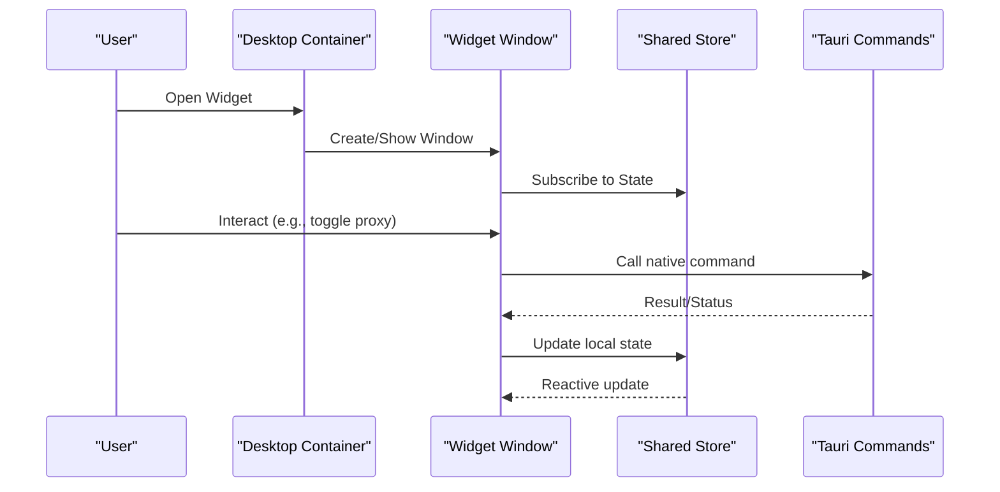

**Diagram sources**
- [index.tsx](file://src/layout/desktop-workspace/index.tsx)
- [desktop-window.tsx](file://src/layout/desktop-workspace/desktop-window.tsx)
- [stores/clipboard.ts](file://src/stores/clipboard.ts)
- [stores/collections.ts](file://src/stores/collections.ts)
- [stores/scratchpad.ts](file://src/stores/scratchpad.ts)
- [stores/vpn-store.ts](file://src/stores/vpn-store.ts)
- [commands/proxy.rs](file://src-tauri/src/commands/proxy.rs)
- [commands/vpn.rs](file://src-tauri/src/commands/vpn.rs)

## Detailed Component Analysis

### Desktop Container and Window Management
- The desktop container renders a grid-like area where widgets are placed.
- Each widget is wrapped in a window component supporting drag-to-move, resize handles, and minimize/maximize/close actions.
- Layout state includes position, size, z-index, and visibility; persisted across sessions.

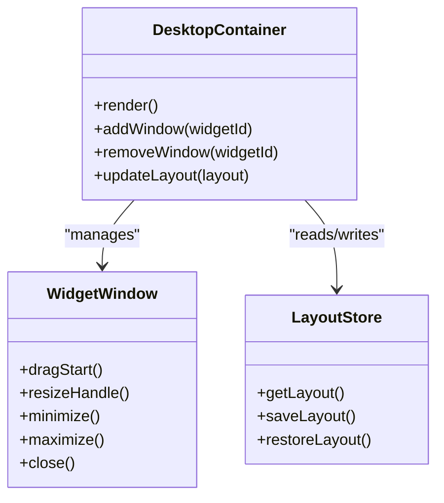

**Diagram sources**
- [index.tsx](file://src/layout/desktop-workspace/index.tsx)
- [desktop-window.tsx](file://src/layout/desktop-workspace/desktop-window.tsx)
- [hooks/use-desktop-layout.ts](file://src/layout/desktop-workspace/hooks/use-desktop-layout.ts)

**Section sources**
- [index.tsx](file://src/layout/desktop-workspace/index.tsx)
- [desktop-window.tsx](file://src/layout/desktop-workspace/desktop-window.tsx)
- [hooks/use-desktop-layout.ts](file://src/layout/desktop-workspace/hooks/use-desktop-layout.ts)

### Widget System and Drag-and-Drop
- Widgets are registered with unique IDs and metadata (title, icon, default size).
- Drag-and-drop allows moving widgets within the desktop and swapping positions.
- Drop zones snap to a grid for consistent alignment.

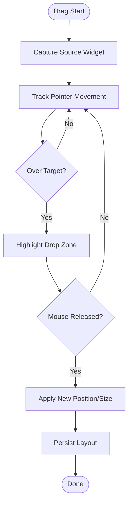

**Diagram sources**
- [hooks/use-drag-drop.ts](file://src/layout/desktop-workspace/hooks/use-drag-drop.ts)
- [constants.ts](file://src/layout/desktop-workspace/constants.ts)

**Section sources**
- [hooks/use-drag-drop.ts](file://src/layout/desktop-workspace/hooks/use-drag-drop.ts)
- [constants.ts](file://src/layout/desktop-workspace/constants.ts)

### Proxy Control Widget
- Provides start/stop/restart controls for the local proxy.
- Shows current status and port configuration.
- Integrates with Tauri proxy commands for native control.

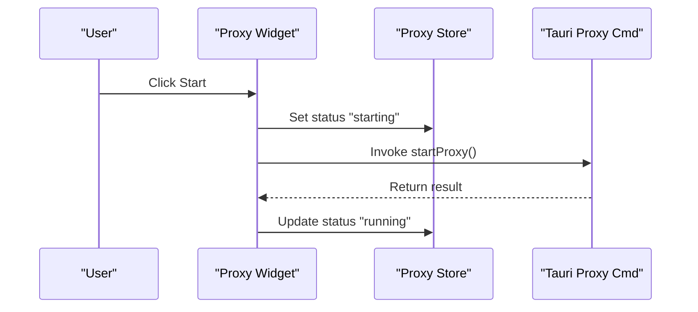

**Diagram sources**
- [proxy-button.tsx](file://src/layout/proxy-button.tsx)
- [footer/proxy-status.tsx](file://src/layout/footer/proxy-status.tsx)
- [commands/proxy.rs](file://src-tauri/src/commands/proxy.rs)

**Section sources**
- [proxy-button.tsx](file://src/layout/proxy-button.tsx)
- [footer/proxy-status.tsx](file://src/layout/footer/proxy-status.tsx)
- [commands/proxy.rs](file://src-tauri/src/commands/proxy.rs)

### Clipboard Management Widget
- Watches system clipboard changes and displays recent items.
- Supports copy/paste actions and history navigation.
- Uses a dedicated store to maintain clipboard history and selection.

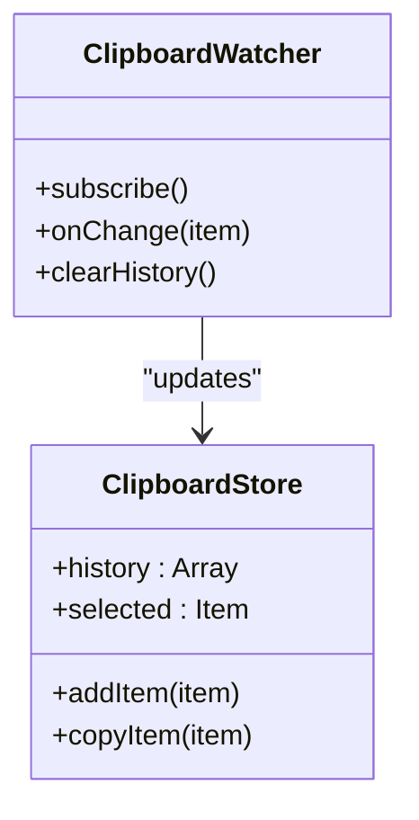

**Diagram sources**
- [clipboard-watcher.tsx](file://src/components/clipboard-watcher.tsx)
- [stores/clipboard.ts](file://src/stores/clipboard.ts)

**Section sources**
- [clipboard-watcher.tsx](file://src/components/clipboard-watcher.tsx)
- [stores/clipboard.ts](file://src/stores/clipboard.ts)

### Collections Access Widget
- Provides quick access to API collections.
- Allows searching, filtering, and sending requests directly from the widget.
- Syncs with the collections store for real-time updates.

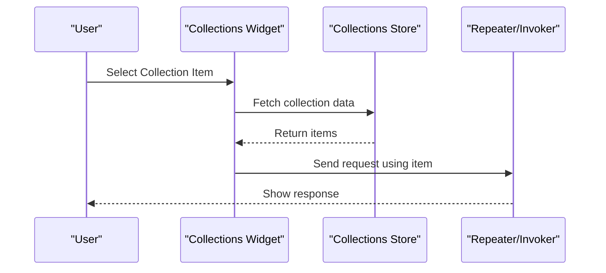

**Diagram sources**
- [stores/collections.ts](file://src/stores/collections.ts)

**Section sources**
- [stores/collections.ts](file://src/stores/collections.ts)

### Scratchpad Integration Widget
- Offers a lightweight text editor for notes and snippets.
- Auto-saves content to the scratchpad store.
- Supports markdown preview and syntax highlighting.

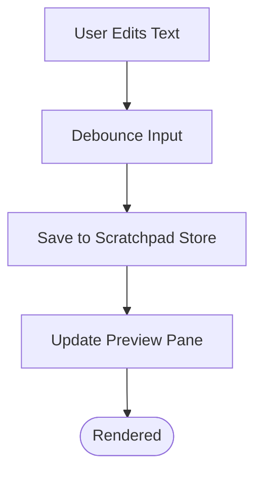

**Diagram sources**
- [stores/scratchpad.ts](file://src/stores/scratchpad.ts)

**Section sources**
- [stores/scratchpad.ts](file://src/stores/scratchpad.ts)

### VPN Connectivity Widget
- Controls VPN connection state and shows status.
- Invokes Tauri VPN commands to connect/disconnect.
- Updates UI reactively based on backend state.

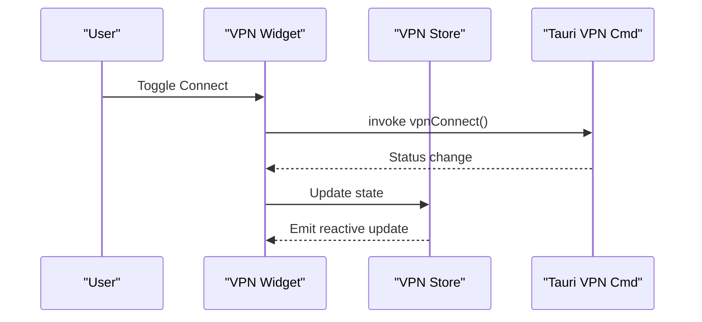

**Diagram sources**
- [stores/vpn-store.ts](file://src/stores/vpn-store.ts)
- [commands/vpn.rs](file://src-tauri/src/commands/vpn.rs)

**Section sources**
- [stores/vpn-store.ts](file://src/stores/vpn-store.ts)
- [commands/vpn.rs](file://src-tauri/src/commands/vpn.rs)

### Taskbar and Global Search
- Taskbar launches widgets and integrates with the app launcher.
- Global search opens widgets, pages, and runs commands via a command palette interface.

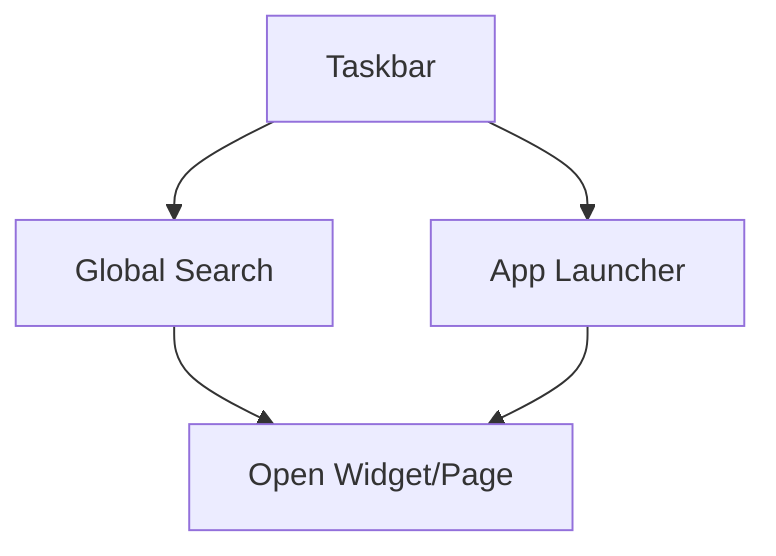

**Diagram sources**
- [taskbar/index.tsx](file://src/layout/taskbar/index.tsx)
- [app-launcher.tsx](file://src/layout/taskbar/app-launcher.tsx)
- [global-search/index.tsx](file://src/layout/global-search/index.tsx)

**Section sources**
- [taskbar/index.tsx](file://src/layout/taskbar/index.tsx)
- [app-launcher.tsx](file://src/layout/taskbar/app-launcher.tsx)
- [global-search/index.tsx](file://src/layout/global-search/index.tsx)

### Footer and Status Indicators
- Footer displays proxy status and other contextual information.
- Updates reactively when underlying services change state.

**Section sources**
- [footer/index.tsx](file://src/layout/footer/index.tsx)
- [footer/proxy-status.tsx](file://src/layout/footer/proxy-status.tsx)

## Dependency Analysis
The desktop environment depends on:
- React components for UI rendering.
- Stores for shared state.
- Tauri commands for native operations.
- Lazy-loaded page imports for performance.

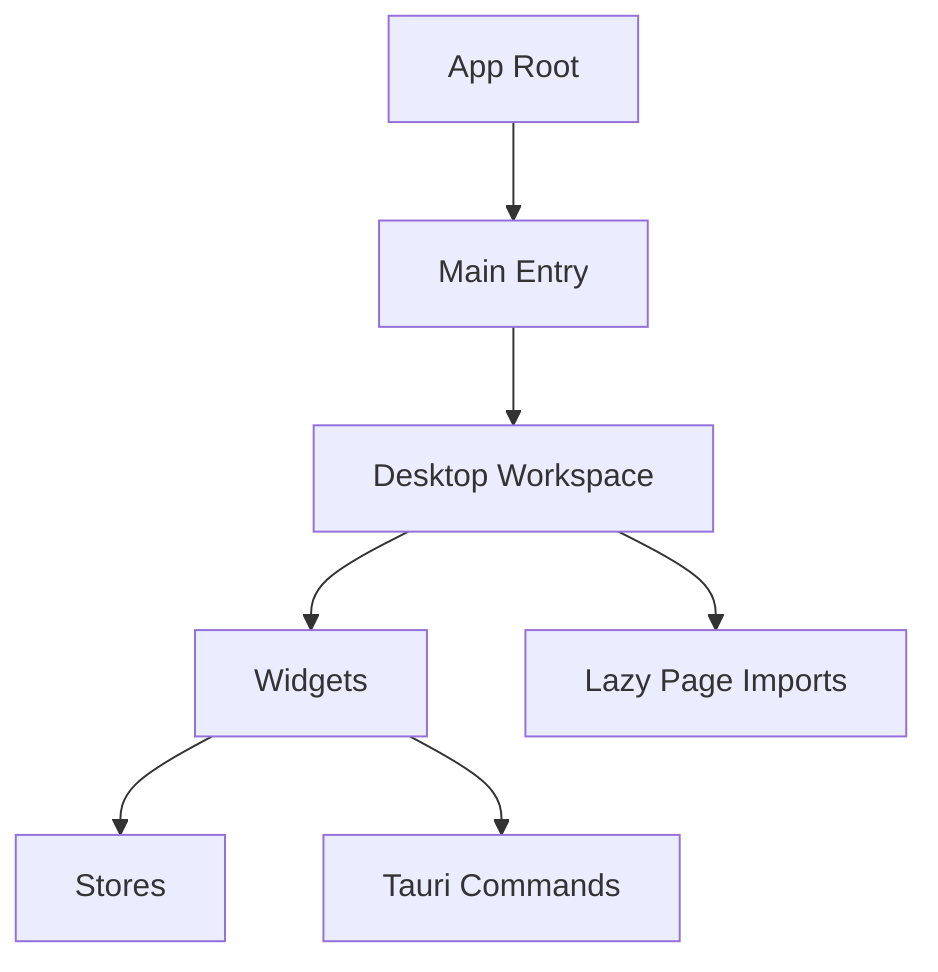

**Diagram sources**
- [App.tsx](file://src/App.tsx)
- [main.tsx](file://src/main.tsx)
- [index.tsx](file://src/layout/desktop-workspace/index.tsx)
- [page-lazy-imports.ts](file://src/layout/desktop-workspace/page-lazy-imports.ts)

**Section sources**
- [App.tsx](file://src/App.tsx)
- [main.tsx](file://src/main.tsx)
- [index.tsx](file://src/layout/desktop-workspace/index.tsx)
- [page-lazy-imports.ts](file://src/layout/desktop-workspace/page-lazy-imports.ts)

## Performance Considerations
- Use lazy loading for heavy pages and widgets to reduce initial load time.
- Debounce frequent input events (e.g., scratchpad typing) to avoid excessive writes.
- Keep widget state minimal and rely on stores for shared data to prevent redundant re-renders.
- Avoid blocking the main thread with long-running tasks; offload to Tauri commands where possible.
- Monitor memory usage for clipboard history and large collections; implement pagination or limits.

[No sources needed since this section provides general guidance]

## Troubleshooting Guide
Common issues and resolutions:
- Proxy not starting: Check Tauri proxy command logs and ensure no port conflicts. Verify permissions if required.
- VPN disconnects unexpectedly: Confirm network adapter permissions and firewall settings. Reconnect via the VPN widget.
- Clipboard history not updating: Ensure clipboard watcher is subscribed and has necessary permissions. Clear history if corrupted.
- Widgets not saving layout: Validate local storage permissions and file write access. Reset layout to defaults if needed.
- Global search not opening widgets: Confirm widget registration and IDs match expected values.

**Section sources**
- [commands/proxy.rs](file://src-tauri/src/commands/proxy.rs)
- [commands/vpn.rs](file://src-tauri/src/commands/vpn.rs)
- [tray.rs](file://src-tauri/src/tray.rs)
- [stores/clipboard.ts](file://src/stores/clipboard.ts)

## Conclusion
Apprecon’s desktop environment provides a flexible, widget-driven workspace tailored for productivity. With robust window management, drag-and-drop customization, and integrated tools like proxy control, clipboard management, collections access, scratchpad, and VPN connectivity, users can tailor their workflow efficiently. By following the performance tips and troubleshooting steps outlined here, you can maintain a smooth and responsive experience.