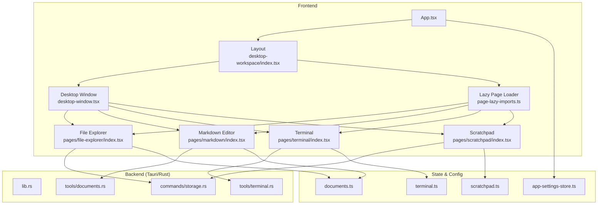
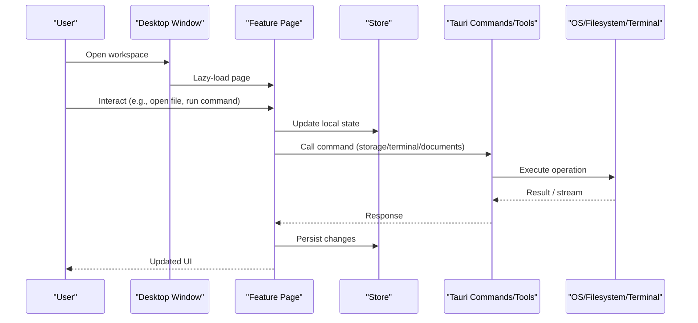
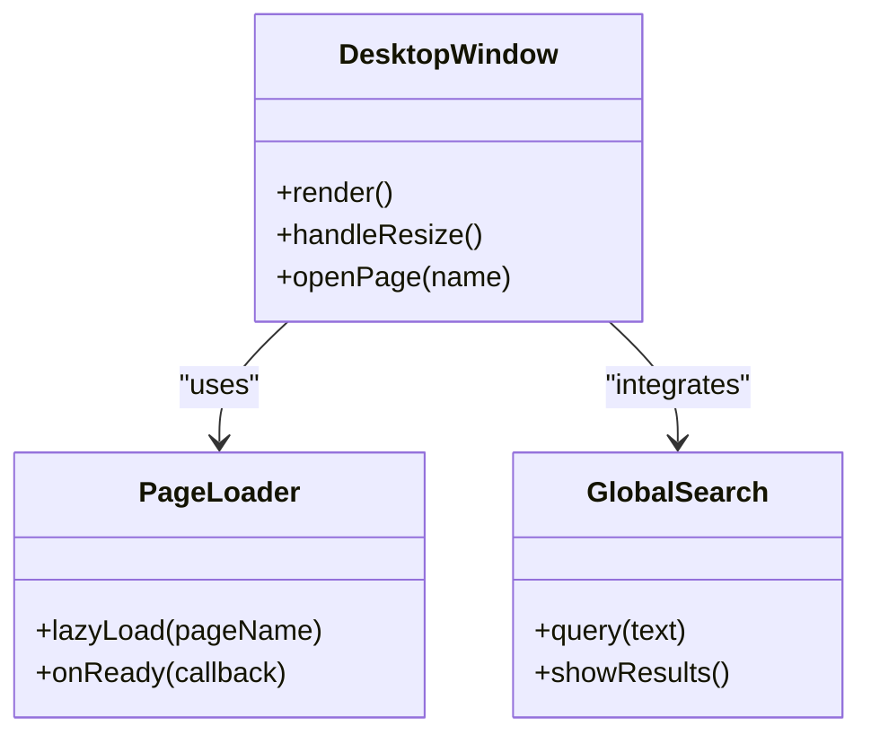
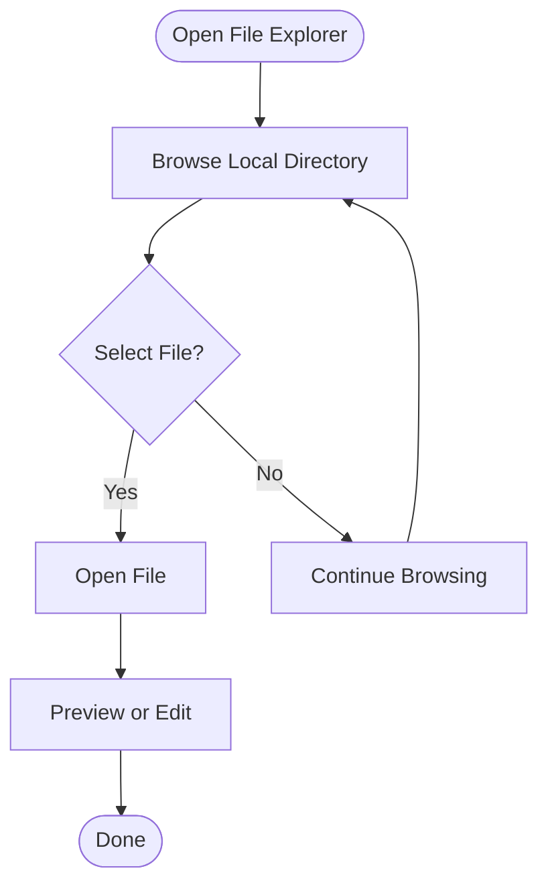
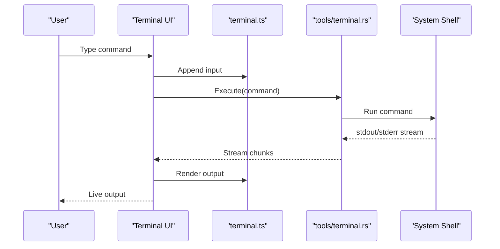
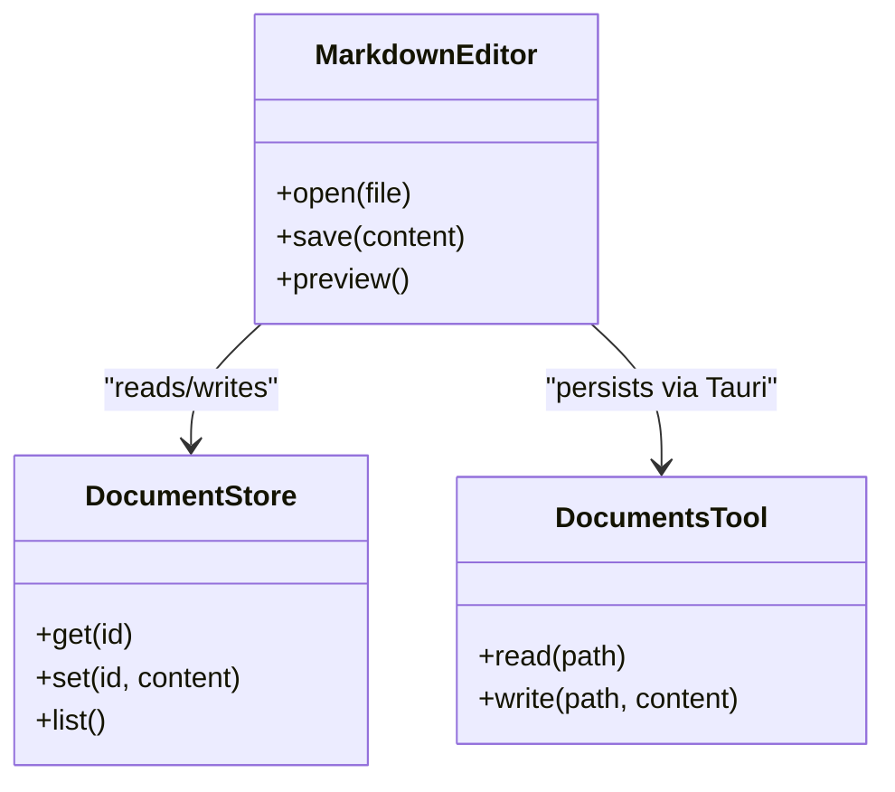
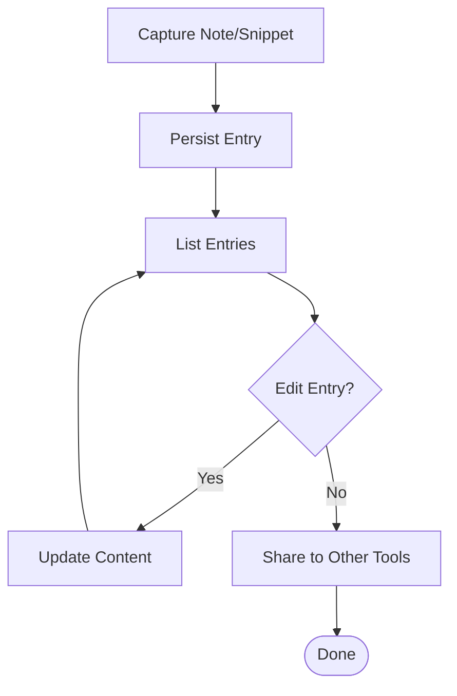
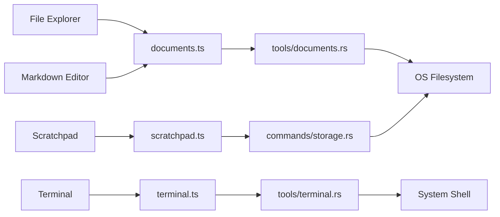

# Development Workspace

<cite>
**Referenced Files in This Document**
- [App.tsx](file://src/App.tsx)
- [main.tsx](file://src/main.tsx)
- [desktop-workspace/index.tsx](file://src/layout/desktop-workspace/index.tsx)
- [desktop-window.tsx](file://src/layout/desktop-workspace/desktop-window.tsx)
- [page-lazy-imports.ts](file://src/layout/desktop-workspace/page-lazy-imports.ts)
- [constants.ts](file://src/layout/constants.ts)
- [index.tsx](file://src/pages/file-explorer/index.tsx)
- [types.ts](file://src/pages/file-explorer/types.ts)
- [api.ts](file://src/pages/markdown/api.ts)
- [index.tsx](file://src/pages/markdown/index.tsx)
- [index.tsx](file://src/pages/terminal/index.tsx)
- [index.tsx](file://src/pages/scratchpad/index.tsx)
- [app-settings-store.ts](file://src/stores/app-settings-store.ts)
- [documents.ts](file://src/stores/documents.ts)
- [terminal.ts](file://src/stores/terminal.ts)
- [scratchpad.ts](file://src/stores/scratchpad.ts)
- [lib.rs](file://src-tauri/src/lib.rs)
- [commands/storage.rs](file://src-tauri/src/commands/storage.rs)
- [tools/terminal.rs](file://src-tauri/src/tools/terminal.rs)
- [tools/documents.rs](file://src-tauri/src/tools/documents.rs)
- [tauri.conf.json](file://src-tauri/tauri.conf.json)
- [package.json](file://package.json)
</cite>

## Table of Contents
1. [Introduction](#introduction)
2. [Project Structure](#project-structure)
3. [Core Components](#core-components)
4. [Architecture Overview](#architecture-overview)
5. [Detailed Component Analysis](#detailed-component-analysis)
6. [Dependency Analysis](#dependency-analysis)
7. [Performance Considerations](#performance-considerations)
8. [Troubleshooting Guide](#troubleshooting-guide)
9. [Conclusion](#conclusion)
10. [Appendices](#appendices)

## Introduction
This document explains Apprecon’s integrated development workspace: the desktop environment, file explorer with cloud storage support, terminal integration, markdown document editor, and scratchpad for quick notes and code snippets. It shows how these tools fit into a security testing workflow, provides examples for organizing projects and collaborating, and covers customization, keyboard shortcuts, and productivity tips to streamline your work.

## Project Structure
The workspace is built as a Tauri desktop application. The frontend (React + TypeScript) renders the UI and orchestrates interactions, while the backend (Rust via Tauri) exposes system-level capabilities such as file operations, terminal execution, and persistent storage. Pages are organized by feature under src/pages, and shared layout and state live under src/layout and src/stores.

**Diagram sources**
- [App.tsx](file://src/App.tsx)
- [desktop-workspace/index.tsx](file://src/layout/desktop-workspace/index.tsx)
- [desktop-window.tsx](file://src/layout/desktop-workspace/desktop-window.tsx)
- [page-lazy-imports.ts](file://src/layout/desktop-workspace/page-lazy-imports.ts)
- [index.tsx](file://src/pages/file-explorer/index.tsx)
- [index.tsx](file://src/pages/markdown/index.tsx)
- [index.tsx](file://src/pages/terminal/index.tsx)
- [index.tsx](file://src/pages/scratchpad/index.tsx)
- [app-settings-store.ts](file://src/stores/app-settings-store.ts)
- [documents.ts](file://src/stores/documents.ts)
- [terminal.ts](file://src/stores/terminal.ts)
- [scratchpad.ts](file://src/stores/scratchpad.ts)
- [lib.rs](file://src-tauri/src/lib.rs)
- [commands/storage.rs](file://src-tauri/src/commands/storage.rs)
- [tools/terminal.rs](file://src-tauri/src/tools/terminal.rs)
- [tools/documents.rs](file://src-tauri/src/tools/documents.rs)

**Section sources**
- [package.json](file://package.json)
- [tauri.conf.json](file://src-tauri/tauri.conf.json)

## Core Components
- Desktop Environment: Provides the main window, taskbar, global search, and page routing. It lazy-loads feature pages to keep startup fast.
- File Explorer: Navigates local directories and integrates with cloud storage through Tauri commands. Supports common file operations and previews.
- Terminal Integration: Executes shell commands within a sandboxed process, streams output back to the UI, and supports interactive workflows.
- Markdown Editor: Creates, edits, and previews markdown documents; persists content via the document store and backend tools.
- Scratchpad: Quick-capture area for notes and code snippets with local persistence and easy sharing to other workspace tools.

These components share a consistent UI language, keyboard shortcuts, and state stores, enabling seamless transitions between tasks during security assessments.

**Section sources**
- [desktop-workspace/index.tsx](file://src/layout/desktop-workspace/index.tsx)
- [desktop-window.tsx](file://src/layout/desktop-workspace/desktop-window.tsx)
- [page-lazy-imports.ts](file://src/layout/desktop-workspace/page-lazy-imports.ts)
- [index.tsx](file://src/pages/file-explorer/index.tsx)
- [index.tsx](file://src/pages/markdown/index.tsx)
- [index.tsx](file://src/pages/terminal/index.tsx)
- [index.tsx](file://src/pages/scratchpad/index.tsx)

## Architecture Overview
The workspace follows a layered architecture:
- UI Layer: React components render pages and panels.
- State Layer: Stores manage settings, documents, terminal sessions, and scratchpad entries.
- Backend Layer: Tauri commands and tools expose OS-level functionality securely.

**Diagram sources**
- [desktop-window.tsx](file://src/layout/desktop-workspace/desktop-window.tsx)
- [page-lazy-imports.ts](file://src/layout/desktop-workspace/page-lazy-imports.ts)
- [index.tsx](file://src/pages/file-explorer/index.tsx)
- [index.tsx](file://src/pages/terminal/index.tsx)
- [index.tsx](file://src/pages/markdown/index.tsx)
- [index.tsx](file://src/pages/scratchpad/index.tsx)
- [lib.rs](file://src-tauri/src/lib.rs)
- [commands/storage.rs](file://src-tauri/src/commands/storage.rs)
- [tools/terminal.rs](file://src-tauri/src/tools/terminal.rs)
- [tools/documents.rs](file://src-tauri/src/tools/documents.rs)

## Detailed Component Analysis

### Desktop Environment
The desktop environment hosts the main window, navigation, and global utilities like search and launcher. It lazily loads feature pages to optimize performance and memory usage.

Key responsibilities:
- Manage window lifecycle and layout
- Route to feature pages on demand
- Provide global actions (search, launcher, status)

**Diagram sources**
- [desktop-window.tsx](file://src/layout/desktop-workspace/desktop-window.tsx)
- [page-lazy-imports.ts](file://src/layout/desktop-workspace/page-lazy-imports.ts)

**Section sources**
- [desktop-workspace/index.tsx](file://src/layout/desktop-workspace/index.tsx)
- [desktop-window.tsx](file://src/layout/desktop-workspace/desktop-window.tsx)
- [page-lazy-imports.ts](file://src/layout/desktop-workspace/page-lazy-imports.ts)

### File Explorer with Cloud Storage Support
The file explorer navigates local directories and integrates with cloud storage through Tauri commands. It supports browsing, opening files, and basic operations.

Workflow highlights:
- Navigate folders and select files
- Open files in appropriate editors or previewers
- Use cloud storage endpoints via commands for remote access

**Diagram sources**
- [index.tsx](file://src/pages/file-explorer/index.tsx)
- [types.ts](file://src/pages/file-explorer/types.ts)
- [commands/storage.rs](file://src-tauri/src/commands/storage.rs)

**Section sources**
- [index.tsx](file://src/pages/file-explorer/index.tsx)
- [types.ts](file://src/pages/file-explorer/types.ts)
- [commands/storage.rs](file://src-tauri/src/commands/storage.rs)

### Terminal Integration
The terminal component executes commands via Tauri tools, streaming output back to the UI. It supports interactive shells and can be used for automation and scripting during security tests.

**Diagram sources**
- [index.tsx](file://src/pages/terminal/index.tsx)
- [terminal.ts](file://src/stores/terminal.ts)
- [tools/terminal.rs](file://src-tauri/src/tools/terminal.rs)

**Section sources**
- [index.tsx](file://src/pages/terminal/index.tsx)
- [terminal.ts](file://src/stores/terminal.ts)
- [tools/terminal.rs](file://src-tauri/src/tools/terminal.rs)

### Markdown Document Editor
The markdown editor allows creating, editing, and previewing documentation. It persists content using the document store and backend tools.

**Diagram sources**
- [index.tsx](file://src/pages/markdown/index.tsx)
- [api.ts](file://src/pages/markdown/api.ts)
- [documents.ts](file://src/stores/documents.ts)
- [tools/documents.rs](file://src-tauri/src/tools/documents.rs)

**Section sources**
- [index.tsx](file://src/pages/markdown/index.tsx)
- [api.ts](file://src/pages/markdown/api.ts)
- [documents.ts](file://src/stores/documents.ts)
- [tools/documents.rs](file://src-tauri/src/tools/documents.rs)

### Scratchpad for Quick Notes and Code Snippets
The scratchpad provides a lightweight space for capturing ideas, commands, and snippets. Entries are persisted locally and can be referenced across the workspace.

**Diagram sources**
- [index.tsx](file://src/pages/scratchpad/index.tsx)
- [scratchpad.ts](file://src/stores/scratchpad.ts)
- [commands/storage.rs](file://src-tauri/src/commands/storage.rs)

**Section sources**
- [index.tsx](file://src/pages/scratchpad/index.tsx)
- [scratchpad.ts](file://src/stores/scratchpad.ts)
- [commands/storage.rs](file://src-tauri/src/commands/storage.rs)

## Dependency Analysis
The workspace layers interact through well-defined boundaries:
- Frontend pages depend on stores for state management.
- Pages call Tauri commands/tools for system operations.
- Rust backend encapsulates OS interactions and returns results to the UI.

**Diagram sources**
- [index.tsx](file://src/pages/file-explorer/index.tsx)
- [index.tsx](file://src/pages/terminal/index.tsx)
- [index.tsx](file://src/pages/markdown/index.tsx)
- [index.tsx](file://src/pages/scratchpad/index.tsx)
- [documents.ts](file://src/stores/documents.ts)
- [terminal.ts](file://src/stores/terminal.ts)
- [scratchpad.ts](file://src/stores/scratchpad.ts)
- [tools/documents.rs](file://src-tauri/src/tools/documents.rs)
- [tools/terminal.rs](file://src-tauri/src/tools/terminal.rs)
- [commands/storage.rs](file://src-tauri/src/commands/storage.rs)

**Section sources**
- [lib.rs](file://src-tauri/src/lib.rs)
- [commands/storage.rs](file://src-tauri/src/commands/storage.rs)
- [tools/terminal.rs](file://src-tauri/src/tools/terminal.rs)
- [tools/documents.rs](file://src-tauri/src/tools/documents.rs)

## Performance Considerations
- Lazy loading of pages reduces initial load time and memory footprint.
- Streaming terminal output avoids blocking the UI thread.
- Persistent stores minimize redundant I/O by caching state in memory.
- Prefer batch operations where possible (e.g., saving multiple documents).

[No sources needed since this section provides general guidance]

## Troubleshooting Guide
Common issues and resolutions:
- Terminal not executing commands: Ensure Tauri permissions allow shell execution and that the selected shell exists on the system.
- File operations failing: Verify read/write permissions for target directories and check cloud storage credentials if applicable.
- Markdown save errors: Confirm file paths are valid and the document store has write access.
- Scratchpad entries missing: Check local persistence configuration and ensure the app has storage permissions.

**Section sources**
- [commands/storage.rs](file://src-tauri/src/commands/storage.rs)
- [tools/terminal.rs](file://src-tauri/src/tools/terminal.rs)
- [tools/documents.rs](file://src-tauri/src/tools/documents.rs)

## Conclusion
Apprecon’s development workspace unifies file management, terminal execution, documentation editing, and quick capture into a cohesive environment tailored for security testing. By leveraging lazy loading, robust state management, and secure backend integrations, it delivers a responsive and powerful experience for both individual contributors and teams.

[No sources needed since this section summarizes without analyzing specific files]

## Appendices

### Organizing Projects and Managing Files
- Create a project root directory and use the file explorer to navigate and organize assets, payloads, and reports.
- Use the markdown editor to maintain README, test plans, and findings documentation.
- Leverage the scratchpad to collect commands, URLs, and snippets during investigations.

**Section sources**
- [index.tsx](file://src/pages/file-explorer/index.tsx)
- [index.tsx](file://src/pages/markdown/index.tsx)
- [index.tsx](file://src/pages/scratchpad/index.tsx)

### Collaboration Tips
- Share markdown documents via version control or cloud storage synced through the file explorer.
- Export terminal sessions or logs for team review.
- Use consistent naming conventions for payloads and reports to improve discoverability.

**Section sources**
- [commands/storage.rs](file://src-tauri/src/commands/storage.rs)
- [tools/documents.rs](file://src-tauri/src/tools/documents.rs)

### Customization Options
- Adjust theme and layout preferences via the settings store.
- Configure default shell and working directories for the terminal.
- Customize markdown preview behavior and document templates.

**Section sources**
- [app-settings-store.ts](file://src/stores/app-settings-store.ts)
- [tauri.conf.json](file://src-tauri/tauri.conf.json)

### Keyboard Shortcuts and Productivity Tips
- Use global search to quickly open pages, files, and commands.
- Pin frequently used terminals and scratchpad entries for instant access.
- Employ multi-tab workflows to switch between explorers, editors, and terminals efficiently.

**Section sources**
- [desktop-workspace/index.tsx](file://src/layout/desktop-workspace/index.tsx)
- [page-lazy-imports.ts](file://src/layout/desktop-workspace/page-lazy-imports.ts)