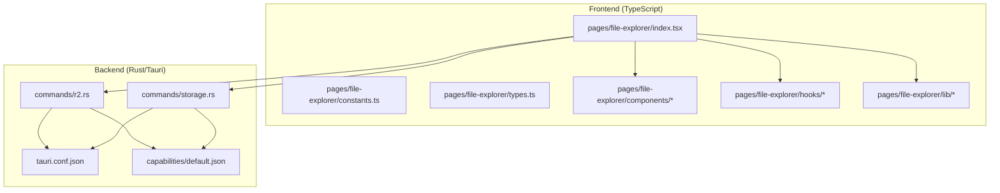
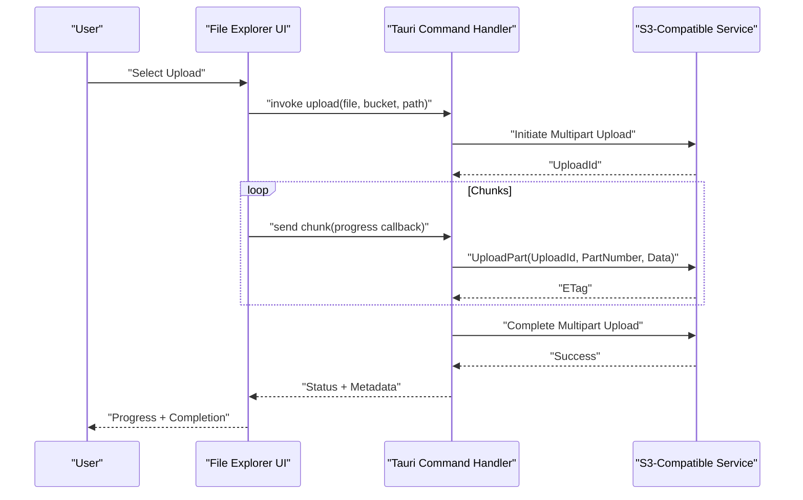
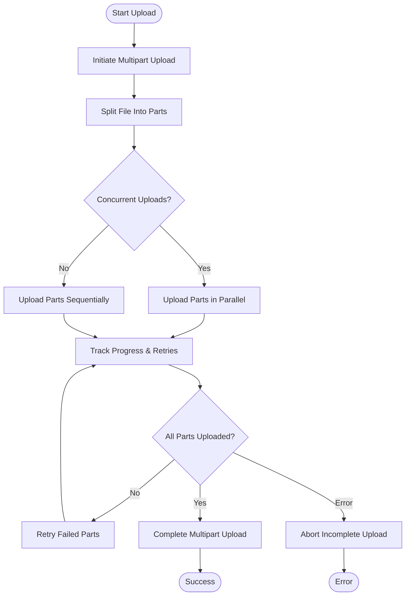
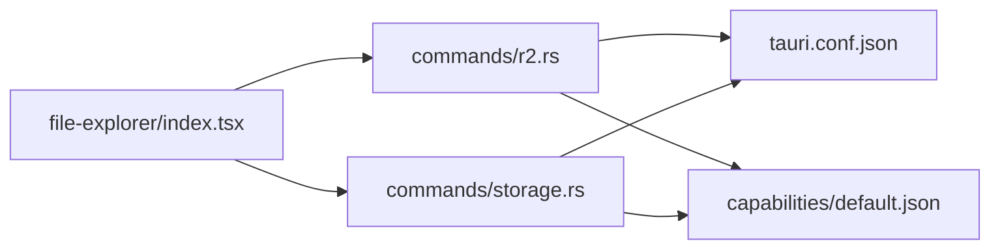

# Cloud Storage Integration

<cite>
**Referenced Files in This Document**
- [file-explorer index.tsx](file://src/pages/file-explorer/index.tsx)
- [file-explorer constants.ts](file://src/pages/file-explorer/constants.ts)
- [file-explorer types.ts](file://src/pages/file-explorer/types.ts)
- [file-explorer components directory](file://src/pages/file-explorer/components)
- [file-explorer hooks directory](file://src/pages/file-explorer/hooks)
- [file-explorer lib directory](file://src/pages/file-explorer/lib)
- [R2 command handler](file://src-tauri/src/commands/r2.rs)
- [Storage command handler](file://src-tauri/src/commands/storage.rs)
- [Tauri configuration](file://src-tauri/tauri.conf.json)
- [Capabilities default](file://src-tauri/capabilities/default.json)
</cite>

## Table of Contents
1. [Introduction](#introduction)
2. [Project Structure](#project-structure)
3. [Core Components](#core-components)
4. [Architecture Overview](#architecture-overview)
5. [Detailed Component Analysis](#detailed-component-analysis)
6. [Dependency Analysis](#dependency-analysis)
7. [Performance Considerations](#performance-considerations)
8. [Troubleshooting Guide](#troubleshooting-guide)
9. [Conclusion](#conclusion)
10. [Appendices](#appendices)

## Introduction
This document explains how Apprecon’s file explorer integrates with cloud storage, focusing on S3-compatible services (including Amazon S3 and compatible providers). It covers bucket configuration, authentication methods (access keys and IAM roles), connection setup, multipart uploads for large files, progress tracking, error handling, synchronization strategies, conflict resolution, offline considerations, security best practices, encryption options, and monitoring upload/download activities.

Where the repository provides concrete implementation details, they are referenced directly. Where features are conceptual or not present in the current codebase, this guide outlines recommended approaches to implement them safely and effectively.

## Project Structure
Apprecon is a Tauri-based application with a TypeScript frontend and Rust backend. The file explorer lives under the pages directory and delegates heavy operations to Tauri commands implemented in Rust. Cloud storage integration points are exposed via dedicated command handlers that can be extended to support S3-compatible backends.

**Diagram sources**
- [file-explorer index.tsx](file://src/pages/file-explorer/index.tsx)
- [file-explorer constants.ts](file://src/pages/file-explorer/constants.ts)
- [file-explorer types.ts](file://src/pages/file-explorer/types.ts)
- [R2 command handler](file://src-tauri/src/commands/r2.rs)
- [Storage command handler](file://src-tauri/src/commands/storage.rs)
- [Tauri configuration](file://src-tauri/tauri.conf.json)
- [Capabilities default](file://src-tauri/capabilities/default.json)

**Section sources**
- [file-explorer index.tsx](file://src/pages/file-explorer/index.tsx)
- [R2 command handler](file://src-tauri/src/commands/r2.rs)
- [Storage command handler](file://src-tauri/src/commands/storage.rs)
- [Tauri configuration](file://src-tauri/tauri.conf.json)
- [Capabilities default](file://src-tauri/capabilities/default.json)

## Core Components
- File Explorer UI: Renders directories, lists objects, and exposes actions such as upload, download, delete, and sync.
- Command Handlers: Expose Tauri commands for storage operations. The R2 command handler indicates existing object storage capabilities that can be adapted for S3-compatible endpoints.
- Configuration and Permissions: Tauri configuration and capabilities define what network and filesystem operations are allowed.

Key responsibilities:
- Frontend orchestrates user interactions and displays progress/status.
- Backend performs secure I/O and network calls, enforcing least privilege via capabilities.

**Section sources**
- [file-explorer index.tsx](file://src/pages/file-explorer/index.tsx)
- [R2 command handler](file://src-tauri/src/commands/r2.rs)
- [Storage command handler](file://src-tauri/src/commands/storage.rs)
- [Tauri configuration](file://src-tauri/tauri.conf.json)
- [Capabilities default](file://src-tauri/capabilities/default.json)

## Architecture Overview
The file explorer communicates with the backend through Tauri commands. For S3-compatible storage, the backend should implement authenticated requests to the S3 API, handle multipart uploads, and stream data efficiently.

[No diagram sources needed since this diagram shows conceptual workflow, not actual code structure]

## Detailed Component Analysis

### S3 Bucket Configuration and Connection Setup
- Endpoint and Region: Configure the S3-compatible endpoint URL and region per environment. Use environment variables or secure settings storage.
- Bucket Naming and Prefixes: Adopt consistent naming conventions and use prefixes to isolate team/project resources.
- Network Access: Ensure outbound HTTPS access from the app process; verify firewall rules and proxy settings if applicable.

Implementation guidance:
- Centralize configuration in a single module and validate required fields before connecting.
- Cache connection clients per profile to avoid repeated initialization overhead.

**Section sources**
- [R2 command handler](file://src-tauri/src/commands/r2.rs)
- [Storage command handler](file://src-tauri/src/commands/storage.rs)
- [Tauri configuration](file://src-tauri/tauri.conf.json)

### Authentication Methods
- Access Keys: Provide AWS_ACCESS_KEY_ID and AWS_SECRET_ACCESS_KEY. Store secrets securely using OS keychain or encrypted settings.
- IAM Roles: Prefer temporary credentials via IAM roles when running in supported environments (e.g., EC2, ECS, EKS). If unavailable, fall back to access keys.
- Credential Precedence: Follow standard SDK precedence (environment, config files, instance profiles) to minimize hardcoding.

Security recommendations:
- Never embed long-lived credentials in source code.
- Rotate keys regularly and enforce least privilege policies.

**Section sources**
- [R2 command handler](file://src-tauri/src/commands/r2.rs)
- [Storage command handler](file://src-tauri/src/commands/storage.rs)

### Multipart Upload Implementation
Large files should be uploaded using multipart uploads to improve reliability and throughput.

Recommended flow:
- Initiate multipart upload and obtain an upload ID.
- Split the file into appropriately sized parts (e.g., 5–10 MB minimum).
- Upload parts concurrently with retries and exponential backoff.
- Track part completion and report progress to the UI.
- Complete the multipart upload; abort on failure and clean up incomplete uploads.

[No diagram sources needed since this diagram shows conceptual workflow, not actual code structure]

**Section sources**
- [R2 command handler](file://src-tauri/src/commands/r2.rs)
- [Storage command handler](file://src-tauri/src/commands/storage.rs)

### Progress Tracking
- Emit incremental progress events from the backend to the frontend during each part upload.
- Aggregate part-level metrics to compute overall percentage and throughput.
- Debounce UI updates to avoid excessive re-renders while maintaining responsiveness.

Best practices:
- Use streaming APIs where possible to avoid loading entire files into memory.
- Report both bytes transferred and estimated time remaining based on recent throughput.

**Section sources**
- [file-explorer index.tsx](file://src/pages/file-explorer/index.tsx)
- [R2 command handler](file://src-tauri/src/commands/r2.rs)

### Error Handling and Resilience
- Network errors: Implement retry with exponential backoff and jitter for transient failures.
- Partial uploads: Detect incomplete multipart uploads and either resume or abort and restart.
- Validation: Validate inputs (bucket names, paths, sizes) and return clear error messages.
- Observability: Log structured events for retries, timeouts, and failures.

Operational tips:
- Distinguish between client-side validation errors and server-side service errors.
- Surface actionable messages to users (e.g., “Check your internet connection” vs. “Bucket policy denies PutObject”).

**Section sources**
- [R2 command handler](file://src-tauri/src/commands/r2.rs)
- [Storage command handler](file://src-tauri/src/commands/storage.rs)

### File Synchronization Strategies
- Full Sync: Reconcile local and remote states by comparing metadata (size, modification time, checksum).
- Incremental Sync: Only transfer changed files or parts based on deltas.
- Conflict Resolution:
  - Timestamp-based: Keep newer version.
  - Checksum-based: Resolve conflicts when timestamps match but content differs.
  - Manual resolution: Prompt users to choose versions when automated resolution is ambiguous.

Considerations:
- Maintain a local manifest or cache to speed up subsequent syncs.
- Support dry-run mode to preview changes before applying.

**Section sources**
- [file-explorer index.tsx](file://src/pages/file-explorer/index.tsx)

### Offline Mode Considerations
- Queue Operations: Allow users to queue uploads/downloads while offline; execute when connectivity returns.
- Local Cache: Cache metadata and partial downloads to resume later.
- State Persistence: Persist queued tasks and their progress across sessions.
- Conflict Awareness: Warn users about potential conflicts when syncing after being offline.

**Section sources**
- [file-explorer index.tsx](file://src/pages/file-explorer/index.tsx)

### Security Best Practices
- Least Privilege: Grant minimal permissions (e.g., s3:GetObject, s3:PutObject, s3:ListBucket) scoped to specific buckets/prefixes.
- Encryption:
  - In transit: Enforce HTTPS/TLS.
  - At rest: Enable server-side encryption (SSE-S3 or SSE-KMS) and manage keys securely.
- Access Control: Use bucket policies and IAM policies to restrict access by IP, VPC, or role.
- Secrets Management: Store credentials in OS keychain or secret managers; avoid plaintext configs.
- Audit Logging: Enable access logs and monitor unusual activity.

**Section sources**
- [R2 command handler](file://src-tauri/src/commands/r2.rs)
- [Storage command handler](file://src-tauri/src/commands/storage.rs)

### Monitoring Upload/Download Activities
- Metrics: Track request counts, latency, throughput, error rates, and retry rates.
- Alerts: Set alerts for high error rates, slow transfers, or quota exhaustion.
- Dashboards: Visualize per-user or per-project usage and performance trends.
- Tracing: Correlate frontend actions with backend logs and S3 access logs.

**Section sources**
- [R2 command handler](file://src-tauri/src/commands/r2.rs)
- [Storage command handler](file://src-tauri/src/commands/storage.rs)

## Dependency Analysis
The file explorer depends on Tauri commands for storage operations. The R2 command handler demonstrates existing object storage patterns that can be adapted for S3-compatible endpoints. Capability definitions control which network and filesystem operations are permitted.

**Diagram sources**
- [file-explorer index.tsx](file://src/pages/file-explorer/index.tsx)
- [R2 command handler](file://src-tauri/src/commands/r2.rs)
- [Storage command handler](file://src-tauri/src/commands/storage.rs)
- [Tauri configuration](file://src-tauri/tauri.conf.json)
- [Capabilities default](file://src-tauri/capabilities/default.json)

**Section sources**
- [file-explorer index.tsx](file://src/pages/file-explorer/index.tsx)
- [R2 command handler](file://src-tauri/src/commands/r2.rs)
- [Storage command handler](file://src-tauri/src/commands/storage.rs)
- [Tauri configuration](file://src-tauri/tauri.conf.json)
- [Capabilities default](file://src-tauri/capabilities/default.json)

## Performance Considerations
- Multipart Size Tuning: Adjust part size based on average file sizes and network conditions.
- Concurrency Limits: Balance parallelism against CPU, memory, and network bandwidth.
- Streaming: Avoid buffering entire files; stream chunks directly to the network.
- Caching: Cache metadata and frequently accessed objects locally to reduce redundant transfers.
- Compression: Compress small text files before upload if appropriate; avoid compressing already-compressed media.

[No sources needed since this section provides general guidance]

## Troubleshooting Guide
Common issues and resolutions:
- Authentication Failures: Verify credentials, IAM roles, and policy permissions. Check credential precedence and expiration.
- Permission Denied: Review bucket and object policies; ensure required actions are granted.
- Timeouts and Retries: Inspect network stability, proxy settings, and retry/backoff configurations.
- Partial Uploads: List incomplete multipart uploads and clean up abandoned uploads.
- Slow Transfers: Evaluate concurrency, part sizes, and compression settings; check bandwidth constraints.

Diagnostic steps:
- Enable verbose logging in the backend and capture S3 access logs.
- Use network inspection tools to confirm TLS handshakes and request flows.
- Validate bucket policies and IAM policies using policy simulators.

**Section sources**
- [R2 command handler](file://src-tauri/src/commands/r2.rs)
- [Storage command handler](file://src-tauri/src/commands/storage.rs)

## Conclusion
Apprecon’s file explorer provides a foundation for integrating S3-compatible storage through Tauri commands. By implementing robust authentication, multipart uploads, progress tracking, error handling, and synchronization strategies, teams can achieve reliable and secure cloud storage workflows. Adhering to security best practices, optimizing transfer performance, and enabling comprehensive monitoring ensures a resilient and maintainable integration.

[No sources needed since this section summarizes without analyzing specific files]

## Appendices

### Example: Setting Up a Secure S3 Bucket for Team Collaboration
- Create a dedicated bucket per team or project.
- Define bucket policies restricting access to specific IAM roles and IPs.
- Enable server-side encryption (SSE-S3 or SSE-KMS).
- Turn on access logging and integrate with centralized logging.
- Use prefixes to segment shared and private resources.

[No sources needed since this section provides general guidance]

### Example: Configuring Access Policies
- Grant least-privilege permissions for list, get, put, delete operations.
- Restrict cross-region or cross-account access unless explicitly required.
- Enforce MFA for sensitive operations if supported by your provider.

[No sources needed since this section provides general guidance]

### Example: Optimizing Transfer Speeds
- Tune multipart part size and concurrency based on workload characteristics.
- Use HTTP/2 or HTTP/3 if supported by the S3-compatible endpoint.
- Enable connection pooling and reuse persistent connections.

[No sources needed since this section provides general guidance]