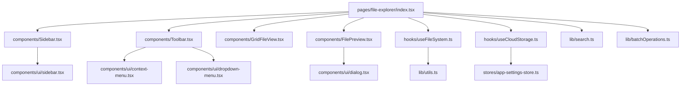
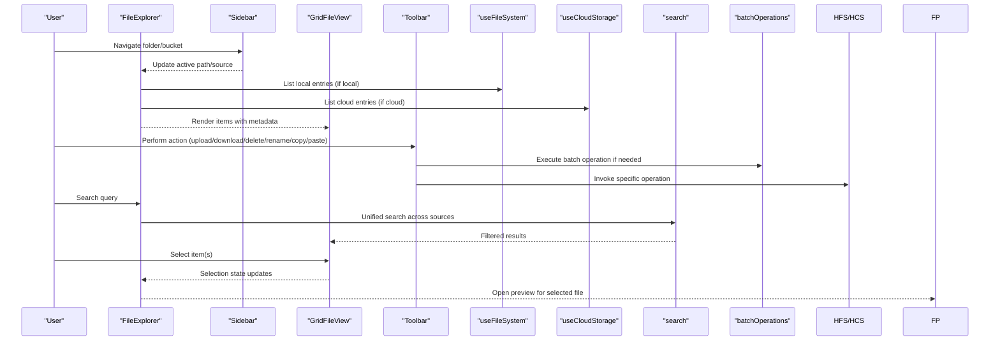
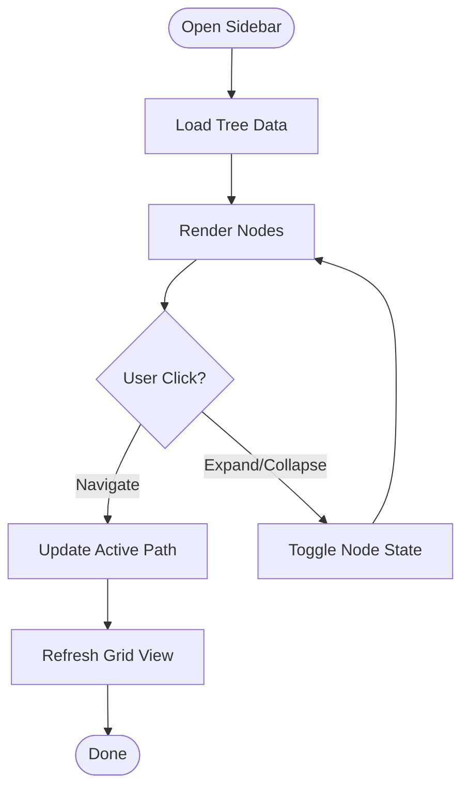
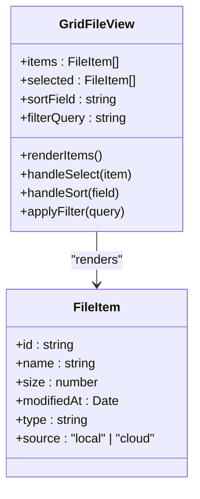
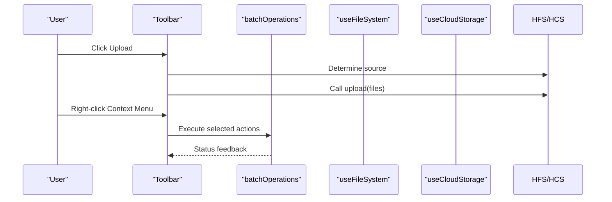
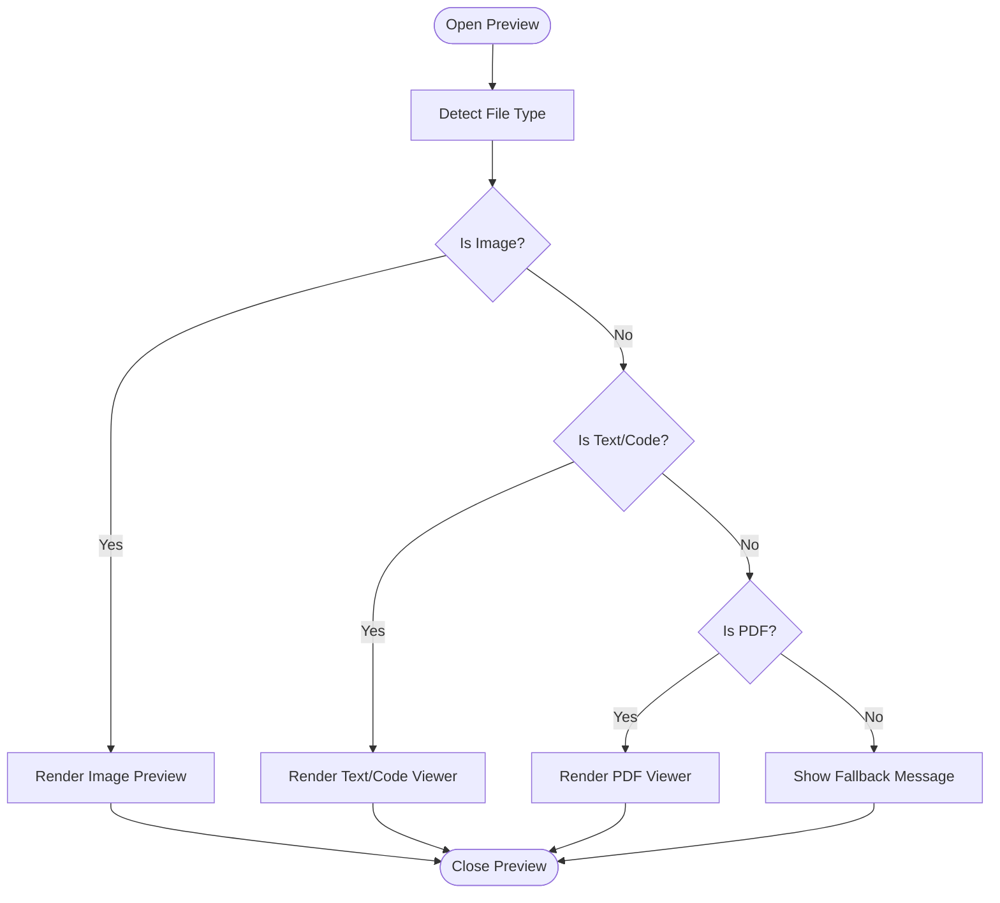
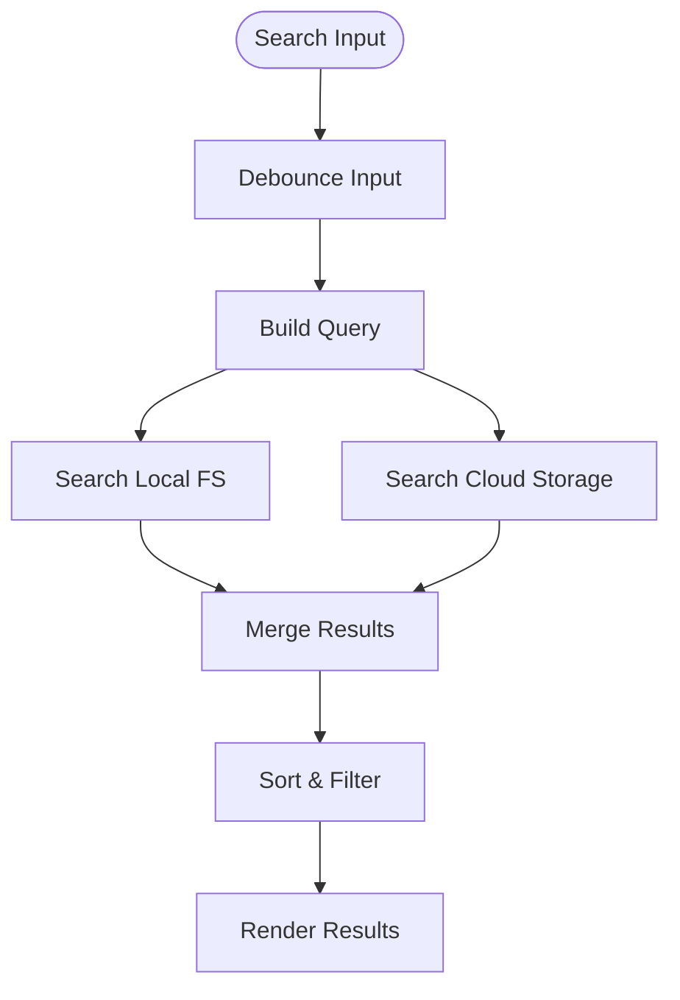
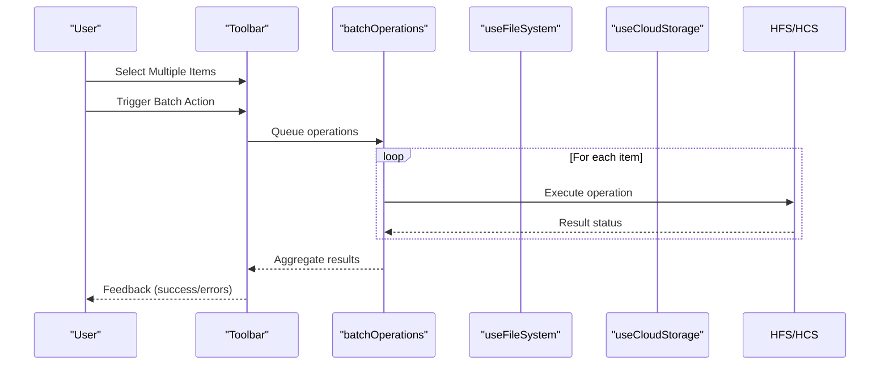
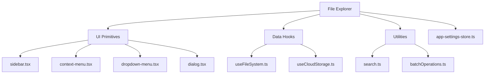

# File Explorer Overview

<cite>
**Referenced Files in This Document**
- [file-explorer/index.tsx](file://src/pages/file-explorer/index.tsx)
- [file-explorer/types.ts](file://src/pages/file-explorer/types.ts)
- [file-explorer/constants.ts](file://src/pages/file-explorer/constants.ts)
- [file-explorer/components/Toolbar.tsx](file://src/pages/file-explorer/components/Toolbar.tsx)
- [file-explorer/components/Sidebar.tsx](file://src/pages/file-explorer/components/Sidebar.tsx)
- [file-explorer/components/GridFileView.tsx](file://src/pages/file-explorer/components/GridFileView.tsx)
- [file-explorer/components/FilePreview.tsx](file://src/pages/file-explorer/components/FilePreview.tsx)
- [file-explorer/hooks/useFileSystem.ts](file://src/pages/file-explorer/hooks/useFileSystem.ts)
- [file-explorer/hooks/useCloudStorage.ts](file://src/pages/file-explorer/hooks/useCloudStorage.ts)
- [file-explorer/lib/search.ts](file://src/pages/file-explorer/lib/search.ts)
- [file-explorer/lib/batchOperations.ts](file://src/pages/file-explorer/lib/batchOperations.ts)
- [components/ui/sidebar.tsx](file://src/components/ui/sidebar.tsx)
- [components/ui/context-menu.tsx](file://src/components/ui/context-menu.tsx)
- [components/ui/dropdown-menu.tsx](file://src/components/ui/dropdown-menu.tsx)
- [components/ui/dialog.tsx](file://src/components/ui/dialog.tsx)
- [stores/app-settings-store.ts](file://src/stores/app-settings-store.ts)
- [lib/utils.ts](file://src/lib/utils.ts)
</cite>

## Table of Contents
1. [Introduction](#introduction)
2. [Project Structure](#project-structure)
3. [Core Components](#core-components)
4. [Architecture Overview](#architecture-overview)
5. [Detailed Component Analysis](#detailed-component-analysis)
6. [Dependency Analysis](#dependency-analysis)
7. [Performance Considerations](#performance-considerations)
8. [Troubleshooting Guide](#troubleshooting-guide)
9. [Conclusion](#conclusion)

## Introduction
The File Explorer provides a dual-pane interface for navigating and managing files across both the local file system and cloud storage (S3). It offers a consistent experience for browsing, searching, previewing, and performing batch operations on files regardless of their location. The design emphasizes productivity with keyboard shortcuts, responsive layouts, and accessible interactions.

## Project Structure
The File Explorer is organized as a feature module under pages/file-explorer with clear separation between UI components, hooks for data access, and utility libraries for shared logic.

**Diagram sources**
- [file-explorer/index.tsx:1-200](file://src/pages/file-explorer/index.tsx#L1-L200)
- [file-explorer/components/Sidebar.tsx:1-150](file://src/pages/file-explorer/components/Sidebar.tsx#L1-L150)
- [file-explorer/components/Toolbar.tsx:1-150](file://src/pages/file-explorer/components/Toolbar.tsx#L1-L150)
- [file-explorer/components/GridFileView.tsx:1-200](file://src/pages/file-explorer/components/GridFileView.tsx#L1-L200)
- [file-explorer/components/FilePreview.tsx:1-120](file://src/pages/file-explorer/components/FilePreview.tsx#L1-L120)
- [file-explorer/hooks/useFileSystem.ts:1-120](file://src/pages/file-explorer/hooks/useFileSystem.ts#L1-L120)
- [file-explorer/hooks/useCloudStorage.ts:1-120](file://src/pages/file-explorer/hooks/useCloudStorage.ts#L1-L120)
- [file-explorer/lib/search.ts:1-120](file://src/pages/file-explorer/lib/search.ts#L1-L120)
- [file-explorer/lib/batchOperations.ts:1-120](file://src/pages/file-explorer/lib/batchOperations.ts#L1-L120)
- [components/ui/sidebar.tsx:1-120](file://src/components/ui/sidebar.tsx#L1-L120)
- [components/ui/context-menu.tsx:1-120](file://src/components/ui/context-menu.tsx#L1-L120)
- [components/ui/dropdown-menu.tsx:1-120](file://src/components/ui/dropdown-menu.tsx#L1-L120)
- [components/ui/dialog.tsx:1-120](file://src/components/ui/dialog.tsx#L1-L120)
- [stores/app-settings-store.ts:1-120](file://src/stores/app-settings-store.ts#L1-L120)
- [lib/utils.ts:1-120](file://src/lib/utils.ts#L1-L120)

**Section sources**
- [file-explorer/index.tsx:1-200](file://src/pages/file-explorer/index.tsx#L1-L200)
- [file-explorer/types.ts:1-120](file://src/pages/file-explorer/types.ts#L1-L120)
- [file-explorer/constants.ts:1-80](file://src/pages/file-explorer/constants.ts#L1-L80)

## Core Components
- Sidebar: Displays hierarchical navigation for local directories and cloud buckets/folders. Supports toggling panes and quick filters.
- Grid File View: Renders files and folders in a responsive grid with sorting, filtering, and selection states.
- Toolbar: Provides actions such as upload, download, delete, rename, copy, paste, and view mode switching. Includes context menus and dropdowns.
- File Preview: Shows previews for supported file types (images, text, code, PDFs) within a modal or side panel.
- Hooks: useFileSystem manages local FS operations; useCloudStorage handles S3-like operations (list, upload, download, delete).
- Utilities: search.ts implements unified search across local and cloud; batchOperations.ts orchestrates multi-file actions.

**Section sources**
- [file-explorer/components/Sidebar.tsx:1-150](file://src/pages/file-explorer/components/Sidebar.tsx#L1-L150)
- [file-explorer/components/GridFileView.tsx:1-200](file://src/pages/file-explorer/components/GridFileView.tsx#L1-L200)
- [file-explorer/components/Toolbar.tsx:1-150](file://src/pages/file-explorer/components/Toolbar.tsx#L1-L150)
- [file-explorer/components/FilePreview.tsx:1-120](file://src/pages/file-explorer/components/FilePreview.tsx#L1-L120)
- [file-explorer/hooks/useFileSystem.ts:1-120](file://src/pages/file-explorer/hooks/useFileSystem.ts#L1-L120)
- [file-explorer/hooks/useCloudStorage.ts:1-120](file://src/pages/file-explorer/hooks/useCloudStorage.ts#L1-L120)
- [file-explorer/lib/search.ts:1-120](file://src/pages/file-explorer/lib/search.ts#L1-L120)
- [file-explorer/lib/batchOperations.ts:1-120](file://src/pages/file-explorer/lib/batchOperations.ts#L1-L120)

## Architecture Overview
The File Explorer follows a dual-pane architecture where each pane can be bound to either the local file system or cloud storage. A central state coordinates active pane sources, selection, and search scope. Operations are dispatched through the toolbar and context menus, invoking appropriate hooks based on the pane’s source.

**Diagram sources**
- [file-explorer/index.tsx:1-200](file://src/pages/file-explorer/index.tsx#L1-L200)
- [file-explorer/components/Sidebar.tsx:1-150](file://src/pages/file-explorer/components/Sidebar.tsx#L1-L150)
- [file-explorer/components/GridFileView.tsx:1-200](file://src/pages/file-explorer/components/GridFileView.tsx#L1-L200)
- [file-explorer/components/Toolbar.tsx:1-150](file://src/pages/file-explorer/components/Toolbar.tsx#L1-L150)
- [file-explorer/hooks/useFileSystem.ts:1-120](file://src/pages/file-explorer/hooks/useFileSystem.ts#L1-L120)
- [file-explorer/hooks/useCloudStorage.ts:1-120](file://src/pages/file-explorer/hooks/useCloudStorage.ts#L1-L120)
- [file-explorer/lib/search.ts:1-120](file://src/pages/file-explorer/lib/search.ts#L1-L120)
- [file-explorer/lib/batchOperations.ts:1-120](file://src/pages/file-explorer/lib/batchOperations.ts#L1-L120)

## Detailed Component Analysis

### Sidebar
- Responsibilities: Display directory tree for local paths and bucket/folder hierarchy for cloud storage. Provide quick navigation and filters.
- Interactions: Click to navigate, expand/collapse nodes, toggle visibility of panes.
- Accessibility: Keyboard navigation support, focus management, ARIA labels for tree nodes.

**Diagram sources**
- [file-explorer/components/Sidebar.tsx:1-150](file://src/pages/file-explorer/components/Sidebar.tsx#L1-L150)
- [components/ui/sidebar.tsx:1-120](file://src/components/ui/sidebar.tsx#L1-L120)

**Section sources**
- [file-explorer/components/Sidebar.tsx:1-150](file://src/pages/file-explorer/components/Sidebar.tsx#L1-L150)
- [components/ui/sidebar.tsx:1-120](file://src/components/ui/sidebar.tsx#L1-L120)

### Grid File View
- Responsibilities: Render files/folders in a responsive grid with sorting, filtering, and selection.
- Features: Multi-select, drag-and-drop (where applicable), pagination/virtualization for large lists.
- Performance: Virtual scrolling for large datasets; debounced search integration.

**Diagram sources**
- [file-explorer/components/GridFileView.tsx:1-200](file://src/pages/file-explorer/components/GridFileView.tsx#L1-L200)
- [file-explorer/types.ts:1-120](file://src/pages/file-explorer/types.ts#L1-L120)

**Section sources**
- [file-explorer/components/GridFileView.tsx:1-200](file://src/pages/file-explorer/components/GridFileView.tsx#L1-L200)
- [file-explorer/types.ts:1-120](file://src/pages/file-explorer/types.ts#L1-L120)

### Toolbar
- Responsibilities: Provide global actions (upload, download, delete, rename, copy, paste), view mode toggles, and context menus.
- Integration: Dispatches operations via batchOperations when multiple items are selected; invokes useFileSystem/useCloudStorage based on active pane source.
- Context Menus: Right-click actions contextualized by selection and file type.

**Diagram sources**
- [file-explorer/components/Toolbar.tsx:1-150](file://src/pages/file-explorer/components/Toolbar.tsx#L1-L150)
- [file-explorer/lib/batchOperations.ts:1-120](file://src/pages/file-explorer/lib/batchOperations.ts#L1-L120)
- [file-explorer/hooks/useFileSystem.ts:1-120](file://src/pages/file-explorer/hooks/useFileSystem.ts#L1-L120)
- [file-explorer/hooks/useCloudStorage.ts:1-120](file://src/pages/file-explorer/hooks/useCloudStorage.ts#L1-L120)

**Section sources**
- [file-explorer/components/Toolbar.tsx:1-150](file://src/pages/file-explorer/components/Toolbar.tsx#L1-L150)
- [components/ui/context-menu.tsx:1-120](file://src/components/ui/context-menu.tsx#L1-L120)
- [components/ui/dropdown-menu.tsx:1-120](file://src/components/ui/dropdown-menu.tsx#L1-L120)

### File Preview
- Responsibilities: Display previews for supported file types within a modal or side panel.
- Supported Types: Images, text/code, PDFs, and other common formats.
- UX: Closeable overlay, keyboard navigation, and accessibility attributes.

**Diagram sources**
- [file-explorer/components/FilePreview.tsx:1-120](file://src/pages/file-explorer/components/FilePreview.tsx#L1-L120)
- [components/ui/dialog.tsx:1-120](file://src/components/ui/dialog.tsx#L1-L120)

**Section sources**
- [file-explorer/components/FilePreview.tsx:1-120](file://src/pages/file-explorer/components/FilePreview.tsx#L1-L120)

### Unified Search
- Scope: Searches across both local and cloud sources simultaneously.
- Behavior: Debounced input, result merging, highlighting matches, and filtering by type/date.
- Performance: Lazy loading of results and pagination to handle large datasets.

**Diagram sources**
- [file-explorer/lib/search.ts:1-120](file://src/pages/file-explorer/lib/search.ts#L1-L120)

**Section sources**
- [file-explorer/lib/search.ts:1-120](file://src/pages/file-explorer/lib/search.ts#L1-L120)

### Batch Operations
- Capabilities: Copy, move, delete, rename, and share across multiple selected files.
- Execution: Queues operations with progress feedback and error handling per item.
- Source Awareness: Adapts behavior based on whether items are local or cloud.

**Diagram sources**
- [file-explorer/lib/batchOperations.ts:1-120](file://src/pages/file-explorer/lib/batchOperations.ts#L1-L120)
- [file-explorer/hooks/useFileSystem.ts:1-120](file://src/pages/file-explorer/hooks/useFileSystem.ts#L1-L120)
- [file-explorer/hooks/useCloudStorage.ts:1-120](file://src/pages/file-explorer/hooks/useCloudStorage.ts#L1-L120)

**Section sources**
- [file-explorer/lib/batchOperations.ts:1-120](file://src/pages/file-explorer/lib/batchOperations.ts#L1-L120)

## Dependency Analysis
The File Explorer depends on UI primitives for consistent interaction patterns and stores/settings for configuration.

**Diagram sources**
- [file-explorer/index.tsx:1-200](file://src/pages/file-explorer/index.tsx#L1-L200)
- [components/ui/sidebar.tsx:1-120](file://src/components/ui/sidebar.tsx#L1-L120)
- [components/ui/context-menu.tsx:1-120](file://src/components/ui/context-menu.tsx#L1-L120)
- [components/ui/dropdown-menu.tsx:1-120](file://src/components/ui/dropdown-menu.tsx#L1-L120)
- [components/ui/dialog.tsx:1-120](file://src/components/ui/dialog.tsx#L1-L120)
- [file-explorer/hooks/useFileSystem.ts:1-120](file://src/pages/file-explorer/hooks/useFileSystem.ts#L1-L120)
- [file-explorer/hooks/useCloudStorage.ts:1-120](file://src/pages/file-explorer/hooks/useCloudStorage.ts#L1-L120)
- [file-explorer/lib/search.ts:1-120](file://src/pages/file-explorer/lib/search.ts#L1-L120)
- [file-explorer/lib/batchOperations.ts:1-120](file://src/pages/file-explorer/lib/batchOperations.ts#L1-L120)
- [stores/app-settings-store.ts:1-120](file://src/stores/app-settings-store.ts#L1-L120)

**Section sources**
- [file-explorer/index.tsx:1-200](file://src/pages/file-explorer/index.tsx#L1-L200)
- [stores/app-settings-store.ts:1-120](file://src/stores/app-settings-store.ts#L1-L120)
- [lib/utils.ts:1-120](file://src/lib/utils.ts#L1-L120)

## Performance Considerations
- Virtualization: Use virtual scrolling for large file lists to maintain smooth interactions.
- Debouncing: Apply debounce on search inputs to reduce unnecessary queries.
- Pagination/Lazy Loading: Load additional items on demand to minimize memory usage.
- Caching: Cache frequently accessed directory listings and search results locally.
- Optimistic Updates: Provide immediate UI feedback for batch operations while processing continues in the background.

[No sources needed since this section provides general guidance]

## Troubleshooting Guide
- Navigation Issues: Ensure correct path resolution and permissions for local directories; verify cloud credentials and bucket access.
- Search Delays: Check debounce settings and network latency for cloud searches; consider narrowing scopes.
- Preview Failures: Validate file type detection and supported viewers; fallback gracefully for unsupported formats.
- Batch Operation Errors: Inspect per-item status messages; retry failed operations with user confirmation.

**Section sources**
- [file-explorer/hooks/useFileSystem.ts:1-120](file://src/pages/file-explorer/hooks/useFileSystem.ts#L1-L120)
- [file-explorer/hooks/useCloudStorage.ts:1-120](file://src/pages/file-explorer/hooks/useCloudStorage.ts#L1-L120)
- [file-explorer/lib/search.ts:1-120](file://src/pages/file-explorer/lib/search.ts#L1-L120)
- [file-explorer/lib/batchOperations.ts:1-120](file://src/pages/file-explorer/lib/batchOperations.ts#L1-L120)

## Conclusion
The File Explorer delivers a robust, dual-pane interface for managing files across local and cloud environments. Its modular architecture, unified search, and batch operations enable efficient workflows for organizing security testing artifacts, managing project documentation, and collaborating through shared storage. Responsive design and accessibility considerations ensure a seamless experience across devices and users.

[No sources needed since this section summarizes without analyzing specific files]