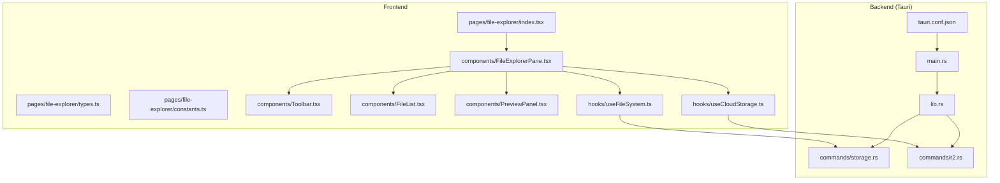
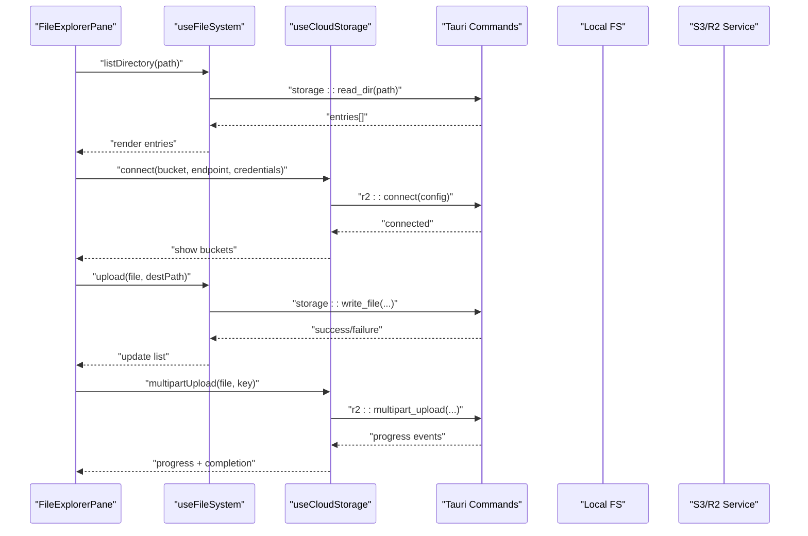
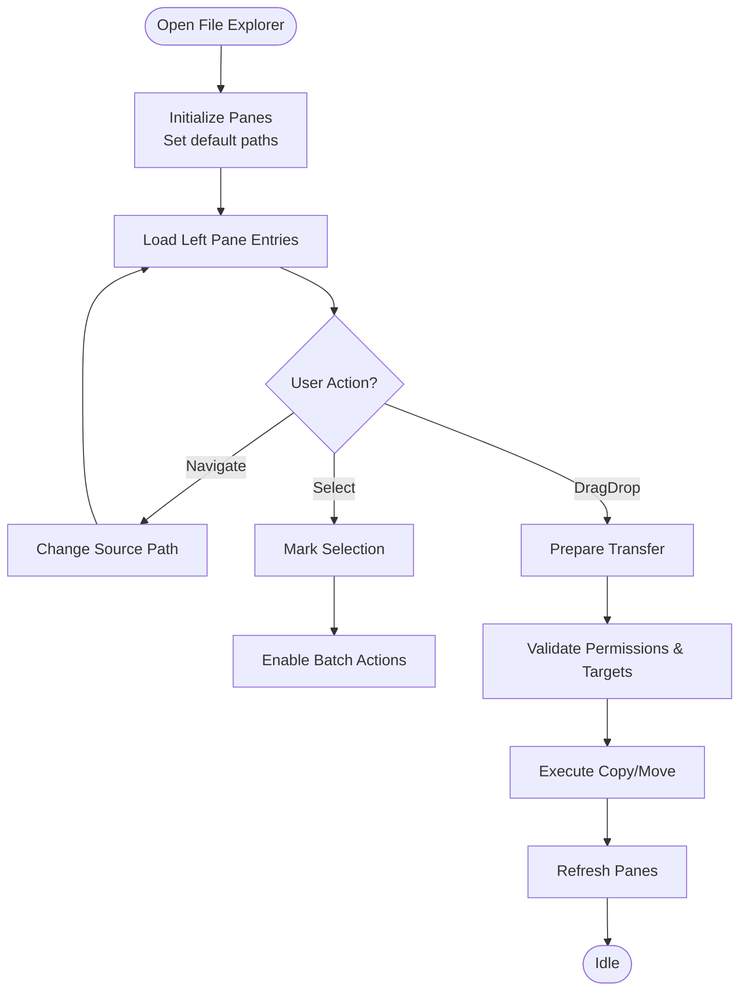
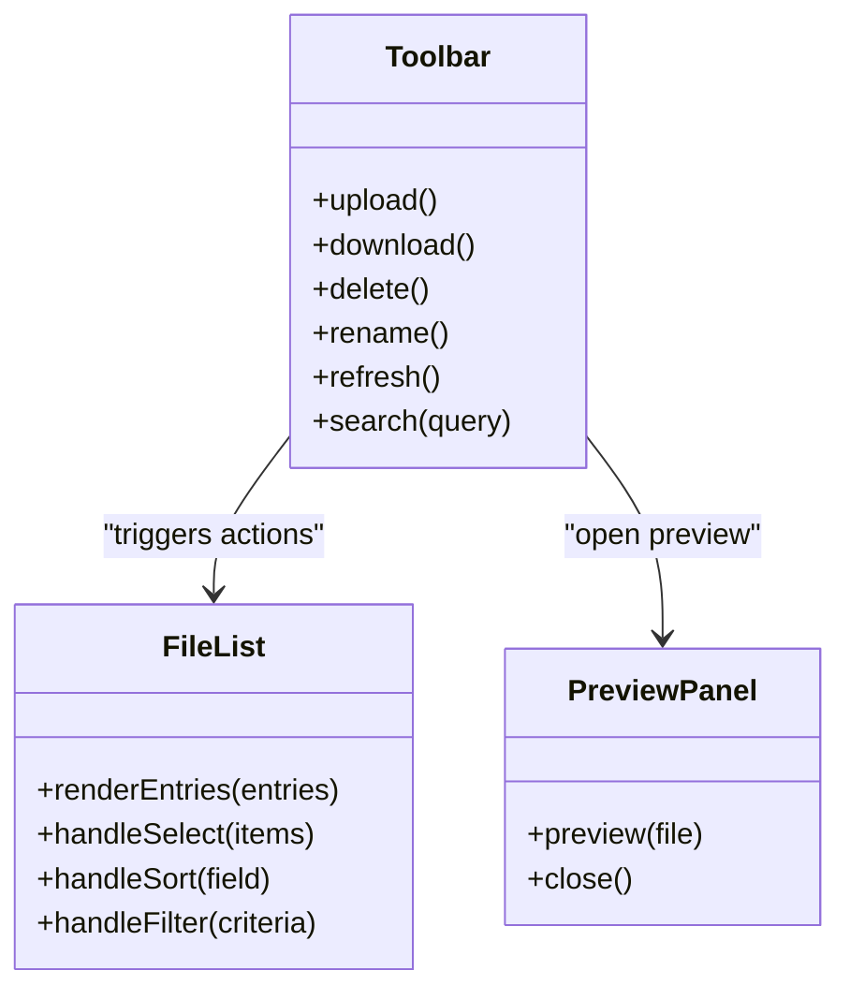
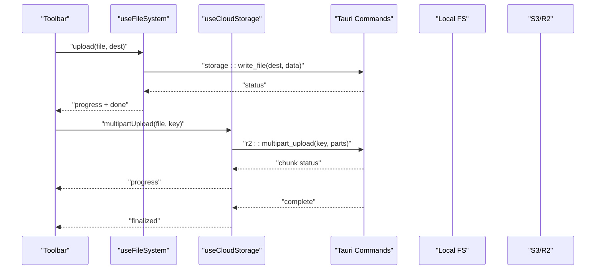
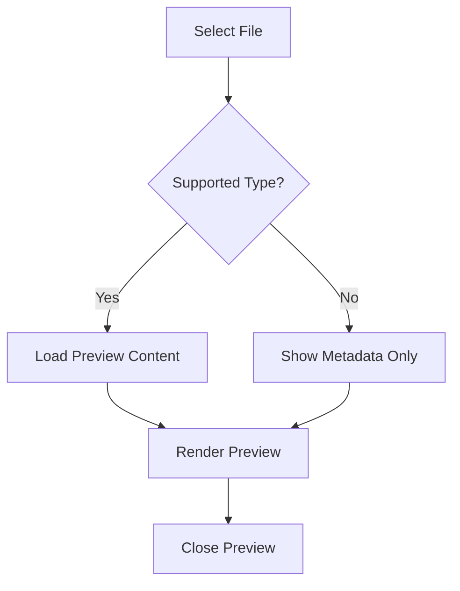
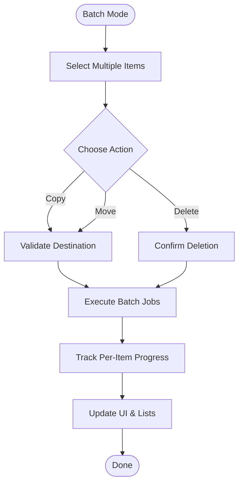
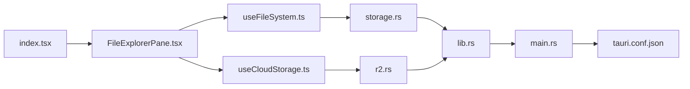

# File Explorer

<cite>
**Referenced Files in This Document**
- [file-explorer/index.tsx](file://src/pages/file-explorer/index.tsx)
- [file-explorer/types.ts](file://src/pages/file-explorer/types.ts)
- [file-explorer/constants.ts](file://src/pages/file-explorer/constants.ts)
- [file-explorer/components/FileExplorerPane.tsx](file://src/pages/file-explorer/components/FileExplorerPane.tsx)
- [file-explorer/components/Toolbar.tsx](file://src/pages/file-explorer/components/Toolbar.tsx)
- [file-explorer/components/FileList.tsx](file://src/pages/file-explorer/components/FileList.tsx)
- [file-explorer/components/PreviewPanel.tsx](file://src/pages/file-explorer/components/PreviewPanel.tsx)
- [file-explorer/hooks/useFileSystem.ts](file://src/pages/file-explorer/hooks/useFileSystem.ts)
- [file-explorer/hooks/useCloudStorage.ts](file://src/pages/file-explorer/hooks/useCloudStorage.ts)
- [commands/storage.rs](file://src-tauri/src/commands/storage.rs)
- [commands/r2.rs](file://src-tauri/src/commands/r2.rs)
- [lib.rs](file://src-tauri/src/lib.rs)
- [main.rs](file://src-tauri/src/main.rs)
- [tauri.conf.json](file://src-tauri/tauri.conf.json)
</cite>

## Table of Contents
1. [Introduction](#introduction)
2. [Project Structure](#project-structure)
3. [Core Components](#core-components)
4. [Architecture Overview](#architecture-overview)
5. [Detailed Component Analysis](#detailed-component-analysis)
6. [Dependency Analysis](#dependency-analysis)
7. [Performance Considerations](#performance-considerations)
8. [Troubleshooting Guide](#troubleshooting-guide)
9. [Conclusion](#conclusion)
10. [Appendices](#appendices)

## Introduction
This document explains Apprecon’s File Explorer feature, covering local file system navigation, cloud storage integration (S3/R2), file operations (upload, download, delete, rename), search, dual-pane interface, preview capabilities, and batch operations. It also includes guidance for S3 bucket configuration, authentication setup, multipart upload handling, organizing security testing artifacts, managing project files, collaborating via shared cloud storage, permissions, sync strategies, and performance optimization for large files.

## Project Structure
The File Explorer is implemented as a dedicated page with components, hooks, types, and constants. The Tauri backend exposes commands for storage and R2/S3 operations.

**Diagram sources**
- [file-explorer/index.tsx](file://src/pages/file-explorer/index.tsx)
- [file-explorer/components/FileExplorerPane.tsx](file://src/pages/file-explorer/components/FileExplorerPane.tsx)
- [file-explorer/components/Toolbar.tsx](file://src/pages/file-explorer/components/Toolbar.tsx)
- [file-explorer/components/FileList.tsx](file://src/pages/file-explorer/components/FileList.tsx)
- [file-explorer/components/PreviewPanel.tsx](file://src/pages/file-explorer/components/PreviewPanel.tsx)
- [file-explorer/hooks/useFileSystem.ts](file://src/pages/file-explorer/hooks/useFileSystem.ts)
- [file-explorer/hooks/useCloudStorage.ts](file://src/pages/file-explorer/hooks/useCloudStorage.ts)
- [commands/storage.rs](file://src-tauri/src/commands/storage.rs)
- [commands/r2.rs](file://src-tauri/src/commands/r2.rs)
- [lib.rs](file://src-tauri/src/lib.rs)
- [main.rs](file://src-tauri/src/main.rs)
- [tauri.conf.json](file://src-tauri/tauri.conf.json)

**Section sources**
- [file-explorer/index.tsx](file://src/pages/file-explorer/index.tsx)
- [file-explorer/types.ts](file://src/pages/file-explorer/types.ts)
- [file-explorer/constants.ts](file://src/pages/file-explorer/constants.ts)
- [commands/storage.rs](file://src-tauri/src/commands/storage.rs)
- [commands/r2.rs](file://src-tauri/src/commands/r2.rs)
- [lib.rs](file://src-tauri/src/lib.rs)
- [main.rs](file://src-tauri/src/main.rs)
- [tauri.conf.json](file://src-tauri/tauri.conf.json)

## Core Components
- Page entry: orchestrates layout, state, and routing into the explorer view.
- Dual-pane container: manages left (source) and right (destination or preview) panes, selection, and actions.
- Toolbar: provides common actions (upload, download, delete, rename, refresh, search).
- File list: renders directory contents, supports sorting, filtering, and selection.
- Preview panel: shows content previews for supported file types.
- Hooks:
  - useFileSystem: wraps Tauri storage commands for local FS operations.
  - useCloudStorage: wraps Tauri R2/S3 commands for cloud operations.

Key responsibilities:
- Local navigation: traverse directories, read metadata, handle permissions.
- Cloud integration: connect to S3-compatible endpoints, manage buckets and objects.
- Operations: upload (including multipart), download, delete, rename, copy/move.
- Search: client-side filtering and server-assisted indexing where applicable.
- Batch operations: multi-select and bulk actions.

**Section sources**
- [file-explorer/components/FileExplorerPane.tsx](file://src/pages/file-explorer/components/FileExplorerPane.tsx)
- [file-explorer/components/Toolbar.tsx](file://src/pages/file-explorer/components/Toolbar.tsx)
- [file-explorer/components/FileList.tsx](file://src/pages/file-explorer/components/FileList.tsx)
- [file-explorer/components/PreviewPanel.tsx](file://src/pages/file-explorer/components/PreviewPanel.tsx)
- [file-explorer/hooks/useFileSystem.ts](file://src/pages/file-explorer/hooks/useFileSystem.ts)
- [file-explorer/hooks/useCloudStorage.ts](file://src/pages/file-explorer/hooks/useCloudStorage.ts)

## Architecture Overview
The File Explorer uses a layered architecture:
- UI layer: React components render the dual-pane interface and user interactions.
- State layer: hooks encapsulate data fetching and mutation logic.
- Backend layer: Tauri commands expose Rust functions to the frontend for secure FS and cloud access.
- Configuration: Tauri capabilities and app config define allowed commands and permissions.

**Diagram sources**
- [file-explorer/components/FileExplorerPane.tsx](file://src/pages/file-explorer/components/FileExplorerPane.tsx)
- [file-explorer/hooks/useFileSystem.ts](file://src/pages/file-explorer/hooks/useFileSystem.ts)
- [file-explorer/hooks/useCloudStorage.ts](file://src/pages/file-explorer/hooks/useCloudStorage.ts)
- [commands/storage.rs](file://src-tauri/src/commands/storage.rs)
- [commands/r2.rs](file://src-tauri/src/commands/r2.rs)

## Detailed Component Analysis

### Dual-Pane Interface
- Left pane: source location (local path or cloud bucket prefix).
- Right pane: destination for copy/move or preview area.
- Drag-and-drop between panes for quick transfers.
- Selection model supports single and multi-select for batch operations.

**Diagram sources**
- [file-explorer/components/FileExplorerPane.tsx](file://src/pages/file-explorer/components/FileExplorerPane.tsx)
- [file-explorer/components/FileList.tsx](file://src/pages/file-explorer/components/FileList.tsx)

**Section sources**
- [file-explorer/components/FileExplorerPane.tsx](file://src/pages/file-explorer/components/FileExplorerPane.tsx)
- [file-explorer/components/FileList.tsx](file://src/pages/file-explorer/components/FileList.tsx)

### Toolbar and Actions
- Upload: select local files; supports single and multiple uploads.
- Download: selected items to local destination.
- Delete: remove files/directories with confirmation.
- Rename: inline editing with validation.
- Refresh: re-scan current location.
- Search: filter by name, type, size, date.

**Diagram sources**
- [file-explorer/components/Toolbar.tsx](file://src/pages/file-explorer/components/Toolbar.tsx)
- [file-explorer/components/FileList.tsx](file://src/pages/file-explorer/components/FileList.tsx)
- [file-explorer/components/PreviewPanel.tsx](file://src/pages/file-explorer/components/PreviewPanel.tsx)

**Section sources**
- [file-explorer/components/Toolbar.tsx](file://src/pages/file-explorer/components/Toolbar.tsx)
- [file-explorer/components/FileList.tsx](file://src/pages/file-explorer/components/FileList.tsx)
- [file-explorer/components/PreviewPanel.tsx](file://src/pages/file-explorer/components/PreviewPanel.tsx)

### File Operations and Search
- Upload:
  - Local: write to target directory using storage command.
  - Cloud: initiate multipart upload for large files; stream chunks with progress updates.
- Download:
  - Local: fetch bytes and save to chosen path.
  - Cloud: stream object content to disk.
- Delete:
  - Remove files/dirs locally; delete objects in cloud with optional recursive flag.
- Rename:
  - Validate new names; update metadata and refresh listings.
- Search:
  - Client-side filtering on loaded entries.
  - Optional server-side search for large datasets.

**Diagram sources**
- [file-explorer/components/Toolbar.tsx](file://src/pages/file-explorer/components/Toolbar.tsx)
- [file-explorer/hooks/useFileSystem.ts](file://src/pages/file-explorer/hooks/useFileSystem.ts)
- [file-explorer/hooks/useCloudStorage.ts](file://src/pages/file-explorer/hooks/useCloudStorage.ts)
- [commands/storage.rs](file://src-tauri/src/commands/storage.rs)
- [commands/r2.rs](file://src-tauri/src/commands/r2.rs)

**Section sources**
- [file-explorer/hooks/useFileSystem.ts](file://src/pages/file-explorer/hooks/useFileSystem.ts)
- [file-explorer/hooks/useCloudStorage.ts](file://src/pages/file-explorer/hooks/useCloudStorage.ts)
- [commands/storage.rs](file://src-tauri/src/commands/storage.rs)
- [commands/r2.rs](file://src-tauri/src/commands/r2.rs)

### Preview Capabilities
- Supported types: images, text, code, PDFs, audio/video where feasible.
- Lazy loading: only load preview when visible.
- Fallback: show metadata and basic info for unsupported types.

**Diagram sources**
- [file-explorer/components/PreviewPanel.tsx](file://src/pages/file-explorer/components/PreviewPanel.tsx)

**Section sources**
- [file-explorer/components/PreviewPanel.tsx](file://src/pages/file-explorer/components/PreviewPanel.tsx)

### Batch Operations
- Multi-select via checkboxes or shift-click ranges.
- Bulk actions: upload to destination, move/copy, delete, rename with suffix/prefix.
- Progress tracking per item with overall progress bar.

**Diagram sources**
- [file-explorer/components/FileExplorerPane.tsx](file://src/pages/file-explorer/components/FileExplorerPane.tsx)
- [file-explorer/components/FileList.tsx](file://src/pages/file-explorer/components/FileList.tsx)

**Section sources**
- [file-explorer/components/FileExplorerPane.tsx](file://src/pages/file-explorer/components/FileExplorerPane.tsx)
- [file-explorer/components/FileList.tsx](file://src/pages/file-explorer/components/FileList.tsx)

## Dependency Analysis
- Frontend dependencies:
  - React components depend on hooks for data and side effects.
  - Types and constants centralize shared definitions.
- Backend dependencies:
  - Tauri commands are registered in lib.rs and main.rs.
  - storage.rs handles local FS operations.
  - r2.rs handles S3/R2 operations including multipart uploads.
  - tauri.conf.json defines capabilities and permissions.

**Diagram sources**
- [file-explorer/index.tsx](file://src/pages/file-explorer/index.tsx)
- [file-explorer/components/FileExplorerPane.tsx](file://src/pages/file-explorer/components/FileExplorerPane.tsx)
- [file-explorer/hooks/useFileSystem.ts](file://src/pages/file-explorer/hooks/useFileSystem.ts)
- [file-explorer/hooks/useCloudStorage.ts](file://src/pages/file-explorer/hooks/useCloudStorage.ts)
- [commands/storage.rs](file://src-tauri/src/commands/storage.rs)
- [commands/r2.rs](file://src-tauri/src/commands/r2.rs)
- [lib.rs](file://src-tauri/src/lib.rs)
- [main.rs](file://src-tauri/src/main.rs)
- [tauri.conf.json](file://src-tauri/tauri.conf.json)

**Section sources**
- [lib.rs](file://src-tauri/src/lib.rs)
- [main.rs](file://src-tauri/src/main.rs)
- [tauri.conf.json](file://src-tauri/tauri.conf.json)
- [commands/storage.rs](file://src-tauri/src/commands/storage.rs)
- [commands/r2.rs](file://src-tauri/src/commands/r2.rs)

## Performance Considerations
- Large file uploads:
  - Use multipart uploads with chunked streaming to reduce memory usage.
  - Implement resumable uploads to recover from network interruptions.
- Browsing large directories:
  - Paginate or virtualize lists to avoid rendering overhead.
  - Debounce search input to minimize re-renders.
- Caching:
  - Cache directory listings and metadata for short-lived sessions.
  - Invalidate cache on changes or explicit refresh.
- I/O throttling:
  - Limit concurrent operations to prevent resource contention.
  - Prioritize critical operations (e.g., active uploads).

[No sources needed since this section provides general guidance]

## Troubleshooting Guide
Common issues and resolutions:
- Permission errors:
  - Ensure the app has read/write access to target directories.
  - On restricted systems, run with appropriate privileges or adjust OS permissions.
- Cloud connectivity:
  - Verify endpoint URL, bucket name, region, and credentials.
  - Check firewall rules and proxy settings if applicable.
- Multipart failures:
  - Inspect chunk sizes and retry policies.
  - Validate object lifecycle policies and quotas.
- Slow listing/search:
  - Reduce initial load size; implement lazy loading.
  - Enable server-side indexing for faster searches.

**Section sources**
- [commands/storage.rs](file://src-tauri/src/commands/storage.rs)
- [commands/r2.rs](file://src-tauri/src/commands/r2.rs)

## Conclusion
Apprecon’s File Explorer provides a robust dual-pane interface for navigating local files and integrating with S3-compatible cloud storage. With comprehensive file operations, search, preview, and batch capabilities, it supports efficient workflows for organizing security testing artifacts and collaborating across teams. Proper configuration, permission management, and performance tuning ensure reliable operation even with large datasets.

[No sources needed since this section summarizes without analyzing specific files]

## Appendices

### S3 Bucket Configuration and Authentication
- Endpoint: configure S3-compatible service URL.
- Credentials: set access key and secret key securely.
- Region and bucket: specify region and target bucket.
- Policies: enforce least privilege and object-level permissions.

[No sources needed since this section provides general guidance]

### Organizing Security Testing Artifacts
- Recommended structure:
  - /projects/{project}/evidence
  - /projects/{project}/reports
  - /projects/{project}/scripts
- Naming conventions:
  - Timestamps and versioning for reproducibility.
  - Descriptive names for easy discovery.

[No sources needed since this section provides general guidance]

### Collaboration Through Shared Cloud Storage
- Shared buckets:
  - Create team-specific buckets with controlled access.
  - Use prefixes for project isolation.
- Sync strategies:
  - Delta sync to minimize bandwidth.
  - Conflict resolution policies for concurrent edits.

[No sources needed since this section provides general guidance]

### File Permissions and Sync Strategies
- Permissions:
  - Enforce read-only modes for evidence integrity.
  - Use ACLs or IAM policies for fine-grained control.
- Sync:
  - Background sync with conflict detection.
  - Versioning enabled for rollback capability.

[No sources needed since this section provides general guidance]