# File Operations & User Interface

<cite>
**Referenced Files in This Document**
- [src/pages/file-explorer/index.tsx](file://src/pages/file-explorer/index.tsx)
- [src/pages/file-explorer/components/grid-view.tsx](file://src/pages/file-explorer/components/grid-view.tsx)
- [src/pages/file-explorer/components/sidebar.tsx](file://src/pages/file-explorer/components/sidebar.tsx)
- [src/pages/file-explorer/components/toolbar.tsx](file://src/pages/file-explorer/components/toolbar.tsx)
- [src/pages/file-explorer/hooks/use-file-operations.ts](file://src/pages/file-explorer/hooks/use-file-operations.ts)
- [src/pages/file-explorer/lib/file-manager.ts](file://src/pages/file-explorer/lib/file-manager.ts)
- [src/components/ui/data-table.tsx](file://src/components/ui/data-table.tsx)
- [src/components/ui/pagination.tsx](file://src/components/ui/pagination.tsx)
- [src/stores/app.ts](file://src/stores/app.ts)
</cite>

## Table of Contents
1. [Introduction](#introduction)
2. [Project Structure](#project-structure)
3. [Core Components](#core-components)
4. [Architecture Overview](#architecture-overview)
5. [Detailed Component Analysis](#detailed-component-analysis)
6. [Dependency Analysis](#dependency-analysis)
7. [Performance Considerations](#performance-considerations)
8. [Troubleshooting Guide](#troubleshooting-guide)
9. [Conclusion](#conclusion)
10. [Appendices](#appendices)

## Introduction

The File Explorer is a comprehensive file management system designed specifically for security testing projects. It provides an intuitive interface for organizing, searching, and managing files with advanced features like grid view sorting, filtering, pagination, sidebar navigation, and toolbar operations. The system supports drag-and-drop functionality, keyboard shortcuts, and accessibility features to enhance productivity for power users.

## Project Structure

The File Explorer follows a modular architecture with clear separation of concerns:

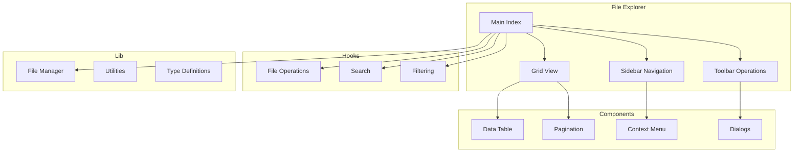

**Diagram sources**
- [src/pages/file-explorer/index.tsx](file://src/pages/file-explorer/index.tsx)
- [src/pages/file-explorer/components/grid-view.tsx](file://src/pages/file-explorer/components/grid-view.tsx)
- [src/pages/file-explorer/components/sidebar.tsx](file://src/pages/file-explorer/components/sidebar.tsx)
- [src/pages/file-explorer/components/toolbar.tsx](file://src/pages/file-explorer/components/toolbar.tsx)

**Section sources**
- [src/pages/file-explorer/index.tsx](file://src/pages/file-explorer/index.tsx)
- [src/pages/file-explorer/components/grid-view.tsx](file://src/pages/file-explorer/components/grid-view.tsx)

## Core Components

### Grid View Implementation

The grid view component provides a visual representation of files and folders with advanced sorting, filtering, and pagination capabilities.

#### Key Features:
- **Sorting**: Multi-column sorting by name, size, date, type
- **Filtering**: Real-time search with fuzzy matching
- **Pagination**: Efficient handling of large file sets
- **Selection**: Single and multi-selection with keyboard shortcuts
- **View Modes**: Grid and list view switching

#### Data Flow Architecture:

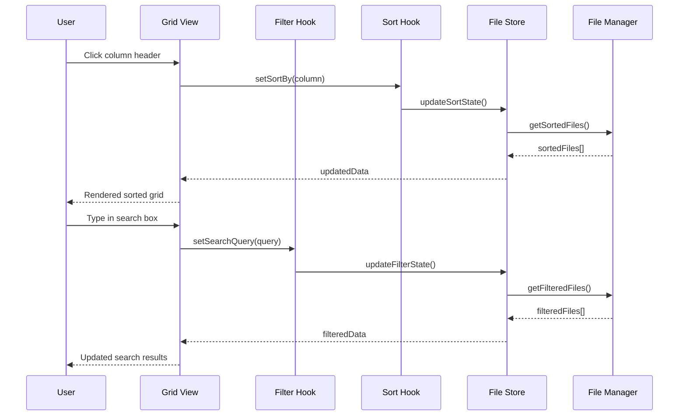

**Diagram sources**
- [src/pages/file-explorer/components/grid-view.tsx](file://src/pages/file-explorer/components/grid-view.tsx)
- [src/pages/file-explorer/hooks/use-file-operations.ts](file://src/pages/file-explorer/hooks/use-file-operations.ts)

### Sidebar Navigation

The sidebar provides quick access to frequently used locations and favorites with customizable organization.

#### Navigation Features:
- **Quick Access**: Recent files, favorite locations, custom tags
- **Favorites Management**: Add/remove favorites with persistence
- **Tag System**: Color-coded tags for categorization
- **Breadcrumb Navigation**: Hierarchical path display
- **Search Integration**: Global search across all locations

#### State Management:

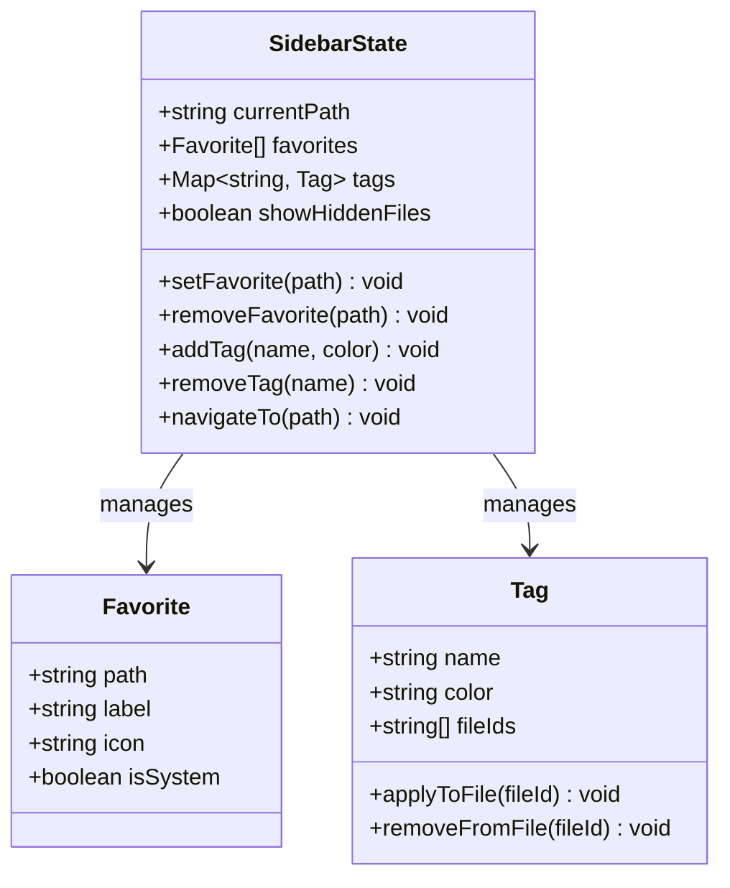

**Diagram sources**
- [src/pages/file-explorer/components/sidebar.tsx](file://src/pages/file-explorer/components/sidebar.tsx)
- [src/stores/app.ts](file://src/stores/app.ts)

### Toolbar Operations

The toolbar provides bulk actions, search functionality, and view customization options.

#### Available Operations:
- **Bulk Actions**: Copy, move, delete, rename multiple files
- **Search**: Advanced search with filters and operators
- **View Customization**: Toggle grid/list view, adjust item size
- **Import/Export**: Batch import/export operations
- **Permissions**: Bulk permission changes
- **Metadata Editing**: Edit file metadata in bulk

#### Operation Flow:

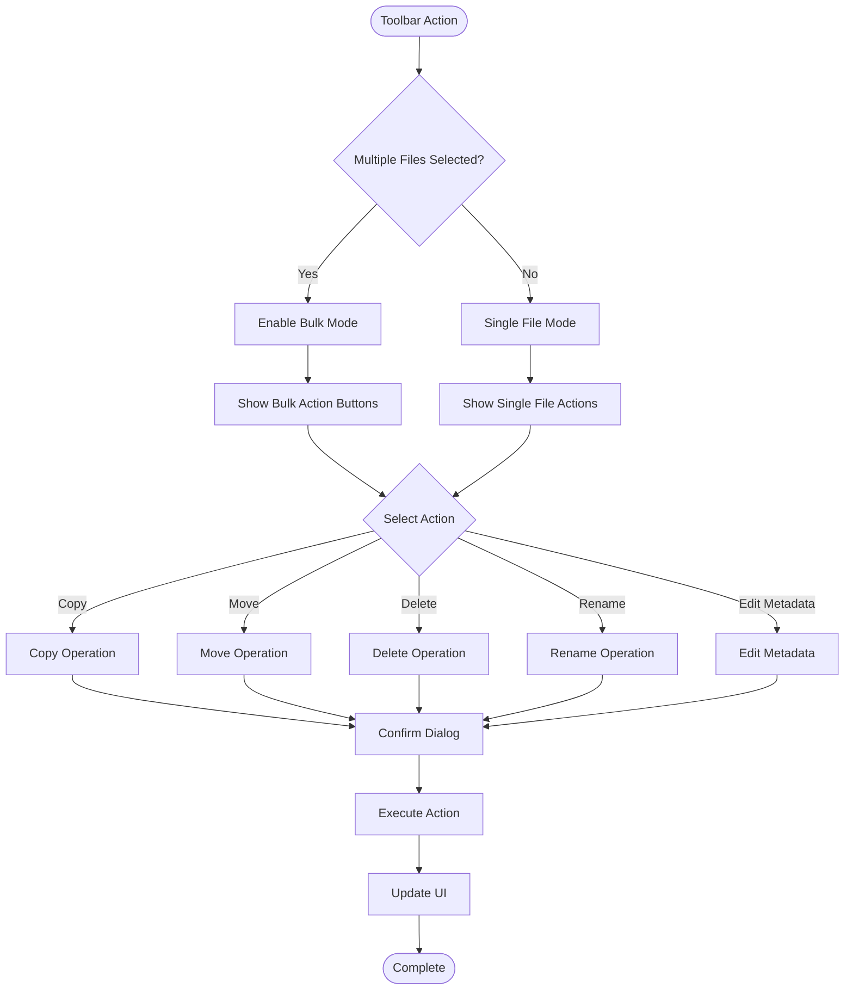

**Diagram sources**
- [src/pages/file-explorer/components/toolbar.tsx](file://src/pages/file-explorer/components/toolbar.tsx)

**Section sources**
- [src/pages/file-explorer/components/grid-view.tsx](file://src/pages/file-explorer/components/grid-view.tsx)
- [src/pages/file-explorer/components/sidebar.tsx](file://src/pages/file-explorer/components/sidebar.tsx)
- [src/pages/file-explorer/components/toolbar.tsx](file://src/pages/file-explorer/components/toolbar.tsx)

## Architecture Overview

The File Explorer follows a reactive architecture pattern with clear separation between UI components, business logic, and data management.

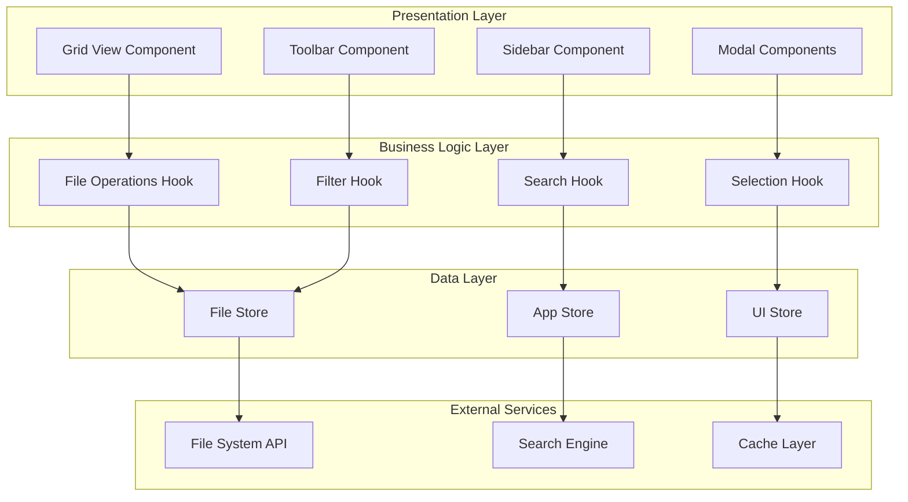

**Diagram sources**
- [src/pages/file-explorer/index.tsx](file://src/pages/file-explorer/index.tsx)
- [src/pages/file-explorer/hooks/use-file-operations.ts](file://src/pages/file-explorer/hooks/use-file-operations.ts)
- [src/stores/app.ts](file://src/stores/app.ts)

## Detailed Component Analysis

### Grid View Component

The grid view is the primary interface for file browsing and manipulation.

#### Implementation Details:

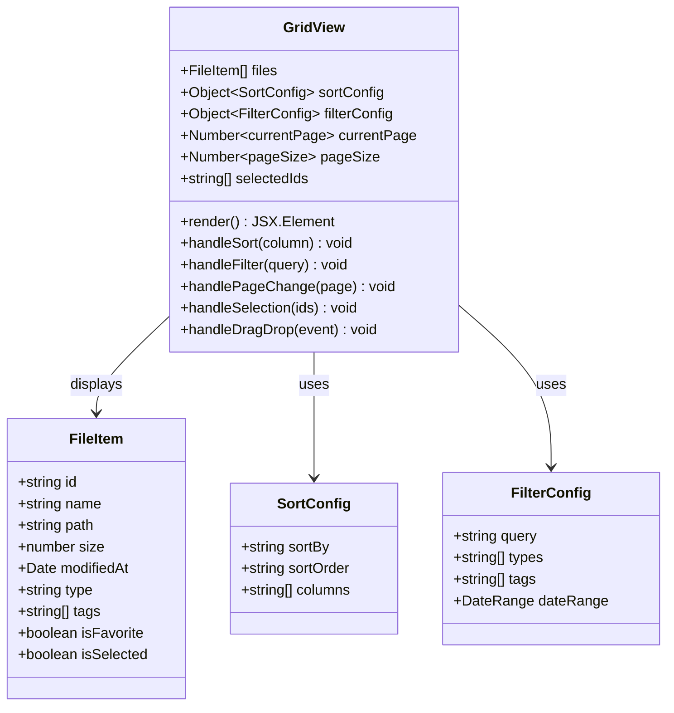

**Diagram sources**
- [src/pages/file-explorer/components/grid-view.tsx](file://src/pages/file-explorer/components/grid-view.tsx)

#### Sorting Algorithm:

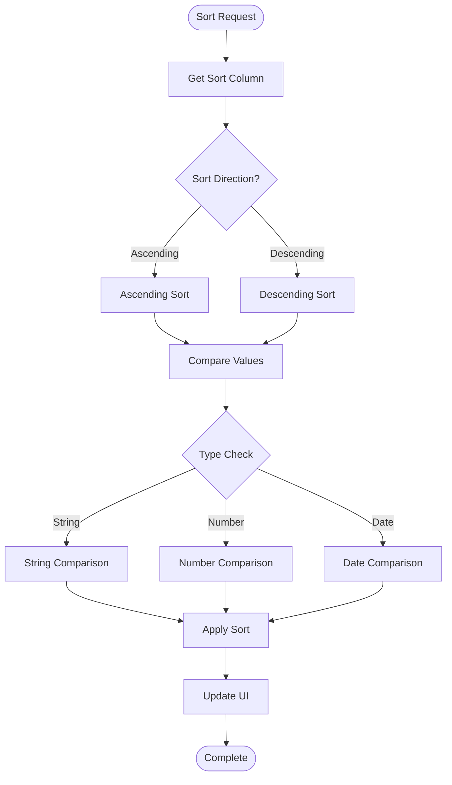

**Diagram sources**
- [src/pages/file-explorer/components/grid-view.tsx](file://src/pages/file-explorer/components/grid-view.tsx)

### Sidebar Navigation Component

The sidebar provides hierarchical navigation and quick access to important locations.

#### Key Features:
- **Tree Structure**: Nested folder hierarchy with expand/collapse
- **Favorites**: Persistent favorite locations with custom icons
- **Tags**: Color-coded tag system for file categorization
- **Recent Files**: Quick access to recently accessed files
- **Search Integration**: Integrated search within sidebar

#### State Management:

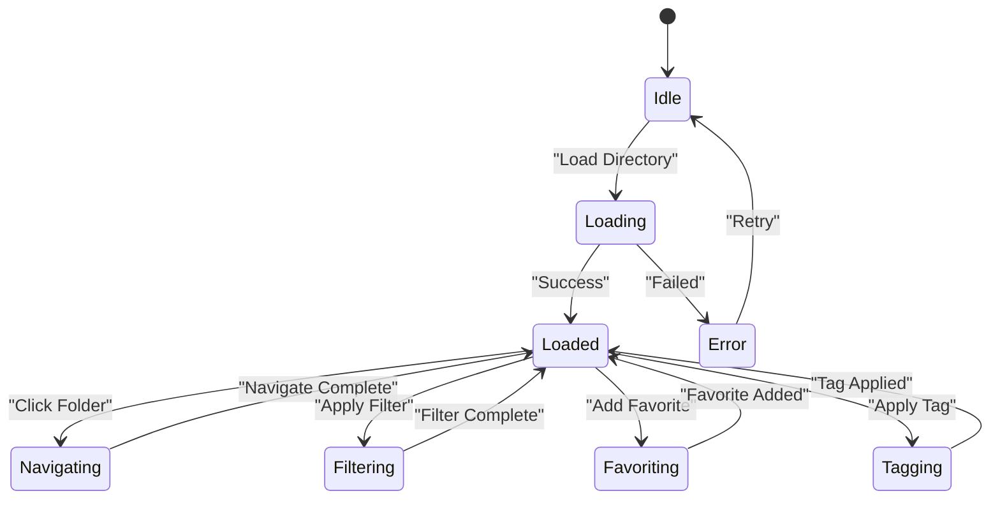

**Diagram sources**
- [src/pages/file-explorer/components/sidebar.tsx](file://src/pages/file-explorer/components/sidebar.tsx)

### Toolbar Component

The toolbar provides contextual actions and global operations.

#### Available Actions:
- **File Operations**: Create, copy, move, delete, rename
- **View Controls**: Toggle view modes, adjust density
- **Search Controls**: Advanced search with filters
- **Import/Export**: Batch operations for file management
- **Permission Management**: Bulk permission changes
- **Metadata Editing**: Edit file properties

#### Action Execution Flow:

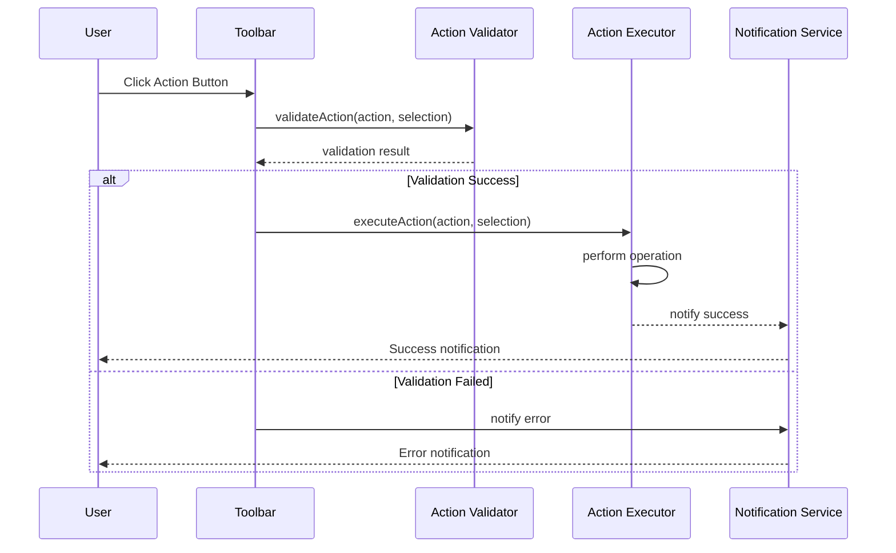

**Diagram sources**
- [src/pages/file-explorer/components/toolbar.tsx](file://src/pages/file-explorer/components/toolbar.tsx)

**Section sources**
- [src/pages/file-explorer/components/grid-view.tsx](file://src/pages/file-explorer/components/grid-view.tsx)
- [src/pages/file-explorer/components/sidebar.tsx](file://src/pages/file-explorer/components/sidebar.tsx)
- [src/pages/file-explorer/components/toolbar.tsx](file://src/pages/file-explorer/components/toolbar.tsx)

## Dependency Analysis

The File Explorer has well-defined dependencies between components and external services.

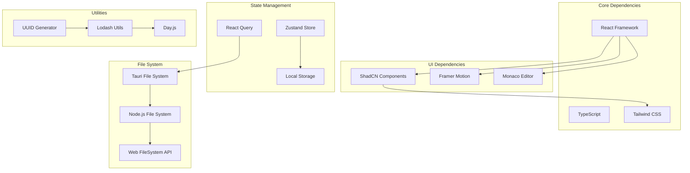

**Diagram sources**
- [package.json](file://package.json)
- [src/pages/file-explorer/index.tsx](file://src/pages/file-explorer/index.tsx)

**Section sources**
- [package.json](file://package.json)
- [src/pages/file-explorer/index.tsx](file://src/pages/file-explorer/index.tsx)

## Performance Considerations

### Optimization Strategies:

1. **Virtual Scrolling**: Implement virtual scrolling for large file lists to maintain smooth performance
2. **Lazy Loading**: Load file metadata on demand rather than upfront
3. **Debounced Search**: Implement debounced search to reduce API calls during typing
4. **Memoization**: Use React.memo and useMemo for expensive computations
5. **Caching Strategy**: Implement intelligent caching for frequently accessed files
6. **Batch Operations**: Group file operations to minimize API calls
7. **Progressive Loading**: Load content progressively as user navigates

### Memory Management:

- Implement proper cleanup of event listeners and subscriptions
- Use WeakRef for large object references when appropriate
- Clear unused caches periodically
- Monitor memory usage during long-running operations

### Network Optimization:

- Implement request deduplication for identical operations
- Use efficient serialization for large payloads
- Implement retry logic with exponential backoff
- Cache responses appropriately based on data volatility

## Troubleshooting Guide

### Common Issues and Solutions:

#### File Loading Problems:
- **Symptom**: Files not loading or slow performance
- **Solution**: Check file system permissions, verify network connectivity, clear cache
- **Debug**: Enable debug logging, check browser console for errors

#### Search Functionality Issues:
- **Symptom**: Search not returning expected results
- **Solution**: Verify search index is up-to-date, check search query syntax
- **Debug**: Log search queries and results, test with sample data

#### Permission Errors:
- **Symptom**: Cannot access certain files or directories
- **Solution**: Check application permissions, verify file ownership
- **Debug**: Log permission checks, test with different user contexts

#### Performance Issues:
- **Symptom**: Slow UI response or high memory usage
- **Solution**: Optimize rendering, implement virtual scrolling, clear unused data
- **Debug**: Use browser performance tools, monitor memory allocation

### Error Handling Patterns:

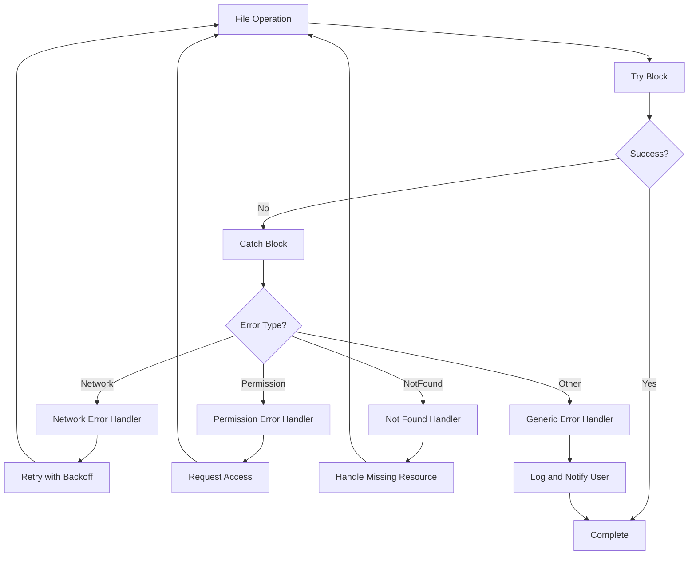

**Section sources**
- [src/pages/file-explorer/hooks/use-file-operations.ts](file://src/pages/file-explorer/hooks/use-file-operations.ts)

## Conclusion

The File Explorer provides a comprehensive solution for file management in security testing environments. With its advanced grid view, intuitive sidebar navigation, and powerful toolbar operations, it enables efficient organization and manipulation of security testing assets. The modular architecture ensures maintainability and scalability, while the focus on performance and accessibility makes it suitable for power users who need to manage large collections of files efficiently.

Key strengths include:
- **Advanced Grid View**: Sophisticated sorting, filtering, and pagination
- **Intuitive Navigation**: Sidebar with favorites and tag-based organization
- **Powerful Operations**: Bulk actions and context-aware toolbars
- **Performance Optimized**: Virtual scrolling and lazy loading for large datasets
- **Accessibility Focused**: Keyboard shortcuts and screen reader support
- **Extensible Design**: Modular architecture supporting custom workflows

## Appendices

### Keyboard Shortcuts Reference

| Shortcut | Action | Description |
|----------|--------|-------------|
| `Ctrl/Cmd + A` | Select All | Select all files in current view |
| `Ctrl/Cmd + C` | Copy | Copy selected files |
| `Ctrl/Cmd + V` | Paste | Paste files to current location |
| `Ctrl/Cmd + X` | Cut | Cut selected files |
| `Delete` | Delete | Delete selected files |
| `F2` | Rename | Rename selected file |
| `Space` | Preview | Preview selected file |
| `Enter` | Open | Open selected file/folder |
| `Esc` | Cancel | Cancel current operation |
| `/` | Search | Focus search input |
| `?` | Help | Show keyboard shortcuts |

### Drag and Drop Support

The File Explorer supports comprehensive drag-and-drop functionality:

- **File to File**: Reorder files within the same directory
- **File to Folder**: Move files between directories
- **Folder to Folder**: Reorganize directory structure
- **External Files**: Import files from desktop or other applications
- **Multi-Selection**: Drag multiple files simultaneously
- **Visual Feedback**: Clear drop zone indicators and preview

### Accessibility Features

- **Screen Reader Support**: Full ARIA labels and semantic markup
- **Keyboard Navigation**: Complete keyboard-only operation
- **High Contrast Mode**: Support for high contrast themes
- **Focus Management**: Logical tab order and focus indicators
- **Color Independence**: Information conveyed through multiple means
- **Reduced Motion**: Support for reduced motion preferences