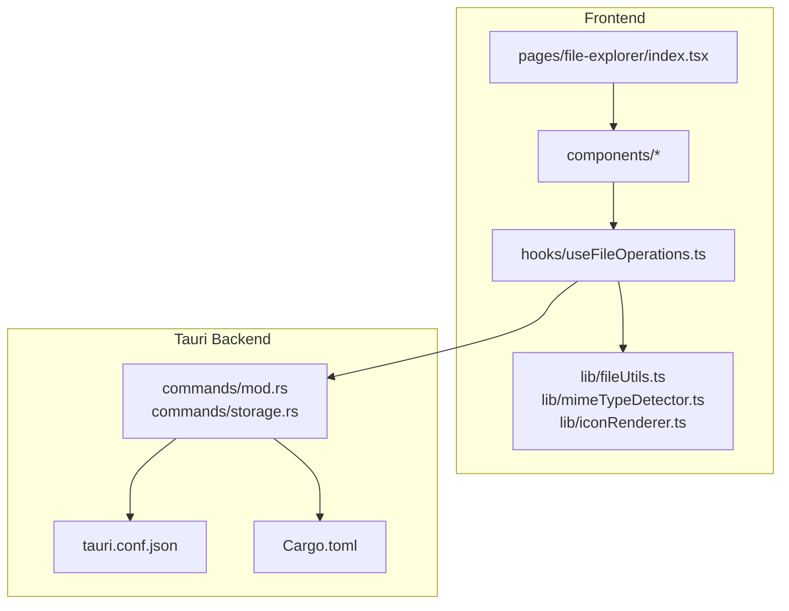
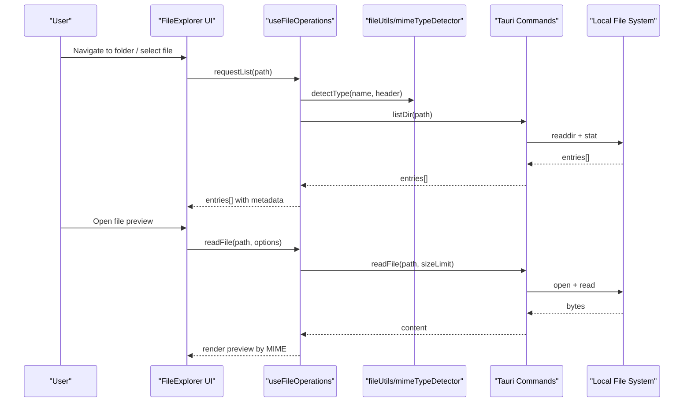
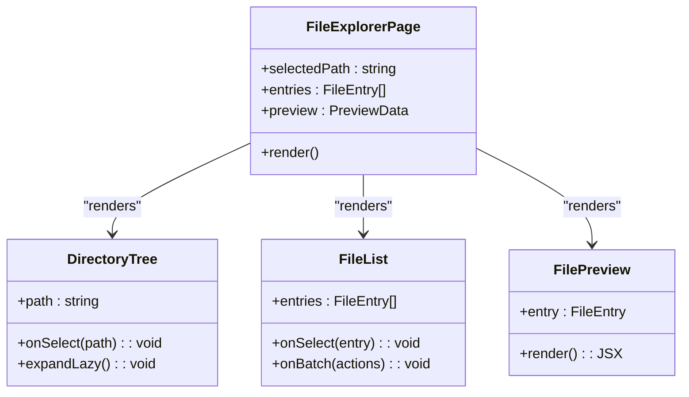
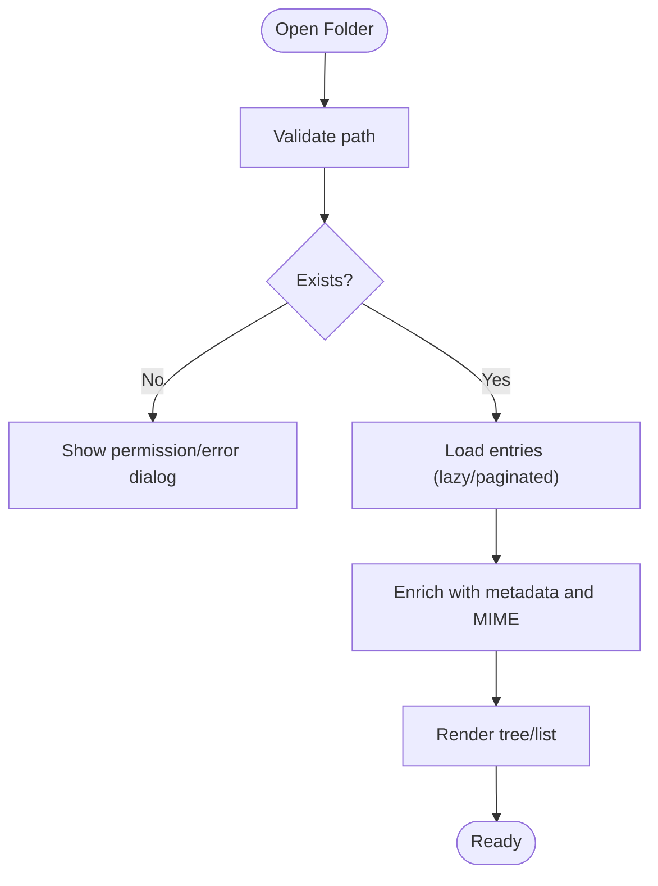
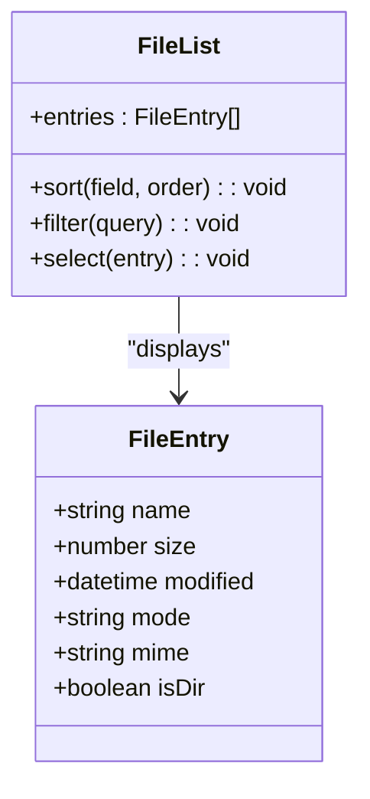
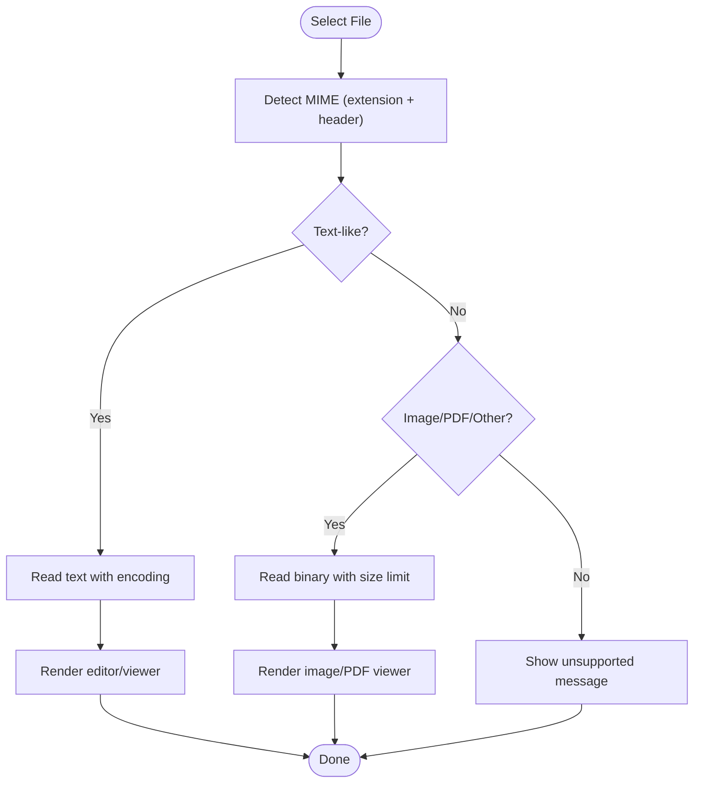
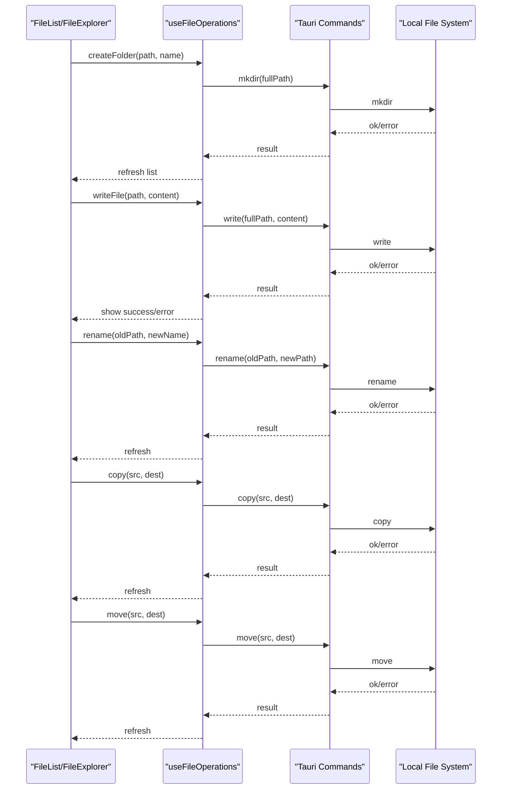
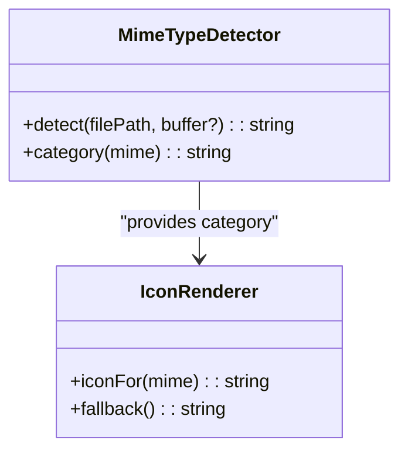
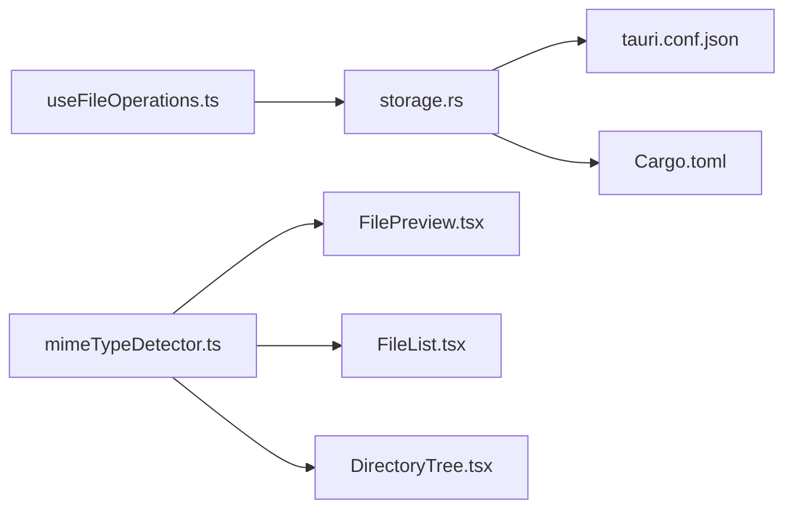

# Local File System Operations

<cite>
**Referenced Files in This Document**
- [file-explorer/index.tsx](file://src/pages/file-explorer/index.tsx)
- [file-explorer/types.ts](file://src/pages/file-explorer/types.ts)
- [file-explorer/constants.ts](file://src/pages/file-explorer/constants.ts)
- [file-explorer/components/FileExplorer.tsx](file://src/pages/file-explorer/components/FileExplorer.tsx)
- [file-explorer/components/DirectoryTree.tsx](file://src/pages/file-explorer/components/DirectoryTree.tsx)
- [file-explorer/components/FileList.tsx](file://src/pages/file-explorer/components/FileList.tsx)
- [file-explorer/components/FilePreview.tsx](file://src/pages/file-explorer/components/FilePreview.tsx)
- [file-explorer/hooks/useFileOperations.ts](file://src/pages/file-explorer/hooks/useFileOperations.ts)
- [file-explorer/lib/fileUtils.ts](file://src/pages/file-explorer/lib/fileUtils.ts)
- [file-explorer/lib/mimeTypeDetector.ts](file://src/pages/file-explorer/lib/mimeTypeDetector.ts)
- [file-explorer/lib/iconRenderer.ts](file://src/pages/file-explorer/lib/iconRenderer.ts)
- [tauri/src/commands/mod.rs](file://src-tauri/src/commands/mod.rs)
- [tauri/src/commands/storage.rs](file://src-tauri/src/commands/storage.rs)
- [tauri/Cargo.toml](file://src-tauri/Cargo.toml)
- [tauri/tauri.conf.json](file://src-tauri/tauri.conf.json)
</cite>

## Table of Contents
1. [Introduction](#introduction)
2. [Project Structure](#project-structure)
3. [Core Components](#core-components)
4. [Architecture Overview](#architecture-overview)
5. [Detailed Component Analysis](#detailed-component-analysis)
6. [Dependency Analysis](#dependency-analysis)
7. [Performance Considerations](#performance-considerations)
8. [Troubleshooting Guide](#troubleshooting-guide)
9. [Conclusion](#conclusion)

## Introduction
This document explains how Apprecon’s file explorer performs local file system operations, including navigation, directory traversal, metadata display, and CRUD actions (create, read, update, delete, rename, copy/move). It also covers file type detection, icon rendering, preview generation for various formats, and best practices for organizing security testing tools and configuration files. Guidance is provided for handling large directories efficiently, managing permissions, error scenarios, and performance optimization on large file systems.

## Project Structure
The file explorer spans the frontend React pages and Tauri backend commands:
- Frontend page and components implement UI, state, and orchestration for browsing and editing files.
- Utilities handle MIME type detection, icons, and preview logic.
- Hooks encapsulate file operation workflows.
- Tauri commands expose secure file system APIs to the frontend.

**Diagram sources**
- [file-explorer/index.tsx](file://src/pages/file-explorer/index.tsx)
- [file-explorer/components/FileExplorer.tsx](file://src/pages/file-explorer/components/FileExplorer.tsx)
- [file-explorer/hooks/useFileOperations.ts](file://src/pages/file-explorer/hooks/useFileOperations.ts)
- [file-explorer/lib/fileUtils.ts](file://src/pages/file-explorer/lib/fileUtils.ts)
- [file-explorer/lib/mimeTypeDetector.ts](file://src/pages/file-explorer/lib/mimeTypeDetector.ts)
- [file-explorer/lib/iconRenderer.ts](file://src/pages/file-explorer/lib/iconRenderer.ts)
- [tauri/src/commands/mod.rs](file://src-tauri/src/commands/mod.rs)
- [tauri/src/commands/storage.rs](file://src-tauri/src/commands/storage.rs)
- [tauri/tauri.conf.json](file://src-tauri/tauri.conf.json)
- [tauri/Cargo.toml](file://src-tauri/Cargo.toml)

**Section sources**
- [file-explorer/index.tsx](file://src/pages/file-explorer/index.tsx)
- [file-explorer/types.ts](file://src/pages/file-explorer/types.ts)
- [file-explorer/constants.ts](file://src/pages/file-explorer/constants.ts)
- [file-explorer/components/FileExplorer.tsx](file://src/pages/file-explorer/components/FileExplorer.tsx)
- [file-explorer/components/DirectoryTree.tsx](file://src/pages/file-explorer/components/DirectoryTree.tsx)
- [file-explorer/components/FileList.tsx](file://src/pages/file-explorer/components/FileList.tsx)
- [file-explorer/components/FilePreview.tsx](file://src/pages/file-explorer/components/FilePreview.tsx)
- [file-explorer/hooks/useFileOperations.ts](file://src/pages/file-explorer/hooks/useFileOperations.ts)
- [file-explorer/lib/fileUtils.ts](file://src/pages/file-explorer/lib/fileUtils.ts)
- [file-explorer/lib/mimeTypeDetector.ts](file://src/pages/file-explorer/lib/mimeTypeDetector.ts)
- [file-explorer/lib/iconRenderer.ts](file://src/pages/file-explorer/lib/iconRenderer.ts)
- [tauri/src/commands/mod.rs](file://src-tauri/src/commands/mod.rs)
- [tauri/src/commands/storage.rs](file://src-tauri/src/commands/storage.rs)
- [tauri/tauri.conf.json](file://src-tauri/tauri.conf.json)
- [tauri/Cargo.toml](file://src-tauri/Cargo.toml)

## Core Components
- Page entrypoint orchestrates layout, routing, and initial state for the file explorer.
- Directory tree component renders hierarchical navigation with lazy expansion.
- File list displays entries with metadata columns and supports selection and batch actions.
- Preview panel shows content previews based on detected MIME types.
- File operations hook centralizes create/read/update/delete/rename/copy/move flows and integrates with Tauri commands.
- Utilities provide MIME detection, icon mapping, and safe path helpers.

Key responsibilities:
- Navigation and traversal: lazy loading, pagination/virtualization for large directories.
- Metadata display: name, size, modified time, permissions, MIME type.
- Operations: create folder/file, read content, update content, delete, rename, copy/move.
- Type detection and preview: extension-based and magic-byte heuristics; text, image, PDF, code, JSON, YAML, CSV.
- Icons: consistent mapping from MIME/type to SVG/PNG assets.

**Section sources**
- [file-explorer/index.tsx](file://src/pages/file-explorer/index.tsx)
- [file-explorer/components/DirectoryTree.tsx](file://src/pages/file-explorer/components/DirectoryTree.tsx)
- [file-explorer/components/FileList.tsx](file://src/pages/file-explorer/components/FileList.tsx)
- [file-explorer/components/FilePreview.tsx](file://src/pages/file-explorer/components/FilePreview.tsx)
- [file-explorer/hooks/useFileOperations.ts](file://src/pages/file-explorer/hooks/useFileOperations.ts)
- [file-explorer/lib/fileUtils.ts](file://src/pages/file-explorer/lib/fileUtils.ts)
- [file-explorer/lib/mimeTypeDetector.ts](file://src/pages/file-explorer/lib/mimeTypeDetector.ts)
- [file-explorer/lib/iconRenderer.ts](file://src/pages/file-explorer/lib/iconRenderer.ts)

## Architecture Overview
The file explorer uses a layered architecture:
- UI layer (React components) handles user interactions and rendering.
- State and workflow layer (hooks) coordinate operations and manage local state.
- Utility layer provides type detection, icons, and path utilities.
- Tauri command layer exposes secure file system methods to the frontend.

**Diagram sources**
- [file-explorer/components/FileExplorer.tsx](file://src/pages/file-explorer/components/FileExplorer.tsx)
- [file-explorer/hooks/useFileOperations.ts](file://src/pages/file-explorer/hooks/useFileOperations.ts)
- [file-explorer/lib/mimeTypeDetector.ts](file://src/pages/file-explorer/lib/mimeTypeDetector.ts)
- [tauri/src/commands/storage.rs](file://src-tauri/src/commands/storage.rs)

## Detailed Component Analysis

### File Explorer Page and Layout
- Initializes root state, selected paths, and view modes.
- Composes DirectoryTree, FileList, and FilePreview panels.
- Delegates heavy operations to hooks and Tauri commands.

**Diagram sources**
- [file-explorer/index.tsx](file://src/pages/file-explorer/index.tsx)
- [file-explorer/components/DirectoryTree.tsx](file://src/pages/file-explorer/components/DirectoryTree.tsx)
- [file-explorer/components/FileList.tsx](file://src/pages/file-explorer/components/FileList.tsx)
- [file-explorer/components/FilePreview.tsx](file://src/pages/file-explorer/components/FilePreview.tsx)

**Section sources**
- [file-explorer/index.tsx](file://src/pages/file-explorer/index.tsx)
- [file-explorer/components/FileExplorer.tsx](file://src/pages/file-explorer/components/FileExplorer.tsx)

### Directory Traversal and Navigation
- Lazy expansion of nested folders to avoid loading entire trees.
- Pagination or virtualized lists for large directories.
- Path normalization and validation before issuing commands.

**Diagram sources**
- [file-explorer/components/DirectoryTree.tsx](file://src/pages/file-explorer/components/DirectoryTree.tsx)
- [file-explorer/hooks/useFileOperations.ts](file://src/pages/file-explorer/hooks/useFileOperations.ts)
- [file-explorer/lib/fileUtils.ts](file://src/pages/file-explorer/lib/fileUtils.ts)

**Section sources**
- [file-explorer/components/DirectoryTree.tsx](file://src/pages/file-explorer/components/DirectoryTree.tsx)
- [file-explorer/hooks/useFileOperations.ts](file://src/pages/file-explorer/hooks/useFileOperations.ts)
- [file-explorer/lib/fileUtils.ts](file://src/pages/file-explorer/lib/fileUtils.ts)

### File List and Metadata Display
- Displays name, size, modified time, permissions, and MIME type.
- Supports sorting, filtering, and selection for batch operations.
- Renders icons based on MIME/type mapping.

**Diagram sources**
- [file-explorer/components/FileList.tsx](file://src/pages/file-explorer/components/FileList.tsx)
- [file-explorer/types.ts](file://src/pages/file-explorer/types.ts)

**Section sources**
- [file-explorer/components/FileList.tsx](file://src/pages/file-explorer/components/FileList.tsx)
- [file-explorer/types.ts](file://src/pages/file-explorer/types.ts)

### File Preview Generation
- Detects MIME type using extension and optional header sniffing.
- Renders text/code editors for scripts and configs.
- Shows images, PDFs, and other supported formats safely.

**Diagram sources**
- [file-explorer/components/FilePreview.tsx](file://src/pages/file-explorer/components/FilePreview.tsx)
- [file-explorer/lib/mimeTypeDetector.ts](file://src/pages/file-explorer/lib/mimeTypeDetector.ts)
- [file-explorer/lib/iconRenderer.ts](file://src/pages/file-explorer/lib/iconRenderer.ts)

**Section sources**
- [file-explorer/components/FilePreview.tsx](file://src/pages/file-explorer/components/FilePreview.tsx)
- [file-explorer/lib/mimeTypeDetector.ts](file://src/pages/file-explorer/lib/mimeTypeDetector.ts)
- [file-explorer/lib/iconRenderer.ts](file://src/pages/file-explorer/lib/iconRenderer.ts)

### File Operations: Create, Read, Update, Delete, Rename, Copy/Move
- Encapsulated in a dedicated hook that coordinates UI state and Tauri calls.
- Validates inputs, enforces size limits, and handles errors consistently.
- Provides feedback via toasts/dialogs and updates listings atomically.

**Diagram sources**
- [file-explorer/hooks/useFileOperations.ts](file://src/pages/file-explorer/hooks/useFileOperations.ts)
- [tauri/src/commands/storage.rs](file://src-tauri/src/commands/storage.rs)

**Section sources**
- [file-explorer/hooks/useFileOperations.ts](file://src/pages/file-explorer/hooks/useFileOperations.ts)
- [tauri/src/commands/storage.rs](file://src-tauri/src/commands/storage.rs)

### File Type Detection and Icon Rendering
- Extension-based mapping plus optional magic-byte checks for accuracy.
- Normalizes MIME types to internal categories for consistent icons and viewers.
- Caches results to reduce overhead on repeated operations.

**Diagram sources**
- [file-explorer/lib/mimeTypeDetector.ts](file://src/pages/file-explorer/lib/mimeTypeDetector.ts)
- [file-explorer/lib/iconRenderer.ts](file://src/pages/file-explorer/lib/iconRenderer.ts)

**Section sources**
- [file-explorer/lib/mimeTypeDetector.ts](file://src/pages/file-explorer/lib/mimeTypeDetector.ts)
- [file-explorer/lib/iconRenderer.ts](file://src/pages/file-explorer/lib/iconRenderer.ts)

## Dependency Analysis
The file explorer depends on:
- Tauri commands for secure file system access.
- Configuration for capabilities and permissions.
- Internal utilities for MIME detection and icons.

**Diagram sources**
- [file-explorer/hooks/useFileOperations.ts](file://src/pages/file-explorer/hooks/useFileOperations.ts)
- [file-explorer/lib/mimeTypeDetector.ts](file://src/pages/file-explorer/lib/mimeTypeDetector.ts)
- [file-explorer/components/FilePreview.tsx](file://src/pages/file-explorer/components/FilePreview.tsx)
- [file-explorer/components/FileList.tsx](file://src/pages/file-explorer/components/FileList.tsx)
- [file-explorer/components/DirectoryTree.tsx](file://src/pages/file-explorer/components/DirectoryTree.tsx)
- [tauri/src/commands/storage.rs](file://src-tauri/src/commands/storage.rs)
- [tauri/tauri.conf.json](file://src-tauri/tauri.conf.json)
- [tauri/Cargo.toml](file://src-tauri/Cargo.toml)

**Section sources**
- [file-explorer/hooks/useFileOperations.ts](file://src/pages/file-explorer/hooks/useFileOperations.ts)
- [file-explorer/lib/mimeTypeDetector.ts](file://src/pages/file-explorer/lib/mimeTypeDetector.ts)
- [file-explorer/components/FilePreview.tsx](file://src/pages/file-explorer/components/FilePreview.tsx)
- [file-explorer/components/FileList.tsx](file://src/pages/file-explorer/components/FileList.tsx)
- [file-explorer/components/DirectoryTree.tsx](file://src/pages/file-explorer/components/DirectoryTree.tsx)
- [tauri/src/commands/storage.rs](file://src-tauri/src/commands/storage.rs)
- [tauri/tauri.conf.json](file://src-tauri/tauri.conf.json)
- [tauri/Cargo.toml](file://src-tauri/Cargo.toml)

## Performance Considerations
- Lazy directory loading: expand nodes on demand; avoid preloading deep trees.
- Virtualization/pagination: render only visible rows for large folders.
- Bounded reads: enforce maximum preview sizes to prevent memory spikes.
- Debounced search: throttle input events during filtering.
- Batch operations: group multiple writes/renames to minimize I/O.
- Caching: cache MIME types and icons to reduce recomputation.
- Background tasks: offload heavy operations to workers or Tauri async handlers.

[No sources needed since this section provides general guidance]

## Troubleshooting Guide
Common issues and resolutions:
- Permission denied: verify OS-level permissions and Tauri capability settings; prompt users to adjust ACLs if necessary.
- Path resolution errors: normalize paths and validate existence before operations.
- Large file preview failures: enforce size limits and fallback to basic metadata when content cannot be read.
- Encoding problems: detect and handle text encodings gracefully; allow manual override.
- Network or disk latency: add timeouts and retry logic for transient failures.
- Inconsistent MIME types: combine extension and header sniffing; fall back to safe defaults.

Operational tips:
- Provide clear error messages and actionable steps.
- Log operation details for diagnostics without exposing sensitive data.
- Use atomic operations where possible to maintain consistency.

**Section sources**
- [file-explorer/hooks/useFileOperations.ts](file://src/pages/file-explorer/hooks/useFileOperations.ts)
- [file-explorer/lib/fileUtils.ts](file://src/pages/file-explorer/lib/fileUtils.ts)
- [tauri/src/commands/storage.rs](file://src-tauri/src/commands/storage.rs)

## Conclusion
Apprecon’s file explorer combines a responsive UI with robust Tauri-backed file system operations. By leveraging lazy loading, virtualization, bounded reads, and careful MIME detection, it delivers efficient navigation and preview across diverse file types. Following the patterns outlined here ensures scalability, reliability, and a smooth user experience even on large file systems.

[No sources needed since this section summarizes without analyzing specific files]