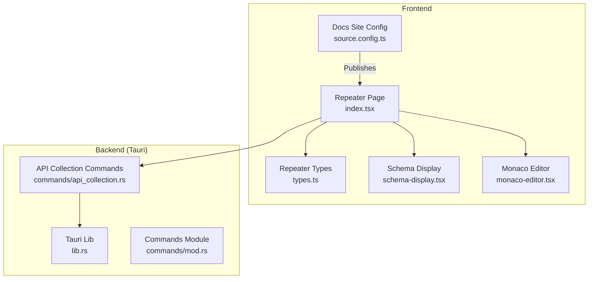
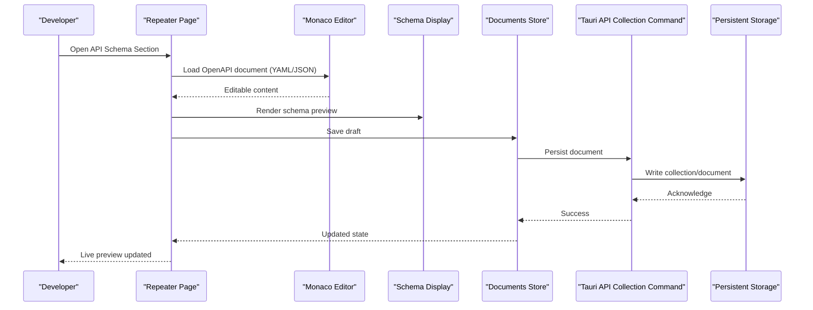
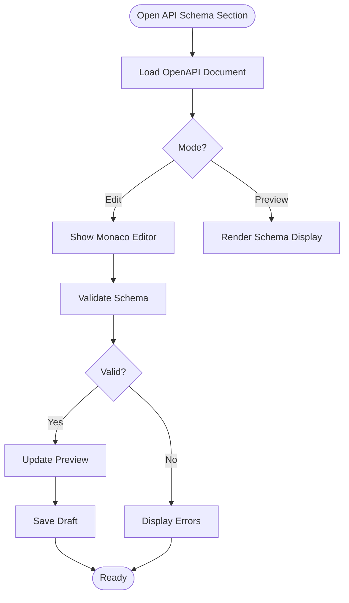
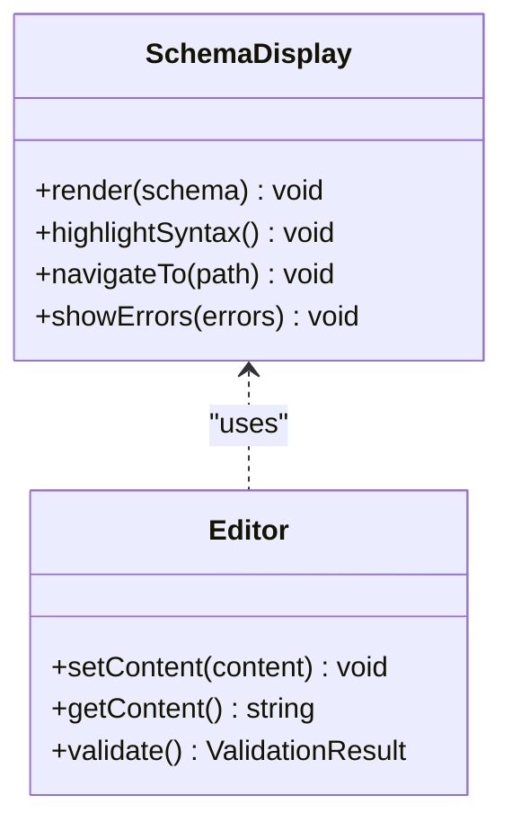
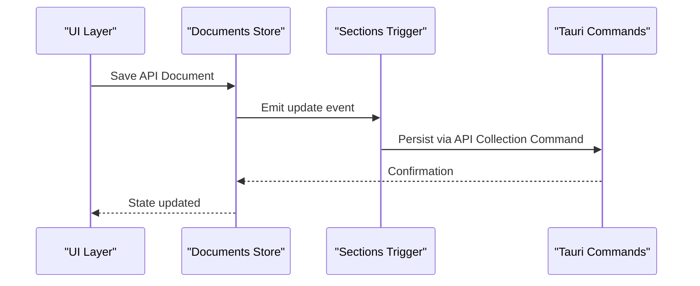
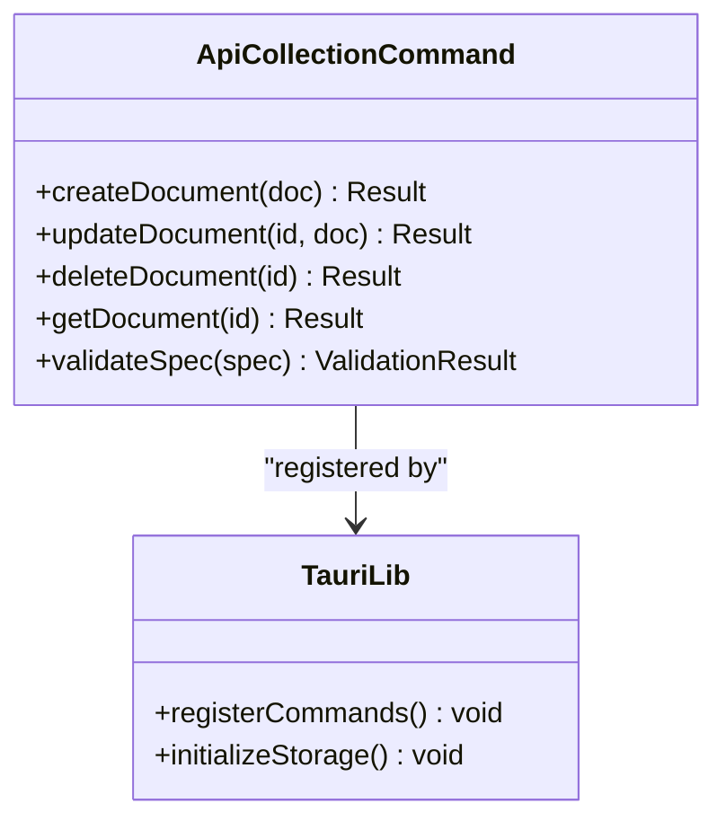
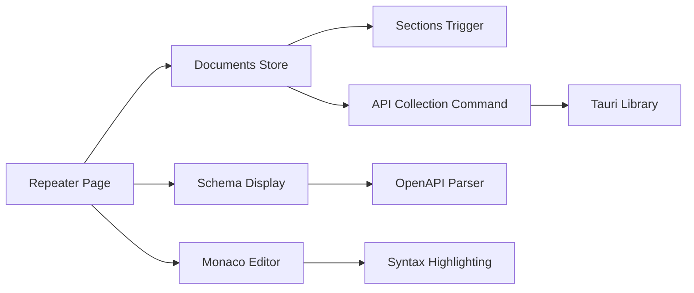

# API Schema Section

<cite>
**Referenced Files in This Document**
- [README.md](file://README.md)
- [package.json](file://package.json)
- [next.config.mjs](file://docs/website/next.config.mjs)
- [source.config.ts](file://docs/website/source.config.ts)
- [index.tsx](file://src/pages/repeater/index.tsx)
- [types.ts](file://src/pages/repeater/types.ts)
- [api.ts](file://src/pages/repeater/api.ts)
- [schema-display.tsx](file://src/components/ai-elements/schema-display.tsx)
- [monaco-editor.tsx](file://src/components/ui/monaco-editor.tsx)
- [documents.ts](file://src/stores/documents.ts)
- [sections.ts](file://src/triggers/documents/sections.ts)
- [lib.rs](file://src-tauri/src/lib.rs)
- [mod.rs](file://src-tauri/src/commands/mod.rs)
- [api_collection.rs](file://src-tauri/src/commands/api_collection.rs)
</cite>

## Table of Contents
1. [Introduction](#introduction)
2. [Project Structure](#project-structure)
3. [Core Components](#core-components)
4. [Architecture Overview](#architecture-overview)
5. [Detailed Component Analysis](#detailed-component-analysis)
6. [Dependency Analysis](#dependency-analysis)
7. [Performance Considerations](#performance-considerations)
8. [Troubleshooting Guide](#troubleshooting-guide)
9. [Conclusion](#conclusion)

## Introduction
This document explains how Apprecon’s API schema section type enables you to define, validate, and display API specifications using OpenAPI/Swagger. It covers request/response schemas, endpoint documentation, interactive features, validation strategies, versioning approaches, and collaboration workflows for API documentation within the application.

## Project Structure
Apprecon is a desktop app with a React frontend (Vite + Next.js docs site) and a Rust backend via Tauri. The API schema section integrates:
- Frontend editors and viewers for OpenAPI documents
- Validation and rendering components
- Backend commands for persistence and operations on API collections
- Documentation site configuration for publishing API specs

**Diagram sources**
- [index.tsx](file://src/pages/repeater/index.tsx)
- [types.ts](file://src/pages/repeater/types.ts)
- [schema-display.tsx](file://src/components/ai-elements/schema-display.tsx)
- [monaco-editor.tsx](file://src/components/ui/monaco-editor.tsx)
- [source.config.ts](file://docs/website/source.config.ts)
- [lib.rs](file://src-tauri/src/lib.rs)
- [mod.rs](file://src-tauri/src/commands/mod.rs)
- [api_collection.rs](file://src-tauri/src/commands/api_collection.rs)

**Section sources**
- [README.md](file://README.md)
- [package.json](file://package.json)
- [next.config.mjs](file://docs/website/next.config.mjs)
- [source.config.ts](file://docs/website/source.config.ts)

## Core Components
- Repeater page orchestrates API requests and displays results; it also hosts the API schema editor/viewer integration.
- Schema display component renders structured schemas (JSON/YAML/OpenAPI) with syntax highlighting and navigation.
- Monaco editor provides rich editing capabilities for OpenAPI documents.
- Documents store manages persistent storage of API documents and sections.
- Tauri commands expose backend operations for saving, loading, and managing API collections.

Key responsibilities:
- Define OpenAPI/Swagger documents (YAML or JSON)
- Validate schemas against OpenAPI specification
- Render interactive endpoint documentation
- Persist and version API documents
- Integrate with the documentation site for publishing

**Section sources**
- [index.tsx](file://src/pages/repeater/index.tsx)
- [schema-display.tsx](file://src/components/ai-elements/schema-display.tsx)
- [monaco-editor.tsx](file://src/components/ui/monaco-editor.tsx)
- [documents.ts](file://src/stores/documents.ts)
- [api_collection.rs](file://src-tauri/src/commands/api_collection.rs)

## Architecture Overview
The API schema workflow spans UI editing, validation, persistence, and publishing:

**Diagram sources**
- [index.tsx](file://src/pages/repeater/index.tsx)
- [monaco-editor.tsx](file://src/components/ui/monaco-editor.tsx)
- [schema-display.tsx](file://src/components/ai-elements/schema-display.tsx)
- [documents.ts](file://src/stores/documents.ts)
- [api_collection.rs](file://src-tauri/src/commands/api_collection.rs)

## Detailed Component Analysis

### Repeater Page Integration
The Repeater page serves as the entry point for API schema editing and viewing. It coordinates:
- Loading and displaying OpenAPI documents
- Switching between editor and preview modes
- Triggering validation and error feedback
- Saving drafts and syncing with backend storage

**Diagram sources**
- [index.tsx](file://src/pages/repeater/index.tsx)
- [schema-display.tsx](file://src/components/ai-elements/schema-display.tsx)
- [monaco-editor.tsx](file://src/components/ui/monaco-editor.tsx)

**Section sources**
- [index.tsx](file://src/pages/repeater/index.tsx)
- [types.ts](file://src/pages/repeater/types.ts)

### Schema Display Component
Renders structured schemas with:
- Syntax highlighting for YAML/JSON
- Collapsible sections for paths, parameters, responses
- Navigation between endpoints and models
- Error annotations for invalid schemas

**Diagram sources**
- [schema-display.tsx](file://src/components/ai-elements/schema-display.tsx)
- [monaco-editor.tsx](file://src/components/ui/monaco-editor.tsx)

**Section sources**
- [schema-display.tsx](file://src/components/ai-elements/schema-display.tsx)

### Documents Store and Sections
Manages persistence and organization of API documents:
- Stores multiple API collections and versions
- Tracks document metadata (title, description, version)
- Integrates with triggers for automatic updates

**Diagram sources**
- [documents.ts](file://src/stores/documents.ts)
- [sections.ts](file://src/triggers/documents/sections.ts)
- [api_collection.rs](file://src-tauri/src/commands/api_collection.rs)

**Section sources**
- [documents.ts](file://src/stores/documents.ts)
- [sections.ts](file://src/triggers/documents/sections.ts)

### Tauri Backend Commands
Provides secure operations for API collection management:
- Create, read, update, delete API documents
- Validate OpenAPI specifications
- Export/import collections
- Manage versions and tags

**Diagram sources**
- [api_collection.rs](file://src-tauri/src/commands/api_collection.rs)
- [lib.rs](file://src-tauri/src/lib.rs)
- [mod.rs](file://src-tauri/src/commands/mod.rs)

**Section sources**
- [api_collection.rs](file://src-tauri/src/commands/api_collection.rs)
- [lib.rs](file://src-tauri/src/lib.rs)
- [mod.rs](file://src-tauri/src/commands/mod.rs)

## Dependency Analysis
The API schema section depends on several core modules:

**Diagram sources**
- [index.tsx](file://src/pages/repeater/index.tsx)
- [schema-display.tsx](file://src/components/ai-elements/schema-display.tsx)
- [monaco-editor.tsx](file://src/components/ui/monaco-editor.tsx)
- [documents.ts](file://src/stores/documents.ts)
- [sections.ts](file://src/triggers/documents/sections.ts)
- [api_collection.rs](file://src-tauri/src/commands/api_collection.rs)
- [lib.rs](file://src-tauri/src/lib.rs)

**Section sources**
- [index.tsx](file://src/pages/repeater/index.tsx)
- [schema-display.tsx](file://src/components/ai-elements/schema-display.tsx)
- [monaco-editor.tsx](file://src/components/ui/monaco-editor.tsx)
- [documents.ts](file://src/stores/documents.ts)
- [sections.ts](file://src/triggers/documents/sections.ts)
- [api_collection.rs](file://src-tauri/src/commands/api_collection.rs)
- [lib.rs](file://src-tauri/src/lib.rs)

## Performance Considerations
- Large OpenAPI documents should be paginated or lazy-loaded to maintain responsiveness
- Schema validation should be debounced during editing to avoid blocking the UI
- Use incremental parsing for YAML/JSON to improve performance with large files
- Cache validated schemas to prevent repeated validation overhead
- Implement virtual scrolling for long endpoint lists in the schema viewer

## Troubleshooting Guide
Common issues and solutions:
- **Invalid OpenAPI Specification**: Check for syntax errors and missing required fields
- **Schema Rendering Problems**: Verify JSON/YAML formatting and ensure proper escaping
- **Persistence Failures**: Ensure backend commands are properly registered and storage is initialized
- **Version Conflicts**: Use semantic versioning and clear change logs for API updates
- **Collaboration Issues**: Implement proper locking mechanisms and conflict resolution strategies

**Section sources**
- [api_collection.rs](file://src-tauri/src/commands/api_collection.rs)
- [documents.ts](file://src/stores/documents.ts)

## Conclusion
Apprecon’s API schema section provides a comprehensive solution for defining, validating, and documenting APIs using OpenAPI/Swagger standards. The integrated editor, validator, and viewer create a seamless workflow for API development and collaboration. With robust persistence, versioning support, and publishing capabilities, teams can maintain accurate and up-to-date API documentation throughout the development lifecycle.