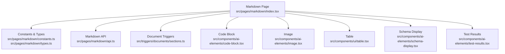
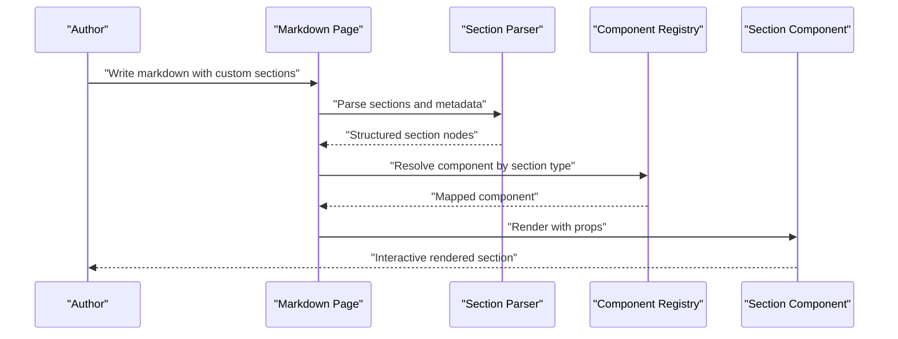
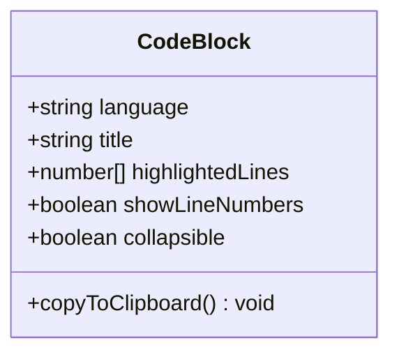
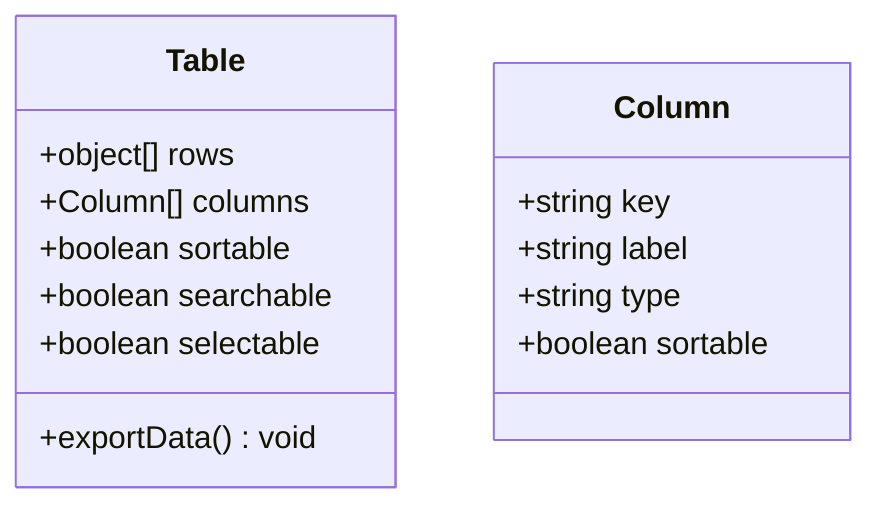
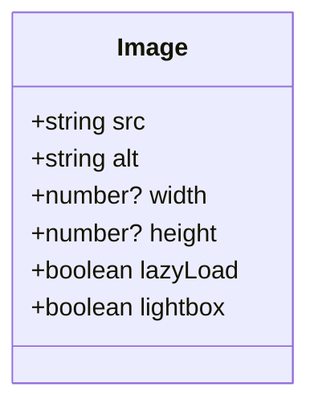
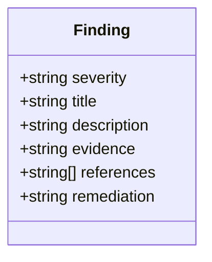
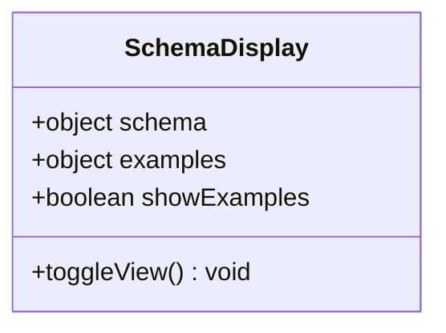
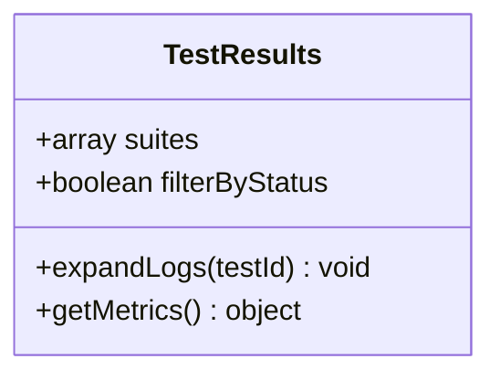
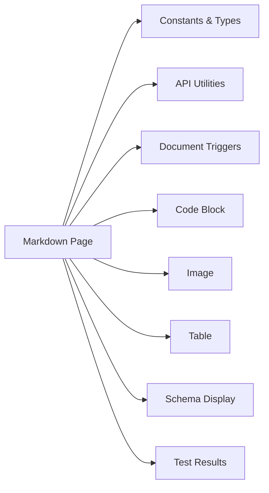

# Built-in Section Types

<cite>
**Referenced Files in This Document**
- [markdown/index.tsx](file://src/pages/markdown/index.tsx)
- [markdown/constants.ts](file://src/pages/markdown/constants.ts)
- [markdown/types.ts](file://src/pages/markdown/types.ts)
- [markdown/api.ts](file://src/pages/markdown/api.ts)
- [components/ai-elements/code-block.tsx](file://src/components/ai-elements/code-block.tsx)
- [components/ai-elements/image.tsx](file://src/components/ai-elements/image.tsx)
- [components/ui/table.tsx](file://src/components/ui/table.tsx)
- [components/ai-elements/schema-display.tsx](file://src/components/ai-elements/schema-display.tsx)
- [components/ai-elements/test-results.tsx](file://src/components/ai-elements/test-results.tsx)
- [triggers/documents/sections.ts](file://src/triggers/documents/sections.ts)
</cite>

## Table of Contents
1. [Introduction](#introduction)
2. [Project Structure](#project-structure)
3. [Core Components](#core-components)
4. [Architecture Overview](#architecture-overview)
5. [Detailed Component Analysis](#detailed-component-analysis)
6. [Dependency Analysis](#dependency-analysis)
7. [Performance Considerations](#performance-considerations)
8. [Troubleshooting Guide](#troubleshooting-guide)
9. [Conclusion](#conclusion)

## Introduction
This document explains Apprecon’s built-in custom section types used within markdown documents. It covers the purpose, configuration options, data format requirements, and rendering behavior for each supported section type: code blocks, tables, images, security findings, API schemas, and test results. Practical usage guidance and best practices are included to help you author effective markdown content that leverages these sections.

## Project Structure
Apprecon’s markdown subsystem is implemented as a page with associated components and triggers. The markdown page coordinates rendering of custom sections, while dedicated UI components handle each section type. Triggers expose actions and integrations for working with document sections.

**Diagram sources**
- [markdown/index.tsx](file://src/pages/markdown/index.tsx)
- [markdown/constants.ts](file://src/pages/markdown/constants.ts)
- [markdown/types.ts](file://src/pages/markdown/types.ts)
- [markdown/api.ts](file://src/pages/markdown/api.ts)
- [triggers/documents/sections.ts](file://src/triggers/documents/sections.ts)
- [components/ai-elements/code-block.tsx](file://src/components/ai-elements/code-block.tsx)
- [components/ai-elements/image.tsx](file://src/components/ai-elements/image.tsx)
- [components/ui/table.tsx](file://src/components/ui/table.tsx)
- [components/ai-elements/schema-display.tsx](file://src/components/ai-elements/schema-display.tsx)
- [components/ai-elements/test-results.tsx](file://src/components/ai-elements/test-results.tsx)

**Section sources**
- [markdown/index.tsx](file://src/pages/markdown/index.tsx)
- [markdown/constants.ts](file://src/pages/markdown/constants.ts)
- [markdown/types.ts](file://src/pages/markdown/types.ts)
- [markdown/api.ts](file://src/pages/markdown/api.ts)
- [triggers/documents/sections.ts](file://src/triggers/documents/sections.ts)

## Core Components
The following built-in section types are available in Apprecon markdown documents. Each section type has a specific purpose, configuration options, and expected data format.

- Code Blocks
  - Purpose: Render syntax-highlighted code with optional metadata such as language, title, and line highlighting.
  - Configuration options: language identifier, title/caption, line ranges to highlight, copy-to-clipboard toggle, collapsible header.
  - Data format requirements: A fenced code block with a recognized language tag; additional metadata can be provided via attributes or frontmatter depending on the parser.
  - Rendering behavior: Syntax highlighting, optional line numbers, interactive copy button, and collapsible sections when enabled.
  - Best practices: Use explicit language tags for accurate highlighting; keep snippets focused; use line highlighting sparingly to draw attention to key parts.

- Tables
  - Purpose: Present structured tabular data with sorting, filtering, and pagination support where applicable.
  - Configuration options: column definitions (labels, types), sortable columns, searchable fields, row selection, and export options.
  - Data format requirements: An array of objects representing rows; each object maps to a column by key. Column metadata may include display names, formatters, and sortability flags.
  - Rendering behavior: Renders a responsive table with header labels derived from column definitions; supports inline editing if configured.
  - Best practices: Keep column sets consistent across rows; provide clear labels; avoid overly wide tables by using nested details or tabs.

- Images
  - Purpose: Embed and display images with controls for zooming, resizing, and alternate text accessibility.
  - Configuration options: source URL or base64 payload, alt text, width/height constraints, lazy loading, and lightbox behavior.
  - Data format requirements: Image reference including a valid source and descriptive alt text; optional size hints.
  - Rendering behavior: Displays the image with responsive sizing; provides zoom and navigation when lightbox is enabled.
  - Best practices: Always include meaningful alt text; prefer optimized formats and sizes; use lazy loading for large galleries.

- Security Findings
  - Purpose: Present security-related findings with severity, description, evidence, and remediation guidance.
  - Configuration options: severity level, category, title, description, evidence snippet, references, and remediation steps.
  - Data format requirements: Structured finding object containing required fields like severity, title, and description; optional evidence and references.
  - Rendering behavior: Highlights severity visually; groups related findings; allows expanding evidence and links to external references.
  - Best practices: Be precise about impact and likelihood; include actionable remediation; link to authoritative sources.

- API Schemas
  - Purpose: Visualize and explore API request/response schemas, parameters, and examples.
  - Configuration options: schema definition (e.g., JSON Schema-like structure), example payloads, parameter descriptions, and validation rules.
  - Data format requirements: A schema object describing properties, types, enums, and examples; optional request/response context.
  - Rendering behavior: Renders a browsable schema tree with expandable nodes, type annotations, and example values; supports toggling between request and response views.
  - Best practices: Keep schemas versioned and aligned with implementations; include realistic examples; document constraints clearly.

- Test Results
  - Purpose: Display automated test outcomes with pass/fail status, durations, logs, and stack traces.
  - Configuration options: suite name, test cases with status and messages, aggregated metrics, and drill-down into logs.
  - Data format requirements: A result object containing test suites and individual tests with status, duration, and optional error details.
  - Rendering behavior: Summarizes overall pass rate; lists failures with expandable logs; supports filtering by status.
  - Best practices: Include concise failure messages; attach relevant logs; group related tests into suites for clarity.

**Section sources**
- [components/ai-elements/code-block.tsx](file://src/components/ai-elements/code-block.tsx)
- [components/ui/table.tsx](file://src/components/ui/table.tsx)
- [components/ai-elements/image.tsx](file://src/components/ai-elements/image.tsx)
- [components/ai-elements/schema-display.tsx](file://src/components/ai-elements/schema-display.tsx)
- [components/ai-elements/test-results.tsx](file://src/components/ai-elements/test-results.tsx)

## Architecture Overview
The markdown page orchestrates rendering of custom sections by mapping section types to their corresponding components. Constants and types define the shape of section data, while the API layer provides utilities for creating, updating, and querying sections. Triggers integrate document sections with other Apprecon features.

**Diagram sources**
- [markdown/index.tsx](file://src/pages/markdown/index.tsx)
- [markdown/constants.ts](file://src/pages/markdown/constants.ts)
- [markdown/types.ts](file://src/pages/markdown/types.ts)
- [markdown/api.ts](file://src/pages/markdown/api.ts)

## Detailed Component Analysis

### Code Blocks
- Purpose: Provide syntax-highlighted code displays with optional interactivity.
- Key behaviors: Language detection, line highlighting, copy-to-clipboard, collapsible headers.
- Data model: Includes language, title, highlighted lines, and visibility toggles.
- Usage tips: Prefer explicit language tags; limit highlighted lines to essential areas; use titles for context.

**Diagram sources**
- [components/ai-elements/code-block.tsx](file://src/components/ai-elements/code-block.tsx)

**Section sources**
- [components/ai-elements/code-block.tsx](file://src/components/ai-elements/code-block.tsx)

### Tables
- Purpose: Render structured data with sorting, searching, and selection capabilities.
- Key behaviors: Column definitions, row mapping, pagination, and export hooks.
- Data model: Array of row objects plus column metadata (label, type, sortable).
- Usage tips: Normalize keys across rows; provide human-readable labels; enable search for large datasets.

**Diagram sources**
- [components/ui/table.tsx](file://src/components/ui/table.tsx)

**Section sources**
- [components/ui/table.tsx](file://src/components/ui/table.tsx)

### Images
- Purpose: Embed images with accessibility and interactive viewing features.
- Key behaviors: Responsive sizing, lazy loading, lightbox navigation, alt text.
- Data model: Source URL or payload, alt text, optional dimensions and loading hints.
- Usage tips: Always set alt text; optimize file size; use lazy loading for multiple images.

**Diagram sources**
- [components/ai-elements/image.tsx](file://src/components/ai-elements/image.tsx)

**Section sources**
- [components/ai-elements/image.tsx](file://src/components/ai-elements/image.tsx)

### Security Findings
- Purpose: Present security issues with severity, evidence, and remediation guidance.
- Key behaviors: Severity-based styling, expandable evidence, reference links.
- Data model: Fields for severity, title, description, evidence, references, and remediation.
- Usage tips: Be specific about impact; include actionable steps; link to standards or advisories.

**Diagram sources**
- [components/ai-elements/schema-display.tsx](file://src/components/ai-elements/schema-display.tsx)

**Section sources**
- [components/ai-elements/schema-display.tsx](file://src/components/ai-elements/schema-display.tsx)

### API Schemas
- Purpose: Visualize API schemas with examples and validation rules.
- Key behaviors: Tree view of properties, type annotations, example toggles.
- Data model: Schema object with properties, types, enums, and examples.
- Usage tips: Keep schemas aligned with implementation; include representative examples; document constraints.

**Diagram sources**
- [components/ai-elements/schema-display.tsx](file://src/components/ai-elements/schema-display.tsx)

**Section sources**
- [components/ai-elements/schema-display.tsx](file://src/components/ai-elements/schema-display.tsx)

### Test Results
- Purpose: Display automated test outcomes with summaries and drill-downs.
- Key behaviors: Aggregated metrics, status filtering, log expansion.
- Data model: Suites and tests with status, duration, and error details.
- Usage tips: Group related tests; include concise failure messages; attach relevant logs.

**Diagram sources**
- [components/ai-elements/test-results.tsx](file://src/components/ai-elements/test-results.tsx)

**Section sources**
- [components/ai-elements/test-results.tsx](file://src/components/ai-elements/test-results.tsx)

## Dependency Analysis
The markdown page depends on constants, types, and API utilities to parse and render sections. Each section component encapsulates its own rendering logic and user interactions. Triggers connect sections to broader Apprecon workflows.

**Diagram sources**
- [markdown/index.tsx](file://src/pages/markdown/index.tsx)
- [markdown/constants.ts](file://src/pages/markdown/constants.ts)
- [markdown/types.ts](file://src/pages/markdown/types.ts)
- [markdown/api.ts](file://src/pages/markdown/api.ts)
- [triggers/documents/sections.ts](file://src/triggers/documents/sections.ts)

**Section sources**
- [markdown/index.tsx](file://src/pages/markdown/index.tsx)
- [markdown/constants.ts](file://src/pages/markdown/constants.ts)
- [markdown/types.ts](file://src/pages/markdown/types.ts)
- [markdown/api.ts](file://src/pages/markdown/api.ts)
- [triggers/documents/sections.ts](file://src/triggers/documents/sections.ts)

## Performance Considerations
- Lazy load heavy sections like images and large tables to reduce initial render time.
- Limit highlighted lines in code blocks to minimize DOM updates.
- Use pagination or virtualization for large tables to maintain responsiveness.
- Avoid excessive nesting in schema displays; flatten where possible.
- Debounce search inputs in tables to prevent frequent re-renders.

[No sources needed since this section provides general guidance]

## Troubleshooting Guide
- Code blocks not highlighting: Ensure the language tag matches a supported identifier; verify that the parser recognizes the fence.
- Tables missing columns: Confirm that all rows contain the same keys as defined in column metadata; check for null or undefined values.
- Images failing to load: Validate the source URL or base64 payload; ensure CORS permissions if loading from external domains.
- Findings not displaying severity: Verify the severity field contains a recognized value; check styling mappings.
- Schema examples not showing: Confirm that examples are provided and the viewer is toggled to show them.
- Test results not filtering: Ensure status values match expected enum strings; check filter state initialization.

**Section sources**
- [markdown/api.ts](file://src/pages/markdown/api.ts)
- [markdown/types.ts](file://src/pages/markdown/types.ts)

## Conclusion
Apprecon’s built-in custom section types enable rich, interactive documentation within markdown. By understanding each section’s purpose, configuration, and data requirements, you can craft clear, accessible, and actionable content. Follow the best practices outlined here to maximize readability and usability across code blocks, tables, images, security findings, API schemas, and test results.

[No sources needed since this section summarizes without analyzing specific files]