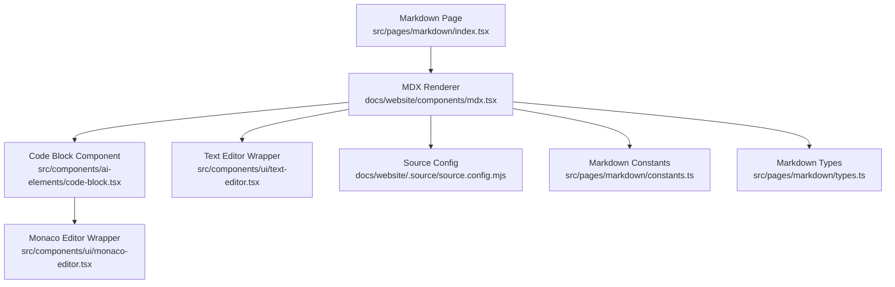
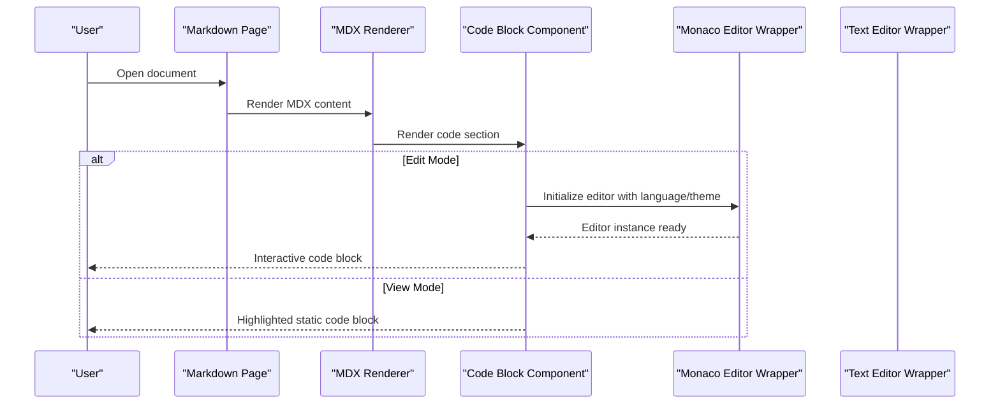
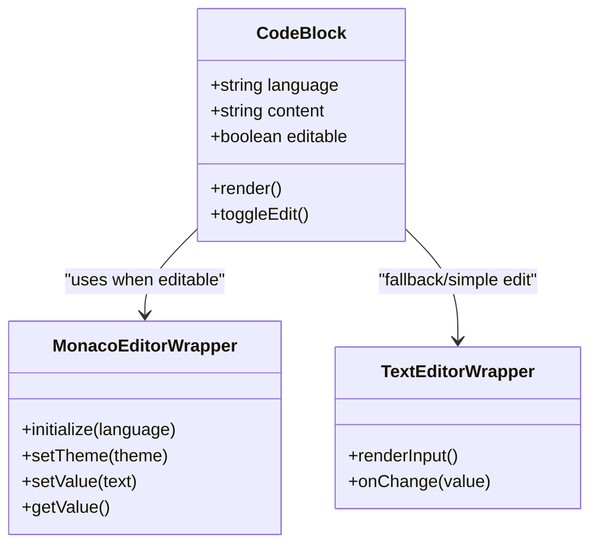
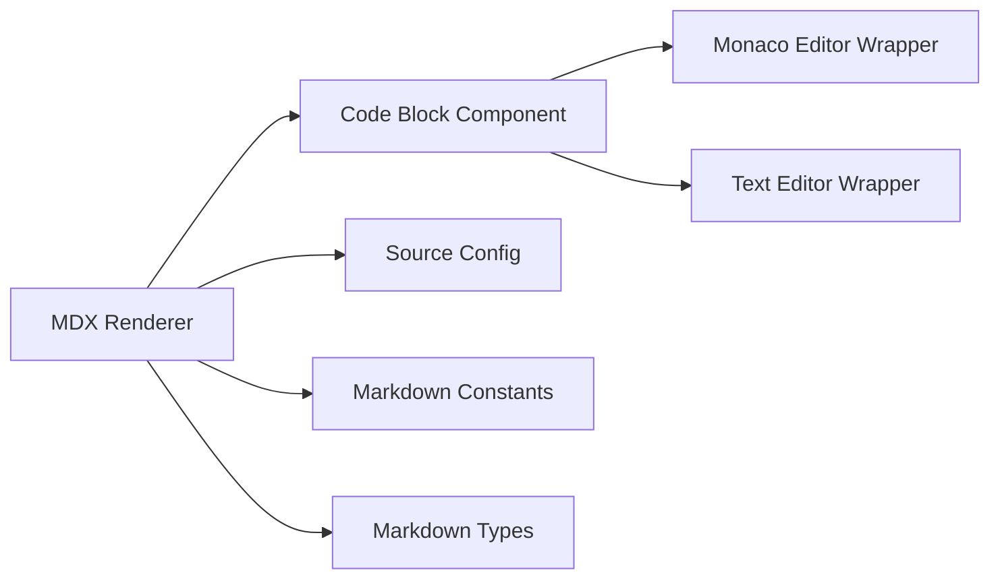

# Code Section

<cite>
**Referenced Files in This Document**
- [code-block.tsx](file://src/components/ai-elements/code-block.tsx)
- [monaco-editor.tsx](file://src/components/ui/monaco-editor.tsx)
- [text-editor.tsx](file://src/components/ui/text-editor.tsx)
- [index.tsx](file://src/pages/markdown/index.tsx)
- [components/mdx.tsx](file://docs/website/components/mdx.tsx)
- [source.config.mjs](file://docs/website/.source/source.config.mjs)
- [constants.ts](file://src/pages/markdown/constants.ts)
- [types.ts](file://src/pages/markdown/types.ts)
</cite>

## Table of Contents
1. [Introduction](#introduction)
2. [Project Structure](#project-structure)
3. [Core Components](#core-components)
4. [Architecture Overview](#architecture-overview)
5. [Detailed Component Analysis](#detailed-component-analysis)
6. [Dependency Analysis](#dependency-analysis)
7. [Performance Considerations](#performance-considerations)
8. [Troubleshooting Guide](#troubleshooting-guide)
9. [Conclusion](#conclusion)
10. [Appendices](#appendices)

## Introduction
This document explains Apprecon’s code section type: how to create and configure code blocks with syntax highlighting, language support, and formatting options; how the code editor interface works; supported programming languages; customization features; examples of configurations; best practices for organizing code in markdown documents; and integration with the document workflow.

## Project Structure
Apprecon implements code sections through a combination of Markdown rendering, MDX components, and a Monaco-based editor. The key areas are:
- Markdown page entry and routing
- MDX component registry for code blocks
- Code block renderer (display and editing)
- Editor wrapper around Monaco
- Configuration for MDX and content sources

**Diagram sources**
- [index.tsx](file://src/pages/markdown/index.tsx)
- [mdx.tsx](file://docs/website/components/mdx.tsx)
- [code-block.tsx](file://src/components/ai-elements/code-block.tsx)
- [monaco-editor.tsx](file://src/components/ui/monaco-editor.tsx)
- [text-editor.tsx](file://src/components/ui/text-editor.tsx)
- [source.config.mjs](file://docs/website/.source/source.config.mjs)
- [constants.ts](file://src/pages/markdown/constants.ts)
- [types.ts](file://src/pages/markdown/types.ts)

**Section sources**
- [index.tsx](file://src/pages/markdown/index.tsx)
- [mdx.tsx](file://docs/website/components/mdx.tsx)
- [code-block.tsx](file://src/components/ai-elements/code-block.tsx)
- [monaco-editor.tsx](file://src/components/ui/monaco-editor.tsx)
- [text-editor.tsx](file://src/components/ui/text-editor.tsx)
- [source.config.mjs](file://docs/website/.source/source.config.mjs)
- [constants.ts](file://src/pages/markdown/constants.ts)
- [types.ts](file://src/pages/markdown/types.ts)

## Core Components
- Code Block Component: Renders code sections with syntax highlighting and optional editing capabilities. It integrates with the editor wrapper to provide an interactive experience.
- Monaco Editor Wrapper: Provides a feature-rich code editor with language support, theming, and editor behaviors.
- Text Editor Wrapper: A simpler text input used when full code editing is not required.
- MDX Integration: Bridges Markdown content to React components, enabling custom code sections within documentation.

Key responsibilities:
- Parse and render code blocks from Markdown/MDX
- Apply syntax highlighting based on language
- Provide edit mode via Monaco or text editor
- Expose configuration options for appearance and behavior

**Section sources**
- [code-block.tsx](file://src/components/ai-elements/code-block.tsx)
- [monaco-editor.tsx](file://src/components/ui/monaco-editor.tsx)
- [text-editor.tsx](file://src/components/ui/text-editor.tsx)
- [mdx.tsx](file://docs/website/components/mdx.tsx)

## Architecture Overview
The code section flows from Markdown content into MDX, which resolves to the code block component. When editing is enabled, the component switches to the Monaco editor wrapper. Rendering uses syntax highlighting provided by the editor layer.

**Diagram sources**
- [index.tsx](file://src/pages/markdown/index.tsx)
- [mdx.tsx](file://docs/website/components/mdx.tsx)
- [code-block.tsx](file://src/components/ai-elements/code-block.tsx)
- [monaco-editor.tsx](file://src/components/ui/monaco-editor.tsx)
- [text-editor.tsx](file://src/components/ui/text-editor.tsx)

## Detailed Component Analysis

### Code Block Component
Responsibilities:
- Accepts props for language, content, and display/edit modes
- Applies syntax highlighting and theme
- Toggles between view and edit interfaces
- Integrates with editor wrappers for rich editing

Configuration highlights:
- Language selection influences syntax highlighting
- Theme and font settings can be customized via the editor wrapper
- Optional line numbers, minimap, and other editor features controlled by wrapper props

**Diagram sources**
- [code-block.tsx](file://src/components/ai-elements/code-block.tsx)
- [monaco-editor.tsx](file://src/components/ui/monaco-editor.tsx)
- [text-editor.tsx](file://src/components/ui/text-editor.tsx)

**Section sources**
- [code-block.tsx](file://src/components/ai-elements/code-block.tsx)
- [monaco-editor.tsx](file://src/components/ui/monaco-editor.tsx)
- [text-editor.tsx](file://src/components/ui/text-editor.tsx)

### MDX Integration for Code Sections
Responsibilities:
- Registers custom components for Markdown/MDX
- Maps Markdown code fences to the code block component
- Passes language and metadata to the component

Behavior:
- Recognizes fenced code blocks with language tags
- Converts them into the code block component with appropriate props
- Enables consistent styling and behavior across documents

**Section sources**
- [mdx.tsx](file://docs/website/components/mdx.tsx)
- [source.config.mjs](file://docs/website/.source/source.config.mjs)

### Markdown Entry and Routing
Responsibilities:
- Serves Markdown pages and routes
- Initializes MDX rendering pipeline
- Loads content sources and configuration

Integration points:
- Connects to source configuration for content discovery
- Ensures MDX components are available during rendering

**Section sources**
- [index.tsx](file://src/pages/markdown/index.tsx)
- [source.config.mjs](file://docs/website/.source/source.config.mjs)

### Editor Wrappers
Monaco Editor Wrapper:
- Provides advanced editing features: syntax highlighting, IntelliSense-like hints, theming, and keyboard shortcuts
- Supports multiple languages via language packs
- Allows customization of editor options (line numbers, minimap, word wrap, etc.)

Text Editor Wrapper:
- Lightweight text input for simple edits without full editor overhead
- Suitable for small snippets or non-code text

**Section sources**
- [monaco-editor.tsx](file://src/components/ui/monaco-editor.tsx)
- [text-editor.tsx](file://src/components/ui/text-editor.tsx)

## Dependency Analysis
The code section depends on:
- MDX rendering to convert Markdown code fences into components
- Code block component for presentation and interaction
- Editor wrappers for editing capabilities
- Markdown constants and types for shared configuration and validation

**Diagram sources**
- [mdx.tsx](file://docs/website/components/mdx.tsx)
- [code-block.tsx](file://src/components/ai-elements/code-block.tsx)
- [monaco-editor.tsx](file://src/components/ui/monaco-editor.tsx)
- [text-editor.tsx](file://src/components/ui/text-editor.tsx)
- [source.config.mjs](file://docs/website/.source/source.config.mjs)
- [constants.ts](file://src/pages/markdown/constants.ts)
- [types.ts](file://src/pages/markdown/types.ts)

**Section sources**
- [mdx.tsx](file://docs/website/components/mdx.tsx)
- [code-block.tsx](file://src/components/ai-elements/code-block.tsx)
- [monaco-editor.tsx](file://src/components/ui/monaco-editor.tsx)
- [text-editor.tsx](file://src/components/ui/text-editor.tsx)
- [source.config.mjs](file://docs/website/.source/source.config.mjs)
- [constants.ts](file://src/pages/markdown/constants.ts)
- [types.ts](file://src/pages/markdown/types.ts)

## Performance Considerations
- Prefer view mode for large code blocks to avoid heavy editor initialization
- Use minimal editor features when editing is necessary (disable minimap, reduce extensions)
- Cache language packs if frequently switching languages
- Avoid unnecessary re-renders by memoizing editor instances where possible

[No sources needed since this section provides general guidance]

## Troubleshooting Guide
Common issues and resolutions:
- Syntax highlighting not applied: Ensure the language tag matches supported identifiers and that the MDX pipeline is correctly mapping code fences to the code block component.
- Editor not loading: Verify the Monaco wrapper is initialized with correct language and theme settings; check for missing dependencies or incorrect paths.
- Content not updating: Confirm that the code block receives updated props and that the editor value synchronization is functioning.

**Section sources**
- [code-block.tsx](file://src/components/ai-elements/code-block.tsx)
- [monaco-editor.tsx](file://src/components/ui/monaco-editor.tsx)
- [mdx.tsx](file://docs/website/components/mdx.tsx)

## Conclusion
Apprecon’s code section type combines Markdown/MDX rendering with a powerful editor to deliver flexible, syntax-highlighted code blocks. By leveraging the code block component and editor wrappers, users can create, edit, and format code sections seamlessly within their documents. Following the best practices outlined here ensures optimal performance and usability.

[No sources needed since this section summarizes without analyzing specific files]

## Appendices

### Creating and Configuring Code Blocks
- Use Markdown fenced code blocks with a language identifier to enable syntax highlighting.
- In edit mode, the code block renders with the Monaco editor for rich editing features.
- Customize appearance and behavior via the editor wrapper options (theme, fonts, line numbers, minimap).

Best practices:
- Keep code blocks focused and concise for readability.
- Use descriptive language tags to ensure accurate highlighting.
- Organize related code snippets under clear headings in your document.

Integration tips:
- Ensure MDX configuration includes the code block component registration.
- Validate language identifiers against supported sets in the editor wrapper.

[No sources needed since this section provides general guidance]