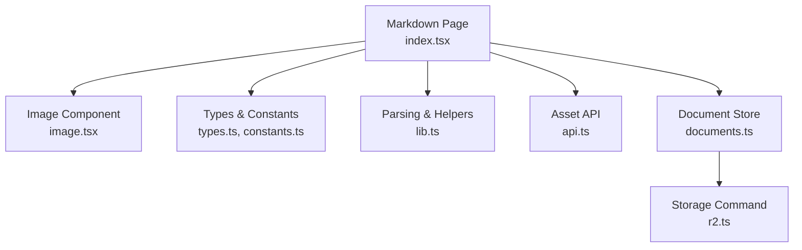
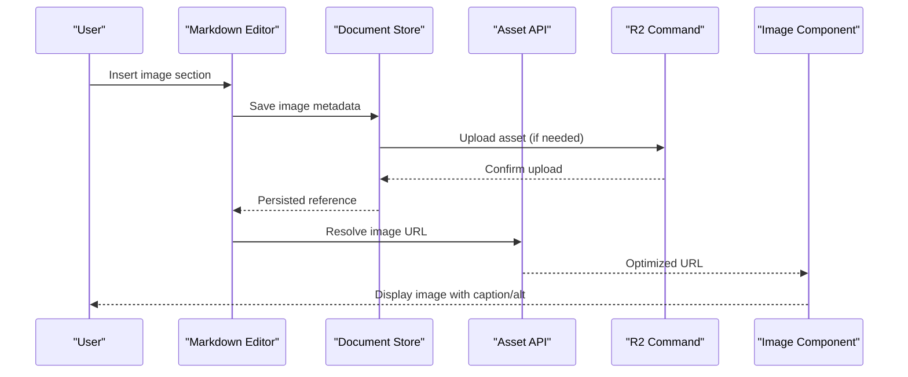
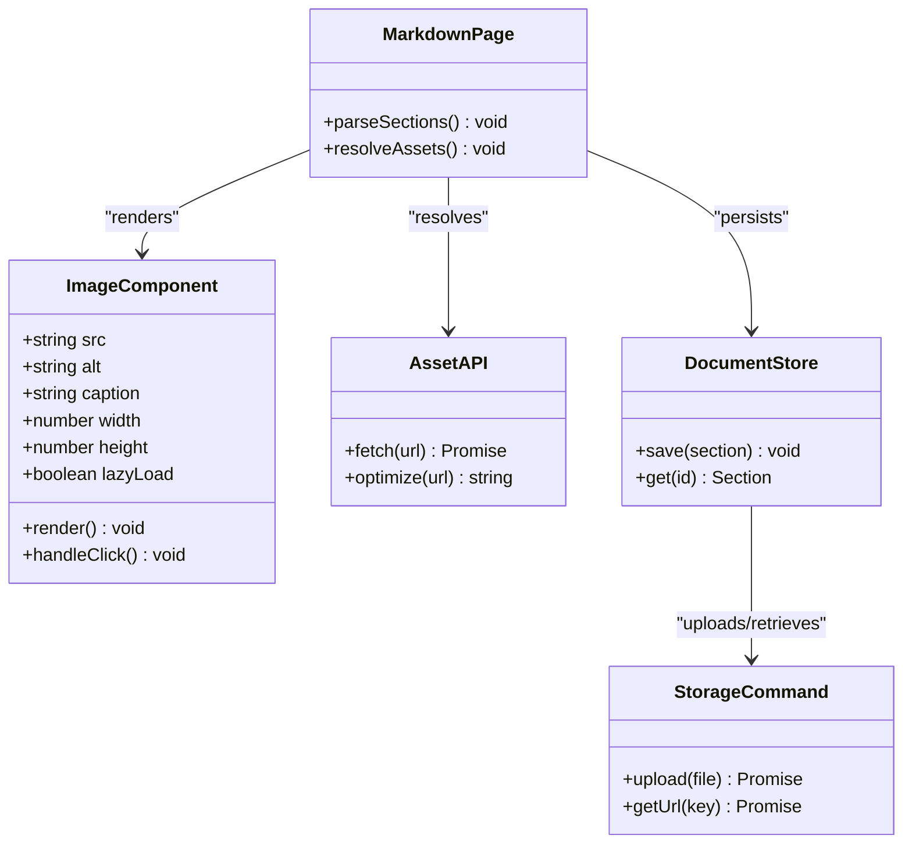
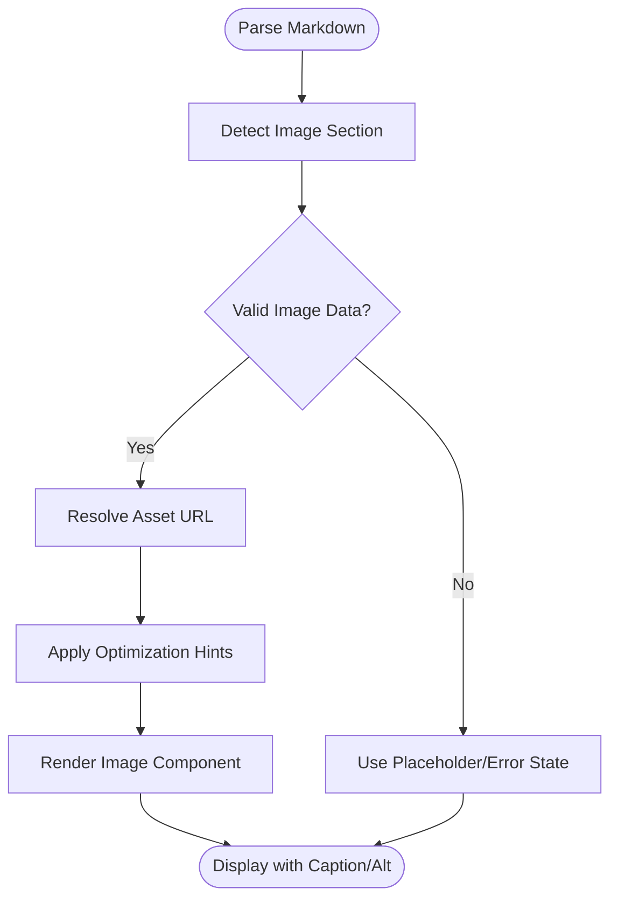
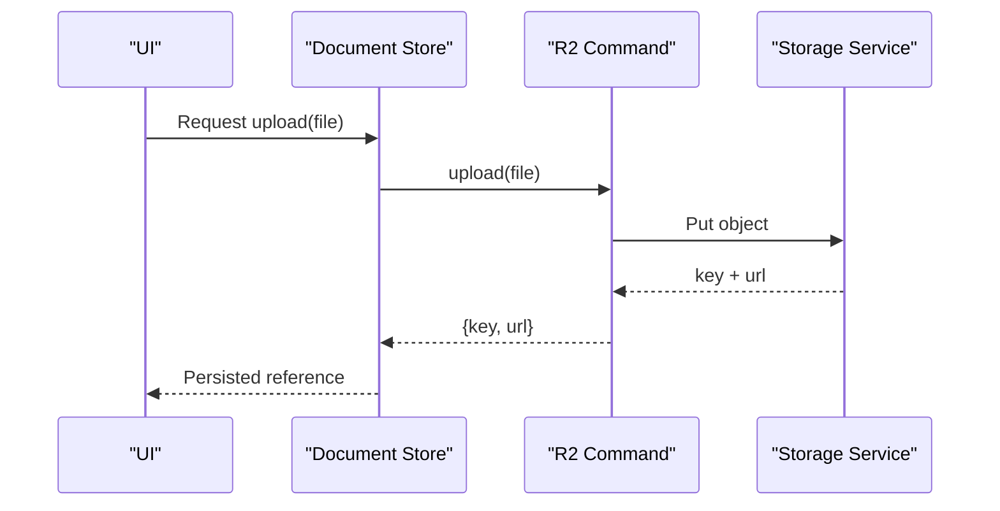
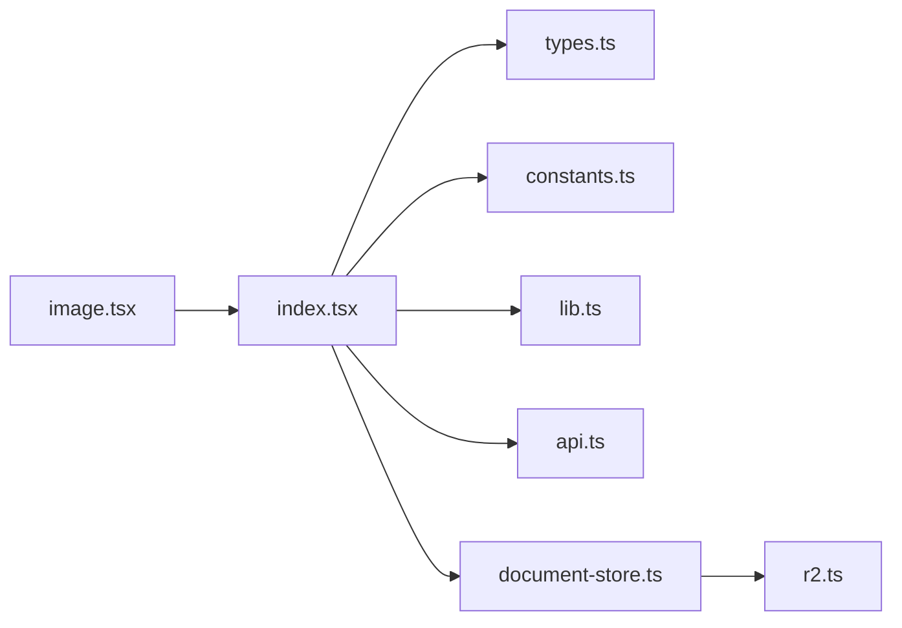

# Image Section

<cite>
**Referenced Files in This Document**
- [image.tsx](file://src/components/ai-elements/image.tsx)
- [index.tsx](file://src/pages/markdown/index.tsx)
- [types.ts](file://src/pages/markdown/types.ts)
- [api.ts](file://src/pages/markdown/api.ts)
- [constants.ts](file://src/pages/markdown/constants.ts)
- [lib.ts](file://src/pages/markdown/lib.ts)
- [components/index.tsx](file://src/pages/markdown/components/index.tsx)
- [document-store.ts](file://src/stores/documents.ts)
- [r2.ts](file://src-tauri/src/commands/r2.ts)
</cite>

## Table of Contents
1. [Introduction](#introduction)
2. [Project Structure](#project-structure)
3. [Core Components](#core-components)
4. [Architecture Overview](#architecture-overview)
5. [Detailed Component Analysis](#detailed-component-analysis)
6. [Dependency Analysis](#dependency-analysis)
7. [Performance Considerations](#performance-considerations)
8. [Troubleshooting Guide](#troubleshooting-guide)
9. [Conclusion](#conclusion)
10. [Appendices](#appendices)

## Introduction
This document explains Apprecon’s image section type, covering how images are uploaded, embedded, and displayed within documents. It details supported formats, resizing and optimization behaviors, positioning options, captions, alt text, accessibility features, common use cases, performance best practices, and integration with file management systems. The goal is to help both technical and non-technical users understand how to work with images effectively in Apprecon.

## Project Structure
Apprecon implements the image section type primarily through a React component that renders images inside markdown-based documents. The relevant files include:
- A dedicated image component for rendering and handling interactions
- Markdown page entry points and utilities for parsing and embedding
- Types and constants defining schema and behavior
- API helpers for fetching and serving assets
- Store modules for managing document state and persistence
- Tauri commands for storage operations (e.g., R2-backed storage)

**Diagram sources**
- [index.tsx](file://src/pages/markdown/index.tsx)
- [image.tsx](file://src/components/ai-elements/image.tsx)
- [types.ts](file://src/pages/markdown/types.ts)
- [constants.ts](file://src/pages/markdown/constants.ts)
- [lib.ts](file://src/pages/markdown/lib.ts)
- [api.ts](file://src/pages/markdown/api.ts)
- [document-store.ts](file://src/stores/documents.ts)
- [r2.ts](file://src-tauri/src/commands/r2.ts)

**Section sources**
- [index.tsx](file://src/pages/markdown/index.tsx)
- [image.tsx](file://src/components/ai-elements/image.tsx)
- [types.ts](file://src/pages/markdown/types.ts)
- [constants.ts](file://src/pages/markdown/constants.ts)
- [lib.ts](file://src/pages/markdown/lib.ts)
- [api.ts](file://src/pages/markdown/api.ts)
- [document-store.ts](file://src/stores/documents.ts)
- [r2.ts](file://src-tauri/src/commands/r2.ts)

## Core Components
- Image Component: Renders images with support for captions, alt text, and responsive sizing. It handles display modes such as inline, block, and full-width where applicable.
- Markdown Integration: The markdown page composes sections including images, using parsers and helpers to embed images from local or remote sources.
- Types and Constants: Define the shape of an image section, including fields like source URL, width/height hints, caption, alt text, alignment, and metadata.
- Asset API: Provides endpoints or helper functions to fetch images efficiently, supporting caching and optimized delivery when available.
- Document Store: Persists document content and manages updates, including image references and metadata.
- Storage Command: Backend command for storing and retrieving assets (e.g., via R2), enabling upload workflows and asset resolution.

Key responsibilities:
- Rendering: Convert image section data into accessible, responsive visuals.
- Embedding: Accept URLs or asset identifiers and resolve them at render time.
- Accessibility: Ensure proper alt text and semantic markup.
- Performance: Use lazy loading, appropriate sizing, and caching strategies.

**Section sources**
- [image.tsx](file://src/components/ai-elements/image.tsx)
- [index.tsx](file://src/pages/markdown/index.tsx)
- [types.ts](file://src/pages/markdown/types.ts)
- [constants.ts](file://src/pages/markdown/constants.ts)
- [api.ts](file://src/pages/markdown/api.ts)
- [document-store.ts](file://src/stores/documents.ts)
- [r2.ts](file://src-tauri/src/commands/r2.ts)

## Architecture Overview
The image section flows from authoring to rendering and storage:
- Authoring: Users add images via the markdown editor or AI tools; the system records an image section with metadata.
- Resolution: At render time, the markdown page resolves image sources using the asset API and store.
- Storage: Uploads and retrieval are handled by backend commands (e.g., R2), ensuring consistent asset management.
- Display: The image component renders the resolved asset with accessibility attributes and responsive behavior.

**Diagram sources**
- [index.tsx](file://src/pages/markdown/index.tsx)
- [api.ts](file://src/pages/markdown/api.ts)
- [document-store.ts](file://src/stores/documents.ts)
- [r2.ts](file://src-tauri/src/commands/r2.ts)
- [image.tsx](file://src/components/ai-elements/image.tsx)

## Detailed Component Analysis

### Image Component Behavior
The image component focuses on:
- Rendering: Displays images based on provided source and size hints.
- Accessibility: Enforces alt text and semantic structure.
- Responsiveness: Adapts to container sizes and supports aspect ratio preservation.
- Interaction: Supports click-to-expand or preview where implemented.

**Diagram sources**
- [image.tsx](file://src/components/ai-elements/image.tsx)
- [index.tsx](file://src/pages/markdown/index.tsx)
- [api.ts](file://src/pages/markdown/api.ts)
- [document-store.ts](file://src/stores/documents.ts)
- [r2.ts](file://src-tauri/src/commands/r2.ts)

**Section sources**
- [image.tsx](file://src/components/ai-elements/image.tsx)
- [index.tsx](file://src/pages/markdown/index.tsx)

### Markdown Integration and Parsing
The markdown page integrates image sections by:
- Parsing sections and recognizing image nodes
- Resolving asset URLs via the asset API
- Injecting metadata such as captions and alt text
- Managing layout and positioning based on configuration

**Diagram sources**
- [index.tsx](file://src/pages/markdown/index.tsx)
- [lib.ts](file://src/pages/markdown/lib.ts)
- [api.ts](file://src/pages/markdown/api.ts)
- [types.ts](file://src/pages/markdown/types.ts)

**Section sources**
- [index.tsx](file://src/pages/markdown/index.tsx)
- [lib.ts](file://src/pages/markdown/lib.ts)
- [types.ts](file://src/pages/markdown/types.ts)

### Storage and Upload Flow
Uploads and asset retrieval are coordinated through Tauri commands:
- Upload: Converts user-provided files into persistent keys and returns URLs
- Retrieval: Resolves keys to optimized URLs for rendering
- Caching: Leverages browser and CDN caches where possible

**Diagram sources**
- [document-store.ts](file://src/stores/documents.ts)
- [r2.ts](file://src-tauri/src/commands/r2.ts)

**Section sources**
- [document-store.ts](file://src/stores/documents.ts)
- [r2.ts](file://src-tauri/src/commands/r2.ts)

## Dependency Analysis
The image section depends on several modules:
- Rendering: image.tsx
- Markdown orchestration: index.tsx, lib.ts
- Schema and behavior: types.ts, constants.ts
- Asset resolution: api.ts
- Persistence: document-store.ts
- Backend storage: r2.ts

**Diagram sources**
- [image.tsx](file://src/components/ai-elements/image.tsx)
- [index.tsx](file://src/pages/markdown/index.tsx)
- [types.ts](file://src/pages/markdown/types.ts)
- [constants.ts](file://src/pages/markdown/constants.ts)
- [lib.ts](file://src/pages/markdown/lib.ts)
- [api.ts](file://src/pages/markdown/api.ts)
- [document-store.ts](file://src/stores/documents.ts)
- [r2.ts](file://src-tauri/src/commands/r2.ts)

**Section sources**
- [image.tsx](file://src/components/ai-elements/image.tsx)
- [index.tsx](file://src/pages/markdown/index.tsx)
- [types.ts](file://src/pages/markdown/types.ts)
- [constants.ts](file://src/pages/markdown/constants.ts)
- [lib.ts](file://src/pages/markdown/lib.ts)
- [api.ts](file://src/pages/markdown/api.ts)
- [document-store.ts](file://src/stores/documents.ts)
- [r2.ts](file://src-tauri/src/commands/r2.ts)

## Performance Considerations
- Lazy Loading: Defer offscreen images to reduce initial load time.
- Responsive Sizing: Provide width/height hints to prevent layout shifts.
- Format Selection: Prefer modern formats (e.g., WebP/AVIF) when supported.
- Caching: Utilize browser cache headers and CDN caching for repeated access.
- Compression: Ensure server-side compression and optimal quality settings.
- Avoid Large Blobs: Store large images remotely and reference via URLs.

[No sources needed since this section provides general guidance]

## Troubleshooting Guide
Common issues and resolutions:
- Missing Alt Text: Ensure every image has descriptive alt text for accessibility.
- Broken Links: Verify asset URLs resolve correctly; check permissions and CORS if external.
- Slow Loading: Inspect network requests; enable lazy loading and optimize image sizes.
- Upload Failures: Check storage service availability and credentials; review error logs.
- Layout Shifts: Set explicit dimensions or aspect ratios to avoid reflow.

**Section sources**
- [image.tsx](file://src/components/ai-elements/image.tsx)
- [api.ts](file://src/pages/markdown/api.ts)
- [document-store.ts](file://src/stores/documents.ts)
- [r2.ts](file://src-tauri/src/commands/r2.ts)

## Conclusion
Apprecon’s image section type provides a robust foundation for embedding, optimizing, and displaying images within documents. By leveraging responsive rendering, accessibility features, and efficient storage integration, it ensures high-quality visual experiences while maintaining performance. Following the best practices outlined here will help you deliver accessible, fast-loading, and maintainable image content.

[No sources needed since this section summarizes without analyzing specific files]

## Appendices

### Supported Formats and Optimization
- Typical supported formats include JPEG, PNG, GIF, SVG, and modern formats like WebP/AVIF depending on environment support.
- Optimization includes format selection, resizing, and compression hints applied during asset resolution.

**Section sources**
- [api.ts](file://src/pages/markdown/api.ts)
- [constants.ts](file://src/pages/markdown/constants.ts)

### Positioning, Captions, and Alt Text
- Positioning: Inline, block, and full-width modes can be configured per section.
- Captions: Optional text below the image for context.
- Alt Text: Required for accessibility; describe the image content succinctly.

**Section sources**
- [types.ts](file://src/pages/markdown/types.ts)
- [image.tsx](file://src/components/ai-elements/image.tsx)

### Common Use Cases
- Diagrams and screenshots in documentation
- Before/after comparisons with side-by-side layouts
- Hero images with captions and responsive scaling
- Embedded icons and small graphics with optimized sizes

[No sources needed since this section provides general guidance]

### Integration with File Management Systems
- Use centralized asset repositories (e.g., R2) for consistent uploads and retrieval.
- Maintain versioning and metadata alongside images for traceability.
- Implement access controls and CDN caching for secure and fast delivery.

**Section sources**
- [r2.ts](file://src-tauri/src/commands/r2.ts)
- [document-store.ts](file://src/stores/documents.ts)