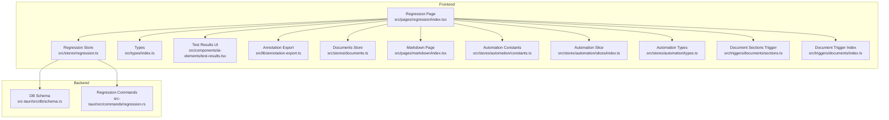
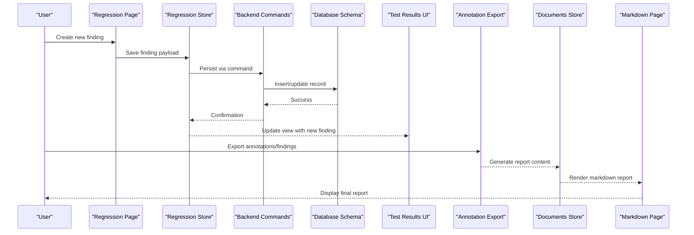
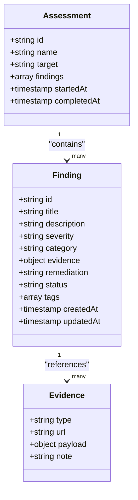
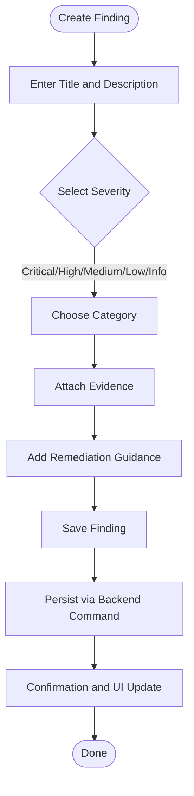
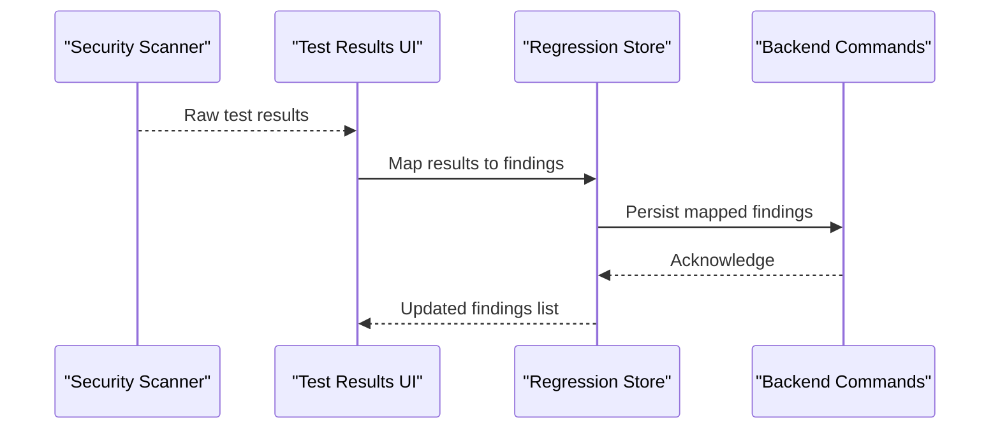
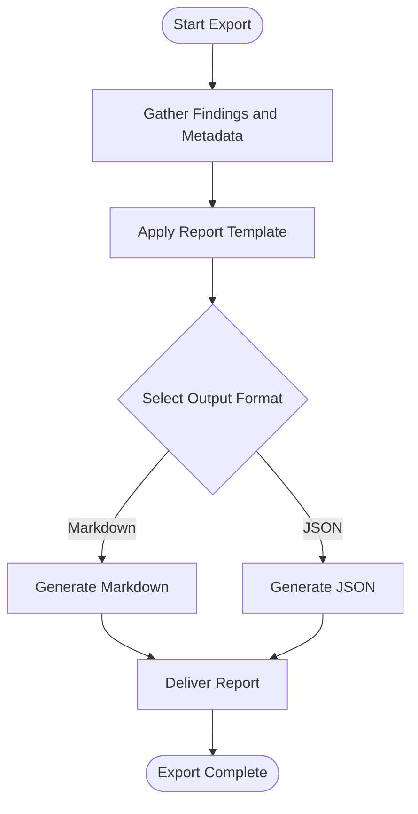
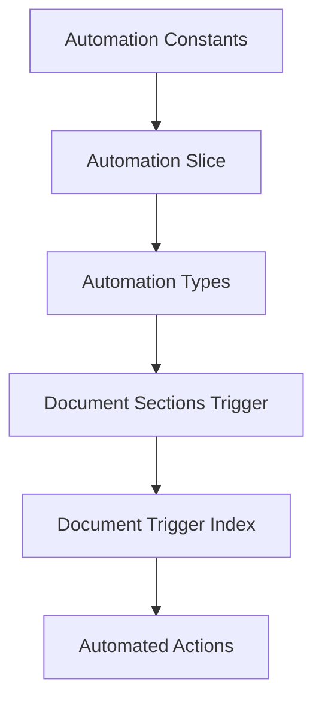
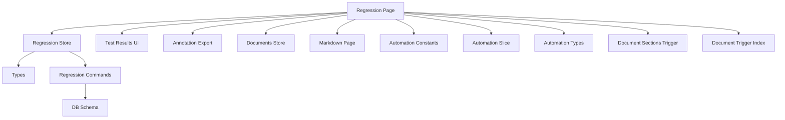

# Security Findings Section

<cite>
**Referenced Files in This Document**
- [README.md](file://README.md)
- [src/pages/regression/index.tsx](file://src/pages/regression/index.tsx)
- [src/stores/regression.ts](file://src/stores/regression.ts)
- [src/components/ai-elements/test-results.tsx](file://src/components/ai-elements/test-results.tsx)
- [src/types/index.ts](file://src/types/index.ts)
- [src/lib/annotation-export.ts](file://src/lib/annotation-export.ts)
- [src/stores/documents.ts](file://src/stores/documents.ts)
- [src/pages/markdown/index.tsx](file://src/pages/markdown/index.tsx)
- [src/stores/automation/constants.ts](file://src/stores/automation/constants.ts)
- [src/stores/automation/slices/index.ts](file://src/stores/automation/slices/index.ts)
- [src/stores/automation/types.ts](file://src/stores/automation/types.ts)
- [src/triggers/documents/sections.ts](file://src/triggers/documents/sections.ts)
- [src/triggers/documents/index.ts](file://src/triggers/documents/index.ts)
- [src-tauri/src/db/schema.rs](file://src-tauri/src/db/schema.rs)
- [src-tauri/src/commands/regression.rs](file://src-tauri/src/commands/regression.rs)
</cite>

## Table of Contents
1. [Introduction](#introduction)
2. [Project Structure](#project-structure)
3. [Core Components](#core-components)
4. [Architecture Overview](#architecture-overview)
5. [Detailed Component Analysis](#detailed-component-analysis)
6. [Dependency Analysis](#dependency-analysis)
7. [Performance Considerations](#performance-considerations)
8. [Troubleshooting Guide](#troubleshooting-guide)
9. [Conclusion](#conclusion)
10. [Appendices](#appendices)

## Introduction
This document explains how to use Apprecon’s security findings section type to structure vulnerability reports, security test results, and assessment findings. It covers severity levels, categorization options, remediation guidance, and compliance reporting features. It also provides examples of common finding formats, integration patterns with testing tools, and automated report generation workflows.

The security findings section is designed for:
- Recording individual vulnerabilities or issues with structured metadata
- Associating evidence such as requests, responses, screenshots, and notes
- Classifying findings by severity and category
- Generating standardized reports for stakeholders and compliance audits

## Project Structure
Apprecon organizes UI pages, stores, types, triggers, and backend commands that collectively support the security findings workflow. The key areas include:
- Regression page for managing assessments and findings
- Stores for state management and persistence
- Types defining data models for findings
- Triggers for document sections and automation
- Backend schema and commands for storage and retrieval

**Diagram sources**
- [src/pages/regression/index.tsx](file://src/pages/regression/index.tsx)
- [src/stores/regression.ts](file://src/stores/regression.ts)
- [src/types/index.ts](file://src/types/index.ts)
- [src/components/ai-elements/test-results.tsx](file://src/components/ai-elements/test-results.tsx)
- [src/lib/annotation-export.ts](file://src/lib/annotation-export.ts)
- [src/stores/documents.ts](file://src/stores/documents.ts)
- [src/pages/markdown/index.tsx](file://src/pages/markdown/index.tsx)
- [src/stores/automation/constants.ts](file://src/stores/automation/constants.ts)
- [src/stores/automation/slices/index.ts](file://src/stores/automation/slices/index.ts)
- [src/stores/automation/types.ts](file://src/stores/automation/types.ts)
- [src/triggers/documents/sections.ts](file://src/triggers/documents/sections.ts)
- [src/triggers/documents/index.ts](file://src/triggers/documents/index.ts)
- [src-tauri/src/db/schema.rs](file://src-tauri/src/db/schema.rs)
- [src-tauri/src/commands/regression.rs](file://src-tauri/src/commands/regression.rs)

**Section sources**
- [README.md](file://README.md)

## Core Components
- Regression page: Entry point for creating and managing assessments and findings.
- Regression store: Manages state, persistence, and operations related to findings.
- Types: Define structures for findings, severities, categories, and evidence.
- Test results UI: Renders test outcomes and integrates with findings.
- Annotation export: Exports annotations and findings into standard formats.
- Documents store and Markdown page: Support generating reports from findings.
- Automation constants, slices, and types: Provide configuration and actions for automated workflows.
- Document triggers: Enable dynamic section creation and updates based on findings.
- Backend schema and commands: Persist and retrieve findings securely.

Key responsibilities:
- Structuring findings with consistent fields (title, description, severity, category, evidence, remediation).
- Linking findings to specific targets, requests, and responses.
- Enabling filtering, sorting, and exporting of findings.
- Supporting automated report generation via markdown templates and triggers.

**Section sources**
- [src/pages/regression/index.tsx](file://src/pages/regression/index.tsx)
- [src/stores/regression.ts](file://src/stores/regression.ts)
- [src/types/index.ts](file://src/types/index.ts)
- [src/components/ai-elements/test-results.tsx](file://src/components/ai-elements/test-results.tsx)
- [src/lib/annotation-export.ts](file://src/lib/annotation-export.ts)
- [src/stores/documents.ts](file://src/stores/documents.ts)
- [src/pages/markdown/index.tsx](file://src/pages/markdown/index.tsx)
- [src/stores/automation/constants.ts](file://src/stores/automation/constants.ts)
- [src/stores/automation/slices/index.ts](file://src/stores/automation/slices/index.ts)
- [src/stores/automation/types.ts](file://src/stores/automation/types.ts)
- [src/triggers/documents/sections.ts](file://src/triggers/documents/sections.ts)
- [src/triggers/documents/index.ts](file://src/triggers/documents/index.ts)
- [src-tauri/src/db/schema.rs](file://src-tauri/src/db/schema.rs)
- [src-tauri/src/commands/regression.rs](file://src-tauri/src/commands/regression.rs)

## Architecture Overview
The security findings architecture connects frontend components with backend storage through well-defined types and triggers. The flow typically involves:
- Creating a finding in the regression page
- Storing it via the regression store
- Persisting through backend commands and schema
- Rendering results in the test results UI
- Exporting annotations and generating markdown reports
- Triggering automated sections and workflows

**Diagram sources**
- [src/pages/regression/index.tsx](file://src/pages/regression/index.tsx)
- [src/stores/regression.ts](file://src/stores/regression.ts)
- [src-tauri/src/commands/regression.rs](file://src-tauri/src/commands/regression.rs)
- [src-tauri/src/db/schema.rs](file://src-tauri/src/db/schema.rs)
- [src/components/ai-elements/test-results.tsx](file://src/components/ai-elements/test-results.tsx)
- [src/lib/annotation-export.ts](file://src/lib/annotation-export.ts)
- [src/stores/documents.ts](file://src/stores/documents.ts)
- [src/pages/markdown/index.tsx](file://src/pages/markdown/index.tsx)

## Detailed Component Analysis

### Finding Data Model and Severity Levels
Findings are modeled with structured fields to ensure consistency across reports. Typical attributes include:
- Title and description
- Severity level (e.g., critical, high, medium, low, informational)
- Category (e.g., injection, XSS, authentication, authorization, misconfiguration)
- Evidence references (requests, responses, screenshots, logs)
- Remediation guidance and references
- Status and tags for lifecycle tracking

Severity levels guide prioritization and reporting:
- Critical: Immediate action required; system compromise likely
- High: Significant risk; should be addressed soon
- Medium: Moderate risk; plan remediation within a sprint
- Low: Minor risk; consider when resources allow
- Informational: Advisory; no immediate fix needed

Categorization helps group findings by vulnerability class and compliance frameworks.

**Diagram sources**
- [src/types/index.ts](file://src/types/index.ts)
- [src/stores/regression.ts](file://src/stores/regression.ts)

**Section sources**
- [src/types/index.ts](file://src/types/index.ts)
- [src/stores/regression.ts](file://src/stores/regression.ts)

### Creating and Managing Findings
The regression page orchestrates the creation and editing of findings. Users can:
- Add new findings manually or import from tests
- Attach evidence like HTTP requests/responses and screenshots
- Assign severity and category
- Write remediation steps and links to standards

The regression store handles:
- State updates and validation
- Persistence to backend via commands
- Filtering and sorting by severity, category, and status

**Diagram sources**
- [src/pages/regression/index.tsx](file://src/pages/regression/index.tsx)
- [src/stores/regression.ts](file://src/stores/regression.ts)
- [src-tauri/src/commands/regression.rs](file://src-tauri/src/commands/regression.rs)

**Section sources**
- [src/pages/regression/index.tsx](file://src/pages/regression/index.tsx)
- [src/stores/regression.ts](file://src/stores/regression.ts)
- [src-tauri/src/commands/regression.rs](file://src-tauri/src/commands/regression.rs)

### Test Results Integration
The test results component displays outcomes from automated scans and manual tests. It supports:
- Mapping test outputs to findings
- Highlighting failed checks and associated evidence
- Allowing quick triage and assignment of severity/category

Integration points:
- Import raw test results into findings
- Auto-classify based on rule sets
- Link to relevant requests and responses

**Diagram sources**
- [src/components/ai-elements/test-results.tsx](file://src/components/ai-elements/test-results.tsx)
- [src/stores/regression.ts](file://src/stores/regression.ts)
- [src-tauri/src/commands/regression.rs](file://src-tauri/src/commands/regression.rs)

**Section sources**
- [src/components/ai-elements/test-results.tsx](file://src/components/ai-elements/test-results.tsx)
- [src/stores/regression.ts](file://src/stores/regression.ts)

### Annotation Export and Compliance Reporting
Annotation export enables converting findings into standardized formats suitable for compliance and stakeholder review. Features include:
- Exporting findings with evidence summaries
- Generating markdown reports with sections per severity and category
- Tagging findings with compliance identifiers

Report generation workflow:
- Collect findings and metadata
- Apply templates for consistent formatting
- Output markdown or other formats for distribution

**Diagram sources**
- [src/lib/annotation-export.ts](file://src/lib/annotation-export.ts)
- [src/stores/documents.ts](file://src/stores/documents.ts)
- [src/pages/markdown/index.tsx](file://src/pages/markdown/index.tsx)

**Section sources**
- [src/lib/annotation-export.ts](file://src/lib/annotation-export.ts)
- [src/stores/documents.ts](file://src/stores/documents.ts)
- [src/pages/markdown/index.tsx](file://src/pages/markdown/index.tsx)

### Automated Workflows and Triggers
Automation constants, slices, and types define configurable actions for findings workflows. Document triggers enable dynamic section creation based on findings changes. Use cases:
- Auto-create remediation tasks upon saving a finding
- Update dashboards and metrics when severity changes
- Trigger notifications for critical findings

**Diagram sources**
- [src/stores/automation/constants.ts](file://src/stores/automation/constants.ts)
- [src/stores/automation/slices/index.ts](file://src/stores/automation/slices/index.ts)
- [src/stores/automation/types.ts](file://src/stores/automation/types.ts)
- [src/triggers/documents/sections.ts](file://src/triggers/documents/sections.ts)
- [src/triggers/documents/index.ts](file://src/triggers/documents/index.ts)

**Section sources**
- [src/stores/automation/constants.ts](file://src/stores/automation/constants.ts)
- [src/stores/automation/slices/index.ts](file://src/stores/automation/slices/index.ts)
- [src/stores/automation/types.ts](file://src/stores/automation/types.ts)
- [src/triggers/documents/sections.ts](file://src/triggers/documents/sections.ts)
- [src/triggers/documents/index.ts](file://src/triggers/documents/index.ts)

## Dependency Analysis
The security findings feature depends on several modules:
- Frontend UI components for interaction and visualization
- Stores for state management and persistence
- Types for consistent data modeling
- Triggers for automation and dynamic updates
- Backend commands and schema for secure storage

**Diagram sources**
- [src/pages/regression/index.tsx](file://src/pages/regression/index.tsx)
- [src/stores/regression.ts](file://src/stores/regression.ts)
- [src/types/index.ts](file://src/types/index.ts)
- [src-tauri/src/commands/regression.rs](file://src-tauri/src/commands/regression.rs)
- [src-tauri/src/db/schema.rs](file://src-tauri/src/db/schema.rs)
- [src/components/ai-elements/test-results.tsx](file://src/components/ai-elements/test-results.tsx)
- [src/lib/annotation-export.ts](file://src/lib/annotation-export.ts)
- [src/stores/documents.ts](file://src/stores/documents.ts)
- [src/pages/markdown/index.tsx](file://src/pages/markdown/index.tsx)
- [src/stores/automation/constants.ts](file://src/stores/automation/constants.ts)
- [src/stores/automation/slices/index.ts](file://src/stores/automation/slices/index.ts)
- [src/stores/automation/types.ts](file://src/stores/automation/types.ts)
- [src/triggers/documents/sections.ts](file://src/triggers/documents/sections.ts)
- [src/triggers/documents/index.ts](file://src/triggers/documents/index.ts)

**Section sources**
- [src/pages/regression/index.tsx](file://src/pages/regression/index.tsx)
- [src/stores/regression.ts](file://src/stores/regression.ts)
- [src/types/index.ts](file://src/types/index.ts)
- [src-tauri/src/commands/regression.rs](file://src-tauri/src/commands/regression.rs)
- [src-tauri/src/db/schema.rs](file://src-tauri/src/db/schema.rs)
- [src/components/ai-elements/test-results.tsx](file://src/components/ai-elements/test-results.tsx)
- [src/lib/annotation-export.ts](file://src/lib/annotation-export.ts)
- [src/stores/documents.ts](file://src/stores/documents.ts)
- [src/pages/markdown/index.tsx](file://src/pages/markdown/index.tsx)
- [src/stores/automation/constants.ts](file://src/stores/automation/constants.ts)
- [src/stores/automation/slices/index.ts](file://src/stores/automation/slices/index.ts)
- [src/stores/automation/types.ts](file://src/stores/automation/types.ts)
- [src/triggers/documents/sections.ts](file://src/triggers/documents/sections.ts)
- [src/triggers/documents/index.ts](file://src/triggers/documents/index.ts)

## Performance Considerations
- Batch operations: When importing many findings, batch writes to reduce backend calls.
- Lazy loading: Load large evidence payloads only when viewing details.
- Caching: Cache frequently accessed categories and severity mappings.
- Debouncing: Debounce search and filter inputs to avoid excessive re-renders.
- Efficient exports: Stream large exports instead of building entire documents in memory.

[No sources needed since this section provides general guidance]

## Troubleshooting Guide
Common issues and resolutions:
- Missing severity or category: Ensure all required fields are populated before saving.
- Evidence not attaching: Verify file sizes and supported formats; check permissions.
- Export failures: Validate template variables and output paths; confirm storage availability.
- Automation not triggering: Check trigger configurations and event bindings.

**Section sources**
- [src/stores/regression.ts](file://src/stores/regression.ts)
- [src/lib/annotation-export.ts](file://src/lib/annotation-export.ts)
- [src/triggers/documents/sections.ts](file://src/triggers/documents/sections.ts)

## Conclusion
Apprecon’s security findings section provides a robust framework for structuring vulnerability reports, integrating test results, and generating compliance-ready documentation. By leveraging consistent data models, severity classifications, and automated workflows, teams can streamline security assessments and remediation processes.

[No sources needed since this section summarizes without analyzing specific files]

## Appendices

### Common Finding Formats
Examples of typical finding structures:
- Injection vulnerability with request/response evidence and remediation steps
- Cross-site scripting issue with DOM manipulation details and mitigation guidance
- Authentication bypass with session handling notes and policy recommendations

[No sources needed since this section provides conceptual examples]

### Integration with Testing Tools
Patterns for connecting scanners and manual tests:
- Import CSV/JSON outputs into findings via the regression page
- Map scanner rules to categories and severities
- Link automated test artifacts to evidence fields

[No sources needed since this section provides conceptual examples]

### Automated Report Generation Workflows
Steps to automate reporting:
- Configure triggers to update sections on finding changes
- Use templates to format markdown reports
- Schedule exports for periodic compliance submissions

[No sources needed since this section provides conceptual examples]