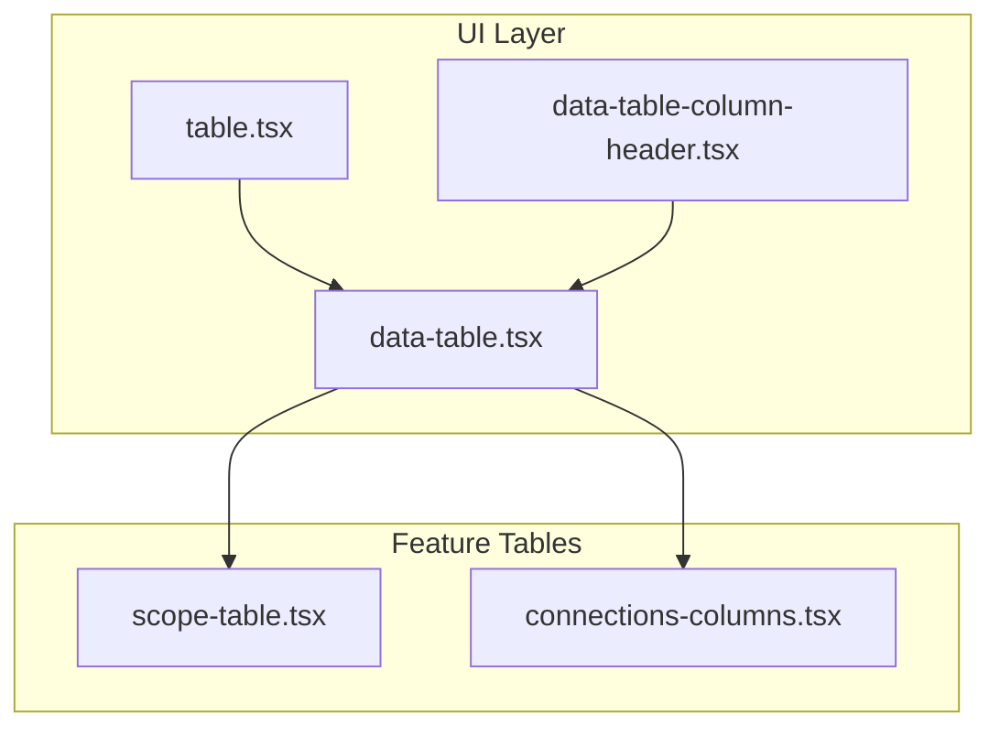
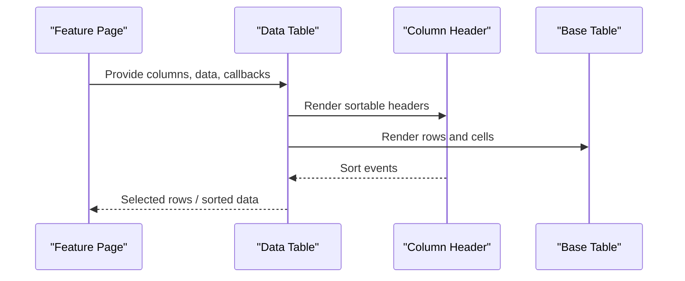
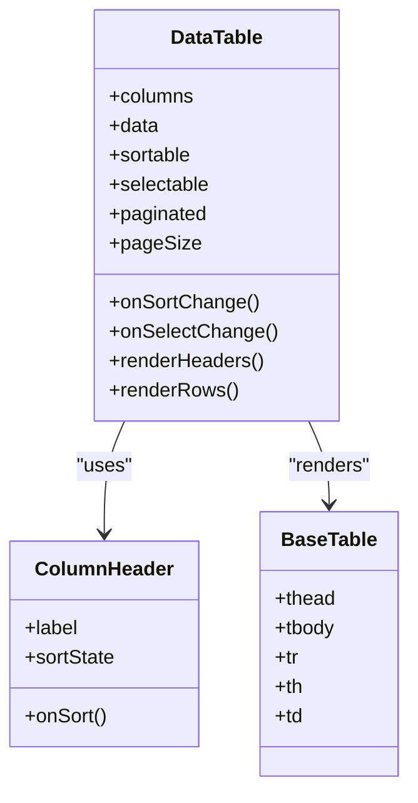
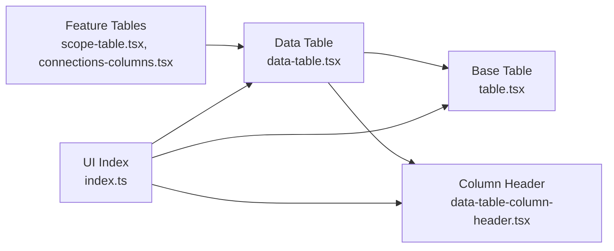

# Table Section

<cite>
**Referenced Files in This Document**
- [table.tsx](file://src/components/ui/table.tsx)
- [data-table.tsx](file://src/components/ui/data-table.tsx)
- [index.ts](file://src/components/ui/index.ts)
- [scope-table.tsx](file://src/components/scope-table.tsx)
- [connections-columns.tsx](file://src/components/connections-columns.tsx)
- [data-table-column-header.tsx](file://src/components/data-table-column-header.tsx)
</cite>

## Table of Contents
1. [Introduction](#introduction)
2. [Project Structure](#project-structure)
3. [Core Components](#core-components)
4. [Architecture Overview](#architecture-overview)
5. [Detailed Component Analysis](#detailed-component-analysis)
6. [Dependency Analysis](#dependency-analysis)
7. [Performance Considerations](#performance-considerations)
8. [Troubleshooting Guide](#troubleshooting-guide)
9. [Conclusion](#conclusion)
10. [Appendices](#appendices)

## Introduction
This document explains Apprecon’s table section type and how to build structured tables with headers, data rows, and formatting options. It covers configuration, column definitions, data binding, styling capabilities, responsive design considerations, and accessibility features. Practical examples illustrate different layouts, data organization patterns, and integration with external data sources.

## Project Structure
Apprecon provides a reusable table UI layer under the shared UI components, along with higher-level table implementations used across pages and panels. The key files are:
- A base table component for semantic HTML structure and styling
- A data-driven table component that handles columns, sorting, pagination, and selection
- Column header utilities for accessible sort controls
- Feature-specific table components that compose the data table

**Diagram sources**
- [table.tsx](file://src/components/ui/table.tsx)
- [data-table.tsx](file://src/components/ui/data-table.tsx)
- [data-table-column-header.tsx](file://src/components/data-table-column-header.tsx)
- [scope-table.tsx](file://src/components/scope-table.tsx)
- [connections-columns.tsx](file://src/components/connections-columns.tsx)

**Section sources**
- [table.tsx](file://src/components/ui/table.tsx)
- [data-table.tsx](file://src/components/ui/data-table.tsx)
- [data-table-column-header.tsx](file://src/components/data-table-column-header.tsx)
- [scope-table.tsx](file://src/components/scope-table.tsx)
- [connections-columns.tsx](file://src/components/connections-columns.tsx)

## Core Components
- Base table (semantic markup and styles): Provides table, thead, tbody, tr, th, td elements with consistent spacing and borders. Use this when you need simple tabular presentation without data logic.
- Data table (columns, sorting, pagination, selection): A configurable, data-driven table that renders columns from a schema, supports sorting, row selection, and pagination. Ideal for large datasets and interactive workflows.
- Column header utility: Accessible sort headers with keyboard support and screen reader labels.
- Feature tables: Compose the data table to present domain-specific data (e.g., scopes, connections).

Key responsibilities:
- Configuration via props for columns, data, and behavior flags
- Rendering headers and rows based on column definitions
- Handling user interactions (sorting, selection)
- Providing accessible attributes (aria-*), roles, and keyboard navigation

**Section sources**
- [table.tsx](file://src/components/ui/table.tsx)
- [data-table.tsx](file://src/components/ui/data-table.tsx)
- [data-table-column-header.tsx](file://src/components/data-table-column-header.tsx)

## Architecture Overview
The table system follows a layered approach:
- Presentation layer: Base table component renders semantic HTML and applies consistent styles.
- Interaction layer: Data table manages state for sorting, selection, and pagination; composes column headers.
- Feature layer: Domain-specific tables bind to application data and expose actions.

**Diagram sources**
- [data-table.tsx](file://src/components/ui/data-table.tsx)
- [data-table-column-header.tsx](file://src/components/data-table-column-header.tsx)
- [table.tsx](file://src/components/ui/table.tsx)

## Detailed Component Analysis

### Base Table Component
Purpose:
- Renders a semantic HTML table with consistent visual style.
- Accepts children such as thead, tbody, tr, th, td.
- Useful for static or lightly dynamic content where full data table features are unnecessary.

Usage pattern:
- Wrap your table content inside the base table component to inherit consistent styles and layout.
- Combine with feature-specific logic outside the component to keep concerns separated.

Accessibility:
- Uses native table semantics which provide built-in accessibility for screen readers.
- Ensure meaningful text content in headers and cells.

Styling:
- Consistent borders, padding, and alignment.
- Can be combined with theme tokens if available in the project.

**Section sources**
- [table.tsx](file://src/components/ui/table.tsx)

### Data Table Component
Purpose:
- Renders a fully configurable table driven by a columns definition and a data array.
- Supports sorting, row selection, and pagination.
- Encapsulates interaction logic while delegating rendering to the base table.

Configuration:
- Columns: Define each column with label, accessor, width, and optional renderers.
- Data: Array of objects representing rows.
- Sorting: Enable per-column sorting and set default sort state.
- Selection: Toggle row selection and manage selected rows.
- Pagination: Configure page size and navigate between pages.

Data binding:
- Map object fields to columns using accessors.
- Provide custom cell renderers for complex values (links, badges, actions).

Sorting:
- Clicking a column header triggers sort changes.
- Keyboard navigation supported via accessible headers.

Selection:
- Checkbox column toggles row selection.
- Select all option available when enabled.

Pagination:
- Splits large datasets into pages.
- Controls for navigating pages and changing page size.

Accessibility:
- ARIA attributes for sort direction and selection state.
- Keyboard-friendly interactions.

Styling:
- Consistent with base table styles.
- Optional hover states and active selections.

**Diagram sources**
- [data-table.tsx](file://src/components/ui/data-table.tsx)
- [data-table-column-header.tsx](file://src/components/data-table-column-header.tsx)
- [table.tsx](file://src/components/ui/table.tsx)

**Section sources**
- [data-table.tsx](file://src/components/ui/data-table.tsx)
- [data-table-column-header.tsx](file://src/components/data-table-column-header.tsx)

### Column Header Utility
Purpose:
- Provides accessible, sortable column headers.
- Announces current sort direction to assistive technologies.
- Supports keyboard activation and focus management.

Usage:
- Include within the data table’s header row.
- Pass label, sort state, and an event handler to update sort order.

Accessibility:
- Uses aria-sort and role attributes appropriately.
- Ensures focus is visible and navigable.

**Section sources**
- [data-table-column-header.tsx](file://src/components/data-table-column-header.tsx)

### Feature-Specific Tables
Examples:
- Scope table: Presents scope entries with filtering and actions.
- Connections columns: Defines specialized columns for connection records.

Pattern:
- Import the data table component.
- Define columns tailored to the domain model.
- Bind to application state and handle actions (e.g., delete, edit).

Responsiveness:
- Adjust column visibility or switch to card layout on small screens if needed.
- Use horizontal scrolling for wide tables when necessary.

**Section sources**
- [scope-table.tsx](file://src/components/scope-table.tsx)
- [connections-columns.tsx](file://src/components/connections-columns.tsx)

## Dependency Analysis
The table components form a clear dependency chain:
- Feature tables depend on the data table.
- The data table depends on the base table and column header utility.
- Shared UI exports aggregate these components for easy import.

**Diagram sources**
- [scope-table.tsx](file://src/components/scope-table.tsx)
- [connections-columns.tsx](file://src/components/connections-columns.tsx)
- [data-table.tsx](file://src/components/ui/data-table.tsx)
- [table.tsx](file://src/components/ui/table.tsx)
- [data-table-column-header.tsx](file://src/components/data-table-column-header.tsx)
- [index.ts](file://src/components/ui/index.ts)

**Section sources**
- [index.ts](file://src/components/ui/index.ts)

## Performance Considerations
- Virtualization: For very large datasets, consider virtualized rendering to limit DOM nodes.
- Memoization: Memoize expensive column renderers and row components to avoid re-renders.
- Stable keys: Ensure stable row keys to optimize reconciliation.
- Debounce input: If integrating search/filter, debounce updates to reduce churn.
- Pagination: Prefer server-side pagination for large datasets to minimize memory usage.

[No sources needed since this section provides general guidance]

## Troubleshooting Guide
Common issues and resolutions:
- Missing headers: Ensure thead contains th elements with descriptive text.
- Unsorted columns: Verify sort handlers are wired and sort state updates correctly.
- Selection not updating: Confirm selection state is managed and passed back to parent.
- Accessibility warnings: Check aria attributes and keyboard navigation paths.
- Responsive overflow: Add horizontal scroll container or adjust column widths.

Checklist:
- Validate column accessor functions return expected values.
- Test with screen readers for proper announcements.
- Verify focus order and visible focus indicators.
- Confirm pagination controls are reachable and functional.

**Section sources**
- [data-table.tsx](file://src/components/ui/data-table.tsx)
- [data-table-column-header.tsx](file://src/components/data-table-column-header.tsx)

## Conclusion
Apprecon’s table section type offers a robust, accessible, and customizable foundation for building structured tables. By composing the base table and data table components, developers can create responsive, performant, and accessible data presentations that integrate seamlessly with external data sources and application state.

[No sources needed since this section summarizes without analyzing specific files]

## Appendices

### Creating Structured Tables: Step-by-Step
- Choose the appropriate component:
  - Use the base table for simple, static tables.
  - Use the data table for interactive, data-driven tables.
- Define columns:
  - Specify label, accessor, width, and optional renderer.
- Bind data:
  - Pass an array of row objects to the data table.
- Enable features:
  - Turn on sorting, selection, and pagination as needed.
- Style consistently:
  - Rely on shared styles; override sparingly for special cases.

[No sources needed since this section provides general guidance]

### Integration with External Data Sources
- Fetch data asynchronously and pass it to the data table.
- Handle loading and error states at the feature layer.
- Implement server-side sorting/filtering/pagination for scalability.
- Debounce user inputs to reduce network calls.

[No sources needed since this section provides general guidance]

### Responsive Design Considerations
- Horizontal scrolling for wide tables on small screens.
- Hide non-essential columns on narrow viewports.
- Consider card-based layouts for mobile readability.
- Ensure touch targets are adequately sized.

[No sources needed since this section provides general guidance]

### Accessibility Features
- Semantic HTML tables with meaningful headers.
- ARIA attributes for sort direction and selection.
- Keyboard navigation for headers, rows, and controls.
- Sufficient color contrast and focus indicators.

[No sources needed since this section provides general guidance]