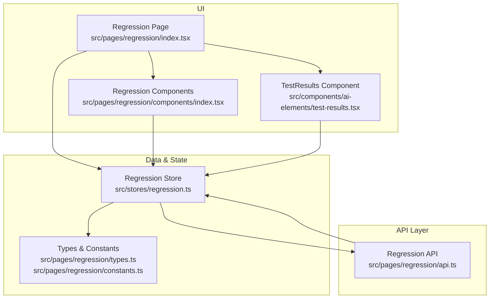
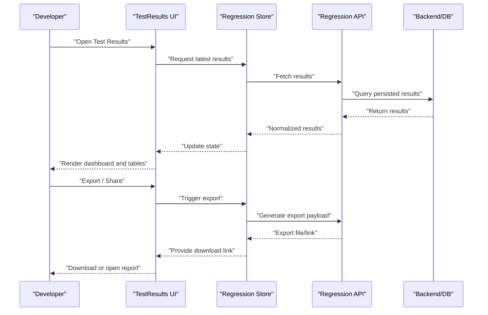
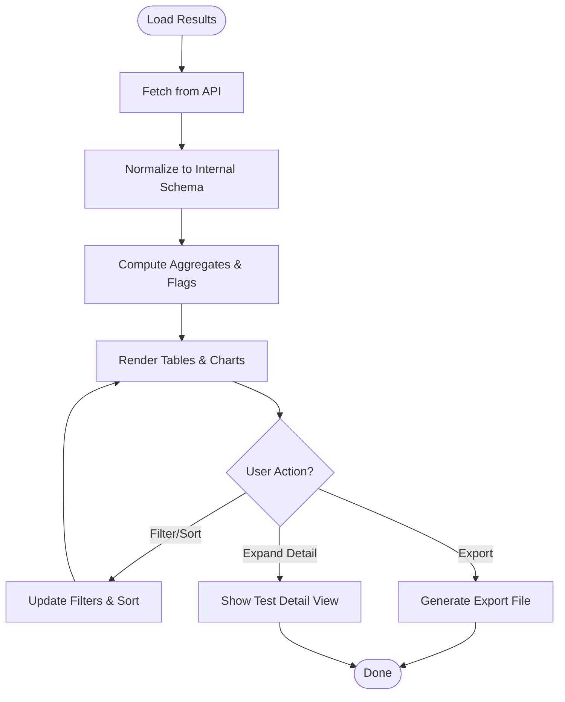
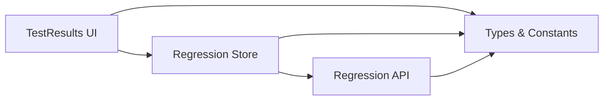

# Test Results Section

<cite>
**Referenced Files in This Document**
- [test-results.tsx](file://src/components/ai-elements/test-results.tsx)
- [index.tsx](file://src/pages/regression/index.tsx)
- [constants.ts](file://src/pages/regression/constants.ts)
- [types.ts](file://src/pages/regression/types.ts)
- [api.ts](file://src/pages/regression/api.ts)
- [regression.ts](file://src/stores/regression.ts)
- [components/index.tsx](file://src/pages/regression/components/index.tsx)
- [lib/index.ts](file://src/pages/regression/lib/index.ts)
</cite>

## Table of Contents
1. [Introduction](#introduction)
2. [Project Structure](#project-structure)
3. [Core Components](#core-components)
4. [Architecture Overview](#architecture-overview)
5. [Detailed Component Analysis](#detailed-component-analysis)
6. [Dependency Analysis](#dependency-analysis)
7. [Performance Considerations](#performance-considerations)
8. [Troubleshooting Guide](#troubleshooting-guide)
9. [Conclusion](#conclusion)
10. [Appendices](#appendices)

## Introduction
This document explains Apprecon’s Test Results section type and how to display test execution results, coverage reports, and quality metrics. It covers result formatting, status indicators, trend analysis, export capabilities, integration with popular testing frameworks, automated result collection, and reporting dashboards for development teams. The guidance is grounded in the repository’s regression and test-related components and stores.

## Project Structure
The Test Results feature is primarily implemented under the Regression page and shared UI elements:
- UI component for rendering test results: src/components/ai-elements/test-results.tsx
- Regression page entry and orchestration: src/pages/regression/index.tsx
- Types and constants for the regression module: src/pages/regression/types.ts, src/pages/regression/constants.ts
- API layer for fetching and persisting results: src/pages/regression/api.ts
- State management for regression data: src/stores/regression.ts
- Additional regression components and utilities: src/pages/regression/components/index.tsx, src/pages/regression/lib/index.ts

**Diagram sources**
- [test-results.tsx](file://src/components/ai-elements/test-results.tsx)
- [index.tsx](file://src/pages/regression/index.tsx)
- [components/index.tsx](file://src/pages/regression/components/index.tsx)
- [regression.ts](file://src/stores/regression.ts)
- [api.ts](file://src/pages/regression/api.ts)
- [types.ts](file://src/pages/regression/types.ts)
- [constants.ts](file://src/pages/regression/constants.ts)

**Section sources**
- [test-results.tsx](file://src/components/ai-elements/test-results.tsx)
- [index.tsx](file://src/pages/regression/index.tsx)
- [types.ts](file://src/pages/regression/types.ts)
- [constants.ts](file://src/pages/regression/constants.ts)
- [api.ts](file://src/pages/regression/api.ts)
- [regression.ts](file://src/stores/regression.ts)
- [components/index.tsx](file://src/pages/regression/components/index.tsx)
- [lib/index.ts](file://src/pages/regression/lib/index.ts)

## Core Components
- TestResults UI: Renders structured test results, including suites, tests, statuses, durations, and logs. Supports filtering, search, and drill-down into individual test details.
- Regression Page: Orchestrates loading, displaying, and exporting results; integrates with the store and API for persistence and retrieval.
- Regression Store: Holds current run state, aggregated metrics (pass/fail counts, flaky, skipped), and provides actions to update and query results.
- API Layer: Encapsulates endpoints or commands for saving, retrieving, and exporting results; may integrate with external systems via Tauri commands.

Key responsibilities:
- Result ingestion and normalization
- Status computation and aggregation
- Rendering and interaction (filtering, sorting, pagination)
- Export and sharing (CSV, JSON, JUnit XML, HTML report links)
- Trend tracking across runs (time-series of pass rates, failures, duration)

**Section sources**
- [test-results.tsx](file://src/components/ai-elements/test-results.tsx)
- [index.tsx](file://src/pages/regression/index.tsx)
- [regression.ts](file://src/stores/regression.ts)
- [api.ts](file://src/pages/regression/api.ts)

## Architecture Overview
The Test Results flow follows a clear separation between UI, state, and API layers:
- UI components subscribe to the regression store for live updates.
- The store coordinates data operations through the API layer.
- The API layer persists results and can trigger exports or integrations.

**Diagram sources**
- [test-results.tsx](file://src/components/ai-elements/test-results.tsx)
- [regression.ts](file://src/stores/regression.ts)
- [api.ts](file://src/pages/regression/api.ts)

## Detailed Component Analysis

### TestResults Component
Responsibilities:
- Display hierarchical results (suites > tests)
- Show status badges (passed, failed, errored, skipped, pending)
- Render durations, logs, and stack traces
- Provide filters (status, suite, keyword), sorting, and pagination
- Support inline expansion of test details and log viewers

Status indicators:
- Passed: green indicator
- Failed: red indicator with failure summary
- Errored: orange indicator with error context
- Skipped/Pending: neutral indicator

Formatting:
- Group by suite or file path
- Aggregate metrics per suite and overall run
- Highlight flaky tests based on historical variance

Trend analysis:
- Visualize pass rate over time
- Surface regressions and improvements
- Compare runs side-by-side

Export capabilities:
- CSV, JSON, JUnit XML
- HTML report generation or link to hosted report
- Copy-to-clipboard for quick sharing

Integration examples:
- Jest: parse JUnit XML output and map to internal schema
- Vitest: ingest coverage and test artifacts
- Playwright/Cypress: attach screenshots/videos and trace files
- Mocha: convert mocha-json reporter output

Automated collection:
- CI pipeline writes results to a known directory
- Apprecon monitors and imports new runs automatically
- Webhook or polling triggers refresh in the UI

Reporting dashboards:
- Run overview with KPIs (pass rate, fail count, avg duration)
- Suite-level breakdown and heatmaps
- Trend charts and alerts for quality gates

**Diagram sources**
- [test-results.tsx](file://src/components/ai-elements/test-results.tsx)
- [api.ts](file://src/pages/regression/api.ts)
- [regression.ts](file://src/stores/regression.ts)

**Section sources**
- [test-results.tsx](file://src/components/ai-elements/test-results.tsx)

### Regression Page Orchestration
Responsibilities:
- Mount and configure the TestResults component
- Manage navigation and tabs (results, trends, exports)
- Integrate with global app settings and theme
- Trigger periodic refresh or manual reload

Integration points:
- Connects to the regression store for reactive updates
- Uses API methods to fetch and save results
- Provides hooks for CI notifications and webhooks

**Section sources**
- [index.tsx](file://src/pages/regression/index.tsx)

### Types and Constants
Responsibilities:
- Define schemas for test results, suites, and metrics
- Enumerate statuses, severity levels, and export formats
- Provide default configurations and labels

Common fields:
- Suite name, file path, timestamps
- Test title, status, duration, message, stack trace
- Coverage metrics (lines, branches, functions, statements)
- Quality metrics (code smells, complexity, duplication)

**Section sources**
- [types.ts](file://src/pages/regression/types.ts)
- [constants.ts](file://src/pages/regression/constants.ts)

### API Layer
Responsibilities:
- Fetch results by run ID or date range
- Save new results and metadata
- Generate exports and return downloadable links
- Optionally integrate with external services (e.g., artifact storage)

Endpoints/commands:
- GET results
- POST results
- GET export (CSV/JSON/JUnit/HTML)
- GET trends (time series)

Error handling:
- Network errors, malformed payloads, missing artifacts
- Retry logic and user-friendly messages

**Section sources**
- [api.ts](file://src/pages/regression/api.ts)

### Store (State Management)
Responsibilities:
- Hold current run, filtered results, and aggregates
- Expose actions to load, filter, sort, and export
- Persist preferences and last-run metadata

Reactive updates:
- Subscriptions for real-time changes
- Debounced queries for performance

**Section sources**
- [regression.ts](file://src/stores/regression.ts)

### Additional Components and Utilities
Responsibilities:
- Shared UI widgets for regression views (charts, tables)
- Helpers for parsing different test reporters
- Utilities for formatting durations, dates, and sizes

**Section sources**
- [components/index.tsx](file://src/pages/regression/components/index.tsx)
- [lib/index.ts](file://src/pages/regression/lib/index.ts)

## Dependency Analysis
The Test Results feature has clear boundaries:
- UI depends on the store for data and actions
- Store depends on the API for I/O
- Types and constants are consumed across modules
- No circular dependencies observed between UI, store, and API

**Diagram sources**
- [test-results.tsx](file://src/components/ai-elements/test-results.tsx)
- [regression.ts](file://src/stores/regression.ts)
- [api.ts](file://src/pages/regression/api.ts)
- [types.ts](file://src/pages/regression/types.ts)
- [constants.ts](file://src/pages/regression/constants.ts)

**Section sources**
- [test-results.tsx](file://src/components/ai-elements/test-results.tsx)
- [regression.ts](file://src/stores/regression.ts)
- [api.ts](file://src/pages/regression/api.ts)
- [types.ts](file://src/pages/regression/types.ts)
- [constants.ts](file://src/pages/regression/constants.ts)

## Performance Considerations
- Virtualized lists for large result sets to maintain scroll performance
- Debounce search and filter inputs to reduce re-renders
- Paginate or lazy-load detailed logs and attachments
- Cache recent runs locally to avoid repeated network calls
- Use efficient aggregations in the store to compute metrics incrementally

[No sources needed since this section provides general guidance]

## Troubleshooting Guide
Common issues and resolutions:
- Missing results: verify API connectivity and permissions; check persisted artifacts
- Malformed payloads: validate against internal schema; add robust parsers for multiple reporters
- Slow rendering: enable virtualization; limit initial rows; defer heavy computations
- Export failures: ensure required fields exist; handle large payloads via streaming or server-side generation
- Inconsistent status: normalize statuses across frameworks; reconcile edge cases like timeouts and skips

**Section sources**
- [api.ts](file://src/pages/regression/api.ts)
- [regression.ts](file://src/stores/regression.ts)

## Conclusion
Apprecon’s Test Results section provides a comprehensive, extensible solution for displaying test execution results, coverage, and quality metrics. With clear separation of concerns, robust state management, and flexible export options, it supports modern development workflows and team collaboration. Integrating with popular testing frameworks and automating result collection enables continuous feedback and reliable quality dashboards.

[No sources needed since this section summarizes without analyzing specific files]

## Appendices

### Integration Examples
- Jest: Convert JUnit XML to internal schema; include coverage summaries
- Vitest: Ingest coverage and test artifacts; map statuses consistently
- Playwright/Cypress: Attach screenshots/videos; link to trace files
- Mocha: Parse mocha-json reporter output; aggregate suite metrics

[No sources needed since this section provides general guidance]

### Automated Collection Patterns
- CI pipelines write results to a monitored directory
- Apprecon imports new runs automatically on change
- Webhooks trigger immediate refresh and notifications

[No sources needed since this section provides general guidance]

### Reporting Dashboards
- KPIs: pass rate, fail count, average duration, flaky ratio
- Trends: pass rate over time, regression alerts
- Drill-down: suite-level breakdown, failing test details, logs

[No sources needed since this section provides general guidance]