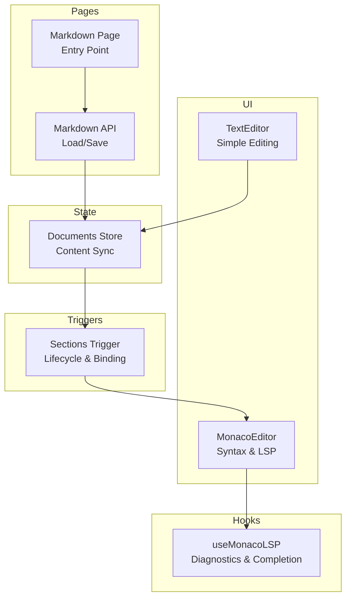
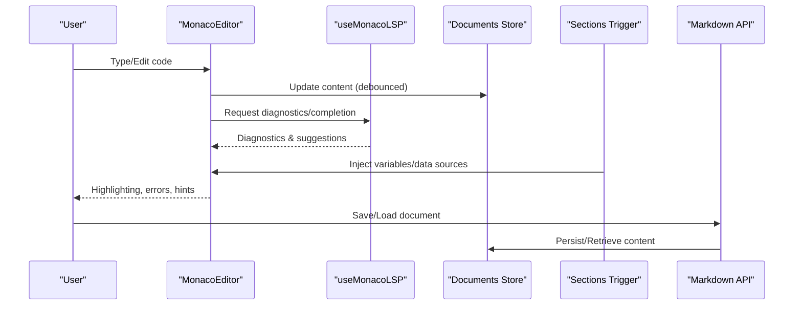
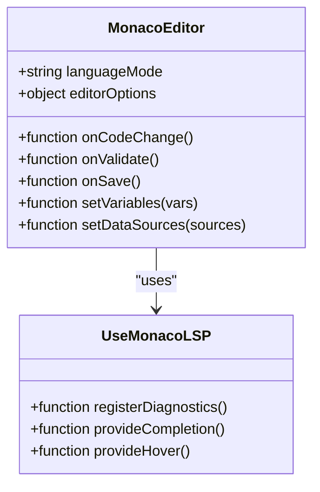
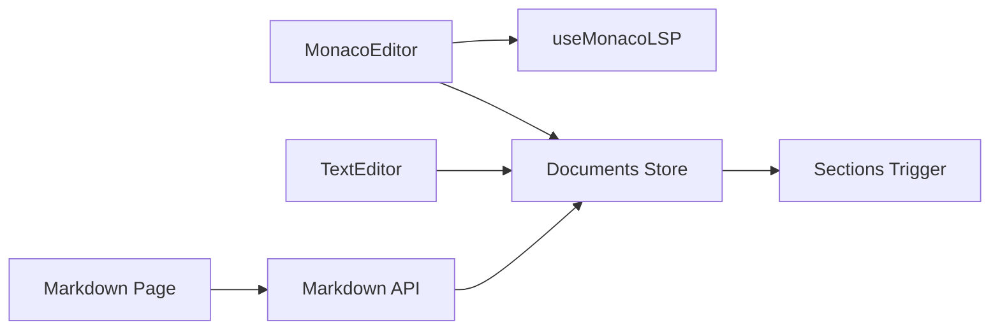

# Code Editor Integration

<cite>
**Referenced Files in This Document**
- [monaco-editor.tsx](file://src/components/ui/monaco-editor.tsx)
- [use-monaco-lsp.ts](file://src/hooks/use-monaco-lsp.ts)
- [text-editor.tsx](file://src/components/ui/text-editor.tsx)
- [documents.ts](file://src/stores/documents.ts)
- [sections.ts](file://src/triggers/documents/sections.ts)
- [index.tsx](file://src/pages/markdown/index.tsx)
- [api.ts](file://src/pages/markdown/api.ts)
- [constants.ts](file://src/pages/markdown/constants.ts)
- [types.ts](file://src/pages/markdown/types.ts)
</cite>

## Table of Contents
1. [Introduction](#introduction)
2. [Project Structure](#project-structure)
3. [Core Components](#core-components)
4. [Architecture Overview](#architecture-overview)
5. [Detailed Component Analysis](#detailed-component-analysis)
6. [Dependency Analysis](#dependency-analysis)
7. [Performance Considerations](#performance-considerations)
8. [Troubleshooting Guide](#troubleshooting-guide)
9. [Conclusion](#conclusion)
10. [Appendices](#appendices)

## Introduction
This document explains how the custom section code editor integrates into Apprecon’s documents and sections system. It covers syntax highlighting, validation, real-time editing, configuration options, supported languages, customization hooks, execution context, variable binding, data source integration, example workflows, and debugging strategies. The goal is to help developers understand both the user-facing behavior and the underlying implementation so they can extend or troubleshoot the editor effectively.

## Project Structure
The code editor integration spans UI components, hooks for language features, stores for persistence, and triggers that connect documents and sections to the editor. Key areas include:
- Monaco-based editor component with LSP integration
- Text editor wrapper for simpler use cases
- Document store for content synchronization
- Section triggers for lifecycle and data binding
- Markdown page entry points and APIs for loading/saving content

**Diagram sources**
- [monaco-editor.tsx](file://src/components/ui/monaco-editor.tsx)
- [use-monaco-lsp.ts](file://src/hooks/use-monaco-lsp.ts)
- [text-editor.tsx](file://src/components/ui/text-editor.tsx)
- [documents.ts](file://src/stores/documents.ts)
- [sections.ts](file://src/triggers/documents/sections.ts)
- [index.tsx](file://src/pages/markdown/index.tsx)
- [api.ts](file://src/pages/markdown/api.ts)

**Section sources**
- [monaco-editor.tsx](file://src/components/ui/monaco-editor.tsx)
- [use-monaco-lsp.ts](file://src/hooks/use-monaco-lsp.ts)
- [text-editor.tsx](file://src/components/ui/text-editor.tsx)
- [documents.ts](file://src/stores/documents.ts)
- [sections.ts](file://src/triggers/documents/sections.ts)
- [index.tsx](file://src/pages/markdown/index.tsx)
- [api.ts](file://src/pages/markdown/api.ts)

## Core Components
- MonacoEditor: A feature-rich editor providing syntax highlighting, diagnostics (validation), completion, and real-time updates via Monaco. It integrates with LSP through a hook to provide intelligent suggestions and error reporting.
- TextEditor: A lightweight text input wrapper used when advanced features are not required. It binds directly to the document store for simple save/load flows.
- useMonacoLSP: Hook that configures language servers, registers diagnostics, and wires up completions and hover info to Monaco.
- Documents Store: Centralized state for document content, ensuring consistent read/write across editors and pages.
- Sections Trigger: Orchestrates section lifecycle events, injecting variables and connecting data sources to the editor context.

Key responsibilities:
- Syntax highlighting per language mode
- Real-time validation via LSP diagnostics
- Completion and hover assistance
- Content synchronization with the store
- Variable binding and data source access within the editor’s execution context

**Section sources**
- [monaco-editor.tsx](file://src/components/ui/monaco-editor.tsx)
- [use-monaco-lsp.ts](file://src/hooks/use-monaco-lsp.ts)
- [text-editor.tsx](file://src/components/ui/text-editor.tsx)
- [documents.ts](file://src/stores/documents.ts)
- [sections.ts](file://src/triggers/documents/sections.ts)

## Architecture Overview
The editor architecture combines a React UI layer with a robust Monaco backend and LSP integration. The flow ensures that edits are immediately reflected in the store and validated by language servers. Section triggers inject runtime variables and expose data sources to the editor’s execution context.

**Diagram sources**
- [monaco-editor.tsx](file://src/components/ui/monaco-editor.tsx)
- [use-monaco-lsp.ts](file://src/hooks/use-monaco-lsp.ts)
- [documents.ts](file://src/stores/documents.ts)
- [sections.ts](file://src/triggers/documents/sections.ts)
- [api.ts](file://src/pages/markdown/api.ts)

## Detailed Component Analysis

### MonacoEditor Component
MonacoEditor provides the core editing experience:
- Syntax highlighting based on language mode
- Real-time validation via LSP diagnostics
- Autocomplete and hover information
- Configurable editor options (theme, font size, line numbers, minimap)
- Event hooks for onChange, onSave, and onValidate

Configuration options typically include:
- Language mode selection
- Theme and appearance settings
- Validation toggles and severity thresholds
- Debounce timing for saves and diagnostics
- Custom keybindings and shortcuts

Supported languages depend on Monaco’s built-in modes and any additional LSP configurations provided by useMonacoLSP. Commonly supported modes include JavaScript, TypeScript, Python, JSON, YAML, HTML, CSS, SQL, and more, depending on project setup.

Customization hooks:
- onCodeChange: triggered on every keystroke or debounced interval
- onValidate: receives diagnostic results for real-time feedback
- onSave: persists changes to the store or external API
- onLanguageChange: adapts LSP and validation rules dynamically

Execution context and variable binding:
- Variables injected by sections trigger are available at runtime
- Data sources exposed by Apprecon can be accessed via predefined bindings
- Errors from execution are surfaced back to the editor diagnostics

**Diagram sources**
- [monaco-editor.tsx](file://src/components/ui/monaco-editor.tsx)
- [use-monaco-lsp.ts](file://src/hooks/use-monaco-lsp.ts)

**Section sources**
- [monaco-editor.tsx](file://src/components/ui/monaco-editor.tsx)
- [use-monaco-lsp.ts](file://src/hooks/use-monaco-lsp.ts)

### TextEditor Component
TextEditor is a simplified editor for non-code text fields:
- Binds directly to the document store
- Supports basic formatting and saving
- No LSP or advanced validation

Use cases include plain text notes, descriptions, or simple scripts where full editor features are unnecessary.

**Section sources**
- [text-editor.tsx](file://src/components/ui/text-editor.tsx)
- [documents.ts](file://src/stores/documents.ts)

### useMonacoLSP Hook
The hook configures language servers and integrates them with Monaco:
- Registers diagnostic providers for each language
- Provides completion items and hover info
- Handles server lifecycle and error recovery
- Exposes methods to update language-specific settings

This enables real-time validation and intelligent suggestions without leaving the editor.

**Section sources**
- [use-monaco-lsp.ts](file://src/hooks/use-monaco-lsp.ts)

### Documents Store
The store manages document content and synchronization:
- Holds current content for all open documents
- Emits updates to subscribers (editors, panels)
- Persists changes via API calls or local storage
- Ensures consistency across multiple editor instances

It acts as the single source of truth for editor content and coordinates save/load operations.

**Section sources**
- [documents.ts](file://src/stores/documents.ts)

### Sections Trigger
The sections trigger orchestrates section lifecycle and data binding:
- Injects variables into the editor’s execution context
- Connects Apprecon data sources (e.g., HTTP responses, browser state)
- Manages permissions and scoping for safe execution
- Triggers validation and execution hooks

This allows custom section logic to interact with live application data securely.

**Section sources**
- [sections.ts](file://src/triggers/documents/sections.ts)

### Markdown Page and API
The markdown page serves as an entry point for document editing:
- Renders editor components based on content type
- Integrates with the markdown API for load/save operations
- Displays metadata and status indicators

The API handles:
- Fetching document content from storage
- Saving edited content back to persistent storage
- Validating payloads and handling errors

**Section sources**
- [index.tsx](file://src/pages/markdown/index.tsx)
- [api.ts](file://src/pages/markdown/api.ts)
- [constants.ts](file://src/pages/markdown/constants.ts)
- [types.ts](file://src/pages/markdown/types.ts)

## Dependency Analysis
The editor integration relies on clear separation between UI, state, and lifecycle management:
- MonacoEditor depends on useMonacoLSP for language features
- Both editors depend on the documents store for content sync
- Sections trigger injects runtime context into editors
- Markdown page and API coordinate persistence and rendering

Potential coupling points:
- Language mode configuration must align with LSP capabilities
- Variable binding must match expected schema for safe execution
- Store updates should be debounced to avoid excessive re-renders

**Diagram sources**
- [monaco-editor.tsx](file://src/components/ui/monaco-editor.tsx)
- [use-monaco-lsp.ts](file://src/hooks/use-monaco-lsp.ts)
- [text-editor.tsx](file://src/components/ui/text-editor.tsx)
- [documents.ts](file://src/stores/documents.ts)
- [sections.ts](file://src/triggers/documents/sections.ts)
- [index.tsx](file://src/pages/markdown/index.tsx)
- [api.ts](file://src/pages/markdown/api.ts)

**Section sources**
- [monaco-editor.tsx](file://src/components/ui/monaco-editor.tsx)
- [use-monaco-lsp.ts](file://src/hooks/use-monaco-lsp.ts)
- [text-editor.tsx](file://src/components/ui/text-editor.tsx)
- [documents.ts](file://src/stores/documents.ts)
- [sections.ts](file://src/triggers/documents/sections.ts)
- [index.tsx](file://src/pages/markdown/index.tsx)
- [api.ts](file://src/pages/markdown/api.ts)

## Performance Considerations
- Debounce editor updates to reduce store churn and LSP requests
- Lazy-load language servers only when needed
- Limit diagnostic scope to visible regions for large files
- Use virtual scrolling for long documents if applicable
- Cache LSP responses where possible to minimize network overhead

[No sources needed since this section provides general guidance]

## Troubleshooting Guide
Common issues and resolutions:
- Syntax highlighting not working: Verify language mode is set correctly and LSP is initialized
- Validation errors not appearing: Check LSP diagnostics registration and severity thresholds
- Autocomplete not showing: Ensure completion provider is registered and network requests succeed
- Variables not available: Confirm sections trigger injects correct variable names and scopes
- Save failures: Inspect API responses and store synchronization logs

Debugging steps:
- Open browser console to monitor LSP messages and errors
- Log store updates to verify content synchronization
- Validate variable binding schemas against expected types
- Test with minimal code to isolate issues

**Section sources**
- [use-monaco-lsp.ts](file://src/hooks/use-monaco-lsp.ts)
- [documents.ts](file://src/stores/documents.ts)
- [sections.ts](file://src/triggers/documents/sections.ts)
- [api.ts](file://src/pages/markdown/api.ts)

## Conclusion
Apprecon’s custom section code editor integrates Monaco with LSP for a powerful editing experience. Through careful separation of concerns—UI, state, and lifecycle—the system supports syntax highlighting, validation, real-time editing, and secure execution contexts. Developers can extend functionality by configuring language modes, adding custom diagnostics, and expanding variable bindings. Proper performance tuning and debugging practices ensure a smooth user experience.

[No sources needed since this section summarizes without analyzing specific files]

## Appendices
- Example workflow: Writing custom section logic
  - Define variables and data sources in sections trigger
  - Configure MonacoEditor with appropriate language mode
  - Implement onSave to persist changes via API
  - Use onValidate to handle custom checks beyond LSP

- Best practices:
  - Keep language modes aligned with actual file extensions
  - Debounce heavy operations like diagnostics and saves
  - Validate inputs before executing custom logic
  - Provide clear error messages in the editor UI

[No sources needed since this section provides general guidance]