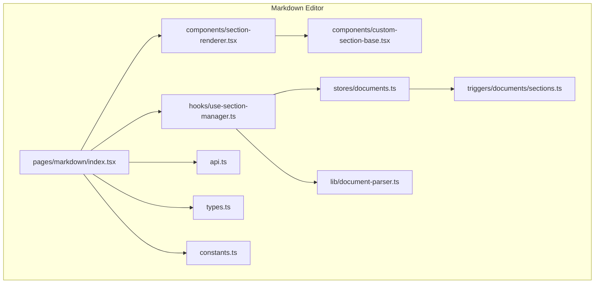
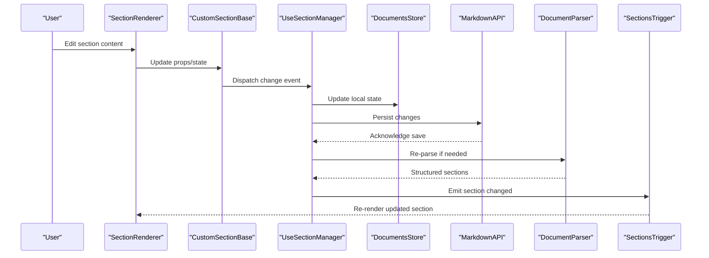
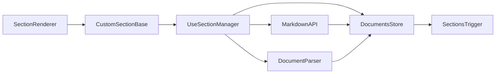

# Custom Section Development

<cite>
**Referenced Files in This Document**
- [index.tsx](file://src/pages/markdown/index.tsx)
- [types.ts](file://src/pages/markdown/types.ts)
- [api.ts](file://src/pages/markdown/api.ts)
- [constants.ts](file://src/pages/markdown/constants.ts)
- [components/section-renderer.tsx](file://src/pages/markdown/components/section-renderer.tsx)
- [components/custom-section-base.tsx](file://src/pages/markdown/components/custom-section-base.tsx)
- [hooks/use-section-manager.ts](file://src/pages/markdown/hooks/use-section-manager.ts)
- [lib/document-parser.ts](file://src/pages/markdown/lib/document-parser.ts)
- [stores/documents.ts](file://src/stores/documents.ts)
- [triggers/documents/sections.ts](file://src/triggers/documents/sections.ts)
</cite>

## Table of Contents
1. [Introduction](#introduction)
2. [Project Structure](#project-structure)
3. [Core Components](#core-components)
4. [Architecture Overview](#architecture-overview)
5. [Detailed Component Analysis](#detailed-component-analysis)
6. [Dependency Analysis](#dependency-analysis)
7. [Performance Considerations](#performance-considerations)
8. [Troubleshooting Guide](#troubleshooting-guide)
9. [Conclusion](#conclusion)
10. [Appendices](#appendices)

## Introduction
This guide explains how to create custom sections for Apprecon’s markdown editor. It covers the development workflow, section templates, component structure, and API interfaces. You will learn how to implement custom section logic, handle user input, integrate with Apprecon’s data layer, validate content, handle errors, and test your sections. Step-by-step instructions are provided to build and deploy custom sections into the editor environment.

## Project Structure
The markdown editor is implemented under src/pages/markdown. The key areas relevant to custom sections include:
- Page entry and routing
- Types and constants defining section schemas
- API layer for document operations
- Component registry and rendering pipeline
- Hooks for managing sections and state
- Libraries for parsing and transforming documents
- Stores for persistence and synchronization
- Triggers for events and side effects

**Diagram sources**
- [index.tsx](file://src/pages/markdown/index.tsx)
- [components/section-renderer.tsx](file://src/pages/markdown/components/section-renderer.tsx)
- [custom-section-base.tsx](file://src/pages/markdown/components/custom-section-base.tsx)
- [use-section-manager.ts](file://src/pages/markdown/hooks/use-section-manager.ts)
- [documents.ts](file://src/stores/documents.ts)
- [document-parser.ts](file://src/pages/markdown/lib/document-parser.ts)
- [api.ts](file://src/pages/markdown/api.ts)
- [types.ts](file://src/pages/markdown/types.ts)
- [constants.ts](file://src/pages/markdown/constants.ts)
- [sections.ts](file://src/triggers/documents/sections.ts)

**Section sources**
- [index.tsx](file://src/pages/markdown/index.tsx)
- [types.ts](file://src/pages/markdown/types.ts)
- [api.ts](file://src/pages/markdown/api.ts)
- [constants.ts](file://src/pages/markdown/constants.ts)
- [components/section-renderer.tsx](file://src/pages/markdown/components/section-renderer.tsx)
- [components/custom-section-base.tsx](file://src/pages/markdown/components/custom-section-base.tsx)
- [hooks/use-section-manager.ts](file://src/pages/markdown/hooks/use-section-manager.ts)
- [lib/document-parser.ts](file://src/pages/markdown/lib/document-parser.ts)
- [stores/documents.ts](file://src/stores/documents.ts)
- [triggers/documents/sections.ts](file://src/triggers/documents/sections.ts)

## Core Components
Custom sections are built around a base component and a renderer that maps section types to their UI implementations. Key elements:
- Base component template: provides common props, lifecycle hooks, and validation utilities
- Renderer: resolves section type and renders the appropriate component
- Section manager hook: manages section state, persistence, and event handling
- Document parser: converts raw markdown AST or serialized sections into runtime structures
- API layer: persists and retrieves documents and sections
- Stores: centralizes application state for documents and sections
- Triggers: emits events when sections change or require side effects

Typical responsibilities:
- Define section schema and validation rules
- Implement UI interactions and input handling
- Persist changes through the API and stores
- Emit triggers for cross-feature integration

**Section sources**
- [components/custom-section-base.tsx](file://src/pages/markdown/components/custom-section-base.tsx)
- [components/section-renderer.tsx](file://src/pages/markdown/components/section-renderer.tsx)
- [hooks/use-section-manager.ts](file://src/pages/markdown/hooks/use-section-manager.ts)
- [lib/document-parser.ts](file://src/pages/markdown/lib/document-parser.ts)
- [api.ts](file://src/pages/markdown/api.ts)
- [stores/documents.ts](file://src/stores/documents.ts)
- [triggers/documents/sections.ts](file://src/triggers/documents/sections.ts)

## Architecture Overview
The custom section architecture follows a clear separation of concerns:
- UI components render sections based on type
- State management handles persistence and synchronization
- Parsing transforms raw content into structured sections
- API and stores provide data access and updates
- Triggers coordinate cross-cutting behaviors

**Diagram sources**
- [components/section-renderer.tsx](file://src/pages/markdown/components/section-renderer.tsx)
- [components/custom-section-base.tsx](file://src/pages/markdown/components/custom-section-base.tsx)
- [hooks/use-section-manager.ts](file://src/pages/markdown/hooks/use-section-manager.ts)
- [stores/documents.ts](file://src/stores/documents.ts)
- [api.ts](file://src/pages/markdown/api.ts)
- [lib/document-parser.ts](file://src/pages/markdown/lib/document-parser.ts)
- [triggers/documents/sections.ts](file://src/triggers/documents/sections.ts)

## Detailed Component Analysis

### Section Template and Base Component
A custom section should extend the base component to inherit shared behavior:
- Props interface: defines required fields like id, type, value, and callbacks
- Lifecycle hooks: mount, update, and unmount phases
- Validation helpers: ensure data integrity before persisting
- Event dispatchers: notify managers and triggers of changes

Implementation steps:
- Create a new file for your section component
- Extend the base component and define your props
- Implement input handlers and validation logic
- Register the section type in the renderer

**Section sources**
- [components/custom-section-base.tsx](file://src/pages/markdown/components/custom-section-base.tsx)

### Section Renderer and Type Resolution
The renderer maps section types to their corresponding components:
- Registry: maintains a map of type to component
- Resolution logic: selects the correct component based on section.type
- Fallback handling: renders a default or error state for unknown types

To add a new section:
- Export your component
- Add it to the renderer’s registry
- Ensure consistent naming conventions for types

**Section sources**
- [components/section-renderer.tsx](file://src/pages/markdown/components/section-renderer.tsx)

### Section Manager Hook
The manager hook orchestrates section state and persistence:
- State shape: holds sections array and metadata
- Change handlers: normalize and validate updates
- Persistence: integrates with API and stores
- Event emission: triggers side effects via triggers

Key methods:
- addSection(section): insert a new section
- updateSection(id, updates): modify existing section
- removeSection(id): delete a section
- reorderSections(order): adjust display order

**Section sources**
- [hooks/use-section-manager.ts](file://src/pages/markdown/hooks/use-section-manager.ts)

### Document Parser
The parser transforms raw markdown or serialized content into structured sections:
- Input formats: supports markdown AST nodes and JSON-like payloads
- Transformation rules: convert tokens to section objects
- Error recovery: handles malformed content gracefully

Parsing flow:
- Parse raw content into AST
- Traverse nodes and extract section data
- Validate and normalize each section
- Return structured sections for rendering

**Section sources**
- [lib/document-parser.ts](file://src/pages/markdown/lib/document-parser.ts)

### API Layer and Data Integration
The API layer handles communication with backend services:
- CRUD operations: create, read, update, delete sections
- Batch operations: optimize multiple changes
- Error handling: retries and fallbacks

Integration points:
- Connect to Tauri commands for persistent storage
- Use WebSocket for real-time collaboration (if applicable)
- Cache responses to improve performance

**Section sources**
- [api.ts](file://src/pages/markdown/api.ts)
- [stores/documents.ts](file://src/stores/documents.ts)

### Triggers and Side Effects
Triggers enable cross-feature integration:
- Section changed: notify other features of updates
- Validation failed: show warnings or block actions
- Import/export: trigger serialization or deserialization

Common patterns:
- Emit events with payload containing section data
- Handle events in other modules to sync state
- Debounce frequent updates to avoid excessive processing

**Section sources**
- [triggers/documents/sections.ts](file://src/triggers/documents/sections.ts)

## Dependency Analysis
Understanding dependencies between components helps maintain modularity:
- Section components depend on base component and manager hook
- Renderer depends on registry and component exports
- Parser depends on markdown libraries and validators
- API depends on Tauri commands and network layers
- Stores depend on persistence backends and sync mechanisms

**Diagram sources**
- [components/custom-section-base.tsx](file://src/pages/markdown/components/custom-section-base.tsx)
- [components/section-renderer.tsx](file://src/pages/markdown/components/section-renderer.tsx)
- [hooks/use-section-manager.ts](file://src/pages/markdown/hooks/use-section-manager.ts)
- [stores/documents.ts](file://src/stores/documents.ts)
- [api.ts](file://src/pages/markdown/api.ts)
- [lib/document-parser.ts](file://src/pages/markdown/lib/document-parser.ts)
- [triggers/documents/sections.ts](file://src/triggers/documents/sections.ts)

**Section sources**
- [components/custom-section-base.tsx](file://src/pages/markdown/components/custom-section-base.tsx)
- [components/section-renderer.tsx](file://src/pages/markdown/components/section-renderer.tsx)
- [hooks/use-section-manager.ts](file://src/pages/markdown/hooks/use-section-manager.ts)
- [stores/documents.ts](file://src/stores/documents.ts)
- [api.ts](file://src/pages/markdown/api.ts)
- [lib/document-parser.ts](file://src/pages/markdown/lib/document-parser.ts)
- [triggers/documents/sections.ts](file://src/triggers/documents/sections.ts)

## Performance Considerations
Optimize custom sections for smooth user experience:
- Debounce input handlers to reduce re-renders
- Use memoization for expensive computations
- Lazy-load heavy components when not visible
- Batch API calls for multiple updates
- Implement virtual scrolling for large section lists
- Minimize state updates by consolidating changes

[No sources needed since this section provides general guidance]

## Troubleshooting Guide
Common issues and solutions:
- Validation errors: check schema definitions and input sanitization
- Rendering problems: verify section type registration and prop contracts
- Persistence failures: inspect API responses and store synchronization
- Performance bottlenecks: profile component updates and network requests
- Event conflicts: review trigger emissions and handler priorities

Debugging tips:
- Enable detailed logging in development mode
- Use browser dev tools to inspect state and network traffic
- Test edge cases with invalid or empty inputs
- Verify compatibility across different browsers and devices

**Section sources**
- [api.ts](file://src/pages/markdown/api.ts)
- [stores/documents.ts](file://src/stores/documents.ts)
- [triggers/documents/sections.ts](file://src/triggers/documents/sections.ts)

## Conclusion
Building custom sections in Apprecon’s markdown editor involves creating components that extend the base template, integrating with the section manager and parser, and registering them with the renderer. By following the established patterns for validation, persistence, and event handling, you can develop robust and performant sections that seamlessly integrate with the editor ecosystem.

[No sources needed since this section summarizes without analyzing specific files]

## Appendices

### Step-by-Step Guide: Building a Custom Section
1. Create a new component file extending the base section component
2. Define your section schema and validation rules
3. Implement input handlers and state management
4. Register the section type in the renderer
5. Integrate with the section manager for persistence
6. Add triggers for cross-feature integration
7. Test thoroughly with various inputs and edge cases
8. Deploy to the editor environment

### Testing Strategies
- Unit tests for validation logic and parsers
- Component tests for user interactions
- Integration tests for API and store synchronization
- End-to-end tests for complete workflows
- Performance tests for large datasets

### Deployment Checklist
- Ensure all dependencies are properly imported
- Verify section type registration
- Test in production-like environment
- Document API contracts and usage examples
- Monitor for errors and performance issues

[No sources needed since this section provides general guidance]