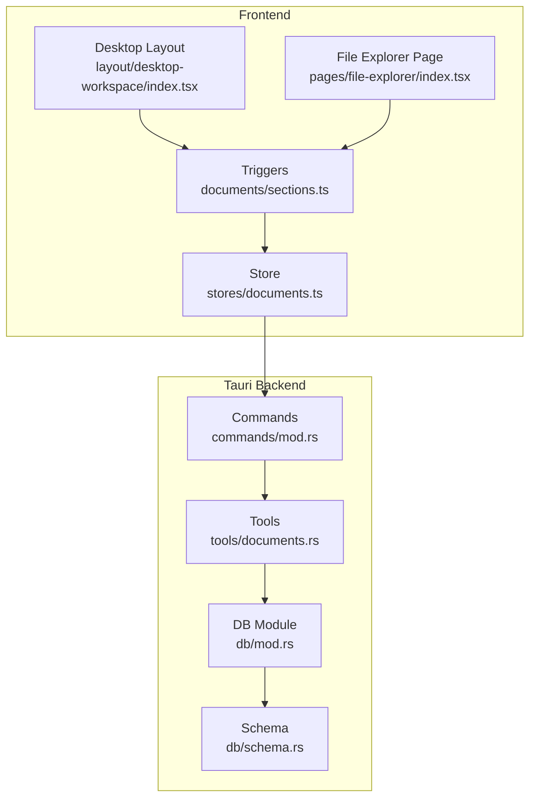
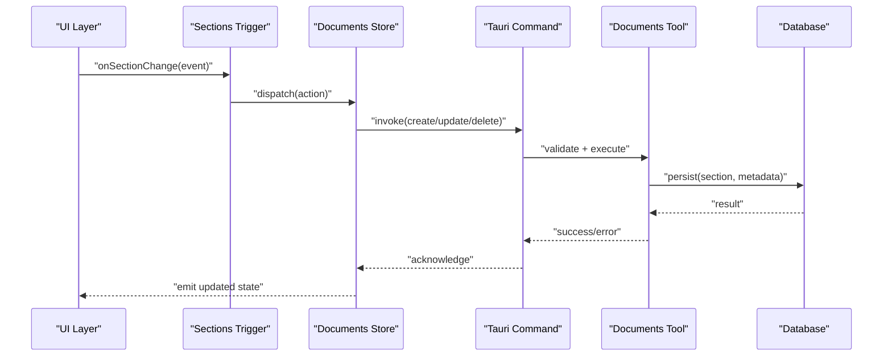
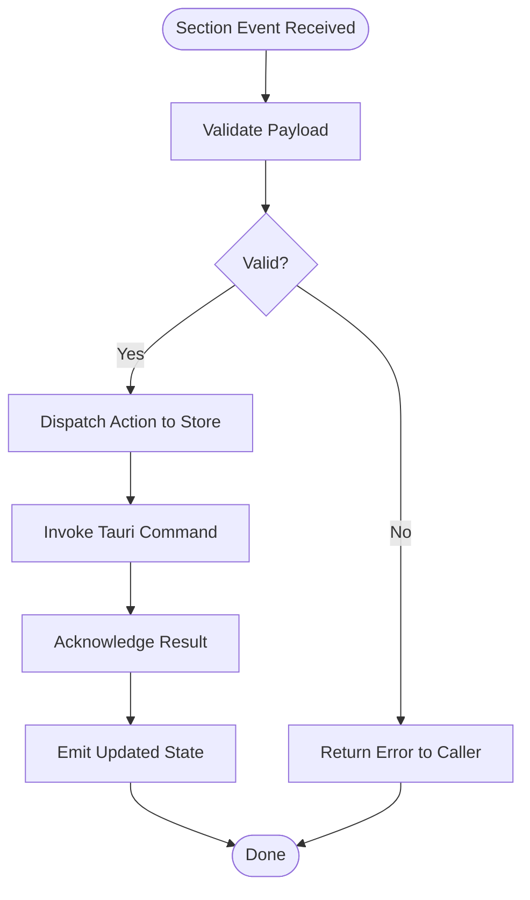
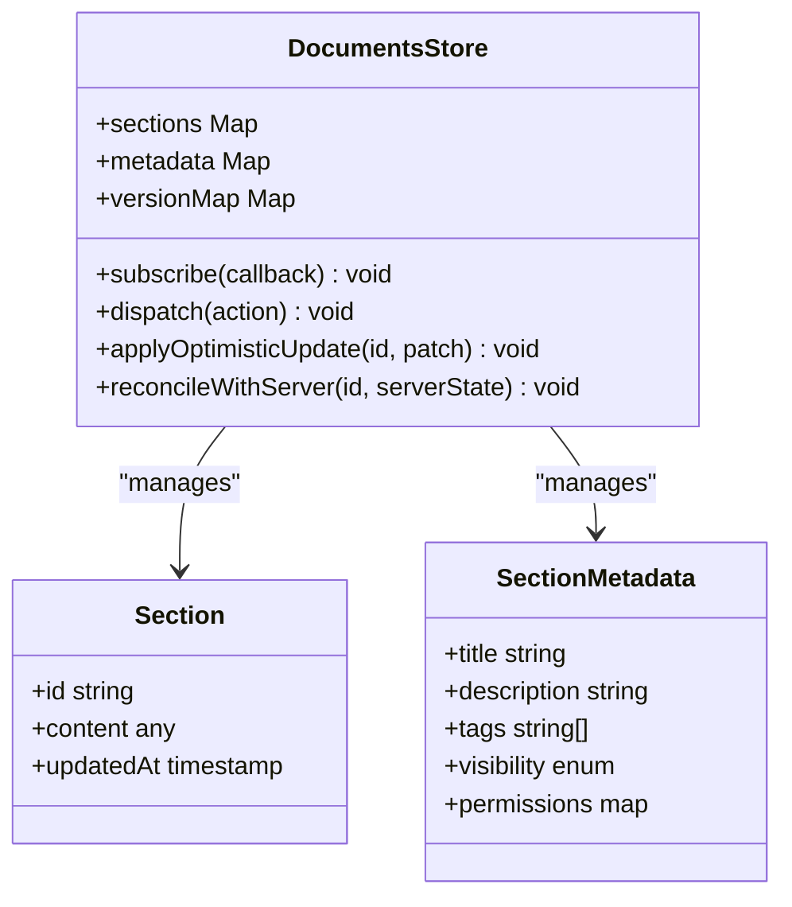
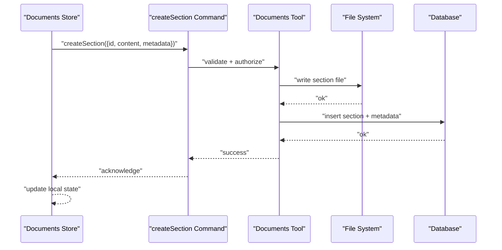
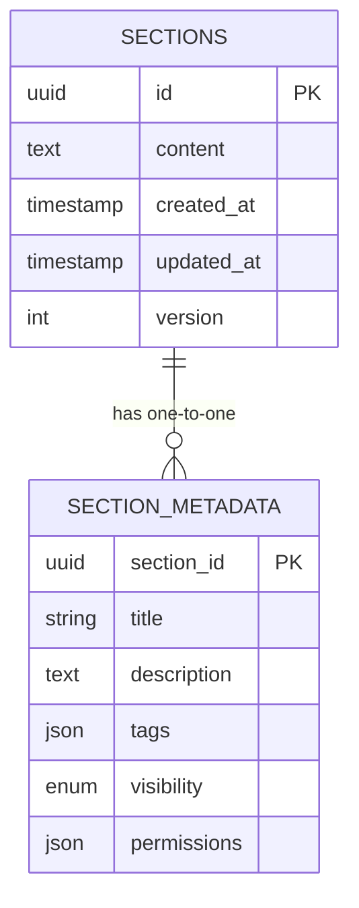
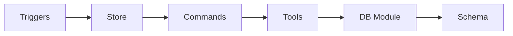

# Section API Integration

<cite>
**Referenced Files in This Document**
- [src/triggers/documents/sections.ts](file://src/triggers/documents/sections.ts)
- [src/triggers/documents/index.ts](file://src/triggers/documents/index.ts)
- [src/stores/documents.ts](file://src/stores/documents.ts)
- [src-tauri/src/tools/documents.rs](file://src-tauri/src/tools/documents.rs)
- [src-tauri/src/db/mod.rs](file://src-tauri/src/db/mod.rs)
- [src-tauri/src/db/schema.rs](file://src-tauri/src/db/schema.rs)
- [src-tauri/src/commands/mod.rs](file://src-tauri/src/commands/mod.rs)
- [src/layout/desktop-workspace/index.tsx](file://src/layout/desktop-workspace/index.tsx)
- [src/pages/file-explorer/index.tsx](file://src/pages/file-explorer/index.tsx)
</cite>

## Table of Contents
1. [Introduction](#introduction)
2. [Project Structure](#project-structure)
3. [Core Components](#core-components)
4. [Architecture Overview](#architecture-overview)
5. [Detailed Component Analysis](#detailed-component-analysis)
6. [Dependency Analysis](#dependency-analysis)
7. [Performance Considerations](#performance-considerations)
8. [Troubleshooting Guide](#troubleshooting-guide)
9. [Conclusion](#conclusion)
10. [Appendices](#appendices)

## Introduction
This document explains how to integrate custom sections with Apprecon’s editor APIs. It covers the file management system, data persistence mechanisms, and communication protocols between sections and the editor core. You will learn how to implement CRUD operations for section content, handle real-time updates, manage section metadata, and apply security and permission models for section access. The guide includes practical examples of API calls, error handling patterns, and data synchronization strategies.

## Project Structure
Apprecon organizes section-related functionality across frontend triggers, stores, Tauri tools, and database layers:
- Frontend triggers define events and actions that sections can emit or subscribe to.
- Stores maintain reactive state for documents and sections.
- Tauri tools expose commands to read/write files and persist data.
- Database schema defines persistent structures for sections and metadata.
- Commands module wires Tauri commands to tool implementations.
- Layout and page components render sections within the desktop workspace and file explorer.

**Diagram sources**
- [src/triggers/documents/sections.ts](file://src/triggers/documents/sections.ts)
- [src/stores/documents.ts](file://src/stores/documents.ts)
- [src/layout/desktop-workspace/index.tsx](file://src/layout/desktop-workspace/index.tsx)
- [src/pages/file-explorer/index.tsx](file://src/pages/file-explorer/index.tsx)
- [src-tauri/src/tools/documents.rs](file://src-tauri/src/tools/documents.rs)
- [src-tauri/src/commands/mod.rs](file://src-tauri/src/commands/mod.rs)
- [src-tauri/src/db/mod.rs](file://src-tauri/src/db/mod.rs)
- [src-tauri/src/db/schema.rs](file://src-tauri/src/db/schema.rs)

**Section sources**
- [src/triggers/documents/index.ts](file://src/triggers/documents/index.ts)
- [src/layout/desktop-workspace/index.tsx](file://src/layout/desktop-workspace/index.tsx)
- [src/pages/file-explorer/index.tsx](file://src/pages/file-explorer/index.tsx)

## Core Components
- Triggers (documents/sections): Define section lifecycle events and actions such as create, update, delete, and publish. They also provide hooks for subscribing to changes from the editor core.
- Store (documents): Holds reactive state for sections, including content, metadata, and versioning. It coordinates optimistic updates and reconciliation with persisted data.
- Tools (documents.rs): Implement file I/O and persistence logic. They validate inputs, enforce permissions, and interact with the database layer.
- Database (db/mod.rs, db/schema.rs): Provide schema definitions and repository methods for storing sections and their metadata.
- Commands (commands/mod.rs): Expose Tauri commands that the frontend invokes to perform CRUD operations on sections.

Key responsibilities:
- File management: Create, read, update, delete section files and directories.
- Data persistence: Serialize section content and metadata into the database.
- Communication: Bridge frontend events to backend commands and propagate updates back to the UI.
- Security: Validate user roles and permissions before performing mutations.

**Section sources**
- [src/triggers/documents/sections.ts](file://src/triggers/documents/sections.ts)
- [src/stores/documents.ts](file://src/stores/documents.ts)
- [src-tauri/src/tools/documents.rs](file://src-tauri/src/tools/documents.rs)
- [src-tauri/src/db/mod.rs](file://src-tauri/src/db/mod.rs)
- [src-tauri/src/db/schema.rs](file://src-tauri/src/db/schema.rs)
- [src-tauri/src/commands/mod.rs](file://src-tauri/src/commands/mod.rs)

## Architecture Overview
The integration follows a layered architecture:
- Frontend triggers emit section events.
- The store manages local state and dispatches commands via Tauri.
- Tauri commands route requests to tools.
- Tools perform validation, file operations, and database writes.
- Updates are propagated back through events to keep the UI synchronized.

**Diagram sources**
- [src/triggers/documents/sections.ts](file://src/triggers/documents/sections.ts)
- [src/stores/documents.ts](file://src/stores/documents.ts)
- [src-tauri/src/commands/mod.rs](file://src-tauri/src/commands/mod.rs)
- [src-tauri/src/tools/documents.rs](file://src-tauri/src/tools/documents.rs)
- [src-tauri/src/db/mod.rs](file://src-tauri/src/db/mod.rs)

## Detailed Component Analysis

### Sections Trigger
The trigger centralizes section events and actions. It exposes functions to:
- Create new sections with initial content and metadata.
- Update existing sections’ content and metadata.
- Delete sections and associated resources.
- Publish or unpublish sections for visibility.
- Subscribe to editor core events for real-time synchronization.

Implementation patterns:
- Event-driven architecture using typed payloads.
- Validation of required fields before dispatching actions.
- Error propagation to the store for consistent handling.

**Diagram sources**
- [src/triggers/documents/sections.ts](file://src/triggers/documents/sections.ts)

**Section sources**
- [src/triggers/documents/sections.ts](file://src/triggers/documents/sections.ts)

### Documents Store
The store maintains reactive state for sections:
- Content cache for fast rendering.
- Metadata registry for titles, descriptions, tags, and versions.
- Versioning and conflict resolution for concurrent edits.
- Optimistic updates with rollback on failure.

Data flow:
- Actions from triggers update local state immediately.
- Persistence is performed asynchronously.
- On success, state remains; on failure, revert to previous snapshot.

**Diagram sources**
- [src/stores/documents.ts](file://src/stores/documents.ts)

**Section sources**
- [src/stores/documents.ts](file://src/stores/documents.ts)

### Tauri Tools and Commands
Tools implement secure file and database operations:
- Input validation and sanitization.
- Permission checks based on user roles and section policies.
- Atomic writes to prevent partial updates.
- Transactional persistence for consistency.

Commands expose endpoints for:
- createSection(payload)
- updateSection(id, payload)
- deleteSection(id)
- getSection(id)
- listSections(filters)

**Diagram sources**
- [src-tauri/src/commands/mod.rs](file://src-tauri/src/commands/mod.rs)
- [src-tauri/src/tools/documents.rs](file://src-tauri/src/tools/documents.rs)

**Section sources**
- [src-tauri/src/commands/mod.rs](file://src-tauri/src/commands/mod.rs)
- [src-tauri/src/tools/documents.rs](file://src-tauri/src/tools/documents.rs)

### Database Schema and Persistence
The schema defines tables for sections and metadata:
- Sections table: id, content blob, timestamps, version.
- Metadata table: section_id, title, description, tags, visibility, permissions.
- Indexes for efficient queries by tags and visibility.

Persistence strategy:
- Use transactions for multi-step writes.
- Enforce foreign key constraints for integrity.
- Provide repository methods for common operations.

**Diagram sources**
- [src-tauri/src/db/schema.rs](file://src-tauri/src/db/schema.rs)
- [src-tauri/src/db/mod.rs](file://src-tauri/src/db/mod.rs)

**Section sources**
- [src-tauri/src/db/schema.rs](file://src-tauri/src/db/schema.rs)
- [src-tauri/src/db/mod.rs](file://src-tauri/src/db/mod.rs)

### UI Integration Points
- Desktop layout integrates sections into the main workspace, providing tabs and navigation.
- File explorer page allows browsing and managing section files directly.

Integration points:
- Register section types with the layout.
- Bind file explorer actions to section triggers.
- Render section content using standardized components.

**Section sources**
- [src/layout/desktop-workspace/index.tsx](file://src/layout/desktop-workspace/index.tsx)
- [src/pages/file-explorer/index.tsx](file://src/pages/file-explorer/index.tsx)

## Dependency Analysis
Dependencies between components ensure clear separation of concerns:
- Triggers depend on the store for state management.
- Store depends on Tauri commands for side effects.
- Commands depend on tools for business logic.
- Tools depend on database modules for persistence.

**Diagram sources**
- [src/triggers/documents/sections.ts](file://src/triggers/documents/sections.ts)
- [src/stores/documents.ts](file://src/stores/documents.ts)
- [src-tauri/src/commands/mod.rs](file://src-tauri/src/commands/mod.rs)
- [src-tauri/src/tools/documents.rs](file://src-tauri/src/tools/documents.rs)
- [src-tauri/src/db/mod.rs](file://src-tauri/src/db/mod.rs)
- [src-tauri/src/db/schema.rs](file://src-tauri/src/db/schema.rs)

**Section sources**
- [src/triggers/documents/index.ts](file://src/triggers/documents/index.ts)
- [src/stores/documents.ts](file://src/stores/documents.ts)
- [src-tauri/src/commands/mod.rs](file://src-tauri/src/commands/mod.rs)

## Performance Considerations
- Use optimistic updates in the store to improve perceived responsiveness.
- Batch multiple section updates into single transactions to reduce I/O overhead.
- Cache frequently accessed section content and metadata locally.
- Debounce rapid edits to avoid excessive persistence calls.
- Leverage indexes on metadata fields for faster filtering and search.

[No sources needed since this section provides general guidance]

## Troubleshooting Guide
Common issues and resolutions:
- Validation failures: Ensure all required fields are present and correctly typed.
- Permission errors: Verify user roles and section permissions before mutations.
- Concurrency conflicts: Implement version checks and conflict resolution strategies.
- Persistence errors: Check database connectivity and transaction rollbacks.
- Real-time sync gaps: Confirm event emission and subscription wiring.

Debugging tips:
- Log command invocations and results.
- Inspect store snapshots before and after updates.
- Use file explorer to verify file creation and modification times.

**Section sources**
- [src-tauri/src/tools/documents.rs](file://src-tauri/src/tools/documents.rs)
- [src/stores/documents.ts](file://src/stores/documents.ts)

## Conclusion
Integrating custom sections with Apprecon’s editor APIs involves coordinating frontend triggers, reactive stores, Tauri commands, and persistent storage. By following the patterns outlined here—event-driven triggers, optimistic updates, validated commands, and robust persistence—you can build reliable, secure, and performant section integrations. Adhering to the security and permission models ensures controlled access and safe collaboration.

[No sources needed since this section summarizes without analyzing specific files]

## Appendices

### Example API Calls
- Create section: invoke createSection with id, content, and metadata.
- Update section: invoke updateSection with id and patched content/metadata.
- Delete section: invoke deleteSection with id.
- Read section: invoke getSection with id.
- List sections: invoke listSections with filters like tags and visibility.

### Error Handling Patterns
- Return structured error objects with code, message, and details.
- Roll back optimistic updates on failure.
- Surface user-friendly messages while preserving technical logs.

### Data Synchronization Strategies
- Use versioned content to detect conflicts.
- Apply merge strategies for concurrent edits.
- Emit change events to subscribers for real-time updates.

[No sources needed since this section provides general guidance]