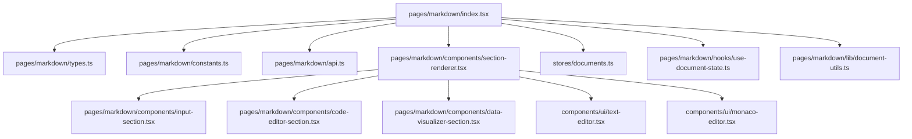
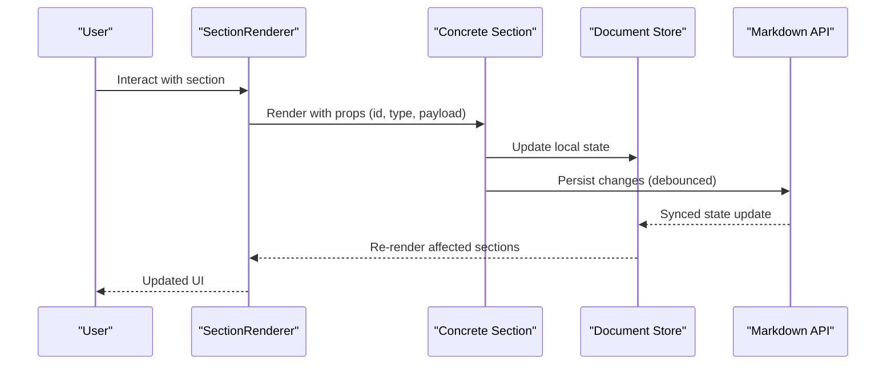
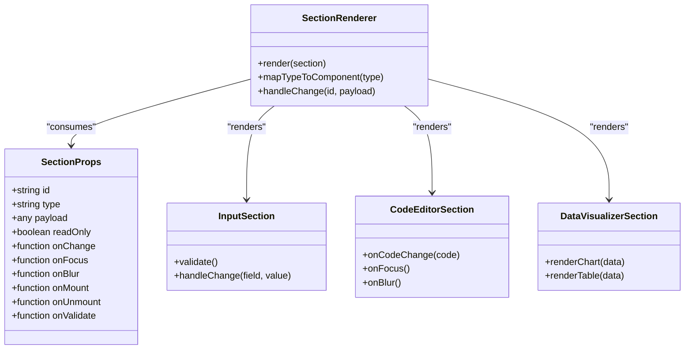
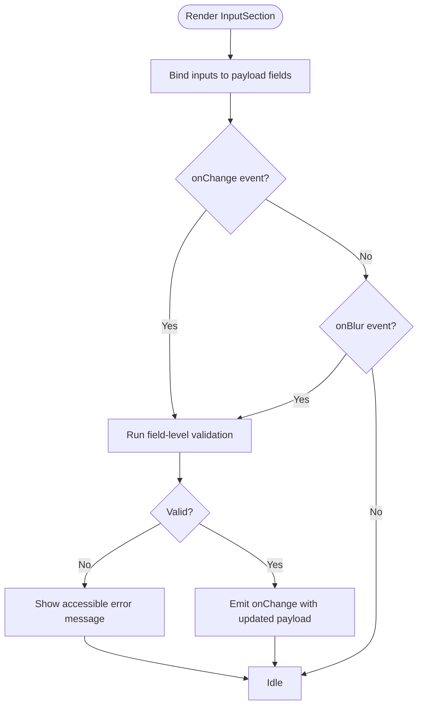
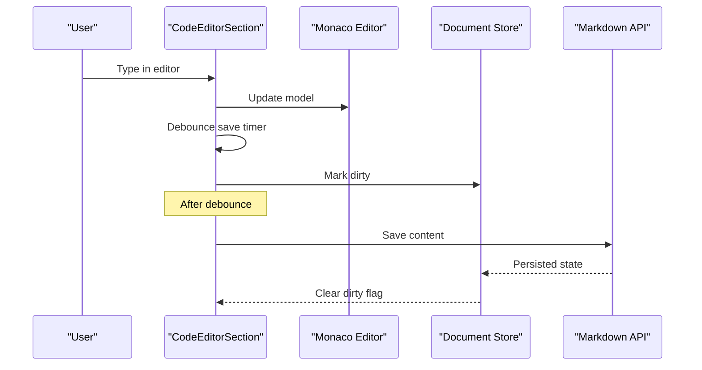
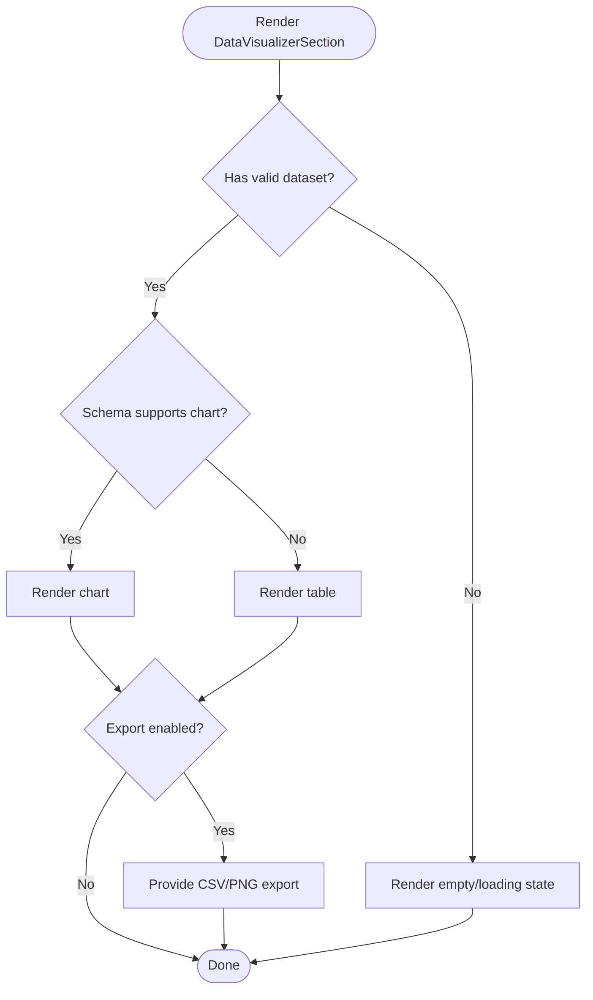
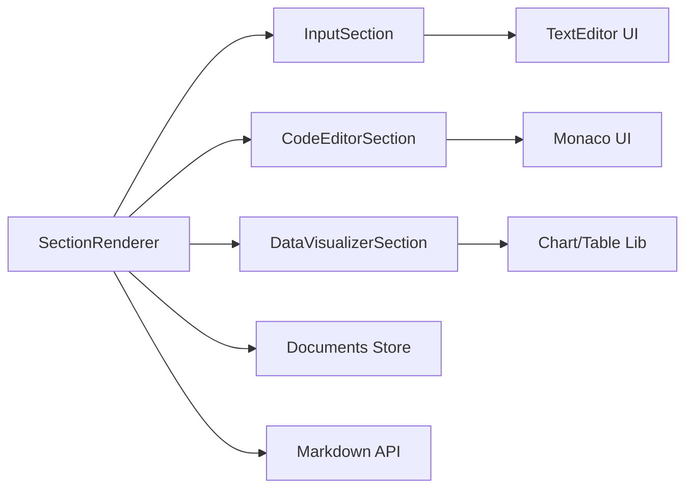

# Section Component Development

<cite>
**Referenced Files in This Document**
- [index.tsx](file://src/pages/markdown/index.tsx)
- [types.ts](file://src/pages/markdown/types.ts)
- [constants.ts](file://src/pages/markdown/constants.ts)
- [api.ts](file://src/pages/markdown/api.ts)
- [components/section-renderer.tsx](file://src/pages/markdown/components/section-renderer.tsx)
- [components/input-section.tsx](file://src/pages/markdown/components/input-section.tsx)
- [components/code-editor-section.tsx](file://src/pages/markdown/components/code-editor-section.tsx)
- [components/data-visualizer-section.tsx](file://src/pages/markdown/components/data-visualizer-section.tsx)
- [hooks/use-document-state.ts](file://src/pages/markdown/hooks/use-document-state.ts)
- [lib/document-utils.ts](file://src/pages/markdown/lib/document-utils.ts)
- [ui/text-editor.tsx](file://src/components/ui/text-editor.tsx)
- [ui/monaco-editor.tsx](file://src/components/ui/monaco-editor.tsx)
- [stores/documents.ts](file://src/stores/documents.ts)
</cite>

## Table of Contents
1. [Introduction](#introduction)
2. [Project Structure](#project-structure)
3. [Core Components](#core-components)
4. [Architecture Overview](#architecture-overview)
5. [Detailed Component Analysis](#detailed-component-analysis)
6. [Dependency Analysis](#dependency-analysis)
7. [Performance Considerations](#performance-considerations)
8. [Troubleshooting Guide](#troubleshooting-guide)
9. [Conclusion](#conclusion)

## Introduction
This document explains how to develop custom section components for Apprecon’s markdown editor. It covers the component architecture, props interface, lifecycle methods, and patterns for building interactive UI elements with robust input validation and state management. You will find implementation patterns for different section types such as input forms, code editors, and data visualizers, along with guidance on styling, accessibility, and responsive design.

## Project Structure
The markdown editor lives under src/pages/markdown and is organized into:
- Entry point and routing logic
- Types and constants defining section schemas and behaviors
- API layer for persistence and synchronization
- A registry and renderer that instantiate sections based on content
- Reusable UI primitives for text editing and code editing
- Stores for global document state

**Diagram sources**
- [index.tsx](file://src/pages/markdown/index.tsx)
- [types.ts](file://src/pages/markdown/types.ts)
- [constants.ts](file://src/pages/markdown/constants.ts)
- [api.ts](file://src/pages/markdown/api.ts)
- [components/section-renderer.tsx](file://src/pages/markdown/components/section-renderer.tsx)
- [components/input-section.tsx](file://src/pages/markdown/components/input-section.tsx)
- [components/code-editor-section.tsx](file://src/pages/markdown/components/code-editor-section.tsx)
- [components/data-visualizer-section.tsx](file://src/pages/markdown/components/data-visualizer-section.tsx)
- [ui/text-editor.tsx](file://src/components/ui/text-editor.tsx)
- [ui/monaco-editor.tsx](file://src/components/ui/monaco-editor.tsx)
- [stores/documents.ts](file://src/stores/documents.ts)
- [hooks/use-document-state.ts](file://src/pages/markdown/hooks/use-document-state.ts)
- [lib/document-utils.ts](file://src/pages/markdown/lib/document-utils.ts)

**Section sources**
- [index.tsx](file://src/pages/markdown/index.tsx)
- [types.ts](file://src/pages/markdown/types.ts)
- [constants.ts](file://src/pages/markdown/constants.ts)
- [api.ts](file://src/pages/markdown/api.ts)

## Core Components
- SectionRenderer: Central dispatcher that maps a section’s type to its concrete component. It receives normalized section data and renders the appropriate UI.
- InputSection: Generic form-like section supporting text inputs, validations, and controlled updates.
- CodeEditorSection: Wraps a code editor (Monaco or text editor) for syntax-aware editing within a section.
- DataVisualizerSection: Renders charts or tables from structured data provided by the section payload.

Key responsibilities:
- Normalize incoming section payloads into a consistent shape
- Provide typed props to each section component
- Manage local and global state updates through stores and hooks
- Expose lifecycle callbacks for initialization, validation, and disposal

**Section sources**
- [components/section-renderer.tsx](file://src/pages/markdown/components/section-renderer.tsx)
- [components/input-section.tsx](file://src/pages/markdown/components/input-section.tsx)
- [components/code-editor-section.tsx](file://src/pages/markdown/components/code-editor-section.tsx)
- [components/data-visualizer-section.tsx](file://src/pages/markdown/components/data-visualizer-section.tsx)

## Architecture Overview
The markdown editor uses a declarative section model. Each section has a type, id, metadata, and payload. The renderer selects the correct component based on type and mounts it with props derived from the payload and global store.

**Diagram sources**
- [components/section-renderer.tsx](file://src/pages/markdown/components/section-renderer.tsx)
- [stores/documents.ts](file://src/stores/documents.ts)
- [api.ts](file://src/pages/markdown/api.ts)

## Detailed Component Analysis

### Section Props Interface and Lifecycle
A section component typically receives:
- id: unique identifier
- type: section type discriminator
- payload: typed data for rendering and editing
- readOnly: flag to disable edits
- onChange: callback to emit validated changes
- onFocus/onBlur: focus events for accessibility
- lifecycle hooks: onMount, onUnmount, onValidate

Validation and state:
- Use controlled inputs where possible
- Debounce writes to avoid excessive persistence
- Surface validation errors via accessible messages

**Diagram sources**
- [components/section-renderer.tsx](file://src/pages/markdown/components/section-renderer.tsx)
- [components/input-section.tsx](file://src/pages/markdown/components/input-section.tsx)
- [components/code-editor-section.tsx](file://src/pages/markdown/components/code-editor-section.tsx)
- [components/data-visualizer-section.tsx](file://src/pages/markdown/components/data-visualizer-section.tsx)

**Section sources**
- [types.ts](file://src/pages/markdown/types.ts)
- [components/section-renderer.tsx](file://src/pages/markdown/components/section-renderer.tsx)

### Input Section Pattern
Input sections should:
- Bind inputs to payload fields
- Validate on change and blur
- Emit partial updates via onChange
- Support keyboard navigation and screen reader labels

**Diagram sources**
- [components/input-section.tsx](file://src/pages/markdown/components/input-section.tsx)
- [lib/document-utils.ts](file://src/pages/markdown/lib/document-utils.ts)

**Section sources**
- [components/input-section.tsx](file://src/pages/markdown/components/input-section.tsx)
- [lib/document-utils.ts](file://src/pages/markdown/lib/document-utils.ts)

### Code Editor Section Pattern
Code editor sections should:
- Integrate with Monaco or text editor
- Provide language-specific features when available
- Debounce saves and handle undo/redo safely
- Announce status changes to assistive technologies

**Diagram sources**
- [components/code-editor-section.tsx](file://src/pages/markdown/components/code-editor-section.tsx)
- [ui/monaco-editor.tsx](file://src/components/ui/monaco-editor.tsx)
- [stores/documents.ts](file://src/stores/documents.ts)
- [api.ts](file://src/pages/markdown/api.ts)

**Section sources**
- [components/code-editor-section.tsx](file://src/pages/markdown/components/code-editor-section.tsx)
- [ui/monaco-editor.tsx](file://src/components/ui/monaco-editor.tsx)

### Data Visualizer Section Pattern
Data visualizer sections should:
- Accept structured datasets
- Choose chart/table based on payload schema
- Handle loading states and empty data gracefully
- Provide export options if needed

**Diagram sources**
- [components/data-visualizer-section.tsx](file://src/pages/markdown/components/data-visualizer-section.tsx)

**Section sources**
- [components/data-visualizer-section.tsx](file://src/pages/markdown/components/data-visualizer-section.tsx)

### Styling Approaches
- Prefer utility-first CSS classes for consistency across sections
- Use theme tokens for colors, spacing, and typography
- Keep section containers responsive with fluid layouts
- Ensure focus styles are visible and consistent

[No sources needed since this section provides general guidance]

### Accessibility Considerations
- Associate labels with inputs using aria-labelledby or aria-label
- Announce validation errors with live regions
- Ensure keyboard-only navigation works for all interactive sections
- Maintain sufficient color contrast and scalable text

[No sources needed since this section provides general guidance]

### Responsive Design Principles
- Use flexible grids and relative units
- Collapse complex sections into stacked layouts on small screens
- Optimize code editors and tables for mobile readability

[No sources needed since this section provides general guidance]

## Dependency Analysis
Sections depend on shared UI primitives and global stores. The renderer depends on the type registry and normalization utilities.

**Diagram sources**
- [components/section-renderer.tsx](file://src/pages/markdown/components/section-renderer.tsx)
- [components/input-section.tsx](file://src/pages/markdown/components/input-section.tsx)
- [components/code-editor-section.tsx](file://src/pages/markdown/components/code-editor-section.tsx)
- [components/data-visualizer-section.tsx](file://src/pages/markdown/components/data-visualizer-section.tsx)
- [ui/text-editor.tsx](file://src/components/ui/text-editor.tsx)
- [ui/monaco-editor.tsx](file://src/components/ui/monaco-editor.tsx)
- [stores/documents.ts](file://src/stores/documents.ts)
- [api.ts](file://src/pages/markdown/api.ts)

**Section sources**
- [components/section-renderer.tsx](file://src/pages/markdown/components/section-renderer.tsx)
- [stores/documents.ts](file://src/stores/documents.ts)
- [api.ts](file://src/pages/markdown/api.ts)

## Performance Considerations
- Debounce user input before persisting to reduce write overhead
- Memoize expensive computations in visualizers
- Lazy-load heavy editor instances when not in view
- Avoid unnecessary re-renders by keeping payload updates granular

[No sources needed since this section provides general guidance]

## Troubleshooting Guide
Common issues and resolutions:
- Validation not triggering: ensure onChange and onBlur handlers are wired and validation runs synchronously for immediate feedback
- State desync: verify debounced saves and store subscriptions; check for race conditions between multiple sections updating the same payload
- Editor not focusing: confirm focus management and that readOnly flags do not block focus
- Accessibility warnings: add proper labels and roles; use live regions for dynamic errors

**Section sources**
- [components/input-section.tsx](file://src/pages/markdown/components/input-section.tsx)
- [components/code-editor-section.tsx](file://src/pages/markdown/components/code-editor-section.tsx)
- [hooks/use-document-state.ts](file://src/pages/markdown/hooks/use-document-state.ts)

## Conclusion
By following the patterns outlined here—typed props, clear lifecycle hooks, controlled state, and robust validation—you can build reliable, accessible, and performant custom section components for Apprecon’s markdown editor. Use the renderer and shared UI primitives to maintain consistency and leverage the store and API layers for seamless persistence.