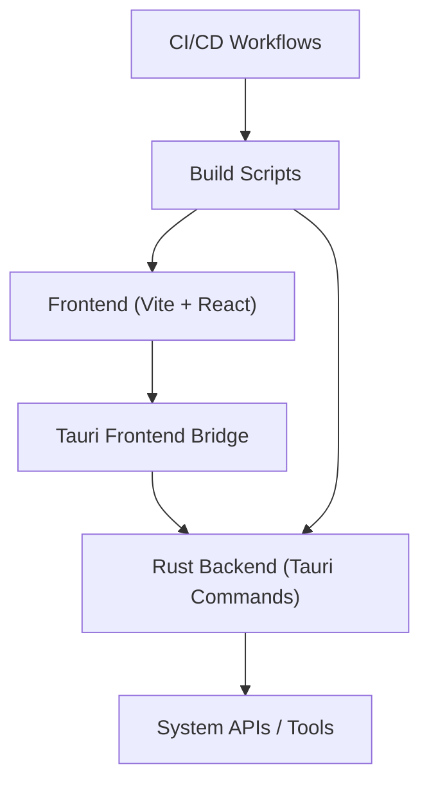
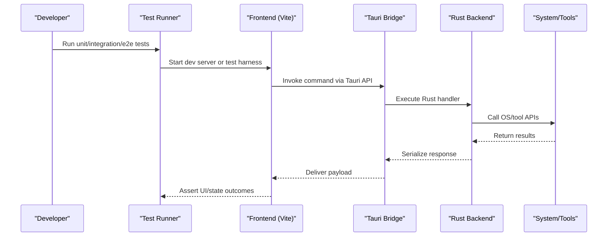
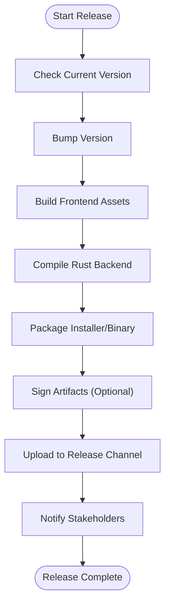
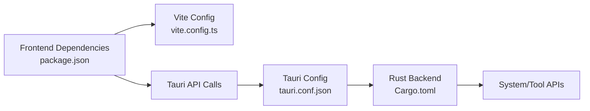

# Testing and Deployment

<cite>
**Referenced Files in This Document**
- [README.md](file://README.md)
- [package.json](file://package.json)
- [vite.config.ts](file://vite.config.ts)
- [src/main.tsx](file://src/main.tsx)
- [src/App.tsx](file://src/App.tsx)
- [src-tauri/tauri.conf.json](file://src-tauri/tauri.conf.json)
- [src-tauri/Cargo.toml](file://src-tauri/Cargo.toml)
- [scripts/build.sh](file://scripts/build.sh)
- [scripts/deploy.sh](file://scripts/deploy.sh)
- [scripts/bump-version.sh](file://scripts/bump-version.sh)
- [.github/workflows/build.yml](file://.github/workflows/build.yml)
- [.github/workflows/docs-deploy.yml](file://.github/workflows/docs-deploy.yml)
</cite>

## Table of Contents
1. [Introduction](#introduction)
2. [Project Structure](#project-structure)
3. [Core Components](#core-components)
4. [Architecture Overview](#architecture-overview)
5. [Detailed Component Analysis](#detailed-component-analysis)
6. [Dependency Analysis](#dependency-analysis)
7. [Performance Considerations](#performance-considerations)
8. [Troubleshooting Guide](#troubleshooting-guide)
9. [Conclusion](#conclusion)
10. [Appendices](#appendices)

## Introduction
This document provides comprehensive guidance for testing and deploying custom sections in Apprecon. It covers unit testing strategies for section components, integration testing within the editor environment, end-to-end testing approaches, and a complete deployment workflow including packaging, versioning, and distribution. It also includes debugging techniques, performance profiling, and troubleshooting common issues, along with best practices for quality assurance and maintenance.

## Project Structure
Apprecon is a Tauri-based desktop application with a React frontend built using Vite. The frontend code resides under src/, while the Rust backend lives under src-tauri/. Build and deployment are orchestrated via npm scripts, shell scripts, and GitHub Actions workflows.

**Diagram sources**
- [vite.config.ts:1-100](file://vite.config.ts#L1-L100)
- [src-tauri/tauri.conf.json:1-120](file://src-tauri/tauri.conf.json#L1-L120)
- [src-tauri/Cargo.toml:1-120](file://src-tauri/Cargo.toml#L1-L120)
- [scripts/build.sh:1-120](file://scripts/build.sh#L1-L120)
- [.github/workflows/build.yml:1-120](file://.github/workflows/build.yml#L1-L120)

**Section sources**
- [README.md:1-120](file://README.md#L1-L120)
- [package.json:1-120](file://package.json#L1-L120)
- [vite.config.ts:1-120](file://vite.config.ts#L1-L120)
- [src-tauri/tauri.conf.json:1-120](file://src-tauri/tauri.conf.json#L1-L120)
- [src-tauri/Cargo.toml:1-120](file://src-tauri/Cargo.toml#L1-L120)

## Core Components
- Frontend entry points: main.tsx initializes the React app; App.tsx composes top-level UI and routing.
- Tauri configuration: tauri.conf.json defines app metadata, capabilities, and build settings.
- Rust backend: Cargo.toml declares dependencies and binary targets; commands expose functionality to the frontend.
- Build and deploy automation: scripts/build.sh and scripts/deploy.sh orchestrate builds and releases; bump-version.sh manages version increments.
- CI/CD: GitHub Actions workflows automate building and documentation deployment.

Key responsibilities:
- Unit tests validate component logic and utilities.
- Integration tests exercise interactions between frontend sections and Tauri commands.
- End-to-end tests simulate user flows across the editor and sections.
- Packaging bundles the app per platform; versioning ensures traceable releases.

**Section sources**
- [src/main.tsx:1-120](file://src/main.tsx#L1-L120)
- [src/App.tsx:1-120](file://src/App.tsx#L1-L120)
- [src-tauri/tauri.conf.json:1-120](file://src-tauri/tauri.conf.json#L1-L120)
- [src-tauri/Cargo.toml:1-120](file://src-tauri/Cargo.toml#L1-L120)
- [scripts/build.sh:1-120](file://scripts/build.sh#L1-L120)
- [scripts/deploy.sh:1-120](file://scripts/deploy.sh#L1-L120)
- [scripts/bump-version.sh:1-120](file://scripts/bump-version.sh#L1-L120)
- [.github/workflows/build.yml:1-120](file://.github/workflows/build.yml#L1-L120)
- [.github/workflows/docs-deploy.yml:1-120](file://.github/workflows/docs-deploy.yml#L1-L120)

## Architecture Overview
The system follows a layered architecture:
- Presentation layer: React components implement custom sections and editor integrations.
- Application layer: State management and hooks coordinate UI behavior.
- Service layer: Tauri commands bridge to Rust backend services.
- Infrastructure layer: System tools, file I/O, and network operations.

**Diagram sources**
- [src/main.tsx:1-120](file://src/main.tsx#L1-L120)
- [src/App.tsx:1-120](file://src/App.tsx#L1-L120)
- [src-tauri/tauri.conf.json:1-120](file://src-tauri/tauri.conf.json#L1-L120)
- [src-tauri/Cargo.toml:1-120](file://src-tauri/Cargo.toml#L1-L120)

## Detailed Component Analysis

### Section Components: Unit Testing Strategies
- Isolate pure logic into utility functions and test them independently from UI rendering.
- Mock external dependencies such as Tauri commands, timers, and browser APIs.
- Use snapshot testing sparingly for stable UI structures; prefer assertions on rendered output and state changes.
- Validate error paths and edge cases explicitly.

Recommended approach:
- Create test files colocated with components or in a dedicated tests directory.
- Leverage a testing framework compatible with Vite and React.
- Stub Tauri calls to avoid native side effects during unit tests.

**Section sources**
- [vite.config.ts:1-120](file://vite.config.ts#L1-L120)
- [package.json:1-120](file://package.json#L1-L120)

### Editor Integration: Integration Testing
- Exercise full component lifecycles within the editor context.
- Simulate user interactions that trigger Tauri commands and verify resulting state updates.
- Validate cross-cutting concerns like permissions, data persistence, and event propagation.

Recommended approach:
- Use an integration test harness that mounts components in a realistic environment.
- Provide mock implementations of Tauri commands and global stores.
- Assert both UI changes and side effects (e.g., stored data, logs).

**Section sources**
- [src/main.tsx:1-120](file://src/main.tsx#L1-L120)
- [src/App.tsx:1-120](file://src/App.tsx#L1-L120)
- [src-tauri/tauri.conf.json:1-120](file://src-tauri/tauri.conf.json#L1-L120)

### End-to-End Testing Approaches
- Automate realistic user journeys across the editor and custom sections.
- Drive the application headlessly to validate critical flows and regressions.
- Capture screenshots or artifacts for visual regression checks where appropriate.

Recommended approach:
- Use an e2e framework compatible with desktop applications.
- Seed necessary state before running scenarios.
- Include robust assertions on UI elements, network/system interactions, and final states.

**Section sources**
- [package.json:1-120](file://package.json#L1-L120)
- [.github/workflows/build.yml:1-120](file://.github/workflows/build.yml#L1-L120)

### Deployment Workflow: Packaging, Versioning, Distribution
- Packaging: Build the frontend assets and compile the Rust backend into a platform-specific installer or portable bundle.
- Versioning: Increment versions consistently across frontend and backend metadata; tag releases for traceability.
- Distribution: Publish artifacts to a release channel or package repository; ensure checksums and signatures where applicable.

Recommended steps:
- Use scripts/build.sh to produce platform artifacts.
- Use scripts/deploy.sh to upload artifacts and update release metadata.
- Use scripts/bump-version.sh to manage semantic versioning.
- Trigger CI/CD pipelines via .github/workflows/build.yml for automated builds and publishing.

**Diagram sources**
- [scripts/build.sh:1-120](file://scripts/build.sh#L1-L120)
- [scripts/deploy.sh:1-120](file://scripts/deploy.sh#L1-L120)
- [scripts/bump-version.sh:1-120](file://scripts/bump-version.sh#L1-L120)
- [src-tauri/tauri.conf.json:1-120](file://src-tauri/tauri.conf.json#L1-L120)
- [src-tauri/Cargo.toml:1-120](file://src-tauri/Cargo.toml#L1-L120)
- [.github/workflows/build.yml:1-120](file://.github/workflows/build.yml#L1-L120)

**Section sources**
- [scripts/build.sh:1-120](file://scripts/build.sh#L1-L120)
- [scripts/deploy.sh:1-120](file://scripts/deploy.sh#L1-L120)
- [scripts/bump-version.sh:1-120](file://scripts/bump-version.sh#L1-L120)
- [src-tauri/tauri.conf.json:1-120](file://src-tauri/tauri.conf.json#L1-L120)
- [src-tauri/Cargo.toml:1-120](file://src-tauri/Cargo.toml#L1-L120)
- [.github/workflows/build.yml:1-120](file://.github/workflows/build.yml#L1-L120)

## Dependency Analysis
Frontend and backend dependencies are declared in package.json and Cargo.toml respectively. Tauri bridges these layers through typed commands defined in Rust and invoked from the frontend.

**Diagram sources**
- [package.json:1-120](file://package.json#L1-L120)
- [vite.config.ts:1-120](file://vite.config.ts#L1-L120)
- [src-tauri/tauri.conf.json:1-120](file://src-tauri/tauri.conf.json#L1-L120)
- [src-tauri/Cargo.toml:1-120](file://src-tauri/Cargo.toml#L1-L120)

**Section sources**
- [package.json:1-120](file://package.json#L1-L120)
- [vite.config.ts:1-120](file://vite.config.ts#L1-L120)
- [src-tauri/tauri.conf.json:1-120](file://src-tauri/tauri.conf.json#L1-L120)
- [src-tauri/Cargo.toml:1-120](file://src-tauri/Cargo.toml#L1-L120)

## Performance Considerations
- Frontend:
  - Minimize re-renders by memoizing expensive computations and splitting large components.
  - Profile rendering with browser developer tools; identify heavy layouts and unnecessary updates.
- Backend:
  - Avoid blocking operations in Tauri handlers; offload long-running tasks to background workers.
  - Stream large responses and use efficient serialization formats.
- Tests:
  - Keep unit tests fast by mocking I/O and external services.
  - Limit e2e test scope to critical paths to reduce flakiness and runtime.

[No sources needed since this section provides general guidance]

## Troubleshooting Guide
Common issues and resolutions:
- Tauri command failures:
  - Verify capability permissions in tauri.conf.json.
  - Inspect Rust logs and error payloads returned to the frontend.
- Build errors:
  - Ensure Node.js and Rust toolchains match project requirements.
  - Clear caches and reinstall dependencies if stale artifacts cause inconsistencies.
- Runtime crashes:
  - Enable verbose logging in development mode.
  - Reproduce with minimal datasets and isolate failing components.

Debugging techniques:
- Use browser devtools for frontend breakpoints and network inspection.
- Attach a Rust debugger to inspect backend execution paths.
- Capture screenshots and logs during e2e runs for post-mortem analysis.

**Section sources**
- [src-tauri/tauri.conf.json:1-120](file://src-tauri/tauri.conf.json#L1-L120)
- [src-tauri/Cargo.toml:1-120](file://src-tauri/Cargo.toml#L1-L120)
- [scripts/build.sh:1-120](file://scripts/build.sh#L1-L120)

## Conclusion
Effective testing and deployment of custom sections in Apprecon require a layered strategy: unit tests for isolated logic, integration tests for editor interactions, and end-to-end tests for user flows. The deployment pipeline should automate packaging, versioning, and distribution while maintaining traceability and reliability. Adhering to the best practices outlined here will improve quality, speed up iteration, and reduce risk during releases.

[No sources needed since this section summarizes without analyzing specific files]

## Appendices

### Best Practices for Section Quality Assurance and Maintenance
- Maintain clear separation between UI and business logic to simplify testing.
- Document public interfaces and expected behaviors for each section.
- Enforce consistent coding standards and linting rules.
- Regularly update dependencies and run security scans.
- Keep test coverage meaningful and focused on critical paths.
- Use semantic versioning and maintain a changelog for transparency.

[No sources needed since this section provides general guidance]