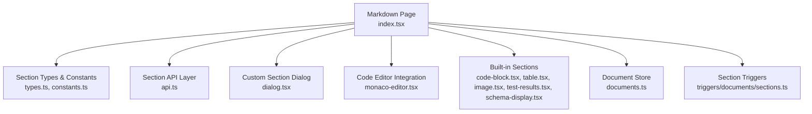
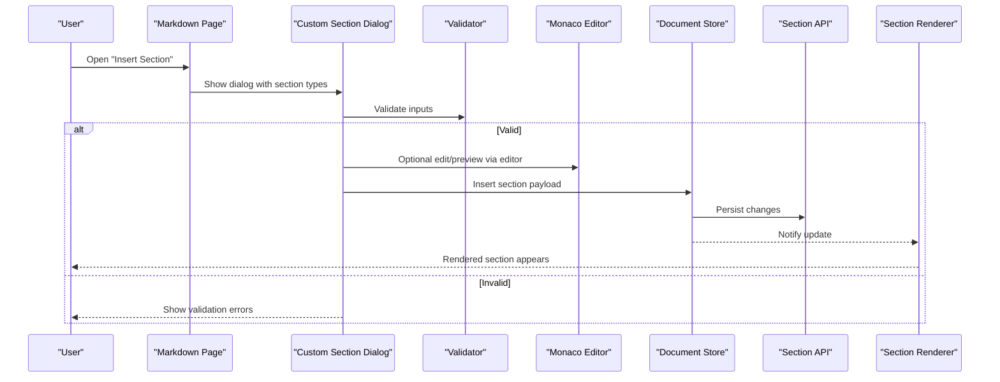
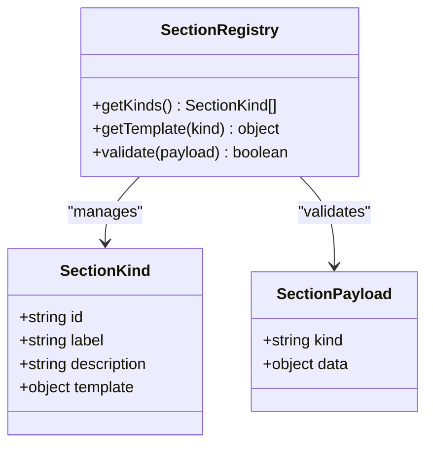
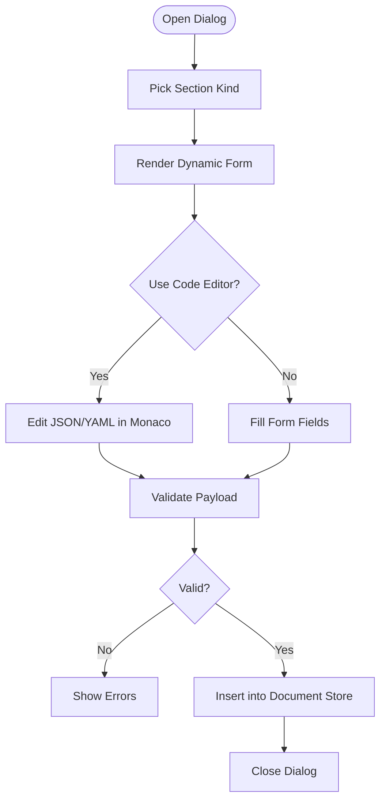
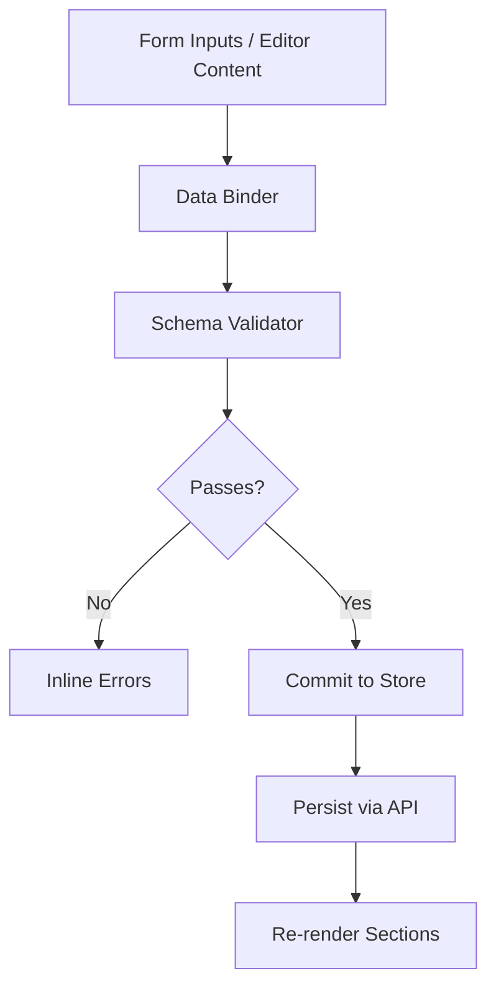
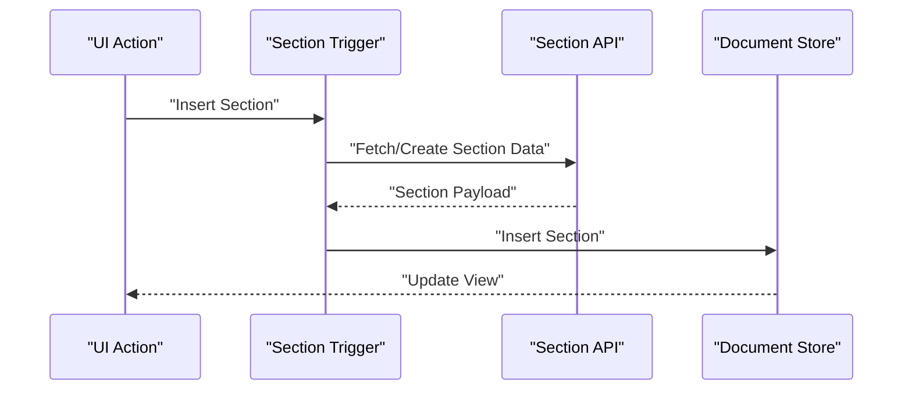
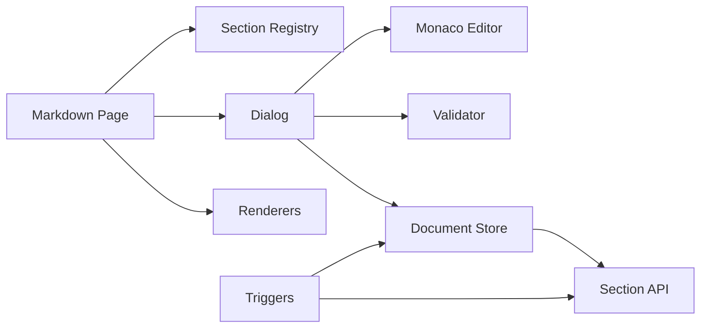

# Custom Sections

<cite>
**Referenced Files in This Document**
- [index.tsx](file://src/pages/markdown/index.tsx)
- [types.ts](file://src/pages/markdown/types.ts)
- [constants.ts](file://src/pages/markdown/constants.ts)
- [api.ts](file://src/pages/markdown/api.ts)
- [components/monaco-editor.tsx](file://src/components/ui/monaco-editor.tsx)
- [components/dialog.tsx](file://src/components/ui/dialog.tsx)
- [components/form.tsx](file://src/components/ui/form.tsx)
- [components/table.tsx](file://src/components/ui/table.tsx)
- [components/image.tsx](file://src/components/ai-elements/image.tsx)
- [components/code-block.tsx](file://src/components/ai-elements/code-block.tsx)
- [components/test-results.tsx](file://src/components/ai-elements/test-results.tsx)
- [components/schema-display.tsx](file://src/components/ai-elements/schema-display.tsx)
- [stores/documents.ts](file://src/stores/documents.ts)
- [triggers/documents/sections.ts](file://src/triggers/documents/sections.ts)
</cite>

## Table of Contents
1. [Introduction](#introduction)
2. [Project Structure](#project-structure)
3. [Core Components](#core-components)
4. [Architecture Overview](#architecture-overview)
5. [Detailed Component Analysis](#detailed-component-analysis)
6. [Dependency Analysis](#dependency-analysis)
7. [Performance Considerations](#performance-considerations)
8. [Troubleshooting Guide](#troubleshooting-guide)
9. [Conclusion](#conclusion)
10. [Appendices](#appendices)

## Introduction
This document explains Apprecon’s custom section system for the markdown editor. It covers how to create, configure, and use custom sections for specialized content types; how the custom section dialog integrates with the code editor; and how built-in section types (code blocks, tables, images, security findings) are implemented. It also provides examples for creating custom sections tailored to vulnerability reports, API schemas, and test results, along with guidance on validation, data binding, and integration with Apprecon’s data sources.

## Project Structure
The custom section system is centered around the Markdown page and its supporting modules:
- Markdown page entry and routing
- Section type definitions and constants
- API layer for fetching and persisting section data
- UI components for rendering built-in sections and editors
- Stores for document state management
- Triggers that wire up actions to sections

**Diagram sources**
- [index.tsx](file://src/pages/markdown/index.tsx)
- [types.ts](file://src/pages/markdown/types.ts)
- [constants.ts](file://src/pages/markdown/constants.ts)
- [api.ts](file://src/pages/markdown/api.ts)
- [components/dialog.tsx](file://src/components/ui/dialog.tsx)
- [components/monaco-editor.tsx](file://src/components/ui/monaco-editor.tsx)
- [components/code-block.tsx](file://src/components/ai-elements/code-block.tsx)
- [components/table.tsx](file://src/components/ui/table.tsx)
- [components/image.tsx](file://src/components/ai-elements/image.tsx)
- [components/test-results.tsx](file://src/components/ai-elements/test-results.tsx)
- [components/schema-display.tsx](file://src/components/ai-elements/schema-display.tsx)
- [stores/documents.ts](file://src/stores/documents.ts)
- [triggers/documents/sections.ts](file://src/triggers/documents/sections.ts)

**Section sources**
- [index.tsx](file://src/pages/markdown/index.tsx)
- [types.ts](file://src/pages/markdown/types.ts)
- [constants.ts](file://src/pages/markdown/constants.ts)
- [api.ts](file://src/pages/markdown/api.ts)
- [components/dialog.tsx](file://src/components/ui/dialog.tsx)
- [components/monaco-editor.tsx](file://src/components/ui/monaco-editor.tsx)
- [components/code-block.tsx](file://src/components/ai-elements/code-block.tsx)
- [components/table.tsx](file://src/components/ui/table.tsx)
- [components/image.tsx](file://src/components/ai-elements/image.tsx)
- [components/test-results.tsx](file://src/components/ai-elements/test-results.tsx)
- [components/schema-display.tsx](file://src/components/ai-elements/schema-display.tsx)
- [stores/documents.ts](file://src/stores/documents.ts)
- [triggers/documents/sections.ts](file://src/triggers/documents/sections.ts)

## Core Components
- Section registry and types: Centralized definitions for supported section kinds, their metadata, and default templates.
- Custom section dialog: A modal form that lets users pick a section type, fill fields, preview, and insert into the document.
- Code editor integration: Monaco-based editor used for raw JSON/YAML editing or templated content within sections.
- Built-in section renderers: Specialized components for code blocks, tables, images, security findings, and schema displays.
- Data store: Holds current document sections, selection state, and persistence hooks.
- Triggers: Event-driven wiring that connects UI actions (e.g., “Insert Section”) to section creation/update flows.

Key responsibilities:
- Validation: Ensure required fields are present and conform to expected formats before insertion.
- Data binding: Bind form inputs to section payload structures and keep them in sync with the document store.
- Templates: Provide starter payloads per section type to accelerate authoring.

**Section sources**
- [types.ts](file://src/pages/markdown/types.ts)
- [constants.ts](file://src/pages/markdown/constants.ts)
- [components/dialog.tsx](file://src/components/ui/dialog.tsx)
- [components/monaco-editor.tsx](file://src/components/ui/monaco-editor.tsx)
- [components/code-block.tsx](file://src/components/ai-elements/code-block.tsx)
- [components/table.tsx](file://src/components/ui/table.tsx)
- [components/image.tsx](file://src/components/ai-elements/image.tsx)
- [components/test-results.tsx](file://src/components/ai-elements/test-results.tsx)
- [components/schema-display.tsx](file://src/components/ai-elements/schema-display.tsx)
- [stores/documents.ts](file://src/stores/documents.ts)
- [triggers/documents/sections.ts](file://src/triggers/documents/sections.ts)

## Architecture Overview
The custom section flow spans user interaction, validation, data binding, and rendering:

**Diagram sources**
- [index.tsx](file://src/pages/markdown/index.tsx)
- [components/dialog.tsx](file://src/components/ui/dialog.tsx)
- [components/monaco-editor.tsx](file://src/components/ui/monaco-editor.tsx)
- [stores/documents.ts](file://src/stores/documents.ts)
- [api.ts](file://src/pages/markdown/api.ts)

## Detailed Component Analysis

### Section Registry and Types
- Defines all supported section kinds and their shape.
- Provides defaults/templates per section kind.
- Acts as the single source of truth for available section types.

**Diagram sources**
- [types.ts](file://src/pages/markdown/types.ts)
- [constants.ts](file://src/pages/markdown/constants.ts)

**Section sources**
- [types.ts](file://src/pages/markdown/types.ts)
- [constants.ts](file://src/pages/markdown/constants.ts)

### Custom Section Dialog
- Presents a list of section kinds with descriptions.
- Renders dynamic forms based on selected kind’s schema.
- Integrates with the code editor for advanced editing or preview.
- Validates input and inserts the section into the document.

**Diagram sources**
- [components/dialog.tsx](file://src/components/ui/dialog.tsx)
- [components/monaco-editor.tsx](file://src/components/ui/monaco-editor.tsx)
- [stores/documents.ts](file://src/stores/documents.ts)

**Section sources**
- [components/dialog.tsx](file://src/components/ui/dialog.tsx)
- [components/monaco-editor.tsx](file://src/components/ui/monaco-editor.tsx)

### Built-in Section Types
- Code Block: Syntax-highlighted code with language metadata and optional copy/export actions.
- Table: Structured tabular data with headers, rows, and sorting/filtering where applicable.
- Image: Embedded images with captions, alt text, and responsive sizing.
- Security Findings: Vulnerability entries with severity, description, evidence, and remediation.
- Schema Display: Visual representation of API schemas (JSON/YAML/OpenAPI).
- Test Results: Summarizes pass/fail counts, durations, and drill-down details.

Each renderer consumes a standardized payload defined by the section registry and renders accordingly.

**Section sources**
- [components/code-block.tsx](file://src/components/ai-elements/code-block.tsx)
- [components/table.tsx](file://src/components/ui/table.tsx)
- [components/image.tsx](file://src/components/ai-elements/image.tsx)
- [components/test-results.tsx](file://src/components/ai-elements/test-results.tsx)
- [components/schema-display.tsx](file://src/components/ai-elements/schema-display.tsx)

### Data Binding and Validation
- Inputs bind to fields in the section payload.
- Validators enforce required fields, types, and constraints.
- On success, the payload is inserted into the document store and persisted via the API layer.

**Diagram sources**
- [components/dialog.tsx](file://src/components/ui/dialog.tsx)
- [components/monaco-editor.tsx](file://src/components/ui/monaco-editor.tsx)
- [stores/documents.ts](file://src/stores/documents.ts)
- [api.ts](file://src/pages/markdown/api.ts)

**Section sources**
- [components/dialog.tsx](file://src/components/ui/dialog.tsx)
- [components/monaco-editor.tsx](file://src/components/ui/monaco-editor.tsx)
- [stores/documents.ts](file://src/stores/documents.ts)
- [api.ts](file://src/pages/markdown/api.ts)

### Integration with Apprecon Data Sources
- The API layer abstracts data access for sections, enabling retrieval from local storage, remote endpoints, or other Apprecon stores.
- Triggers connect UI actions to data operations (e.g., inserting a section after capturing traffic or running tests).

**Diagram sources**
- [triggers/documents/sections.ts](file://src/triggers/documents/sections.ts)
- [api.ts](file://src/pages/markdown/api.ts)
- [stores/documents.ts](file://src/stores/documents.ts)

**Section sources**
- [triggers/documents/sections.ts](file://src/triggers/documents/sections.ts)
- [api.ts](file://src/pages/markdown/api.ts)
- [stores/documents.ts](file://src/stores/documents.ts)

### Examples: Creating Custom Sections

#### Example: Vulnerability Report Section
- Purpose: Capture structured vulnerability details including title, severity, description, affected endpoint, evidence, and remediation steps.
- Steps:
  - Define a new section kind with a schema describing required fields.
  - Add a template with placeholders for common fields.
  - Implement a validator ensuring severity is valid and evidence is non-empty.
  - Create a renderer that highlights severity and formats evidence.
  - Wire a trigger to auto-populate fields when importing findings from Apprecon’s security data.

**Section sources**
- [types.ts](file://src/pages/markdown/types.ts)
- [constants.ts](file://src/pages/markdown/constants.ts)
- [components/dialog.tsx](file://src/components/ui/dialog.tsx)
- [components/code-block.tsx](file://src/components/ai-elements/code-block.tsx)
- [triggers/documents/sections.ts](file://src/triggers/documents/sections.ts)

#### Example: API Schema Section
- Purpose: Display and edit API schemas (JSON/YAML/OpenAPI) with live validation and visual hints.
- Steps:
  - Use the schema display component to render the structure.
  - Enable Monaco editor for direct edits with syntax highlighting.
  - Validate against an OpenAPI schema if provided.
  - Persist changes through the API layer.

**Section sources**
- [components/schema-display.tsx](file://src/components/ai-elements/schema-display.tsx)
- [components/monaco-editor.tsx](file://src/components/ui/monaco-editor.tsx)
- [api.ts](file://src/pages/markdown/api.ts)

#### Example: Test Results Section
- Purpose: Present test outcomes with summary metrics and detailed logs.
- Steps:
  - Define fields for total tests, passed, failed, duration, and result items.
  - Use the test results renderer to visualize pass/fail distribution.
  - Allow drilling down into individual test logs.
  - Integrate with triggers that run tests and push results into the section.

**Section sources**
- [components/test-results.tsx](file://src/components/ai-elements/test-results.tsx)
- [triggers/documents/sections.ts](file://src/triggers/documents/sections.ts)

## Dependency Analysis
The custom section system has clear boundaries and dependencies:
- Markdown page orchestrates dialog, editor, and rendering.
- Section registry defines types and templates consumed by dialog and renderers.
- Dialog depends on form and editor components for input and validation.
- Store manages document state and persists via API.
- Triggers bridge UI actions to data operations.

**Diagram sources**
- [index.tsx](file://src/pages/markdown/index.tsx)
- [types.ts](file://src/pages/markdown/types.ts)
- [constants.ts](file://src/pages/markdown/constants.ts)
- [components/dialog.tsx](file://src/components/ui/dialog.tsx)
- [components/monaco-editor.tsx](file://src/components/ui/monaco-editor.tsx)
- [stores/documents.ts](file://src/stores/documents.ts)
- [api.ts](file://src/pages/markdown/api.ts)
- [triggers/documents/sections.ts](file://src/triggers/documents/sections.ts)

**Section sources**
- [index.tsx](file://src/pages/markdown/index.tsx)
- [types.ts](file://src/pages/markdown/types.ts)
- [constants.ts](file://src/pages/markdown/constants.ts)
- [components/dialog.tsx](file://src/components/ui/dialog.tsx)
- [components/monaco-editor.tsx](file://src/components/ui/monaco-editor.tsx)
- [stores/documents.ts](file://src/stores/documents.ts)
- [api.ts](file://src/pages/markdown/api.ts)
- [triggers/documents/sections.ts](file://src/triggers/documents/sections.ts)

## Performance Considerations
- Lazy-load heavy renderers only when needed to reduce initial bundle size.
- Debounce editor updates to avoid excessive re-renders during typing.
- Cache frequently accessed section templates and schemas.
- Batch store updates to minimize reflows and redraws.
- Use virtualization for large tables or long lists of test results.

[No sources needed since this section provides general guidance]

## Troubleshooting Guide
Common issues and resolutions:
- Validation failures: Check required fields and types; ensure schema matches the section kind definition.
- Editor not updating: Confirm bindings between form/editor and store; verify event handlers are wired.
- Section not appearing: Verify insertion into the store and that the renderer supports the section kind.
- Persistence errors: Inspect API responses and network status; retry or fallback gracefully.

**Section sources**
- [components/dialog.tsx](file://src/components/ui/dialog.tsx)
- [components/monaco-editor.tsx](file://src/components/ui/monaco-editor.tsx)
- [stores/documents.ts](file://src/stores/documents.ts)
- [api.ts](file://src/pages/markdown/api.ts)

## Conclusion
Apprecon’s custom section system enables flexible, validated, and visually rich content within the markdown editor. By defining section kinds, templates, validators, and renderers, teams can tailor documents for vulnerability reports, API schemas, and test results while leveraging built-in components and seamless data integration.

[No sources needed since this section summarizes without analyzing specific files]

## Appendices

### Quick Start: Adding a New Custom Section
- Define a new section kind and template in the registry.
- Extend the dialog to render fields for the new kind.
- Implement validation rules for required and constrained fields.
- Create or reuse a renderer to display the section payload.
- Optionally add triggers to auto-populate data from Apprecon sources.

**Section sources**
- [types.ts](file://src/pages/markdown/types.ts)
- [constants.ts](file://src/pages/markdown/constants.ts)
- [components/dialog.tsx](file://src/components/ui/dialog.tsx)
- [components/monaco-editor.tsx](file://src/components/ui/monaco-editor.tsx)
- [triggers/documents/sections.ts](file://src/triggers/documents/sections.ts)