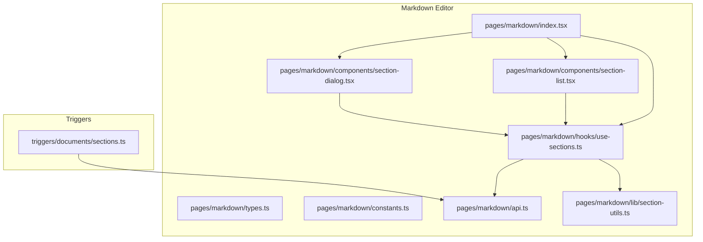
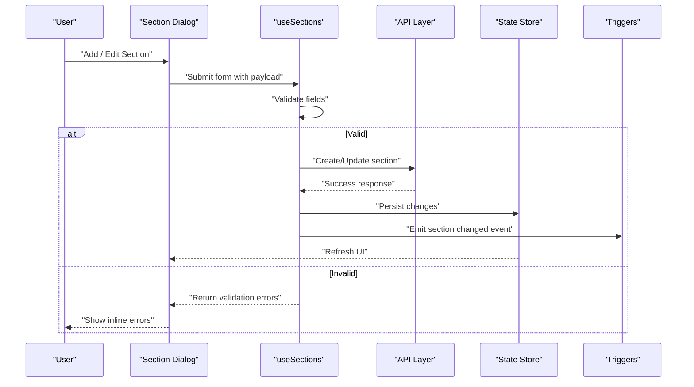
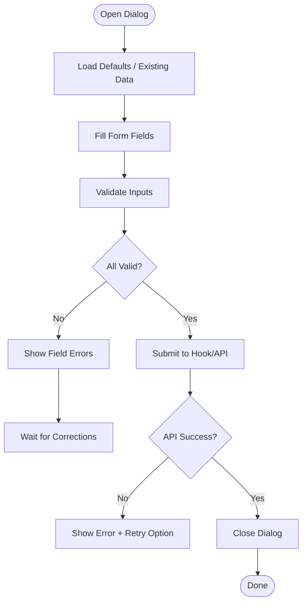
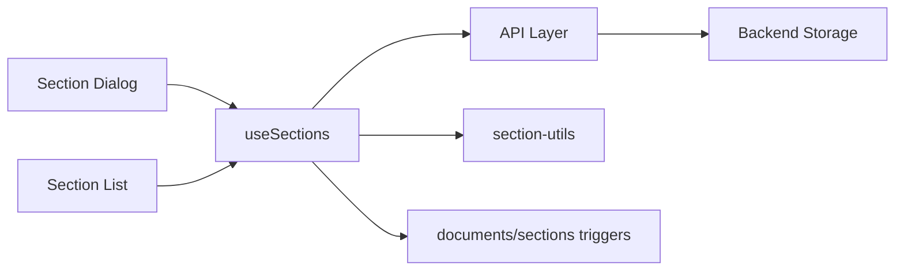

# Section Creation & Management

<cite>
**Referenced Files in This Document**
- [index.tsx](file://src/pages/markdown/index.tsx)
- [types.ts](file://src/pages/markdown/types.ts)
- [constants.ts](file://src/pages/markdown/constants.ts)
- [api.ts](file://src/pages/markdown/api.ts)
- [components/section-dialog.tsx](file://src/pages/markdown/components/section-dialog.tsx)
- [components/section-list.tsx](file://src/pages/markdown/components/section-list.tsx)
- [hooks/use-sections.ts](file://src/pages/markdown/hooks/use-sections.ts)
- [lib/section-utils.ts](file://src/pages/markdown/lib/section-utils.ts)
- [triggers/documents/sections.ts](file://src/triggers/documents/sections.ts)
</cite>

## Table of Contents
1. [Introduction](#introduction)
2. [Project Structure](#project-structure)
3. [Core Components](#core-components)
4. [Architecture Overview](#architecture-overview)
5. [Detailed Component Analysis](#detailed-component-analysis)
6. [Dependency Analysis](#dependency-analysis)
7. [Performance Considerations](#performance-considerations)
8. [Troubleshooting Guide](#troubleshooting-guide)
9. [Conclusion](#conclusion)
10. [Appendices](#appendices)

## Introduction
This document explains how to create and manage custom sections in Apprecon’s markdown editor. It covers the section dialog interface, adding new sections, configuring properties, managing existing sections, lifecycle from creation to deletion, validation rules, error handling, metadata, naming conventions, organizational best practices, and practical examples for building different types of sections and hierarchies.

## Project Structure
The markdown editor feature is implemented under src/pages/markdown with supporting hooks, utilities, triggers, and UI components. The key files include:
- Page entry and orchestration
- Types and constants defining section schema and defaults
- API layer for persistence and synchronization
- Dialog and list components for user interactions
- Hooks for state management
- Utilities for validation and transformation
- Triggers for cross-feature integration

**Diagram sources**
- [index.tsx](file://src/pages/markdown/index.tsx)
- [types.ts](file://src/pages/markdown/types.ts)
- [constants.ts](file://src/pages/markdown/constants.ts)
- [api.ts](file://src/pages/markdown/api.ts)
- [components/section-dialog.tsx](file://src/pages/markdown/components/section-dialog.tsx)
- [components/section-list.tsx](file://src/pages/markdown/components/section-list.tsx)
- [hooks/use-sections.ts](file://src/pages/markdown/hooks/use-sections.ts)
- [lib/section-utils.ts](file://src/pages/markdown/lib/section-utils.ts)
- [triggers/documents/sections.ts](file://src/triggers/documents/sections.ts)

**Section sources**
- [index.tsx](file://src/pages/markdown/index.tsx)
- [types.ts](file://src/pages/markdown/types.ts)
- [constants.ts](file://src/pages/markdown/constants.ts)
- [api.ts](file://src/pages/markdown/api.ts)
- [components/section-dialog.tsx](file://src/pages/markdown/components/section-dialog.tsx)
- [components/section-list.tsx](file://src/pages/markdown/components/section-list.tsx)
- [hooks/use-sections.ts](file://src/pages/markdown/hooks/use-sections.ts)
- [lib/section-utils.ts](file://src/pages/markdown/lib/section-utils.ts)
- [triggers/documents/sections.ts](file://src/triggers/documents/sections.ts)

## Core Components
- Section Dialog: Modal or drawer used to add or edit a section’s properties (title, type, visibility, tags, parent, etc.). It validates inputs before submission and shows errors inline.
- Section List: Displays all sections with actions like open, duplicate, reorder, and delete. Supports filtering and searching by name or tags.
- Sections Hook: Centralized state for sections, including CRUD operations, ordering, and persistence calls.
- API Layer: Encapsulates backend calls for creating, updating, deleting, and fetching sections. Handles retries and error mapping.
- Utilities: Validation helpers, slug generation, default templates, and hierarchy builders.
- Triggers: Emit events when sections change, enabling integrations across features.

Key responsibilities:
- Enforce naming conventions and uniqueness constraints
- Maintain hierarchical relationships (parent-child)
- Persist changes reliably and reflect updates across UI
- Provide clear feedback on success and failure

**Section sources**
- [components/section-dialog.tsx](file://src/pages/markdown/components/section-dialog.tsx)
- [components/section-list.tsx](file://src/pages/markdown/components/section-list.tsx)
- [hooks/use-sections.ts](file://src/pages/markdown/hooks/use-sections.ts)
- [api.ts](file://src/pages/markdown/api.ts)
- [lib/section-utils.ts](file://src/pages/markdown/lib/section-utils.ts)
- [triggers/documents/sections.ts](file://src/triggers/documents/sections.ts)

## Architecture Overview
The section management flow follows a unidirectional data pattern:
- User interacts with the Section Dialog or Section List
- The hook orchestrates validation and state updates
- The API layer persists changes and returns results
- Triggers notify other parts of the app about section changes
- UI re-renders based on updated store state

**Diagram sources**
- [components/section-dialog.tsx](file://src/pages/markdown/components/section-dialog.tsx)
- [hooks/use-sections.ts](file://src/pages/markdown/hooks/use-sections.ts)
- [api.ts](file://src/pages/markdown/api.ts)
- [triggers/documents/sections.ts](file://src/triggers/documents/sections.ts)

## Detailed Component Analysis

### Section Dialog
Purpose:
- Create new sections or edit existing ones
- Configure properties such as title, type, visibility, tags, parent, and template
- Validate input and display errors
- Confirm destructive actions (e.g., reset to default)

Validation rules:
- Title required and non-empty
- Unique title within the same parent scope
- Type must be one of the allowed values
- Parent selection must not create cycles
- Tags are optional but must follow allowed patterns

Error handling:
- Inline field-level errors
- Global form-level messages for network failures
- Retry prompts for transient errors

Best practices:
- Auto-generate slugs from titles with conflict resolution
- Pre-fill defaults based on selected template
- Debounce auto-save drafts if enabled

**Diagram sources**
- [components/section-dialog.tsx](file://src/pages/markdown/components/section-dialog.tsx)
- [hooks/use-sections.ts](file://src/pages/markdown/hooks/use-sections.ts)
- [lib/section-utils.ts](file://src/pages/markdown/lib/section-utils.ts)

**Section sources**
- [components/section-dialog.tsx](file://src/pages/markdown/components/section-dialog.tsx)
- [hooks/use-sections.ts](file://src/pages/markdown/hooks/use-sections.ts)
- [lib/section-utils.ts](file://src/pages/markdown/lib/section-utils.ts)

### Section List
Purpose:
- Display all sections with metadata (type, tags, parent)
- Actions: open editor, duplicate, reorder, delete
- Filtering and search by name, type, or tags
- Bulk operations where applicable

Behavior:
- Sorting by position or last modified
- Confirmation before deletion
- Visual indicators for invalid states (e.g., broken parent references)

Accessibility:
- Keyboard navigation and screen reader labels
- Clear focus management when opening dialogs

**Section sources**
- [components/section-list.tsx](file://src/pages/markdown/components/section-list.tsx)
- [hooks/use-sections.ts](file://src/pages/markdown/hooks/use-sections.ts)

### Sections Hook
Responsibilities:
- Manage local state for sections
- Coordinate create, update, delete, and reorder operations
- Call API methods and handle responses
- Emit triggers for cross-feature updates
- Cache and sync with server state

Data model:
- Section ID, title, type, tags, parent, order, timestamps
- Derived fields like slug and path

Complexity considerations:
- O(n) reordering when moving items; consider batched updates
- Conflict resolution for duplicate titles

**Section sources**
- [hooks/use-sections.ts](file://src/pages/markdown/hooks/use-sections.ts)
- [api.ts](file://src/pages/markdown/api.ts)
- [triggers/documents/sections.ts](file://src/triggers/documents/sections.ts)

### API Layer
Endpoints and behaviors:
- GET sections: fetch full list with metadata
- POST create: validate and persist new section
- PUT update: apply partial updates
- DELETE remove: soft-delete or hard-delete depending on policy
- PATCH reorder: adjust order efficiently

Error handling:
- Map HTTP status codes to user-friendly messages
- Retry logic for transient failures
- Optimistic updates with rollback on failure

**Section sources**
- [api.ts](file://src/pages/markdown/api.ts)

### Utilities
Functions:
- generateSlug(title): produce URL-safe identifiers
- validateSection(payload): enforce rules and return errors
- buildHierarchy(sections): construct tree structure for rendering
- resolveParentCycle(parentId, currentId): prevent circular references

Performance:
- Memoize derived structures
- Avoid unnecessary recomputation

**Section sources**
- [lib/section-utils.ts](file://src/pages/markdown/lib/section-utils.ts)

### Triggers
Events:
- section.created
- section.updated
- section.deleted
- section.reordered

Usage:
- Update related views (e.g., breadcrumbs, navigation)
- Sync external tools or analytics

**Section sources**
- [triggers/documents/sections.ts](file://src/triggers/documents/sections.ts)

## Dependency Analysis
The markdown editor depends on well-defined modules:
- UI components depend on the hook for state and actions
- Hook depends on API for persistence and triggers for side effects
- Utilities provide shared logic for validation and transformations
- Constants define allowed types and defaults

**Diagram sources**
- [components/section-dialog.tsx](file://src/pages/markdown/components/section-dialog.tsx)
- [components/section-list.tsx](file://src/pages/markdown/components/section-list.tsx)
- [hooks/use-sections.ts](file://src/pages/markdown/hooks/use-sections.ts)
- [api.ts](file://src/pages/markdown/api.ts)
- [lib/section-utils.ts](file://src/pages/markdown/lib/section-utils.ts)
- [triggers/documents/sections.ts](file://src/triggers/documents/sections.ts)

**Section sources**
- [components/section-dialog.tsx](file://src/pages/markdown/components/section-dialog.tsx)
- [components/section-list.tsx](file://src/pages/markdown/components/section-list.tsx)
- [hooks/use-sections.ts](file://src/pages/markdown/hooks/use-sections.ts)
- [api.ts](file://src/pages/markdown/api.ts)
- [lib/section-utils.ts](file://src/pages/markdown/lib/section-utils.ts)
- [triggers/documents/sections.ts](file://src/triggers/documents/sections.ts)

## Performance Considerations
- Use memoization for derived lists and trees to avoid re-renders
- Batch multiple updates into single API calls where possible
- Implement virtual scrolling for large section lists
- Debounce auto-save drafts to reduce network load
- Prefer optimistic UI updates with rollback on failure

[No sources needed since this section provides general guidance]

## Troubleshooting Guide
Common issues and resolutions:
- Duplicate title error: Ensure uniqueness within the same parent; use auto-slug generator to resolve conflicts
- Circular parent reference: Prevent selecting self or descendants as parents; utilities should block cycles
- Network failures: Check connectivity, retry with backoff, and show actionable error messages
- Missing permissions: Verify user roles for create/update/delete actions
- Stale state: Refresh the section list after mutations; ensure triggers are emitted

Debugging tips:
- Inspect form validation errors in the dialog
- Log API request/response payloads
- Subscribe to trigger events to verify side effects
- Use browser dev tools to monitor state updates

**Section sources**
- [components/section-dialog.tsx](file://src/pages/markdown/components/section-dialog.tsx)
- [hooks/use-sections.ts](file://src/pages/markdown/hooks/use-sections.ts)
- [api.ts](file://src/pages/markdown/api.ts)
- [triggers/documents/sections.ts](file://src/triggers/documents/sections.ts)

## Conclusion
Apprecon’s markdown editor provides a robust system for creating and managing custom sections through a clear dialog interface, validated forms, reliable persistence, and consistent triggers. By following the naming conventions, validation rules, and organizational best practices outlined here, users can build maintainable and scalable section hierarchies that integrate seamlessly across the application.

[No sources needed since this section summarizes without analyzing specific files]

## Appendices

### Naming Conventions and Metadata
- Titles: Human-readable, unique within parent scope, no leading/trailing spaces
- Slugs: Auto-generated from titles; lowercase, hyphenated, alphanumeric only
- Types: Use predefined types for consistency; extend via constants
- Tags: Optional, comma-separated, lowercase, no special characters
- Parent: Must be a valid existing section; cycles are prohibited
- Visibility: Public, private, or restricted based on roles

### Practical Examples
- Creating a “Requirements” section:
  - Set type to “requirements”, add tags like “spec”, set visibility to “public”
  - Optionally assign a parent “Project Overview”
- Building a hierarchy:
  - Create “Overview” as root
  - Add child sections “Scope”, “Constraints”, “Assumptions” under “Overview”
  - Reorder using drag-and-drop or numeric order fields
- Managing lifecycle:
  - Duplicate an existing section to bootstrap similar content
  - Delete obsolete sections after confirming dependencies

[No sources needed since this section provides general guidance]