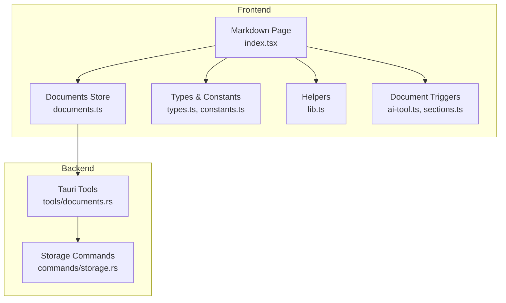
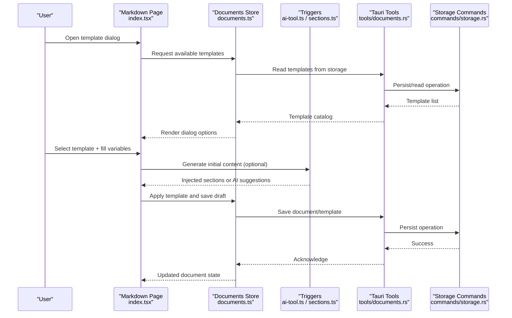
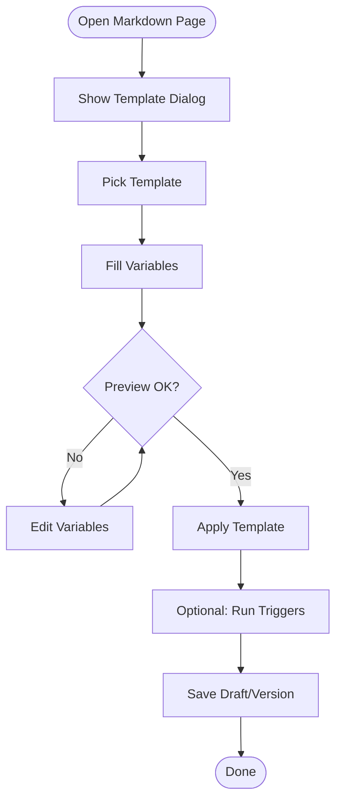
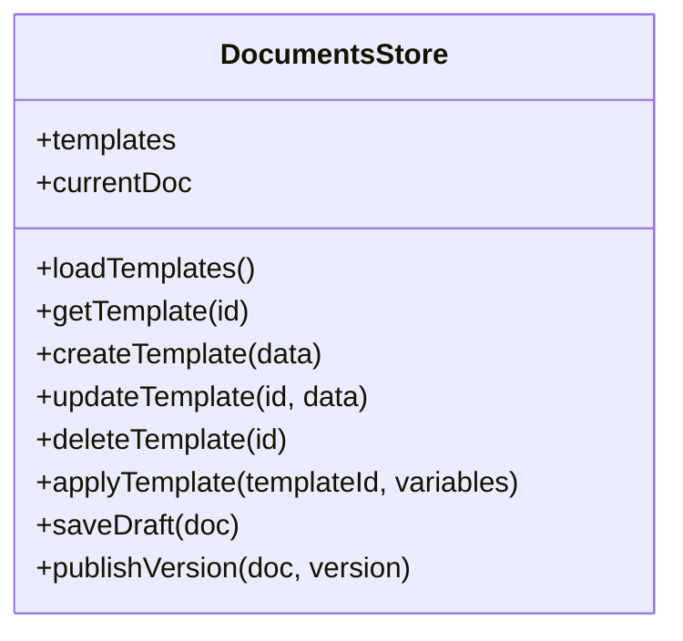
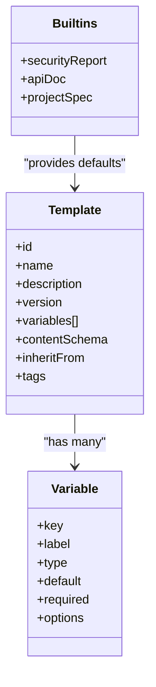
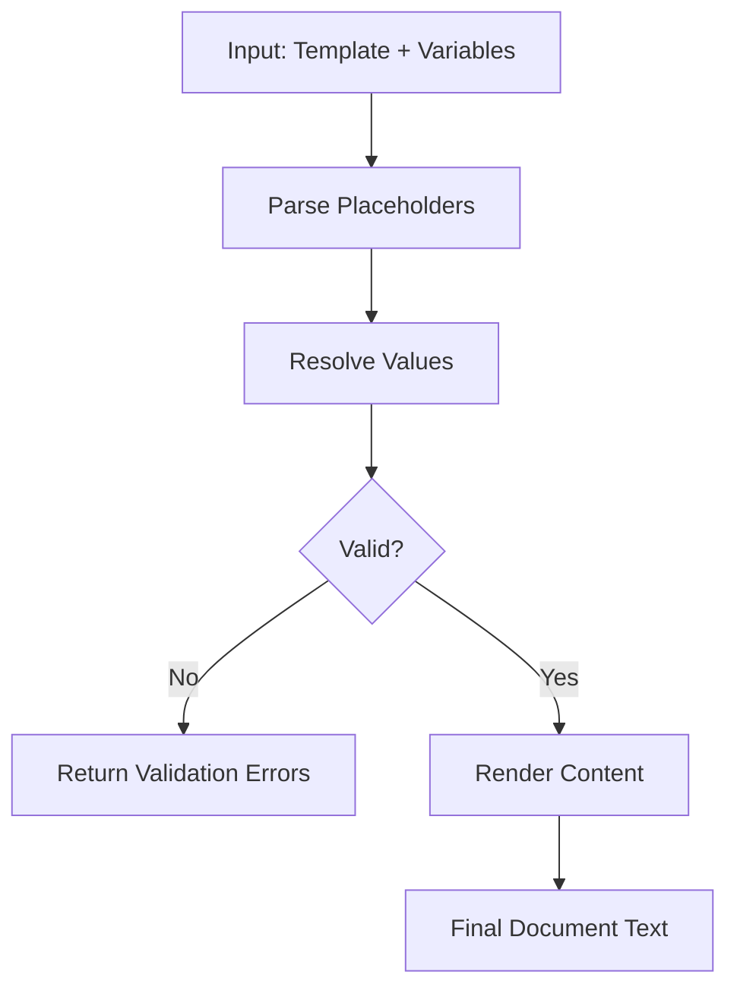
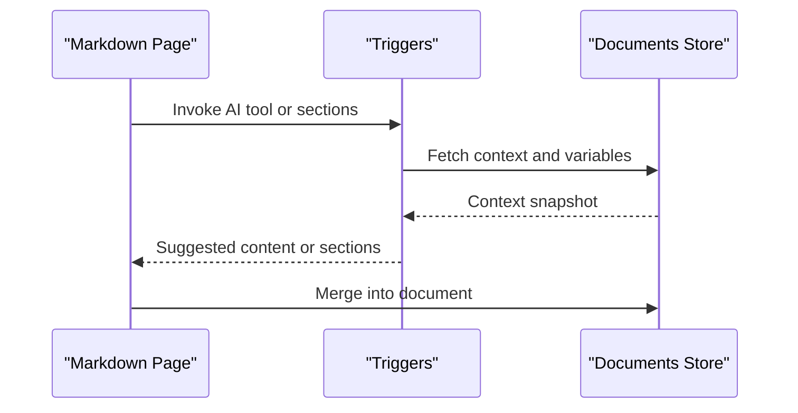
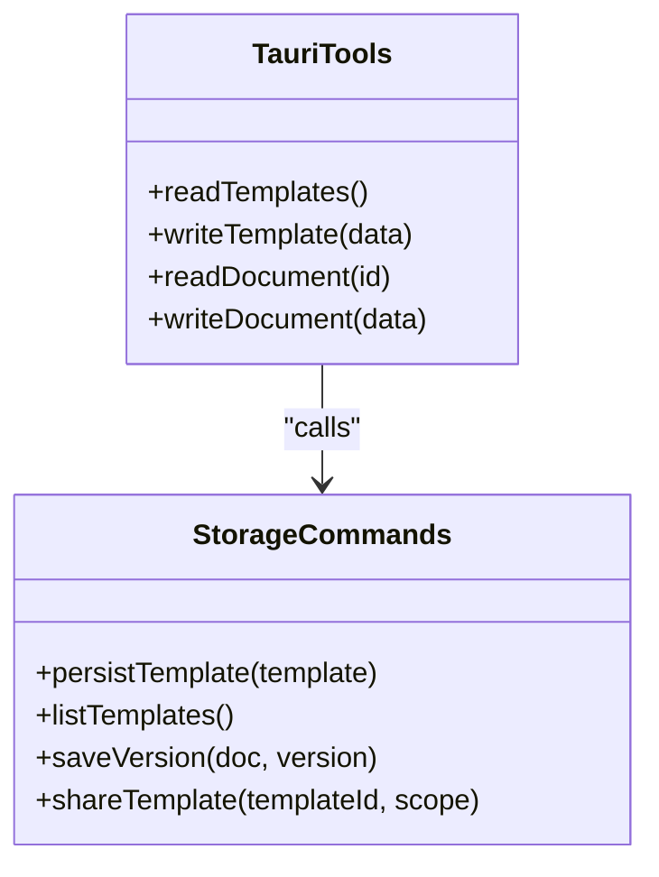
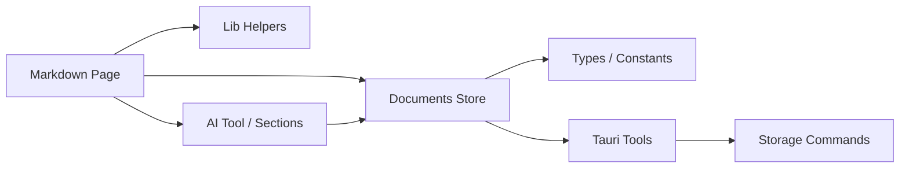

# Document Templates

<cite>
**Referenced Files in This Document**
- [documents.ts](file://src/stores/documents.ts)
- [index.tsx](file://src/pages/markdown/index.tsx)
- [api.ts](file://src/pages/markdown/api.ts)
- [constants.ts](file://src/pages/markdown/constants.ts)
- [types.ts](file://src/pages/markdown/types.ts)
- [lib.ts](file://src/pages/markdown/lib.ts)
- [ai-tool.ts](file://src/triggers/documents/ai-tool.ts)
- [sections.ts](file://src/triggers/documents/sections.ts)
- [tools/documents.rs](file://src-tauri/src/tools/documents.rs)
- [commands/storage.rs](file://src-tauri/src/commands/storage.rs)
</cite>

## Table of Contents
1. [Introduction](#introduction)
2. [Project Structure](#project-structure)
3. [Core Components](#core-components)
4. [Architecture Overview](#architecture-overview)
5. [Detailed Component Analysis](#detailed-component-analysis)
6. [Dependency Analysis](#dependency-analysis)
7. [Performance Considerations](#performance-considerations)
8. [Troubleshooting Guide](#troubleshooting-guide)
9. [Conclusion](#conclusion)
10. [Appendices](#appendices)

## Introduction
This document explains Apprecon’s document template system: how to create, manage, and apply templates for consistent formatting and structure; how the template dialog works; how template variables and dynamic content insertion are handled; what built-in templates exist (security reports, API documentation, project specifications); and how to author custom templates for specific testing methodologies and compliance frameworks. It also covers inheritance, versioning, and sharing across teams.

## Project Structure
The template system spans the frontend UI, state management, triggers, and Tauri backend storage. The key areas are:
- Markdown page entry point and UI orchestration
- Template store and persistence
- Trigger hooks for AI-assisted templating and section generation
- Backend tools and commands for storage operations

**Diagram sources**
- [index.tsx](file://src/pages/markdown/index.tsx)
- [documents.ts](file://src/stores/documents.ts)
- [types.ts](file://src/pages/markdown/types.ts)
- [constants.ts](file://src/pages/markdown/constants.ts)
- [lib.ts](file://src/pages/markdown/lib.ts)
- [ai-tool.ts](file://src/triggers/documents/ai-tool.ts)
- [sections.ts](file://src/triggers/documents/sections.ts)
- [tools/documents.rs](file://src-tauri/src/tools/documents.rs)
- [commands/storage.rs](file://src-tauri/src/commands/storage.rs)

**Section sources**
- [index.tsx](file://src/pages/markdown/index.tsx)
- [documents.ts](file://src/stores/documents.ts)
- [types.ts](file://src/pages/markdown/types.ts)
- [constants.ts](file://src/pages/markdown/constants.ts)
- [lib.ts](file://src/pages/markdown/lib.ts)
- [ai-tool.ts](file://src/triggers/documents/ai-tool.ts)
- [sections.ts](file://src/triggers/documents/sections.ts)
- [tools/documents.rs](file://src-tauri/src/tools/documents.rs)
- [commands/storage.rs](file://src-tauri/src/commands/storage.rs)

## Core Components
- Markdown page orchestrator: hosts the editor, toolbar, and template actions.
- Documents store: manages template definitions, current document state, and persistence.
- Types and constants: define schema for templates, variables, and metadata.
- Helpers: utilities for variable interpolation and rendering.
- Triggers: AI tool integration and section generators that can populate templates dynamically.
- Tauri tools and commands: backend storage APIs for reading/writing templates and documents.

Key responsibilities:
- Template catalog and selection via a dialog interface
- Variable resolution and dynamic content injection
- Versioned template storage and retrieval
- Sharing templates through persistent storage mechanisms

**Section sources**
- [index.tsx](file://src/pages/markdown/index.tsx)
- [documents.ts](file://src/stores/documents.ts)
- [types.ts](file://src/pages/markdown/types.ts)
- [constants.ts](file://src/pages/markdown/constants.ts)
- [lib.ts](file://src/pages/markdown/lib.ts)
- [ai-tool.ts](file://src/triggers/documents/ai-tool.ts)
- [sections.ts](file://src/triggers/documents/sections.ts)
- [tools/documents.rs](file://src-tauri/src/tools/documents.rs)
- [commands/storage.rs](file://src-tauri/src/commands/storage.rs)

## Architecture Overview
The template workflow connects user interactions in the Markdown page with the store and backend storage.

**Diagram sources**
- [index.tsx](file://src/pages/markdown/index.tsx)
- [documents.ts](file://src/stores/documents.ts)
- [ai-tool.ts](file://src/triggers/documents/ai-tool.ts)
- [sections.ts](file://src/triggers/documents/sections.ts)
- [tools/documents.rs](file://src-tauri/src/tools/documents.rs)
- [commands/storage.rs](file://src-tauri/src/commands/storage.rs)

## Detailed Component Analysis

### Markdown Page and Template Dialog
- Entry point for the document editor and template actions.
- Presents a dialog to browse, select, and preview templates.
- Collects variable inputs and applies them to the selected template.
- Integrates with triggers to enrich content via AI or predefined sections.

**Diagram sources**
- [index.tsx](file://src/pages/markdown/index.tsx)
- [ai-tool.ts](file://src/triggers/documents/ai-tool.ts)
- [sections.ts](file://src/triggers/documents/sections.ts)

**Section sources**
- [index.tsx](file://src/pages/markdown/index.tsx)

### Documents Store
- Manages the template catalog, current document state, and persistence.
- Provides methods to load, create, update, and delete templates and documents.
- Handles variable substitution and merges dynamic content into templates.

**Diagram sources**
- [documents.ts](file://src/stores/documents.ts)

**Section sources**
- [documents.ts](file://src/stores/documents.ts)

### Types and Constants
- Define the shape of templates, variables, and metadata.
- Enumerate built-in template identifiers and default sections.
- Provide validation rules and defaults for variables.

**Diagram sources**
- [types.ts](file://src/pages/markdown/types.ts)
- [constants.ts](file://src/pages/markdown/constants.ts)

**Section sources**
- [types.ts](file://src/pages/markdown/types.ts)
- [constants.ts](file://src/pages/markdown/constants.ts)

### Helpers for Variables and Rendering
- Resolve placeholders and inject dynamic values into template content.
- Sanitize and format inserted content based on type hints.
- Support nested variables and conditional blocks if defined by schema.

**Diagram sources**
- [lib.ts](file://src/pages/markdown/lib.ts)

**Section sources**
- [lib.ts](file://src/pages/markdown/lib.ts)

### Triggers: AI Tool and Sections
- AI tool trigger: generates content based on prompts and context.
- Sections trigger: inserts predefined sections tailored to workflows.
- Both integrate with the store to update the active document.

**Diagram sources**
- [ai-tool.ts](file://src/triggers/documents/ai-tool.ts)
- [sections.ts](file://src/triggers/documents/sections.ts)
- [documents.ts](file://src/stores/documents.ts)

**Section sources**
- [ai-tool.ts](file://src/triggers/documents/ai-tool.ts)
- [sections.ts](file://src/triggers/documents/sections.ts)

### Tauri Tools and Storage Commands
- Backend tools expose functions to read/write templates and documents.
- Storage commands handle persistence, versioning, and sharing metadata.
- Ensure consistency and durability of template assets.

**Diagram sources**
- [tools/documents.rs](file://src-tauri/src/tools/documents.rs)
- [commands/storage.rs](file://src-tauri/src/commands/storage.rs)

**Section sources**
- [tools/documents.rs](file://src-tauri/src/tools/documents.rs)
- [commands/storage.rs](file://src-tauri/src/commands/storage.rs)

## Dependency Analysis
The template system is composed of cohesive modules with clear boundaries:
- Frontend UI depends on the store and helpers.
- Store depends on types/constants and backend tools.
- Triggers depend on the store for context and updates.
- Backend tools depend on storage commands for persistence.

**Diagram sources**
- [index.tsx](file://src/pages/markdown/index.tsx)
- [documents.ts](file://src/stores/documents.ts)
- [lib.ts](file://src/pages/markdown/lib.ts)
- [ai-tool.ts](file://src/triggers/documents/ai-tool.ts)
- [sections.ts](file://src/triggers/documents/sections.ts)
- [types.ts](file://src/pages/markdown/types.ts)
- [constants.ts](file://src/pages/markdown/constants.ts)
- [tools/documents.rs](file://src-tauri/src/tools/documents.rs)
- [commands/storage.rs](file://src-tauri/src/commands/storage.rs)

**Section sources**
- [index.tsx](file://src/pages/markdown/index.tsx)
- [documents.ts](file://src/stores/documents.ts)
- [lib.ts](file://src/pages/markdown/lib.ts)
- [ai-tool.ts](file://src/triggers/documents/ai-tool.ts)
- [sections.ts](file://src/triggers/documents/sections.ts)
- [types.ts](file://src/pages/markdown/types.ts)
- [constants.ts](file://src/pages/markdown/constants.ts)
- [tools/documents.rs](file://src-tauri/src/tools/documents.rs)
- [commands/storage.rs](file://src-tauri/src/commands/storage.rs)

## Performance Considerations
- Keep template catalogs small and indexed by id/name for fast lookup.
- Defer heavy AI or section generation until needed; cache results where possible.
- Use incremental saves for drafts to avoid blocking the UI.
- Validate variables early to reduce re-renders and error handling overhead.

[No sources needed since this section provides general guidance]

## Troubleshooting Guide
Common issues and resolutions:
- Template not found: verify id and availability in the catalog.
- Variable mismatch: ensure keys and types match the template schema.
- Persistence failures: check backend storage commands and permissions.
- AI or section generation errors: review trigger logs and context snapshots.

**Section sources**
- [documents.ts](file://src/stores/documents.ts)
- [tools/documents.rs](file://src-tauri/src/tools/documents.rs)
- [commands/storage.rs](file://src-tauri/src/commands/storage.rs)

## Conclusion
Apprecon’s document template system provides a robust framework for creating, managing, and applying templates consistently across security reports, API documentation, and project specifications. With a clear separation between UI, store, triggers, and backend storage, it supports variable-driven content, dynamic enrichment, versioning, and team sharing. Teams can extend the system by adding custom templates and triggers aligned with their methodologies and compliance frameworks.

[No sources needed since this section summarizes without analyzing specific files]

## Appendices

### Built-in Templates
- Security Report: structured sections for findings, risk ratings, evidence, and remediation steps.
- API Documentation: endpoints, schemas, examples, and authentication details.
- Project Specification: scope, architecture overview, constraints, and deliverables.

These are surfaced via the template catalog and can be selected in the dialog.

**Section sources**
- [constants.ts](file://src/pages/markdown/constants.ts)
- [types.ts](file://src/pages/markdown/types.ts)

### Creating Custom Templates
Steps:
- Define a new template with id, name, description, and variables.
- Add content schema and optional inheritance from existing templates.
- Register tags for discoverability and filtering.
- Test via the dialog, filling variables and previewing output.

**Section sources**
- [types.ts](file://src/pages/markdown/types.ts)
- [constants.ts](file://src/pages/markdown/constants.ts)

### Template Inheritance
- Templates can inherit fields and sections from a base template.
- Overrides allow customization while preserving common structure.
- Inheritance chain should remain shallow to avoid complexity.

**Section sources**
- [types.ts](file://src/pages/markdown/types.ts)

### Versioning and Sharing
- Each saved document or template can have a version identifier.
- Versions enable rollback and audit trails.
- Sharing scopes control visibility within teams or projects.

**Section sources**
- [commands/storage.rs](file://src-tauri/src/commands/storage.rs)
- [documents.ts](file://src/stores/documents.ts)

### Dynamic Content Insertion
- Use triggers to insert AI-generated content or predefined sections.
- Variables can drive conditional blocks and loops if supported by schema.
- Always validate injected content before finalizing.

**Section sources**
- [ai-tool.ts](file://src/triggers/documents/ai-tool.ts)
- [sections.ts](file://src/triggers/documents/sections.ts)
- [lib.ts](file://src/pages/markdown/lib.ts)