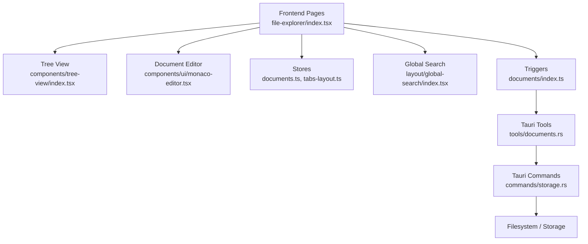
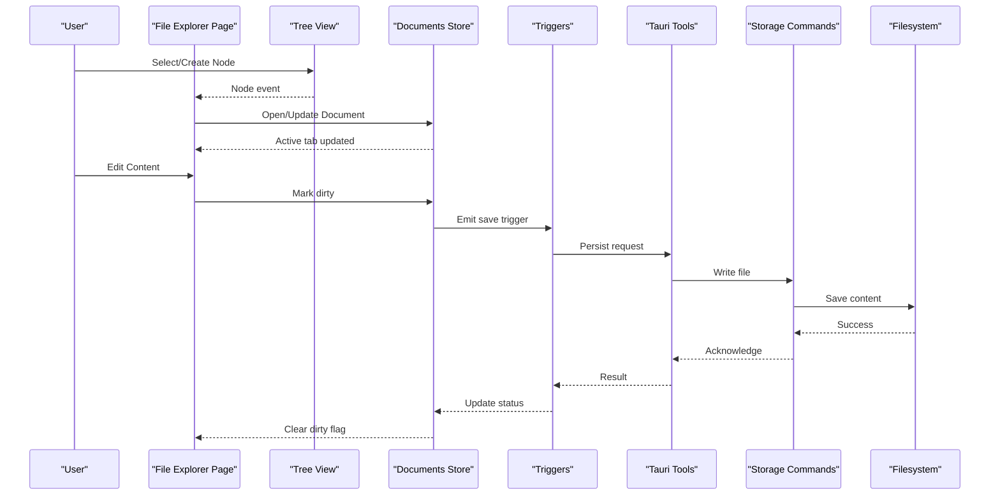
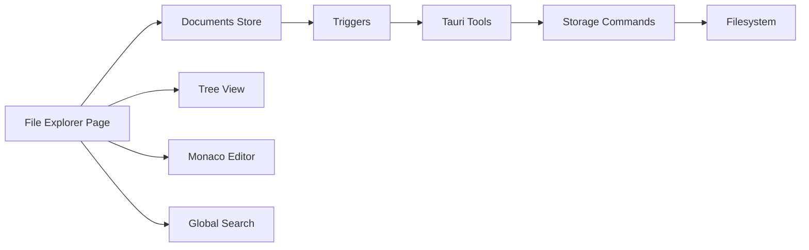

# Document Workspace

<cite>
**Referenced Files in This Document**
- [src/pages/file-explorer/index.tsx](file://src/pages/file-explorer/index.tsx)
- [src/pages/file-explorer/components/file-tree.tsx](file://src/pages/file-explorer/components/file-tree.tsx)
- [src/pages/file-explorer/components/document-editor.tsx](file://src/pages/file-explorer/components/document-editor.tsx)
- [src/stores/documents.ts](file://src/stores/documents.ts)
- [src/stores/tabs-layout.ts](file://src/stores/tabs-layout.ts)
- [src/components/tree-view/index.tsx](file://src/components/tree-view/index.tsx)
- [src/components/ui/monaco-editor.tsx](file://src/components/ui/monaco-editor.tsx)
- [src/layout/global-search/index.tsx](file://src/layout/global-search/index.tsx)
- [src/triggers/documents/index.ts](file://src/triggers/documents/index.ts)
- [src-tauri/src/tools/documents.rs](file://src-tauri/src/tools/documents.rs)
- [src-tauri/src/commands/storage.rs](file://src-tauri/src/commands/storage.rs)
- [docs/website/apprecon.code-workspace](file://docs/website/apprecon.code-workspace)
</cite>

## Table of Contents
1. [Introduction](#introduction)
2. [Project Structure](#project-structure)
3. [Core Components](#core-components)
4. [Architecture Overview](#architecture-overview)
5. [Detailed Component Analysis](#detailed-component-analysis)
6. [Dependency Analysis](#dependency-analysis)
7. [Performance Considerations](#performance-considerations)
8. [Troubleshooting Guide](#troubleshooting-guide)
9. [Conclusion](#conclusion)
10. [Appendices](#appendices)

## Introduction
This document explains the Apprecon Document Workspace and File Explorer: how to create, open, and manage multiple documents simultaneously; navigate a hierarchical document tree; search across content; organize workspaces for security test reports, API documentation sets, and project specifications; and rely on persistence, auto-save, and recovery mechanisms. It is intended for both new users and advanced practitioners who need to structure large document collections efficiently.

## Project Structure
The Document Workspace spans frontend pages, shared UI components, state stores, triggers, and Tauri backend tools and commands:
- Frontend page and components implement the file explorer UI, document editor integration, and tabbed editing experience.
- Stores manage multi-document state, tabs layout, and persistence hooks.
- Triggers expose workspace actions (create, save, rename, delete) to other features.
- Tauri tools and commands provide filesystem operations and storage APIs.
- A .code-workspace example demonstrates workspace-level configuration.

**Diagram sources**
- [src/pages/file-explorer/index.tsx](file://src/pages/file-explorer/index.tsx)
- [src/components/tree-view/index.tsx](file://src/components/tree-view/index.tsx)
- [src/components/ui/monaco-editor.tsx](file://src/components/ui/monaco-editor.tsx)
- [src/stores/documents.ts](file://src/stores/documents.ts)
- [src/stores/tabs-layout.ts](file://src/stores/tabs-layout.ts)
- [src/layout/global-search/index.tsx](file://src/layout/global-search/index.tsx)
- [src/triggers/documents/index.ts](file://src/triggers/documents/index.ts)
- [src-tauri/src/tools/documents.rs](file://src-tauri/src/tools/documents.rs)
- [src-tauri/src/commands/storage.rs](file://src-tauri/src/commands/storage.rs)

**Section sources**
- [src/pages/file-explorer/index.tsx](file://src/pages/file-explorer/index.tsx)
- [src/stores/documents.ts](file://src/stores/documents.ts)
- [src/stores/tabs-layout.ts](file://src/stores/tabs-layout.ts)
- [src-tauri/src/tools/documents.rs](file://src-tauri/src/tools/documents.rs)
- [src-tauri/src/commands/storage.rs](file://src-tauri/src/commands/storage.rs)
- [docs/website/apprecon.code-workspace](file://docs/website/apprecon.code-workspace)

## Core Components
- File Explorer Page: Orchestrates the document tree, selection, and editor integration.
- Tree View: Renders hierarchical nodes with expand/collapse and selection.
- Document Editor: Wraps Monaco-based editing with syntax support and diff capabilities.
- Documents Store: Manages open documents, active tab, unsaved changes, and lifecycle events.
- Tabs Layout Store: Controls tab ordering, pinning, and visibility.
- Global Search: Provides cross-document search with debounced input and result navigation.
- Triggers: Expose workspace actions to other modules (e.g., send-to, AI tools).
- Tauri Tools and Commands: Implement safe filesystem operations, read/write, and metadata handling.

Key responsibilities:
- Multi-document editing via tabs with independent undo/redo per document.
- Auto-save with debounced writes and conflict resolution.
- Recovery from crashes or unexpected closures using last-known-good snapshots.
- Workspace settings persisted at app level and optionally scoped by workspace file.

**Section sources**
- [src/pages/file-explorer/index.tsx](file://src/pages/file-explorer/index.tsx)
- [src/components/tree-view/index.tsx](file://src/components/tree-view/index.tsx)
- [src/components/ui/monaco-editor.tsx](file://src/components/ui/monaco-editor.tsx)
- [src/stores/documents.ts](file://src/stores/documents.ts)
- [src/stores/tabs-layout.ts](file://src/stores/tabs-layout.ts)
- [src/layout/global-search/index.tsx](file://src/layout/global-search/index.tsx)
- [src/triggers/documents/index.ts](file://src/triggers/documents/index.ts)
- [src-tauri/src/tools/documents.rs](file://src-tauri/src/tools/documents.rs)
- [src-tauri/src/commands/storage.rs](file://src-tauri/src/commands/storage.rs)

## Architecture Overview
The workspace follows a layered architecture:
- Presentation layer: File explorer page, tree view, and editor.
- State layer: Stores for documents and tabs.
- Integration layer: Triggers that broadcast actions.
- Persistence layer: Tauri tools and commands interacting with the filesystem and local storage.

**Diagram sources**
- [src/pages/file-explorer/index.tsx](file://src/pages/file-explorer/index.tsx)
- [src/components/tree-view/index.tsx](file://src/components/tree-view/index.tsx)
- [src/stores/documents.ts](file://src/stores/documents.ts)
- [src/triggers/documents/index.ts](file://src/triggers/documents/index.ts)
- [src-tauri/src/tools/documents.rs](file://src-tauri/src/tools/documents.rs)
- [src-tauri/src/commands/storage.rs](file://src-tauri/src/commands/storage.rs)

## Detailed Component Analysis

### File Explorer Page
Responsibilities:
- Render the document tree and handle node selection.
- Integrate with the editor to open files in tabs.
- Provide actions for creating, renaming, moving, and deleting documents.
- Coordinate with global search and workspace settings.

Typical workflow:
- On mount, load workspace root and build initial tree.
- On node click, open corresponding document in a new or existing tab.
- On edit, mark document as dirty and schedule auto-save.
- On close, prompt if unsaved changes exist.

**Section sources**
- [src/pages/file-explorer/index.tsx](file://src/pages/file-explorer/index.tsx)
- [src/stores/documents.ts](file://src/stores/documents.ts)
- [src/stores/tabs-layout.ts](file://src/stores/tabs-layout.ts)

### Tree View
Responsibilities:
- Display hierarchical nodes with icons and labels.
- Support expand/collapse, filtering, and keyboard navigation.
- Emit selection and context menu events.

Implementation highlights:
- Recursive node rendering with memoization for performance.
- Debounced filter updates to avoid excessive re-renders.
- Accessibility attributes for screen readers and keyboard-only workflows.

**Section sources**
- [src/components/tree-view/index.tsx](file://src/components/tree-view/index.tsx)

### Document Editor
Responsibilities:
- Wrap Monaco editor with language-specific configurations.
- Manage undo/redo stacks per document.
- Integrate with linting/formatting where applicable.
- Handle paste, drag-and-drop, and snippet insertion.

Editor behaviors:
- Tab-per-document isolation for state and history.
- Syntax highlighting based on file extension or declared type.
- Optional live preview for Markdown and structured formats.

**Section sources**
- [src/components/ui/monaco-editor.tsx](file://src/components/ui/monaco-editor.tsx)

### Documents Store
Responsibilities:
- Track open documents, active tab, and dirty flags.
- Persist tab order and pinned states.
- Coordinate auto-save intervals and conflict resolution.
- Emit lifecycle events for creation, update, deletion.

Data model overview:
- Document entries include id, path, title, content hash, and status.
- Tabs array maintains order and visibility.
- Settings include autosave delay, backup behavior, and recovery options.

**Section sources**
- [src/stores/documents.ts](file://src/stores/documents.ts)
- [src/stores/tabs-layout.ts](file://src/stores/tabs-layout.ts)

### Global Search
Responsibilities:
- Provide fast, debounced search across all open and indexed documents.
- Highlight matches and navigate to results.
- Scope searches by folder, file type, or tags.

Search flow:
- Input change triggers debounce.
- Query runs against an in-memory index built from document contents.
- Results list supports opening directly into tabs.

**Section sources**
- [src/layout/global-search/index.tsx](file://src/layout/global-search/index.tsx)

### Triggers
Responsibilities:
- Broadcast workspace actions such as create, save, rename, move, delete.
- Allow other features to interact with documents without tight coupling.

Common triggers:
- document.created
- document.updated
- document.saved
- document.deleted
- document.renamed

**Section sources**
- [src/triggers/documents/index.ts](file://src/triggers/documents/index.ts)

### Tauri Tools and Commands
Responsibilities:
- Safe filesystem operations: read, write, rename, delete, list directories.
- Metadata handling: timestamps, permissions, and encoding.
- Atomic writes and backups to prevent data loss.

Persistence flow:
- Editor emits save trigger.
- Tool serializes content and calls storage command.
- Command writes to disk with backup and returns success/failure.

**Section sources**
- [src-tauri/src/tools/documents.rs](file://src-tauri/src/tools/documents.rs)
- [src-tauri/src/commands/storage.rs](file://src-tauri/src/commands/storage.rs)

### Workspace Configuration (.code-workspace)
Purpose:
- Define workspace roots, folders, and shared settings.
- Configure default encodings, line endings, and search excludes.
- Pin frequently used documents and define custom snippets.

Usage:
- Place the workspace file at the project root.
- Open Apprecon and select the workspace file to initialize the environment.

**Section sources**
- [docs/website/apprecon.code-workspace](file://docs/website/apprecon.code-workspace)

## Dependency Analysis
The workspace components have clear separation of concerns:
- UI components depend on stores for state and triggers for side effects.
- Stores depend on triggers and Tauri tools for persistence.
- Tauri tools depend on commands for low-level filesystem access.

**Diagram sources**
- [src/pages/file-explorer/index.tsx](file://src/pages/file-explorer/index.tsx)
- [src/stores/documents.ts](file://src/stores/documents.ts)
- [src/components/tree-view/index.tsx](file://src/components/tree-view/index.tsx)
- [src/components/ui/monaco-editor.tsx](file://src/components/ui/monaco-editor.tsx)
- [src/layout/global-search/index.tsx](file://src/layout/global-search/index.tsx)
- [src/triggers/documents/index.ts](file://src/triggers/documents/index.ts)
- [src-tauri/src/tools/documents.rs](file://src-tauri/src/tools/documents.rs)
- [src-tauri/src/commands/storage.rs](file://src-tauri/src/commands/storage.rs)

**Section sources**
- [src/stores/documents.ts](file://src/stores/documents.ts)
- [src/triggers/documents/index.ts](file://src/triggers/documents/index.ts)
- [src-tauri/src/tools/documents.rs](file://src-tauri/src/tools/documents.rs)
- [src-tauri/src/commands/storage.rs](file://src-tauri/src/commands/storage.rs)

## Performance Considerations
- Debounce search input and save operations to reduce CPU and I/O pressure.
- Use virtualized lists for large trees to limit DOM nodes.
- Lazy-load heavy editor extensions and syntax definitions.
- Batch filesystem writes and use atomic operations to minimize contention.
- Cache computed indices for search and avoid recomputation on minor edits.

[No sources needed since this section provides general guidance]

## Troubleshooting Guide
Common issues and resolutions:
- Unsaved changes lost after crash: Ensure auto-save is enabled and recovery snapshots are configured. Check last-known-good backups created by the persistence layer.
- Slow tree navigation: Verify that filtering is not running synchronously; confirm virtualization is active for large datasets.
- Search returns no results: Rebuild the in-memory index; ensure excluded patterns do not match target files.
- Permission errors on save: Validate directory permissions and path validity; check Tauri capability configuration for filesystem access.
- Tabs not persisting: Confirm tabs-layout store serialization and deserialization paths; verify storage command responses.

**Section sources**
- [src/stores/documents.ts](file://src/stores/documents.ts)
- [src/stores/tabs-layout.ts](file://src/stores/tabs-layout.ts)
- [src-tauri/src/commands/storage.rs](file://src-tauri/src/commands/storage.rs)

## Conclusion
The Apprecon Document Workspace delivers a robust, multi-document editing environment with a hierarchical file explorer, powerful search, and reliable persistence. By leveraging modular components, clear state management, and safe filesystem operations, it supports complex workflows such as organizing security test reports, API documentation sets, and project specifications. Users can rely on auto-save and recovery mechanisms to protect their work while maintaining high performance through debouncing and lazy loading.

[No sources needed since this section summarizes without analyzing specific files]

## Appendices

### Creating, Opening, and Managing Multiple Documents
- Create: Right-click a folder in the tree and choose New Document; specify name and optional template.
- Open: Click a node to open in a new tab; use Ctrl/Cmd+Click to open multiple.
- Manage: Drag tabs to reorder; pin critical documents; close with confirmation if unsaved.

**Section sources**
- [src/pages/file-explorer/index.tsx](file://src/pages/file-explorer/index.tsx)
- [src/stores/tabs-layout.ts](file://src/stores/tabs-layout.ts)

### Organizing Workspaces
- Security Test Reports: Group by engagement, date, and scope; tag findings and link to evidence files.
- API Documentation Sets: Separate by service version; maintain schemas, examples, and changelogs in dedicated folders.
- Project Specifications: Use feature-based folders with requirements, design docs, and acceptance criteria.

**Section sources**
- [docs/website/apprecon.code-workspace](file://docs/website/apprecon.code-workspace)

### Persistence, Auto-Save, and Recovery
- Auto-Save: Configurable delay; writes are debounced and batched.
- Backups: Atomic writes with pre-save snapshots stored alongside originals.
- Recovery: On startup, detect unsaved sessions and offer restore from last snapshot.

**Section sources**
- [src/stores/documents.ts](file://src/stores/documents.ts)
- [src-tauri/src/tools/documents.rs](file://src-tauri/src/tools/documents.rs)
- [src-tauri/src/commands/storage.rs](file://src-tauri/src/commands/storage.rs)