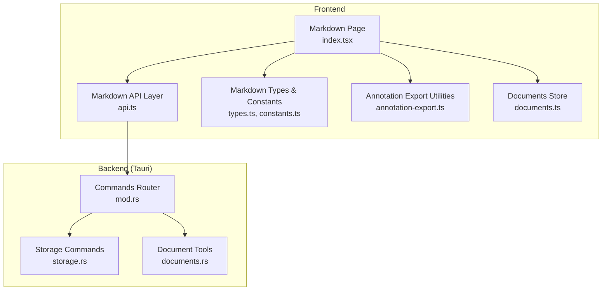
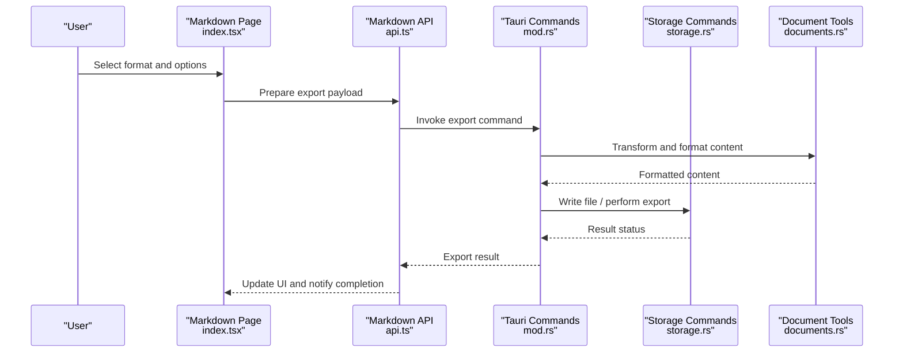
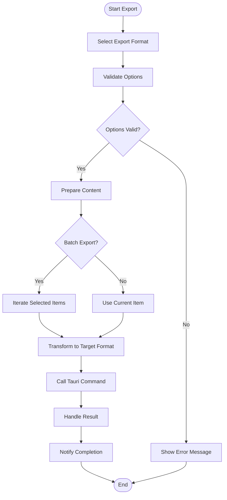
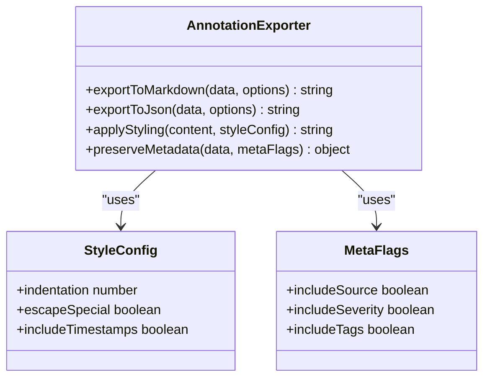
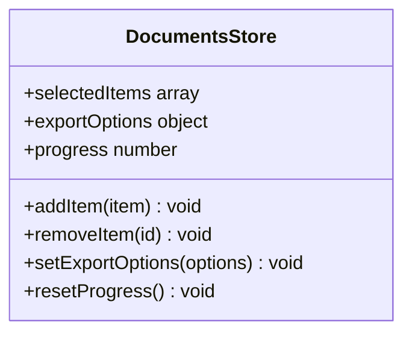
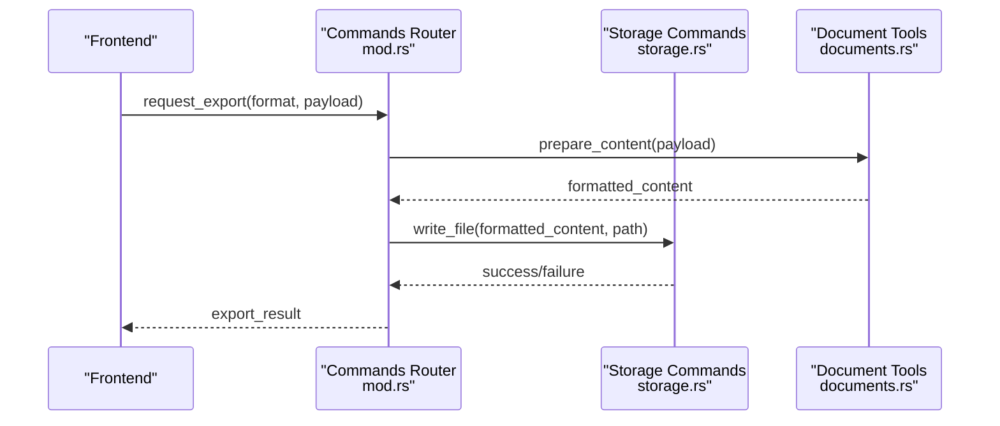
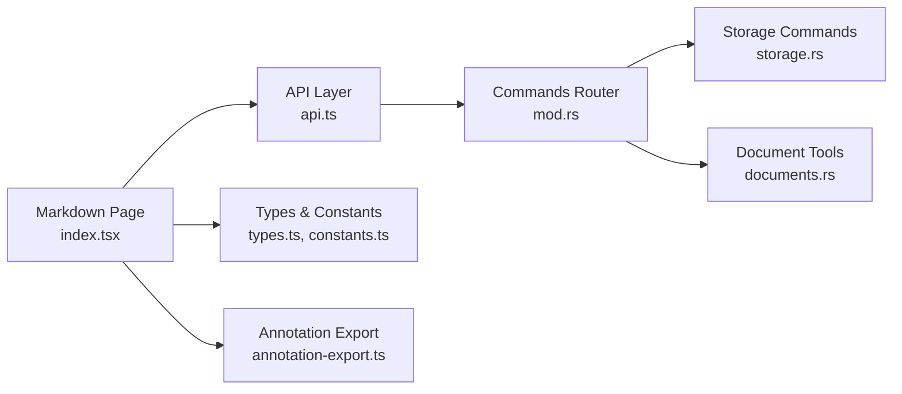

# Export Functionality

<cite>
**Referenced Files in This Document**
- [annotation-export.ts](file://src/lib/annotation-export.ts)
- [documents.ts](file://src/stores/documents.ts)
- [index.tsx](file://src/pages/markdown/index.tsx)
- [api.ts](file://src/pages/markdown/api.ts)
- [types.ts](file://src/pages/markdown/types.ts)
- [constants.ts](file://src/pages/markdown/constants.ts)
- [lib.ts](file://src/pages/markdown/lib.ts)
- [components/](file://src/pages/markdown/components/)
- [hooks/](file://src/pages/markdown/hooks/)
- [Tauri Commands - mod.rs](file://src-tauri/src/commands/mod.rs)
- [Tauri Commands - storage.rs](file://src-tauri/src/commands/storage.rs)
- [Tauri Tools - documents.rs](file://src-tauri/src/tools/documents.rs)
</cite>

## Table of Contents
1. [Introduction](#introduction)
2. [Project Structure](#project-structure)
3. [Core Components](#core-components)
4. [Architecture Overview](#architecture-overview)
5. [Detailed Component Analysis](#detailed-component-analysis)
6. [Dependency Analysis](#dependency-analysis)
7. [Performance Considerations](#performance-considerations)
8. [Troubleshooting Guide](#troubleshooting-guide)
9. [Conclusion](#conclusion)
10. [Appendices](#appendices)

## Introduction
This document explains Apprecon’s export functionality for generating reports and documentation from application data. It covers supported formats (PDF, HTML, Markdown, JSON), export options and customization settings, batch processing workflows, and integration points with external tools. It also outlines quality and styling controls and metadata preservation practices to ensure consistent, high-quality outputs across security reports, API documentation, and technical specifications.

## Project Structure
Export-related logic spans the frontend TypeScript layer and Tauri backend commands:
- Frontend Markdown page and utilities handle user interactions, format selection, and content preparation.
- Annotation export utilities transform structured annotations into target formats.
- Tauri commands and tools provide file system access and native capabilities for exporting and saving artifacts.

**Diagram sources**
- [index.tsx](file://src/pages/markdown/index.tsx)
- [api.ts](file://src/pages/markdown/api.ts)
- [types.ts](file://src/pages/markdown/types.ts)
- [constants.ts](file://src/pages/markdown/constants.ts)
- [annotation-export.ts](file://src/lib/annotation-export.ts)
- [documents.ts](file://src/stores/documents.ts)
- [mod.rs](file://src-tauri/src/commands/mod.rs)
- [storage.rs](file://src-tauri/src/commands/storage.rs)
- [documents.rs](file://src-tauri/src/tools/documents.rs)

**Section sources**
- [index.tsx](file://src/pages/markdown/index.tsx)
- [api.ts](file://src/pages/markdown/api.ts)
- [types.ts](file://src/pages/markdown/types.ts)
- [constants.ts](file://src/pages/markdown/constants.ts)
- [annotation-export.ts](file://src/lib/annotation-export.ts)
- [documents.ts](file://src/stores/documents.ts)
- [mod.rs](file://src-tauri/src/commands/mod.rs)
- [storage.rs](file://src-tauri/src/commands/storage.rs)
- [documents.rs](file://src-tauri/src/tools/documents.rs)

## Core Components
- Markdown Page: Orchestrates export UI, format selection, and triggers export flows.
- Annotation Export Utilities: Converts annotated data into target formats (e.g., Markdown, JSON).
- Documents Store: Manages document state, including selected items and export configurations.
- Tauri Commands: Expose secure operations for file writing and platform-specific exports.
- Document Tools: Provide reusable functions for formatting and preparing content for export.

Key responsibilities:
- Format selection and validation
- Content transformation and templating
- Batch export orchestration
- Metadata handling and preservation
- File system integration via Tauri

**Section sources**
- [index.tsx](file://src/pages/markdown/index.tsx)
- [annotation-export.ts](file://src/lib/annotation-export.ts)
- [documents.ts](file://src/stores/documents.ts)
- [mod.rs](file://src-tauri/src/commands/mod.rs)
- [storage.rs](file://src-tauri/src/commands/storage.rs)
- [documents.rs](file://src-tauri/src/tools/documents.rs)

## Architecture Overview
The export pipeline integrates frontend components with backend services through a clear sequence of calls. Users select formats and options; the frontend prepares content and invokes Tauri commands; the backend writes files or performs native operations and returns results.

**Diagram sources**
- [index.tsx](file://src/pages/markdown/index.tsx)
- [api.ts](file://src/pages/markdown/api.ts)
- [mod.rs](file://src-tauri/src/commands/mod.rs)
- [storage.rs](file://src-tauri/src/commands/storage.rs)
- [documents.rs](file://src-tauri/src/tools/documents.rs)

## Detailed Component Analysis

### Markdown Page and Workflow
- Handles user interactions for selecting export formats (PDF, HTML, Markdown, JSON).
- Validates inputs and gathers configuration (quality, styling, metadata toggles).
- Coordinates batch exports by iterating over selected items and aggregating results.
- Displays progress and error feedback to users.

**Diagram sources**
- [index.tsx](file://src/pages/markdown/index.tsx)
- [api.ts](file://src/pages/markdown/api.ts)

**Section sources**
- [index.tsx](file://src/pages/markdown/index.tsx)
- [api.ts](file://src/pages/markdown/api.ts)

### Annotation Export Utilities
- Transforms annotated data structures into target formats.
- Supports Markdown generation with headings, lists, and code blocks.
- Produces JSON payloads preserving metadata and relationships.
- Provides helpers for styling and quality adjustments (e.g., indentation, escaping).

**Diagram sources**
- [annotation-export.ts](file://src/lib/annotation-export.ts)

**Section sources**
- [annotation-export.ts](file://src/lib/annotation-export.ts)

### Documents Store
- Maintains state for selected items, export configurations, and progress tracking.
- Provides actions to add/remove items for batch export.
- Stores user preferences for default formats and styling options.

**Diagram sources**
- [documents.ts](file://src/stores/documents.ts)

**Section sources**
- [documents.ts](file://src/stores/documents.ts)

### Tauri Commands and Tools
- Commands router exposes endpoints for export operations.
- Storage commands handle file system writes and platform-specific behaviors.
- Document tools implement formatting logic and content preparation.

**Diagram sources**
- [mod.rs](file://src-tauri/src/commands/mod.rs)
- [storage.rs](file://src-tauri/src/commands/storage.rs)
- [documents.rs](file://src-tauri/src/tools/documents.rs)

**Section sources**
- [mod.rs](file://src-tauri/src/commands/mod.rs)
- [storage.rs](file://src-tauri/src/commands/storage.rs)
- [documents.rs](file://src-tauri/src/tools/documents.rs)

## Dependency Analysis
Export functionality depends on several modules:
- Frontend Markdown page depends on API layer, types, constants, and annotation export utilities.
- API layer communicates with Tauri commands for secure operations.
- Tauri commands rely on storage and document tools for file operations and formatting.

**Diagram sources**
- [index.tsx](file://src/pages/markdown/index.tsx)
- [api.ts](file://src/pages/markdown/api.ts)
- [types.ts](file://src/pages/markdown/types.ts)
- [constants.ts](file://src/pages/markdown/constants.ts)
- [annotation-export.ts](file://src/lib/annotation-export.ts)
- [mod.rs](file://src-tauri/src/commands/mod.rs)
- [storage.rs](file://src-tauri/src/commands/storage.rs)
- [documents.rs](file://src-tauri/src/tools/documents.rs)

**Section sources**
- [index.tsx](file://src/pages/markdown/index.tsx)
- [api.ts](file://src/pages/markdown/api.ts)
- [types.ts](file://src/pages/markdown/types.ts)
- [constants.ts](file://src/pages/markdown/constants.ts)
- [annotation-export.ts](file://src/lib/annotation-export.ts)
- [mod.rs](file://src-tauri/src/commands/mod.rs)
- [storage.rs](file://src-tauri/src/commands/storage.rs)
- [documents.rs](file://src-tauri/src/tools/documents.rs)

## Performance Considerations
- Use incremental updates for large batch exports to avoid blocking the UI.
- Stream content generation where possible to reduce memory usage.
- Cache frequently used templates and styles to speed up repeated exports.
- Optimize file I/O by batching writes and using appropriate buffering strategies.

[No sources needed since this section provides general guidance]

## Troubleshooting Guide
Common issues and resolutions:
- Permission errors when writing files: Ensure proper file system permissions and valid output paths.
- Invalid format selection: Validate format options before invoking export commands.
- Missing metadata: Confirm metadata flags are enabled and data is available.
- Slow batch exports: Monitor progress and consider reducing payload size or enabling streaming.

**Section sources**
- [storage.rs](file://src-tauri/src/commands/storage.rs)
- [documents.rs](file://src-tauri/src/tools/documents.rs)

## Conclusion
Apprecon’s export functionality provides a robust pipeline for generating high-quality reports and documentation in multiple formats. By leveraging modular components, clear architecture, and secure backend operations, it supports both single and batch exports with customizable styling and metadata preservation. The documented workflows and diagrams offer a comprehensive understanding of how to integrate and extend export capabilities for various use cases.

[No sources needed since this section summarizes without analyzing specific files]

## Appendices
- Supported Formats: PDF, HTML, Markdown, JSON
- Customization Settings: Quality levels, styling options, metadata toggles
- Batch Processing: Iterative export over selected items with progress tracking
- Integration Points: Tauri commands for file system access and native operations

[No sources needed since this section provides general guidance]