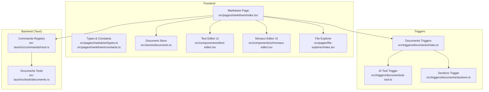
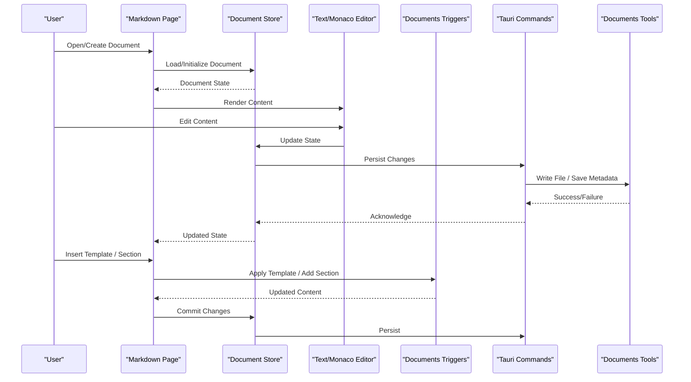
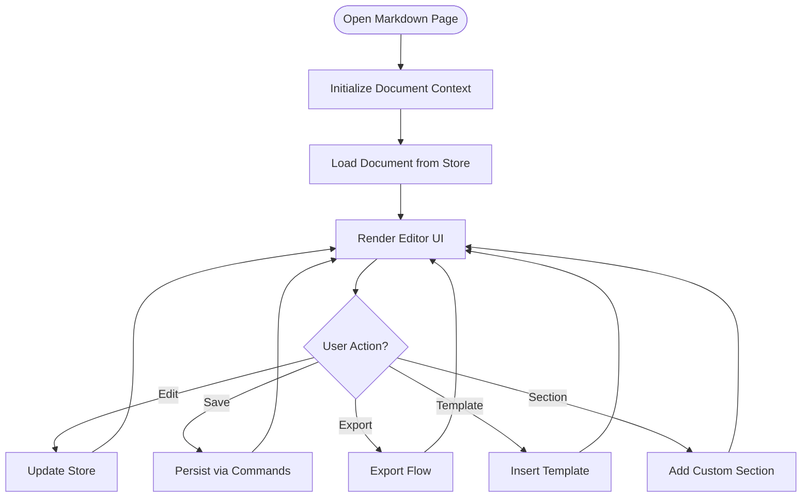
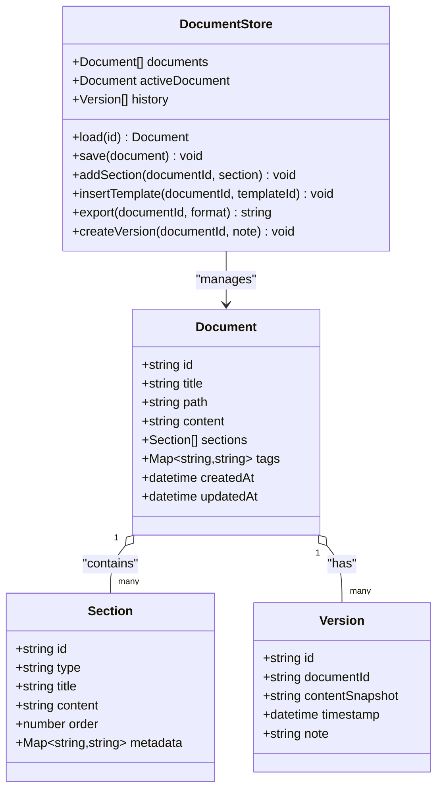
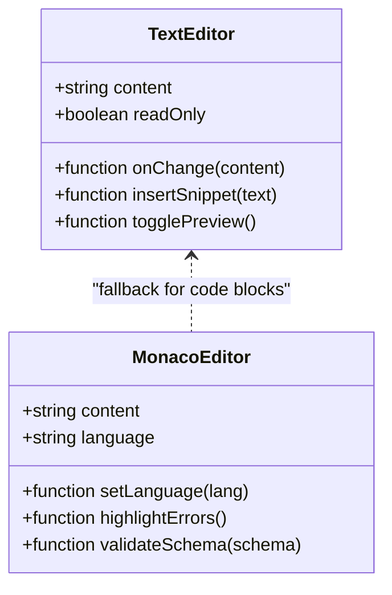
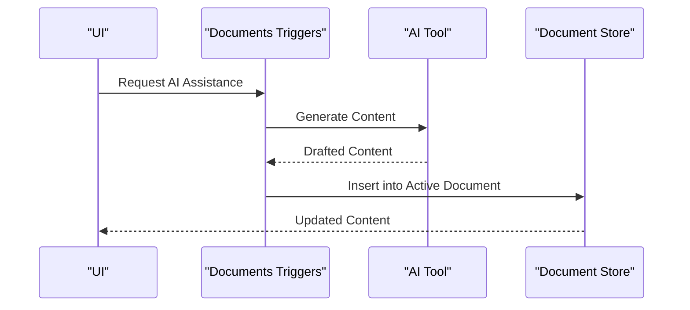
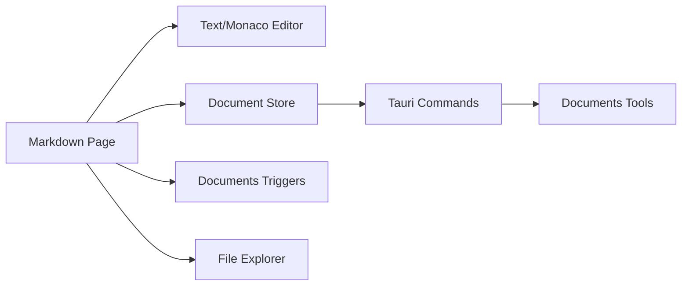

# Markdown Editor

<cite>
**Referenced Files in This Document**
- [index.tsx](file://src/pages/markdown/index.tsx)
- [api.ts](file://src/pages/markdown/api.ts)
- [constants.ts](file://src/pages/markdown/constants.ts)
- [types.ts](file://src/pages/markdown/types.ts)
- [documents.ts](file://src/stores/documents.ts)
- [ai-tool.ts](file://src/triggers/documents/ai-tool.ts)
- [sections.ts](file://src/triggers/documents/sections.ts)
- [index.ts](file://src/triggers/documents/index.ts)
- [text-editor.tsx](file://src/components/ui/text-editor.tsx)
- [monaco-editor.tsx](file://src/components/ui/monaco-editor.tsx)
- [file-explorer/index.tsx](file://src/pages/file-explorer/index.tsx)
- [tools/documents.ts](file://src-tauri/src/tools/documents.rs)
- [commands/mod.rs](file://src-tauri/src/commands/mod.rs)
</cite>

## Table of Contents
1. [Introduction](#introduction)
2. [Project Structure](#project-structure)
3. [Core Components](#core-components)
4. [Architecture Overview](#architecture-overview)
5. [Detailed Component Analysis](#detailed-component-analysis)
6. [Dependency Analysis](#dependency-analysis)
7. [Performance Considerations](#performance-considerations)
8. [Troubleshooting Guide](#troubleshooting-guide)
9. [Conclusion](#conclusion)
10. [Appendices](#appendices)

## Introduction
This document explains Apprecon’s Markdown Editor and Document Management system. It covers rich text editing capabilities, custom section creation, document templates, export functionality, the document workspace, file organization, collaboration features, versioning and backup strategies, and integration with other Apprecon features such as the File Explorer. The goal is to help users create structured documents like security test reports, API documentation, and project specifications efficiently and consistently.

## Project Structure
The Markdown Editor is implemented as a dedicated page within Apprecon’s desktop application. It integrates with the global document store, Tauri backend commands for persistence and exports, and triggers that enable AI assistance and section management. The editor UI leverages reusable components for rich text editing and code-aware editing when needed.



**Diagram sources**
- [index.tsx](file://src/pages/markdown/index.tsx)
- [types.ts](file://src/pages/markdown/types.ts)
- [constants.ts](file://src/pages/markdown/constants.ts)
- [documents.ts](file://src/stores/documents.ts)
- [text-editor.tsx](file://src/components/ui/text-editor.tsx)
- [monaco-editor.tsx](file://src/components/ui/monaco-editor.tsx)
- [index.ts](file://src/triggers/documents/index.ts)
- [ai-tool.ts](file://src/triggers/documents/ai-tool.ts)
- [sections.ts](file://src/triggers/documents/sections.ts)
- [file-explorer/index.tsx](file://src/pages/file-explorer/index.tsx)
- [commands/mod.rs](file://src-tauri/src/commands/mod.rs)
- [tools/documents.ts](file://src-tauri/src/tools/documents.rs)

**Section sources**
- [index.tsx](file://src/pages/markdown/index.tsx)
- [types.ts](file://src/pages/markdown/types.ts)
- [constants.ts](file://src/pages/markdown/constants.ts)
- [documents.ts](file://src/stores/documents.ts)
- [text-editor.tsx](file://src/components/ui/text-editor.tsx)
- [monaco-editor.tsx](file://src/components/ui/monaco-editor.tsx)
- [index.ts](file://src/triggers/documents/index.ts)
- [ai-tool.ts](file://src/triggers/documents/ai-tool.ts)
- [sections.ts](file://src/triggers/documents/sections.ts)
- [file-explorer/index.tsx](file://src/pages/file-explorer/index.tsx)
- [commands/mod.rs](file://src-tauri/src/commands/mod.rs)
- [tools/documents.ts](file://src-tauri/src/tools/documents.rs)

## Core Components
- Markdown Page: Orchestrates the editor lifecycle, manages active documents, and wires up actions like save, export, and template insertion.
- Document Store: Centralized state for documents, sections, versions, and metadata; persists changes via Tauri commands.
- Text Editor UI: Rich text editing surface supporting markdown formatting, live preview, and keyboard shortcuts.
- Monaco Editor UI: Code-aware editor for advanced scenarios (e.g., embedding code blocks or JSON/YAML snippets).
- Triggers: Event-driven hooks for AI-assisted writing and section operations.
- Backend Tools: Tauri tools for file I/O, export formats, and storage operations.

Key responsibilities:
- Create, open, and close documents.
- Manage sections and templates.
- Persist content and metadata.
- Export to multiple formats.
- Integrate with File Explorer for navigation and asset linking.

**Section sources**
- [index.tsx](file://src/pages/markdown/index.tsx)
- [documents.ts](file://src/stores/documents.ts)
- [text-editor.tsx](file://src/components/ui/text-editor.tsx)
- [monaco-editor.tsx](file://src/components/ui/monaco-editor.tsx)
- [index.ts](file://src/triggers/documents/index.ts)
- [ai-tool.ts](file://src/triggers/documents/ai-tool.ts)
- [sections.ts](file://src/triggers/documents/sections.ts)
- [tools/documents.ts](file://src-tauri/src/tools/documents.rs)

## Architecture Overview
The Markdown Editor follows a layered architecture:
- Presentation Layer: Markdown Page and editor components render the UI and handle user interactions.
- State Layer: Document Store maintains current documents, sections, and history.
- Integration Layer: Triggers connect UI events to AI and section logic.
- Persistence Layer: Tauri commands and tools read/write files and manage exports.



**Diagram sources**
- [index.tsx](file://src/pages/markdown/index.tsx)
- [documents.ts](file://src/stores/documents.ts)
- [text-editor.tsx](file://src/components/ui/text-editor.tsx)
- [monaco-editor.tsx](file://src/components/ui/monaco-editor.tsx)
- [index.ts](file://src/triggers/documents/index.ts)
- [commands/mod.rs](file://src-tauri/src/commands/mod.rs)
- [tools/documents.ts](file://src-tauri/src/tools/documents.rs)

## Detailed Component Analysis

### Markdown Page
Responsibilities:
- Initialize and manage the active document context.
- Wire editor events to store updates.
- Provide actions for saving, exporting, and inserting templates/sections.
- Coordinate with File Explorer for opening related assets.



**Diagram sources**
- [index.tsx](file://src/pages/markdown/index.tsx)
- [documents.ts](file://src/stores/documents.ts)

**Section sources**
- [index.tsx](file://src/pages/markdown/index.tsx)

### Document Store
Responsibilities:
- Maintain current documents, sections, and metadata.
- Track version history and backups.
- Emit updates to UI components.
- Coordinate with Tauri commands for persistence.

Key data model elements:
- Documents: id, title, path, content, sections, tags, timestamps.
- Sections: type, title, content, order, metadata.
- Versions: snapshot of content at specific points.



**Diagram sources**
- [documents.ts](file://src/stores/documents.ts)

**Section sources**
- [documents.ts](file://src/stores/documents.ts)

### Text Editor UI and Monaco Editor UI
Responsibilities:
- Provide rich text editing with markdown support.
- Offer syntax highlighting and code-aware editing for embedded content.
- Support keyboard shortcuts, undo/redo, and live preview.



**Diagram sources**
- [text-editor.tsx](file://src/components/ui/text-editor.tsx)
- [monaco-editor.tsx](file://src/components/ui/monaco-editor.tsx)

**Section sources**
- [text-editor.tsx](file://src/components/ui/text-editor.tsx)
- [monaco-editor.tsx](file://src/components/ui/monaco-editor.tsx)

### Triggers: AI Tool and Sections
Responsibilities:
- AI Tool Trigger: Assist with drafting, summarizing, and generating content based on prompts.
- Sections Trigger: Manage custom section types, ordering, and validation.



**Diagram sources**
- [index.ts](file://src/triggers/documents/index.ts)
- [ai-tool.ts](file://src/triggers/documents/ai-tool.ts)
- [sections.ts](file://src/triggers/documents/sections.ts)
- [documents.ts](file://src/stores/documents.ts)

**Section sources**
- [index.ts](file://src/triggers/documents/index.ts)
- [ai-tool.ts](file://src/triggers/documents/ai-tool.ts)
- [sections.ts](file://src/triggers/documents/sections.ts)

### Backend Tools and Commands
Responsibilities:
- Handle file I/O, export generation, and storage operations.
- Expose commands for frontend to persist and retrieve documents.

```mermaid
flowchart TD
Frontend["Frontend Commands"] --> TauriCmds["Tauri Commands"]
TauriCmds --> DocsTools["Documents Tools"]
DocsTools --> FS["File System"]
DocsTools --> Storage["Local Storage"]
FS --> >DocsTools: Read/Write
Storage --> >DocsTools: Read/Write
DocsTools --> >TauriCmds: Results
TauriCmds --> >Frontend: Responses
```

**Diagram sources**
- [commands/mod.rs](file://src-tauri/src/commands/mod.rs)
- [tools/documents.ts](file://src-tauri/src/tools/documents.rs)

**Section sources**
- [commands/mod.rs](file://src-tauri/src/commands/mod.rs)
- [tools/documents.ts](file://src-tauri/src/tools/documents.rs)

## Dependency Analysis
The Markdown Editor depends on:
- UI components for rendering and interaction.
- Document store for state management.
- Triggers for AI and section operations.
- Tauri commands and tools for persistence and exports.
- File Explorer for navigation and asset linking.



**Diagram sources**
- [index.tsx](file://src/pages/markdown/index.tsx)
- [documents.ts](file://src/stores/documents.ts)
- [index.ts](file://src/triggers/documents/index.ts)
- [file-explorer/index.tsx](file://src/pages/file-explorer/index.tsx)
- [commands/mod.rs](file://src-tauri/src/commands/mod.rs)
- [tools/documents.ts](file://src-tauri/src/tools/documents.rs)

**Section sources**
- [index.tsx](file://src/pages/markdown/index.tsx)
- [documents.ts](file://src/stores/documents.ts)
- [index.ts](file://src/triggers/documents/index.ts)
- [file-explorer/index.tsx](file://src/pages/file-explorer/index.tsx)
- [commands/mod.rs](file://src-tauri/src/commands/mod.rs)
- [tools/documents.ts](file://src-tauri/src/tools/documents.rs)

## Performance Considerations
- Debounce editor updates to reduce frequent writes.
- Use incremental saves for large documents.
- Lazy-load heavy editor features (e.g., Monaco) only when needed.
- Cache frequently accessed templates and sections.
- Optimize export generation by streaming large outputs.

[No sources needed since this section provides general guidance]

## Troubleshooting Guide
Common issues and resolutions:
- Editor not saving: Verify Tauri commands are registered and permissions allow file access.
- Templates not inserting: Check trigger registration and template definitions.
- Export failures: Ensure output directory exists and has write permissions.
- Collaboration conflicts: Review versioning logs and merge strategies.

**Section sources**
- [commands/mod.rs](file://src-tauri/src/commands/mod.rs)
- [tools/documents.ts](file://src-tauri/src/tools/documents.rs)
- [index.ts](file://src/triggers/documents/index.ts)

## Conclusion
Apprecon’s Markdown Editor provides a robust environment for creating structured documents with rich editing, templating, and export capabilities. Its integration with the document store, triggers, and backend tools ensures reliable persistence and extensibility. Users can efficiently produce security test reports, API documentation, and project specifications while leveraging collaboration and versioning features.

[No sources needed since this section summarizes without analyzing specific files]

## Appendices

### Creating Security Test Reports
- Use predefined sections for scope, methodology, findings, and remediation.
- Insert evidence links from File Explorer.
- Export as PDF or HTML for sharing.

**Section sources**
- [sections.ts](file://src/triggers/documents/sections.ts)
- [file-explorer/index.tsx](file://src/pages/file-explorer/index.tsx)

### Writing API Documentation
- Leverage code-aware editor for JSON/YAML examples.
- Use templates for endpoints, parameters, and responses.
- Validate schemas using Monaco editor features.

**Section sources**
- [monaco-editor.tsx](file://src/components/ui/monaco-editor.tsx)
- [documents.ts](file://src/stores/documents.ts)

### Developing Project Specifications
- Organize sections by milestones, requirements, and risks.
- Collaborate using versioning and backup strategies.
- Export to multiple formats for stakeholders.

**Section sources**
- [documents.ts](file://src/stores/documents.ts)
- [tools/documents.ts](file://src-tauri/src/tools/documents.rs)