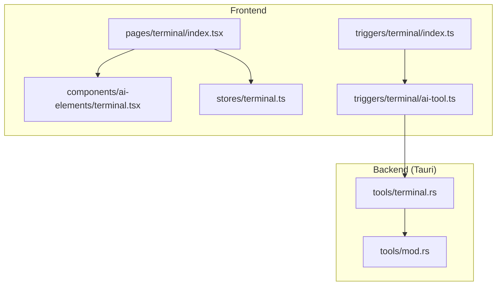
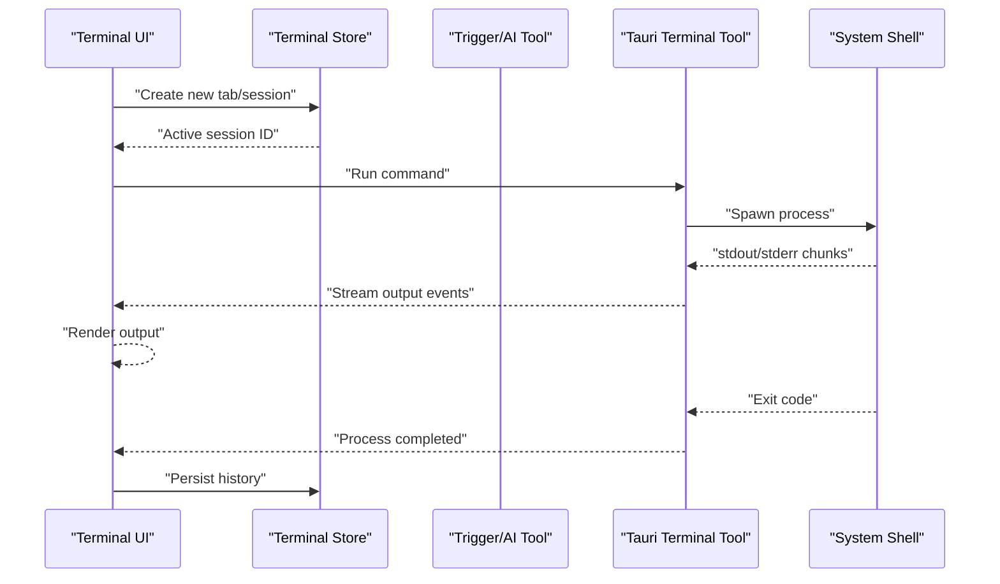
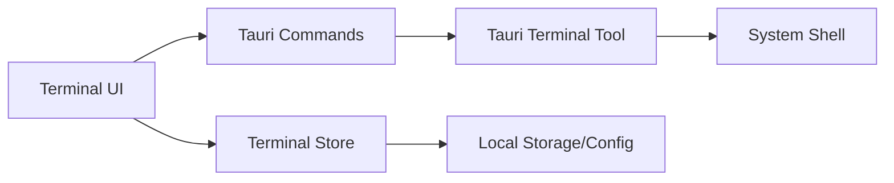

# Terminal Integration

<cite>
**Referenced Files in This Document**
- [terminal.tsx](file://src/components/ai-elements/terminal.tsx)
- [index.tsx](file://src/pages/terminal/index.tsx)
- [terminal.ts](file://src/stores/terminal.ts)
- [terminal.rs](file://src-tauri/src/tools/terminal.rs)
- [mod.rs](file://src-tauri/src/tools/mod.rs)
- [ai-tool.ts](file://src/triggers/terminal/ai-tool.ts)
- [index.ts](file://src/triggers/terminal/index.ts)
</cite>

## Table of Contents
1. [Introduction](#introduction)
2. [Project Structure](#project-structure)
3. [Core Components](#core-components)
4. [Architecture Overview](#architecture-overview)
5. [Detailed Component Analysis](#detailed-component-analysis)
6. [Dependency Analysis](#dependency-analysis)
7. [Performance Considerations](#performance-considerations)
8. [Troubleshooting Guide](#troubleshooting-guide)
9. [Conclusion](#conclusion)
10. [Appendices](#appendices)

## Introduction
This document explains Apprecon’s integrated terminal: how sessions are managed, commands are executed and captured, and how the terminal integrates with the system shell. It also covers customization (colors, fonts), keyboard shortcuts, multi-tab support, session persistence, command history, practical examples for security workflows, automation, and important security considerations and troubleshooting steps.

## Project Structure
The terminal feature spans both the frontend (React/TypeScript) and the backend (Tauri/Rust). The key areas are:
- Frontend UI and state: terminal page, AI-triggered actions, and store for session/tab management
- Backend execution: Rust tooling that spawns and communicates with the OS shell
- Triggers: integration points to invoke terminal actions from other parts of the app

**Diagram sources**
- [index.tsx](file://src/pages/terminal/index.tsx)
- [terminal.tsx](file://src/components/ai-elements/terminal.tsx)
- [terminal.ts](file://src/stores/terminal.ts)
- [index.ts](file://src/triggers/terminal/index.ts)
- [ai-tool.ts](file://src/triggers/terminal/ai-tool.ts)
- [terminal.rs](file://src-tauri/src/tools/terminal.rs)
- [mod.rs](file://src-tauri/src/tools/mod.rs)

**Section sources**
- [index.tsx](file://src/pages/terminal/index.tsx)
- [terminal.tsx](file://src/components/ai-elements/terminal.tsx)
- [terminal.ts](file://src/stores/terminal.ts)
- [terminal.rs](file://src-tauri/src/tools/terminal.rs)
- [mod.rs](file://src-tauri/src/tools/mod.rs)
- [index.ts](file://src/triggers/terminal/index.ts)
- [ai-tool.ts](file://src/triggers/terminal/ai-tool.ts)

## Core Components
- Terminal UI component: renders a terminal view, handles input/output streaming, and exposes configuration hooks for appearance and behavior.
- Terminal page: orchestrates tabs, manages active sessions, and wires up the terminal UI to the store.
- Terminal store: maintains tab/session state, command history, and persistence settings.
- Tauri terminal tool: executes commands via the system shell, streams output back to the UI, and manages process lifecycle.
- Trigger integrations: expose terminal actions to AI tools and other features.

Key responsibilities:
- Session management: create, switch, and close tabs; track working directory and environment per session
- Command execution: run commands asynchronously, stream stdout/stderr, handle exit codes
- Output capture: buffer and render terminal output efficiently
- Shell integration: spawn the user’s default shell or a configured one
- Customization: theme colors, font family/size, cursor style, and rendering options
- History and persistence: maintain per-session and global command history; persist across app restarts where supported

**Section sources**
- [terminal.tsx](file://src/components/ai-elements/terminal.tsx)
- [index.tsx](file://src/pages/terminal/index.tsx)
- [terminal.ts](file://src/stores/terminal.ts)
- [terminal.rs](file://src-tauri/src/tools/terminal.rs)
- [mod.rs](file://src-tauri/src/tools/mod.rs)
- [index.ts](file://src/triggers/terminal/index.ts)
- [ai-tool.ts](file://src/triggers/terminal/ai-tool.ts)

## Architecture Overview
The terminal uses a layered architecture:
- UI layer (React): renders the terminal, captures keystrokes, and displays streamed output
- State layer (store): manages tabs, sessions, and history
- Integration layer (triggers): connects terminal capabilities to AI and other modules
- Execution layer (Tauri/Rust): spawns shells, runs commands, and streams I/O back to the UI

**Diagram sources**
- [terminal.tsx](file://src/components/ai-elements/terminal.tsx)
- [terminal.ts](file://src/stores/terminal.ts)
- [ai-tool.ts](file://src/triggers/terminal/ai-tool.ts)
- [terminal.rs](file://src-tauri/src/tools/terminal.rs)

## Detailed Component Analysis

### Terminal UI Component
Responsibilities:
- Renders terminal content and input area
- Handles keyboard events and shortcuts
- Streams and displays output lines
- Exposes configuration for colors, fonts, and behavior

Customization options typically include:
- Color scheme selection and overrides
- Font family and size
- Cursor style and blinking
- Scrollback buffer size
- Line wrapping and padding

Keyboard shortcuts commonly include:
- New tab, close tab, switch tabs
- Copy/paste within terminal
- Clear screen
- Search/filter output

Security considerations:
- Input sanitization before sending to shell
- Confirmation prompts for destructive commands
- Restricting access to sensitive paths when applicable

**Section sources**
- [terminal.tsx](file://src/components/ai-elements/terminal.tsx)

### Terminal Page
Responsibilities:
- Manages multiple tabs and their lifecycle
- Wires the terminal UI to the store
- Provides navigation controls and status indicators

Multi-tab support:
- Each tab represents an independent session with its own working directory and history
- Tabs can be pinned, renamed, and reordered

Session persistence:
- Restore last-used tabs and their states on app launch (if enabled)
- Persist command history per session and globally

**Section sources**
- [index.tsx](file://src/pages/terminal/index.tsx)
- [terminal.ts](file://src/stores/terminal.ts)

### Terminal Store
Responsibilities:
- Maintains tab/session data structures
- Tracks command history and search filters
- Persists settings and state to local storage or app config

Data model highlights:
- Tab/session objects with metadata (title, cwd, env vars)
- History entries with timestamps and results
- Settings for appearance and behavior

Complexity considerations:
- Efficient updates for large outputs using incremental rendering
- Debounced persistence to avoid excessive writes

**Section sources**
- [terminal.ts](file://src/stores/terminal.ts)

### Tauri Terminal Tool (Backend)
Responsibilities:
- Spawns the system shell with appropriate arguments
- Executes commands and streams stdout/stderr back to the UI
- Manages process lifecycle and error handling
- Enforces permissions and sandbox constraints

Execution flow:
- Validate command and environment
- Spawn process with isolated working directory
- Stream output in chunks
- Capture exit code and errors
- Clean up resources

Error handling:
- Network-like error mapping for UI feedback
- Graceful fallbacks if shell is unavailable

**Section sources**
- [terminal.rs](file://src-tauri/src/tools/terminal.rs)
- [mod.rs](file://src-tauri/src/tools/mod.rs)

### Trigger Integrations
Responsibilities:
- Expose terminal actions to AI tools and other modules
- Provide safe abstractions for running commands programmatically

Common triggers:
- Run a command string
- Open a new tab with preset environment
- Send output to another module (e.g., logs, reports)

**Section sources**
- [index.ts](file://src/triggers/terminal/index.ts)
- [ai-tool.ts](file://src/triggers/terminal/ai-tool.ts)

## Dependency Analysis
The terminal feature depends on:
- React components for rendering
- Tauri APIs for cross-process communication
- System shell executables for command execution
- Local storage/config for persistence

**Diagram sources**
- [terminal.tsx](file://src/components/ai-elements/terminal.tsx)
- [terminal.ts](file://src/stores/terminal.ts)
- [terminal.rs](file://src-tauri/src/tools/terminal.rs)

**Section sources**
- [terminal.tsx](file://src/components/ai-elements/terminal.tsx)
- [terminal.ts](file://src/stores/terminal.ts)
- [terminal.rs](file://src-tauri/src/tools/terminal.rs)

## Performance Considerations
- Streaming output: use chunked updates to keep UI responsive during long-running commands
- Buffer management: limit scrollback size to prevent memory growth
- Debounce persistence: batch writes to avoid frequent disk I/O
- Rendering optimization: virtualize large outputs if necessary
- Shell spawning: reuse processes where feasible to reduce overhead

[No sources needed since this section provides general guidance]

## Troubleshooting Guide
Common issues and resolutions:
- Terminal not connecting to shell:
  - Verify shell path and permissions
  - Check Tauri capabilities and sandbox settings
  - Ensure no conflicting environment variables
- Output not appearing:
  - Confirm stdout/stderr streaming is enabled
  - Inspect backend logs for process errors
  - Test with a simple command like echo or pwd
- Permission denied errors:
  - Adjust file and directory permissions
  - Use elevated privileges only when necessary
  - Review security policies applied by the OS
- Slow performance:
  - Reduce scrollback buffer size
  - Avoid running extremely verbose commands
  - Close unused tabs to free resources

**Section sources**
- [terminal.rs](file://src-tauri/src/tools/terminal.rs)
- [terminal.tsx](file://src/components/ai-elements/terminal.tsx)
- [terminal.ts](file://src/stores/terminal.ts)

## Conclusion
Apprecon’s integrated terminal provides a robust, customizable, and secure way to execute commands directly within the application. With multi-tab support, session persistence, and seamless shell integration, it enhances productivity for security professionals and developers. Proper configuration and adherence to security best practices ensure reliable operation across diverse environments.

[No sources needed since this section summarizes without analyzing specific files]

## Appendices

### Examples of Common Workflows
- Running security tools:
  - Execute network scanners or vulnerability checkers from within a dedicated tab
  - Pipe output to files or other tools for analysis
- Executing scripts:
  - Run automation scripts with predefined environments
  - Pass arguments and environment variables securely
- Automating tasks:
  - Chain commands using shell operators
  - Integrate with CI/CD pipelines via trigger endpoints

[No sources needed since this section provides general guidance]

### Security Considerations
- Least privilege principle: run commands with minimal required permissions
- Input validation: sanitize all user-provided inputs before execution
- Audit logging: record command executions for compliance and debugging
- Sandboxing: isolate terminal sessions where possible to limit impact

[No sources needed since this section provides general guidance]