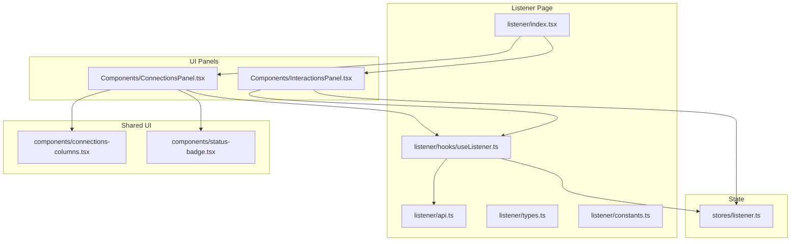
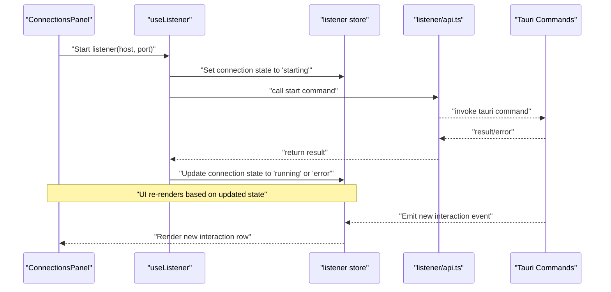
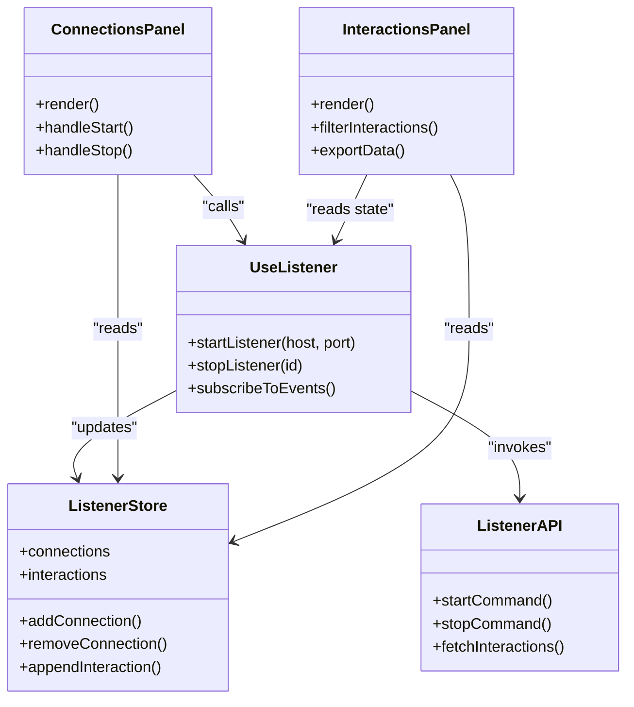

# Callback Listener

<cite>
**Referenced Files in This Document**
- [listener/index.tsx](file://src/pages/listener/index.tsx)
- [listener/api.ts](file://src/pages/listener/api.ts)
- [listener/constants.ts](file://src/pages/listener/constants.ts)
- [listener/types.ts](file://src/pages/listener/types.ts)
- [listener/components/ConnectionsPanel.tsx](file://src/pages/listener/components/ConnectionsPanel.tsx)
- [listener/components/InteractionsPanel.tsx](file://src/pages/listener/components/InteractionsPanel.tsx)
- [listener/hooks/useListener.ts](file://src/pages/listener/hooks/useListener.ts)
- [stores/listener.ts](file://src/stores/listener.ts)
- [components/connections-columns.tsx](file://src/components/connections-columns.tsx)
- [components/status-badge.tsx](file://src/components/status-badge.tsx)
</cite>

## Table of Contents
1. [Introduction](#introduction)
2. [Project Structure](#project-structure)
3. [Core Components](#core-components)
4. [Architecture Overview](#architecture-overview)
5. [Detailed Component Analysis](#detailed-component-analysis)
6. [Dependency Analysis](#dependency-analysis)
7. [Performance Considerations](#performance-considerations)
8. [Troubleshooting Guide](#troubleshooting-guide)
9. [Conclusion](#conclusion)
10. [Appendices](#appendices)

## Introduction
This document explains Apprecon’s callback listener functionality, focusing on how to set up and manage outbound connections for receiving callbacks from external services. It covers the interaction tracking system, host management, connection lifecycle, and the interactions panel used to view received callbacks and analyze request data. It also includes common use cases (webhook testing, out-of-band testing, integration verification), security considerations, troubleshooting steps, and scalability guidance for handling multiple concurrent connections.

## Project Structure
The callback listener feature is implemented primarily under the listener page and supporting stores and UI components:
- Page entry and routing logic live in the listener page directory.
- API helpers encapsulate communication with backend commands.
- Types and constants define shapes and defaults.
- Hooks centralize state and side effects for starting/stopping listeners and managing hosts.
- Stores maintain application-wide state for active connections and interactions.
- Panels provide the user interface for managing connections and viewing interactions.

**Diagram sources**
- [listener/index.tsx](file://src/pages/listener/index.tsx)
- [listener/api.ts](file://src/pages/listener/api.ts)
- [listener/types.ts](file://src/pages/listener/types.ts)
- [listener/constants.ts](file://src/pages/listener/constants.ts)
- [listener/hooks/useListener.ts](file://src/pages/listener/hooks/useListener.ts)
- [stores/listener.ts](file://src/stores/listener.ts)
- [components/connections-columns.tsx](file://src/components/connections-columns.tsx)
- [components/status-badge.tsx](file://src/components/status-badge.tsx)

**Section sources**
- [listener/index.tsx](file://src/pages/listener/index.tsx)
- [listener/api.ts](file://src/pages/listener/api.ts)
- [listener/types.ts](file://src/pages/listener/types.ts)
- [listener/constants.ts](file://src/pages/listener/constants.ts)
- [listener/hooks/useListener.ts](file://src/pages/listener/hooks/useListener.ts)
- [stores/listener.ts](file://src/stores/listener.ts)
- [components/connections-columns.tsx](file://src/components/connections-columns.tsx)
- [components/status-badge.tsx](file://src/components/status-badge.tsx)

## Core Components
- Listener page orchestrates the UI panels and integrates with hooks and stores.
- Connections panel manages outbound connections (hosts, ports, protocols) and their lifecycle states.
- Interactions panel displays received callbacks, including method, path, headers, body, timestamps, and metadata.
- Hook useListener centralizes listener control (start/stop), host management, and event subscription.
- Store listener maintains global state for active connections and interaction history.
- API module provides functions to call Tauri commands for listener operations.

Key responsibilities:
- Start/stop listener instances bound to specific hosts and ports.
- Track incoming requests as interactions with rich metadata.
- Render interactive tables for connections and interactions.
- Persist or surface relevant fields for analysis and export.

**Section sources**
- [listener/index.tsx](file://src/pages/listener/index.tsx)
- [listener/components/ConnectionsPanel.tsx](file://src/pages/listener/components/ConnectionsPanel.tsx)
- [listener/components/InteractionsPanel.tsx](file://src/pages/listener/components/InteractionsPanel.tsx)
- [listener/hooks/useListener.ts](file://src/pages/listener/hooks/useListener.ts)
- [stores/listener.ts](file://src/stores/listener.ts)
- [listener/api.ts](file://src/pages/listener/api.ts)

## Architecture Overview
The callback listener architecture follows a clear separation between UI, state, and backend integration:
- UI panels render connection and interaction data.
- The hook coordinates actions and subscribes to store updates.
- The store holds connection and interaction state.
- The API layer calls Tauri commands to start/stop listeners and fetch events.

**Diagram sources**
- [listener/components/ConnectionsPanel.tsx](file://src/pages/listener/components/ConnectionsPanel.tsx)
- [listener/hooks/useListener.ts](file://src/pages/listener/hooks/useListener.ts)
- [stores/listener.ts](file://src/stores/listener.ts)
- [listener/api.ts](file://src/pages/listener/api.ts)

## Detailed Component Analysis

### Listener Page
The listener page composes the Connections and Interactions panels and wires them to the hook and store. It ensures that when a listener starts, the UI reflects the current state and that incoming interactions are displayed in real time.

Responsibilities:
- Mount panels and pass necessary props.
- Integrate with global navigation and tabs if applicable.
- Ensure proper cleanup on unmount.

**Section sources**
- [listener/index.tsx](file://src/pages/listener/index.tsx)

### Connections Panel
Manages outbound connections for receiving callbacks:
- Host selection and validation.
- Port binding and conflict detection.
- Protocol support (HTTP/HTTPS).
- Lifecycle controls: start, stop, restart.
- Status indicators and error messages.

User actions:
- Add a new connection with host/port configuration.
- Start/stop individual connections.
- View status badges and logs.

Data flow:
- User input -> Hook -> API -> Backend -> Store update -> UI refresh.

**Section sources**
- [listener/components/ConnectionsPanel.tsx](file://src/pages/listener/components/ConnectionsPanel.tsx)
- [components/connections-columns.tsx](file://src/components/connections-columns.tsx)
- [components/status-badge.tsx](file://src/components/status-badge.tsx)

### Interactions Panel
Displays received callbacks with detailed request information:
- Method, URL, path, query parameters.
- Headers and body content.
- Timestamps and duration.
- Filtering and search capabilities.
- Export options for analysis.

Features:
- Real-time updates as new interactions arrive.
- Expandable rows for full payload inspection.
- Copy-to-clipboard for quick sharing.

**Section sources**
- [listener/components/InteractionsPanel.tsx](file://src/pages/listener/components/InteractionsPanel.tsx)
- [stores/listener.ts](file://src/stores/listener.ts)

### Hook: useListener
Centralizes listener control and state synchronization:
- Start/stop listeners per host/port.
- Manage connection lifecycle states.
- Subscribe to interaction events from the store.
- Handle errors and retries.

Common patterns:
- Debounced start attempts to avoid race conditions.
- Cleanup on component unmount to release resources.
- Error boundary handling for robustness.

**Section sources**
- [listener/hooks/useListener.ts](file://src/pages/listener/hooks/useListener.ts)

### Store: listener
Maintains application-wide state:
- Active connections list with status and metadata.
- Interaction history with filtering and sorting.
- Event subscriptions for real-time updates.

Operations:
- Add/remove connections.
- Append new interactions.
- Clear history or archive entries.

**Section sources**
- [stores/listener.ts](file://src/stores/listener.ts)

### API Layer: listener/api.ts
Encapsulates Tauri command invocations:
- Start listener with host/port configuration.
- Stop listener by identifier.
- Fetch recent interactions.
- Handle responses and errors consistently.

Best practices:
- Centralized error mapping.
- Retry logic for transient failures.
- Type-safe payloads using shared types.

**Section sources**
- [listener/api.ts](file://src/pages/listener/api.ts)

### Types and Constants
Define shared structures and defaults:
- Connection configuration schema.
- Interaction record shape.
- Status enums and default values.
- Validation rules for host/port inputs.

**Section sources**
- [listener/types.ts](file://src/pages/listener/types.ts)
- [listener/constants.ts](file://src/pages/listener/constants.ts)

## Dependency Analysis
The listener feature depends on shared UI components and the global store. The hook bridges UI actions to the API layer and store updates.

**Diagram sources**
- [listener/components/ConnectionsPanel.tsx](file://src/pages/listener/components/ConnectionsPanel.tsx)
- [listener/components/InteractionsPanel.tsx](file://src/pages/listener/components/InteractionsPanel.tsx)
- [listener/hooks/useListener.ts](file://src/pages/listener/hooks/useListener.ts)
- [stores/listener.ts](file://src/stores/listener.ts)
- [listener/api.ts](file://src/pages/listener/api.ts)

**Section sources**
- [listener/components/ConnectionsPanel.tsx](file://src/pages/listener/components/ConnectionsPanel.tsx)
- [listener/components/InteractionsPanel.tsx](file://src/pages/listener/components/InteractionsPanel.tsx)
- [listener/hooks/useListener.ts](file://src/pages/listener/hooks/useListener.ts)
- [stores/listener.ts](file://src/stores/listener.ts)
- [listener/api.ts](file://src/pages/listener/api.ts)

## Performance Considerations
- Concurrency: Ensure the hook serializes start/stop operations to prevent race conditions when multiple connections are managed concurrently.
- Memory: Limit the size of interaction history with pagination or archival strategies to avoid memory bloat during long sessions.
- Rendering: Use virtualization for large interaction lists to maintain smooth UI performance.
- Network: Implement backoff and retry policies for failed listener startup attempts.
- Resource cleanup: Always release sockets and event listeners on unmount to prevent leaks.

[No sources needed since this section provides general guidance]

## Troubleshooting Guide
Common issues and resolutions:
- Port already in use: Change the port or terminate conflicting processes.
- Host binding failure: Verify hostname resolution and permissions; prefer localhost for local testing.
- TLS handshake errors: Ensure correct certificate configuration if HTTPS is enabled.
- No interactions received: Confirm that external services can reach the configured host/port; check firewall rules.
- UI not updating: Verify store subscriptions and event emission; inspect network logs for API errors.

Diagnostic steps:
- Check connection status badges for immediate feedback.
- Inspect interaction rows for partial payloads indicating upstream issues.
- Use browser dev tools to monitor API calls made by the listener API.

**Section sources**
- [listener/components/ConnectionsPanel.tsx](file://src/pages/listener/components/ConnectionsPanel.tsx)
- [listener/components/InteractionsPanel.tsx](file://src/pages/listener/components/InteractionsPanel.tsx)
- [listener/api.ts](file://src/pages/listener/api.ts)

## Conclusion
Apprecon’s callback listener provides a robust mechanism for receiving and analyzing inbound requests from external services. With clear separation of concerns, real-time interaction tracking, and flexible host management, it supports webhook testing, OOB testing, and integration verification. Following the security and performance recommendations ensures reliable operation at scale.

[No sources needed since this section summarizes without analyzing specific files]

## Appendices

### Common Callback Patterns
- Webhook delivery: POST requests with JSON payloads and signature headers.
- OOB testing: DNS or HTTP callbacks triggered by vulnerable endpoints.
- Integration verification: Health checks and acknowledgment callbacks after async processing.

[No sources needed since this section provides general guidance]

### Security Considerations
- Validate and sanitize incoming payloads to prevent injection attacks.
- Restrict binding to trusted interfaces (e.g., localhost) unless exposure is intentional.
- Enforce authentication or token-based verification for sensitive callbacks.
- Log only non-sensitive data; redact secrets and tokens.

[No sources needed since this section provides general guidance]