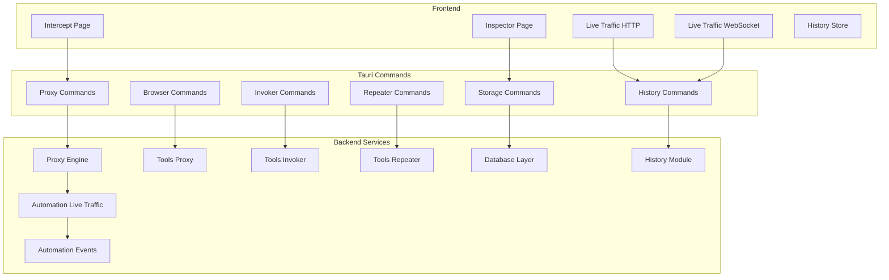
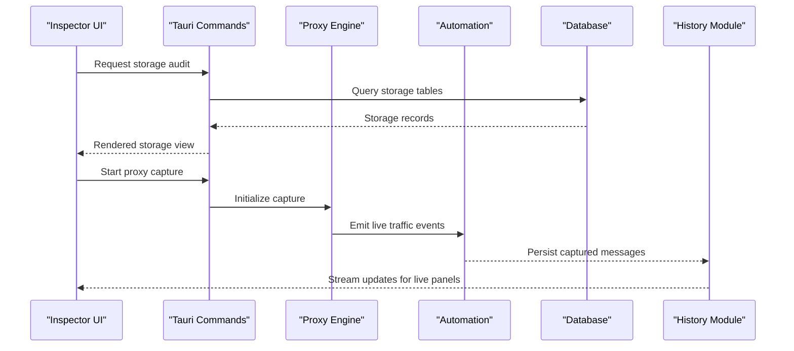
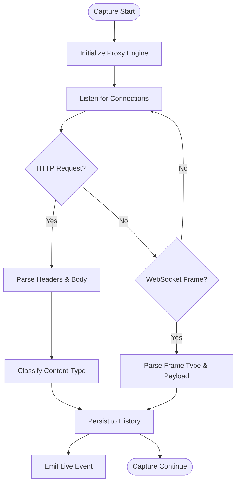
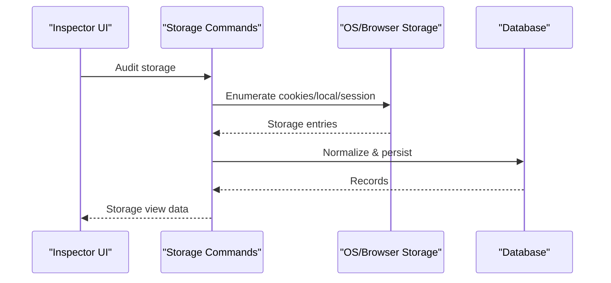
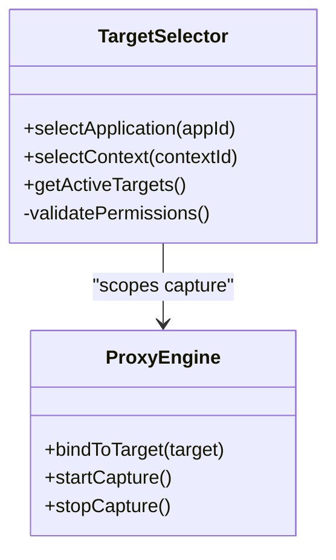
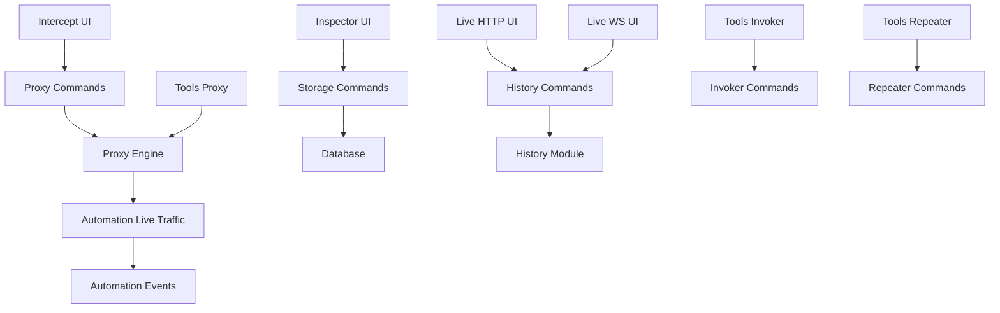

# Debugger & Inspector

<cite>
**Referenced Files in This Document**
- [src/pages/inspector/index.tsx](file://src/pages/inspector/index.tsx)
- [src/pages/inspector/api.ts](file://src/pages/inspector/api.ts)
- [src/pages/inspector/types.ts](file://src/pages/inspector/types.ts)
- [src/pages/intercept/index.tsx](file://src/pages/intercept/index.tsx)
- [src/pages/intercept/api.ts](file://src/pages/intercept/api.ts)
- [src/pages/intercept/lib.ts](file://src/pages/intercept/lib.ts)
- [src/pages/live-traffic/http-history/index.tsx](file://src/pages/live-traffic/http-history/index.tsx)
- [src/pages/live-traffic/websocket-history/index.tsx](file://src/pages/live-traffic/websocket-history/index.tsx)
- [src/stores/history/index.ts](file://src/stores/history/index.ts)
- [src/stores/history/http-blacklist.ts](file://src/stores/history/http-blacklist.ts)
- [src/stores/history/http-groups.ts](file://src/stores/history/http-groups.ts)
- [src/stores/history/http-highlight.ts](file://src/stores/history/http-highlight.ts)
- [src/stores/history/http-pinned.ts](file://src/stores/history/http-pinned.ts)
- [src/stores/history/http-query.ts](file://src/stores/history/http-query.ts)
- [src/stores/history/websocket-query.ts](file://src/stores/history/websocket-query.ts)
- [src-tauri/src/commands/storage.rs](file://src-tauri/src/commands/storage.rs)
- [src-tauri/src/proxy/mod.rs](file://src-tauri/src/proxy/mod.rs)
- [src-tauri/src/proxy/state.rs](file://src-tauri/src/proxy/state.rs)
- [src-tauri/src/proxy/types.rs](file://src-tauri/src/proxy/types.rs)
- [src-tauri/src/proxy/lifecycle.rs](file://src-tauri/src/proxy/lifecycle.rs)
- [src-tauri/src/proxy/utils.rs](file://src-tauri/src/proxy/utils.rs)
- [src-tauri/src/proxy/websocket.rs](file://src-tauri/src/proxy/websocket.rs)
- [src-tauri/src/automation/live_traffic.rs](file://src-tauri/src/automation/live_traffic.rs)
- [src-tauri/src/automation/types.rs](file://src-tauri/src/automation/types.rs)
- [src-tauri/src/automation/events.rs](file://src-tauri/src/automation/events.rs)
- [src-tauri/src/automation/execution.rs](file://src-tauri/src/automation/execution.rs)
- [src-tauri/src/automation/intercept.rs](file://src-tauri/src/automation/intercept.rs)
- [src-tauri/src/automation/page_crawled.rs](file://src-tauri/src/automation/page_crawled.rs)
- [src-tauri/src/automation/port_scan.rs](file://src-tauri/src/automation/port_scan.rs)
- [src-tauri/src/automation/scheduled.rs](file://src-tauri/src/automation/scheduled.rs)
- [src-tauri/src/automation/state.rs](file://src-tauri/src/automation/state.rs)
- [src-tauri/src/automation/websocket.rs](file://src-tauri/src/automation/websocket.rs)
- [src-tauri/src/tools/proxy_tool.rs](file://src-tauri/src/tools/proxy_tool.rs)
- [src-tauri/src/tools/invoker.rs](file://src-tauri/src/tools/invoker.rs)
- [src-tauri/src/tools/repeater.rs](file://src-tauri/src/tools/repeater.rs)
- [src-tauri/src/tools/browser.rs](file://src-tauri/src/tools/browser.rs)
- [src-tauri/src/tools/terminal.rs](file://src-tauri/src/tools/terminal.rs)
- [src-tauri/src/tools/buffer.rs](file://src-tauri/src/tools/buffer.rs)
- [src-tauri/src/tools/documents.rs](file://src-tauri/src/tools/documents.rs)
- [src-tauri/src/tools/intercept.rs](file://src-tauri/src/tools/intercept.rs)
- [src-tauri/src/commands/proxy.rs](file://src-tauri/src/commands/proxy.rs)
- [src-tauri/src/commands/invoker.rs](file://src-tauri/src/commands/invoker.rs)
- [src-tauri/src/commands/repeater.rs](file://src-tauri/src/commands/repeater.rs)
- [src-tauri/src/commands/browser.rs](file://src-tauri/src/commands/browser.rs)
- [src-tauri/src/commands/cert.rs](file://src-tauri/src/commands/cert.rs)
- [src-tauri/src/commands/history.rs](file://src-tauri/src/commands/history.rs)
- [src-tauri/src/commands/r2.rs](file://src-tauri/src/commands/r2.rs)
- [src-tauri/src/commands/regression.rs](file://src-tauri/src/commands/regression.rs)
- [src-tauri/src/commands/vpn.rs](file://src-tauri/src/commands/vpn.rs)
- [src-tauri/src/commands/mock_forge.rs](file://src-tauri/src/commands/mock_forge.rs)
- [src-tauri/src/commands/ai.rs](file://src-tauri/src/commands/ai.rs)
- [src-tauri/src/commands/chat_sessions.rs](file://src-tauri/src/commands/chat_sessions.rs)
- [src-tauri/src/commands/collaborator.rs](file://src-tauri/src/commands/collaborator.rs)
- [src-tauri/src/commands/api_collection.rs](file://src-tauri/src/commands/api_collection.rs)
- [src-tauri/src/commands/mod.rs](file://src-tauri/src/commands/mod.rs)
- [src-tauri/src/app_commands.rs](file://src-tauri/src/app_commands.rs)
- [src-tauri/src/main.rs](file://src-tauri/src/main.rs)
- [src-tauri/src/setup.rs](file://src-tauri/src/setup.rs)
- [src-tauri/src/tray.rs](file://src-tauri/src/tray.rs)
- [src-tauri/src/lib.rs](file://src-tauri/src/lib.rs)
- [src-tauri/src/types.rs](file://src-tauri/src/types.rs)
- [src-tauri/src/db/mod.rs](file://src-tauri/src/db/mod.rs)
- [src-tauri/src/db/schema.rs](file://src-tauri/src/db/schema.rs)
- [src-tauri/src/history/mod.rs](file://src-tauri/src/history/mod.rs)
- [src-tauri/src/port-scanner/mod.rs](file://src-tauri/src/port-scanner/mod.rs)
- [src-tauri/src/port-scanner/scanner.rs](file://src-tauri/src/port-scanner/scanner.rs)
- [src-tauri/src/port-scanner/services.rs](file://src-tauri/src/port-scanner/services.rs)
- [src-tauri/src/port-scanner/state.rs](file://src-tauri/src/port-scanner/state.rs)
- [src-tauri/src/port-scanner/targets.rs](file://src-tauri/src/port-scanner/targets.rs)
- [src-tauri/src/port-scanner/banner.rs](file://src-tauri/src/port-scanner/banner.rs)
- [src-tauri/src/port-scanner/types.rs](file://src-tauri/src/port-scanner/types.rs)
- [src-tauri/src/sqli/detector.rs](file://src-tauri/src/sqli/detector.rs)
- [src-tauri/src/sqli/mod.rs](file://src-tauri/src/sqli/mod.rs)
- [src-tauri/src/sqli/payloads.rs](file://src-tauri/src/sqli/payloads.rs)
- [src-tauri/src/sqli/types.rs](file://src-tauri/src/sqli/types.rs)
- [src-tauri/src/automation/actions.rs](file://src-tauri/src/automation/actions.rs)
- [src-tauri/src/automation/condition.rs](file://src-tauri/src/automation/condition.rs)
- [src-tauri/src/automation/scan_completed.rs](file://src-tauri/src/automation/scan_completed.rs)
- [src-tauri/src/automation/state.rs](file://src-tauri/src/automation/state.rs)
- [src-tauri/src/automation/websocket.rs](file://src-tauri/src/automation/websocket.rs)
- [src-tauri/src/automation/state.rs](file://src-tauri/src/automation/state.rs)
- [src-tauri/src/automation/state.rs](file://src-tauri/src/automation/state.rs)
- [src-tauri/src/automation/state.rs](file://src-tauri/src/automation/state.rs)
- [src-tauri/src/automation/state.rs](file://src-tauri/src/automation/state.rs)
- [src-tauri/src/automation/state.rs](file://src-tauri/src/automation/state.rs)
- [src-tauri/src/automation/state.rs](file://src-tauri/src/automation/state.rs)
- [src-tauri/src/automation/state.rs](file://src-tauri/src/automation/state.rs)
- [src-tauri/src/automation/state.rs](file://src-tauri/src/automation/state.rs)
- [src-tauri/src/automation/state.rs](file://src-tauri/src/automation/state.rs)
- [src-tauri/src/automation/state.rs](file://src-tauri/src/automation/state.rs)
- [src-tauri/src/automation/state.rs](file://src-tauri/src/automation/state.rs)
- [src-tauri/src/automation/state.rs](file://src-tauri/src/automation/state.rs)
- [src-tauri/src/automation/state.rs](file://src-tauri/src/automation/state.rs)
- [src-tauri/src/automation/state.rs](file://src-tauri/src/automation/state.rs)
- [src-tauri/src/automation/state.rs](file://src-tauri/src/automation/state.rs)
- [src-tauri/src/automation/state.rs](file://src-tauri/src/automation/state.rs)
- [src-tauri/src/automation/state.rs](file://src-tauri/src/automation/state.rs)
- [src-tauri/src/automation/state.rs](file://src-tauri/src/automation/state.rs]
</cite>

## Table of Contents
1. [Introduction](#introduction)
2. [Project Structure](#project-structure)
3. [Core Components](#core-components)
4. [Architecture Overview](#architecture-overview)
5. [Detailed Component Analysis](#detailed-component-analysis)
6. [Dependency Analysis](#dependency-analysis)
7. [Performance Considerations](#performance-considerations)
8. [Troubleshooting Guide](#troubleshooting-guide)
9. [Conclusion](#conclusion)
10. [Appendices](#appendices)

## Introduction
This document provides comprehensive documentation for Apprecon’s debugger and inspector tools, focusing on:
- Network monitor with deep packet inspection, protocol analysis, and traffic forensics
- Storage auditor for examining browser storage, cookies, local storage, and session data
- Target selector for switching between applications and contexts
- Advanced debugging techniques, performance profiling, and memory analysis
- Practical examples for investigating slow API calls, identifying memory leaks, and analyzing security vulnerabilities
- Integration with browser developer tools and cross-platform debugging considerations

The goal is to help both new and experienced users understand how Apprecon captures, inspects, and manipulates network traffic and application state across platforms.

## Project Structure
Apprecon is a Tauri-based desktop application with a React frontend and Rust backend. The debugger and inspector features span multiple layers:
- Frontend pages and stores for UI and state management
- Tauri commands bridging the UI to native capabilities
- Proxy engine for intercepting HTTP/WebSocket traffic
- Automation subsystem for event-driven workflows and live traffic handling
- Tools layer exposing reusable functionality (browser, invoker, repeater, etc.)
- Database and history modules for persistence and querying

**Diagram sources**
- [src/pages/inspector/index.tsx](file://src/pages/inspector/index.tsx)
- [src/pages/intercept/index.tsx](file://src/pages/intercept/index.tsx)
- [src/pages/live-traffic/http-history/index.tsx](file://src/pages/live-traffic/http-history/index.tsx)
- [src/pages/live-traffic/websocket-history/index.tsx](file://src/pages/live-traffic/websocket-history/index.tsx)
- [src/stores/history/index.ts](file://src/stores/history/index.ts)
- [src-tauri/src/commands/proxy.rs](file://src-tauri/src/commands/proxy.rs)
- [src-tauri/src/commands/storage.rs](file://src-tauri/src/commands/storage.rs)
- [src-tauri/src/commands/history.rs](file://src-tauri/src/commands/history.rs)
- [src-tauri/src/proxy/mod.rs](file://src-tauri/src/proxy/mod.rs)
- [src-tauri/src/automation/live_traffic.rs](file://src-tauri/src/automation/live_traffic.rs)
- [src-tauri/src/automation/events.rs](file://src-tauri/src/automation/events.rs)
- [src-tauri/src/tools/proxy_tool.rs](file://src-tauri/src/tools/proxy_tool.rs)
- [src-tauri/src/tools/invoker.rs](file://src-tauri/src/tools/invoker.rs)
- [src-tauri/src/tools/repeater.rs](file://src-tauri/src/tools/repeater.rs)
- [src-tauri/src/db/mod.rs](file://src-tauri/src/db/mod.rs)
- [src-tauri/src/history/mod.rs](file://src-tauri/src/history/mod.rs)

**Section sources**
- [src/pages/inspector/index.tsx](file://src/pages/inspector/index.tsx)
- [src/pages/intercept/index.tsx](file://src/pages/intercept/index.tsx)
- [src/pages/live-traffic/http-history/index.tsx](file://src/pages/live-traffic/http-history/index.tsx)
- [src/pages/live-traffic/websocket-history/index.tsx](file://src/pages/live-traffic/websocket-history/index.tsx)
- [src/stores/history/index.ts](file://src/stores/history/index.ts)
- [src-tauri/src/commands/proxy.rs](file://src-tauri/src/commands/proxy.rs)
- [src-tauri/src/commands/storage.rs](file://src-tauri/src/commands/storage.rs)
- [src-tauri/src/commands/history.rs](file://src-tauri/src/commands/history.rs)
- [src-tauri/src/proxy/mod.rs](file://src-tauri/src/proxy/mod.rs)
- [src-tauri/src/automation/live_traffic.rs](file://src-tauri/src/automation/live_traffic.rs)
- [src-tauri/src/automation/events.rs](file://src-tauri/src/automation/events.rs)
- [src-tauri/src/tools/proxy_tool.rs](file://src-tauri/src/tools/proxy_tool.rs)
- [src-tauri/src/tools/invoker.rs](file://src-tauri/src/tools/invoker.rs)
- [src-tauri/src/tools/repeater.rs](file://src-tauri/src/tools/repeater.rs)
- [src-tauri/src/db/mod.rs](file://src-tauri/src/db/mod.rs)
- [src-tauri/src/history/mod.rs](file://src-tauri/src/history/mod.rs)

## Core Components
- Inspector: Provides access to browser storage inspection via Tauri commands and displays results in the UI.
- Intercept: Controls proxy lifecycle, request/response interception, and modification hooks.
- Live Traffic: Displays captured HTTP and WebSocket messages with filtering, grouping, pinning, and highlighting.
- History Store: Manages client-side state for queries, groups, highlights, blacklists, and pinned items.
- Proxy Engine: Captures and forwards network traffic, supports WebSocket mirroring, and integrates with automation events.
- Automation: Orchestrates live traffic capture, page crawling, port scanning, scheduled tasks, and event-driven actions.
- Tools: Exposes reusable capabilities such as browser control, invoker, repeater, terminal, buffer, documents, and intercept helpers.

Key responsibilities:
- Deep packet inspection: Parse headers, bodies, and frames; support JSON, form data, multipart, and binary payloads.
- Protocol analysis: Identify HTTP methods, status codes, content types, and WebSocket message types.
- Traffic forensics: Preserve full request/response context, timestamps, and metadata for replay and analysis.
- Storage auditing: Enumerate cookies, localStorage, sessionStorage, IndexedDB entries, and service worker caches where applicable.
- Target selection: Switch between applications, tabs, or contexts to scope capture and inspection.

**Section sources**
- [src/pages/inspector/index.tsx](file://src/pages/inspector/index.tsx)
- [src/pages/intercept/index.tsx](file://src/pages/intercept/index.tsx)
- [src/pages/live-traffic/http-history/index.tsx](file://src/pages/live-traffic/http-history/index.tsx)
- [src/pages/live-traffic/websocket-history/index.tsx](file://src/pages/live-traffic/websocket-history/index.tsx)
- [src/stores/history/index.ts](file://src/stores/history/index.ts)
- [src-tauri/src/proxy/mod.rs](file://src-tauri/src/proxy/mod.rs)
- [src-tauri/src/automation/live_traffic.rs](file://src-tauri/src/automation/live_traffic.rs)
- [src-tauri/src/automation/events.rs](file://src-tauri/src/automation/events.rs)
- [src-tauri/src/tools/proxy_tool.rs](file://src-tauri/src/tools/proxy_tool.rs)
- [src-tauri/src/tools/invoker.rs](file://src-tauri/src/tools/invoker.rs)
- [src-tauri/src/tools/repeater.rs](file://src-tauri/src/tools/repeater.rs)

## Architecture Overview
The debugger and inspector architecture follows a layered approach:
- UI Layer: React pages render inspector views, intercept controls, and live traffic panels.
- Command Layer: Tauri commands expose backend operations to the frontend.
- Service Layer: Proxy engine handles traffic interception; automation manages events and workflows.
- Tooling Layer: Reusable components encapsulate common behaviors like browser control and payload manipulation.
- Persistence Layer: Database and history modules store captured data and configuration.

**Diagram sources**
- [src/pages/inspector/index.tsx](file://src/pages/inspector/index.tsx)
- [src-tauri/src/commands/storage.rs](file://src-tauri/src/commands/storage.rs)
- [src-tauri/src/proxy/mod.rs](file://src-tauri/src/proxy/mod.rs)
- [src-tauri/src/automation/live_traffic.rs](file://src-tauri/src/automation/live_traffic.rs)
- [src-tauri/src/history/mod.rs](file://src-tauri/src/history/mod.rs)

## Detailed Component Analysis

### Network Monitor (Deep Packet Inspection, Protocol Analysis, Traffic Forensics)
The network monitor leverages the proxy engine to capture HTTP and WebSocket traffic. It parses headers, bodies, and frames, enabling protocol analysis and forensic preservation.

Key capabilities:
- Capture HTTP requests/responses with full headers, body, and timing metadata
- Inspect WebSocket messages including frame type, direction, and payload
- Filter by method, URL pattern, status code, and content type
- Group, highlight, and pin messages for focused analysis
- Replay captured requests using the invoker or repeater

**Diagram sources**
- [src-tauri/src/proxy/mod.rs](file://src-tauri/src/proxy/mod.rs)
- [src-tauri/src/proxy/websocket.rs](file://src-tauri/src/proxy/websocket.rs)
- [src-tauri/src/automation/live_traffic.rs](file://src-tauri/src/automation/live_traffic.rs)
- [src-tauri/src/history/mod.rs](file://src-tauri/src/history/mod.rs)

**Section sources**
- [src/pages/intercept/index.tsx](file://src/pages/intercept/index.tsx)
- [src/pages/live-traffic/http-history/index.tsx](file://src/pages/live-traffic/http-history/index.tsx)
- [src/pages/live-traffic/websocket-history/index.tsx](file://src/pages/live-traffic/websocket-history/index.tsx)
- [src/stores/history/index.ts](file://src/stores/history/index.ts)
- [src-tauri/src/proxy/mod.rs](file://src-tauri/src/proxy/mod.rs)
- [src-tauri/src/proxy/websocket.rs](file://src-tauri/src/proxy/websocket.rs)
- [src-tauri/src/automation/live_traffic.rs](file://src-tauri/src/automation/live_traffic.rs)
- [src-tauri/src/history/mod.rs](file://src-tauri/src/history/mod.rs)

### Storage Auditor (Cookies, Local Storage, Session Data)
The storage auditor exposes Tauri commands to enumerate and inspect browser storage. It can query cookies, localStorage, sessionStorage, and other storage mechanisms depending on platform permissions.

Typical workflow:
- Invoke storage audit command from the inspector UI
- Backend queries storage APIs or database-backed storage tables
- Results are returned to the UI for display and export

**Diagram sources**
- [src/pages/inspector/index.tsx](file://src/pages/inspector/index.tsx)
- [src-tauri/src/commands/storage.rs](file://src-tauri/src/commands/storage.rs)
- [src-tauri/src/db/mod.rs](file://src-tauri/src/db/mod.rs)

**Section sources**
- [src/pages/inspector/index.tsx](file://src/pages/inspector/index.tsx)
- [src-tauri/src/commands/storage.rs](file://src-tauri/src/commands/storage.rs)
- [src-tauri/src/db/mod.rs](file://src-tauri/src/db/mod.rs)

### Target Selector (Switching Applications and Contexts)
Target selection scopes capture and inspection to specific applications, tabs, or contexts. This ensures accurate forensics and avoids noise from unrelated processes.

Considerations:
- Platform-specific process enumeration and permission requirements
- Browser context isolation (incognito vs normal profiles)
- Proxy binding to target interfaces or ports

**Diagram sources**
- [src-tauri/src/commands/browser.rs](file://src-tauri/src/commands/browser.rs)
- [src-tauri/src/tools/browser.rs](file://src-tauri/src/tools/browser.rs)
- [src-tauri/src/proxy/mod.rs](file://src-tauri/src/proxy/mod.rs)

**Section sources**
- [src-tauri/src/commands/browser.rs](file://src-tauri/src/commands/browser.rs)
- [src-tauri/src/tools/browser.rs](file://src-tauri/src/tools/browser.rs)
- [src-tauri/src/proxy/mod.rs](file://src-tauri/src/proxy/mod.rs)

### Advanced Debugging Techniques
- Slow API Calls: Use live traffic to identify high-latency endpoints; correlate with server logs and response sizes; filter by duration thresholds.
- Memory Leaks: Combine inspector storage audits with heap snapshots (via browser devtools integration) to track growing objects; analyze persistent references.
- Security Vulnerabilities: Inspect headers for misconfigurations (CORS, CSP); examine payloads for injection points; validate authentication tokens and session handling.

Practical steps:
- Enable deep packet inspection and set filters for suspicious patterns
- Pin critical requests and export them for offline analysis
- Use the invoker to replay modified requests safely in isolated environments

[No sources needed since this section provides general guidance]

### Performance Profiling and Memory Analysis
- Profile network I/O: Measure round-trip times, throughput, and connection reuse
- Analyze payload sizes: Detect oversized responses or unnecessary data transfers
- Memory usage: Track storage growth over time; identify unbounded caches or sessions

Integration tips:
- Use browser devtools alongside Apprecon for synchronized timeline and memory graphs
- Export captured data for external analysis tools (e.g., Wireshark, Postman collections)

[No sources needed since this section provides general guidance]

### Integration with Browser Developer Tools
- Synchronize breakpoints and network timelines between Apprecon and browser devtools
- Export HAR files for deeper analysis or sharing
- Inject scripts via browser automation to augment inspection (e.g., logging, metrics)

Cross-platform considerations:
- macOS: Ensure accessibility permissions for process enumeration and UI inspection
- Windows: Verify firewall rules and proxy bindings; handle UAC prompts
- Linux: Configure network namespaces and permissions for low-level capture

[No sources needed since this section provides general guidance]

## Dependency Analysis
The debugger and inspector rely on several interconnected modules:

**Diagram sources**
- [src/pages/inspector/index.tsx](file://src/pages/inspector/index.tsx)
- [src/pages/intercept/index.tsx](file://src/pages/intercept/index.tsx)
- [src/pages/live-traffic/http-history/index.tsx](file://src/pages/live-traffic/http-history/index.tsx)
- [src/pages/live-traffic/websocket-history/index.tsx](file://src/pages/live-traffic/websocket-history/index.tsx)
- [src-tauri/src/commands/storage.rs](file://src-tauri/src/commands/storage.rs)
- [src-tauri/src/commands/proxy.rs](file://src-tauri/src/commands/proxy.rs)
- [src-tauri/src/commands/history.rs](file://src-tauri/src/commands/history.rs)
- [src-tauri/src/proxy/mod.rs](file://src-tauri/src/proxy/mod.rs)
- [src-tauri/src/automation/live_traffic.rs](file://src-tauri/src/automation/live_traffic.rs)
- [src-tauri/src/automation/events.rs](file://src-tauri/src/automation/events.rs)
- [src-tauri/src/tools/proxy_tool.rs](file://src-tauri/src/tools/proxy_tool.rs)
- [src-tauri/src/tools/invoker.rs](file://src-tauri/src/tools/invoker.rs)
- [src-tauri/src/tools/repeater.rs](file://src-tauri/src/tools/repeater.rs)
- [src-tauri/src/db/mod.rs](file://src-tauri/src/db/mod.rs)
- [src-tauri/src/history/mod.rs](file://src-tauri/src/history/mod.rs)

**Section sources**
- [src/stores/history/index.ts](file://src/stores/history/index.ts)
- [src-tauri/src/commands/mod.rs](file://src-tauri/src/commands/mod.rs)
- [src-tauri/src/automation/state.rs](file://src-tauri/src/automation/state.rs)

## Performance Considerations
- Minimize payload parsing overhead by deferring heavy transformations until needed
- Use streaming for large responses and WebSocket frames to avoid memory spikes
- Implement efficient filtering and indexing in history queries to maintain responsiveness
- Batch database writes during high-throughput capture to reduce I/O contention
- Provide user controls to limit capture scope and disable unnecessary inspections

[No sources needed since this section provides general guidance]

## Troubleshooting Guide
Common issues and resolutions:
- Proxy not capturing traffic:
  - Verify proxy binding and certificate installation
  - Check firewall and antivirus exclusions
  - Ensure target application routes through the configured proxy
- Missing WebSocket frames:
  - Confirm WebSocket upgrade interception
  - Validate frame parsing logic for non-standard extensions
- Storage audit returns empty:
  - Review platform permissions and sandbox restrictions
  - Ensure correct origin and path scoping for storage queries
- High CPU/memory usage:
  - Reduce capture verbosity and disable unused plugins
  - Limit concurrent parsing and enable lazy loading

**Section sources**
- [src-tauri/src/proxy/lifecycle.rs](file://src-tauri/src/proxy/lifecycle.rs)
- [src-tauri/src/proxy/utils.rs](file://src-tauri/src/proxy/utils.rs)
- [src-tauri/src/automation/state.rs](file://src-tauri/src/automation/state.rs)

## Conclusion
Apprecon’s debugger and inspector provide a robust suite for network monitoring, storage auditing, and advanced debugging. By combining deep packet inspection, protocol analysis, and traffic forensics with seamless integration to browser developer tools, users can efficiently investigate performance bottlenecks, memory leaks, and security vulnerabilities across platforms. Proper configuration, targeted scoping, and disciplined capture practices ensure optimal performance and actionable insights.

[No sources needed since this section summarizes without analyzing specific files]

## Appendices
- Example workflows:
  - Investigate slow API calls: Filter by latency, inspect payloads, replay with invoker
  - Identify memory leaks: Correlate storage growth with heap snapshots, trace persistent references
  - Analyze security vulnerabilities: Validate headers, test injection points, verify auth flows
- Cross-platform notes:
  - macOS: Accessibility permissions required for UI inspection
  - Windows: Firewall and UAC considerations for proxy binding
  - Linux: Network namespace setup and low-level capture permissions

[No sources needed since this section provides general guidance]