# Debugging Workflows & Techniques

<cite>
**Referenced Files in This Document**
- [README.md](file://README.md)
- [index.tsx](file://src/pages/inspector/index.tsx)
- [api.ts](file://src/pages/inspector/api.ts)
- [types.ts](file://src/pages/inspector/types.ts)
- [constants.ts](file://src/pages/inspector/constants.ts)
- [index.tsx](file://src/pages/live-traffic/index.tsx)
- [http-history/index.tsx](file://src/pages/live-traffic/http-history/index.tsx)
- [websocket-history/index.tsx](file://src/pages/live-traffic/websocket-history/index.tsx)
- [index.tsx](file://src/pages/intercept/index.tsx)
- [lib.ts](file://src/pages/intercept/lib.ts)
- [index.tsx](file://src/pages/invoker/index.tsx)
- [index.tsx](file://src/pages/listener/index.tsx)
- [index.tsx](file://src/pages/repeater/index.tsx)
- [index.tsx](file://src/pages/mock-forge/index.tsx)
- [index.tsx](file://src/pages/regression/index.tsx)
- [index.tsx](file://src/pages/port-scanner/index.tsx)
- [mod.rs](file://src-tauri/src/proxy/mod.rs)
- [lifecycle.rs](file://src-tauri/src/proxy/lifecycle.rs)
- [state.rs](file://src-tauri/src/proxy/state.rs)
- [types.rs](file://src-tauri/src/proxy/types.rs)
- [automation/mod.rs](file://src-tauri/src/automation/mod.rs)
- [live_traffic.rs](file://src-tauri/src/automation/live_traffic.rs)
- [commands/mod.rs](file://src-tauri/src/commands/mod.rs)
- [commands/proxy.rs](file://src-tauri/src/commands/proxy.rs)
- [commands/history.rs](file://src-tauri/src/commands/history.rs)
- [commands/storage.rs](file://src-tauri/src/commands/storage.rs)
- [app_settings_store.ts](file://src/stores/app-settings-store.ts)
- [browser-session-store.ts](file://src/stores/browser-session-store.ts)
- [debugger.ts](file://src/stores/debugger.ts)
- [use-proxy-start.ts](file://src/hooks/use-proxy-start.ts)
</cite>

## Table of Contents
1. [Introduction](#introduction)
2. [Project Structure](#project-structure)
3. [Core Components](#core-components)
4. [Architecture Overview](#architecture-overview)
5. [Detailed Component Analysis](#detailed-component-analysis)
6. [Dependency Analysis](#dependency-analysis)
7. [Performance Considerations](#performance-considerations)
8. [Troubleshooting Guide](#troubleshooting-guide)
9. [Conclusion](#conclusion)
10. [Appendices](#appendices)

## Introduction
This document provides advanced debugging workflows and techniques using Apprecon’s inspector tools. It focuses on systematic approaches to investigate complex applications, including memory leak detection, performance profiling, security vulnerability identification, and comprehensive analysis by combining network monitoring with storage inspection. It also covers strategies for single-page applications (SPAs), microservices architectures, and real-time applications, along with practical examples for production issue investigation, analyzing user-reported bugs, and optimizing performance. Best practices, common pitfalls, integration with development workflows, time-based analysis, cross-component event correlation, and creating reproducible scenarios are included.

## Project Structure
Apprecon is a desktop application built with Tauri and React. The frontend exposes inspector, live traffic, intercept, invoker, listener, repeater, mock forge, regression, and port scanner pages. The backend (Rust/Tauri) implements the proxy, automation engine, commands, and persistence. Inspector and live traffic modules provide core inspection capabilities; intercept and invoker enable request/response manipulation and testing; automation orchestrates capture and analysis flows.

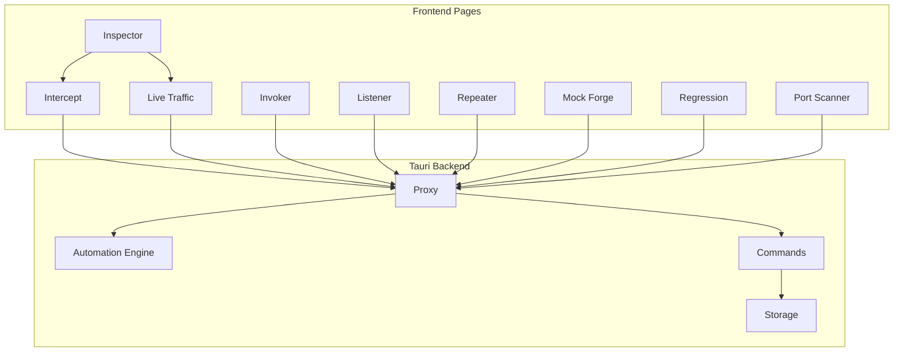

**Diagram sources**
- [index.tsx](file://src/pages/inspector/index.tsx)
- [index.tsx](file://src/pages/live-traffic/index.tsx)
- [index.tsx](file://src/pages/intercept/index.tsx)
- [index.tsx](file://src/pages/invoker/index.tsx)
- [index.tsx](file://src/pages/listener/index.tsx)
- [index.tsx](file://src/pages/repeater/index.tsx)
- [index.tsx](file://src/pages/mock-forge/index.tsx)
- [index.tsx](file://src/pages/regression/index.tsx)
- [index.tsx](file://src/pages/port-scanner/index.tsx)
- [mod.rs](file://src-tauri/src/proxy/mod.rs)
- [automation/mod.rs](file://src-tauri/src/automation/mod.rs)
- [commands/mod.rs](file://src-tauri/src/commands/mod.rs)

**Section sources**
- [README.md](file://README.md)
- [index.tsx](file://src/pages/inspector/index.tsx)
- [index.tsx](file://src/pages/live-traffic/index.tsx)
- [index.tsx](file://src/pages/intercept/index.tsx)
- [index.tsx](file://src/pages/invoker/index.tsx)
- [index.tsx](file://src/pages/listener/index.tsx)
- [index.tsx](file://src/pages/repeater/index.tsx)
- [index.tsx](file://src/pages/mock-forge/index.tsx)
- [index.tsx](file://src/pages/regression/index.tsx)
- [index.tsx](file://src/pages/port-scanner/index.tsx)
- [mod.rs](file://src-tauri/src/proxy/mod.rs)
- [automation/mod.rs](file://src-tauri/src/automation/mod.rs)
- [commands/mod.rs](file://src-tauri/src/commands/mod.rs)

## Core Components
- Inspector: Provides structured views of captured data, filters, timelines, and export options. It integrates with live traffic and storage APIs to correlate events across components.
- Live Traffic: Captures HTTP and WebSocket traffic, supports filtering, grouping, and timeline visualization.
- Intercept: Enables request/response modification, conditional interception, and replay.
- Invoker: Constructs and sends requests programmatically, useful for reproducing issues and validating fixes.
- Listener: Exposes endpoints for receiving events or payloads from external systems.
- Repeater: Replays captured requests with parameter variations.
- Mock Forge: Generates mock responses to simulate services or error conditions.
- Regression: Automates test runs and compares results over time.
- Port Scanner: Discovers open ports and services to map attack surface.

Key backend services:
- Proxy: Intercepts and forwards network traffic, applies rules, and records metadata.
- Automation Engine: Orchestrates capture sessions, correlates events, and triggers analysis.
- Commands: Exposes Tauri commands for frontend interactions with proxy, history, and storage.

**Section sources**
- [index.tsx](file://src/pages/inspector/index.tsx)
- [api.ts](file://src/pages/inspector/api.ts)
- [types.ts](file://src/pages/inspector/types.ts)
- [constants.ts](file://src/pages/inspector/constants.ts)
- [index.tsx](file://src/pages/live-traffic/index.tsx)
- [http-history/index.tsx](file://src/pages/live-traffic/http-history/index.tsx)
- [websocket-history/index.tsx](file://src/pages/live-traffic/websocket-history/index.tsx)
- [index.tsx](file://src/pages/intercept/index.tsx)
- [lib.ts](file://src/pages/intercept/lib.ts)
- [index.tsx](file://src/pages/invoker/index.tsx)
- [index.tsx](file://src/pages/listener/index.tsx)
- [index.tsx](file://src/pages/repeater/index.tsx)
- [index.tsx](file://src/pages/mock-forge/index.tsx)
- [index.tsx](file://src/pages/regression/index.tsx)
- [index.tsx](file://src/pages/port-scanner/index.tsx)
- [mod.rs](file://src-tauri/src/proxy/mod.rs)
- [lifecycle.rs](file://src-tauri/src/proxy/lifecycle.rs)
- [state.rs](file://src-tauri/src/proxy/state.rs)
- [types.rs](file://src-tauri/src/proxy/types.rs)
- [automation/mod.rs](file://src-tauri/src/automation/mod.rs)
- [live_traffic.rs](file://src-tauri/src/automation/live_traffic.rs)
- [commands/mod.rs](file://src-tauri/src/commands/mod.rs)
- [commands/proxy.rs](file://src-tauri/src/commands/proxy.rs)
- [commands/history.rs](file://src-tauri/src/commands/history.rs)
- [commands/storage.rs](file://src-tauri/src/commands/storage.rs)

## Architecture Overview
The system follows a layered architecture:
- Frontend UI layers expose specialized inspector and tooling pages.
- Tauri commands bridge UI actions to backend services.
- Proxy captures and manipulates traffic, feeding into automation and storage.
- Storage persists history, settings, and session state for correlation and reproducibility.

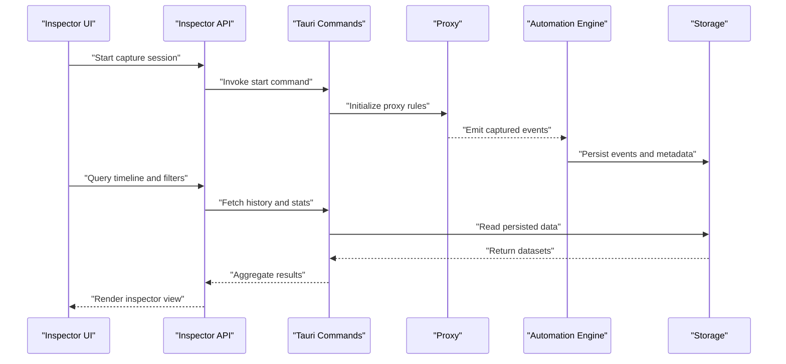

**Diagram sources**
- [index.tsx](file://src/pages/inspector/index.tsx)
- [api.ts](file://src/pages/inspector/api.ts)
- [commands/mod.rs](file://src-tauri/src/commands/mod.rs)
- [mod.rs](file://src-tauri/src/proxy/mod.rs)
- [automation/mod.rs](file://src-tauri/src/automation/mod.rs)
- [commands/history.rs](file://src-tauri/src/commands/history.rs)
- [commands/storage.rs](file://src-tauri/src/commands/storage.rs)

## Detailed Component Analysis

### Inspector Module
The inspector aggregates captured data, provides filtering, timeline navigation, and export capabilities. It coordinates with live traffic and storage to correlate events across components.

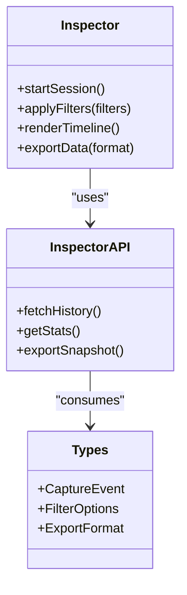

**Diagram sources**
- [index.tsx](file://src/pages/inspector/index.tsx)
- [api.ts](file://src/pages/inspector/api.ts)
- [types.ts](file://src/pages/inspector/types.ts)

**Section sources**
- [index.tsx](file://src/pages/inspector/index.tsx)
- [api.ts](file://src/pages/inspector/api.ts)
- [types.ts](file://src/pages/inspector/types.ts)
- [constants.ts](file://src/pages/inspector/constants.ts)

### Live Traffic Module
Captures HTTP and WebSocket traffic, supports filtering, grouping, and timeline visualization. Integrates with proxy and automation to ensure consistent timestamps and correlation IDs.

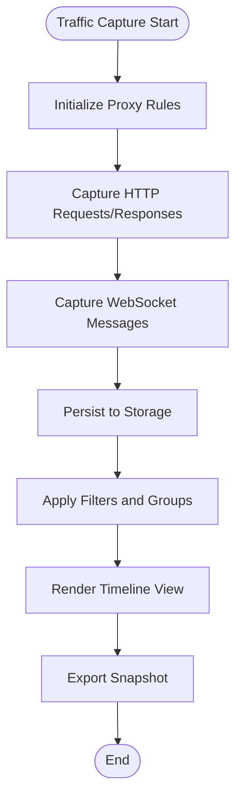

**Diagram sources**
- [index.tsx](file://src/pages/live-traffic/index.tsx)
- [http-history/index.tsx](file://src/pages/live-traffic/http-history/index.tsx)
- [websocket-history/index.tsx](file://src/pages/live-traffic/websocket-history/index.tsx)
- [mod.rs](file://src-tauri/src/proxy/mod.rs)
- [live_traffic.rs](file://src-tauri/src/automation/live_traffic.rs)

**Section sources**
- [index.tsx](file://src/pages/live-traffic/index.tsx)
- [http-history/index.tsx](file://src/pages/live-traffic/http-history/index.tsx)
- [websocket-history/index.tsx](file://src/pages/live-traffic/websocket-history/index.tsx)

### Intercept Module
Enables request/response modification, conditional interception, and replay. Useful for simulating errors, patching behavior, and validating fixes without changing server code.

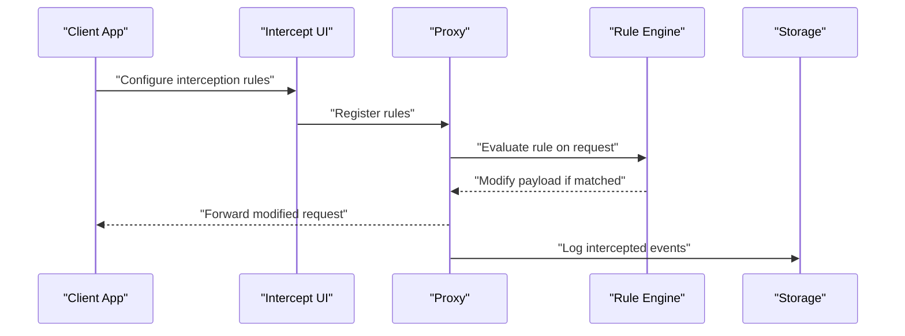

**Diagram sources**
- [index.tsx](file://src/pages/intercept/index.tsx)
- [lib.ts](file://src/pages/intercept/lib.ts)
- [mod.rs](file://src-tauri/src/proxy/mod.rs)

**Section sources**
- [index.tsx](file://src/pages/intercept/index.tsx)
- [lib.ts](file://src/pages/intercept/lib.ts)

### Invoker Module
Constructs and sends requests programmatically, supporting parameterization and batch execution. Ideal for reproducing issues and validating fixes.

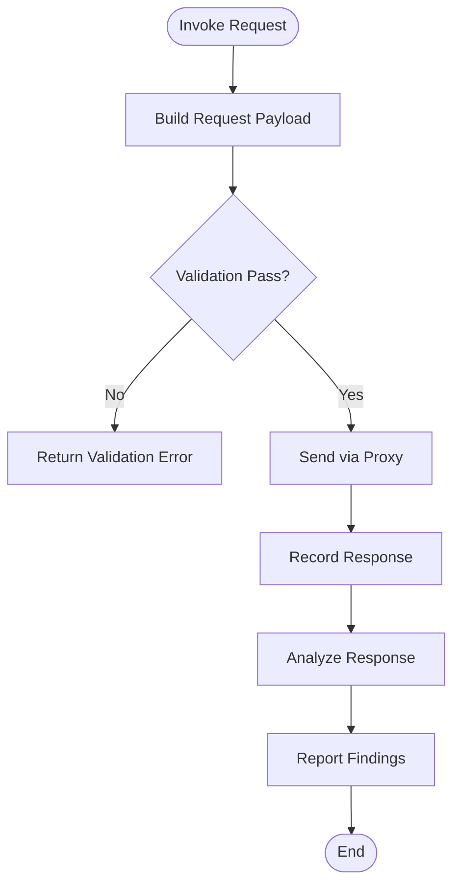

**Diagram sources**
- [index.tsx](file://src/pages/invoker/index.tsx)
- [mod.rs](file://src-tauri/src/proxy/mod.rs)

**Section sources**
- [index.tsx](file://src/pages/invoker/index.tsx)

### Listener Module
Exposes endpoints for receiving events or payloads from external systems. Useful for integrating with CI/CD pipelines or external analyzers.

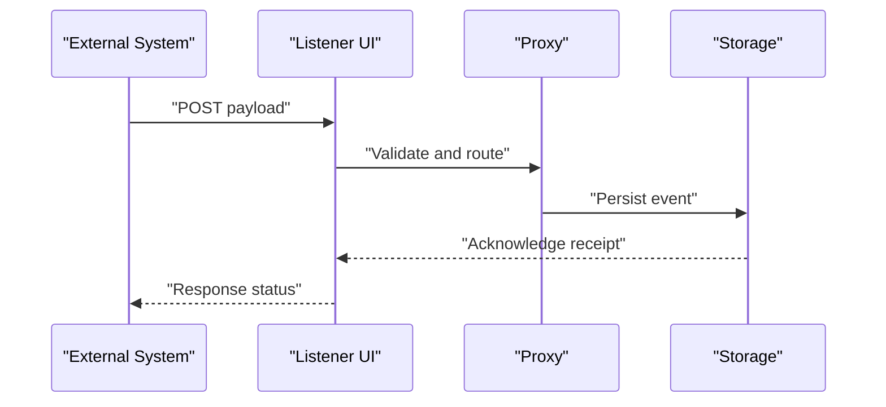

**Diagram sources**
- [index.tsx](file://src/pages/listener/index.tsx)
- [mod.rs](file://src-tauri/src/proxy/mod.rs)

**Section sources**
- [index.tsx](file://src/pages/listener/index.tsx)

### Repeater Module
Replays captured requests with parameter variations. Supports fuzzing and edge-case exploration.

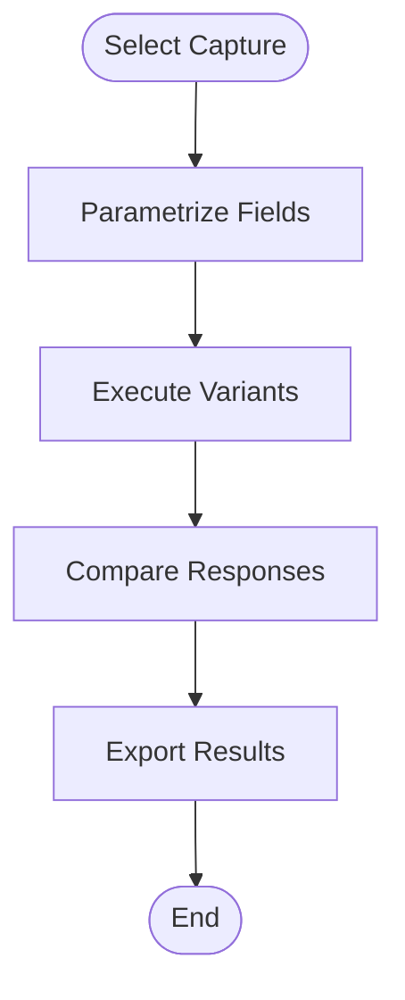

**Diagram sources**
- [index.tsx](file://src/pages/repeater/index.tsx)

**Section sources**
- [index.tsx](file://src/pages/repeater/index.tsx)

### Mock Forge Module
Generates mock responses to simulate services or error conditions. Helps isolate frontend issues and validate error handling paths.

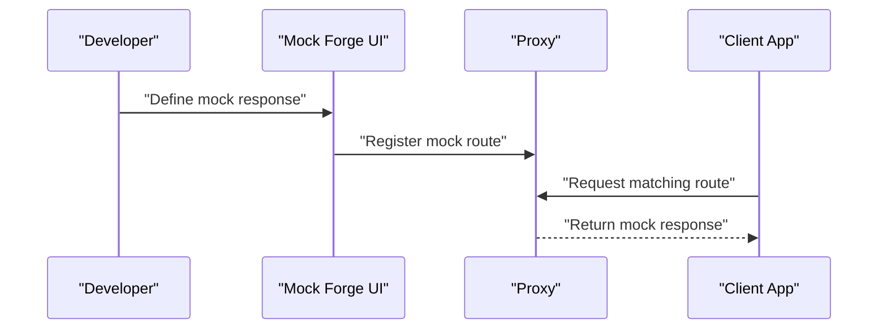

**Diagram sources**
- [index.tsx](file://src/pages/mock-forge/index.tsx)
- [mod.rs](file://src-tauri/src/proxy/mod.rs)

**Section sources**
- [index.tsx](file://src/pages/mock-forge/index.tsx)

### Regression Module
Automates test runs and compares results over time. Useful for detecting regressions in performance or behavior.

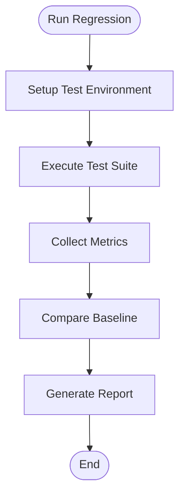

**Diagram sources**
- [index.tsx](file://src/pages/regression/index.tsx)

**Section sources**
- [index.tsx](file://src/pages/regression/index.tsx)

### Port Scanner Module
Discovers open ports and services to map attack surface. Integrates with proxy to avoid interfering with live traffic.

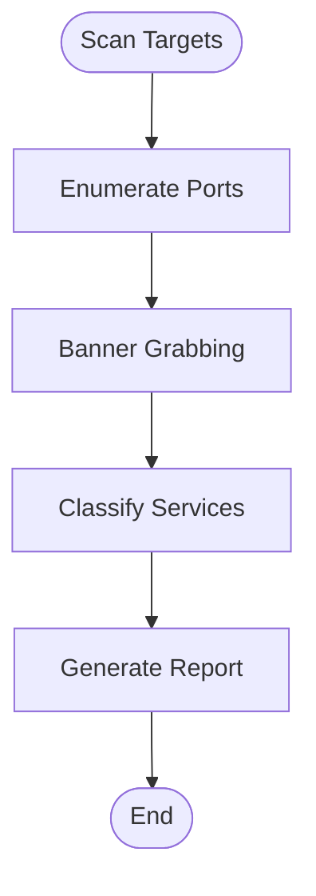

**Diagram sources**
- [index.tsx](file://src/pages/port-scanner/index.tsx)

**Section sources**
- [index.tsx](file://src/pages/port-scanner/index.tsx)

## Dependency Analysis
The inspector depends on live traffic, storage, and automation to provide correlated views. The proxy is central to capturing and manipulating traffic, while commands bridge frontend actions to backend services.

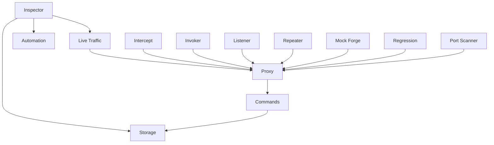

**Diagram sources**
- [index.tsx](file://src/pages/inspector/index.tsx)
- [index.tsx](file://src/pages/live-traffic/index.tsx)
- [index.tsx](file://src/pages/intercept/index.tsx)
- [index.tsx](file://src/pages/invoker/index.tsx)
- [index.tsx](file://src/pages/listener/index.tsx)
- [index.tsx](file://src/pages/repeater/index.tsx)
- [index.tsx](file://src/pages/mock-forge/index.tsx)
- [index.tsx](file://src/pages/regression/index.tsx)
- [index.tsx](file://src/pages/port-scanner/index.tsx)
- [mod.rs](file://src-tauri/src/proxy/mod.rs)
- [commands/mod.rs](file://src-tauri/src/commands/mod.rs)

**Section sources**
- [index.tsx](file://src/pages/inspector/index.tsx)
- [index.tsx](file://src/pages/live-traffic/index.tsx)
- [index.tsx](file://src/pages/intercept/index.tsx)
- [index.tsx](file://src/pages/invoker/index.tsx)
- [index.tsx](file://src/pages/listener/index.tsx)
- [index.tsx](file://src/pages/repeater/index.tsx)
- [index.tsx](file://src/pages/mock-forge/index.tsx)
- [index.tsx](file://src/pages/regression/index.tsx)
- [index.tsx](file://src/pages/port-scanner/index.tsx)
- [mod.rs](file://src-tauri/src/proxy/mod.rs)
- [commands/mod.rs](file://src-tauri/src/commands/mod.rs)

## Performance Considerations
- Use targeted filters in live traffic to reduce memory usage during long sessions.
- Export snapshots selectively to avoid large in-memory datasets.
- Leverage automation to batch operations and minimize overhead.
- Monitor proxy state and lifecycle to prevent resource leaks.
- Correlate timestamps across components to identify bottlenecks.

[No sources needed since this section provides general guidance]

## Troubleshooting Guide
Common issues and resolutions:
- Proxy not starting: Verify configuration and permissions; check lifecycle logs.
- Missing traffic: Ensure target application routes through the proxy; validate certificate installation.
- Incomplete storage: Check storage commands and persistence layer; verify disk space.
- Correlation failures: Confirm timestamp synchronization and correlation IDs across components.

Best practices:
- Create reproducible scenarios using invoker and repeater.
- Combine network monitoring with storage inspection for holistic analysis.
- Use mock forge to isolate frontend issues and validate error paths.
- Integrate regression tests to catch performance regressions early.

**Section sources**
- [lifecycle.rs](file://src-tauri/src/proxy/lifecycle.rs)
- [state.rs](file://src-tauri/src/proxy/state.rs)
- [commands/proxy.rs](file://src-tauri/src/commands/proxy.rs)
- [commands/history.rs](file://src-tauri/src/commands/history.rs)
- [commands/storage.rs](file://src-tauri/src/commands/storage.rs)
- [app_settings_store.ts](file://src/stores/app-settings-store.ts)
- [browser-session-store.ts](file://src/stores/browser-session-store.ts)
- [debugger.ts](file://src/stores/debugger.ts)
- [use-proxy-start.ts](file://src/hooks/use-proxy-start.ts)

## Conclusion
Apprecon’s inspector tools provide a comprehensive framework for advanced debugging workflows. By combining network monitoring, storage inspection, and automation, developers can systematically investigate complex applications, detect memory leaks, profile performance, and identify security vulnerabilities. Following best practices and leveraging the provided modules enables efficient troubleshooting, reproducible scenarios, and continuous improvement in application quality.

[No sources needed since this section summarizes without analyzing specific files]

## Appendices
- Time-based analysis: Use timeline views to correlate events across components and identify sequences leading to issues.
- Cross-component correlation: Leverage correlation IDs and timestamps to trace requests through proxy, automation, and storage.
- Reproducible scenarios: Use invoker and repeater to construct deterministic test cases based on captured traffic.
- Integration with development workflows: Incorporate regression and mock forge into CI/CD pipelines for automated validation.

[No sources needed since this section provides general guidance]