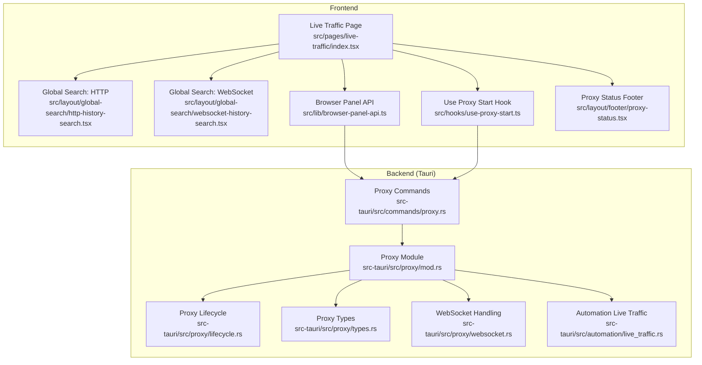
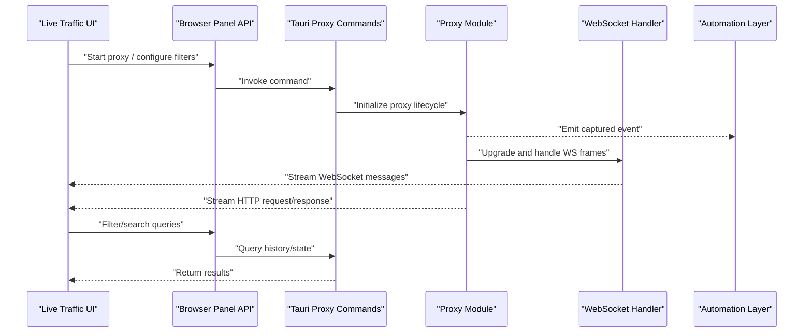
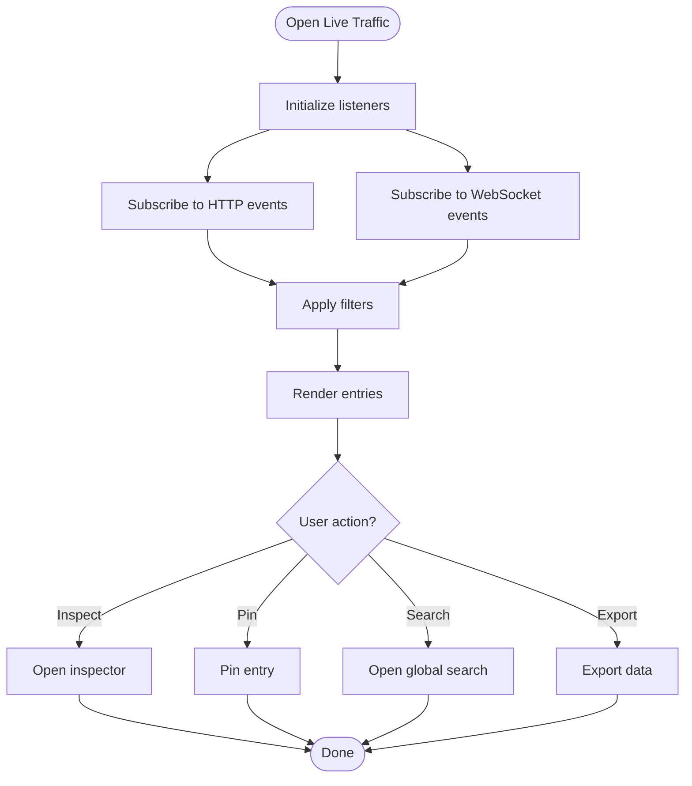
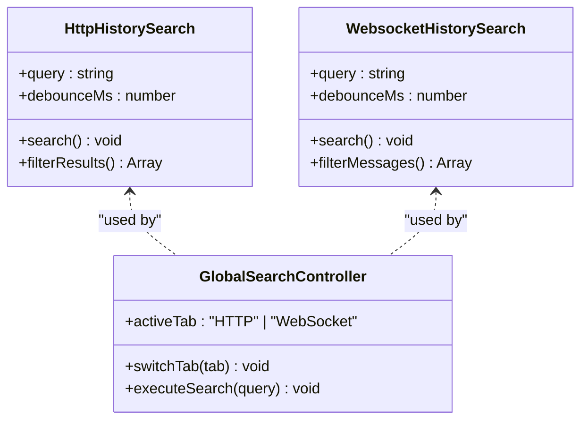
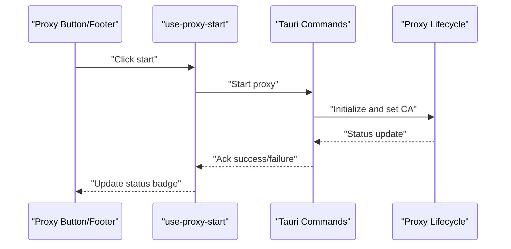
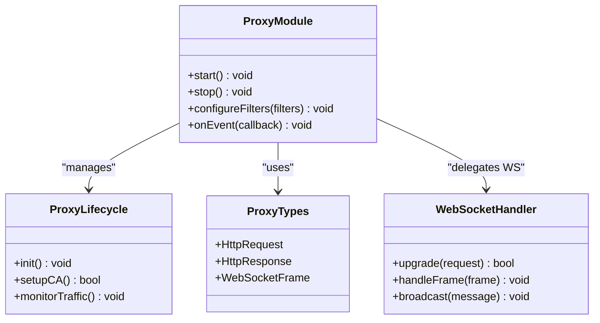
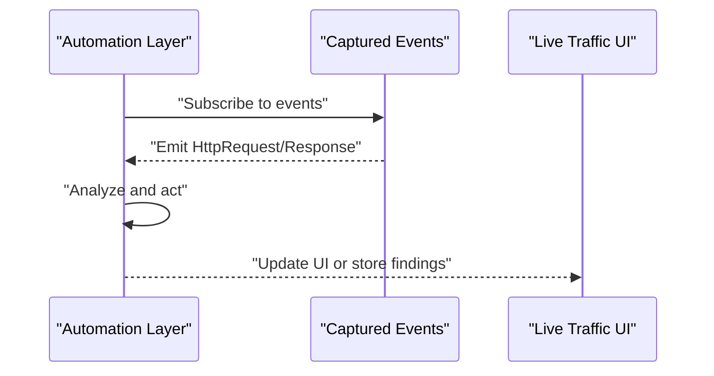
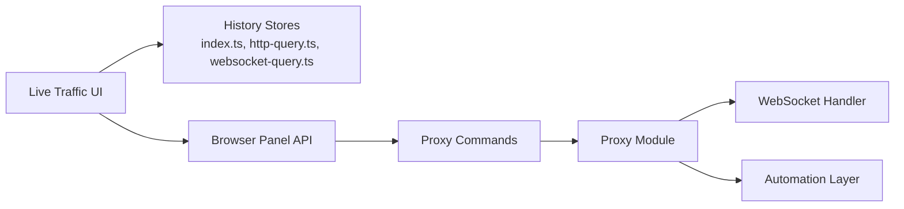

# Network Monitor

<cite>
**Referenced Files in This Document**
- [index.tsx](file://src/pages/live-traffic/index.tsx)
- [http-history-search.tsx](file://src/layout/global-search/http-history-search.tsx)
- [websocket-history-search.tsx](file://src/layout/global-search/websocket-history-search.tsx)
- [captured.ts](file://src/triggers/live-traffic/captured.ts)
- [ui.ts](file://src/triggers/live-traffic/ui.ts)
- [targets.ts](file://src/triggers/live-traffic/targets.ts)
- [index.ts](file://src/stores/history/index.ts)
- [http-query.ts](file://src/stores/history/http-query.ts)
- [websocket-query.ts](file://src/stores/history/websocket-query.ts)
- [mod.rs](file://src-tauri/src/proxy/mod.rs)
- [lifecycle.rs](file://src-tauri/src/proxy/lifecycle.rs)
- [types.rs](file://src-tauri/src/proxy/types.rs)
- [websocket.rs](file://src-tauri/src/proxy/websocket.rs)
- [automation_live_traffic.rs](file://src-tauri/src/automation/live_traffic.rs)
- [commands_proxy.rs](file://src-tauri/src/commands/proxy.rs)
- [browser-panel-api.ts](file://src/lib/browser-panel-api.ts)
- [use-proxy-start.ts](file://src/hooks/use-proxy-start.ts)
- [proxy-status.tsx](file://src/layout/footer/proxy-status.tsx)
</cite>

## Table of Contents
1. [Introduction](#introduction)
2. [Project Structure](#project-structure)
3. [Core Components](#core-components)
4. [Architecture Overview](#architecture-overview)
5. [Detailed Component Analysis](#detailed-component-analysis)
6. [Dependency Analysis](#dependency-analysis)
7. [Performance Considerations](#performance-considerations)
8. [Troubleshooting Guide](#troubleshooting-guide)
9. [Conclusion](#conclusion)
10. [Appendices](#appendices)

## Introduction
This document explains Apprecon’s Network Monitor component, focusing on real-time network traffic inspection for HTTP/HTTPS requests and responses, WebSocket message monitoring, and protocol-specific debugging. It covers packet capture capabilities, filtering and search, analyzing slow API calls, identifying failed requests, and debugging CORS issues. It also documents advanced features such as request interception, response modification, performance metrics collection, integration with browser developer tools, and cross-platform considerations.

## Project Structure
The Network Monitor spans both the frontend (React/TypeScript) and backend (Tauri/Rust). The frontend provides UI for live traffic viewing, history search, and WebSocket inspection. The backend proxy captures and processes network traffic, exposes commands to control it, and integrates with automation flows.

**Diagram sources**
- [index.tsx](file://src/pages/live-traffic/index.tsx)
- [http-history-search.tsx](file://src/layout/global-search/http-history-search.tsx)
- [websocket-history-search.tsx](file://src/layout/global-search/websocket-history-search.tsx)
- [browser-panel-api.ts](file://src/lib/browser-panel-api.ts)
- [use-proxy-start.ts](file://src/hooks/use-proxy-start.ts)
- [proxy-status.tsx](file://src/layout/footer/proxy-status.tsx)
- [mod.rs](file://src-tauri/src/proxy/mod.rs)
- [lifecycle.rs](file://src-tauri/src/proxy/lifecycle.rs)
- [types.rs](file://src-tauri/src/proxy/types.rs)
- [websocket.rs](file://src-tauri/src/proxy/websocket.rs)
- [automation_live_traffic.rs](file://src-tauri/src/automation/live_traffic.rs)
- [commands_proxy.rs](file://src-tauri/src/commands/proxy.rs)

**Section sources**
- [index.tsx](file://src/pages/live-traffic/index.tsx)
- [mod.rs](file://src-tauri/src/proxy/mod.rs)

## Core Components
- Live Traffic Page: Presents captured HTTP and WebSocket events in real time, supports filtering, grouping, and pinning.
- Global Search: Unified search across HTTP history and WebSocket messages.
- Proxy Control: Starts/stops the proxy, manages CA certificate installation, and shows status.
- Browser Panel API: Bridges frontend actions to Tauri commands for proxy and traffic operations.
- Backend Proxy: Captures HTTP/HTTPS traffic, handles WebSocket upgrades, and emits structured events.
- Automation Integration: Exposes live traffic triggers for automated workflows.

Key responsibilities:
- Capture and normalize network events into a consistent schema.
- Provide efficient querying and filtering over large histories.
- Enable interception and modification hooks via triggers and commands.
- Surface performance metrics and error diagnostics.

**Section sources**
- [index.tsx](file://src/pages/live-traffic/index.tsx)
- [http-history-search.tsx](file://src/layout/global-search/http-history-search.tsx)
- [websocket-history-search.tsx](file://src/layout/global-search/websocket-history-search.tsx)
- [browser-panel-api.ts](file://src/lib/browser-panel-api.ts)
- [use-proxy-start.ts](file://src/hooks/use-proxy-start.ts)
- [proxy-status.tsx](file://src/layout/footer/proxy-status.tsx)
- [mod.rs](file://src-tauri/src/proxy/mod.rs)
- [lifecycle.rs](file://src-tauri/src/proxy/lifecycle.rs)
- [types.rs](file://src-tauri/src/proxy/types.rs)
- [websocket.rs](file://src-tauri/src/proxy/websocket.rs)
- [automation_live_traffic.rs](file://src-tauri/src/automation/live_traffic.rs)
- [commands_proxy.rs](file://src-tauri/src/commands/proxy.rs)

## Architecture Overview
The Network Monitor follows a layered architecture:
- Frontend UI layer renders live traffic and search interfaces.
- Bridge layer translates UI actions into Tauri commands.
- Backend proxy layer captures and processes traffic, exposing state and events.
- Automation layer subscribes to traffic events for scripted workflows.

**Diagram sources**
- [browser-panel-api.ts](file://src/lib/browser-panel-api.ts)
- [commands_proxy.rs](file://src-tauri/src/commands/proxy.rs)
- [mod.rs](file://src-tauri/src/proxy/mod.rs)
- [lifecycle.rs](file://src-tauri/src/proxy/lifecycle.rs)
- [websocket.rs](file://src-tauri/src/proxy/websocket.rs)
- [automation_live_traffic.rs](file://src-tauri/src/automation/live_traffic.rs)

## Detailed Component Analysis

### Live Traffic Page
- Displays real-time HTTP and WebSocket events.
- Supports filtering by method, status code, domain, and payload content.
- Provides pinning, grouping, and export capabilities.
- Integrates with global search for quick navigation.

**Diagram sources**
- [index.tsx](file://src/pages/live-traffic/index.tsx)
- [http-history-search.tsx](file://src/layout/global-search/http-history-search.tsx)
- [websocket-history-search.tsx](file://src/layout/global-search/websocket-history-search.tsx)

**Section sources**
- [index.tsx](file://src/pages/live-traffic/index.tsx)

### Global Search (HTTP and WebSocket)
- Unified search across HTTP history and WebSocket messages.
- Debounced input for performance.
- Filters by URL, headers, body, status, and message content.

**Diagram sources**
- [http-history-search.tsx](file://src/layout/global-search/http-history-search.tsx)
- [websocket-history-search.tsx](file://src/layout/global-search/websocket-history-search.tsx)

**Section sources**
- [http-history-search.tsx](file://src/layout/global-search/http-history-search.tsx)
- [websocket-history-search.tsx](file://src/layout/global-search/websocket-history-search.tsx)

### Proxy Control and Status
- Start/stop proxy, manage CA certificate, and display status.
- Integrates with system settings for cross-platform proxy configuration.

**Diagram sources**
- [use-proxy-start.ts](file://src/hooks/use-proxy-start.ts)
- [proxy-status.tsx](file://src/layout/footer/proxy-status.tsx)
- [commands_proxy.rs](file://src-tauri/src/commands/proxy.rs)
- [lifecycle.rs](file://src-tauri/src/proxy/lifecycle.rs)

**Section sources**
- [use-proxy-start.ts](file://src/hooks/use-proxy-start.ts)
- [proxy-status.tsx](file://src/layout/footer/proxy-status.tsx)

### Backend Proxy and WebSocket Handling
- Captures HTTP/HTTPS requests/responses and normalizes them.
- Handles WebSocket upgrade and frame streaming.
- Emits structured events consumed by frontend and automation.

**Diagram sources**
- [mod.rs](file://src-tauri/src/proxy/mod.rs)
- [lifecycle.rs](file://src-tauri/src/proxy/lifecycle.rs)
- [types.rs](file://src-tauri/src/proxy/types.rs)
- [websocket.rs](file://src-tauri/src/proxy/websocket.rs)

**Section sources**
- [mod.rs](file://src-tauri/src/proxy/mod.rs)
- [lifecycle.rs](file://src-tauri/src/proxy/lifecycle.rs)
- [types.rs](file://src-tauri/src/proxy/types.rs)
- [websocket.rs](file://src-tauri/src/proxy/websocket.rs)

### Automation Integration
- Subscribes to captured traffic events to trigger automated workflows.
- Enables programmatic analysis and response manipulation.

**Diagram sources**
- [automation_live_traffic.rs](file://src-tauri/src/automation/live_traffic.rs)
- [captured.ts](file://src/triggers/live-traffic/captured.ts)

**Section sources**
- [automation_live_traffic.rs](file://src-tauri/src/automation/live_traffic.rs)
- [captured.ts](file://src/triggers/live-traffic/captured.ts)

## Dependency Analysis
The Network Monitor depends on:
- Frontend stores for query and filter state.
- Tauri commands for proxy control and data access.
- Proxy module for traffic capture and normalization.
- Automation layer for event-driven workflows.

**Diagram sources**
- [index.ts](file://src/stores/history/index.ts)
- [http-query.ts](file://src/stores/history/http-query.ts)
- [websocket-query.ts](file://src/stores/history/websocket-query.ts)
- [browser-panel-api.ts](file://src/lib/browser-panel-api.ts)
- [commands_proxy.rs](file://src-tauri/src/commands/proxy.rs)
- [mod.rs](file://src-tauri/src/proxy/mod.rs)
- [websocket.rs](file://src-tauri/src/proxy/websocket.rs)
- [automation_live_traffic.rs](file://src-tauri/src/automation/live_traffic.rs)

**Section sources**
- [index.ts](file://src/stores/history/index.ts)
- [http-query.ts](file://src/stores/history/http-query.ts)
- [websocket-query.ts](file://src/stores/history/websocket-query.ts)
- [browser-panel-api.ts](file://src/lib/browser-panel-api.ts)
- [commands_proxy.rs](file://src-tauri/src/commands/proxy.rs)
- [mod.rs](file://src-tauri/src/proxy/mod.rs)
- [websocket.rs](file://src-tauri/src/proxy/websocket.rs)
- [automation_live_traffic.rs](file://src-tauri/src/automation/live_traffic.rs)

## Performance Considerations
- Use debounced search to reduce re-renders during typing.
- Apply server-side or backend filtering where possible to minimize payload size.
- Limit captured fields for high-volume endpoints; enable sampling if needed.
- Avoid heavy parsing in the UI thread; offload to workers when feasible.
- Cache frequently accessed metadata (e.g., domains, methods) for faster filtering.

[No sources needed since this section provides general guidance]

## Troubleshooting Guide
Common networking problems and how to investigate:
- Slow API calls:
  - Sort by duration in the live traffic view.
  - Inspect timing breakdowns between DNS, TLS handshake, and server processing.
  - Check for large payloads or repeated retries.
- Failed requests:
  - Filter by non-2xx status codes.
  - Review error responses and headers for clues (e.g., rate limiting, auth failures).
  - Validate CORS preflight behavior and error messages.
- CORS issues:
  - Ensure Access-Control-Allow-Origin matches the origin.
  - Verify credentials handling and preflight responses.
  - Confirm that the proxy is not altering headers unexpectedly.
- Security headers:
  - Inspect CSP, HSTS, X-Frame-Options, and Content-Security-Policy directives.
  - Identify missing or misconfigured headers impacting security posture.
- Interception and modification:
  - Use request interception rules to block or alter payloads.
  - Apply response modification for testing edge cases safely.
- WebSocket debugging:
  - Monitor frame types and payloads.
  - Validate handshake headers and ensure proper upgrade flow.

**Section sources**
- [index.tsx](file://src/pages/live-traffic/index.tsx)
- [http-history-search.tsx](file://src/layout/global-search/http-history-search.tsx)
- [websocket-history-search.tsx](file://src/layout/global-search/websocket-history-search.tsx)
- [mod.rs](file://src-tauri/src/proxy/mod.rs)
- [websocket.rs](file://src-tauri/src/proxy/websocket.rs)

## Conclusion
Apprecon’s Network Monitor provides robust real-time inspection of HTTP/HTTPS and WebSocket traffic with powerful filtering, search, and automation integrations. By leveraging its interception and modification capabilities, developers can diagnose performance bottlenecks, resolve CORS and security header issues, and streamline debugging workflows across platforms.

[No sources needed since this section summarizes without analyzing specific files]

## Appendices

### Investigating Common Networking Problems
- Slow API calls:
  - Use sorting and filtering to isolate long-running requests.
  - Compare client-side vs server-side timings.
- Failed requests:
  - Focus on error status codes and response bodies.
  - Check authentication tokens and authorization headers.
- CORS debugging:
  - Validate preflight requests and allowed origins/methods.
  - Ensure cookies and credentials are handled correctly.

[No sources needed since this section provides general guidance]

### Analyzing Security Headers
- Review CSP, HSTS, X-Content-Type-Options, and Referrer-Policy.
- Detect weak configurations and suggest improvements.

[No sources needed since this section provides general guidance]

### Optimizing Network Performance
- Reduce payload sizes and enable compression.
- Implement caching strategies and conditional requests.
- Minimize redundant requests and batch operations.

[No sources needed since this section provides general guidance]

### Integration with Browser Developer Tools
- Mirror key insights from browser devtools within Apprecon.
- Cross-reference network logs and console errors.
- Use unified search to correlate events across tools.

[No sources needed since this section provides general guidance]

### Cross-Platform Considerations
- Ensure CA certificate installation works on Windows, macOS, and Linux.
- Handle platform-specific proxy settings and firewall prompts.
- Validate WebSocket behavior across different environments.

[No sources needed since this section provides general guidance]