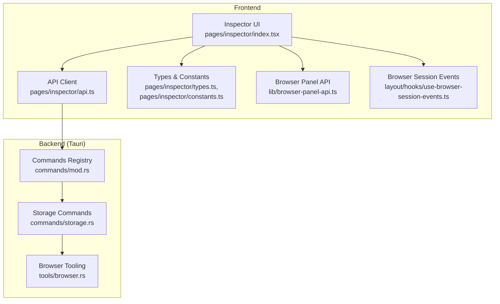
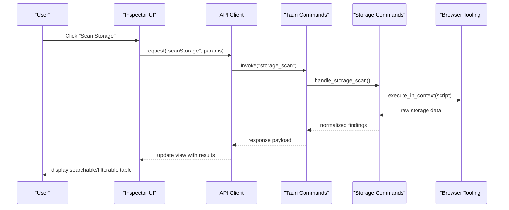
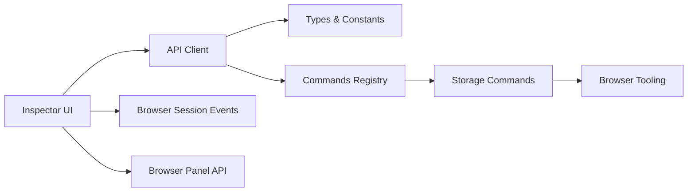

# Storage Auditor

<cite>
**Referenced Files in This Document**
- [storage.rs](file://src-tauri/src/commands/storage.rs)
- [browser_panel_api.ts](file://src/lib/browser-panel-api.ts)
- [index.tsx](file://src/pages/inspector/index.tsx)
- [constants.ts](file://src/pages/inspector/constants.ts)
- [api.ts](file://src/pages/inspector/api.ts)
- [types.ts](file://src/pages/inspector/types.ts)
- [use-browser-session-events.ts](file://src/layout/hooks/use-browser-session-events.ts)
- [browser.ts](file://src-tauri/src/tools/browser.rs)
- [mod.rs](file://src-tauri/src/commands/mod.rs)
</cite>

## Table of Contents
1. [Introduction](#introduction)
2. [Project Structure](#project-structure)
3. [Core Components](#core-components)
4. [Architecture Overview](#architecture-overview)
5. [Detailed Component Analysis](#detailed-component-analysis)
6. [Dependency Analysis](#dependency-analysis)
7. [Performance Considerations](#performance-considerations)
8. [Troubleshooting Guide](#troubleshooting-guide)
9. [Conclusion](#conclusion)
10. [Appendices](#appendices)

## Introduction
This document explains Apprecon’s Storage Auditor tool, which inspects and analyzes browser storage mechanisms within the embedded Chromium-based browser context. It covers how to examine localStorage, sessionStorage, cookies, IndexedDB, and Web SQL databases; visualize stored data; search and filter results; export findings; and perform security auditing such as identifying sensitive data exposure, analyzing cookie security settings, and detecting potential XSS risks in stored values. It also provides practical guidance for debugging storage issues, migrating data between environments, optimizing storage usage, and handling cross-origin storage access patterns and privacy considerations when inspecting third-party storage.

## Project Structure
The Storage Auditor spans both the Tauri backend (Rust) and the frontend UI (TypeScript/React). The backend exposes commands to read and analyze storage from the active browser context, while the frontend orchestrates inspection workflows, displays results, and provides search/filter/export capabilities.

**Diagram sources**
- [index.tsx](file://src/pages/inspector/index.tsx)
- [api.ts](file://src/pages/inspector/api.ts)
- [types.ts](file://src/pages/inspector/types.ts)
- [constants.ts](file://src/pages/inspector/constants.ts)
- [browser_panel_api.ts](file://src/lib/browser-panel-api.ts)
- [use-browser-session-events.ts](file://src/layout/hooks/use-browser-session-events.ts)
- [mod.rs](file://src-tauri/src/commands/mod.rs)
- [storage.rs](file://src-tauri/src/commands/storage.rs)
- [browser.rs](file://src-tauri/src/tools/browser.rs)

**Section sources**
- [index.tsx](file://src/pages/inspector/index.tsx)
- [api.ts](file://src/pages/inspector/api.ts)
- [types.ts](file://src/pages/inspector/types.ts)
- [constants.ts](file://src/pages/inspector/constants.ts)
- [browser_panel_api.ts](file://src/lib/browser-panel-api.ts)
- [use-browser-session-events.ts](file://src/layout/hooks/use-browser-session-events.ts)
- [mod.rs](file://src-tauri/src/commands/mod.rs)
- [storage.rs](file://src-tauri/src/commands/storage.rs)
- [browser.rs](file://src-tauri/src/tools/browser.rs)

## Core Components
- Inspector UI: Presents tabs or panels for different storage types, supports searching, filtering, and exporting results.
- API Client: Encapsulates calls to Tauri commands for reading and analyzing storage.
- Backend Commands: Rust functions exposed via Tauri that interact with the browser context to enumerate and inspect storage.
- Browser Tooling: Utilities to operate on the active browser page/context (e.g., executing scripts, accessing APIs).
- Type Definitions and Constants: Shared schemas for storage entries, cookie attributes, and UI state.

Key responsibilities:
- Enumerate keys/values for localStorage/sessionStorage.
- List and parse cookies with security attributes.
- Inspect IndexedDB databases, object stores, and cursors.
- Read Web SQL databases (if present) and list tables/rows.
- Aggregate findings into a unified view for analysis and export.

**Section sources**
- [index.tsx](file://src/pages/inspector/index.tsx)
- [api.ts](file://src/pages/inspector/api.ts)
- [types.ts](file://src/pages/inspector/types.ts)
- [constants.ts](file://src/pages/inspector/constants.ts)
- [storage.rs](file://src-tauri/src/commands/storage.rs)
- [browser.rs](file://src-tauri/src/tools/browser.rs)

## Architecture Overview
The Storage Auditor follows a client-server pattern over Tauri IPC:
- The UI triggers actions (e.g., “Scan Storage”).
- The API client invokes a Tauri command.
- The backend uses browser tooling to execute storage introspection in the target context.
- Results are returned to the UI for visualization, filtering, and export.

**Diagram sources**
- [index.tsx](file://src/pages/inspector/index.tsx)
- [api.ts](file://src/pages/inspector/api.ts)
- [storage.rs](file://src-tauri/src/commands/storage.rs)
- [browser.rs](file://src-tauri/src/tools/browser.rs)

## Detailed Component Analysis

### Inspector UI (pages/inspector/index.tsx)
- Responsibilities:
  - Render storage type tabs (localStorage, sessionStorage, cookies, IndexedDB, Web SQL).
  - Provide search input and filters (by key, value pattern, domain, flags).
  - Display results in a table with expandable details.
  - Trigger scans and refreshes based on browser session events.
  - Export results to CSV/JSON.
- UX features:
  - Debounced search to reduce re-renders.
  - Column sorting and pagination for large datasets.
  - Visual indicators for sensitive data matches and cookie flags.

**Section sources**
- [index.tsx](file://src/pages/inspector/index.tsx)

### API Client (pages/inspector/api.ts)
- Responsibilities:
  - Wrap Tauri invocations for storage operations (scan, fetch specific DB/table, export).
  - Normalize responses into consistent structures for the UI.
  - Handle errors and propagate user-friendly messages.
- Integration points:
  - Calls commands registered in the backend registry.
  - Uses shared types for request/response payloads.

**Section sources**
- [api.ts](file://src/pages/inspector/api.ts)
- [types.ts](file://src/pages/inspector/types.ts)

### Types and Constants (pages/inspector/types.ts, pages/inspector/constants.ts)
- Responsibilities:
  - Define schemas for storage entries, cookie attributes, IndexedDB metadata, and Web SQL schema.
  - Provide constants for supported storage types, default filters, and export formats.
- Benefits:
  - Ensures consistency across UI and backend contracts.
  - Enables robust validation and typing.

**Section sources**
- [types.ts](file://src/pages/inspector/types.ts)
- [constants.ts](file://src/pages/inspector/constants.ts)

### Browser Session Events (layout/hooks/use-browser-session-events.ts)
- Responsibilities:
  - Listen for navigation and page lifecycle events to trigger storage scans automatically.
  - Sync UI state with current tab/context.
- Impact:
  - Keeps storage views up-to-date without manual refresh.

**Section sources**
- [use-browser-session-events.ts](file://src/layout/hooks/use-browser-session-events.ts)

### Backend Commands Registry (src-tauri/src/commands/mod.rs)
- Responsibilities:
  - Register Tauri commands including storage-related endpoints.
  - Route requests to appropriate handlers.

**Section sources**
- [mod.rs](file://src-tauri/src/commands/mod.rs)

### Storage Commands (src-tauri/src/commands/storage.rs)
- Responsibilities:
  - Implement scan routines for each storage mechanism.
  - Parse and normalize results into a unified format.
  - Apply security checks (e.g., flag sensitive keys, evaluate cookie flags).
  - Support targeted queries (e.g., by database name, table name).
- Security auditing:
  - Detect high-risk patterns in stored values (tokens, secrets).
  - Flag insecure cookies (missing Secure/HttpOnly/SameSite).
  - Identify potential XSS vectors in stored HTML/JS strings.

**Section sources**
- [storage.rs](file://src-tauri/src/commands/storage.rs)

### Browser Tooling (src-tauri/src/tools/browser.rs)
- Responsibilities:
  - Execute JavaScript in the active page context safely.
  - Access browser APIs (localStorage, sessionStorage, cookies, IndexedDB, Web SQL) through controlled scripts.
  - Return structured data back to the command layer.

**Section sources**
- [browser.rs](file://src-tauri/src/tools/browser.rs)

### Browser Panel API (lib/browser-panel-api.ts)
- Responsibilities:
  - Bridge between UI components and Tauri commands.
  - Manage permissions and context scoping for storage access.

**Section sources**
- [browser_panel_api.ts](file://src/lib/browser-panel-api.ts)

## Dependency Analysis
The Storage Auditor has clear separation between UI and backend logic, connected via Tauri IPC. The UI depends on the API client and shared types; the backend commands depend on browser tooling to interact with the live context.

**Diagram sources**
- [index.tsx](file://src/pages/inspector/index.tsx)
- [api.ts](file://src/pages/inspector/api.ts)
- [types.ts](file://src/pages/inspector/types.ts)
- [constants.ts](file://src/pages/inspector/constants.ts)
- [mod.rs](file://src-tauri/src/commands/mod.rs)
- [storage.rs](file://src-tauri/src/commands/storage.rs)
- [browser.rs](file://src-tauri/src/tools/browser.rs)
- [use-browser-session-events.ts](file://src/layout/hooks/use-browser-session-events.ts)
- [browser_panel_api.ts](file://src/lib/browser-panel-api.ts)

**Section sources**
- [index.tsx](file://src/pages/inspector/index.tsx)
- [api.ts](file://src/pages/inspector/api.ts)
- [types.ts](file://src/pages/inspector/types.ts)
- [constants.ts](file://src/pages/inspector/constants.ts)
- [mod.rs](file://src-tauri/src/commands/mod.rs)
- [storage.rs](file://src-tauri/src/commands/storage.rs)
- [browser.rs](file://src-tauri/src/tools/browser.rs)
- [use-browser-session-events.ts](file://src/layout/hooks/use-browser-session-events.ts)
- [browser_panel_api.ts](file://src/lib/browser-panel-api.ts)

## Performance Considerations
- Large storage sets:
  - Use pagination and virtualization in the UI to avoid rendering overhead.
  - Implement server-side filtering where possible (backend query parameters).
- IndexedDB/Web SQL:
  - Avoid loading entire tables; use cursor-based pagination and limit row counts.
- Search performance:
  - Debounce search inputs and leverage efficient string matching algorithms.
- Cross-origin constraints:
  - Minimize repeated attempts to access restricted origins; cache failures to avoid redundant calls.
- Export size:
  - Offer incremental exports and compression options for large datasets.

[No sources needed since this section provides general guidance]

## Troubleshooting Guide
Common issues and resolutions:
- Empty or missing storage data:
  - Ensure the correct tab/context is active and the page has initialized storage.
  - Check for cross-origin restrictions preventing access.
- IndexedDB not accessible:
  - Some sites sandbox IndexedDB; verify origin policies and permissions.
- Web SQL deprecation:
  - Web SQL is deprecated; some browsers may not support it. Expect limited availability.
- Cookie visibility:
  - Cookies set via HttpOnly cannot be read by scripts; rely on backend cookie enumeration if available.
- Export failures:
  - Validate output size limits and file system permissions.

**Section sources**
- [storage.rs](file://src-tauri/src/commands/storage.rs)
- [browser.rs](file://src-tauri/src/tools/browser.rs)
- [api.ts](file://src/pages/inspector/api.ts)

## Conclusion
Apprecon’s Storage Auditor provides a comprehensive, secure, and user-friendly way to inspect browser storage. By combining a responsive UI with robust backend commands and browser tooling, it enables effective debugging, security auditing, and migration workflows. Adhering to best practices around cross-origin access, privacy, and performance ensures reliable operation across diverse web applications.

[No sources needed since this section summarizes without analyzing specific files]

## Appendices

### Practical Examples

- Debugging storage-related issues:
  - Use the Inspector UI to filter by key/value patterns and review timestamps or sizes.
  - For IndexedDB, open specific databases and inspect object store schemas and sample records.
  - For cookies, check flags like Secure, HttpOnly, SameSite, and Domain/Path scope.

- Migrating data between environments:
  - Export localStorage/sessionStorage and IndexedDB snapshots using the export feature.
  - Import or replay migrations in the target environment via the Invoker or Repeater tools.

- Optimizing storage usage:
  - Identify oversized entries and compress or archive them.
  - Remove stale keys and unused IndexedDB records periodically.

- Cross-origin storage access and privacy:
  - Respect origin boundaries; do not attempt to bypass security controls.
  - When inspecting third-party storage, ensure you have explicit authorization and comply with privacy policies.

[No sources needed since this section provides general guidance]