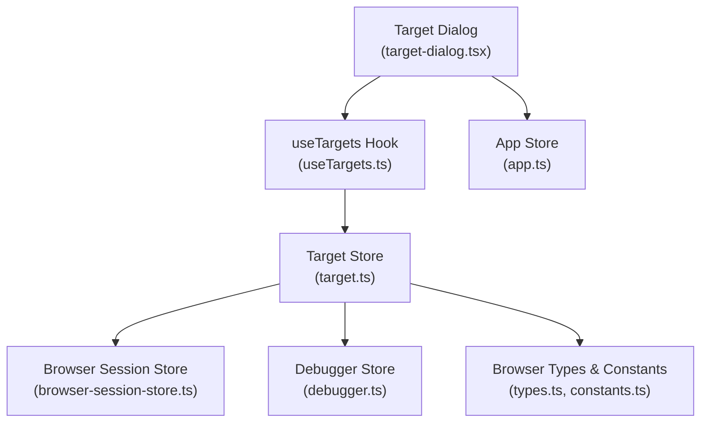
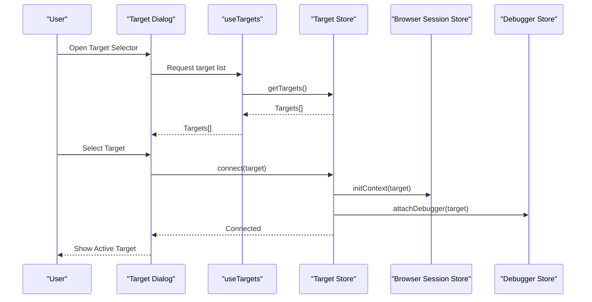
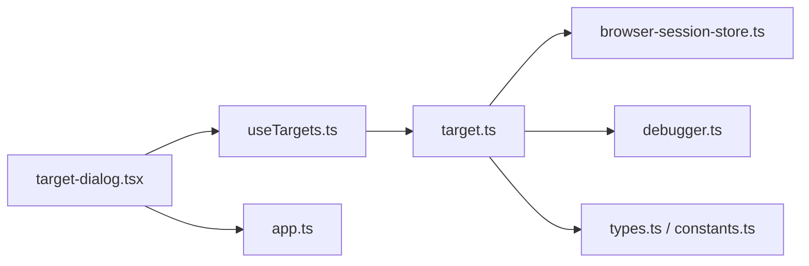

# Target Selector

<cite>
**Referenced Files in This Document**
- [target.ts](file://src/stores/target.ts)
- [useTargets.ts](file://src/hooks/useTargets.ts)
- [target-dialog.tsx](file://src/components/target-dialog.tsx)
- [index.tsx](file://src/layout/index.tsx)
- [app.ts](file://src/stores/app.ts)
- [browser-session-store.ts](file://src/stores/browser-session-store.ts)
- [debugger.ts](file://src/stores/debugger.ts)
- [constants.ts](file://src/pages/browser/constants.ts)
- [types.ts](file://src/pages/browser/types.ts)
</cite>

## Table of Contents
1. [Introduction](#introduction)
2. [Project Structure](#project-structure)
3. [Core Components](#core-components)
4. [Architecture Overview](#architecture-overview)
5. [Detailed Component Analysis](#detailed-component-analysis)
6. [Dependency Analysis](#dependency-analysis)
7. [Performance Considerations](#performance-considerations)
8. [Troubleshooting Guide](#troubleshooting-guide)
9. [Conclusion](#conclusion)

## Introduction
This document explains Apprecon’s Target Selector component and how it manages switching between applications, browser contexts, and debugging targets. It covers target discovery, connection management, context isolation, supported target types (web pages, Node.js processes, mobile devices, remote debugging sessions), advanced scenarios (multi-target debugging, context switching workflows, lifecycle management), setup for external debugging connections, managing multiple development environments, troubleshooting, and security best practices.

## Project Structure
The Target Selector is implemented across a small set of focused modules:
- Store layer for target state and operations
- Hook to consume target state in components
- UI dialog for selecting and configuring targets
- Integration points with browser session and debugger stores
- Page-level constants and types that define target schemas and behaviors

**Diagram sources**
- [target-dialog.tsx](file://src/components/target-dialog.tsx)
- [useTargets.ts](file://src/hooks/useTargets.ts)
- [target.ts](file://src/stores/target.ts)
- [browser-session-store.ts](file://src/stores/browser-session-store.ts)
- [debugger.ts](file://src/stores/debugger.ts)
- [app.ts](file://src/stores/app.ts)
- [types.ts](file://src/pages/browser/types.ts)
- [constants.ts](file://src/pages/browser/constants.ts)

**Section sources**
- [target.ts](file://src/stores/target.ts)
- [useTargets.ts](file://src/hooks/useTargets.ts)
- [target-dialog.tsx](file://src/components/target-dialog.tsx)
- [index.tsx](file://src/layout/index.tsx)
- [app.ts](file://src/stores/app.ts)
- [browser-session-store.ts](file://src/stores/browser-session-store.ts)
- [debugger.ts](file://src/stores/debugger.ts)
- [constants.ts](file://src/pages/browser/constants.ts)
- [types.ts](file://src/pages/browser/types.ts)

## Core Components
- Target Store: Centralized state for active target, discovered targets, connection status, and operations like connect, disconnect, refresh, and switch.
- useTargets Hook: Exposes reactive target state and actions to UI components.
- Target Dialog: User-facing interface to discover, select, configure, and manage targets; supports filtering by type and environment.
- Integration Stores: Browser session store for page/context isolation and debugger store for attaching debug sessions.

Key responsibilities:
- Discover targets via built-in scanners and external endpoints
- Manage connection lifecycle (connect, reconnect, disconnect)
- Enforce context isolation per target
- Persist selected target preferences
- Coordinate multi-target workflows

**Section sources**
- [target.ts](file://src/stores/target.ts)
- [useTargets.ts](file://src/hooks/useTargets.ts)
- [target-dialog.tsx](file://src/components/target-dialog.tsx)
- [browser-session-store.ts](file://src/stores/browser-session-store.ts)
- [debugger.ts](file://src/stores/debugger.ts)

## Architecture Overview
The Target Selector orchestrates the following flows:
- Discovery: Scans local and remote endpoints to build a list of available targets.
- Selection: User selects a target from the dialog; the store validates and prepares connection parameters.
- Connection: Establishes transport (WebSocket or protocol-specific channel) and initializes context isolation.
- Lifecycle: Monitors health, handles reconnection, and tears down resources on disconnect.
- Multi-target: Maintains separate sessions per target with isolated contexts.

**Diagram sources**
- [target-dialog.tsx](file://src/components/target-dialog.tsx)
- [useTargets.ts](file://src/hooks/useTargets.ts)
- [target.ts](file://src/stores/target.ts)
- [browser-session-store.ts](file://src/stores/browser-session-store.ts)
- [debugger.ts](file://src/stores/debugger.ts)

## Detailed Component Analysis

### Target Store (target.ts)
Responsibilities:
- Maintain current target and target registry
- Implement connect/disconnect/refresh/switch operations
- Handle error states and retry logic
- Persist selection and preferences

Key patterns:
- Reactive state updates for UI synchronization
- Idempotent connection attempts with backoff
- Context isolation initialization per target

Complexity considerations:
- O(n) scan over discovered targets during refresh
- Connection establishment cost depends on target type and network latency

Error handling:
- Network timeouts and handshake failures
- Invalid target descriptors
- Permission errors for external connections

Optimization opportunities:
- Cache discovered targets with TTL
- Lazy-initialize heavy transports
- Batch refresh operations

**Section sources**
- [target.ts](file://src/stores/target.ts)

### useTargets Hook (useTargets.ts)
Responsibilities:
- Provide reactive access to target state and actions
- Subscribe to store changes
- Debounce frequent updates for performance

Usage examples:
- Rendering target lists
- Triggering connect/disconnect flows
- Displaying connection status

**Section sources**
- [useTargets.ts](file://src/hooks/useTargets.ts)

### Target Dialog (target-dialog.tsx)
Responsibilities:
- Present discovered targets grouped by type and environment
- Allow filtering and search
- Configure connection parameters (e.g., host, port, token)
- Validate inputs before connecting

UI interactions:
- Click to select and connect
- Toggle advanced options
- Show connection progress and errors

Accessibility:
- Keyboard navigation
- ARIA labels for screen readers

**Section sources**
- [target-dialog.tsx](file://src/components/target-dialog.tsx)

### Browser Session Store (browser-session-store.ts)
Responsibilities:
- Initialize and manage browser contexts per target
- Isolate DOM and runtime state between targets
- Handle page lifecycle events (load, unload, navigate)

Isolation features:
- Separate iframe or worker contexts
- Scoped event listeners and storage
- Independent cookie and cache namespaces

**Section sources**
- [browser-session-store.ts](file://src/stores/browser-session-store.ts)

### Debugger Store (debugger.ts)
Responsibilities:
- Attach to Node.js, Chrome DevTools Protocol, and other debuggers
- Manage breakpoints, logs, and execution control
- Coordinate with target store for lifecycle alignment

Supported protocols:
- WebSockets for remote debugging
- Local pipes for Node.js processes

**Section sources**
- [debugger.ts](file://src/stores/debugger.ts)

### Types and Constants (types.ts, constants.ts)
Responsibilities:
- Define target schema (type, endpoint, auth, capabilities)
- Enumerate supported target types and modes
- Provide default configurations and validation rules

Target types:
- Web page (local or remote)
- Node.js process (local or remote)
- Mobile device (via USB or network bridge)
- Remote debugging session (DevTools protocol)

**Section sources**
- [types.ts](file://src/pages/browser/types.ts)
- [constants.ts](file://src/pages/browser/constants.ts)

## Dependency Analysis
The Target Selector has clear separation of concerns:
- UI depends on hook for state and actions
- Hook depends on store for business logic
- Store depends on browser session and debugger stores for transport and context management
- Types and constants provide shared contracts

**Diagram sources**
- [target-dialog.tsx](file://src/components/target-dialog.tsx)
- [useTargets.ts](file://src/hooks/useTargets.ts)
- [target.ts](file://src/stores/target.ts)
- [browser-session-store.ts](file://src/stores/browser-session-store.ts)
- [debugger.ts](file://src/stores/debugger.ts)
- [types.ts](file://src/pages/browser/types.ts)
- [constants.ts](file://src/pages/browser/constants.ts)
- [app.ts](file://src/stores/app.ts)

**Section sources**
- [target.ts](file://src/stores/target.ts)
- [useTargets.ts](file://src/hooks/useTargets.ts)
- [target-dialog.tsx](file://src/components/target-dialog.tsx)
- [browser-session-store.ts](file://src/stores/browser-session-store.ts)
- [debugger.ts](file://src/stores/debugger.ts)
- [types.ts](file://src/pages/browser/types.ts)
- [constants.ts](file://src/pages/browser/constants.ts)
- [app.ts](file://src/stores/app.ts)

## Performance Considerations
- Discovery caching: Cache target lists with time-to-live to reduce repeated scans.
- Lazy initialization: Defer heavy transport setup until first interaction.
- Debounced updates: Throttle frequent state changes in the hook to avoid excessive re-renders.
- Connection pooling: Reuse established connections where possible.
- Memory isolation: Ensure each target context releases resources on disconnect to prevent leaks.

[No sources needed since this section provides general guidance]

## Troubleshooting Guide
Common issues and resolutions:
- Connection timeout: Verify network reachability, firewall rules, and correct endpoint configuration.
- Authentication failure: Check tokens, certificates, and permissions for external targets.
- Context isolation errors: Ensure unique identifiers per target and verify cleanup on disconnect.
- Multi-target conflicts: Avoid sharing ports or resources across targets; enforce strict isolation.
- External debugging setup: Confirm remote debugging flags are enabled on target processes and allow-listed hosts.

Security considerations:
- Use TLS for all external connections.
- Validate and sanitize all user-provided connection parameters.
- Limit exposure of debugging endpoints to trusted networks.
- Rotate credentials regularly and store secrets securely.

Best practices:
- Prefer least-privilege access for debugging sessions.
- Log connection attempts without sensitive data.
- Monitor and alert on failed authentication or unexpected disconnections.

**Section sources**
- [target.ts](file://src/stores/target.ts)
- [browser-session-store.ts](file://src/stores/browser-session-store.ts)
- [debugger.ts](file://src/stores/debugger.ts)

## Conclusion
Apprecon’s Target Selector provides a robust mechanism for discovering, connecting to, and isolating diverse debugging targets. By separating UI, state, and transport concerns, it supports flexible workflows including multi-target debugging and secure external connections. Following the recommended practices ensures reliable, performant, and secure debugging sessions across web pages, Node.js processes, mobile devices, and remote sessions.

[No sources needed since this section summarizes without analyzing specific files]