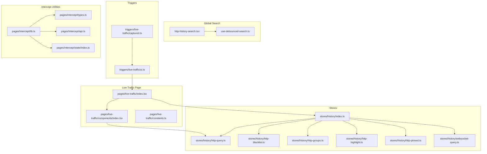
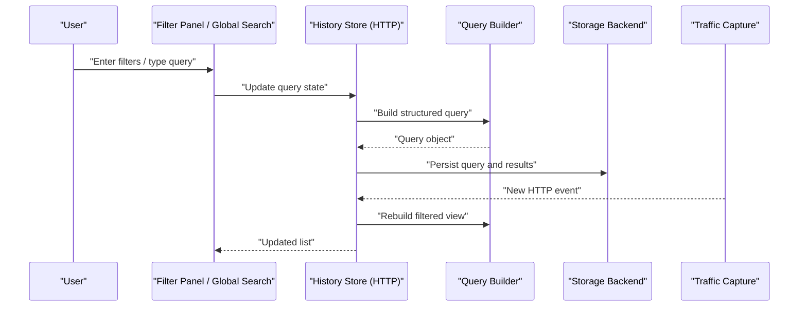
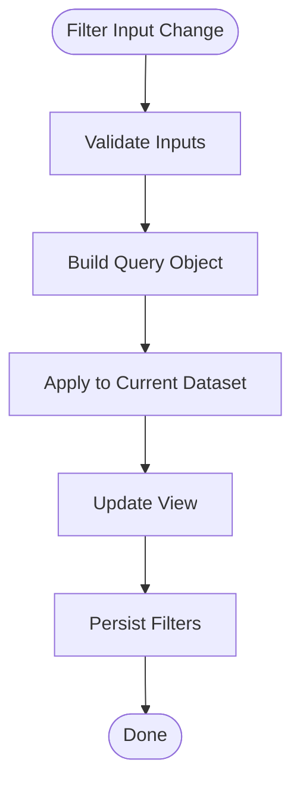
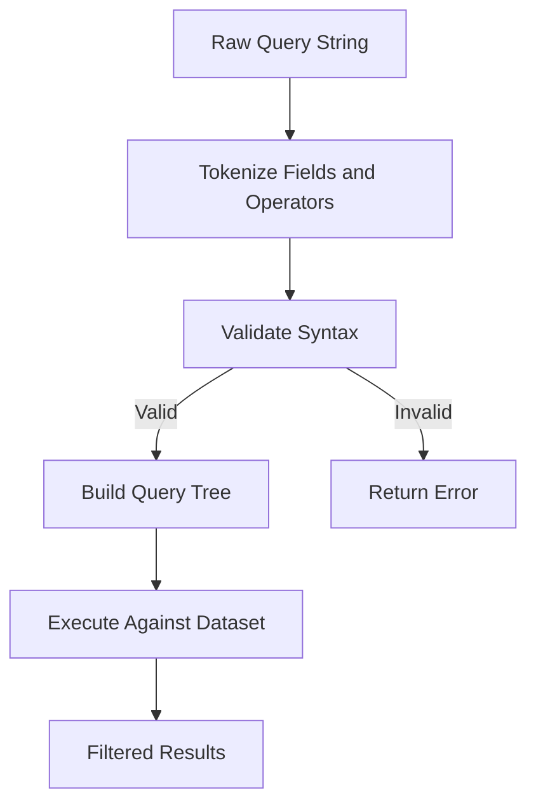
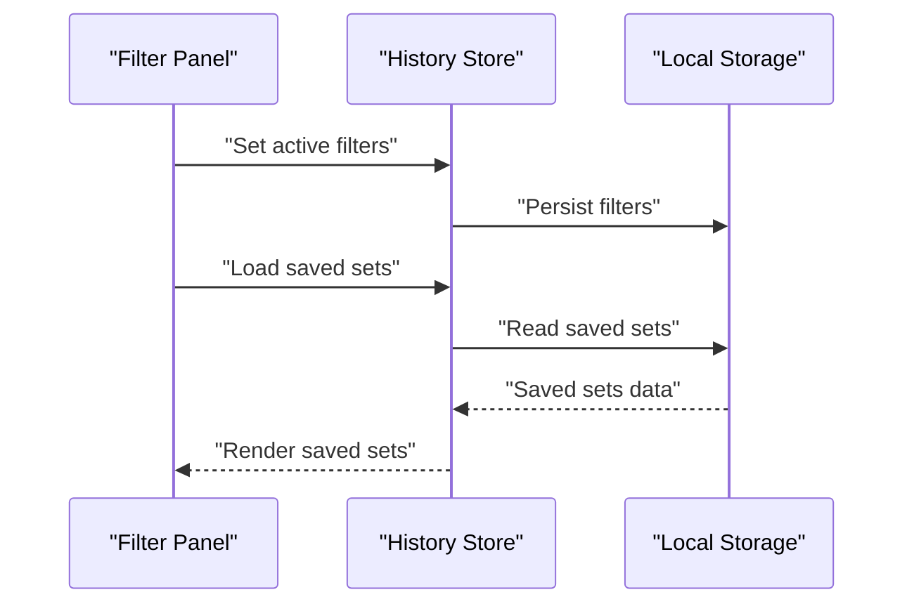
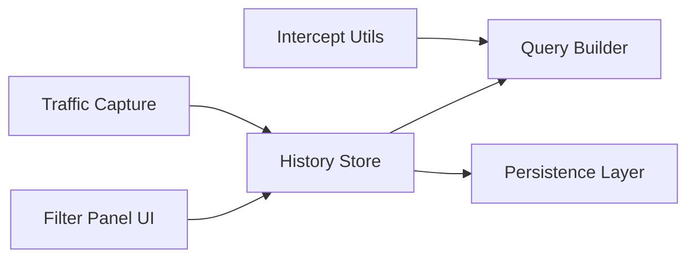

# Filtering & Search System

<cite>
**Referenced Files in This Document**
- [http-history-search.tsx](file://src/layout/global-search/http-history-search.tsx)
- [use-debounced-search.ts](file://src/layout/global-search/use-debounced-search.ts)
- [index.ts](file://src/stores/history/index.ts)
- [http-query.ts](file://src/stores/history/http-query.ts)
- [http-blacklist.ts](file://src/stores/history/http-blacklist.ts)
- [http-groups.ts](file://src/stores/history/http-groups.ts)
- [http-highlight.ts](file://src/stores/history/http-highlight.ts)
- [http-pinned.ts](file://src/stores/history/http-pinned.ts)
- [websocket-query.ts](file://src/stores/history/websocket-query.ts)
- [constants.ts](file://src/pages/live-traffic/constants.ts)
- [index.tsx](file://src/pages/live-traffic/index.tsx)
- [components/index.tsx](file://src/pages/live-traffic/components/index.tsx)
- [lib.ts](file://src/pages/intercept/lib.ts)
- [types.ts](file://src/pages/intercept/types.ts)
- [api.ts](file://src/pages/intercept/api.ts)
- [state/index.ts](file://src/pages/intercept/state/index.ts)
- [captured.ts](file://src/triggers/live-traffic/captured.ts)
- [ui.ts](file://src/triggers/live-traffic/ui.ts)
</cite>

## Table of Contents
1. [Introduction](#introduction)
2. [Project Structure](#project-structure)
3. [Core Components](#core-components)
4. [Architecture Overview](#architecture-overview)
5. [Detailed Component Analysis](#detailed-component-analysis)
6. [Dependency Analysis](#dependency-analysis)
7. [Performance Considerations](#performance-considerations)
8. [Troubleshooting Guide](#troubleshooting-guide)
9. [Conclusion](#conclusion)
10. [Appendices](#appendices)

## Introduction
This document explains the HTTP traffic filtering and search system, focusing on:
- Filter panel capabilities for status codes, domains, content types, methods, and response times
- Advanced search syntax supporting regex patterns, field-specific queries, and boolean operators
- Query builder that translates user filters into efficient database queries
- Filter persistence, saved filter sets, and keyboard shortcuts
- Examples of complex filter combinations and performance considerations for large datasets

The system is implemented across UI components, stores, and triggers to provide a responsive, scalable filtering experience for live and historical HTTP traffic.

## Project Structure
The filtering and search functionality spans several layers:
- Global search integration for quick access
- Live traffic page with dedicated filter panels
- Stores for query state, persistence, and grouping/highlighting/pinning
- Triggers for capturing events and updating UI state
- API and intercept utilities for building and applying filters



**Diagram sources**
- [http-history-search.tsx](file://src/layout/global-search/http-history-search.tsx)
- [use-debounced-search.ts](file://src/layout/global-search/use-debounced-search.ts)
- [index.tsx](file://src/pages/live-traffic/index.tsx)
- [components/index.tsx](file://src/pages/live-traffic/components/index.tsx)
- [constants.ts](file://src/pages/live-traffic/constants.ts)
- [index.ts](file://src/stores/history/index.ts)
- [http-query.ts](file://src/stores/history/http-query.ts)
- [http-blacklist.ts](file://src/stores/history/http-blacklist.ts)
- [http-groups.ts](file://src/stores/history/http-groups.ts)
- [http-highlight.ts](file://src/stores/history/http-highlight.ts)
- [http-pinned.ts](file://src/stores/history/http-pinned.ts)
- [websocket-query.ts](file://src/stores/history/websocket-query.ts)
- [captured.ts](file://src/triggers/live-traffic/captured.ts)
- [ui.ts](file://src/triggers/live-traffic/ui.ts)
- [lib.ts](file://src/pages/intercept/lib.ts)
- [types.ts](file://src/pages/intercept/types.ts)
- [api.ts](file://src/pages/intercept/api.ts)
- [state/index.ts](file://src/pages/intercept/state/index.ts)

**Section sources**
- [http-history-search.tsx](file://src/layout/global-search/http-history-search.tsx)
- [use-debounced-search.ts](file://src/layout/global-search/use-debounced-search.ts)
- [index.tsx](file://src/pages/live-traffic/index.tsx)
- [components/index.tsx](file://src/pages/live-traffic/components/index.tsx)
- [constants.ts](file://src/pages/live-traffic/constants.ts)
- [index.ts](file://src/stores/history/index.ts)
- [http-query.ts](file://src/stores/history/http-query.ts)
- [http-blacklist.ts](file://src/stores/history/http-blacklist.ts)
- [http-groups.ts](file://src/stores/history/http-groups.ts)
- [http-highlight.ts](file://src/stores/history/http-highlight.ts)
- [http-pinned.ts](file://src/stores/history/http-pinned.ts)
- [websocket-query.ts](file://src/stores/history/websocket-query.ts)
- [captured.ts](file://src/triggers/live-traffic/captured.ts)
- [ui.ts](file://src/triggers/live-traffic/ui.ts)
- [lib.ts](file://src/pages/intercept/lib.ts)
- [types.ts](file://src/pages/intercept/types.ts)
- [api.ts](file://src/pages/intercept/api.ts)
- [state/index.ts](file://src/pages/intercept/state/index.ts)

## Core Components
- Filter Panel (Live Traffic): Provides controls for status codes, domains, content types, methods, and response time ranges. It updates the active query stored in the history store.
- Global Search Integration: Offers a unified search input that can target HTTP history entries using advanced syntax.
- Query Store: Centralizes filter state, supports persistence, and exposes APIs for reading/writing queries and saved sets.
- Trigger Layer: Captures incoming HTTP events and applies filters before rendering or persisting.

Key responsibilities:
- Parse and validate user inputs
- Build structured queries compatible with storage backends
- Debounce rapid changes to avoid excessive re-renders
- Persist filters and saved sets across sessions
- Provide keyboard shortcuts for quick actions

**Section sources**
- [components/index.tsx](file://src/pages/live-traffic/components/index.tsx)
- [http-history-search.tsx](file://src/layout/global-search/http-history-search.tsx)
- [index.ts](file://src/stores/history/index.ts)
- [http-query.ts](file://src/stores/history/http-query.ts)
- [captured.ts](file://src/triggers/live-traffic/captured.ts)

## Architecture Overview
The system follows a layered architecture:
- UI Layer: Filter panels and global search input
- State Layer: Stores manage query state, persistence, and derived views
- Event Layer: Triggers capture traffic and update state
- Utility Layer: Intercept helpers build and apply filters efficiently



**Diagram sources**
- [components/index.tsx](file://src/pages/live-traffic/components/index.tsx)
- [index.ts](file://src/stores/history/index.ts)
- [http-query.ts](file://src/stores/history/http-query.ts)
- [captured.ts](file://src/triggers/live-traffic/captured.ts)

## Detailed Component Analysis

### Filter Panel (Status Codes, Domains, Content Types, Methods, Response Times)
- Status Codes: Supports exact matches and ranges; integrates with method selection to refine results.
- Domains: Supports substring and regex matching; allows excluding specific hosts.
- Content Types: Filters by MIME types or patterns; supports wildcards.
- Methods: Selects HTTP methods (GET, POST, etc.) and supports negation.
- Response Times: Range-based filtering with min/max thresholds.

Behavior:
- Changes are debounced to reduce re-renders
- Combined with global search text for compound queries
- Persists current filter set automatically



**Diagram sources**
- [components/index.tsx](file://src/pages/live-traffic/components/index.tsx)
- [http-query.ts](file://src/stores/history/http-query.ts)

**Section sources**
- [components/index.tsx](file://src/pages/live-traffic/components/index.tsx)
- [constants.ts](file://src/pages/live-traffic/constants.ts)

### Advanced Search Syntax
Supported features:
- Field-specific queries: e.g., domain:, method:, status:, contentType:, duration:
- Regex patterns: Enclosed in quotes or delimiters depending on context
- Boolean operators: AND, OR, NOT for combining conditions
- Negation: Prefix fields or expressions with - or NOT
- Escaping: Use backslash to escape special characters within values

Examples:
- Find all 5xx errors from a specific domain: status:5xx AND domain:example.com
- Exclude JSON responses with long durations: contentType:application/json NOT duration:>5000
- Match URLs containing a pattern: url:/api/v[0-9]+/users/

Parsing and execution:
- The parser tokenizes input into fields and operators
- Validates syntax and raises errors for invalid constructs
- Builds a structured query tree used by the query builder



**Diagram sources**
- [http-history-search.tsx](file://src/layout/global-search/http-history-search.tsx)
- [http-query.ts](file://src/stores/history/http-query.ts)

**Section sources**
- [http-history-search.tsx](file://src/layout/global-search/http-history-search.tsx)
- [http-query.ts](file://src/stores/history/http-query.ts)

### Query Builder
Responsibilities:
- Translate user filters into optimized queries
- Support field-specific lookups and range queries
- Combine multiple conditions with boolean logic
- Generate backend-compatible structures for storage

Optimization strategies:
- Early pruning of non-matching records
- Index-friendly field mappings where applicable
- Batched updates for large datasets

```mermaid
classDiagram
class QueryBuilder {
+build(filters) Query
+apply(query, dataset) Dataset
+optimize(query) Query
+validate(query) bool
}
class FilterState {
+statusCodes : string[]
+domains : string[]
+contentTypes : string[]
+methods : string[]
+responseTimeRange : {min : number, max : number}
+textQuery : string
}
QueryBuilder --> FilterState : "consumes"
```

**Diagram sources**
- [http-query.ts](file://src/stores/history/http-query.ts)
- [index.ts](file://src/stores/history/index.ts)

**Section sources**
- [http-query.ts](file://src/stores/history/http-query.ts)
- [index.ts](file://src/stores/history/index.ts)

### Filter Persistence and Saved Sets
Persistence:
- Active filters are saved automatically to local storage
- Saved filter sets allow quick switching between common configurations
- Import/export support for sharing filter sets

Saved sets:
- Named collections of filters
- Versioned to handle schema changes
- Merged with current session state on load



**Diagram sources**
- [index.ts](file://src/stores/history/index.ts)
- [http-query.ts](file://src/stores/history/http-query.ts)

**Section sources**
- [index.ts](file://src/stores/history/index.ts)
- [http-query.ts](file://src/stores/history/http-query.ts)

### Keyboard Shortcuts
Shortcuts:
- Focus filter input: Ctrl/Cmd + K
- Clear all filters: Escape
- Toggle saved sets: Ctrl/Cmd + S
- Quick search mode: Slash (/)

Implementation:
- Global key listener registered at app startup
- Context-aware handling based on active panel
- Prevents default browser behavior when appropriate

**Section sources**
- [http-history-search.tsx](file://src/layout/global-search/http-history-search.tsx)
- [index.tsx](file://src/pages/live-traffic/index.tsx)

### Complex Filter Combinations
Examples:
- High error rate endpoints: status:5xx AND domain:api.example.com AND duration:>3000
- Non-JSON responses with redirects: contentType:!application/json AND status:3xx
- Specific API paths with method constraints: url:/v2/users AND method:POST AND status:201

Execution flow:
- Parser validates and tokenizes each condition
- Query builder combines conditions using boolean logic
- Optimizer prunes unnecessary checks
- Results are streamed to UI with incremental updates

**Section sources**
- [http-query.ts](file://src/stores/history/http-query.ts)
- [components/index.tsx](file://src/pages/live-traffic/components/index.tsx)

## Dependency Analysis
The filtering system depends on several modules:
- UI components depend on stores for state management
- Stores depend on query builders for transformation
- Triggers feed new data into the pipeline
- Utilities provide helper functions for parsing and validation



**Diagram sources**
- [components/index.tsx](file://src/pages/live-traffic/components/index.tsx)
- [index.ts](file://src/stores/history/index.ts)
- [http-query.ts](file://src/stores/history/http-query.ts)
- [captured.ts](file://src/triggers/live-traffic/captured.ts)
- [lib.ts](file://src/pages/intercept/lib.ts)

**Section sources**
- [components/index.tsx](file://src/pages/live-traffic/components/index.tsx)
- [index.ts](file://src/stores/history/index.ts)
- [http-query.ts](file://src/stores/history/http-query.ts)
- [captured.ts](file://src/triggers/live-traffic/captured.ts)
- [lib.ts](file://src/pages/intercept/lib.ts)

## Performance Considerations
For large datasets:
- Use debounced updates to prevent excessive re-renders
- Implement virtual scrolling for long lists
- Optimize query construction to minimize full scans
- Leverage indexing on frequently queried fields
- Stream results incrementally instead of loading all at once

Memory management:
- Clean up unused filter states periodically
- Avoid retaining large intermediate datasets
- Use efficient data structures for filtering operations

Caching strategies:
- Cache parsed queries to avoid repeated parsing
- Memoize expensive filter computations
- Invalidate cache on schema changes

**Section sources**
- [use-debounced-search.ts](file://src/layout/global-search/use-debounced-search.ts)
- [http-query.ts](file://src/stores/history/http-query.ts)

## Troubleshooting Guide
Common issues:
- Invalid syntax in advanced queries: Check field names and operator usage
- Slow performance: Verify index usage and consider simplifying queries
- Filters not persisting: Ensure storage permissions and quota limits
- Keyboard shortcuts not working: Check focus state and event listeners

Debugging steps:
- Inspect query object structure in developer tools
- Log filter application steps to identify bottlenecks
- Test individual conditions separately
- Verify storage serialization/deserialization

Error handling:
- Graceful degradation when storage fails
- Fallback to client-side filtering when backend is unavailable
- Clear error messages with actionable suggestions

**Section sources**
- [http-query.ts](file://src/stores/history/http-query.ts)
- [index.ts](file://src/stores/history/index.ts)

## Conclusion
The HTTP traffic filtering and search system provides a comprehensive solution for analyzing network requests through an intuitive interface. With advanced search capabilities, efficient query building, and robust persistence, it enables users to quickly locate relevant traffic patterns. The modular architecture ensures scalability and maintainability while supporting complex filtering scenarios.

## Appendices

### Filter Field Reference
- status: HTTP status code or range (e.g., 200, 4xx, 500-599)
- domain: Hostname or pattern (supports regex)
- contentType: MIME type or wildcard (e.g., application/json, image/*)
- method: HTTP method (GET, POST, PUT, DELETE, etc.)
- duration: Response time in milliseconds (supports ranges)
- url: URL path or pattern (supports regex)
- headers: Header name/value pairs
- body: Request/response body content

### Saved Filter Set Operations
- Create: Save current filters with a descriptive name
- Edit: Modify existing filter sets
- Delete: Remove unwanted filter sets
- Import/Export: Share configurations between environments

### Keyboard Shortcut Reference
- Ctrl/Cmd + K: Focus filter input
- Escape: Clear all filters
- Ctrl/Cmd + S: Toggle saved sets
- Slash: Open quick search mode