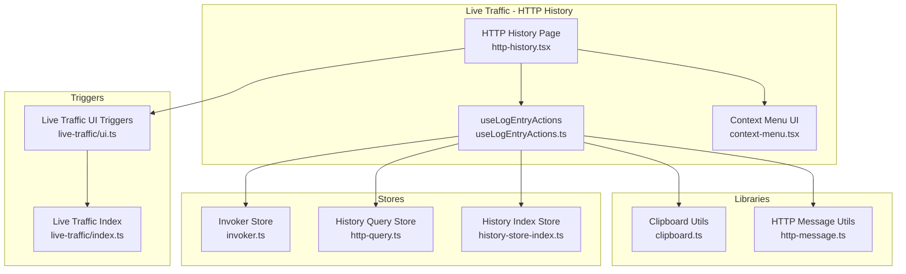
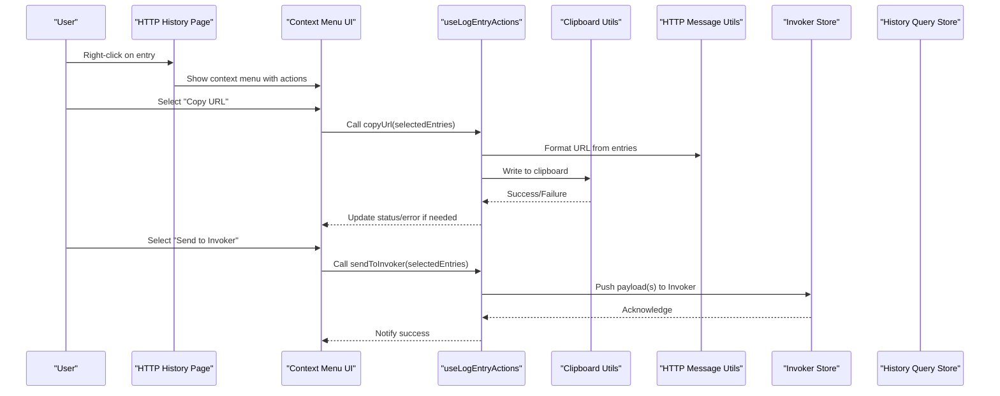
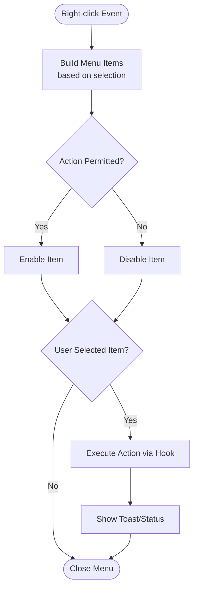
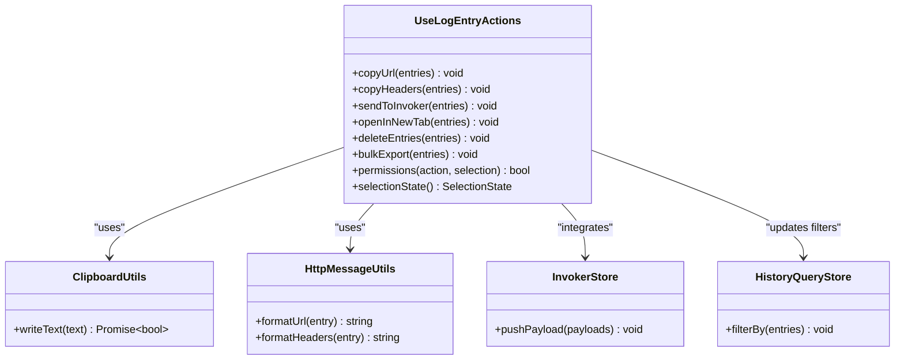
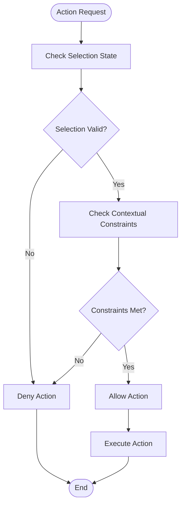
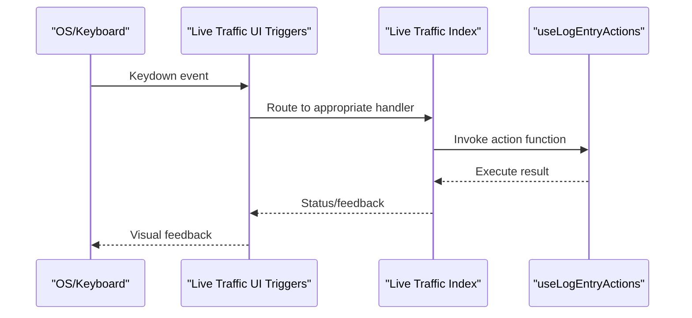
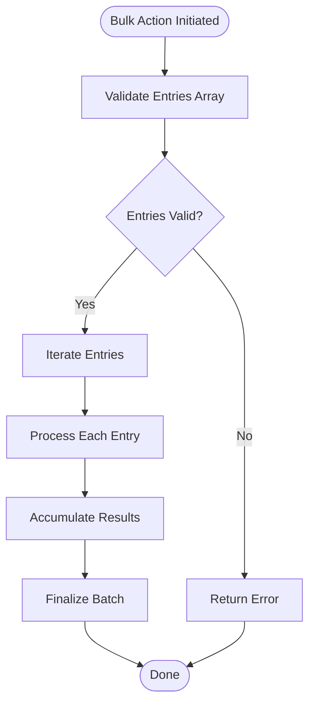
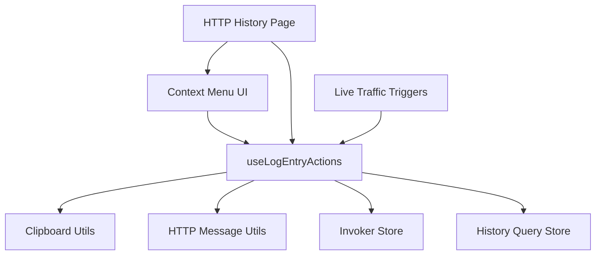

# Context Menu & Actions

<cite>
**Referenced Files in This Document**
- [http-history.tsx](file://src/pages/live-traffic/http-history/index.tsx)
- [useLogEntryActions.ts](file://src/pages/live-traffic/http-history/hooks/useLogEntryActions.ts)
- [context-menu.tsx](file://src/components/ui/context-menu.tsx)
- [clipboard.ts](file://src/lib/clipboard.ts)
- [http-message.ts](file://src/lib/http-message.ts)
- [invoker.ts](file://src/stores/invoker.ts)
- [history-store-index.ts](file://src/stores/history/index.ts)
- [http-query.ts](file://src/stores/history/http-query.ts)
- [ui.ts](file://src/triggers/live-traffic/ui.ts)
- [index.ts](file://src/triggers/live-traffic/index.ts)
</cite>

## Table of Contents
1. [Introduction](#introduction)
2. [Project Structure](#project-structure)
3. [Core Components](#core-components)
4. [Architecture Overview](#architecture-overview)
5. [Detailed Component Analysis](#detailed-component-analysis)
6. [Dependency Analysis](#dependency-analysis)
7. [Performance Considerations](#performance-considerations)
8. [Troubleshooting Guide](#troubleshooting-guide)
9. [Conclusion](#conclusion)
10. [Appendices](#appendices)

## Introduction
This document explains the context menu system and action handlers for HTTP history entries. It covers the right-click menu implementation, the useLogEntryActions hook that centralizes actions and state, the permission model for actions, keyboard shortcuts, bulk operations, and how to add custom actions or integrate with other features like the Invoker.

## Project Structure
The HTTP history feature is implemented under the live-traffic page. The key files include:
- A page component that renders the history list and integrates the context menu
- A hook that provides action functions and manages selection/state
- UI primitives for context menus
- Utilities for clipboard and HTTP message formatting
- Stores for invoker integration and history query/filtering
- Trigger hooks for global keyboard shortcuts and UI events

**Diagram sources**
- [http-history.tsx](file://src/pages/live-traffic/http-history/index.tsx)
- [useLogEntryActions.ts](file://src/pages/live-traffic/http-history/hooks/useLogEntryActions.ts)
- [context-menu.tsx](file://src/components/ui/context-menu.tsx)
- [clipboard.ts](file://src/lib/clipboard.ts)
- [http-message.ts](file://src/lib/http-message.ts)
- [invoker.ts](file://src/stores/invoker.ts)
- [http-query.ts](file://src/stores/history/http-query.ts)
- [history-store-index.ts](file://src/stores/history/index.ts)
- [ui.ts](file://src/triggers/live-traffic/ui.ts)
- [index.ts](file://src/triggers/live-traffic/index.ts)

**Section sources**
- [http-history.tsx](file://src/pages/live-traffic/http-history/index.tsx)
- [useLogEntryActions.ts](file://src/pages/live-traffic/http-history/hooks/useLogEntryActions.ts)
- [context-menu.tsx](file://src/components/ui/context-menu.tsx)
- [clipboard.ts](file://src/lib/clipboard.ts)
- [http-message.ts](file://src/lib/http-message.ts)
- [invoker.ts](file://src/stores/invoker.ts)
- [http-query.ts](file://src/stores/history/http-query.ts)
- [history-store-index.ts](file://src/stores/history/index.ts)
- [ui.ts](file://src/triggers/live-traffic/ui.ts)
- [index.ts](file://src/triggers/live-traffic/index.ts)

## Core Components
- Context menu UI: Provides a reusable right-click menu component used by the HTTP history list to show options such as Copy URL, Copy Headers, Send to Invoker, and more.
- useLogEntryActions hook: Centralizes all actions available on an HTTP log entry (single or multiple selections), including copy, send, open, delete, and bulk operations. It also manages selection state and permissions for each action.
- Clipboard and HTTP utilities: Helpers to format request/response data and write to the system clipboard.
- Stores: Integration points for sending entries to the Invoker and managing history queries/filters.
- Trigger hooks: Global keyboard shortcuts and UI event wiring for quick access to common actions.

**Section sources**
- [context-menu.tsx](file://src/components/ui/context-menu.tsx)
- [useLogEntryActions.ts](file://src/pages/live-traffic/http-history/hooks/useLogEntryActions.ts)
- [clipboard.ts](file://src/lib/clipboard.ts)
- [http-message.ts](file://src/lib/http-message.ts)
- [invoker.ts](file://src/stores/invoker.ts)
- [http-query.ts](file://src/stores/history/http-query.ts)
- [history-store-index.ts](file://src/stores/history/index.ts)
- [ui.ts](file://src/triggers/live-traffic/ui.ts)
- [index.ts](file://src/triggers/live-traffic/index.ts)

## Architecture Overview
The context menu workflow connects the UI layer to business logic via the hook and stores:

**Diagram sources**
- [http-history.tsx](file://src/pages/live-traffic/http-history/index.tsx)
- [context-menu.tsx](file://src/components/ui/context-menu.tsx)
- [useLogEntryActions.ts](file://src/pages/live-traffic/http-history/hooks/useLogEntryActions.ts)
- [clipboard.ts](file://src/lib/clipboard.ts)
- [http-message.ts](file://src/lib/http-message.ts)
- [invoker.ts](file://src/stores/invoker.ts)

## Detailed Component Analysis

### Context Menu UI
- Purpose: Renders a right-click menu with items bound to actions provided by the hook. Items can be enabled/disabled based on selection and permissions.
- Behavior: Supports single and multi-selection contexts; shows/hides items conditionally; handles keyboard navigation and focus management.
- Integration: Consumed by the HTTP history list to present contextual operations.

**Diagram sources**
- [context-menu.tsx](file://src/components/ui/context-menu.tsx)
- [useLogEntryActions.ts](file://src/pages/live-traffic/http-history/hooks/useLogEntryActions.ts)

**Section sources**
- [context-menu.tsx](file://src/components/ui/context-menu.tsx)

### useLogEntryActions Hook
- Responsibilities:
  - Provide action functions for single and multiple selected entries (e.g., copy URL, copy headers, send to Invoker, open in new tab, delete).
  - Manage selection state and derived permissions for each action.
  - Coordinate with clipboard and HTTP message utilities to format content.
  - Integrate with stores to perform side effects (e.g., sending to Invoker, updating filters).
- Key behaviors:
  - Permission checks: Determine if an action is allowed based on current selection and application state.
  - Bulk support: Accept arrays of entries to perform batch operations efficiently.
  - Keyboard shortcuts: Expose functions triggered by global hotkeys.
  - Error handling: Centralized error reporting and user feedback.

**Diagram sources**
- [useLogEntryActions.ts](file://src/pages/live-traffic/http-history/hooks/useLogEntryActions.ts)
- [clipboard.ts](file://src/lib/clipboard.ts)
- [http-message.ts](file://src/lib/http-message.ts)
- [invoker.ts](file://src/stores/invoker.ts)
- [http-query.ts](file://src/stores/history/http-query.ts)

**Section sources**
- [useLogEntryActions.ts](file://src/pages/live-traffic/http-history/hooks/useLogEntryActions.ts)
- [clipboard.ts](file://src/lib/clipboard.ts)
- [http-message.ts](file://src/lib/http-message.ts)
- [invoker.ts](file://src/stores/invoker.ts)
- [http-query.ts](file://src/stores/history/http-query.ts)

### Permission System
- Rationale: Prevent invalid or unsafe actions when no entries are selected or when certain conditions are not met.
- Implementation: Each action exposes a permission check function that evaluates the current selection and app state. The context menu uses these checks to enable/disable items.
- Extensibility: New actions should define their permission logic to ensure correct UI behavior.

**Diagram sources**
- [useLogEntryActions.ts](file://src/pages/live-traffic/http-history/hooks/useLogEntryActions.ts)

**Section sources**
- [useLogEntryActions.ts](file://src/pages/live-traffic/http-history/hooks/useLogEntryActions.ts)

### Keyboard Shortcuts
- Global shortcuts are wired through trigger hooks to quickly execute common actions without using the mouse.
- Typical shortcuts include copying URLs, headers, and sending entries to the Invoker.
- The trigger index aggregates shortcuts across modules to avoid conflicts.

**Diagram sources**
- [ui.ts](file://src/triggers/live-traffic/ui.ts)
- [index.ts](file://src/triggers/live-traffic/index.ts)
- [useLogEntryActions.ts](file://src/pages/live-traffic/http-history/hooks/useLogEntryActions.ts)

**Section sources**
- [ui.ts](file://src/triggers/live-traffic/ui.ts)
- [index.ts](file://src/triggers/live-traffic/index.ts)
- [useLogEntryActions.ts](file://src/pages/live-traffic/http-history/hooks/useLogEntryActions.ts)

### Bulk Operations
- The hook supports passing arrays of entries to actions, enabling efficient batch processing.
- Examples include bulk copy, bulk export, and bulk deletion.
- Performance considerations: Avoid blocking the UI thread; process large batches asynchronously where possible.

**Diagram sources**
- [useLogEntryActions.ts](file://src/pages/live-traffic/http-history/hooks/useLogEntryActions.ts)

**Section sources**
- [useLogEntryActions.ts](file://src/pages/live-traffic/http-history/hooks/useLogEntryActions.ts)

### Adding Custom Actions
- Steps to add a new action:
  - Implement the action function in the hook with proper permission checks.
  - Add a corresponding menu item in the context menu component.
  - Wire any necessary store integrations or utility calls.
  - Optionally expose a keyboard shortcut via trigger hooks.
- Best practices:
  - Keep permission logic explicit and testable.
  - Ensure consistent user feedback (toasts/errors).
  - Support both single and bulk entry usage.

**Section sources**
- [useLogEntryActions.ts](file://src/pages/live-traffic/http-history/hooks/useLogEntryActions.ts)
- [context-menu.tsx](file://src/components/ui/context-menu.tsx)
- [ui.ts](file://src/triggers/live-traffic/ui.ts)

### Integrating with Other Features
- Invoker integration: Send one or multiple HTTP entries as payloads to the Invoker for further automation or testing.
- History filtering: Update query filters to isolate related entries after performing actions.
- Clipboard workflows: Export formatted data for external tools or documentation.

**Section sources**
- [invoker.ts](file://src/stores/invoker.ts)
- [http-query.ts](file://src/stores/history/http-query.ts)
- [clipboard.ts](file://src/lib/clipboard.ts)
- [http-message.ts](file://src/lib/http-message.ts)

## Dependency Analysis
The context menu and actions depend on several modules:

**Diagram sources**
- [context-menu.tsx](file://src/components/ui/context-menu.tsx)
- [useLogEntryActions.ts](file://src/pages/live-traffic/http-history/hooks/useLogEntryActions.ts)
- [clipboard.ts](file://src/lib/clipboard.ts)
- [http-message.ts](file://src/lib/http-message.ts)
- [invoker.ts](file://src/stores/invoker.ts)
- [http-query.ts](file://src/stores/history/http-query.ts)
- [http-history.tsx](file://src/pages/live-traffic/http-history/index.tsx)
- [ui.ts](file://src/triggers/live-traffic/ui.ts)

**Section sources**
- [context-menu.tsx](file://src/components/ui/context-menu.tsx)
- [useLogEntryActions.ts](file://src/pages/live-traffic/http-history/hooks/useLogEntryActions.ts)
- [clipboard.ts](file://src/lib/clipboard.ts)
- [http-message.ts](file://src/lib/http-message.ts)
- [invoker.ts](file://src/stores/invoker.ts)
- [http-query.ts](file://src/stores/history/http-query.ts)
- [http-history.tsx](file://src/pages/live-traffic/http-history/index.tsx)
- [ui.ts](file://src/triggers/live-traffic/ui.ts)

## Performance Considerations
- Batch operations: Prefer iterating over arrays once and accumulating results to minimize re-renders and redundant work.
- Asynchronous tasks: Offload heavy formatting or I/O operations to background processes where feasible.
- Debounce input: If actions involve search or filter updates, debounce to reduce frequent store writes.
- Memory usage: Avoid holding large strings in memory unnecessarily; stream or chunk data when exporting.

[No sources needed since this section provides general guidance]

## Troubleshooting Guide
- Clipboard failures:
  - Verify browser permissions and environment constraints.
  - Handle errors gracefully and inform users.
- Invalid selection:
  - Ensure permission checks prevent actions when no entries are selected.
  - Provide clear feedback when actions are disabled.
- Invoker integration issues:
  - Confirm payload structure matches Invoker expectations.
  - Log errors and surface them to the user.
- Keyboard shortcut conflicts:
  - Review trigger registrations to avoid overlapping keys.
  - Test across platforms due to differing key mappings.

**Section sources**
- [clipboard.ts](file://src/lib/clipboard.ts)
- [useLogEntryActions.ts](file://src/pages/live-traffic/http-history/hooks/useLogEntryActions.ts)
- [invoker.ts](file://src/stores/invoker.ts)
- [ui.ts](file://src/triggers/live-traffic/ui.ts)

## Conclusion
The HTTP history context menu and actions provide a robust, extensible system for interacting with captured requests. The useLogEntryActions hook centralizes logic, permissions, and state, while the context menu UI offers intuitive access to operations. With keyboard shortcuts, bulk support, and integrations like the Invoker, users can efficiently analyze and automate traffic inspection workflows.

[No sources needed since this section summarizes without analyzing specific files]

## Appendices
- Example scenarios:
  - Copy URL: Select one or multiple entries and copy their URLs to the clipboard.
  - Copy Headers: Extract and copy header blocks for debugging or documentation.
  - Send to Invoker: Transform entries into Invoker payloads for automated testing.
  - Delete entries: Remove selected entries from history with confirmation if required.
  - Bulk export: Export selected entries in a structured format for external analysis.

[No sources needed since this section provides general guidance]